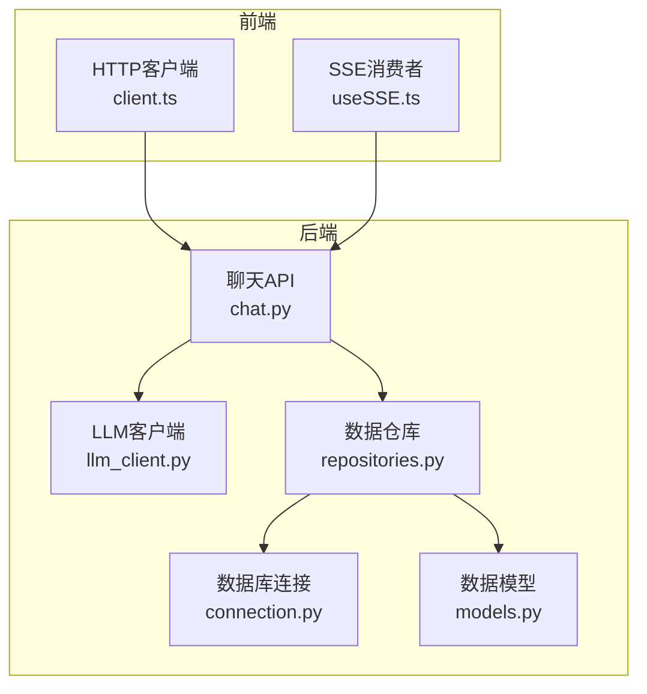
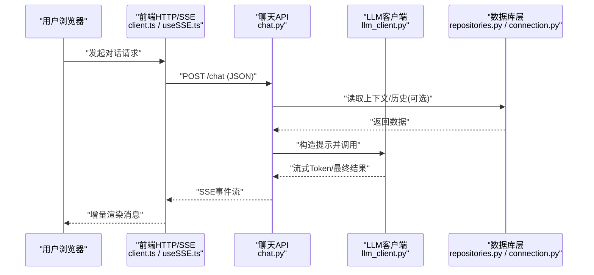
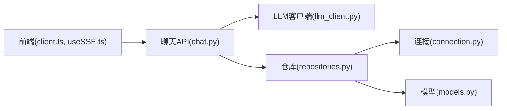

# 性能测试

<cite>
**本文引用的文件**   
- [src/loopse/api/chat.py](file://src/loopse/api/chat.py)
- [src/loopse/core/llm_client.py](file://src/loopse/core/llm_client.py)
- [src/loopse/db/connection.py](file://src/loopse/db/connection.py)
- [src/loopse/db/models.py](file://src/loopse/db/models.py)
- [src/loopse/db/repositories.py](file://src/loopse/db/repositories.py)
- [frontend/src/api/client.ts](file://frontend/src/api/client.ts)
- [frontend/src/composables/useSSE.ts](file://frontend/src/composables/useSSE.ts)
- [start.sh](file://start.sh)
</cite>

## 目录
1. [简介](#简介)
2. [项目结构](#项目结构)
3. [核心组件](#核心组件)
4. [架构总览](#架构总览)
5. [详细组件分析](#详细组件分析)
6. [依赖分析](#依赖分析)
7. [性能考虑](#性能考虑)
8. [故障排查指南](#故障排查指南)
9. [结论](#结论)
10. [附录](#附录)

## 简介
本指南面向工程团队，提供端到端的性能测试实施方法，覆盖负载、压力与稳定性测试；聚焦LLM调用、数据库查询与前端渲染三大关键路径的性能优化与验证。文档包含指标定义、场景设计、工具使用（JMeter、Locust）、基准设置、瓶颈分析与优化建议，以及内存泄漏检测、CPU监控、网络延迟测试、持续性能监控与自动化回归的配置要点。

## 项目结构
本项目为前后端分离架构：
- 后端：FastAPI服务，提供聊天、资源生成、诊断等API；通过数据库连接层访问持久化存储；封装LLM客户端用于大模型调用。
- 前端：Vue应用，通过HTTP与SSE与后端交互，负责页面渲染与用户交互。
- 启动脚本：统一入口，便于在CI或本地快速拉起服务。

**图示来源**
- [src/loopse/api/chat.py](file://src/loopse/api/chat.py)
- [src/loopse/core/llm_client.py](file://src/loopse/core/llm_client.py)
- [src/loopse/db/connection.py](file://src/loopse/db/connection.py)
- [src/loopse/db/repositories.py](file://src/loopse/db/repositories.py)
- [src/loopse/db/models.py](file://src/loopse/db/models.py)
- [frontend/src/api/client.ts](file://frontend/src/api/client.ts)
- [frontend/src/composables/useSSE.ts](file://frontend/src/composables/useSSE.ts)

**章节来源**
- [start.sh](file://start.sh)

## 核心组件
- 聊天API：承载对话请求路由、参数校验、流式响应与业务编排，是性能测试的关键入口。
- LLM客户端：封装外部大模型调用，关注超时、重试、并发与限流策略。
- 数据库层：连接管理、ORM模型与仓库抽象，关注连接池、索引与查询计划。
- 前端HTTP/SSE：关注请求合并、去抖节流、SSE重连与渲染批处理。

**章节来源**
- [src/loopse/api/chat.py](file://src/loopse/api/chat.py)
- [src/loopse/core/llm_client.py](file://src/loopse/core/llm_client.py)
- [src/loopse/db/connection.py](file://src/loopse/db/connection.py)
- [src/loopse/db/repositories.py](file://src/loopse/db/repositories.py)
- [src/loopse/db/models.py](file://src/loopse/db/models.py)
- [frontend/src/api/client.ts](file://frontend/src/api/client.ts)
- [frontend/src/composables/useSSE.ts](file://frontend/src/composables/useSSE.ts)

## 架构总览
下图展示一次典型聊天请求的端到端流程，包括SSE流式返回，适用于负载与压力测试的场景建模。

**图示来源**
- [src/loopse/api/chat.py](file://src/loopse/api/chat.py)
- [src/loopse/core/llm_client.py](file://src/loopse/core/llm_client.py)
- [src/loopse/db/repositories.py](file://src/loopse/db/repositories.py)
- [src/loopse/db/connection.py](file://src/loopse/db/connection.py)
- [frontend/src/api/client.ts](file://frontend/src/api/client.ts)
- [frontend/src/composables/useSSE.ts](file://frontend/src/composables/useSSE.ts)

## 详细组件分析

### 聊天API（负载与压力测试主入口）
- 职责：接收请求、鉴权与参数校验、编排LLM与DB、返回SSE流。
- 性能关注点：
  - 并发处理能力与线程/进程模型
  - SSE背压与客户端消费速率匹配
  - 错误码与降级策略对吞吐的影响
- 测试建议：
  - 以“每秒请求数(RPS)”和“P95/P99延迟”为核心指标
  - 逐步加压至系统饱和，观察错误率与资源占用拐点
  - 针对长会话与短会话分别建模

**章节来源**
- [src/loopse/api/chat.py](file://src/loopse/api/chat.py)

### LLM客户端（大模型调用优化）
- 职责：封装外部模型调用、重试、超时控制、并发与限流。
- 性能关注点：
  - 外部服务RTT与令牌输出速度
  - 并发度、队列长度与背压
  - 失败重试退避与熔断
- 优化策略：
  - 合理设置并发上限与超时阈值
  - 启用缓存（如相似问题/模板命中）
  - 分片/增量输出与前端SSE配合降低首字节时间(TTFB)
- 测试建议：
  - 模拟不同并发与超时配置下的吞吐与延迟
  - 注入外部服务抖动与超时，验证回退与恢复

**章节来源**
- [src/loopse/core/llm_client.py](file://src/loopse/core/llm_client.py)

### 数据库层（连接、模型与仓库）
- 职责：连接池管理、ORM映射、查询封装。
- 性能关注点：
  - 连接池大小与等待时间
  - N+1查询、缺失索引、全表扫描
  - 事务粒度与锁竞争
- 优化策略：
  - 基于慢查询日志定位热点SQL，补充索引
  - 批量读写与分页游标
  - 读写分离与只读副本（若适用）
- 测试建议：
  - 混合读写比例的压力场景
  - 观察连接池耗尽与死锁风险

**章节来源**
- [src/loopse/db/connection.py](file://src/loopse/db/connection.py)
- [src/loopse/db/models.py](file://src/loopse/db/models.py)
- [src/loopse/db/repositories.py](file://src/loopse/db/repositories.py)

### 前端HTTP与SSE（渲染与网络）
- 职责：HTTP请求封装、SSE事件消费与增量渲染。
- 性能关注点：
  - 请求合并、去抖节流
  - SSE断线重连与幂等处理
  - 渲染批处理与虚拟列表
- 优化策略：
  - 减少不必要的重绘与布局抖动
  - 按需加载与懒渲染
- 测试建议：
  - 弱网与高丢包环境下的SSE稳定性
  - 大数据量消息的渲染帧率与内存占用

**章节来源**
- [frontend/src/api/client.ts](file://frontend/src/api/client.ts)
- [frontend/src/composables/useSSE.ts](file://frontend/src/composables/useSSE.ts)

## 依赖分析
- 模块耦合：
  - API层依赖LLM与DB仓库，形成两条主要耗时路径
  - 前端仅依赖API契约，解耦良好
- 外部依赖：
  - LLM服务：网络延迟与可用性是关键变量
  - 数据库：连接池与索引决定吞吐上限
- 潜在环依赖：无直接循环导入迹象，但需关注运行时动态导入

**图示来源**
- [frontend/src/api/client.ts](file://frontend/src/api/client.ts)
- [frontend/src/composables/useSSE.ts](file://frontend/src/composables/useSSE.ts)
- [src/loopse/api/chat.py](file://src/loopse/api/chat.py)
- [src/loopse/core/llm_client.py](file://src/loopse/core/llm_client.py)
- [src/loopse/db/repositories.py](file://src/loopse/db/repositories.py)
- [src/loopse/db/connection.py](file://src/loopse/db/connection.py)
- [src/loopse/db/models.py](file://src/loopse/db/models.py)

**章节来源**
- [src/loopse/api/chat.py](file://src/loopse/api/chat.py)
- [src/loopse/core/llm_client.py](file://src/loopse/core/llm_client.py)
- [src/loopse/db/repositories.py](file://src/loopse/db/repositories.py)
- [src/loopse/db/connection.py](file://src/loopse/db/connection.py)
- [src/loopse/db/models.py](file://src/loopse/db/models.py)
- [frontend/src/api/client.ts](file://frontend/src/api/client.ts)
- [frontend/src/composables/useSSE.ts](file://frontend/src/composables/useSSE.ts)

## 性能考虑

### 目标与指标定义
- 通用指标
  - 吞吐量：RPS、TPS
  - 延迟：平均、P95、P99、最大
  - 错误率：5xx、超时、重试失败
  - 资源：CPU、内存、GC/回收、I/O、网络带宽
- 分层指标
  - 前端：首屏时间、TTI、FPS、内存峰值、重排次数
  - 接口：TTFB、端到端RTT、SSE首事件时间
  - LLM：首Token时间、输出速率、失败率
  - 数据库：QPS、慢查询占比、连接池等待、锁等待

### 测试场景设计
- 负载测试
  - 稳定并发下验证SLA（P95/P99、错误率）
  - 典型用户画像：短会话/长会话、图文/纯文本
- 压力测试
  - 阶梯加压直至系统饱和，记录拐点与降级行为
  - 极端条件：外部LLM抖动、DB连接池耗尽
- 稳定性测试
  - 长时间运行（如72小时），关注内存泄漏、连接泄漏与碎片化
  - 随机故障注入与自动恢复

### LLM调用性能优化
- 并发与限流：限制并发窗口，避免下游过载
- 超时与重试：指数退避、熔断与短路
- 缓存：相似问题/模板命中，减少重复调用
- 流式输出：结合SSE降低首字节时间

### 数据库查询优化
- 索引与执行计划：基于慢查询日志补齐索引
- 批量与分页：避免一次性拉取大量数据
- 连接池：根据并发与RTT调优大小与超时
- 事务与锁：缩小事务范围，避免长事务

### 前端渲染性能测试
- 指标：首屏时间、交互就绪时间、FPS、内存占用
- 策略：懒加载、虚拟列表、批处理更新、减少重排
- 弱网与高丢包：SSE重连与幂等处理

### 工具使用指南
- JMeter
  - 创建HTTP请求与SSE监听器（或使用WebSocket插件）
  - 设置阶梯并发与持续时间，收集响应时间与错误率
  - 关联CSV数据源，模拟多用户输入
- Locust
  - 编写Python任务描述用户行为（登录、对话、查看结果）
  - 使用--users、--spawn-rate、--run-time进行压测
  - 集成Prometheus导出器采集系统指标

### 基准设置与回归
- 基线：在标准环境与数据集上建立性能基线（RPS、P95、错误率）
- 门禁：PR合并前执行最小集压测，对比基线阈值告警
- 报告：自动生成HTML报告并归档，趋势可视化

### 监控与可观测性
- 指标：Prometheus抓取后端与系统指标，Grafana可视化
- 链路：分布式追踪（OpenTelemetry）串联前端-后端-LLM-DB
- 日志：结构化日志与采样，保留慢请求详情

### 专项测试实现方法
- 内存泄漏检测
  - Python：tracemalloc、objgraph、memory_profiler定位增长对象
  - 前端：Chrome DevTools Memory面板、Heap快照对比
- CPU使用率监控
  - cProfile/py-spy定位热点函数
  - 前端Performance面板分析主线程阻塞
- 网络延迟测试
  - 模拟弱网（tc/netem或Charles/Fiddler）
  - 测量TTFB、SSE首事件时间与重连成功率

### 持续性能监控与自动化回归
- CI流水线：构建后执行最小压测用例，失败阻断合并
- 定时任务：每日全量回归，生成趋势报告
- 告警：阈值越界触发通知与自动回滚建议

## 故障排查指南
- 常见症状
  - P99延迟突增：检查LLM超时与重试、DB慢查询与锁
  - 内存持续增长：排查未释放连接、缓存无限增长、前端大对象
  - SSE频繁断开：检查反向代理超时、负载均衡健康检查
- 定位步骤
  - 从前端到后端逐层打点，确认瓶颈阶段
  - 开启慢查询与APM，锁定热点代码与SQL
  - 复现实验：固定输入与并发，隔离外部依赖

**章节来源**
- [src/loopse/api/chat.py](file://src/loopse/api/chat.py)
- [src/loopse/core/llm_client.py](file://src/loopse/core/llm_client.py)
- [src/loopse/db/repositories.py](file://src/loopse/db/repositories.py)
- [src/loopse/db/connection.py](file://src/loopse/db/connection.py)
- [frontend/src/composables/useSSE.ts](file://frontend/src/composables/useSSE.ts)

## 结论
通过明确指标、设计分层场景、完善工具链与监控体系，可在保证用户体验的同时提升系统吞吐与稳定性。将性能基线与自动化回归纳入研发流程，有助于早期发现退化并持续优化。

## 附录

### 指标速查表
- 接口层：RPS、P95/P99、错误率、TTFB
- LLM层：首Token时间、输出速率、失败率
- 数据库层：QPS、慢查询占比、连接池等待
- 前端层：首屏时间、TTI、FPS、内存峰值

### 常用命令与配置要点
- Locust：指定用户数、并发速率与运行时长
- JMeter：CSV数据驱动、聚合报告、图形化监听器
- Prometheus/Grafana：抓取后端指标、绘制仪表盘与告警规则

[本节为概念性内容，不直接分析具体文件]