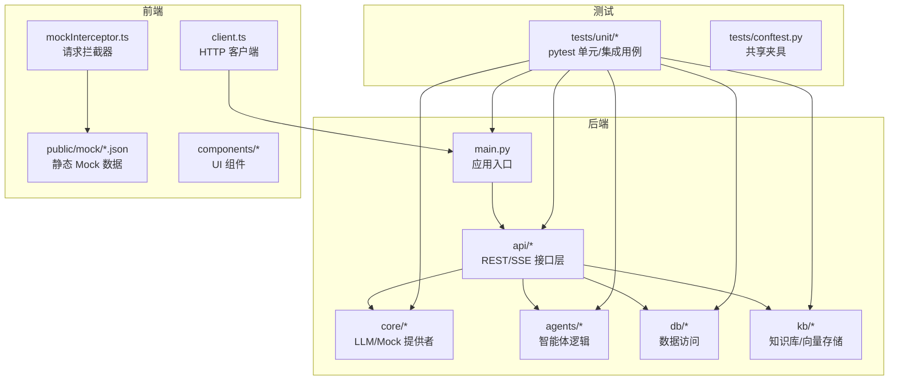
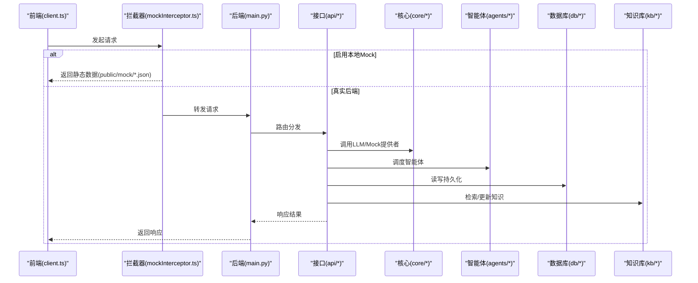
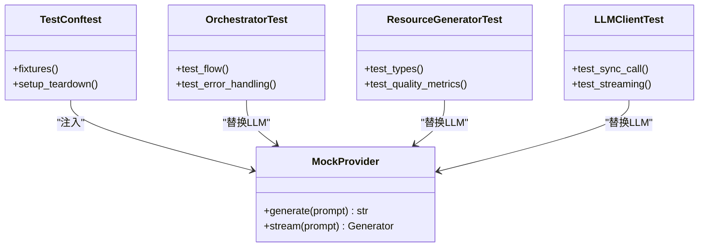
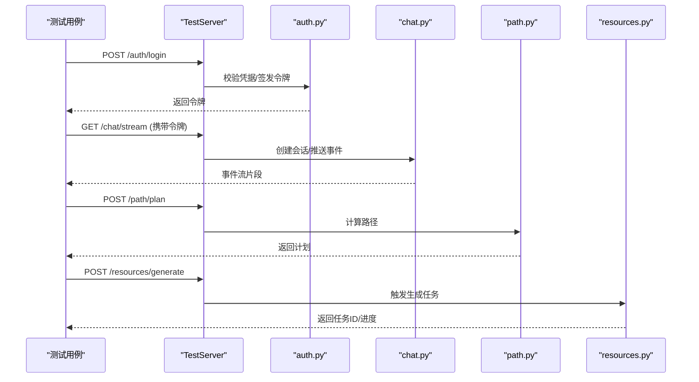
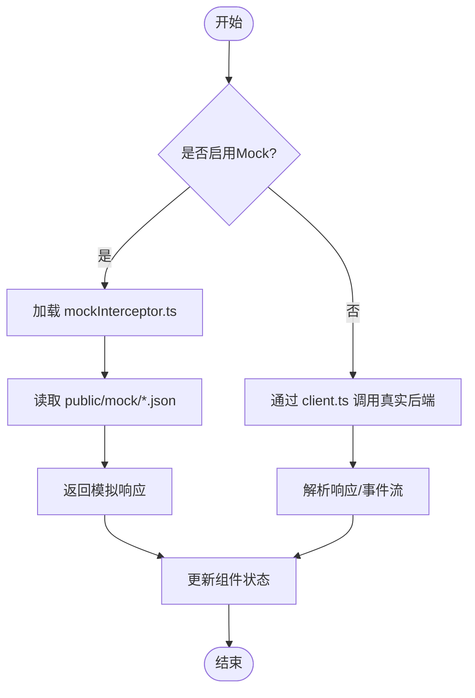
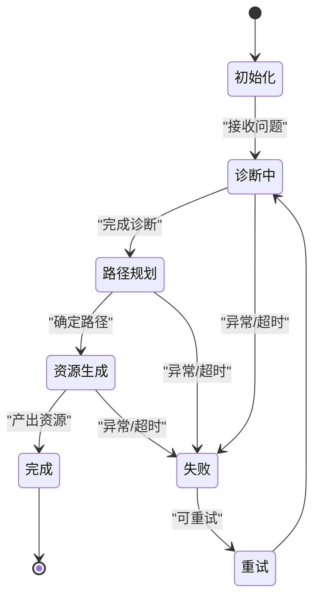
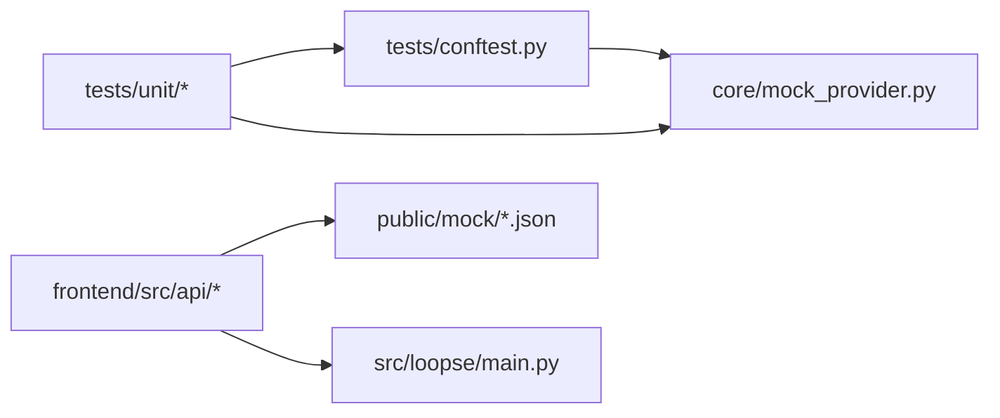

# 测试策略

<cite>
**本文引用的文件**   
- [tests/conftest.py](file://tests/conftest.py)
- [tests/unit/test_challenger_agent.py](file://tests/unit/test_challenger_agent.py)
- [tests/unit/test_diagnosis_agent.py](file://tests/unit/test_diagnosis_agent.py)
- [tests/unit/test_diagnosis_layer3.py](file://tests/unit/test_diagnosis_layer3.py)
- [tests/unit/test_diagnosis_path_integration.py](file://tests/unit/test_diagnosis_path_integration.py)
- [tests/unit/test_llm_client.py](file://tests/unit/test_llm_client.py)
- [tests/unit/test_misconception_registry.py](file://tests/unit/test_misconception_registry.py)
- [tests/unit/test_orchestrator_integration.py](file://tests/unit/test_orchestrator_integration.py)
- [tests/unit/test_resource_generator.py](file://tests/unit/test_resource_generator.py)
- [tests/unit/test_resource_generator_all_types.py](file://tests/unit/test_resource_generator_all_types.py)
- [tests/unit/test_resource_quality.py](file://tests/unit/test_resource_quality.py)
- [tests/test_student_profile_schema.py](file://tests/test_student_profile_schema.py)
- [src/loopse/main.py](file://src/loopse/main.py)
- [src/loopse/api/chat.py](file://src/loopse/api/chat.py)
- [src/loopse/api/auth.py](file://src/loopse/api/auth.py)
- [src/loopse/api/path.py](file://src/loopse/api/path.py)
- [src/loopse/api/resources.py](file://src/loopse/api/resources.py)
- [src/loopse/core/mock_provider.py](file://src/loopse/core/mock_provider.py)
- [frontend/src/api/client.ts](file://frontend/src/api/client.ts)
- [frontend/src/api/mockInterceptor.ts](file://frontend/src/api/mockInterceptor.ts)
- [frontend/public/mock/chat_mock.json](file://frontend/public/mock/chat_mock.json)
- [frontend/public/mock/diagnosis_mock.json](file://frontend/public/mock/diagnosis_mock.json)
- [frontend/public/mock/path_mock.json](file://frontend/public/mock/path_mock.json)
- [frontend/public/mock/profile_mock.json](file://frontend/public/mock/profile_mock.json)
- [frontend/public/mock/simulator_mock.json](file://frontend/public/mock/simulator_mock.json)
</cite>

## 目录
1. [引言](#引言)
2. [项目结构](#项目结构)
3. [核心组件](#核心组件)
4. [架构总览](#架构总览)
5. [详细组件分析](#详细组件分析)
6. [依赖分析](#依赖分析)
7. [性能考虑](#性能考虑)
8. [故障排查指南](#故障排查指南)
9. [结论](#结论)
10. [附录](#附录)

## 引言
本测试策略面向多智能体系统（后端）与前端应用，覆盖单元测试、集成测试、端到端测试的设计原则与实现方法；同时给出API接口测试、前端组件测试、测试数据管理、Mock服务、测试环境搭建、性能/压力/安全测试的实施指南，以及覆盖率要求、持续集成配置与测试结果分析。目标是建立可维护、可扩展、可观测的测试体系，保障质量与交付效率。

## 项目结构
仓库采用前后端分离：
- 后端：Python（FastAPI），包含agents、api、core、db、kb等模块，现有测试位于 tests/ 下，主要使用 pytest。
- 前端：Vue + Vite，提供 API 客户端与本地 Mock 数据，便于离线联调与前端单测。

图表来源
- [src/loopse/main.py:1-200](file://src/loopse/main.py#L1-L200)
- [src/loopse/api/chat.py:1-200](file://src/loopse/api/chat.py#L1-L200)
- [src/loopse/core/mock_provider.py:1-200](file://src/loopse/core/mock_provider.py#L1-L200)
- [frontend/src/api/client.ts:1-200](file://frontend/src/api/client.ts#L1-L200)
- [frontend/src/api/mockInterceptor.ts:1-200](file://frontend/src/api/mockInterceptor.ts#L1-L200)
- [frontend/public/mock/chat_mock.json:1-200](file://frontend/public/mock/chat_mock.json#L1-L200)
- [tests/conftest.py:1-200](file://tests/conftest.py#L1-L200)

章节来源
- [src/loopse/main.py:1-200](file://src/loopse/main.py#L1-L200)
- [tests/conftest.py:1-200](file://tests/conftest.py#L1-L200)

## 核心组件
- 测试框架与夹具
  - 使用 pytest 组织测试，conftest.py 提供共享夹具与生命周期钩子，统一数据库、Mock 提供者、SSE 通道等初始化与清理。
- 后端单元/集成测试
  - 针对智能体（诊断、挑战者、编排器等）、资源生成器、LLM 客户端、知识图谱/误解注册表等进行隔离或半隔离测试。
  - 通过 mock_provider 替换外部 LLM 调用，确保可重复性与稳定性。
- 前端测试基础
  - 基于 client.ts 封装 HTTP 客户端，结合 mockInterceptor.ts 与 public/mock/*.json 进行离线联调与组件级验证。
- 端到端与验收
  - 结合文档中的阶段验收用例与脚本，构建跨前后端的流程化验证路径。

章节来源
- [tests/conftest.py:1-200](file://tests/conftest.py#L1-L200)
- [tests/unit/test_llm_client.py:1-200](file://tests/unit/test_llm_client.py#L1-L200)
- [tests/unit/test_orchestrator_integration.py:1-200](file://tests/unit/test_orchestrator_integration.py#L1-L200)
- [tests/unit/test_resource_generator.py:1-200](file://tests/unit/test_resource_generator.py#L1-L200)
- [tests/unit/test_resource_generator_all_types.py:1-200](file://tests/unit/test_resource_generator_all_types.py#L1-L200)
- [tests/unit/test_resource_quality.py:1-200](file://tests/unit/test_resource_quality.py#L1-L200)
- [tests/unit/test_misconception_registry.py:1-200](file://tests/unit/test_misconception_registry.py#L1-L200)
- [tests/unit/test_diagnosis_agent.py:1-200](file://tests/unit/test_diagnosis_agent.py#L1-L200)
- [tests/unit/test_diagnosis_layer3.py:1-200](file://tests/unit/test_diagnosis_layer3.py#L1-L200)
- [tests/unit/test_diagnosis_path_integration.py:1-200](file://tests/unit/test_diagnosis_path_integration.py#L1-L200)
- [tests/unit/test_challenger_agent.py:1-200](file://tests/unit/test_challenger_agent.py#L1-L200)
- [tests/test_student_profile_schema.py:1-200](file://tests/test_studentProfileSchema.py#L1-L200)
- [frontend/src/api/client.ts:1-200](file://frontend/src/api/client.ts#L1-L200)
- [frontend/src/api/mockInterceptor.ts:1-200](file://frontend/src/api/mockInterceptor.ts#L1-L200)
- [frontend/public/mock/chat_mock.json:1-200](file://frontend/public/mock/chat_mock.json#L1-L200)

## 架构总览
下图展示从前端到后端的典型交互路径，以及测试在各层的切入位置。

图表来源
- [frontend/src/api/client.ts:1-200](file://frontend/src/api/client.ts#L1-L200)
- [frontend/src/api/mockInterceptor.ts:1-200](file://frontend/src/api/mockInterceptor.ts#L1-L200)
- [frontend/public/mock/chat_mock.json:1-200](file://frontend/public/mock/chat_mock.json#L1-L200)
- [src/loopse/main.py:1-200](file://src/loopse/main.py#L1-L200)
- [src/loopse/api/chat.py:1-200](file://src/loopse/api/chat.py#L1-L200)
- [src/loopse/core/mock_provider.py:1-200](file://src/loopse/core/mock_provider.py#L1-L200)

## 详细组件分析

### 后端单元测试与集成测试
- 设计原则
  - 隔离性：对外部依赖（LLM、数据库、网络）进行 Mock 或替换为内存/临时实例。
  - 确定性：固定随机种子、时间源与输入数据，保证可重复执行。
  - 分层：纯函数/工具类优先做单元级断言；涉及多个模块的协作用集成测试覆盖。
- 关键实现要点
  - 使用 conftest.py 集中管理测试夹具（如 Mock LLM、临时数据库连接）。
  - 对 LLM 调用使用 core/mock_provider.py 提供的替代实现，避免外部不稳定因素。
  - 对异步 SSE 场景，构造最小事件流以验证解析与状态机推进。
- 示例覆盖范围
  - 智能体：诊断、挑战者、编排器、路径规划等。
  - 资源生成：类型全覆盖与质量评估。
  - 知识相关：误解注册表、学生画像 Schema 校验。

图表来源
- [tests/conftest.py:1-200](file://tests/conftest.py#L1-L200)
- [src/loopse/core/mock_provider.py:1-200](file://src/loopse/core/mock_provider.py#L1-L200)
- [tests/unit/test_orchestrator_integration.py:1-200](file://tests/unit/test_orchestrator_integration.py#L1-L200)
- [tests/unit/test_resource_generator.py:1-200](file://tests/unit/test_resource_generator.py#L1-L200)
- [tests/unit/test_resource_generator_all_types.py:1-200](file://tests/unit/test_resource_generator_all_types.py#L1-L200)
- [tests/unit/test_resource_quality.py:1-200](file://tests/unit/test_resource_quality.py#L1-L200)
- [tests/unit/test_llm_client.py:1-200](file://tests/unit/test_llm_client.py#L1-L200)

章节来源
- [tests/unit/test_orchestrator_integration.py:1-200](file://tests/unit/test_orchestrator_integration.py#L1-L200)
- [tests/unit/test_resource_generator.py:1-200](file://tests/unit/test_resource_generator.py#L1-L200)
- [tests/unit/test_resource_generator_all_types.py:1-200](file://tests/unit/test_resource_generator_all_types.py#L1-L200)
- [tests/unit/test_resource_quality.py:1-200](file://tests/unit/test_resource_quality.py#L1-L200)
- [tests/unit/test_llm_client.py:1-200](file://tests/unit/test_llm_client.py#L1-L200)
- [tests/unit/test_misconception_registry.py:1-200](file://tests/unit/test_misconception_registry.py#L1-L200)
- [tests/unit/test_diagnosis_agent.py:1-200](file://tests/unit/test_diagnosis_agent.py#L1-L200)
- [tests/unit/test_diagnosis_layer3.py:1-200](file://tests/unit/test_diagnosis_layer3.py#L1-L200)
- [tests/unit/test_diagnosis_path_integration.py:1-200](file://tests/unit/test_diagnosis_path_integration.py#L1-L200)
- [tests/unit/test_challenger_agent.py:1-200](file://tests/unit/test_challenger_agent.py#L1-L200)
- [tests/test_student_profile_schema.py:1-200](file://tests/test_student_profile_schema.py#L1-L200)

### API 接口测试策略
- 目标
  - 验证路由、鉴权、参数校验、错误码、SSE 事件流、幂等性与超时处理。
- 方法与工具
  - 使用 FastAPI TestClient 或等效方式启动测试服务器，发送 HTTP 请求并断言响应。
  - 对鉴权接口（登录/令牌）进行正向与异常分支覆盖。
  - 对 SSE 接口构造最小事件序列，验证前端解析与状态推进。
- 关键接口
  - 聊天、认证、学习路径、资源生成等。

图表来源
- [src/loopse/api/auth.py:1-200](file://src/loopse/api/auth.py#L1-L200)
- [src/loopse/api/chat.py:1-200](file://src/loopse/api/chat.py#L1-L200)
- [src/loopse/api/path.py:1-200](file://src/loopse/api/path.py#L1-L200)
- [src/loopse/api/resources.py:1-200](file://src/loopse/api/resources.py#L1-L200)

章节来源
- [src/loopse/api/auth.py:1-200](file://src/loopse/api/auth.py#L1-L200)
- [src/loopse/api/chat.py:1-200](file://src/loopse/api/chat.py#L1-L200)
- [src/loopse/api/path.py:1-200](file://src/loopse/api/path.py#L1-L200)
- [src/loopse/api/resources.py:1-200](file://src/loopse/api/resources.py#L1-L200)

### 前端组件与接口测试策略
- 设计原则
  - 组件级：对 UI 组件进行渲染与交互断言，隔离业务逻辑。
  - 接口层：通过 client.ts 与 mockInterceptor.ts 组合，切换真实/模拟后端。
  - 数据契约：以 public/mock/*.json 作为契约快照，确保前后端数据结构一致。
- 实施要点
  - 在开发/测试环境启用 mockInterceptor，自动将请求重定向至静态 JSON。
  - 对复杂页面（如对话、诊断流程）编写用户旅程式用例，验证关键路径。
  - 对富文本/可视化组件，增加截图对比或结构化断言。

图表来源
- [frontend/src/api/mockInterceptor.ts:1-200](file://frontend/src/api/mockInterceptor.ts#L1-L200)
- [frontend/public/mock/chat_mock.json:1-200](file://frontend/public/mock/chat_mock.json#L1-L200)
- [frontend/public/mock/diagnosis_mock.json:1-200](file://frontend/public/mock/diagnosis_mock.json#L1-L200)
- [frontend/public/mock/path_mock.json:1-200](file://frontend/public/mock/path_mock.json#L1-L200)
- [frontend/public/mock/profile_mock.json:1-200](file://frontend/public/mock/profile_mock.json#L1-L200)
- [frontend/public/mock/simulator_mock.json:1-200](file://frontend/public/mock/simulator_mock.json#L1-L200)
- [frontend/src/api/client.ts:1-200](file://frontend/src/api/client.ts#L1-L200)

章节来源
- [frontend/src/api/client.ts:1-200](file://frontend/src/api/client.ts#L1-L200)
- [frontend/src/api/mockInterceptor.ts:1-200](file://frontend/src/api/mockInterceptor.ts#L1-L200)
- [frontend/public/mock/chat_mock.json:1-200](file://frontend/public/mock/chat_mock.json#L1-L200)
- [frontend/public/mock/diagnosis_mock.json:1-200](file://frontend/public/mock/diagnosis_mock.json#L1-L200)
- [frontend/public/mock/path_mock.json:1-200](file://frontend/public/mock/path_mock.json#L1-L200)
- [frontend/public/mock/profile_mock.json:1-200](file://frontend/public/mock/profile_mock.json#L1-L200)
- [frontend/public/mock/simulator_mock.json:1-200](file://frontend/public/mock/simulator_mock.json#L1-L200)

### 多智能体系统测试
- 设计原则
  - 编排验证：验证 orchestrator 对子智能体的调度顺序、条件分支与回退策略。
  - 状态一致性：检查各智能体间消息传递与状态机推进是否符合预期。
  - 容错与降级：注入异常（LLM 超时、空响应、格式错误）验证健壮性。
- 实现建议
  - 使用 conftest 提供“轻量编排器”与“固定输出”的智能体实现。
  - 记录并断言关键中间态（如诊断层级、路径节点、资源生成进度）。

图表来源
- [tests/unit/test_orchestrator_integration.py:1-200](file://tests/unit/test_orchestrator_integration.py#L1-L200)
- [tests/unit/test_diagnosis_agent.py:1-200](file://tests/unit/test_diagnosis_agent.py#L1-L200)
- [tests/unit/test_diagnosis_layer3.py:1-200](file://tests/unit/test_diagnosis_layer3.py#L1-L200)
- [tests/unit/test_diagnosis_path_integration.py:1-200](file://tests/unit/test_diagnosis_path_integration.py#L1-L200)

章节来源
- [tests/unit/test_orchestrator_integration.py:1-200](file://tests/unit/test_orchestrator_integration.py#L1-L200)
- [tests/unit/test_diagnosis_agent.py:1-200](file://tests/unit/test_diagnosis_agent.py#L1-L200)
- [tests/unit/test_diagnosis_layer3.py:1-200](file://tests/unit/test_diagnosis_layer3.py#L1-L200)
- [tests/unit/test_diagnosis_path_integration.py:1-200](file://tests/unit/test_diagnosis_path_integration.py#L1-L200)

### 测试数据管理与 Mock 服务
- 后端
  - 使用 conftest 创建临时数据库与只读数据集；对 LLM 使用 mock_provider 返回稳定输出。
  - 将种子数据与迁移脚本纳入版本控制，确保可复现。
- 前端
  - 以 public/mock/*.json 作为契约数据，配合 mockInterceptor 自动注入。
  - 对动态字段（时间戳、ID）使用占位符并在断言前规范化。

章节来源
- [tests/conftest.py:1-200](file://tests/conftest.py#L1-L200)
- [src/loopse/core/mock_provider.py:1-200](file://src/loopse/core/mock_provider.py#L1-L200)
- [frontend/public/mock/chat_mock.json:1-200](file://frontend/public/mock/chat_mock.json#L1-L200)
- [frontend/public/mock/diagnosis_mock.json:1-200](file://frontend/public/mock/diagnosis_mock.json#L1-L200)
- [frontend/public/mock/path_mock.json:1-200](file://frontend/public/mock/path_mock.json#L1-L200)
- [frontend/public/mock/profile_mock.json:1-200](file://frontend/public/mock/profile_mock.json#L1-L200)
- [frontend/public/mock/simulator_mock.json:1-200](file://frontend/public/mock/simulator_mock.json#L1-L200)

### 测试环境搭建
- 后端
  - 安装依赖、准备测试数据库（SQLite 或内存库）、设置环境变量（如禁用外部网络）。
  - 运行 pytest 时启用日志与覆盖率报告。
- 前端
  - 安装依赖、启动开发服务器，确认 mockInterceptor 生效。
  - 在无网络环境下验证关键页面与交互。

章节来源
- [tests/conftest.py:1-200](file://tests/conftest.py#L1-L200)
- [frontend/src/api/mockInterceptor.ts:1-200](file://frontend/src/api/mockInterceptor.ts#L1-L200)

## 依赖分析
测试套件对以下模块存在直接依赖关系：

图表来源
- [tests/conftest.py:1-200](file://tests/conftest.py#L1-L200)
- [src/loopse/core/mock_provider.py:1-200](file://src/loopse/core/mock_provider.py#L1-L200)
- [frontend/src/api/client.ts:1-200](file://frontend/src/api/client.ts#L1-L200)
- [frontend/src/api/mockInterceptor.ts:1-200](file://frontend/src/api/mockInterceptor.ts#L1-L200)
- [frontend/public/mock/chat_mock.json:1-200](file://frontend/public/mock/chat_mock.json#L1-L200)
- [src/loopse/main.py:1-200](file://src/loopse/main.py#L1-L200)

章节来源
- [tests/conftest.py:1-200](file://tests/conftest.py#L1-L200)
- [src/loopse/core/mock_provider.py:1-200](file://src/loopse/core/mock_provider.py#L1-L200)
- [frontend/src/api/client.ts:1-200](file://frontend/src/api/client.ts#L1-L200)
- [frontend/src/api/mockInterceptor.ts:1-200](file://frontend/src/api/mockInterceptor.ts#L1-L200)
- [frontend/public/mock/chat_mock.json:1-200](file://frontend/public/mock/chat_mock.json#L1-L200)
- [src/loopse/main.py:1-200](file://src/loopse/main.py#L1-L200)

## 性能考虑
- 基准与回归
  - 对热点接口（聊天、资源生成）建立基准用例，记录 P50/P95 延迟与吞吐。
  - 引入负载增长曲线，观察拐点与资源瓶颈（CPU/IO/外部 LLM 限流）。
- 并发与稳定性
  - 对 SSE 长连接进行并发压测，验证服务端资源释放与内存泄漏防护。
  - 对批量资源生成任务进行队列化与背压测试。
- 指标采集
  - 在接口层埋点耗时、错误率、缓存命中率，输出可观测报表。

[本节为通用指导，不直接分析具体文件]

## 故障排查指南
- 常见问题定位
  - 外部依赖不稳定：优先切换到 mock_provider 或本地静态数据，逐步缩小范围。
  - 时序问题：对异步/流式接口增加等待与重试策略，捕获超时与中断。
  - 数据不一致：核对 Mock 数据与 Schema 定义，确保字段完整与类型正确。
- 调试技巧
  - 开启详细日志与请求追踪，保存失败时的上下文快照。
  - 使用最小复现用例隔离问题，逐步添加依赖直至定位根因。

章节来源
- [tests/conftest.py:1-200](file://tests/conftest.py#L1-L200)
- [src/loopse/core/mock_provider.py:1-200](file://src/loopse/core/mock_provider.py#L1-L200)

## 结论
本测试策略围绕“隔离、可重复、分层、可观测”的原则，构建了覆盖后端单元/集成、API 接口、前端组件与多智能体编排的完整测试体系。通过 Mock 服务与契约数据，显著降低外部依赖波动带来的不确定性；通过性能与安全测试补充非功能质量保障。建议在持续集成中固化覆盖率门槛与回归基线，形成质量闭环。

[本节为总结性内容，不直接分析具体文件]

## 附录
- 覆盖率要求
  - 后端：语句覆盖率≥80%，分支覆盖率≥70%；核心模块（编排、诊断、资源生成）≥90%。
  - 前端：组件覆盖率≥70%，关键交互路径≥80%。
- 持续集成
  - 并行执行 pytest 与前端测试；失败时归档日志与截图；定期生成覆盖率趋势图。
- 高质量用例实践
  - 命名清晰、职责单一、输入输出明确；包含边界值与异常分支；避免硬编码敏感信息。
- 维护建议
  - 随需求演进同步更新用例与 Mock 数据；定期清理失效用例；引入契约测试减少前后端分歧。

[本节为通用指导，不直接分析具体文件]