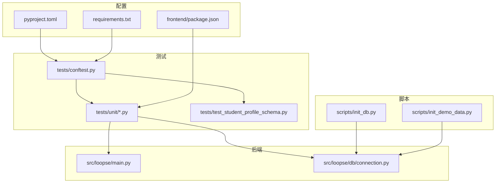
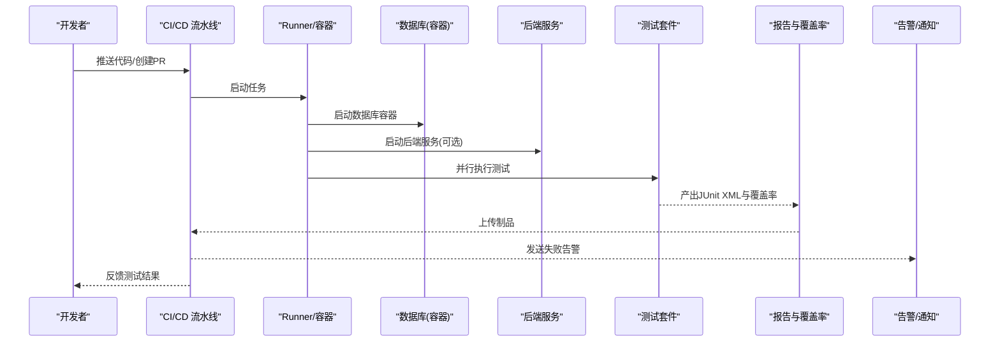
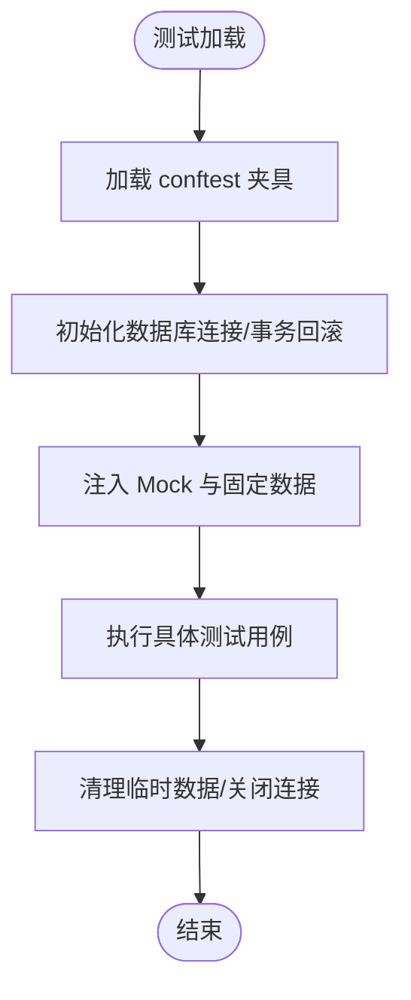
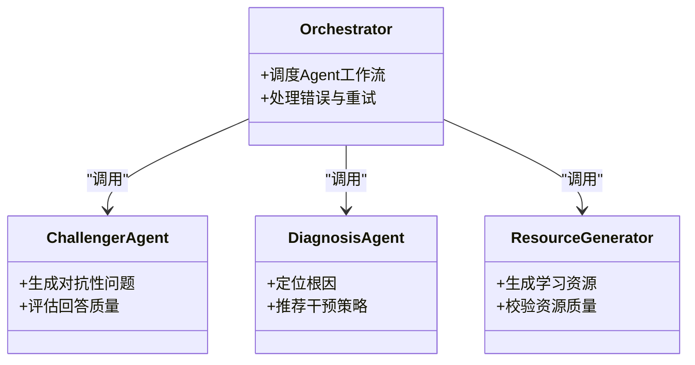
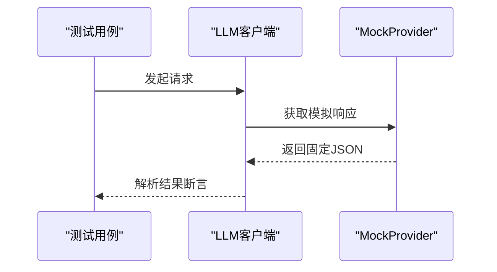
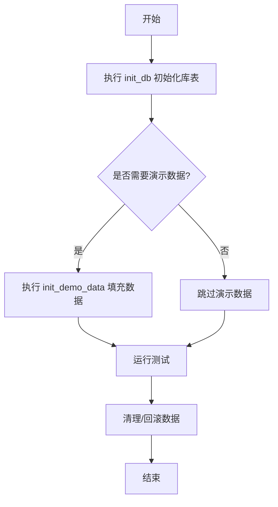
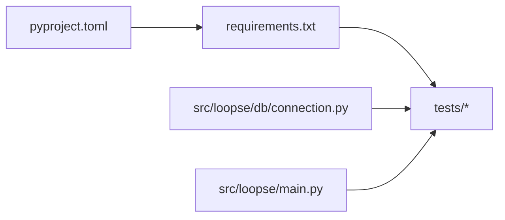

# 测试自动化

<cite>
**本文引用的文件**   
- [tests/conftest.py](file://tests/conftest.py)
- [tests/unit/test_challenger_agent.py](file://tests/unit/test_challenger_agent.py)
- [tests/unit/test_diagnosis_agent.py](file://tests/unit/test_diagnosis_agent.py)
- [tests/unit/test_llm_client.py](file://tests/unit/test_llm_client.py)
- [tests/unit/test_orchestrator_integration.py](file://tests/unit/test_orchestrator_integration.py)
- [tests/unit/test_resource_generator.py](file://tests/unit/test_resource_generator.py)
- [tests/unit/test_resource_generator_all_types.py](file://tests/unit/test_resource_generator_all_types.py)
- [tests/unit/test_resource_quality.py](file://tests/unit/test_resource_quality.py)
- [tests/test_student_profile_schema.py](file://tests/test_student_profile_schema.py)
- [pyproject.toml](file://pyproject.toml)
- [requirements.txt](file://requirements.txt)
- [scripts/init_db.py](file://scripts/init_db.py)
- [scripts/init_demo_data.py](file://scripts/init_demo_data.py)
- [src/loopse/db/connection.py](file://src/loopse/db/connection.py)
- [src/loopse/main.py](file://src/loopse/main.py)
- [frontend/package.json](file://frontend/package.json)
</cite>

## 目录
1. [简介](#简介)
2. [项目结构](#项目结构)
3. [核心组件](#核心组件)
4. [架构总览](#架构总览)
5. [详细组件分析](#详细组件分析)
6. [依赖关系分析](#依赖关系分析)
7. [性能与并行化](#性能与并行化)
8. [故障排查指南](#故障排查指南)
9. [结论](#结论)
10. [附录](#附录)

## 简介
本指南面向Socrates-Cube项目的测试自动化落地，覆盖持续集成流水线配置、自动化测试执行与报告、并行测试、测试环境自动部署与数据准备、Docker容器化测试环境、覆盖率收集、质量门禁与自动化发布、失败告警、报告可视化与趋势分析等主题。文档以仓库现有测试结构与脚本为基础，给出可操作的实施建议与最佳实践。

## 项目结构
仓库包含Python后端与前端工程，测试集中在tests目录，包含单元测试与部分集成测试；数据库初始化与演示数据准备在scripts目录；构建与依赖管理使用pyproject.toml与requirements.txt；前端使用package.json进行依赖与脚本管理。

图表来源
- [tests/conftest.py](file://tests/conftest.py)
- [tests/unit/test_challenger_agent.py](file://tests/unit/test_challenger_agent.py)
- [tests/unit/test_diagnosis_agent.py](file://tests/unit/test_diagnosis_agent.py)
- [tests/unit/test_llm_client.py](file://tests/unit/test_llm_client.py)
- [tests/unit/test_orchestrator_integration.py](file://tests/unit/test_orchestrator_integration.py)
- [tests/unit/test_resource_generator.py](file://tests/unit/test_resource_generator.py)
- [tests/unit/test_resource_generator_all_types.py](file://tests/unit/test_resource_generator_all_types.py)
- [tests/unit/test_resource_quality.py](file://tests/unit/test_resource_quality.py)
- [tests/test_student_profile_schema.py](file://tests/test_student_profile_schema.py)
- [src/loopse/db/connection.py](file://src/loopse/db/connection.py)
- [src/loopse/main.py](file://src/loopse/main.py)
- [scripts/init_db.py](file://scripts/init_db.py)
- [scripts/init_demo_data.py](file://scripts/init_demo_data.py)
- [pyproject.toml](file://pyproject.toml)
- [requirements.txt](file://requirements.txt)
- [frontend/package.json](file://frontend/package.json)

章节来源
- [tests/conftest.py](file://tests/conftest.py)
- [tests/unit/test_challenger_agent.py](file://tests/unit/test_challenger_agent.py)
- [tests/unit/test_diagnosis_agent.py](file://tests/unit/test_diagnosis_agent.py)
- [tests/unit/test_llm_client.py](file://tests/unit/test_llm_client.py)
- [tests/unit/test_orchestrator_integration.py](file://tests/unit/test_orchestrator_integration.py)
- [tests/unit/test_resource_generator.py](file://tests/unit/test_resource_generator.py)
- [tests/unit/test_resource_generator_all_types.py](file://tests/unit/test_resource_generator_all_types.py)
- [tests/unit/test_resource_quality.py](file://tests/unit/test_resource_quality.py)
- [tests/test_student_profile_schema.py](file://tests/test_student_profile_schema.py)
- [src/loopse/db/connection.py](file://src/loopse/db/connection.py)
- [src/loopse/main.py](file://src/loopse/main.py)
- [scripts/init_db.py](file://scripts/init_db.py)
- [scripts/init_demo_data.py](file://scripts/init_demo_data.py)
- [pyproject.toml](file://pyproject.toml)
- [requirements.txt](file://requirements.txt)
- [frontend/package.json](file://frontend/package.json)

## 核心组件
- 测试框架与夹具：通过conftest集中定义共享夹具与生命周期钩子，为各测试模块提供一致的数据库连接、Mock与资源准备能力。
- 单元测试套件：针对Agent、LLM客户端、编排器、资源生成器、学生画像Schema等关键模块编写用例，确保核心逻辑稳定。
- 数据库与数据准备：通过init_db与init_demo_data脚本完成库表初始化与演示数据填充，便于本地与CI环境快速启动。
- 后端服务入口：main作为应用启动入口，测试中可通过独立进程或轻量API模式运行以便端到端验证。
- 前端测试准备：基于package.json的脚本命令，可在CI中安装依赖并执行前端静态检查与测试（如存在）。

章节来源
- [tests/conftest.py](file://tests/conftest.py)
- [tests/unit/test_challenger_agent.py](file://tests/unit/test_challenger_agent.py)
- [tests/unit/test_diagnosis_agent.py](file://tests/unit/test_diagnosis_agent.py)
- [tests/unit/test_llm_client.py](file://tests/unit/test_llm_client.py)
- [tests/unit/test_orchestrator_integration.py](file://tests/unit/test_orchestrator_integration.py)
- [tests/unit/test_resource_generator.py](file://tests/unit/test_resource_generator.py)
- [tests/unit/test_resource_generator_all_types.py](file://tests/unit/test_resource_generator_all_types.py)
- [tests/unit/test_resource_quality.py](file://tests/unit/test_resource_quality.py)
- [tests/test_student_profile_schema.py](file://tests/test_student_profile_schema.py)
- [scripts/init_db.py](file://scripts/init_db.py)
- [scripts/init_demo_data.py](file://scripts/init_demo_data.py)
- [src/loopse/main.py](file://src/loopse/main.py)
- [frontend/package.json](file://frontend/package.json)

## 架构总览
下图展示测试自动化在CI中的整体流程：代码提交触发流水线，拉取镜像、初始化数据库与演示数据、并行执行测试、收集覆盖率与报告、上传制品与通知结果。

图表来源
- [scripts/init_db.py](file://scripts/init_db.py)
- [scripts/init_demo_data.py](file://scripts/init_demo_data.py)
- [src/loopse/main.py](file://src/loopse/main.py)
- [tests/conftest.py](file://tests/conftest.py)
- [pyproject.toml](file://pyproject.toml)

## 详细组件分析

### 测试夹具与共享配置
- conftest负责集中管理测试依赖注入、数据库连接与清理策略，避免在各测试文件中重复实现。
- 建议将外部依赖（如LLM客户端）通过夹具进行Mock，保证测试稳定性与速度。

图表来源
- [tests/conftest.py](file://tests/conftest.py)

章节来源
- [tests/conftest.py](file://tests/conftest.py)

### Agent与编排器测试
- 挑战者Agent、诊断Agent、编排器等核心Agent的测试关注输入输出契约、状态流转与异常路径。
- 建议对Agent间通信与外部调用进行隔离，使用夹具返回确定性响应。

图表来源
- [tests/unit/test_orchestrator_integration.py](file://tests/unit/test_orchestrator_integration.py)
- [tests/unit/test_challenger_agent.py](file://tests/unit/test_challenger_agent.py)
- [tests/unit/test_diagnosis_agent.py](file://tests/unit/test_diagnosis_agent.py)
- [tests/unit/test_resource_generator.py](file://tests/unit/test_resource_generator.py)
- [tests/unit/test_resource_generator_all_types.py](file://tests/unit/test_resource_generator_all_types.py)
- [tests/unit/test_resource_quality.py](file://tests/unit/test_resource_quality.py)

章节来源
- [tests/unit/test_orchestrator_integration.py](file://tests/unit/test_orchestrator_integration.py)
- [tests/unit/test_challenger_agent.py](file://tests/unit/test_challenger_agent.py)
- [tests/unit/test_diagnosis_agent.py](file://tests/unit/test_diagnosis_agent.py)
- [tests/unit/test_resource_generator.py](file://tests/unit/test_resource_generator.py)
- [tests/unit/test_resource_generator_all_types.py](file://tests/unit/test_resource_generator_all_types.py)
- [tests/unit/test_resource_quality.py](file://tests/unit/test_resource_quality.py)

### LLM客户端与外部依赖隔离
- 针对LLM客户端的测试应屏蔽网络延迟与不稳定因素，采用夹具或MockProvider返回固定响应。
- 建议在conftest中统一替换真实客户端实例，确保所有用例一致行为。

图表来源
- [tests/unit/test_llm_client.py](file://tests/unit/test_llm_client.py)

章节来源
- [tests/unit/test_llm_client.py](file://tests/unit/test_llm_client.py)

### 数据库与数据准备
- init_db用于初始化库表结构，init_demo_data用于填充演示数据，两者在本地与CI环境中均可复用。
- 建议在测试前执行一次数据准备，并在每个用例结束后回滚或清理，避免数据污染。

图表来源
- [scripts/init_db.py](file://scripts/init_db.py)
- [scripts/init_demo_data.py](file://scripts/init_demo_data.py)

章节来源
- [scripts/init_db.py](file://scripts/init_db.py)
- [scripts/init_demo_data.py](file://scripts/init_demo_data.py)

### 前端测试准备
- frontend/package.json定义了依赖与脚本命令，可在CI中安装依赖并执行前端测试或静态检查。
- 若前端存在测试用例，建议在后端测试前后分别执行，确保全栈一致性。

章节来源
- [frontend/package.json](file://frontend/package.json)

## 依赖关系分析
- Python依赖：requirements.txt与pyproject.toml共同管理运行时与开发期依赖，测试工具链（pytest、覆盖率插件等）应在其中声明。
- 数据库连接：src/loopse/db/connection.py提供连接抽象，测试夹具应复用该连接配置。
- 应用入口：src/loopse/main.py作为服务启动点，可用于端到端测试的轻量运行。

图表来源
- [pyproject.toml](file://pyproject.toml)
- [requirements.txt](file://requirements.txt)
- [src/loopse/db/connection.py](file://src/loopse/db/connection.py)
- [src/loopse/main.py](file://src/loopse/main.py)

章节来源
- [pyproject.toml](file://pyproject.toml)
- [requirements.txt](file://requirements.txt)
- [src/loopse/db/connection.py](file://src/loopse/db/connection.py)
- [src/loopse/main.py](file://src/loopse/main.py)

## 性能与并行化
- 并行执行：使用pytest-xdist在CI中启用多进程并行，显著缩短测试时间。
- 数据库并发：为每个并行进程分配独立数据库实例或命名空间，避免锁竞争。
- 资源隔离：对耗时操作（如文件IO、网络请求）进行Mock或缓存，减少抖动。
- 分片策略：按模块或功能域拆分测试集，结合并行度动态调整。

[本节为通用指导，不直接分析具体文件]

## 故障排查指南
- 常见失败原因
  - 数据库未初始化或连接参数错误：确认init_db已执行且连接信息正确。
  - 外部依赖不稳定：检查LLM客户端是否被Mock，避免网络波动影响。
  - 测试数据污染：确认夹具的事务回滚或清理逻辑生效。
- 定位方法
  - 查看JUnit XML与日志输出，定位失败用例与堆栈。
  - 降低并行度至单进程复现问题。
  - 增加调试日志与断点，逐步缩小范围。

章节来源
- [tests/conftest.py](file://tests/conftest.py)
- [tests/unit/test_llm_client.py](file://tests/unit/test_llm_client.py)
- [scripts/init_db.py](file://scripts/init_db.py)

## 结论
通过统一的夹具管理、严格的依赖隔离、完善的数据库与数据准备流程，以及并行化与覆盖率收集，Socrates-Cube的测试自动化能够在CI中稳定高效地运行。建议结合质量门禁与可视化报告，持续提升交付质量与团队效率。

[本节为总结性内容，不直接分析具体文件]

## 附录

### GitHub Actions 流水线示例（概念性）
- 触发条件：push与pull_request事件。
- 步骤：设置Python环境、安装依赖、初始化数据库、运行测试、生成覆盖率与报告、上传制品、失败告警。
- 缓存：缓存pip包与前端依赖，加速构建。
- 矩阵：并行执行不同Python版本或数据库驱动组合。

[本节为概念性说明，不直接映射到具体文件]

### Jenkins 流水线示例（概念性）
- 阶段：拉取代码、构建镜像、启动数据库与服务、执行测试、收集报告、归档产物、通知结果。
- 并行：使用parallel块并行执行不同测试集。
- 持久化：使用Jenkins Workspace保存测试报告与覆盖率文件。

[本节为概念性说明，不直接映射到具体文件]

### Docker 容器化测试环境
- 基础镜像：选择稳定的Python镜像，预装系统依赖。
- 多阶段构建：分离依赖安装与运行阶段，减小镜像体积。
- 环境变量：通过.env或Compose变量注入数据库地址、密钥等。
- 健康检查：为数据库与服务添加健康检查，确保就绪后再运行测试。

[本节为概念性说明，不直接映射到具体文件]

### 覆盖率收集与质量门禁
- 覆盖率工具：使用pytest-cov生成HTML与XML报告。
- 阈值门禁：设定最小覆盖率阈值，低于阈值则失败。
- 趋势分析：将覆盖率历史上传至对象存储或监控平台，观察趋势变化。

[本节为概念性说明，不直接映射到具体文件]

### 自动化发布流程
- 分支策略：主分支合并后触发发布流水线。
- 版本标记：根据标签生成版本号与变更日志。
- 制品归档：打包镜像与配置文件，推送到镜像仓库与制品库。
- 灰度发布：先小流量上线，观察指标后再全量发布。

[本节为概念性说明，不直接映射到具体文件]

### 测试失败告警与报告可视化
- 告警渠道：邮件、企业微信、Slack等，失败时即时通知。
- 报告可视化：使用Allure或自定义Dashboard聚合JUnit与覆盖率报告。
- 趋势看板：将关键指标（通过率、覆盖率、平均时长）纳入看板，定期复盘。

[本节为概念性说明，不直接映射到具体文件]