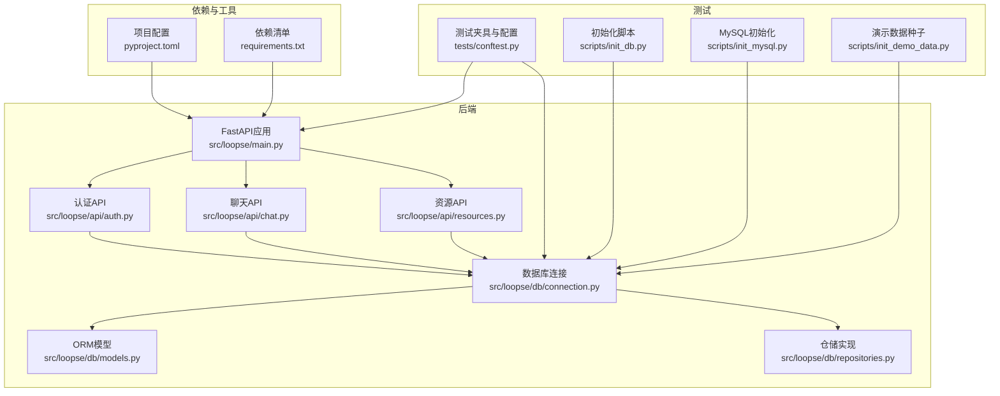
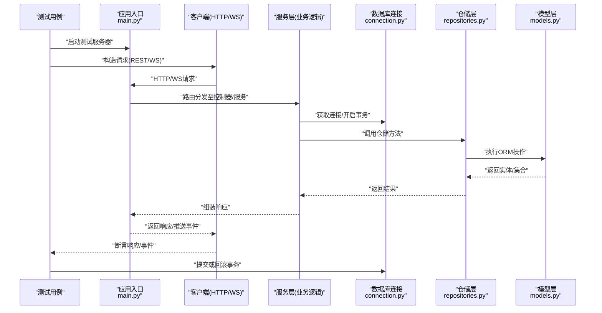
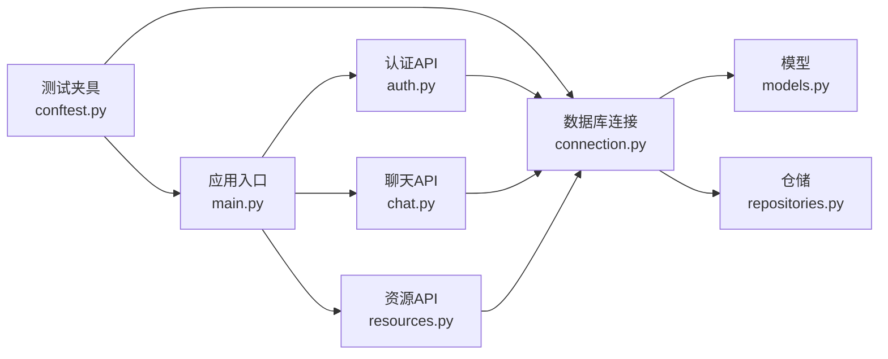

# 集成测试

<cite>
**本文引用的文件**   
- [src/loopse/main.py](file://src/loopse/main.py)
- [src/loopse/api/auth.py](file://src/loopse/api/auth.py)
- [src/loopse/api/chat.py](file://src/loopse/api/chat.py)
- [src/loopse/api/resources.py](file://src/loopse/api/resources.py)
- [src/loopse/db/connection.py](file://src/loopse/db/connection.py)
- [src/loopse/db/models.py](file://src/loopse/db/models.py)
- [src/loopse/db/repositories.py](file://src/loopse/db/repositories.py)
- [tests/conftest.py](file://tests/conftest.py)
- [scripts/init_db.py](file://scripts/init_db.py)
- [scripts/init_mysql.py](file://scripts/init_mysql.py)
- [scripts/init_demo_data.py](file://scripts/init_demo_data.py)
- [pyproject.toml](file://pyproject.toml)
- [requirements.txt](file://requirements.txt)
</cite>

## 目录
1. [简介](#简介)
2. [项目结构](#项目结构)
3. [核心组件](#核心组件)
4. [架构总览](#架构总览)
5. [详细组件分析](#详细组件分析)
6. [依赖分析](#依赖分析)
7. [性能考虑](#性能考虑)
8. [故障排查指南](#故障排查指南)
9. [结论](#结论)
10. [附录](#附录) 

## 简介
本文件面向Socrates-Cube项目的集成测试实践，覆盖以下关键主题：
- API接口集成测试（RESTful、WebSocket/SSE）
- 数据库集成测试（连接、模型、仓储层）
- 多智能体协作测试（编排器与子代理的端到端流程）
- 端到端工作流测试（从前端到后端再到外部依赖）
- 微服务间通信测试（HTTP调用、消息传递）
- 外部依赖集成测试（LLM、向量库、对象存储等）
- 测试环境搭建、测试数据库配置与Mock策略
- RESTful API、实时通信、文件上传下载的测试示例
- 复杂业务流程、事务处理与并发场景的测试方法
- 测试数据隔离、回滚策略与性能监控集成

## 项目结构
本项目采用前后端分离架构。后端基于Python，提供REST API与实时通信能力；数据库与知识图谱、向量检索等外部依赖通过服务化方式接入。测试代码位于tests目录，包含单元测试与部分集成测试入口。

图表来源
- [src/loopse/main.py](file://src/loopse/main.py)
- [src/loopse/api/auth.py](file://src/loopse/api/auth.py)
- [src/loopse/api/chat.py](file://src/loopse/api/chat.py)
- [src/loopse/api/resources.py](file://src/loopse/api/resources.py)
- [src/loopse/db/connection.py](file://src/loopse/db/connection.py)
- [src/loopse/db/models.py](file://src/loopse/db/models.py)
- [src/loopse/db/repositories.py](file://src/loopse/db/repositories.py)
- [tests/conftest.py](file://tests/conftest.py)
- [scripts/init_db.py](file://scripts/init_db.py)
- [scripts/init_mysql.py](file://scripts/init_mysql.py)
- [scripts/init_demo_data.py](file://scripts/init_demo_data.py)
- [pyproject.toml](file://pyproject.toml)
- [requirements.txt](file://requirements.txt)

章节来源
- [src/loopse/main.py](file://src/loopse/main.py)
- [src/loopse/api/auth.py](file://src/loopse/api/auth.py)
- [src/loopse/api/chat.py](file://src/loopse/api/chat.py)
- [src/loopse/api/resources.py](file://src/loopse/api/resources.py)
- [src/loopse/db/connection.py](file://src/loopse/db/connection.py)
- [src/loopse/db/models.py](file://src/loopse/db/models.py)
- [src/loopse/db/repositories.py](file://src/loopse/db/repositories.py)
- [tests/conftest.py](file://tests/conftest.py)
- [scripts/init_db.py](file://scripts/init_db.py)
- [scripts/init_mysql.py](file://scripts/init_mysql.py)
- [scripts/init_demo_data.py](file://scripts/init_demo_data.py)
- [pyproject.toml](file://pyproject.toml)
- [requirements.txt](file://requirements.txt)

## 核心组件
- 应用入口与路由挂载：负责注册API路由、中间件、生命周期钩子，为集成测试提供可启动的服务实例。
- 认证API：提供登录、鉴权、会话管理相关接口，是端到端流程的起点。
- 聊天API：支持文本对话与实时推送（如SSE/WebSocket），用于验证实时通信链路。
- 资源API：提供资源的生成、查询、下载等能力，适合文件上传下载与大数据量响应测试。
- 数据库连接与仓储：封装连接池、事务边界与CRUD操作，确保测试中数据一致性与隔离性。
- 测试夹具与初始化：集中管理测试环境、数据库迁移、种子数据与Mock配置。

章节来源
- [src/loopse/main.py](file://src/loopse/main.py)
- [src/loopse/api/auth.py](file://src/loopse/api/auth.py)
- [src/loopse/api/chat.py](file://src/loopse/api/chat.py)
- [src/loopse/api/resources.py](file://src/loopse/api/resources.py)
- [src/loopse/db/connection.py](file://src/loopse/db/connection.py)
- [src/loopse/db/repositories.py](file://src/loopse/db/repositories.py)
- [tests/conftest.py](file://tests/conftest.py)

## 架构总览
下图展示集成测试在系统中的作用位置：测试驱动应用启动、注入测试数据库、调用API并断言结果，必要时Mock外部依赖以隔离不稳定因素。

图表来源
- [src/loopse/main.py](file://src/loopse/main.py)
- [src/loopse/db/connection.py](file://src/loopse/db/connection.py)
- [src/loopse/db/repositories.py](file://src/loopse/db/repositories.py)
- [src/loopse/db/models.py](file://src/loopse/db/models.py)

## 详细组件分析

### API接口集成测试（RESTful）
- 目标：验证认证、聊天、资源等接口的正确性、健壮性与一致性。
- 要点：
  - 使用测试客户端发起HTTP请求，覆盖成功、失败、边界条件。
  - 校验状态码、响应体结构与字段约束。
  - 对敏感路径进行鉴权与权限控制验证。
  - 结合数据库断言，确保持久化结果符合预期。
- 建议用例：
  - 用户注册/登录/刷新令牌
  - 聊天会话创建、消息发送与历史查询
  - 资源列表分页、过滤、排序与详情获取
  - 错误码与异常信息规范化

章节来源
- [src/loopse/api/auth.py](file://src/loopse/api/auth.py)
- [src/loopse/api/chat.py](file://src/loopse/api/chat.py)
- [src/loopse/api/resources.py](file://src/loopse/api/resources.py)

### WebSocket/SSE实时通信测试
- 目标：验证服务端推送事件的时序、内容完整性与客户端重连机制。
- 要点：
  - 建立长连接后订阅频道/会话，断言事件类型与负载。
  - 模拟网络抖动与服务端重启，验证自动重连与状态恢复。
  - 并发连接下的事件广播与限流行为。
- 建议用例：
  - 聊天消息实时推送
  - 诊断/规划任务进度事件
  - 资源生成进度通知

章节来源
- [src/loopse/api/chat.py](file://src/loopse/api/chat.py)

### 数据库集成测试
- 目标：验证连接、事务、模型映射与仓储操作的可靠性。
- 要点：
  - 使用独立测试数据库，避免污染生产数据。
  - 每个测试用例前后进行数据准备与清理，保证隔离性。
  - 针对复杂查询与批量写入进行性能回归。
- 建议用例：
  - 用户资料增删改查
  - 聊天记录与资源记录的关联查询
  - 事务回滚与并发写冲突处理

章节来源
- [src/loopse/db/connection.py](file://src/loopse/db/connection.py)
- [src/loopse/db/models.py](file://src/loopse/db/models.py)
- [src/loopse/db/repositories.py](file://src/loopse/db/repositories.py)

### 多智能体协作测试
- 目标：验证编排器与子代理之间的协作流程、状态流转与容错。
- 要点：
  - 定义端到端场景（如“诊断→路径规划→资源生成”）。
  - 使用Mock替代外部LLM与知识库，聚焦内部协作逻辑。
  - 断言各阶段输出与状态机转换的正确性。
- 建议用例：
  - 编排器调度与重试策略
  - 子代理间消息传递与超时处理
  - 异常分支与降级路径

章节来源
- [src/loopse/main.py](file://src/loopse/main.py)

### 端到端工作流测试
- 目标：从前端触发到后端处理、数据库落盘与外部依赖交互的全链路验证。
- 要点：
  - 使用真实或轻量级前端客户端发起请求。
  - 串联认证、业务处理、持久化与推送环节。
  - 引入外部依赖Mock，确保稳定性与可重复性。
- 建议用例：
  - 新用户引导流程
  - 学习路径推荐与资源生成
  - 诊断报告导出与下载

章节来源
- [src/loopse/api/auth.py](file://src/loopse/api/auth.py)
- [src/loopse/api/chat.py](file://src/loopse/api/chat.py)
- [src/loopse/api/resources.py](file://src/loopse/api/resources.py)

### 微服务间通信测试
- 目标：验证跨服务HTTP调用、消息队列与鉴权传递。
- 要点：
  - 使用契约测试确保接口兼容性。
  - Mock下游服务，验证上游服务的容错与重试。
  - 追踪请求ID与日志关联，便于问题定位。
- 建议用例：
  - 认证服务与其他服务的令牌校验
  - 资源生成服务与编排器的异步任务协调

章节来源
- [src/loopse/main.py](file://src/loopse/main.py)

### 外部依赖集成测试
- 目标：验证LLM、向量库、对象存储等外部系统的集成点。
- 要点：
  - 使用本地Mock或沙箱环境替代真实外部服务。
  - 模拟延迟、错误与限流，验证系统鲁棒性。
  - 记录外部调用指标，纳入性能监控。
- 建议用例：
  - LLM问答与生成任务
  - 向量检索与相似度计算
  - 大文件上传与分片下载

章节来源
- [src/loopse/api/resources.py](file://src/loopse/api/resources.py)

### 测试环境搭建
- 步骤：
  - 安装依赖与构建虚拟环境。
  - 初始化数据库与表结构。
  - 加载演示数据与基础配置。
  - 启动测试服务器与依赖Mock服务。
- 建议：
  - 将环境初始化脚本纳入CI流水线。
  - 使用环境变量区分不同测试环境。

章节来源
- [scripts/init_db.py](file://scripts/init_db.py)
- [scripts/init_mysql.py](file://scripts/init_mysql.py)
- [scripts/init_demo_data.py](file://scripts/init_demo_data.py)
- [pyproject.toml](file://pyproject.toml)
- [requirements.txt](file://requirements.txt)

### 测试数据库配置
- 要点：
  - 使用独立数据库名与用户，限制权限。
  - 每次测试前清空或重建必要表。
  - 使用事务包裹测试，结束后统一回滚。
- 建议：
  - 为复杂查询准备索引与统计信息。
  - 使用只读副本进行性能回归。

章节来源
- [src/loopse/db/connection.py](file://src/loopse/db/connection.py)
- [scripts/init_db.py](file://scripts/init_db.py)

### Mock外部服务
- 策略：
  - HTTP Mock：拦截外部API调用，返回预设响应。
  - 协议Mock：对WebSocket/SSE通道进行可控回放。
  - 文件系统Mock：模拟对象存储的读写行为。
- 建议：
  - 维护Mock契约与版本，确保与真实服务同步。
  - 记录Mock覆盖率，识别未覆盖的外部依赖。

章节来源
- [src/loopse/api/resources.py](file://src/loopse/api/resources.py)

### RESTful API测试示例
- 认证接口：
  - 登录成功/失败、令牌过期与刷新。
  - 权限不足与非法参数处理。
- 聊天接口：
  - 创建会话、发送消息、查询历史。
  - 分页与过滤条件组合。
- 资源接口：
  - 列表分页、排序与搜索。
  - 详情获取与元数据校验。

章节来源
- [src/loopse/api/auth.py](file://src/loopse/api/auth.py)
- [src/loopse/api/chat.py](file://src/loopse/api/chat.py)
- [src/loopse/api/resources.py](file://src/loopse/api/resources.py)

### WebSocket实时通信测试示例
- 建立连接与订阅频道。
- 发送消息并断言服务端推送事件。
- 模拟断开重连与状态恢复。
- 并发连接下的事件广播与限流。

章节来源
- [src/loopse/api/chat.py](file://src/loopse/api/chat.py)

### 文件上传下载测试示例
- 上传：
  - 小文件直传与大文件分片上传。
  - 校验文件大小、类型与哈希。
- 下载：
  - 断点续传与范围请求。
  - 压缩与流式传输。
- 安全：
  - 访问控制与签名校验。
  - 防恶意文件与病毒扫描。

章节来源
- [src/loopse/api/resources.py](file://src/loopse/api/resources.py)

### 复杂业务流程测试
- 场景：
  - 新用户引导→画像更新→路径规划→资源生成→诊断报告。
- 要点：
  - 断言每步状态与副作用。
  - 验证事务边界与补偿逻辑。
  - 模拟异常与重试路径。

章节来源
- [src/loopse/main.py](file://src/loopse/main.py)

### 事务处理与并发场景测试
- 事务：
  - 正常提交与异常回滚。
  - 嵌套事务与保存点。
- 并发：
  - 写写冲突与锁等待。
  - 读已提交与快照隔离级别。
- 建议：
  - 使用压力测试工具模拟高并发。
  - 监控死锁与慢查询。

章节来源
- [src/loopse/db/connection.py](file://src/loopse/db/connection.py)
- [src/loopse/db/repositories.py](file://src/loopse/db/repositories.py)

### 测试数据隔离与回滚策略
- 隔离：
  - 每个用例独立数据集，避免相互影响。
  - 使用命名空间或租户ID区分数据。
- 回滚：
  - 事务包裹用例，结束后统一回滚。
  - 清理临时文件与缓存。
- 建议：
  - 提供数据快照与快速恢复机制。
  - 记录数据变更审计日志。

章节来源
- [tests/conftest.py](file://tests/conftest.py)
- [src/loopse/db/connection.py](file://src/loopse/db/connection.py)

### 性能监控集成
- 指标：
  - 接口响应时间、吞吐与错误率。
  - 数据库慢查询与连接池利用率。
  - 外部依赖调用耗时与失败率。
- 工具：
  - 集成APM与日志聚合平台。
  - 自定义埋点与分布式追踪。
- 建议：
  - 设置阈值告警与基线对比。
  - 定期生成性能报告与优化建议。

章节来源
- [src/loopse/main.py](file://src/loopse/main.py)

## 依赖分析
下图展示测试与后端模块的依赖关系，帮助理解测试注入点与耦合度。

图表来源
- [tests/conftest.py](file://tests/conftest.py)
- [src/loopse/main.py](file://src/loopse/main.py)
- [src/loopse/api/auth.py](file://src/loopse/api/auth.py)
- [src/loopse/api/chat.py](file://src/loopse/api/chat.py)
- [src/loopse/api/resources.py](file://src/loopse/api/resources.py)
- [src/loopse/db/connection.py](file://src/loopse/db/connection.py)
- [src/loopse/db/models.py](file://src/loopse/db/models.py)
- [src/loopse/db/repositories.py](file://src/loopse/db/repositories.py)

章节来源
- [tests/conftest.py](file://tests/conftest.py)
- [src/loopse/main.py](file://src/loopse/main.py)
- [src/loopse/db/connection.py](file://src/loopse/db/connection.py)

## 性能考虑
- 减少外部依赖调用次数，优先使用Mock与缓存。
- 合理设置连接池大小与超时参数。
- 对热点接口进行压测与瓶颈分析。
- 利用数据库索引与查询优化提升稳定性。
- 监控内存与CPU占用，防止泄漏与抖动。

[本节为通用指导，不直接分析具体文件]

## 故障排查指南
- 常见问题：
  - 数据库连接失败：检查连接字符串、权限与端口。
  - 鉴权失败：核对令牌签发与校验逻辑。
  - 实时通信中断：确认心跳与重连策略。
  - 文件上传失败：校验大小限制与存储路径。
- 调试手段：
  - 启用详细日志与请求追踪。
  - 使用断点与单步调试定位问题。
  - 回放失败用例并收集上下文数据。

章节来源
- [src/loopse/api/auth.py](file://src/loopse/api/auth.py)
- [src/loopse/api/chat.py](file://src/loopse/api/chat.py)
- [src/loopse/api/resources.py](file://src/loopse/api/resources.py)
- [src/loopse/db/connection.py](file://src/loopse/db/connection.py)

## 结论
通过系统化的集成测试策略，可以有效保障Socrates-Cube在API、数据库、多智能体协作与外部依赖方面的质量与稳定性。建议持续完善测试覆盖、强化Mock契约与性能监控，形成闭环的质量保障体系。

[本节为总结性内容，不直接分析具体文件]

## 附录
- 术语说明：
  - 集成测试：验证多个组件协同工作的正确性。
  - 端到端测试：模拟真实用户场景的全链路测试。
  - Mock：用可控的替代实现替换不稳定外部依赖。
- 参考脚本与配置：
  - 数据库初始化与演示数据加载脚本
  - 项目依赖与环境配置文件

章节来源
- [scripts/init_db.py](file://scripts/init_db.py)
- [scripts/init_mysql.py](file://scripts/init_mysql.py)
- [scripts/init_demo_data.py](file://scripts/init_demo_data.py)
- [pyproject.toml](file://pyproject.toml)
- [requirements.txt](file://requirements.txt)