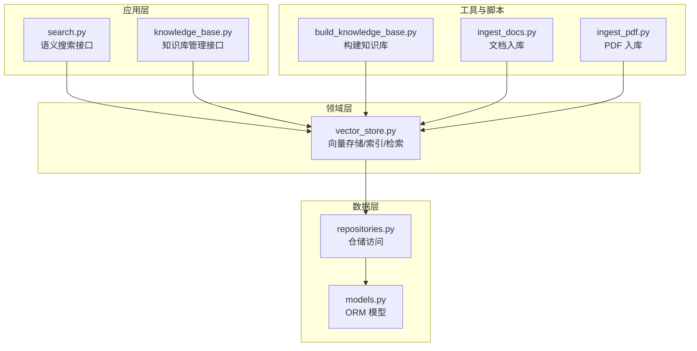
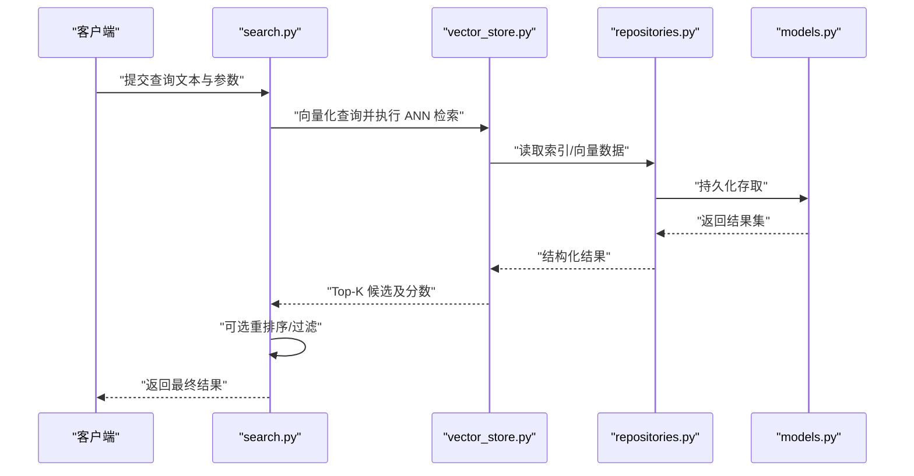
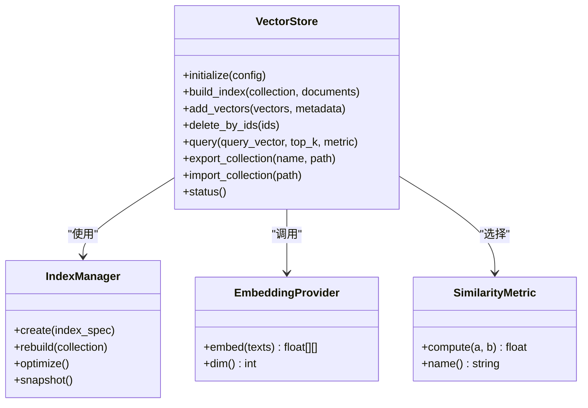
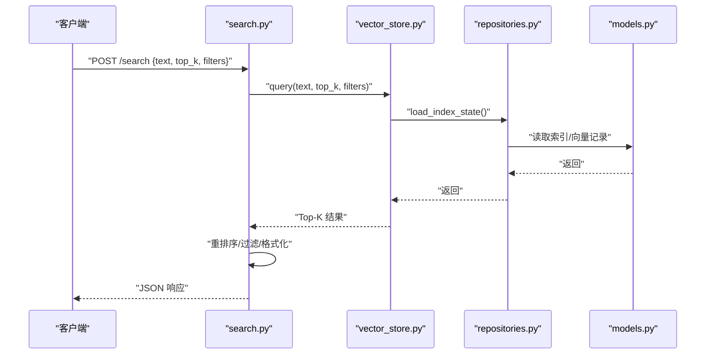
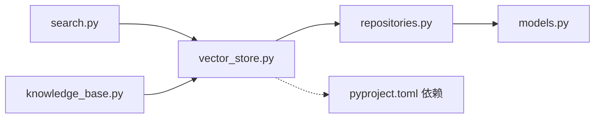

# 向量检索系统

<cite>
**本文引用的文件**   
- [src/loopse/kb/vector_store.py](file://src/loopse/kb/vector_store.py)
- [src/loopse/api/search.py](file://src/loopse/api/search.py)
- [src/loopse/api/knowledge_base.py](file://src/loopse/api/knowledge_base.py)
- [src/loopse/db/models.py](file://src/loopse/db/models.py)
- [src/loopse/db/repositories.py](file://src/loopse/db/repositories.py)
- [scripts/build_knowledge_base.py](file://scripts/build_knowledge_base.py)
- [scripts/ingest_docs.py](file://scripts/ingest_docs.py)
- [scripts/ingest_pdf.py](file://scripts/ingest_pdf.py)
- [pyproject.toml](file://pyproject.toml)
</cite>

## 目录
1. [简介](#简介)
2. [项目结构](#项目结构)
3. [核心组件](#核心组件)
4. [架构总览](#架构总览)
5. [详细组件分析](#详细组件分析)
6. [依赖关系分析](#依赖关系分析)
7. [性能与调优](#性能与调优)
8. [故障排查指南](#故障排查指南)
9. [结论](#结论)
10. [附录](#附录)

## 简介
本技术文档面向“向量检索系统”，围绕以下目标展开：
- 向量嵌入生成、相似度计算与索引构建算法
- 向量存储架构、内存管理与磁盘持久化策略
- 语义搜索实现：查询向量化、近似最近邻搜索（ANN）与结果重排序
- 维度优化、索引参数调优与查询性能监控
- 批量导入导出、数据迁移工具与备份恢复机制
- 集成不同向量模型与自定义相似度度量函数

本仓库采用分层设计，将知识处理、API 接口、数据库与脚本工具解耦，便于扩展与运维。

## 项目结构
与向量检索相关的核心路径与职责如下：
- 知识库与向量层：src/loopse/kb/vector_store.py
- API 层：src/loopse/api/search.py、src/loopse/api/knowledge_base.py
- 数据模型与仓储：src/loopse/db/models.py、src/loopse/db/repositories.py
- 批处理与入库脚本：scripts/build_knowledge_base.py、scripts/ingest_docs.py、scripts/ingest_pdf.py
- 依赖声明：pyproject.toml

图表来源
- [src/loopse/api/search.py](file://src/loopse/api/search.py)
- [src/loopse/api/knowledge_base.py](file://src/loopse/api/knowledge_base.py)
- [src/loopse/kb/vector_store.py](file://src/loopse/kb/vector_store.py)
- [src/loopse/db/models.py](file://src/loopse/db/models.py)
- [src/loopse/db/repositories.py](file://src/loopse/db/repositories.py)
- [scripts/build_knowledge_base.py](file://scripts/build_knowledge_base.py)
- [scripts/ingest_docs.py](file://scripts/ingest_docs.py)
- [scripts/ingest_pdf.py](file://scripts/ingest_pdf.py)

章节来源
- [src/loopse/kb/vector_store.py](file://src/loopse/kb/vector_store.py)
- [src/loopse/api/search.py](file://src/loopse/api/search.py)
- [src/loopse/api/knowledge_base.py](file://src/loopse/api/knowledge_base.py)
- [src/loopse/db/models.py](file://src/loopse/db/models.py)
- [src/loopse/db/repositories.py](file://src/loopse/db/repositories.py)
- [scripts/build_knowledge_base.py](file://scripts/build_knowledge_base.py)
- [scripts/ingest_docs.py](file://scripts/ingest_docs.py)
- [scripts/ingest_pdf.py](file://scripts/ingest_pdf.py)

## 核心组件
- 向量存储与索引（vector_store.py）
  - 负责向量数据的增删改查、索引构建、相似性检索与持久化
  - 提供统一的 API 供上层 API 与脚本调用
- 语义搜索接口（search.py）
  - 对外暴露查询入口，完成查询文本到向量、ANN 检索与可选重排序
- 知识库管理接口（knowledge_base.py）
  - 提供集合/分片级别的元数据与统计信息，辅助导入导出与生命周期管理
- 数据模型与仓储（models.py、repositories.py）
  - 定义向量条目、元数据、索引状态等 ORM 模型
  - 封装对底层存储的读写操作，屏蔽具体后端差异
- 批处理与入库脚本（build_knowledge_base.py、ingest_docs.py、ingest_pdf.py）
  - 支持批量导入、增量更新、PDF 解析入库、知识库重建等任务

章节来源
- [src/loopse/kb/vector_store.py](file://src/loopse/kb/vector_store.py)
- [src/loopse/api/search.py](file://src/loopse/api/search.py)
- [src/loopse/api/knowledge_base.py](file://src/loopse/api/knowledge_base.py)
- [src/loopse/db/models.py](file://src/loopse/db/models.py)
- [src/loopse/db/repositories.py](file://src/loopse/db/repositories.py)
- [scripts/build_knowledge_base.py](file://scripts/build_knowledge_base.py)
- [scripts/ingest_docs.py](file://scripts/ingest_docs.py)
- [scripts/ingest_pdf.py](file://scripts/ingest_pdf.py)

## 架构总览
整体采用“API 层 → 领域服务层 → 数据仓储层”的分层架构，向量检索作为领域服务被多个入口复用。

图表来源
- [src/loopse/api/search.py](file://src/loopse/api/search.py)
- [src/loopse/kb/vector_store.py](file://src/loopse/kb/vector_store.py)
- [src/loopse/db/repositories.py](file://src/loopse/db/repositories.py)
- [src/loopse/db/models.py](file://src/loopse/db/models.py)

## 详细组件分析

### 向量存储与索引（vector_store.py）
职责与能力
- 向量嵌入生成：封装外部嵌入模型的调用，统一输入输出格式
- 相似度计算：支持多种度量（如余弦、内积、欧氏），可配置
- 索引构建：支持全量/增量构建，维护索引状态与版本
- 内存与持久化：在内存中缓存热点索引，定期落盘；支持断点续建
- 检索流程：查询向量化 → ANN 搜索 → Top-K 召回 → 可选精排

关键流程（类图）

图表来源
- [src/loopse/kb/vector_store.py](file://src/loopse/kb/vector_store.py)

章节来源
- [src/loopse/kb/vector_store.py](file://src/loopse/kb/vector_store.py)

### 语义搜索接口（search.py）
职责与能力
- 接收查询请求，校验参数
- 调用向量存储进行查询向量化与 ANN 检索
- 支持过滤条件、分页、评分归一化与重排序
- 返回标准化响应体，包含命中项、分数与元数据

典型调用序列

图表来源
- [src/loopse/api/search.py](file://src/loopse/api/search.py)
- [src/loopse/kb/vector_store.py](file://src/loopse/kb/vector_store.py)
- [src/loopse/db/repositories.py](file://src/loopse/db/repositories.py)
- [src/loopse/db/models.py](file://src/loopse/db/models.py)

章节来源
- [src/loopse/api/search.py](file://src/loopse/api/search.py)

### 知识库管理接口（knowledge_base.py）
职责与能力
- 集合/分片的创建、删除、列出与统计
- 导出/导入集合元数据与索引快照
- 与 vector_store 协作完成批量操作的事务边界控制

章节来源
- [src/loopse/api/knowledge_base.py](file://src/loopse/api/knowledge_base.py)

### 数据模型与仓储（models.py、repositories.py）
职责与能力
- models.py：定义向量条目、元数据、索引状态、任务日志等表结构
- repositories.py：封装 SQL/NoSQL 访问逻辑，提供事务、重试与分页

章节来源
- [src/loopse/db/models.py](file://src/loopse/db/models.py)
- [src/loopse/db/repositories.py](file://src/loopse/db/repositories.py)

### 批处理与入库脚本（build_knowledge_base.py、ingest_docs.py、ingest_pdf.py）
职责与能力
- build_knowledge_base.py：从原始数据源构建知识库，触发索引重建
- ingest_docs.py：批量导入文本/结构化文档，自动切块与向量化
- ingest_pdf.py：解析 PDF，提取正文与元数据，入库并更新索引

章节来源
- [scripts/build_knowledge_base.py](file://scripts/build_knowledge_base.py)
- [scripts/ingest_docs.py](file://scripts/ingest_docs.py)
- [scripts/ingest_pdf.py](file://scripts/ingest_pdf.py)

## 依赖关系分析
- 模块耦合
  - search.py 与 knowledge_base.py 仅依赖 vector_store.py 提供的领域能力，保持低耦合
  - vector_store.py 通过 repositories.py 访问持久化层，屏蔽底层差异
- 外部依赖
  - 嵌入模型与相似度库由 pyproject.toml 声明，便于环境隔离与升级

图表来源
- [src/loopse/api/search.py](file://src/loopse/api/search.py)
- [src/loopse/api/knowledge_base.py](file://src/loopse/api/knowledge_base.py)
- [src/loopse/kb/vector_store.py](file://src/loopse/kb/vector_store.py)
- [src/loopse/db/repositories.py](file://src/loopse/db/repositories.py)
- [src/loopse/db/models.py](file://src/loopse/db/models.py)
- [pyproject.toml](file://pyproject.toml)

章节来源
- [pyproject.toml](file://pyproject.toml)

## 性能与调优
- 向量维度优化
  - 根据下游任务与硬件预算选择合适维度；高维提升精度但增加 I/O 与计算成本
  - 建议先评估业务指标再决定维度，必要时引入降维或量化
- 索引参数调优
  - 调整 Top-K、过滤阈值、相似度度量与索引类型（如倒排+HNSW/IVF）以平衡延迟与召回
  - 对热点集合启用内存常驻索引，冷数据走磁盘
- 查询性能监控
  - 记录端到端耗时、ANN 阶段耗时、I/O 等待与 CPU/GPU 利用率
  - 建立 P95/P99 延迟与吞吐看板，设置告警阈值
- 批量导入优化
  - 分批写入、并行切块与向量化、异步索引构建，避免阻塞在线查询
  - 使用幂等键与去重策略减少重复写入

[本节为通用指导，不直接分析具体文件]

## 故障排查指南
常见问题与定位要点
- 索引不一致
  - 检查索引状态与版本是否匹配，确认重建任务是否成功完成
- 查询超时
  - 关注 ANN 阶段耗时与 I/O 瓶颈，适当降低 Top-K 或增大内存缓存
- 导入失败
  - 核对批次大小、并发度与资源配额；查看入库脚本日志与错误码
- 模型异常
  - 验证嵌入模型初始化、维度一致性与权重加载；回滚至稳定版本

章节来源
- [src/loopse/kb/vector_store.py](file://src/loopse/kb/vector_store.py)
- [scripts/ingest_docs.py](file://scripts/ingest_docs.py)
- [scripts/ingest_pdf.py](file://scripts/ingest_pdf.py)

## 结论
本系统以清晰的层次划分与可扩展的领域服务为核心，实现了从嵌入生成、索引构建到语义检索的完整链路。通过合理的内存与持久化策略、灵活的相似度度量与可插拔的嵌入模型，系统在精度、性能与可维护性之间取得良好平衡。后续可在重排序、多模态检索与分布式索引方面持续演进。

[本节为总结性内容，不直接分析具体文件]

## 附录

### 批量导入导出与数据迁移
- 导入
  - 使用 ingest_docs.py 与 ingest_pdf.py 进行批量入库，支持断点续传与幂等写入
  - 通过 build_knowledge_base.py 触发全量重建，确保索引一致性
- 导出
  - 通过 knowledge_base.py 导出集合元数据与索引快照，配合 vector_store.py 的导出接口完成离线归档
- 迁移
  - 基于仓库与模型版本锁定，保证跨环境迁移的可复现性

章节来源
- [scripts/build_knowledge_base.py](file://scripts/build_knowledge_base.py)
- [scripts/ingest_docs.py](file://scripts/ingest_docs.py)
- [scripts/ingest_pdf.py](file://scripts/ingest_pdf.py)
- [src/loopse/api/knowledge_base.py](file://src/loopse/api/knowledge_base.py)
- [src/loopse/kb/vector_store.py](file://src/loopse/kb/vector_store.py)

### 备份与恢复
- 备份
  - 定期快照索引与元数据，结合对象存储或文件系统归档
- 恢复
  - 按版本恢复索引与元数据，校验完整性后重启服务

章节来源
- [src/loopse/kb/vector_store.py](file://src/loopse/kb/vector_store.py)
- [src/loopse/api/knowledge_base.py](file://src/loopse/api/knowledge_base.py)

### 集成不同向量模型与自定义相似度
- 嵌入模型
  - 通过 embedding provider 抽象接入不同模型，统一维度与归一化策略
- 相似度度量
  - 通过 similarity metric 接口扩展新的距离函数，并在索引与检索时保持一致
- 配置化
  - 在 vector_store 的配置中指定模型与度量，便于灰度与回滚

章节来源
- [src/loopse/kb/vector_store.py](file://src/loopse/kb/vector_store.py)