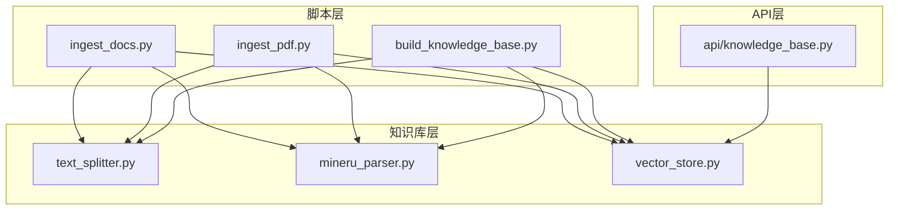
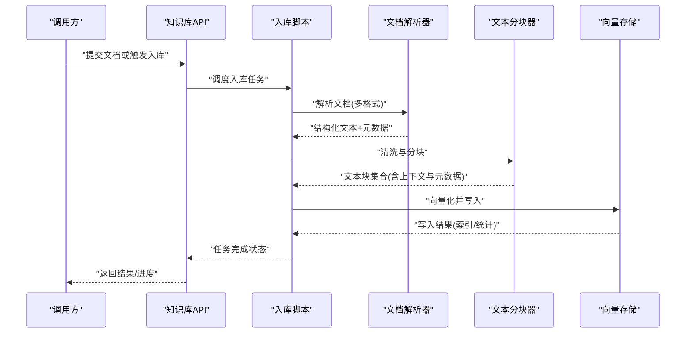
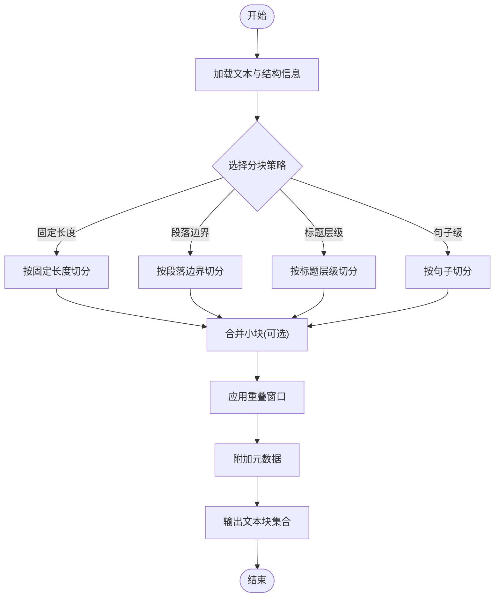
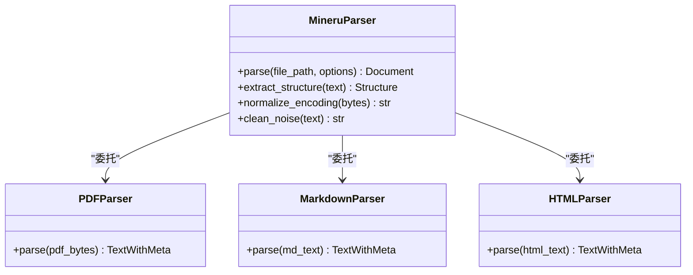
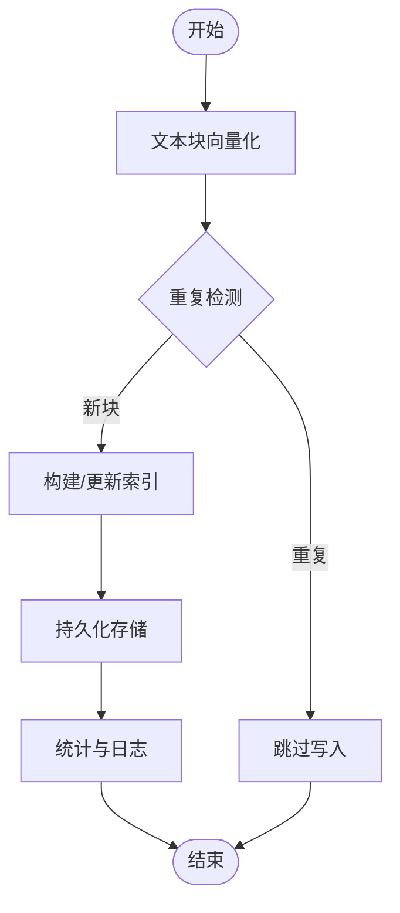
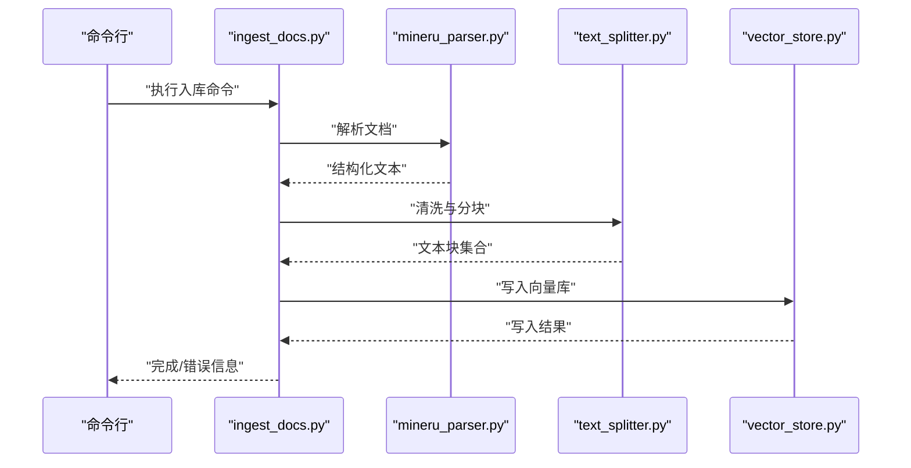
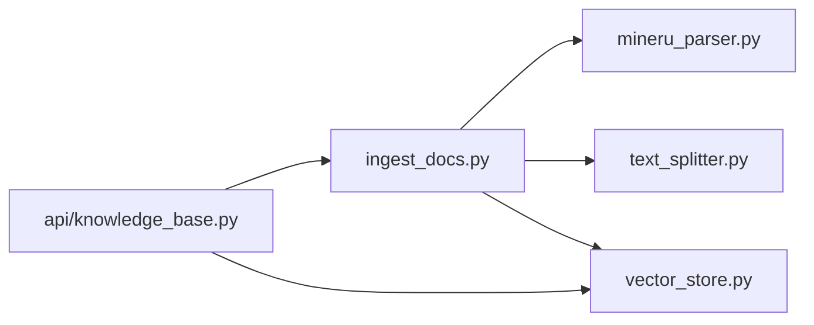

# 文本处理引擎

<cite>
**本文引用的文件**   
- [src/loopse/kb/text_splitter.py](file://src/loopse/kb/text_splitter.py)
- [src/loopse/kb/mineru_parser.py](file://src/loopse/kb/mineru_parser.py)
- [scripts/ingest_docs.py](file://scripts/ingest_docs.py)
- [scripts/ingest_pdf.py](file://scripts/ingest_pdf.py)
- [scripts/build_knowledge_base.py](file://scripts/build_knowledge_base.py)
- [src/loopse/kb/vector_store.py](file://src/loopse/kb/vector_store.py)
- [src/loopse/api/knowledge_base.py](file://src/loopse/api/knowledge_base.py)
</cite>

## 目录
1. [简介](#简介)
2. [项目结构](#项目结构)
3. [核心组件](#核心组件)
4. [架构总览](#架构总览)
5. [详细组件分析](#详细组件分析)
6. [依赖关系分析](#依赖关系分析)
7. [性能考量](#性能考量)
8. [故障排查指南](#故障排查指南)
9. [结论](#结论)
10. [附录](#附录)

## 简介
本技术文档聚焦于仓库中的“文本处理引擎”，围绕以下目标展开：
- 文本分块算法、语义分割策略与上下文保持机制
- 多语言文本预处理、清洗规则与标准化处理
- 长文档切分、重叠窗口处理与元数据保留策略
- 文本质量评估、重复检测与内容完整性验证
- 自定义分块器开发接口与插件扩展机制
- 不同格式文档（PDF、Markdown、HTML等）解析与特殊字符编码处理

该引擎位于知识库构建管线中，负责将原始文档解析为结构化片段，进行清洗与标准化，再按策略切分为适合检索的文本块，并持久化到向量存储以供后续检索与生成使用。

## 项目结构
与文本处理引擎直接相关的代码主要分布在以下位置：
- 知识库层：文本分块、文档解析、向量存储
- 脚本层：批量入库、PDF专用入库、知识库构建
- API层：对外暴露知识库相关能力

图表来源
- [scripts/ingest_docs.py](file://scripts/ingest_docs.py)
- [scripts/ingest_pdf.py](file://scripts/ingest_pdf.py)
- [scripts/build_knowledge_base.py](file://scripts/build_knowledge_base.py)
- [src/loopse/kb/text_splitter.py](file://src/loopse/kb/text_splitter.py)
- [src/loopse/kb/mineru_parser.py](file://src/loopse/kb/mineru_parser.py)
- [src/loopse/kb/vector_store.py](file://src/loopse/kb/vector_store.py)
- [src/loopse/api/knowledge_base.py](file://src/loopse/api/knowledge_base.py)

章节来源
- [scripts/ingest_docs.py](file://scripts/ingest_docs.py)
- [scripts/ingest_pdf.py](file://scripts/ingest_pdf.py)
- [scripts/build_knowledge_base.py](file://scripts/build_knowledge_base.py)
- [src/loopse/kb/text_splitter.py](file://src/loopse/kb/text_splitter.py)
- [src/loopse/kb/mineru_parser.py](file://src/loopse/kb/mineru_parser.py)
- [src/loopse/kb/vector_store.py](file://src/loopse/kb/vector_store.py)
- [src/loopse/api/knowledge_base.py](file://src/loopse/api/knowledge_base.py)

## 核心组件
- 文本分块器（text_splitter.py）
  - 提供通用文本切分能力，支持固定长度、段落边界、标题层级等多策略
  - 维护上下文窗口与重叠区域，确保跨块语义连贯
  - 输出包含元数据的块对象（如来源、路径、页码、时间戳等）
- 文档解析器（mineru_parser.py）
  - 面向复杂文档（PDF、Markdown、HTML等）的结构化提取
  - 统一输出纯文本与结构化信息（标题、列表、表格、图片说明等）
  - 处理编码问题与乱码修复，保证多语言兼容
- 向量存储（vector_store.py）
  - 对文本块进行向量化并持久化
  - 提供索引、查询、去重、更新与删除等能力
- 入库脚本（ingest_docs.py、ingest_pdf.py、build_knowledge_base.py）
  - 编排解析、清洗、分块、质量校验、写入流程
  - 支持批量处理、断点续传、错误隔离与日志记录

章节来源
- [src/loopse/kb/text_splitter.py](file://src/loopse/kb/text_splitter.py)
- [src/loopse/kb/mineru_parser.py](file://src/loopse/kb/mineru_parser.py)
- [src/loopse/kb/vector_store.py](file://src/loopse/kb/vector_store.py)
- [scripts/ingest_docs.py](file://scripts/ingest_docs.py)
- [scripts/ingest_pdf.py](file://scripts/ingest_pdf.py)
- [scripts/build_knowledge_base.py](file://scripts/build_knowledge_base.py)

## 架构总览
文本处理引擎的整体流程如下：
- 输入：多种格式的原始文档（PDF、Markdown、HTML、TXT等）
- 解析：通过解析器提取结构与文本
- 清洗：去除噪声、标准化编码、规范化空白与标点
- 分块：按策略切分为语义连贯的文本块，保留上下文与元数据
- 质量评估：执行重复检测、完整性校验与质量评分
- 存储：向量化并写入向量库，建立索引
- 输出：供检索、问答与生成任务使用

图表来源
- [src/loopse/api/knowledge_base.py](file://src/loopse/api/knowledge_base.py)
- [scripts/ingest_docs.py](file://scripts/ingest_docs.py)
- [scripts/ingest_pdf.py](file://scripts/ingest_pdf.py)
- [scripts/build_knowledge_base.py](file://scripts/build_knowledge_base.py)
- [src/loopse/kb/mineru_parser.py](file://src/loopse/kb/mineru_parser.py)
- [src/loopse/kb/text_splitter.py](file://src/loopse/kb/text_splitter.py)
- [src/loopse/kb/vector_store.py](file://src/loopse/kb/vector_store.py)

## 详细组件分析

### 文本分块器（text_splitter.py）
- 设计要点
  - 多策略分块：固定长度、段落边界、标题层级、句子级切分
  - 语义分割：结合标题与段落结构，尽量在语义边界处切分
  - 上下文保持：通过重叠窗口与前后缀拼接，减少跨块信息丢失
  - 元数据保留：每个块携带来源、路径、页码、时间戳、父块ID等
- 关键流程
  - 输入：清洗后的文本与结构化信息
  - 切分：根据配置选择策略，生成候选块
  - 合并：基于语义相似度或结构约束合并小块
  - 输出：带元数据的文本块序列

图表来源
- [src/loopse/kb/text_splitter.py](file://src/loopse/kb/text_splitter.py)

章节来源
- [src/loopse/kb/text_splitter.py](file://src/loopse/kb/text_splitter.py)

### 文档解析器（mineru_parser.py）
- 设计要点
  - 多格式支持：PDF、Markdown、HTML、TXT等
  - 结构化提取：标题、列表、表格、图片说明、脚注等
  - 编码处理：自动检测与修复编码，避免乱码
  - 多语言兼容：Unicode规范化、全角半角统一、繁简转换（可选）
- 关键流程
  - 输入：原始字节流或文件路径
  - 解析：根据格式选择对应解析器
  - 清洗：去除不可见字符、多余空白、无效标签
  - 输出：统一结构的文本与元数据

图表来源
- [src/loopse/kb/mineru_parser.py](file://src/loopse/kb/mineru_parser.py)

章节来源
- [src/loopse/kb/mineru_parser.py](file://src/loopse/kb/mineru_parser.py)

### 向量存储（vector_store.py）
- 设计要点
  - 向量化：将文本块转换为向量表示
  - 索引：建立高效检索索引
  - 去重：基于相似度阈值与指纹检测避免重复写入
  - 更新：支持增量写入、覆盖更新与删除
- 关键流程
  - 输入：文本块集合（含元数据）
  - 处理：向量化、去重、索引构建
  - 输出：写入结果与统计信息

图表来源
- [src/loopse/kb/vector_store.py](file://src/loopse/kb/vector_store.py)

章节来源
- [src/loopse/kb/vector_store.py](file://src/loopse/kb/vector_store.py)

### 入库脚本（ingest_docs.py、ingest_pdf.py、build_knowledge_base.py）
- ingest_docs.py
  - 通用文档入库：遍历目录、识别格式、调用解析器与分块器、写入向量库
  - 支持断点续传与错误隔离
- ingest_pdf.py
  - PDF专用入库：优化大PDF处理、分页解析、图像与表格提取
- build_knowledge_base.py
  - 知识库构建：批量处理、质量评估、重复检测、完整性校验、统计报告

图表来源
- [scripts/ingest_docs.py](file://scripts/ingest_docs.py)
- [scripts/ingest_pdf.py](file://scripts/ingest_pdf.py)
- [scripts/build_knowledge_base.py](file://scripts/build_knowledge_base.py)
- [src/loopse/kb/mineru_parser.py](file://src/loopse/kb/mineru_parser.py)
- [src/loopse/kb/text_splitter.py](file://src/loopse/kb/text_splitter.py)
- [src/loopse/kb/vector_store.py](file://src/loopse/kb/vector_store.py)

章节来源
- [scripts/ingest_docs.py](file://scripts/ingest_docs.py)
- [scripts/ingest_pdf.py](file://scripts/ingest_pdf.py)
- [scripts/build_knowledge_base.py](file://scripts/build_knowledge_base.py)

### API集成（api/knowledge_base.py）
- 功能
  - 提供REST接口用于上传文档、触发入库、查询知识库
  - 封装入库脚本调用与异步任务管理
- 关键点
  - 参数校验与权限控制
  - 任务状态跟踪与进度反馈
  - 错误处理与重试机制

章节来源
- [src/loopse/api/knowledge_base.py](file://src/loopse/api/knowledge_base.py)

## 依赖关系分析
- 模块耦合
  - 入库脚本依赖解析器、分块器与向量存储
  - API层依赖入库脚本与向量存储
  - 解析器内部可组合多个格式解析器
- 外部依赖
  - 文档解析库（PDF、Markdown、HTML）
  - 向量化模型与向量数据库
  - 编码检测与修复工具

图表来源
- [scripts/ingest_docs.py](file://scripts/ingest_docs.py)
- [src/loopse/api/knowledge_base.py](file://src/loopse/api/knowledge_base.py)
- [src/loopse/kb/mineru_parser.py](file://src/loopse/kb/mineru_parser.py)
- [src/loopse/kb/text_splitter.py](file://src/loopse/kb/text_splitter.py)
- [src/loopse/kb/vector_store.py](file://src/loopse/kb/vector_store.py)

章节来源
- [scripts/ingest_docs.py](file://scripts/ingest_docs.py)
- [src/loopse/api/knowledge_base.py](file://src/loopse/api/knowledge_base.py)
- [src/loopse/kb/mineru_parser.py](file://src/loopse/kb/mineru_parser.py)
- [src/loopse/kb/text_splitter.py](file://src/loopse/kb/text_splitter.py)
- [src/loopse/kb/vector_store.py](file://src/loopse/kb/vector_store.py)

## 性能考量
- 分块策略选择
  - 固定长度适合快速切分但可能破坏语义
  - 段落/标题边界更利于语义连贯，但需额外结构解析开销
- 重叠窗口大小
  - 过大导致冗余与存储成本上升
  - 过小可能导致跨块信息丢失
- 向量化与索引
  - 批量向量化提升吞吐
  - 增量更新避免全量重建
- 内存与并发
  - 大文件分块读取，避免一次性加载
  - 并行解析与写入，注意资源竞争与锁

[本节为通用指导，不直接分析具体文件]

## 故障排查指南
- 常见错误
  - 编码异常：检查解析器的编码检测与修复逻辑
  - 解析失败：确认文件格式与解析器匹配
  - 分块异常：调整分块策略与重叠窗口参数
  - 写入失败：检查向量存储连接与权限
- 调试建议
  - 启用详细日志，记录每一步输入输出
  - 对单个文件进行最小复现测试
  - 使用质量评估与重复检测报告定位问题

章节来源
- [scripts/ingest_docs.py](file://scripts/ingest_docs.py)
- [scripts/ingest_pdf.py](file://scripts/ingest_pdf.py)
- [scripts/build_knowledge_base.py](file://scripts/build_knowledge_base.py)
- [src/loopse/kb/mineru_parser.py](file://src/loopse/kb/mineru_parser.py)
- [src/loopse/kb/text_splitter.py](file://src/loopse/kb/text_splitter.py)
- [src/loopse/kb/vector_store.py](file://src/loopse/kb/vector_store.py)

## 结论
文本处理引擎通过模块化设计实现了从多格式文档解析到高质量文本块生成的完整流水线。其核心优势在于：
- 灵活的分块策略与上下文保持机制
- 强大的多语言与编码处理能力
- 可扩展的解析器与分块器接口
- 完善的入库脚本与API集成

建议在生产环境中结合业务需求调优分块策略与重叠窗口，并持续监控质量指标与性能表现。

[本节为总结性内容，不直接分析具体文件]

## 附录
- 自定义分块器开发接口
  - 实现统一的分块器接口，支持配置化策略与元数据注入
  - 提供单元测试与基准测试，确保稳定性与性能
- 插件扩展机制
  - 解析器插件：新增格式支持时注册新的解析器
  - 质量评估插件：扩展重复检测、完整性校验与评分规则
  - 存储插件：适配不同的向量数据库后端

[本节为概念性内容，不直接分析具体文件]