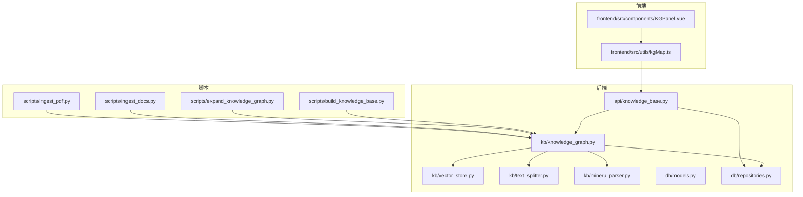
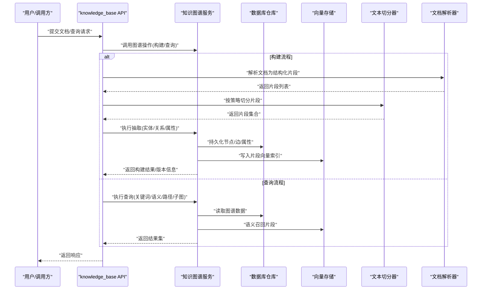
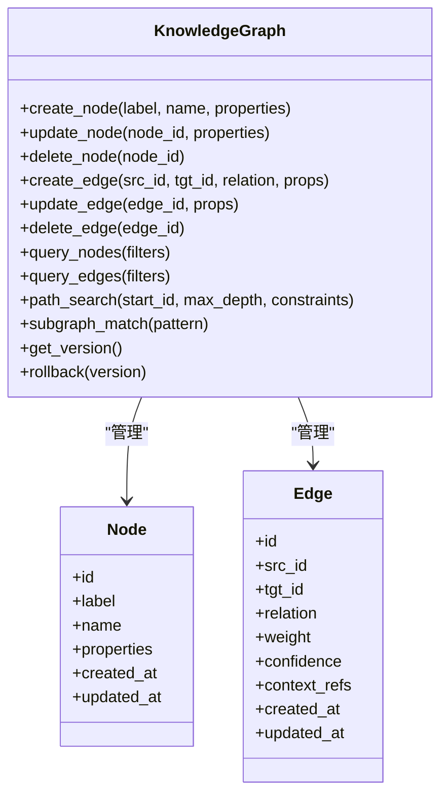
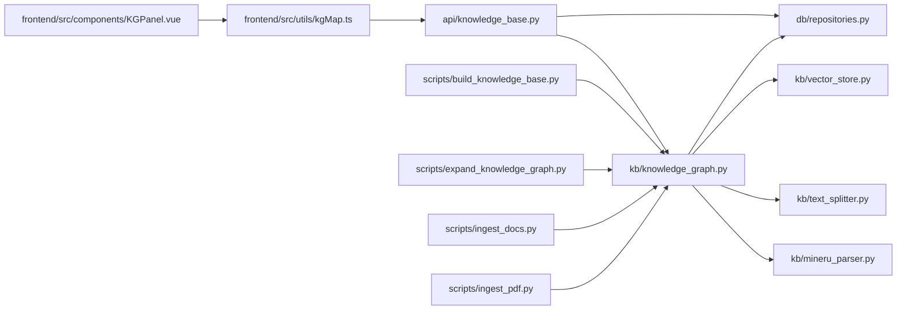

# 知识图谱核心

<cite>
**本文引用的文件**   
- [src/loopse/kb/knowledge_graph.py](file://src/loopse/kb/knowledge_graph.py)
- [src/loopse/kb/vector_store.py](file://src/loopse/kb/vector_store.py)
- [src/loopse/kb/text_splitter.py](file://src/loopse/kb/text_splitter.py)
- [src/loopse/kb/mineru_parser.py](file://src/loopse/kb/mineru_parser.py)
- [src/loopse/db/models.py](file://src/loopse/db/models.py)
- [src/loopse/db/repositories.py](file://src/loopse/db/repositories.py)
- [src/loopse/api/knowledge_base.py](file://src/loopse/api/knowledge_base.py)
- [scripts/build_knowledge_base.py](file://scripts/build_knowledge_base.py)
- [scripts/expand_knowledge_graph.py](file://scripts/expand_knowledge_graph.py)
- [scripts/ingest_docs.py](file://scripts/ingest_docs.py)
- [scripts/ingest_pdf.py](file://scripts/ingest_pdf.py)
- [frontend/src/utils/kgMap.ts](file://frontend/src/utils/kgMap.ts)
- [frontend/src/components/KGPanel.vue](file://frontend/src/components/KGPanel.vue)
</cite>

## 目录
1. [简介](#简介)
2. [项目结构](#项目结构)
3. [核心组件](#核心组件)
4. [架构总览](#架构总览)
5. [详细组件分析](#详细组件分析)
6. [依赖关系分析](#依赖关系分析)
7. [性能考虑](#性能考虑)
8. [故障排查指南](#故障排查指南)
9. [结论](#结论)
10. [附录](#附录)

## 简介
本技术文档聚焦于“知识图谱核心”模块，覆盖结构化知识表示模型、实体与关系建模、图谱数据结构设计；知识抽取算法（命名实体识别、关系提取、属性抽取）的实现要点；图谱构建流程、增量更新机制与版本管理策略；查询语言支持、路径搜索与子图匹配能力；可视化数据格式与渲染接口；以及如何扩展新的实体类型与关系模式，并给出性能优化建议。

## 项目结构
知识图谱相关代码主要分布在后端 kb 层、db 持久化层、API 暴露层以及前端可视化层，同时提供脚本工具用于批量构建与增量扩展现有图谱。

图表来源
- [src/loopse/kb/knowledge_graph.py](file://src/loopse/kb/knowledge_graph.py)
- [src/loopse/kb/vector_store.py](file://src/loopse/kb/vector_store.py)
- [src/loopse/kb/text_splitter.py](file://src/loopse/kb/text_splitter.py)
- [src/loopse/kb/mineru_parser.py](file://src/loopse/kb/mineru_parser.py)
- [src/loopse/db/models.py](file://src/loopse/db/models.py)
- [src/loopse/db/repositories.py](file://src/loopse/db/repositories.py)
- [src/loopse/api/knowledge_base.py](file://src/loopse/api/knowledge_base.py)
- [scripts/build_knowledge_base.py](file://scripts/build_knowledge_base.py)
- [scripts/expand_knowledge_graph.py](file://scripts/expand_knowledge_graph.py)
- [scripts/ingest_docs.py](file://scripts/ingest_docs.py)
- [scripts/ingest_pdf.py](file://scripts/ingest_pdf.py)
- [frontend/src/utils/kgMap.ts](file://frontend/src/utils/kgMap.ts)
- [frontend/src/components/KGPanel.vue](file://frontend/src/components/KGPanel.vue)

章节来源
- [src/loopse/kb/knowledge_graph.py](file://src/loopse/kb/knowledge_graph.py)
- [src/loopse/api/knowledge_base.py](file://src/loopse/api/knowledge_base.py)
- [scripts/build_knowledge_base.py](file://scripts/build_knowledge_base.py)
- [scripts/expand_knowledge_graph.py](file://scripts/expand_knowledge_graph.py)
- [scripts/ingest_docs.py](file://scripts/ingest_docs.py)
- [scripts/ingest_pdf.py](file://scripts/ingest_pdf.py)
- [frontend/src/utils/kgMap.ts](file://frontend/src/utils/kgMap.ts)
- [frontend/src/components/KGPanel.vue](file://frontend/src/components/KGPanel.vue)

## 核心组件
- 知识图谱服务：封装节点、边、标签、属性的增删改查，提供路径搜索、子图匹配、聚合统计等能力。
- 向量存储：维护文本片段与其嵌入向量的索引，支撑语义检索与召回。
- 文本切分器：将长文档切分为可管理的片段，便于后续抽取与索引。
- 解析器：对 PDF/文档进行结构化解析，输出可用于抽取的原始内容。
- 数据库模型与仓库：定义图谱实体、关系、属性及元数据的持久化模型与访问方法。
- API 层：对外暴露图谱查询、构建、更新、导出等接口。
- 构建与扩展示例脚本：演示从文档到图谱的端到端流程，以及增量扩展现有图谱。
- 前端可视化：提供图谱数据格式与渲染组件，支持交互浏览。

章节来源
- [src/loopse/kb/knowledge_graph.py](file://src/loopse/kb/knowledge_graph.py)
- [src/loopse/kb/vector_store.py](file://src/loopse/kb/vector_store.py)
- [src/loopse/kb/text_splitter.py](file://src/loopse/kb/text_splitter.py)
- [src/loopse/kb/mineru_parser.py](file://src/loopse/kb/mineru_parser.py)
- [src/loopse/db/models.py](file://src/loopse/db/models.py)
- [src/loopse/db/repositories.py](file://src/loopse/db/repositories.py)
- [src/loopse/api/knowledge_base.py](file://src/loopse/api/knowledge_base.py)
- [scripts/build_knowledge_base.py](file://scripts/build_knowledge_base.py)
- [scripts/expand_knowledge_graph.py](file://scripts/expand_knowledge_graph.py)
- [frontend/src/utils/kgMap.ts](file://frontend/src/utils/kgMap.ts)
- [frontend/src/components/KGPanel.vue](file://frontend/src/components/KGPanel.vue)

## 架构总览
下图展示了从文档输入到图谱构建、查询与可视化的整体流程，包括抽取、入库、索引与检索的关键环节。

图表来源
- [src/loopse/api/knowledge_base.py](file://src/loopse/api/knowledge_base.py)
- [src/loopse/kb/knowledge_graph.py](file://src/loopse/kb/knowledge_graph.py)
- [src/loopse/db/repositories.py](file://src/loopse/db/repositories.py)
- [src/loopse/kb/vector_store.py](file://src/loopse/kb/vector_store.py)
- [src/loopse/kb/text_splitter.py](file://src/loopse/kb/text_splitter.py)
- [src/loopse/kb/mineru_parser.py](file://src/loopse/kb/mineru_parser.py)

## 详细组件分析

### 知识图谱服务（结构与算法）
- 数据结构设计
  - 节点：包含唯一标识、类型标签、名称、属性字典、创建/更新时间戳等。
  - 边：包含源节点、目标节点、关系类型、权重、置信度、上下文片段引用等。
  - 属性：以键值形式附加在节点或边上，支持基础类型与结构化对象。
- 核心能力
  - 节点/边 CRUD：创建、更新、删除、批量导入。
  - 查询：按标签过滤、按属性条件筛选、按关系遍历、路径搜索、子图匹配。
  - 统计：节点/边计数、密度、连通分量统计。
  - 版本：记录每次变更的版本号与时间戳，支持回滚与对比。
- 路径搜索与子图匹配
  - 路径搜索：支持多跳遍历、最大深度限制、关系类型约束、权重阈值过滤。
  - 子图匹配：基于模式图（节点类型+关系类型）进行匹配，返回候选子图集合。
- 复杂度与优化
  - 路径搜索采用 BFS/DFS 结合剪枝策略，避免指数级爆炸。
  - 子图匹配使用索引加速（节点标签索引、关系类型索引）。
  - 批量操作采用事务与批写减少 IO 开销。

图表来源
- [src/loopse/kb/knowledge_graph.py](file://src/loopse/kb/knowledge_graph.py)

章节来源
- [src/loopse/kb/knowledge_graph.py](file://src/loopse/kb/knowledge_graph.py)

### 向量存储（语义检索）
- 功能
  - 文本片段与向量映射：将切分后的片段生成嵌入向量并建立索引。
  - 相似度检索：根据查询向量召回 Top-K 片段，支持过滤标签与时间范围。
  - 增量更新：新增片段时追加索引，删除片段时清理索引。
- 性能
  - 使用近似最近邻（ANN）索引提升检索速度。
  - 批量写入与异步刷新降低延迟。

章节来源
- [src/loopse/kb/vector_store.py](file://src/loopse/kb/vector_store.py)

### 文本切分器（片段化）
- 策略
  - 固定长度切分：按字符/词数窗口滑动。
  - 语义边界切分：依据段落、标题、标点进行更自然的分割。
  - 重叠窗口：保证相邻片段共享上下文，利于跨片段关系抽取。
- 输出
  - 片段列表，附带起始位置、结束位置、父文档 ID、片段 ID。

章节来源
- [src/loopse/kb/text_splitter.py](file://src/loopse/kb/text_splitter.py)

### 文档解析器（PDF/文档）
- 功能
  - 解析 PDF/文档为结构化内容（标题、段落、表格、列表等）。
  - 清洗噪声（页眉页脚、水印），保留关键信息。
- 输出
  - 标准化片段结构，供切分器与抽取流程使用。

章节来源
- [src/loopse/kb/mineru_parser.py](file://src/loopse/kb/mineru_parser.py)

### 数据库模型与仓库（持久化）
- 模型
  - 节点表：存储节点 ID、标签、名称、属性 JSON、时间戳。
  - 边表：存储边 ID、源/目标节点 ID、关系类型、权重、置信度、上下文引用、时间戳。
  - 版本表：记录版本号、变更摘要、时间戳、状态。
- 仓库
  - 提供原子事务、批量插入、分页查询、条件过滤等方法。
  - 索引优化：对标签、关系类型、时间戳建立索引以提升查询性能。

章节来源
- [src/loopse/db/models.py](file://src/loopse/db/models.py)
- [src/loopse/db/repositories.py](file://src/loopse/db/repositories.py)

### API 层（对外接口）
- 构建接口
  - 上传文档、触发抽取、返回构建任务 ID 与进度。
- 查询接口
  - 关键词检索、语义检索、路径查询、子图匹配、统计信息。
- 管理接口
  - 版本查看、回滚、导出图谱快照。

章节来源
- [src/loopse/api/knowledge_base.py](file://src/loopse/api/knowledge_base.py)

### 构建与扩展示例脚本
- 构建脚本
  - 从文档目录批量解析、切分、抽取、入库，生成初始图谱。
- 扩展示例
  - 增量导入新文档，合并重复实体，更新关系与属性，生成新版本。

章节来源
- [scripts/build_knowledge_base.py](file://scripts/build_knowledge_base.py)
- [scripts/expand_knowledge_graph.py](file://scripts/expand_knowledge_graph.py)
- [scripts/ingest_docs.py](file://scripts/ingest_docs.py)
- [scripts/ingest_pdf.py](file://scripts/ingest_pdf.py)

### 前端可视化（数据格式与渲染）
- 数据格式
  - 节点数组：包含 id、label、name、properties、position 等。
  - 边数组：包含 source、target、relation、weight、confidence 等。
  - 可选布局参数：force-directed 布局配置、颜色映射规则。
- 渲染组件
  - 提供交互式图谱视图，支持缩放、拖拽、点击高亮、路径显示。
  - 与后端 API 对接，按需加载子图与搜索结果。

章节来源
- [frontend/src/utils/kgMap.ts](file://frontend/src/utils/kgMap.ts)
- [frontend/src/components/KGPanel.vue](file://frontend/src/components/KGPanel.vue)

## 依赖关系分析
- 组件耦合
  - API 层依赖图谱服务与仓库；图谱服务依赖仓库、向量存储、切分器、解析器。
  - 脚本工具直接调用图谱服务与仓库，实现离线构建与增量更新。
  - 前端通过 API 获取图谱数据并进行可视化渲染。
- 外部依赖
  - 向量存储可能依赖 ANN 库（如 FAISS、HNSW 等）。
  - 文档解析可能依赖 PDF 解析库（如 PyMuPDF、pdfplumber 等）。
- 潜在循环依赖
  - 当前分层清晰，未发现明显循环依赖；需确保脚本与 API 不反向依赖前端。

图表来源
- [src/loopse/api/knowledge_base.py](file://src/loopse/api/knowledge_base.py)
- [src/loopse/kb/knowledge_graph.py](file://src/loopse/kb/knowledge_graph.py)
- [src/loopse/db/repositories.py](file://src/loopse/db/repositories.py)
- [src/loopse/kb/vector_store.py](file://src/loopse/kb/vector_store.py)
- [src/loopse/kb/text_splitter.py](file://src/loopse/kb/text_splitter.py)
- [src/loopse/kb/mineru_parser.py](file://src/loopse/kb/mineru_parser.py)
- [scripts/build_knowledge_base.py](file://scripts/build_knowledge_base.py)
- [scripts/expand_knowledge_graph.py](file://scripts/expand_knowledge_graph.py)
- [scripts/ingest_docs.py](file://scripts/ingest_docs.py)
- [scripts/ingest_pdf.py](file://scripts/ingest_pdf.py)
- [frontend/src/utils/kgMap.ts](file://frontend/src/utils/kgMap.ts)
- [frontend/src/components/KGPanel.vue](file://frontend/src/components/KGPanel.vue)

章节来源
- [src/loopse/api/knowledge_base.py](file://src/loopse/api/knowledge_base.py)
- [src/loopse/kb/knowledge_graph.py](file://src/loopse/kb/knowledge_graph.py)
- [src/loopse/db/repositories.py](file://src/loopse/db/repositories.py)
- [src/loopse/kb/vector_store.py](file://src/loopse/kb/vector_store.py)
- [src/loopse/kb/text_splitter.py](file://src/loopse/kb/text_splitter.py)
- [src/loopse/kb/mineru_parser.py](file://src/loopse/kb/mineru_parser.py)
- [scripts/build_knowledge_base.py](file://scripts/build_knowledge_base.py)
- [scripts/expand_knowledge_graph.py](file://scripts/expand_knowledge_graph.py)
- [scripts/ingest_docs.py](file://scripts/ingest_docs.py)
- [scripts/ingest_pdf.py](file://scripts/ingest_pdf.py)
- [frontend/src/utils/kgMap.ts](file://frontend/src/utils/kgMap.ts)
- [frontend/src/components/KGPanel.vue](file://frontend/src/components/KGPanel.vue)

## 性能考虑
- 索引优化
  - 对节点标签、关系类型、时间戳建立复合索引，提升过滤与排序效率。
  - 向量索引使用 ANN 结构，平衡召回率与延迟。
- 批量与事务
  - 构建阶段采用批量写入与事务包裹，减少锁竞争与 IO 次数。
- 缓存策略
  - 热点查询结果短期缓存（如常用子图、统计指标）。
- 并发控制
  - 读写分离：查询走只读副本，写入走主库。
  - 限流与队列：对大规模构建任务进行排队与限速。
- 资源监控
  - 监控内存占用、GC 频率、IO 吞吐，及时调整批次大小与线程池。

[本节为通用性能指导，无需特定文件来源]

## 故障排查指南
- 常见问题
  - 构建失败：检查文档解析是否成功、切分器参数是否合理、抽取模型是否可用。
  - 查询超时：确认索引是否重建、是否存在全表扫描、是否需要增加索引。
  - 向量检索不准：调整嵌入模型、相似度阈值、Top-K 数量。
  - 版本回滚异常：核对版本表完整性、事务一致性。
- 诊断步骤
  - 查看 API 日志与错误码，定位具体失败点。
  - 检查数据库慢查询日志，优化 SQL 与索引。
  - 验证向量索引健康度，必要时重建索引。
  - 使用脚本回放构建流程，复现问题并逐步缩小范围。

章节来源
- [src/loopse/api/knowledge_base.py](file://src/loopse/api/knowledge_base.py)
- [src/loopse/db/repositories.py](file://src/loopse/db/repositories.py)
- [src/loopse/kb/vector_store.py](file://src/loopse/kb/vector_store.py)
- [scripts/build_knowledge_base.py](file://scripts/build_knowledge_base.py)

## 结论
知识图谱核心模块通过清晰的层次划分与模块化设计，实现了从文档解析、文本切分、知识抽取到图谱构建、查询与可视化的完整链路。借助向量存储增强语义检索能力，配合完善的版本管理与增量更新机制，系统具备良好的可扩展性与运维友好性。未来可在抽取精度、查询语言丰富度、子图匹配算法与可视化交互方面持续优化。

[本节为总结性内容，无需特定文件来源]

## 附录

### 知识抽取算法实现要点
- 命名实体识别（NER）
  - 基于预训练模型或规则模板，从片段中识别实体类型与边界。
  - 输出实体列表，包含类型、文本、置信度、上下文片段 ID。
- 关系提取（RE）
  - 基于依存句法、共指消解与模式匹配，识别实体间关系。
  - 输出关系三元组（头实体、尾实体、关系类型、权重、置信度）。
- 属性抽取（AP）
  - 从结构化字段（表格、键值对）与非结构化描述中提取属性。
  - 输出属性键值对，支持类型校验与默认值填充。

章节来源
- [src/loopse/kb/knowledge_graph.py](file://src/loopse/kb/knowledge_graph.py)
- [src/loopse/kb/text_splitter.py](file://src/loopse/kb/text_splitter.py)
- [src/loopse/kb/mineru_parser.py](file://src/loopse/kb/mineru_parser.py)

### 图谱构建流程与增量更新
- 构建流程
  - 解析文档 → 切分片段 → 抽取实体/关系/属性 → 去重与合并 → 持久化 → 索引更新 → 版本登记。
- 增量更新
  - 仅处理新增/变更片段，合并重复实体，更新受影响的关系与属性，生成新版本。
- 版本管理
  - 每次构建/更新生成版本号与变更摘要，支持查看历史与回滚。

章节来源
- [scripts/build_knowledge_base.py](file://scripts/build_knowledge_base.py)
- [scripts/expand_knowledge_graph.py](file://scripts/expand_knowledge_graph.py)
- [src/loopse/db/models.py](file://src/loopse/db/models.py)

### 查询语言支持与路径搜索
- 查询语言
  - 支持简单过滤（标签、属性）、组合条件（AND/OR/NOT）、范围查询。
  - 语义查询：基于向量相似度召回相关片段与关联节点。
- 路径搜索
  - 指定起点、最大深度、关系类型约束，返回所有满足条件的路径。
- 子图匹配
  - 给定模式图（节点类型与关系类型），返回匹配的候选子图集合。

章节来源
- [src/loopse/kb/knowledge_graph.py](file://src/loopse/kb/knowledge_graph.py)
- [src/loopse/api/knowledge_base.py](file://src/loopse/api/knowledge_base.py)

### 可视化数据格式与渲染接口
- 数据格式
  - 节点：id、label、name、properties、position。
  - 边：source、target、relation、weight、confidence。
- 渲染接口
  - 提供初始化、更新节点/边、高亮路径、导出快照等方法。
  - 支持力导向布局、颜色映射、交互事件回调。

章节来源
- [frontend/src/utils/kgMap.ts](file://frontend/src/utils/kgMap.ts)
- [frontend/src/components/KGPanel.vue](file://frontend/src/components/KGPanel.vue)

### 扩展新实体类型与关系模式
- 步骤
  - 定义新实体类型与属性 schema，更新数据库模型与索引。
  - 在抽取流程中添加对应规则或模型，输出新类型的实体/关系。
  - 在 API 与前端增加对新类型的支持（过滤、展示、交互）。
- 注意事项
  - 保持向后兼容，避免破坏现有查询与可视化。
  - 充分测试抽取准确率与性能影响。

章节来源
- [src/loopse/db/models.py](file://src/loopse/db/models.py)
- [src/loopse/kb/knowledge_graph.py](file://src/loopse/kb/knowledge_graph.py)
- [src/loopse/api/knowledge_base.py](file://src/loopse/api/knowledge_base.py)
- [frontend/src/utils/kgMap.ts](file://frontend/src/utils/kgMap.ts)