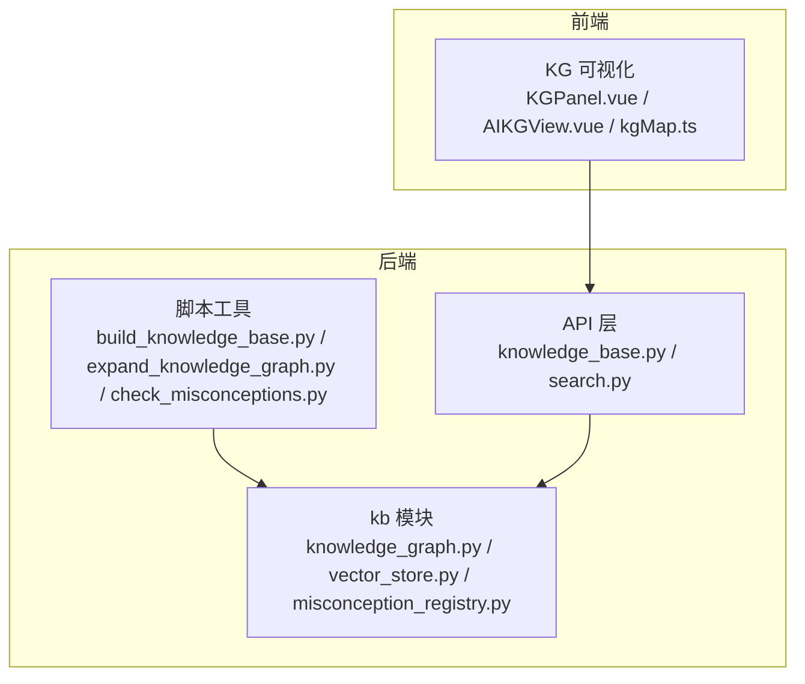
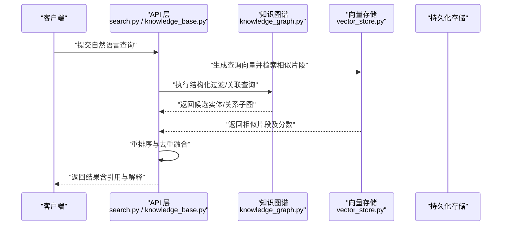
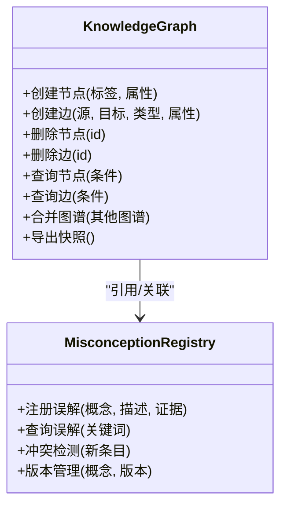
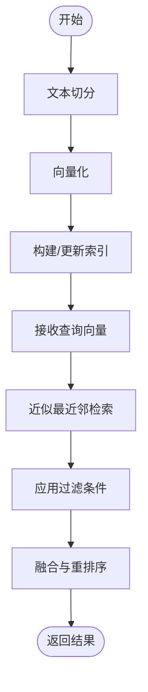
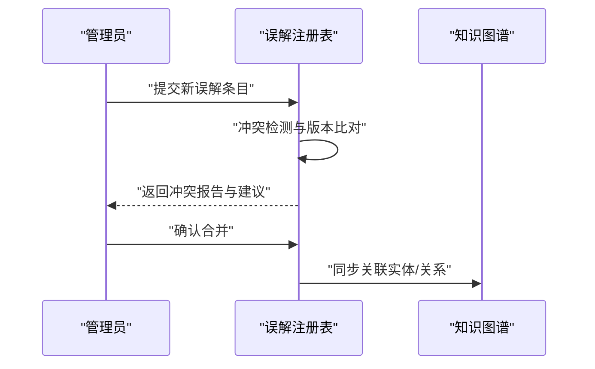
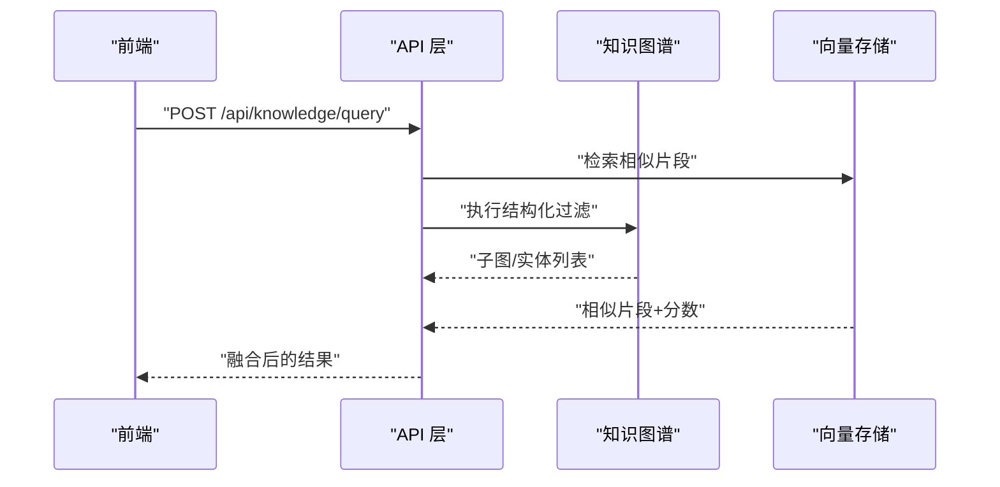
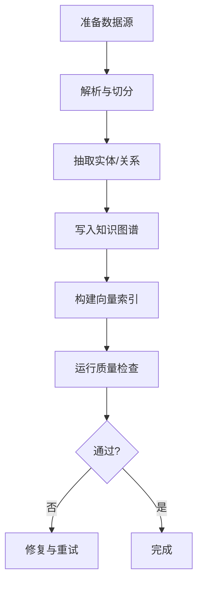
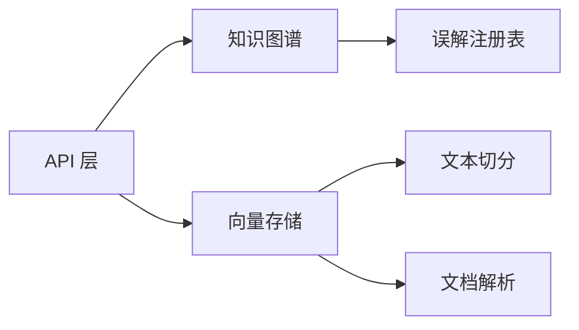

# 知识图谱系统

<cite>
**本文引用的文件**   
- [src/loopse/kb/knowledge_graph.py](file://src/loopse/kb/knowledge_graph.py)
- [src/loopse/kb/vector_store.py](file://src/loopse/kb/vector_store.py)
- [src/loopse/kb/misconception_registry.py](file://src/loopse/kb/misconception_registry.py)
- [src/loopse/kb/text_splitter.py](file://src/loopse/kb/text_splitter.py)
- [src/loopse/kb/mineru_parser.py](file://src/loopse/kb/mineru_parser.py)
- [src/loopse/api/knowledge_base.py](file://src/loopse/api/knowledge_base.py)
- [src/loopse/api/search.py](file://src/loopse/api/search.py)
- [scripts/build_knowledge_base.py](file://scripts/build_knowledge_base.py)
- [scripts/expand_knowledge_graph.py](file://scripts/expand_knowledge_graph.py)
- [scripts/check_misconceptions.py](file://scripts/check_misconceptions.py)
- [scripts/expand_acu.py](file://scripts/expand_acu.py)
- [scripts/reingest_misconceptions.py](file://scripts/reingest_misconceptions.py)
- [frontend/src/utils/kgMap.ts](file://frontend/src/utils/kgMap.ts)
- [frontend/src/components/KGPanel.vue](file://frontend/src/components/KGPanel.vue)
- [frontend/src/views/AIKGView.vue](file://frontend/src/views/AIKGView.vue)
</cite>

## 目录
1. [简介](#简介)
2. [项目结构](#项目结构)
3. [核心组件](#核心组件)
4. [架构总览](#架构总览)
5. [详细组件分析](#详细组件分析)
6. [依赖关系分析](#依赖关系分析)
7. [性能考虑](#性能考虑)
8. [故障排查指南](#故障排查指南)
9. [结论](#结论)
10. [附录](#附录)

## 简介
本技术文档面向“知识图谱系统”，聚焦以下目标：
- 结构化知识表示与实体关系建模
- 语义搜索与向量相似度检索机制
- 知识抽取算法、图谱更新策略
- 向量存储设计、索引优化与查询性能调优
- 误解概念注册表管理与认知偏差检测
- 可视化使用方法与问题排查
- 扩展新领域与导入外部知识库的指引

## 项目结构
围绕知识图谱的核心代码位于后端 kb 模块与 API 层，配套脚本用于构建与扩展现有图谱，前端提供可视化面板。

**图示来源**
- [src/loopse/kb/knowledge_graph.py](file://src/loopse/kb/knowledge_graph.py)
- [src/loopse/kb/vector_store.py](file://src/loopse/kb/vector_store.py)
- [src/loopse/kb/misconception_registry.py](file://src/loopse/kb/misconception_registry.py)
- [src/loopse/api/knowledge_base.py](file://src/loopse/api/knowledge_base.py)
- [src/loopse/api/search.py](file://src/loopse/api/search.py)
- [scripts/build_knowledge_base.py](file://scripts/build_knowledge_base.py)
- [scripts/expand_knowledge_graph.py](file://scripts/expand_knowledge_graph.py)
- [scripts/check_misconceptions.py](file://scripts/check_misconceptions.py)
- [frontend/src/components/KGPanel.vue](file://frontend/src/components/KGPanel.vue)
- [frontend/src/views/AIKGView.vue](file://frontend/src/views/AIKGView.vue)
- [frontend/src/utils/kgMap.ts](file://frontend/src/utils/kgMap.ts)

**章节来源**
- [src/loopse/kb/knowledge_graph.py](file://src/loopse/kb/knowledge_graph.py)
- [src/loopse/kb/vector_store.py](file://src/loopse/kb/vector_store.py)
- [src/loopse/kb/misconception_registry.py](file://src/loopse/kb/misconception_registry.py)
- [src/loopse/api/knowledge_base.py](file://src/loopse/api/knowledge_base.py)
- [src/loopse/api/search.py](file://src/loopse/api/search.py)
- [scripts/build_knowledge_base.py](file://scripts/build_knowledge_base.py)
- [scripts/expand_knowledge_graph.py](file://scripts/expand_knowledge_graph.py)
- [scripts/check_misconceptions.py](file://scripts/check_misconceptions.py)
- [frontend/src/components/KGPanel.vue](file://frontend/src/components/KGPanel.vue)
- [frontend/src/views/AIKGView.vue](file://frontend/src/views/AIKGView.vue)
- [frontend/src/utils/kgMap.ts](file://frontend/src/utils/kgMap.ts)

## 核心组件
- 知识图谱模型与操作：负责节点、边、属性与关系的增删改查，以及基于规则的推理与聚合。
- 向量存储与检索：提供文本分块、向量化、索引构建与相似度检索接口。
- 误解概念注册表：管理常见误解条目、版本与证据链，支持冲突检测与消解。
- 解析与切分：对多源文档进行结构化解析与段落切分，为后续抽取与入库做准备。
- API 服务：对外暴露知识图谱与检索能力，统一鉴权与限流。
- 构建与运维脚本：批量导入、增量扩编、质量校验与回归检查。

**章节来源**
- [src/loopse/kb/knowledge_graph.py](file://src/loopse/kb/knowledge_graph.py)
- [src/loopse/kb/vector_store.py](file://src/loopse/kb/vector_store.py)
- [src/loopse/kb/misconception_registry.py](file://src/loopse/kb/misconception_registry.py)
- [src/loopse/kb/text_splitter.py](file://src/loopse/kb/text_splitter.py)
- [src/loopse/kb/mineru_parser.py](file://src/loopse/kb/mineru_parser.py)
- [src/loopse/api/knowledge_base.py](file://src/loopse/api/knowledge_base.py)
- [src/loopse/api/search.py](file://src/loopse/api/search.py)

## 架构总览
系统采用“图谱 + 向量”的双通道检索与增强路径：结构化查询保障精确性，向量检索提升召回率；两者在 API 层融合输出。

**图示来源**
- [src/loopse/api/search.py](file://src/loopse/api/search.py)
- [src/loopse/api/knowledge_base.py](file://src/loopse/api/knowledge_base.py)
- [src/loopse/kb/knowledge_graph.py](file://src/loopse/kb/knowledge_graph.py)
- [src/loopse/kb/vector_store.py](file://src/loopse/kb/vector_store.py)

## 详细组件分析

### 知识图谱模型与操作
- 实体与关系建模：定义节点类型、边类型与属性约束，支持多值属性与时间戳。
- 抽取与对齐：从文本或结构化数据中识别实体与关系，进行命名归一与冲突消解。
- 更新策略：支持全量重建与增量合并，提供幂等写入与事务回滚。
- 查询与推理：提供邻接遍历、路径查找、模式匹配与规则推导。

**图示来源**
- [src/loopse/kb/knowledge_graph.py](file://src/loopse/kb/knowledge_graph.py)
- [src/loopse/kb/misconception_registry.py](file://src/loopse/kb/misconception_registry.py)

**章节来源**
- [src/loopse/kb/knowledge_graph.py](file://src/loopse/kb/knowledge_graph.py)
- [src/loopse/kb/misconception_registry.py](file://src/loopse/kb/misconception_registry.py)

### 向量存储与相似度检索
- 文本切分：按语义边界与长度阈值分段，保留上下文窗口。
- 向量化：使用嵌入模型将片段转为高维向量。
- 索引与检索：构建近似最近邻索引，支持 Top-K 检索与过滤条件。
- 混合检索：与结构化查询结果融合，进行重排与去重。

**图示来源**
- [src/loopse/kb/text_splitter.py](file://src/loopse/kb/text_splitter.py)
- [src/loopse/kb/vector_store.py](file://src/loopse/kb/vector_store.py)

**章节来源**
- [src/loopse/kb/text_splitter.py](file://src/loopse/kb/text_splitter.py)
- [src/loopse/kb/vector_store.py](file://src/loopse/kb/vector_store.py)

### 误解概念注册表与认知偏差检测
- 注册流程：录入概念、典型误解、证据来源与置信度。
- 冲突检测：比较新旧条目语义相似度与证据一致性，提示冲突。
- 消解策略：以权威来源优先、时间戳较新优先、证据强度加权。
- 偏差检测：在问答或诊断链路中，结合注册表进行风险预警与干预建议。

**图示来源**
- [src/loopse/kb/misconception_registry.py](file://src/loopse/kb/misconception_registry.py)
- [src/loopse/kb/knowledge_graph.py](file://src/loopse/kb/knowledge_graph.py)

**章节来源**
- [src/loopse/kb/misconception_registry.py](file://src/loopse/kb/misconception_registry.py)
- [src/loopse/kb/knowledge_graph.py](file://src/loopse/kb/knowledge_graph.py)

### 文档解析与预处理
- 多格式解析：支持 PDF、Markdown 等格式的元数据与正文提取。
- 清洗与规范化：去除噪声、统一编码、标准化术语。
- 结构化输出：产出可用于抽取的中间表示，便于下游处理。

**章节来源**
- [src/loopse/kb/mineru_parser.py](file://src/loopse/kb/mineru_parser.py)
- [src/loopse/kb/text_splitter.py](file://src/loopse/kb/text_splitter.py)

### API 服务与集成点
- 知识图谱管理：提供节点/边的 CRUD、批量导入与导出。
- 检索服务：封装语义搜索与混合检索，返回带引用的结果。
- 错误与限流：统一异常码、重试与速率限制。

**图示来源**
- [src/loopse/api/knowledge_base.py](file://src/loopse/api/knowledge_base.py)
- [src/loopse/api/search.py](file://src/loopse/api/search.py)

**章节来源**
- [src/loopse/api/knowledge_base.py](file://src/loopse/api/knowledge_base.py)
- [src/loopse/api/search.py](file://src/loopse/api/search.py)

### 构建与扩编脚本
- 构建知识库：批量解析、抽取、入库与索引重建。
- 扩编图谱：基于种子数据与规则自动扩展实体与关系。
- 质量校验：检查误解注册表一致性与图谱连通性。

**图示来源**
- [scripts/build_knowledge_base.py](file://scripts/build_knowledge_base.py)
- [scripts/expand_knowledge_graph.py](file://scripts/expand_knowledge_graph.py)
- [scripts/check_misconceptions.py](file://scripts/check_misconceptions.py)

**章节来源**
- [scripts/build_knowledge_base.py](file://scripts/build_knowledge_base.py)
- [scripts/expand_knowledge_graph.py](file://scripts/expand_knowledge_graph.py)
- [scripts/check_misconceptions.py](file://scripts/check_misconceptions.py)

### 可视化与交互
- 图谱面板：展示节点、边与属性，支持筛选与展开。
- 视图页面：整合搜索、结果详情与引用溯源。
- 地图工具：提供布局、缩放与交互事件绑定。

**章节来源**
- [frontend/src/components/KGPanel.vue](file://frontend/src/components/KGPanel.vue)
- [frontend/src/views/AIKGView.vue](file://frontend/src/views/AIKGView.vue)
- [frontend/src/utils/kgMap.ts](file://frontend/src/utils/kgMap.ts)

## 依赖关系分析
- 模块内聚：kb 模块内部职责清晰，API 层仅依赖其对外接口。
- 外部依赖：嵌入模型、向量数据库与持久化存储通过配置注入。
- 潜在循环：避免 API 直接依赖底层实现细节，保持松耦合。

**图示来源**
- [src/loopse/api/knowledge_base.py](file://src/loopse/api/knowledge_base.py)
- [src/loopse/api/search.py](file://src/loopse/api/search.py)
- [src/loopse/kb/knowledge_graph.py](file://src/loopse/kb/knowledge_graph.py)
- [src/loopse/kb/vector_store.py](file://src/loopse/kb/vector_store.py)
- [src/loopse/kb/misconception_registry.py](file://src/loopse/kb/misconception_registry.py)
- [src/loopse/kb/text_splitter.py](file://src/loopse/kb/text_splitter.py)
- [src/loopse/kb/mineru_parser.py](file://src/loopse/kb/mineru_parser.py)

**章节来源**
- [src/loopse/api/knowledge_base.py](file://src/loopse/api/knowledge_base.py)
- [src/loopse/api/search.py](file://src/loopse/api/search.py)
- [src/loopse/kb/knowledge_graph.py](file://src/loopse/kb/knowledge_graph.py)
- [src/loopse/kb/vector_store.py](file://src/loopse/kb/vector_store.py)
- [src/loopse/kb/misconception_registry.py](file://src/loopse/kb/misconception_registry.py)
- [src/loopse/kb/text_splitter.py](file://src/loopse/kb/text_splitter.py)
- [src/loopse/kb/mineru_parser.py](file://src/loopse/kb/mineru_parser.py)

## 性能考虑
- 索引优化：合理设置 Top-K、过滤维度与缓存策略，降低重复计算。
- 批处理：构建阶段采用批量写入与异步索引更新，减少锁竞争。
- 查询加速：对高频字段建立二级索引，利用预取与分页。
- 资源控制：限制单次查询最大结果集与超时时间，防止雪崩。

[本节为通用指导，不直接分析具体文件]

## 故障排查指南
- 构建失败：检查数据源完整性、解析器日志与切分参数。
- 检索不准：调整嵌入模型、相似度阈值与重排序权重。
- 冲突未解决：查看误解注册表的冲突报告，核对证据来源与版本。
- 可视化异常：确认前端网络请求、节点 ID 唯一性与布局参数。

**章节来源**
- [scripts/build_knowledge_base.py](file://scripts/build_knowledge_base.py)
- [scripts/check_misconceptions.py](file://scripts/check_misconceptions.py)
- [src/loopse/kb/vector_store.py](file://src/loopse/kb/vector_store.py)
- [frontend/src/components/KGPanel.vue](file://frontend/src/components/KGPanel.vue)

## 结论
本系统以“结构化图谱 + 向量检索”为核心，兼顾准确性与召回率；通过误解注册表与质量校验保障知识可信度；配合可视化工具与脚本生态，形成可维护、可扩展的知识工程闭环。

[本节为总结性内容，不直接分析具体文件]

## 附录

### 如何扩展新的知识领域
- 准备数据源：整理领域文档与参考书目，确保版权与许可合规。
- 配置解析与切分：根据领域特点调整段落切分与术语规范。
- 抽取与入库：运行构建脚本，观察抽取质量与冲突情况。
- 验证与发布：执行质量检查，必要时人工校对后发布。

**章节来源**
- [scripts/build_knowledge_base.py](file://scripts/build_knowledge_base.py)
- [scripts/expand_knowledge_graph.py](file://scripts/expand_knowledge_graph.py)
- [scripts/check_misconceptions.py](file://scripts/check_misconceptions.py)

### 如何导入外部知识库
- 映射模式：将外部实体/关系映射到内部模型，处理同义与别名。
- 增量合并：基于主键与时间戳进行幂等合并，避免重复。
- 冲突处理：依据注册表策略进行消解与审计记录。

**章节来源**
- [src/loopse/kb/knowledge_graph.py](file://src/loopse/kb/knowledge_graph.py)
- [src/loopse/kb/misconception_registry.py](file://src/loopse/kb/misconception_registry.py)

### 误解概念注册表管理
- 新增条目：填写概念、描述、证据与置信度。
- 冲突检测：系统自动比对历史条目，给出冲突报告。
- 版本管理：记录变更历史与审批状态。

**章节来源**
- [src/loopse/kb/misconception_registry.py](file://src/loopse/kb/misconception_registry.py)

### 认知偏差检测算法要点
- 输入：用户回答/诊断路径与当前上下文。
- 匹配：与注册表中的误解条目进行语义匹配与证据对比。
- 决策：若命中高风险条目，触发干预建议与二次确认。

**章节来源**
- [src/loopse/kb/misconception_registry.py](file://src/loopse/kb/misconception_registry.py)

### 可视化使用指南
- 打开视图：进入图谱页面，选择领域与时间范围。
- 交互操作：点击节点查看详情，拖拽布局，筛选边类型。
- 导出分享：导出子图为图片或 JSON，便于归档与协作。

**章节来源**
- [frontend/src/views/AIKGView.vue](file://frontend/src/views/AIKGView.vue)
- [frontend/src/components/KGPanel.vue](file://frontend/src/components/KGPanel.vue)
- [frontend/src/utils/kgMap.ts](file://frontend/src/utils/kgMap.ts)