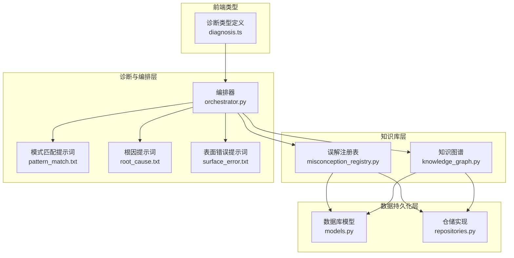
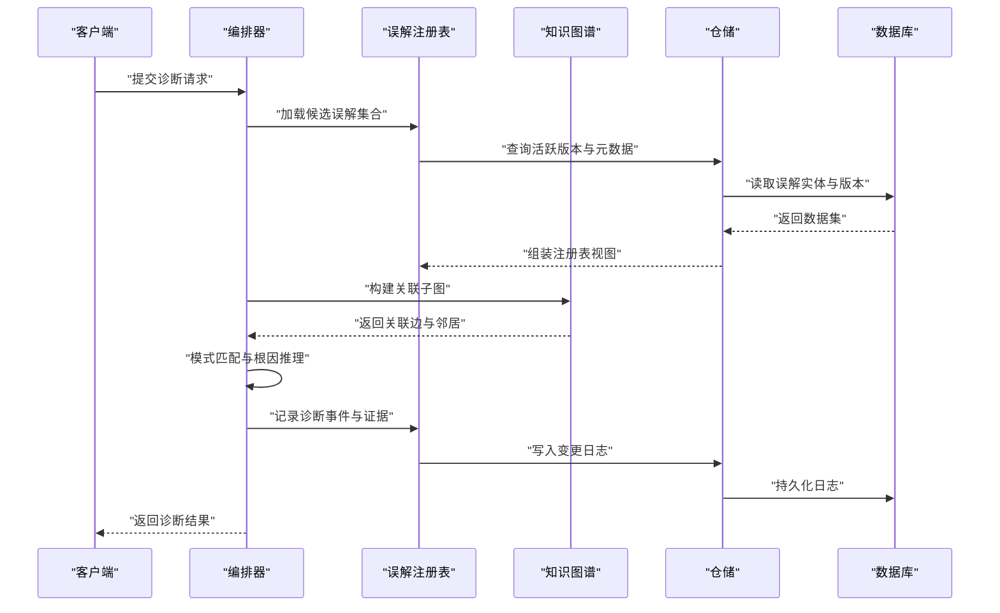
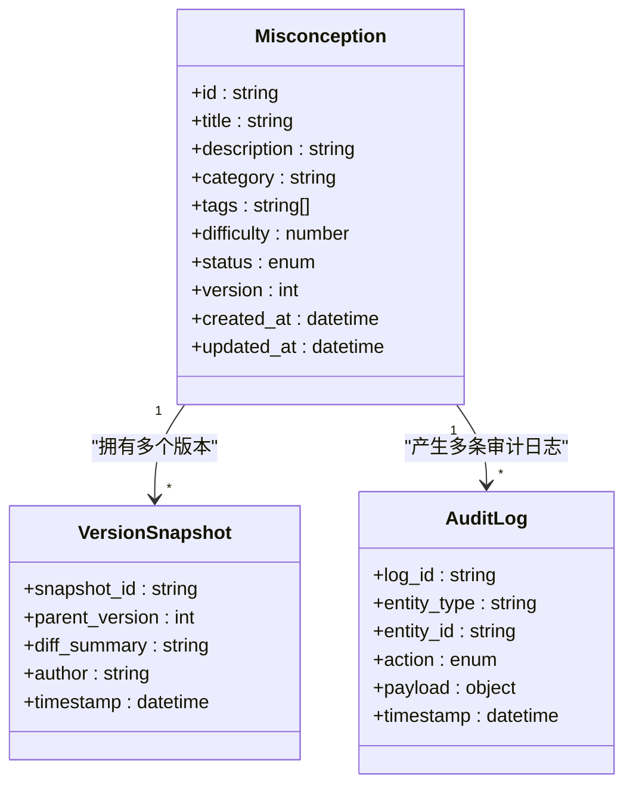
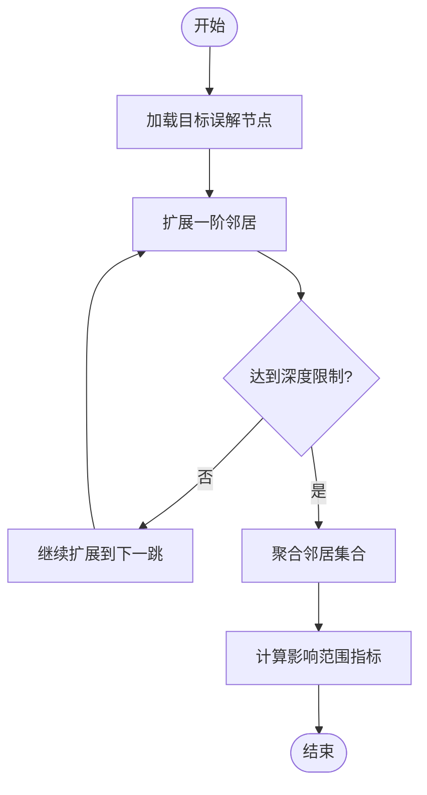
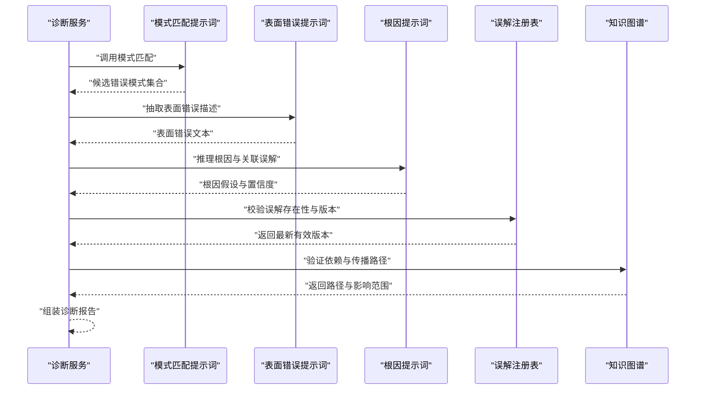
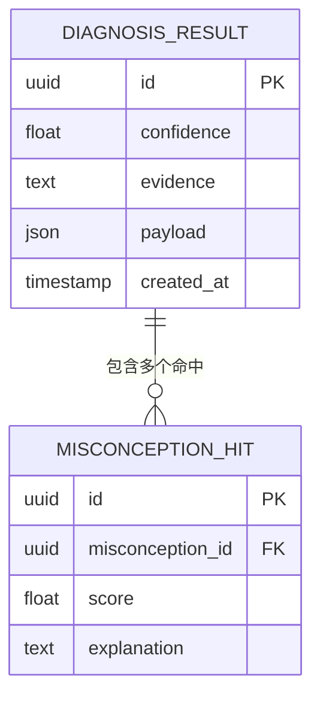
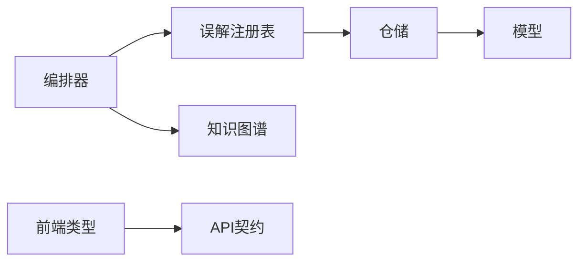

# 误解概念管理

<cite>
**本文引用的文件**   
- [misconception_registry.py](file://src/loopse/kb/misconception_registry.py)
- [models.py](file://src/loopse/db/models.py)
- [repositories.py](file://src/loopse/db/repositories.py)
- [knowledge_graph.py](file://src/loopse/kb/knowledge_graph.py)
- [diagnosis_agent.py](file://tests/unit/test_diagnosis_agent.py)
- [test_misconception_registry.py](file://tests/unit/test_misconception_registry.py)
- [pattern_match.txt](file://config/prompts/diagnosis/pattern_match.txt)
- [root_cause.txt](file://config/prompts/diagnosis/root_cause.txt)
- [surface_error.txt](file://config/prompts/diagnosis/surface_error.txt)
- [orchestrator.py](file://src/loopse/agent/orchestrator.py)
- [diagnosis.py](file://frontend/src/types/diagnosis.ts)
- [api_schema.yaml](file://config/api_schema.yaml)
</cite>

## 目录
1. [简介](#简介)
2. [项目结构](#项目结构)
3. [核心组件](#核心组件)
4. [架构总览](#架构总览)
5. [详细组件分析](#详细组件分析)
6. [依赖关系分析](#依赖关系分析)
7. [性能考虑](#性能考虑)
8. [故障排查指南](#故障排查指南)
9. [结论](#结论)
10. [附录](#附录)

## 简介
本技术文档围绕“误解概念管理系统”展开，聚焦以下目标：
- 认知偏差分类体系与误解概念的建模、层次结构设计
- 误解注册表的CRUD操作、版本控制与变更追踪机制
- 误解检测算法、错误模式识别与诊断规则引擎
- 误解关联分析、传播路径追踪与影响范围评估
- 误解库的导入导出、批量编辑与审核工作流
- 扩展新的误解类别与自定义检测规则的方法
- 与其他学习分析模块的集成方式

## 项目结构
误解概念管理相关代码主要分布在知识库层（KB）、数据库模型与仓库层、诊断提示词配置以及前端类型定义中。整体组织遵循分层架构：
- 知识库层：负责误解注册表、知识图谱与文本处理
- 数据持久化层：负责模型定义与仓储访问
- 诊断与编排层：负责错误模式匹配、根因分析与流程编排
- 前端类型：定义诊断结果的数据契约

图表来源
- [misconception_registry.py](file://src/loopse/kb/misconception_registry.py)
- [knowledge_graph.py](file://src/loopse/kb/knowledge_graph.py)
- [models.py](file://src/loopse/db/models.py)
- [repositories.py](file://src/loopse/db/repositories.py)
- [orchestrator.py](file://src/loopse/agent/orchestrator.py)
- [pattern_match.txt](file://config/prompts/diagnosis/pattern_match.txt)
- [root_cause.txt](file://config/prompts/diagnosis/root_cause.txt)
- [surface_error.txt](file://config/prompts/diagnosis/surface_error.txt)
- [diagnosis.ts](file://frontend/src/types/diagnosis.ts)

章节来源
- [misconception_registry.py](file://src/loopse/kb/misconception_registry.py)
- [models.py](file://src/loopse/db/models.py)
- [repositories.py](file://src/loopse/db/repositories.py)
- [knowledge_graph.py](file://src/loopse/kb/knowledge_graph.py)
- [orchestrator.py](file://src/loopse/agent/orchestrator.py)
- [pattern_match.txt](file://config/prompts/diagnosis/pattern_match.txt)
- [root_cause.txt](file://config/prompts/diagnosis/root_cause.txt)
- [surface_error.txt](file://config/prompts/diagnosis/surface_error.txt)
- [diagnosis.ts](file://frontend/src/types/diagnosis.ts)

## 核心组件
- 误解注册表：提供误解实体的增删改查、版本管理与变更日志记录，支持按分类、标签、难度等维度检索与过滤。
- 数据库模型与仓储：定义误解实体及其关联关系的持久化结构，封装事务性写入与并发安全策略。
- 知识图谱：承载误解节点与知识点、能力维度、错误模式的关联边，用于关联分析与传播路径推断。
- 诊断编排器：组合模式匹配、表面错误抽取与根因推理，驱动误解检测与解释生成。
- 诊断提示词：以模板形式定义错误模式识别、表面错误描述与根因分析的提示词，便于规则迭代与A/B测试。
- 前端类型：约束诊断结果的结构，确保前后端契约一致。

章节来源
- [misconception_registry.py](file://src/loopse/kb/misconception_registry.py)
- [models.py](file://src/loopse/db/models.py)
- [repositories.py](file://src/loopse/db/repositories.py)
- [knowledge_graph.py](file://src/loopse/kb/knowledge_graph.py)
- [orchestrator.py](file://src/loopse/agent/orchestrator.py)
- [pattern_match.txt](file://config/prompts/diagnosis/pattern_match.txt)
- [root_cause.txt](file://config/prompts/diagnosis/root_cause.txt)
- [surface_error.txt](file://config/prompts/diagnosis/surface_error.txt)
- [diagnosis.ts](file://frontend/src/types/diagnosis.ts)

## 架构总览
误解概念管理系统的端到端流程如下：
- 输入：学生作答或交互轨迹片段
- 预处理：文本切分与特征提取
- 模式匹配：基于提示词的错误模式识别
- 根因分析：结合知识图谱进行因果链推断
- 输出：结构化诊断结果（包含误解命中、置信度、证据与修复建议）

图表来源
- [orchestrator.py](file://src/loopse/agent/orchestrator.py)
- [misconception_registry.py](file://src/loopse/kb/misconception_registry.py)
- [knowledge_graph.py](file://src/loopse/kb/knowledge_graph.py)
- [repositories.py](file://src/loopse/db/repositories.py)
- [models.py](file://src/loopse/db/models.py)

## 详细组件分析

### 误解注册表（CRUD、版本控制与变更追踪）
- 职责
  - 维护误解实体的生命周期：创建、更新、删除、查询
  - 版本控制：每次变更生成新版本，保留历史快照
  - 变更追踪：记录操作者、时间戳、变更摘要与审计信息
  - 检索与过滤：按分类、标签、难度、状态等条件筛选
- 关键设计
  - 不可变版本：新版本仅追加，不覆盖旧版本，保证可追溯
  - 软删除：通过状态字段标记删除，避免破坏关联
  - 索引优化：对高频查询字段建立索引，提升检索性能
- 典型接口
  - 创建误解：校验必填字段、生成唯一标识、初始化版本
  - 更新误解：增量合并变更、生成新版本、记录审计日志
  - 删除误解：标记为已删除、冻结后续引用
  - 查询误解：支持分页、排序、聚合统计
  - 版本对比：计算差异、展示变更摘要
- 复杂度与性能
  - 写放大：版本化导致写入量增加，需配合压缩与归档策略
  - 读放大：频繁版本切换可能引发多次读取，建议缓存热点版本
  - 一致性：采用事务保证版本与日志原子性

图表来源
- [misconception_registry.py](file://src/loopse/kb/misconception_registry.py)
- [models.py](file://src/loopse/db/models.py)
- [repositories.py](file://src/loopse/db/repositories.py)

章节来源
- [misconception_registry.py](file://src/loopse/kb/misconception_registry.py)
- [models.py](file://src/loopse/db/models.py)
- [repositories.py](file://src/loopse/db/repositories.py)
- [test_misconception_registry.py](file://tests/unit/test_misconception_registry.py)

### 知识图谱与关联分析
- 职责
  - 存储误解节点与知识点、能力维度、错误模式的关联边
  - 提供子图查询、邻居遍历与路径发现
  - 支撑传播路径追踪与影响范围评估
- 关键设计
  - 节点类型：误解、知识点、能力、错误模式
  - 边类型：依赖、前置、同义、反例、衍生
  - 权重与方向：表示强依赖、弱关联与因果方向
- 典型查询
  - 给定误解，获取直接依赖与间接依赖集合
  - 计算某误解的影响半径（k跳邻居）
  - 识别关键枢纽节点（高介数中心性）

图表来源
- [knowledge_graph.py](file://src/loopse/kb/knowledge_graph.py)

章节来源
- [knowledge_graph.py](file://src/loopse/kb/knowledge_graph.py)

### 诊断规则引擎与错误模式识别
- 职责
  - 将学生作答片段映射到错误模式
  - 抽取表面错误描述并定位可能的根因
  - 结合误解注册表与知识图谱生成诊断报告
- 关键设计
  - 提示词模板：模式匹配、表面错误、根因分析三类提示词
  - 规则编排：顺序执行模式匹配→表面错误→根因推理
  - 证据链：保留触发规则的证据片段与置信度
- 典型流程
  - 输入：原始作答、上下文会话、知识点标签
  - 处理：正则/语义匹配、LLM辅助抽取、图谱验证
  - 输出：命中误解列表、置信度、证据与修复建议

图表来源
- [orchestrator.py](file://src/loopse/agent/orchestrator.py)
- [pattern_match.txt](file://config/prompts/diagnosis/pattern_match.txt)
- [surface_error.txt](file://config/prompts/diagnosis/surface_error.txt)
- [root_cause.txt](file://config/prompts/diagnosis/root_cause.txt)
- [misconception_registry.py](file://src/loopse/kb/misconception_registry.py)
- [knowledge_graph.py](file://src/loopse/kb/knowledge_graph.py)

章节来源
- [orchestrator.py](file://src/loopse/agent/orchestrator.py)
- [pattern_match.txt](file://config/prompts/diagnosis/pattern_match.txt)
- [surface_error.txt](file://config/prompts/diagnosis/surface_error.txt)
- [root_cause.txt](file://config/prompts/diagnosis/root_cause.txt)
- [test_diagnosis_agent.py](file://tests/unit/test_diagnosis_agent.py)

### 前端诊断类型与API契约
- 职责
  - 定义诊断结果的数据结构，包括误解ID、置信度、证据、修复建议等
  - 与后端API契约保持一致，确保序列化/反序列化正确
- 关键设计
  - 强类型约束：使用TypeScript类型定义，减少运行时错误
  - 可扩展字段：预留扩展点以便新增诊断维度
- 典型用法
  - 渲染诊断面板：根据置信度阈值显示不同颜色与图标
  - 导出诊断报告：序列化为JSON供离线分析

图表来源
- [diagnosis.ts](file://frontend/src/types/diagnosis.ts)
- [api_schema.yaml](file://config/api_schema.yaml)

章节来源
- [diagnosis.ts](file://frontend/src/types/diagnosis.ts)
- [api_schema.yaml](file://config/api_schema.yaml)

## 依赖关系分析
- 组件耦合
  - 编排器依赖误解注册表与知识图谱，形成松耦合的诊断流水线
  - 注册表依赖仓储与模型，屏蔽底层存储细节
  - 前端类型依赖API契约，确保前后端一致性
- 外部依赖
  - 数据库：用于持久化误解实体、版本快照与审计日志
  - LLM：用于模式匹配与根因推理的增强能力（可选）
- 潜在循环依赖
  - 当前分层清晰，未发现直接循环依赖；需注意在扩展时保持单向依赖

图表来源
- [orchestrator.py](file://src/loopse/agent/orchestrator.py)
- [misconception_registry.py](file://src/loopse/kb/misconception_registry.py)
- [knowledge_graph.py](file://src/loopse/kb/knowledge_graph.py)
- [repositories.py](file://src/loopse/db/repositories.py)
- [models.py](file://src/loopse/db/models.py)
- [diagnosis.ts](file://frontend/src/types/diagnosis.ts)
- [api_schema.yaml](file://config/api_schema.yaml)

章节来源
- [orchestrator.py](file://src/loopse/agent/orchestrator.py)
- [misconception_registry.py](file://src/loopse/kb/misconception_registry.py)
- [knowledge_graph.py](file://src/loopse/kb/knowledge_graph.py)
- [repositories.py](file://src/loopse/db/repositories.py)
- [models.py](file://src/loopse/db/models.py)
- [diagnosis.ts](file://frontend/src/types/diagnosis.ts)
- [api_schema.yaml](file://config/api_schema.yaml)

## 性能考虑
- 版本化写入优化
  - 批量合并小变更，降低写放大
  - 定期归档旧版本，减少热数据体积
- 检索加速
  - 对常用过滤字段建立复合索引
  - 引入缓存层（如Redis）缓存热点误解与子图
- 诊断流水线并行化
  - 模式匹配与表面错误抽取可并行执行
  - 根因推理串行化以保证因果一致性
- 资源监控
  - 监控数据库慢查询与锁等待
  - 跟踪LLM调用延迟与失败率

[本节为通用指导，无需特定文件来源]

## 故障排查指南
- 常见问题
  - 版本不一致：检查最新版本是否被误删或状态异常
  - 审计日志缺失：确认仓储事务是否成功提交
  - 诊断结果不稳定：检查提示词模板与LLM响应格式
- 调试步骤
  - 启用详细日志：记录模式匹配触发与置信度
  - 回放诊断事件：基于证据片段复现问题
  - 对比版本差异：定位变更引入的问题
- 恢复策略
  - 回滚到稳定版本：利用版本快照快速恢复
  - 清理脏数据：基于审计日志重建一致性

章节来源
- [test_misconception_registry.py](file://tests/unit/test_misconception_registry.py)
- [test_diagnosis_agent.py](file://tests/unit/test_diagnosis_agent.py)

## 结论
误解概念管理系统通过清晰的层次结构与模块化设计，实现了误解实体的全生命周期管理、严格的版本控制与变更追踪、高效的诊断流水线与关联分析。借助提示词驱动的规则引擎与知识图谱，系统能够准确识别错误模式、定位根因并评估影响范围。未来可在扩展新类别、自定义检测规则以及与学习分析模块集成方面持续演进。

[本节为总结性内容，无需特定文件来源]

## 附录
- 扩展新误解类别
  - 在注册表中新增类别枚举与默认标签
  - 更新知识图谱节点类型与边定义
  - 调整提示词模板以适配新模式
- 自定义检测规则
  - 在编排器中插入新的规则阶段
  - 编写单元测试验证规则准确性
  - 通过A/B测试评估效果
- 与其他学习分析模块集成
  - 对齐API契约与数据类型
  - 共享知识图谱与误解注册表
  - 统一认证与权限控制

[本节为概念性内容，无需特定文件来源]