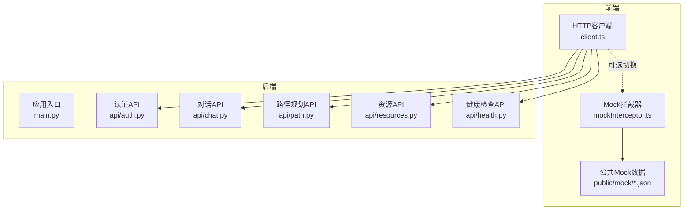
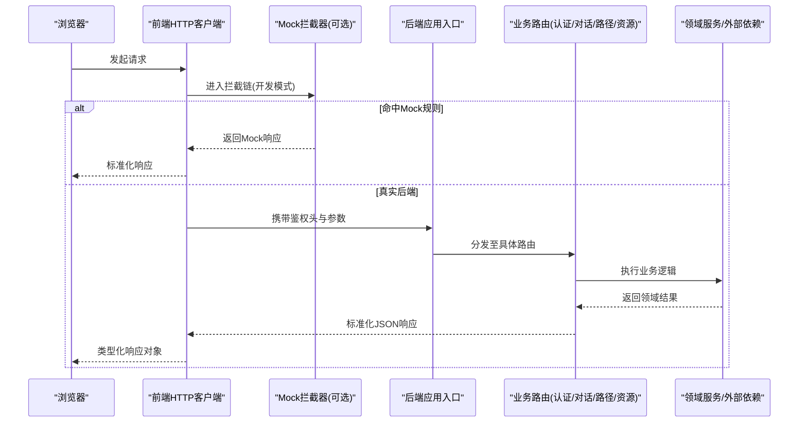
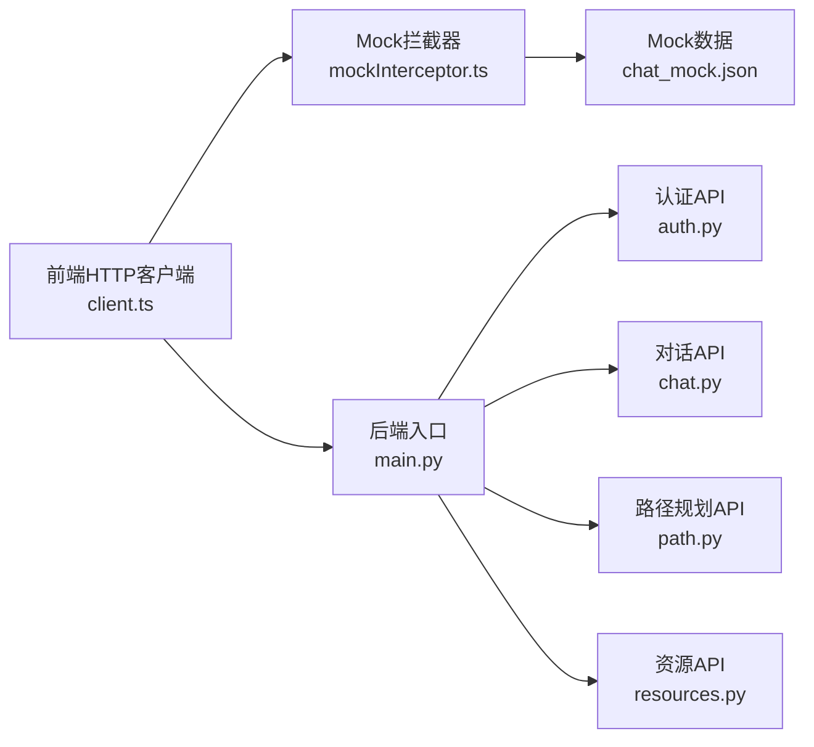

# API设计与规范

<cite>
**本文引用的文件**   
- [config/api_schema.yaml](file://config/api_schema.yaml)
- [src/loopse/main.py](file://src/loopse/main.py)
- [src/loopse/api/auth.py](file://src/loopse/api/auth.py)
- [src/loopse/api/chat.py](file://src/loopse/api/chat.py)
- [src/loopse/api/path.py](file://src/loopse/api/path.py)
- [src/loopse/api/resources.py](file://src/loopse/api/resources.py)
- [src/loopse/api/health.py](file://src/loopse/api/health.py)
- [frontend/src/api/client.ts](file://frontend/src/api/client.ts)
- [frontend/src/api/mockInterceptor.ts](file://frontend/src/api/mockInterceptor.ts)
- [frontend/public/mock/chat_mock.json](file://frontend/public/mock/chat_mock.json)
</cite>

## 目录
1. [简介](#简介)
2. [项目结构](#项目结构)
3. [核心组件](#核心组件)
4. [架构总览](#架构总览)
5. [详细组件分析](#详细组件分析)
6. [依赖分析](#依赖分析)
7. [性能考虑](#性能考虑)
8. [故障排查指南](#故障排查指南)
9. [结论](#结论)
10. [附录](#附录)

## 简介
本文件面向前后端开发与测试团队，系统化定义Socrates-Cube项目的RESTful API设计原则、URL命名与HTTP状态码约定、请求响应格式、数据验证与错误处理标准、API版本管理与向后兼容策略、废弃接口迁移方案，以及OpenAPI/Swagger文档生成、接口测试规范与性能基准要求。同时覆盖前后端接口契约管理、Mock数据生成与自动化测试集成实践，确保跨团队协作一致性与可演进性。

## 项目结构
后端采用模块化路由组织方式，按业务域拆分API模块；前端通过统一HTTP客户端封装请求、拦截器与Mock能力，配合公共Mock数据实现前后端并行开发。

图表来源
- [src/loopse/main.py](file://src/loopse/main.py)
- [src/loopse/api/auth.py](file://src/loopse/api/auth.py)
- [src/loopse/api/chat.py](file://src/loopse/api/chat.py)
- [src/loopse/api/path.py](file://src/loopse/api/path.py)
- [src/loopse/api/resources.py](file://src/loopse/api/resources.py)
- [src/loopse/api/health.py](file://src/loopse/api/health.py)
- [frontend/src/api/client.ts](file://frontend/src/api/client.ts)
- [frontend/src/api/mockInterceptor.ts](file://frontend/src/api/mockInterceptor.ts)
- [frontend/public/mock/chat_mock.json](file://frontend/public/mock/chat_mock.json)

章节来源
- [src/loopse/main.py](file://src/loopse/main.py)
- [frontend/src/api/client.ts](file://frontend/src/api/client.ts)
- [frontend/src/api/mockInterceptor.ts](file://frontend/src/api/mockInterceptor.ts)
- [frontend/public/mock/chat_mock.json](file://frontend/public/mock/chat_mock.json)

## 核心组件
- 统一HTTP客户端：负责基础URL、超时、重试、鉴权头注入、全局错误解析与类型化响应包装。
- Mock拦截器：在开发环境拦截特定请求并返回本地Mock数据，支持开关与条件匹配。
- 后端路由聚合：应用入口集中注册各业务域路由，便于统一中间件、日志、限流与监控接入。
- 健康检查：提供轻量存活探针，用于编排与健康探测。
- 契约文件：集中描述API契约（字段、约束、示例），驱动前后端代码与文档生成。

章节来源
- [frontend/src/api/client.ts](file://frontend/src/api/client.ts)
- [frontend/src/api/mockInterceptor.ts](file://frontend/src/api/mockInterceptor.ts)
- [src/loopse/main.py](file://src/loopse/main.py)
- [src/loopse/api/health.py](file://src/loopse/api/health.py)
- [config/api_schema.yaml](file://config/api_schema.yaml)

## 架构总览
下图展示从浏览器到后端API的端到端调用流程，包括鉴权、业务路由与响应标准化。

图表来源
- [frontend/src/api/client.ts](file://frontend/src/api/client.ts)
- [frontend/src/api/mockInterceptor.ts](file://frontend/src/api/mockInterceptor.ts)
- [src/loopse/main.py](file://src/loopse/main.py)
- [src/loopse/api/auth.py](file://src/loopse/api/auth.py)
- [src/loopse/api/chat.py](file://src/loopse/api/chat.py)
- [src/loopse/api/path.py](file://src/loopse/api/path.py)
- [src/loopse/api/resources.py](file://src/loopse/api/resources.py)

## 详细组件分析

### RESTful API设计原则与URL命名规范
- 资源导向：使用名词复数表示集合，单数表示实例，避免动词出现在路径中。
- 层级清晰：通过路径层级表达资源关系，如 /api/v1/users/{id}/path-plans。
- 查询参数：过滤、排序、分页等使用查询参数，保持路径简洁。
- 幂等与安全：GET/PUT/DELETE语义遵循HTTP方法约定，POST用于创建或不可幂等操作。
- 版本前缀：所有公开API以 /api/vN 为前缀，便于平滑演进。
- 小写与连字符：路径使用小写字母与连字符，避免歧义。

章节来源
- [src/loopse/api/auth.py](file://src/loopse/api/auth.py)
- [src/loopse/api/chat.py](file://src/loopse/api/chat.py)
- [src/loopse/api/path.py](file://src/loopse/api/path.py)
- [src/loopse/api/resources.py](file://src/loopse/api/resources.py)

### HTTP状态码使用约定
- 2xx成功：
  - 200 OK：常规成功
  - 201 Created：资源创建成功
  - 204 No Content：删除成功且无响应体
- 4xx客户端错误：
  - 400 Bad Request：参数校验失败或请求体不合法
  - 401 Unauthorized：未认证或令牌无效
  - 403 Forbidden：已认证但权限不足
  - 404 Not Found：资源不存在
  - 409 Conflict：资源冲突（如重复创建）
  - 422 Unprocessable Entity：语义正确但无法处理的请求（常用于复杂校验）
- 5xx服务端错误：
  - 500 Internal Server Error：未知异常
  - 503 Service Unavailable：服务不可用（依赖降级或维护）

章节来源
- [src/loopse/api/health.py](file://src/loopse/api/health.py)

### 请求与响应格式
- 内容协商：默认使用 application/json；上传/下载场景使用相应MIME类型。
- 统一响应包：包含状态码、消息、数据体与追踪ID，便于前端统一处理。
- 分页结构：包含总数、页码、每页大小与数据列表。
- 时间与时区：统一使用ISO 8601字符串，时区为UTC。
- 空值策略：明确null与缺失字段的含义，避免歧义。

章节来源
- [config/api_schema.yaml](file://config/api_schema.yaml)

### 数据验证规则
- 必填与类型：对关键字段进行非空与类型校验。
- 范围与长度：数值范围、字符串长度、枚举值白名单。
- 格式校验：邮箱、手机号、URL、日期时间等格式。
- 业务校验：唯一性、关联存在性、权限与配额限制。
- 校验错误：返回结构化错误信息，包含字段级提示与定位。

章节来源
- [config/api_schema.yaml](file://config/api_schema.yaml)

### 错误处理标准
- 错误体结构：统一包含错误码、消息、详情与请求标识。
- 错误码分层：系统级、业务级、第三方依赖级分类。
- 日志与追踪：每个请求分配追踪ID，关键错误记录上下文。
- 安全脱敏：禁止在错误响应中泄露敏感信息。

章节来源
- [src/loopse/api/auth.py](file://src/loopse/api/auth.py)
- [src/loopse/api/chat.py](file://src/loopse/api/chat.py)

### API版本管理策略与向后兼容
- 版本前缀：/api/v1、/api/v2 等，随变更升级主版本。
- 兼容性承诺：
  - 新增字段与可选参数：向后兼容
  - 删除字段或强制新参数：需提升主版本并提供过渡期
- 弃用通知：通过响应头与文档标注弃用，保留至少两个大版本周期。
- 灰度发布：结合特性开关与A/B流量逐步迁移。

章节来源
- [src/loopse/main.py](file://src/loopse/main.py)

### 废弃接口迁移方案
- 迁移清单：列出受影响接口、替代方案与时间表。
- 双写与回滚：关键路径支持双写，保障回滚能力。
- 客户端适配：提供SDK与迁移脚本，降低对接成本。
- 监控告警：对旧接口访问进行统计与告警，推动下线。

章节来源
- [src/loopse/main.py](file://src/loopse/main.py)

### OpenAPI/Swagger文档生成
- 契约优先：以 schema 文件作为单一事实来源，驱动后端模型与前端类型生成。
- 自动文档：基于契约生成OpenAPI/Swagger页面，供在线调试与消费。
- 一致性校验：CI中执行契约与实现一致性检查，防止漂移。

章节来源
- [config/api_schema.yaml](file://config/api_schema.yaml)

### 接口测试规范
- 单元与集成：针对路由层与领域层分别编写用例，覆盖正常与异常分支。
- 契约测试：基于schema断言响应结构与字段约束。
- 端到端：关键用户旅程进行E2E冒烟测试。
- 稳定性：引入随机种子与固定时钟，保证可重复性。

章节来源
- [tests/unit/test_challenger_agent.py](file://tests/unit/test_challenger_agent.py)
- [tests/unit/test_llm_client.py](file://tests/unit/test_llm_client.py)
- [tests/unit/test_orchestrator_integration.py](file://tests/unit/test_orchestrator_integration.py)

### 性能基准要求
- 目标指标：P95/P99延迟、吞吐、错误率、资源利用率。
- 压测场景：典型读写比例、热点资源、并发峰值。
- 基线对比：每次变更与基线对比，超阈告警。
- 观测性：链路追踪、指标采集与慢查询分析。

[本节为通用指导，无需源码引用]

### 前后端接口契约管理
- 单一契约源：以YAML/JSON Schema为中心，前后端共享。
- 代码生成：后端模型、前端类型与请求函数由契约自动生成。
- 变更评审：契约变更需经双方评审与回归验证。

章节来源
- [config/api_schema.yaml](file://config/api_schema.yaml)

### Mock数据生成与使用
- 静态Mock：基于JSON样例快速构造响应，适合稳定接口。
- 动态Mock：根据入参生成差异化响应，模拟边界与异常。
- 开关控制：通过环境变量或配置项启用/禁用Mock。
- 一致性：Mock数据与契约保持一致，定期同步更新。

章节来源
- [frontend/src/api/mockInterceptor.ts](file://frontend/src/api/mockInterceptor.ts)
- [frontend/public/mock/chat_mock.json](file://frontend/public/mock/chat_mock.json)

### 自动化测试集成
- CI流水线：构建、单元测试、契约测试、接口测试、性能基准串联。
- 报告与归档：生成测试报告与覆盖率，持久化产物。
- 质量门禁：关键指标不达标阻断合并。

章节来源
- [tests/unit/test_diagnosis_agent.py](file://tests/unit/test_diagnosis_agent.py)
- [tests/unit/test_resource_generator.py](file://tests/unit/test_resource_generator.py)

## 依赖分析
前后端通过HTTP协议解耦，前端HTTP客户端与Mock拦截器构成灵活调用链；后端路由聚合将业务域解耦，便于独立演进与测试。

图表来源
- [frontend/src/api/client.ts](file://frontend/src/api/client.ts)
- [frontend/src/api/mockInterceptor.ts](file://frontend/src/api/mockInterceptor.ts)
- [frontend/public/mock/chat_mock.json](file://frontend/public/mock/chat_mock.json)
- [src/loopse/main.py](file://src/loopse/main.py)
- [src/loopse/api/auth.py](file://src/loopse/api/auth.py)
- [src/loopse/api/chat.py](file://src/loopse/api/chat.py)
- [src/loopse/api/path.py](file://src/loopse/api/path.py)
- [src/loopse/api/resources.py](file://src/loopse/api/resources.py)

章节来源
- [frontend/src/api/client.ts](file://frontend/src/api/client.ts)
- [src/loopse/main.py](file://src/loopse/main.py)

## 性能考虑
- 连接复用与超时：合理设置连接池、读写超时与重试退避。
- 缓存策略：对读多写少接口实施多级缓存，注意失效与一致性。
- 异步与流式：长耗时任务采用异步或SSE/WebSocket推送。
- 资源瘦身：压缩响应体、按需加载与懒初始化。
- 容量规划：依据压测结果设定扩容阈值与弹性策略。

[本节为通用指导，无需源码引用]

## 故障排查指南
- 快速定位：利用请求追踪ID关联日志与链路。
- 常见错误：
  - 401/403：检查鉴权头、令牌有效期与权限范围。
  - 400/422：核对请求体结构与字段约束。
  - 404：确认资源ID与路径拼写。
  - 5xx：查看服务端错误日志与依赖健康状态。
- 健康检查：通过健康端点判断服务可用性。
- 降级与熔断：依赖不可用时快速失败与兜底策略。

章节来源
- [src/loopse/api/health.py](file://src/loopse/api/health.py)
- [src/loopse/api/auth.py](file://src/loopse/api/auth.py)

## 结论
通过统一的RESTful设计原则、严格的HTTP语义与状态码约定、标准化的请求响应与错误处理、完善的版本管理与迁移策略，以及契约驱动与自动化测试闭环，Socrates-Cube实现了高内聚、低耦合、可演进的API体系。建议持续完善OpenAPI文档、强化性能基线与可观测性，推动前后端高效协作与高质量交付。

## 附录

### 常用API端点参考（示例）
- 认证
  - POST /api/v1/auth/login
  - POST /api/v1/auth/logout
  - GET /api/v1/auth/me
- 对话
  - POST /api/v1/chats
  - GET /api/v1/chats/{id}
  - DELETE /api/v1/chats/{id}
- 路径规划
  - POST /api/v1/path-plans
  - GET /api/v1/path-plans/{id}
- 资源
  - GET /api/v1/resources
  - GET /api/v1/resources/{id}
- 健康检查
  - GET /api/v1/health

章节来源
- [src/loopse/api/auth.py](file://src/loopse/api/auth.py)
- [src/loopse/api/chat.py](file://src/loopse/api/chat.py)
- [src/loopse/api/path.py](file://src/loopse/api/path.py)
- [src/loopse/api/resources.py](file://src/loopse/api/resources.py)
- [src/loopse/api/health.py](file://src/loopse/api/health.py)