# 前后端分离架构

<cite>
**本文引用的文件**   
- [frontend/src/main.ts](file://frontend/src/main.ts)
- [frontend/src/router/index.ts](file://frontend/src/router/index.ts)
- [frontend/src/api/client.ts](file://frontend/src/api/client.ts)
- [frontend/src/api/auth.ts](file://frontend/src/api/auth.ts)
- [frontend/src/api/mockInterceptor.ts](file://frontend/src/api/mockInterceptor.ts)
- [frontend/src/stores/authStore.ts](file://frontend/src/stores/authStore.ts)
- [frontend/src/composables/useSSE.ts](file://frontend/src/composables/useSSE.ts)
- [src/loopse/main.py](file://src/loopse/main.py)
- [src/loopse/api/auth.py](file://src/loopse/api/auth.py)
- [src/loopse/api/chat.py](file://src/loopse/api/chat.py)
- [src/loopse/db/connection.py](file://src/loopse/db/connection.py)
- [config/api_schema.yaml](file://config/api_schema.yaml)
</cite>

## 目录
1. [简介](#简介)
2. [项目结构](#项目结构)
3. [核心组件](#核心组件)
4. [架构总览](#架构总览)
5. [详细组件分析](#详细组件分析)
6. [依赖关系分析](#依赖关系分析)
7. [性能考量](#性能考量)
8. [故障排查指南](#故障排查指南)
9. [结论](#结论)
10. [附录](#附录)

## 简介
本仓库采用前后端分离架构：前端基于 Vue3 + Vite，后端基于 FastAPI。前端通过统一的 HTTP 客户端与后端 API 交互，支持 Mock 拦截、SSE 实时流式响应；后端按领域划分 API 路由，提供认证鉴权、数据校验与数据库访问能力。文档聚焦于前后端交互模式、API 网关设计（由 Nginx 或部署层承担）、数据传输格式、前端路由与状态管理、组件通信机制、后端分层与中间件、跨域配置、认证授权、错误处理策略以及协作规范与接口契约管理。

## 项目结构
- 前端（frontend）
  - src/api：HTTP 客户端封装与各业务 API 模块
  - src/router：Vue Router 路由定义与守卫
  - src/stores：Pinia 状态管理（用户、会话、路径等）
  - src/composables：组合式函数（如 SSE 订阅）
  - src/views：页面级视图
  - src/components：可复用 UI 组件
- 后端（src/loopse）
  - main.py：应用启动、全局中间件与挂载
  - api/*：按领域划分的 API 路由
  - db/*：数据库连接与模型
  - core/*：LLM 客户端、Mock 提供者、信任机制
- 配置（config）
  - api_schema.yaml：API 契约定义（OpenAPI/Swagger 风格）

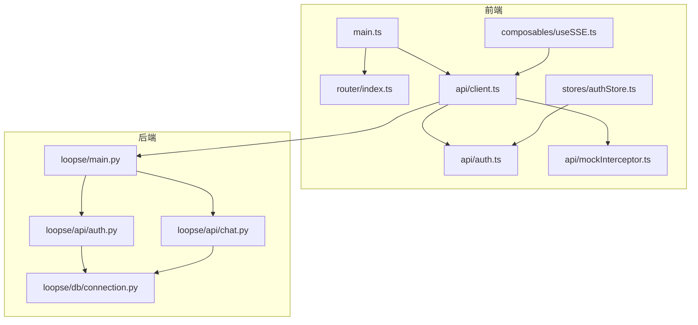

**图表来源** 
- [frontend/src/main.ts](file://frontend/src/main.ts)
- [frontend/src/router/index.ts](file://frontend/src/router/index.ts)
- [frontend/src/api/client.ts](file://frontend/src/api/client.ts)
- [frontend/src/api/auth.ts](file://frontend/src/api/auth.ts)
- [frontend/src/api/mockInterceptor.ts](file://frontend/src/api/mockInterceptor.ts)
- [frontend/src/stores/authStore.ts](file://frontend/src/stores/authStore.ts)
- [frontend/src/composables/useSSE.ts](file://frontend/src/composables/useSSE.ts)
- [src/loopse/main.py](file://src/loopse/main.py)
- [src/loopse/api/auth.py](file://src/loopse/api/auth.py)
- [src/loopse/api/chat.py](file://src/loopse/api/chat.py)
- [src/loopse/db/connection.py](file://src/loopse/db/connection.py)

**章节来源**
- [frontend/src/main.ts](file://frontend/src/main.ts)
- [frontend/src/router/index.ts](file://frontend/src/router/index.ts)
- [frontend/src/api/client.ts](file://frontend/src/api/client.ts)
- [frontend/src/api/auth.ts](file://frontend/src/api/auth.ts)
- [frontend/src/api/mockInterceptor.ts](file://frontend/src/api/mockInterceptor.ts)
- [frontend/src/stores/authStore.ts](file://frontend/src/stores/authStore.ts)
- [frontend/src/composables/useSSE.ts](file://frontend/src/composables/useSSE.ts)
- [src/loopse/main.py](file://src/loopse/main.py)
- [src/loopse/api/auth.py](file://src/loopse/api/auth.py)
- [src/loopse/api/chat.py](file://src/loopse/api/chat.py)
- [src/loopse/db/connection.py](file://src/loopse/db/connection.py)

## 核心组件
- 前端统一 HTTP 客户端
  - 职责：请求拦截、响应拦截、错误归一化、基础 URL 与超时配置、Mock 开关
  - 关键能力：自动附加认证头、统一错误码映射、重试与退避（可选）
- 认证与鉴权
  - 前端：登录态存储、Token 刷新、路由守卫
  - 后端：JWT 签发与验证、权限范围检查、敏感操作审计
- 实时通信
  - 前端：SSE 订阅与断线重连、消息分片解析
  - 后端：流式输出、事件类型分发
- 数据库连接
  - 连接池、事务边界、ORM/SQLAlchemy 集成、迁移脚本入口

**章节来源**
- [frontend/src/api/client.ts](file://frontend/src/api/client.ts)
- [frontend/src/api/auth.ts](file://frontend/src/api/auth.ts)
- [frontend/src/stores/authStore.ts](file://frontend/src/stores/authStore.ts)
- [frontend/src/composables/useSSE.ts](file://frontend/src/composables/useSSE.ts)
- [src/loopse/api/auth.py](file://src/loopse/api/auth.py)
- [src/loopse/api/chat.py](file://src/loopse/api/chat.py)
- [src/loopse/db/connection.py](file://src/loopse/db/connection.py)

## 架构总览
整体采用“浏览器 -> 反向代理/网关 -> FastAPI 服务”的三层结构。Nginx 或云网关负责静态资源缓存、HTTPS 终止、跨域策略与限流；FastAPI 作为业务 API 层，承载认证、领域路由与数据访问。

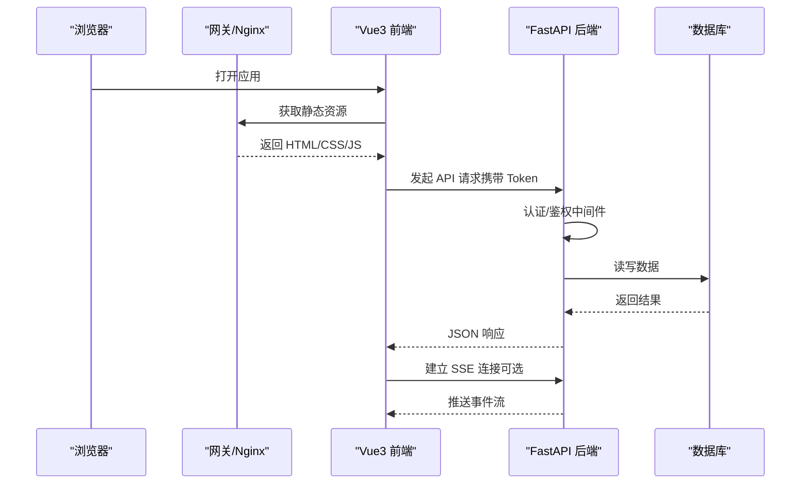

**图表来源**
- [frontend/src/main.ts](file://frontend/src/main.ts)
- [frontend/src/api/client.ts](file://frontend/src/api/client.ts)
- [src/loopse/main.py](file://src/loopse/main.py)
- [src/loopse/api/auth.py](file://src/loopse/api/auth.py)
- [src/loopse/db/connection.py](file://src/loopse/db/connection.py)

## 详细组件分析

### 前端路由架构
- 路由组织：按功能域划分视图，使用懒加载提升首屏性能
- 导航守卫：未登录跳转登录页、角色/权限控制、动态菜单生成
- 路由元信息：用于权限判断、面包屑、SEO 标题等

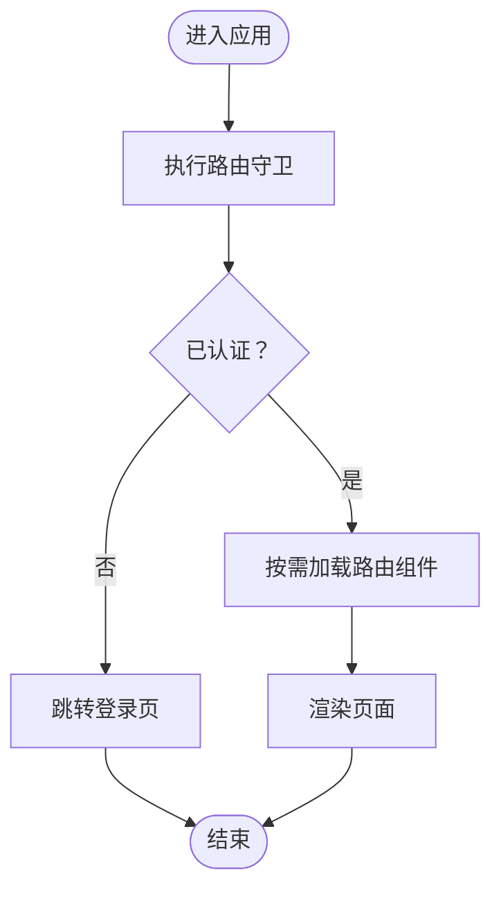

**图表来源**
- [frontend/src/router/index.ts](file://frontend/src/router/index.ts)

**章节来源**
- [frontend/src/router/index.ts](file://frontend/src/router/index.ts)

### 状态管理模式（Pinia）
- 用户与认证状态：登录态、用户信息、Token 生命周期
- 业务状态：聊天会话、学习路径、资源列表、模拟器参数等
- 持久化：将关键状态落盘，刷新后恢复体验

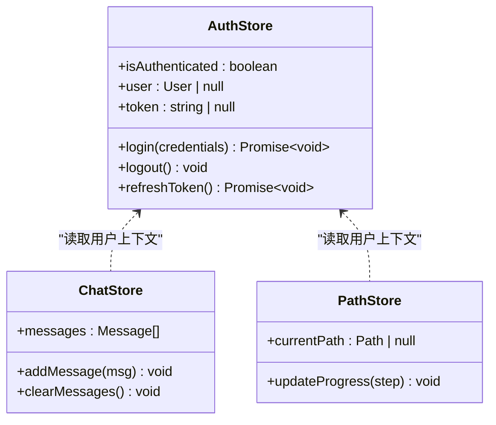

**图表来源**
- [frontend/src/stores/authStore.ts](file://frontend/src/stores/authStore.ts)

**章节来源**
- [frontend/src/stores/authStore.ts](file://frontend/src/stores/authStore.ts)

### 组件通信机制
- 父子通信：props 下发、events 上报
- 兄弟/跨层级：Pinia 共享状态、provide/inject 注入
- 异步数据：组合式函数封装 API 调用与错误处理

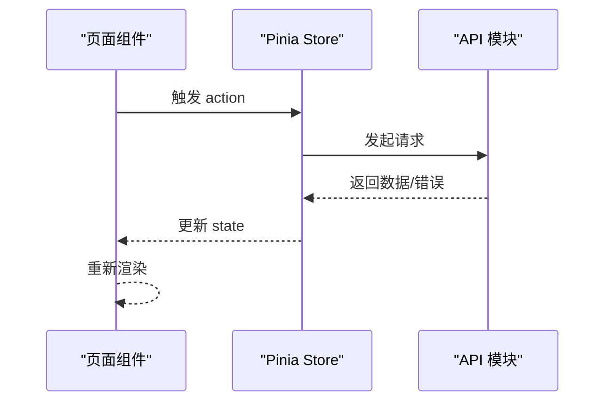

**图表来源**
- [frontend/src/api/client.ts](file://frontend/src/api/client.ts)
- [frontend/src/stores/authStore.ts](file://frontend/src/stores/authStore.ts)

**章节来源**
- [frontend/src/api/client.ts](file://frontend/src/api/client.ts)
- [frontend/src/stores/authStore.ts](file://frontend/src/stores/authStore.ts)

### 认证与授权流程
- 登录：前端提交凭据，后端校验并签发 JWT
- 鉴权：受保护接口需携带 Token，后端校验签名与有效期
- 刷新：Token 过期时自动刷新或引导重新登录

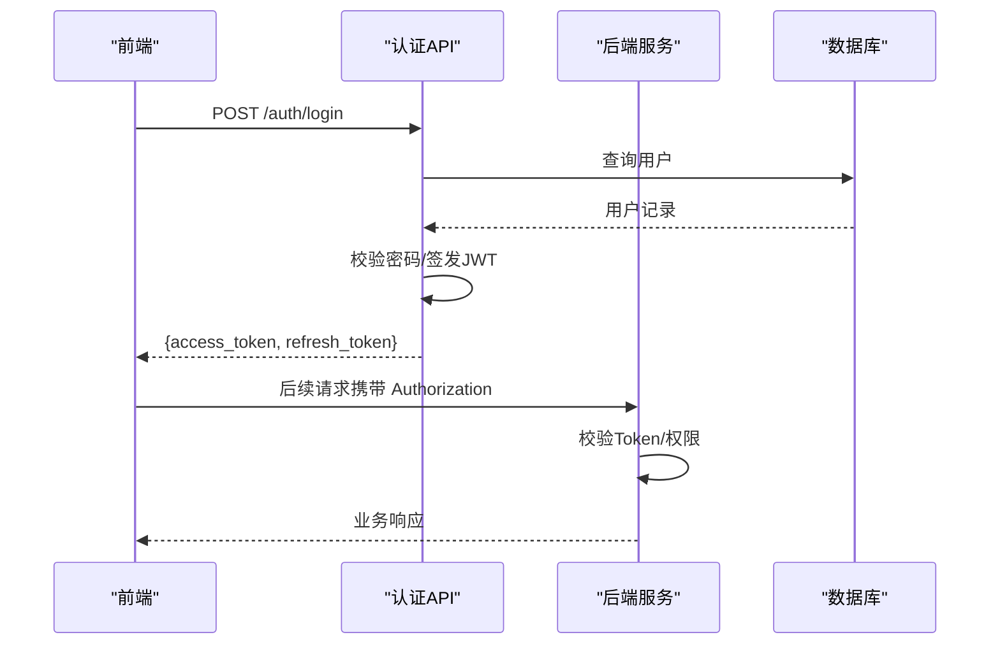

**图表来源**
- [frontend/src/api/auth.ts](file://frontend/src/api/auth.ts)
- [src/loopse/api/auth.py](file://src/loopse/api/auth.py)

**章节来源**
- [frontend/src/api/auth.ts](file://frontend/src/api/auth.ts)
- [src/loopse/api/auth.py](file://src/loopse/api/auth.py)

### 实时通信（SSE）
- 前端：建立 EventSource 连接，处理 open/message/error/close 事件，实现断线重连
- 后端：按事件类型推送增量内容，支持取消与心跳

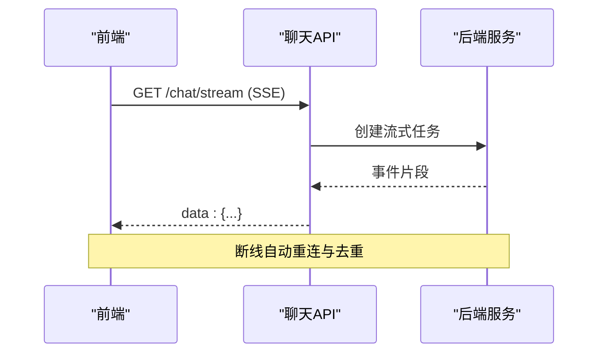

**图表来源**
- [frontend/src/composables/useSSE.ts](file://frontend/src/composables/useSSE.ts)
- [src/loopse/api/chat.py](file://src/loopse/api/chat.py)

**章节来源**
- [frontend/src/composables/useSSE.ts](file://frontend/src/composables/useSSE.ts)
- [src/loopse/api/chat.py](file://src/loopse/api/chat.py)

### 后端 API 分层设计与中间件
- 分层：路由层（api/*）-> 服务逻辑（agents/core）-> 数据访问（db/*）
- 中间件：全局异常捕获、CORS、请求日志、速率限制、认证鉴权
- 数据校验：Pydantic 模型校验入参，统一错误响应格式

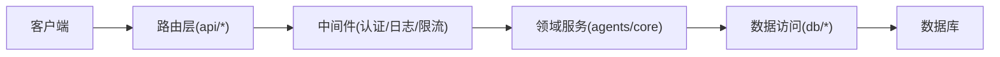

**图表来源**
- [src/loopse/main.py](file://src/loopse/main.py)
- [src/loopse/api/auth.py](file://src/loopse/api/auth.py)
- [src/loopse/api/chat.py](file://src/loopse/api/chat.py)
- [src/loopse/db/connection.py](file://src/loopse/db/connection.py)

**章节来源**
- [src/loopse/main.py](file://src/loopse/main.py)
- [src/loopse/api/auth.py](file://src/loopse/api/auth.py)
- [src/loopse/api/chat.py](file://src/loopse/api/chat.py)
- [src/loopse/db/connection.py](file://src/loopse/db/connection.py)

### 数据传输格式与 API 契约
- 传输格式：JSON 为主，SSE 事件为文本块
- 契约管理：使用 OpenAPI/Swagger 描述，配合 config/api_schema.yaml 进行版本化与变更评审
- 字段命名：前后端一致约定（snake_case 或 camelCase），并提供转换层

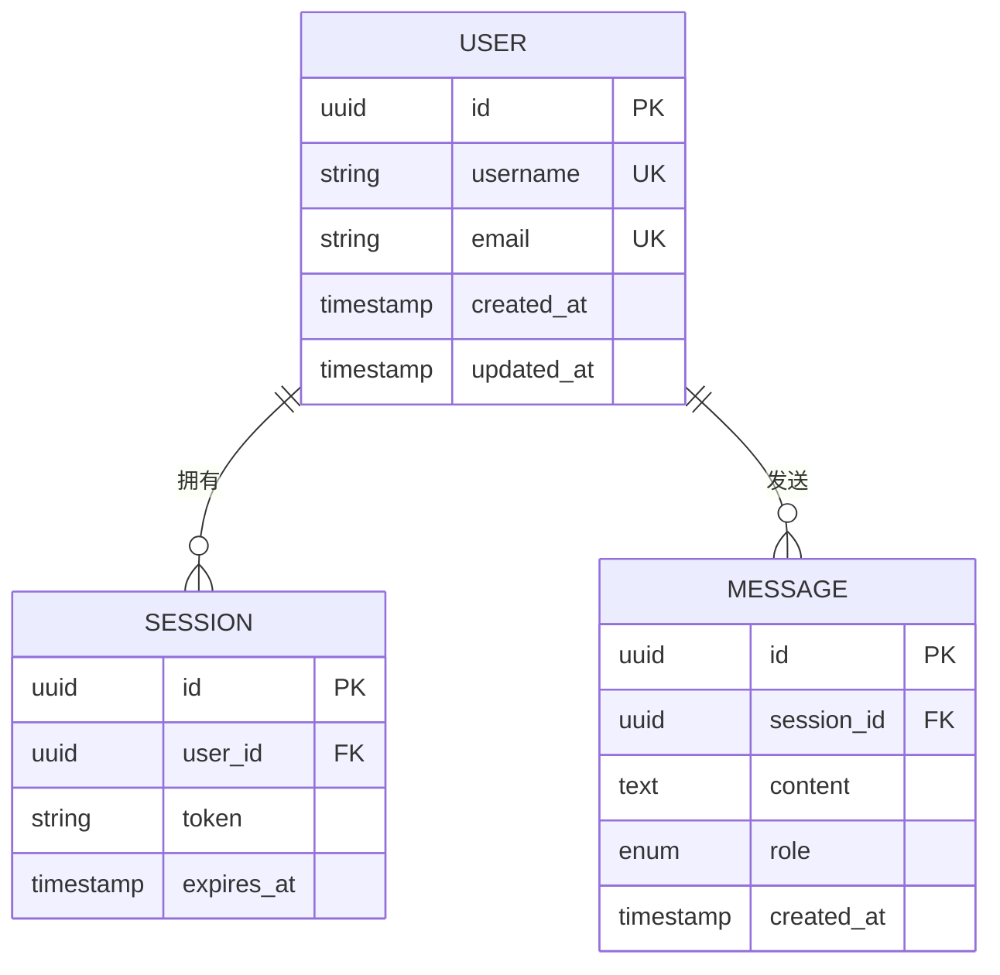

**图表来源**
- [config/api_schema.yaml](file://config/api_schema.yaml)

**章节来源**
- [config/api_schema.yaml](file://config/api_schema.yaml)

### 跨域配置（CORS）
- 后端：注册 CORS 中间件，允许指定域名、方法与头部
- 前端：在开发环境通过 Vite 代理转发到后端，生产环境由网关统一处理跨域
- 安全建议：最小化允许源、严格白名单方法、避免通配符

**章节来源**
- [frontend/src/api/client.ts](file://frontend/src/api/client.ts)
- [src/loopse/main.py](file://src/loopse/main.py)

### 错误处理策略
- 前端：统一拦截器将网络错误、业务错误码转换为标准对象，提示友好文案
- 后端：全局异常处理器捕获未处理异常，返回结构化错误体，包含错误码与追踪 ID
- 幂等与重试：对写操作增加幂等键，前端对瞬时错误实施指数退避重试

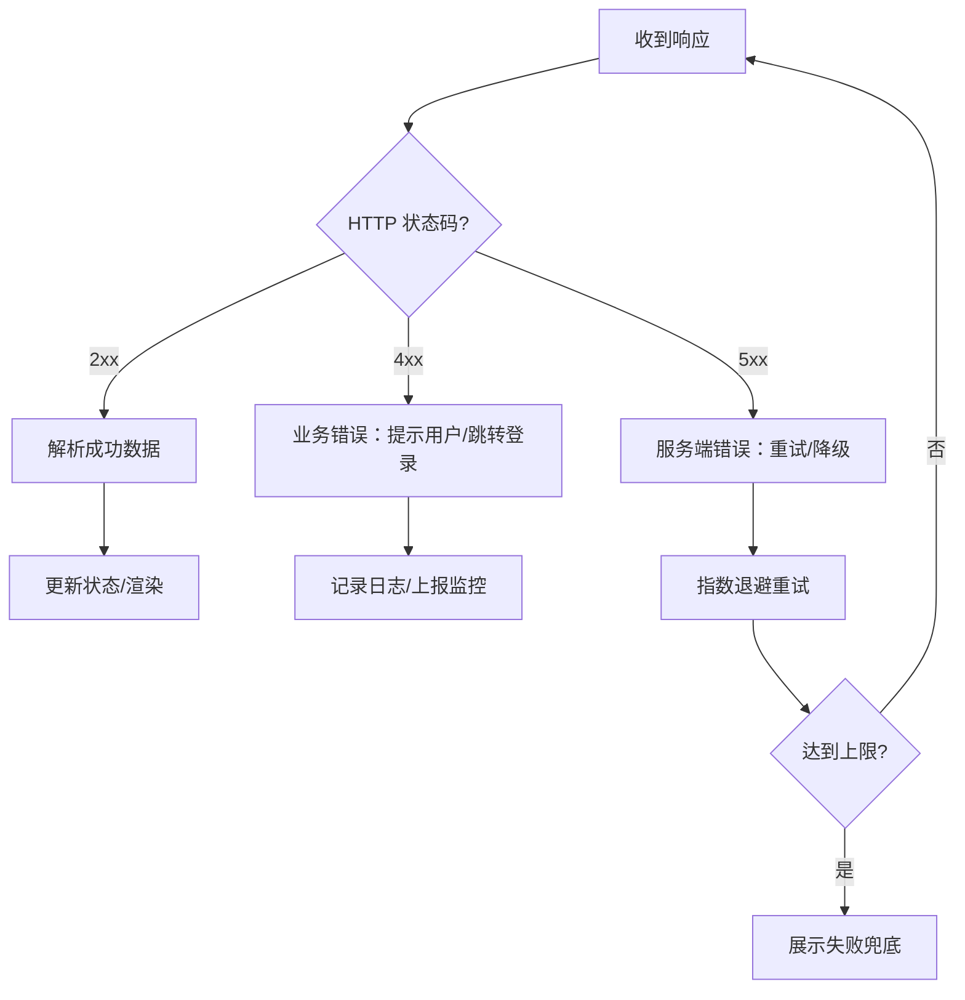

**图表来源**
- [frontend/src/api/client.ts](file://frontend/src/api/client.ts)
- [src/loopse/main.py](file://src/loopse/main.py)

**章节来源**
- [frontend/src/api/client.ts](file://frontend/src/api/client.ts)
- [src/loopse/main.py](file://src/loopse/main.py)

### 开发协作规范与接口契约管理
- 契约先行：以 config/api_schema.yaml 为唯一真实来源，前后端并行开发
- 代码生成：从契约生成前端类型与请求样板，减少手写错误
- 版本控制：API 路径带版本号（/v1/...），兼容期保留旧版路由，废弃公告与弃用标记
- 联调与测试：本地 Mock 优先，CI 中运行契约一致性检查与端到端用例

**章节来源**
- [config/api_schema.yaml](file://config/api_schema.yaml)
- [frontend/src/api/mockInterceptor.ts](file://frontend/src/api/mockInterceptor.ts)

## 依赖关系分析
- 前端内部依赖
  - main.ts 初始化应用、挂载路由与插件
  - router/index.ts 定义页面与守卫
  - api/client.ts 被各业务 API 模块复用
  - stores 与 composables 解耦业务逻辑与 UI
- 前后端耦合点
  - 认证头、错误码、分页与排序参数、时间戳格式
  - SSE 事件协议与字段约定

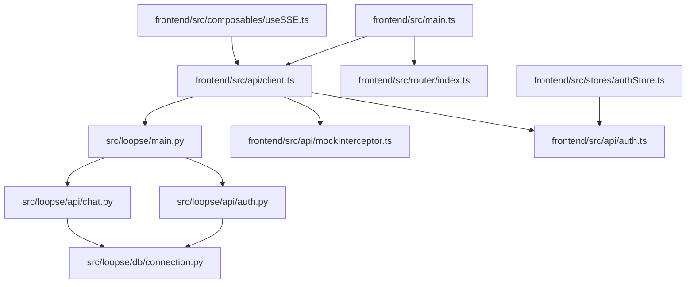

**图表来源**
- [frontend/src/main.ts](file://frontend/src/main.ts)
- [frontend/src/router/index.ts](file://frontend/src/router/index.ts)
- [frontend/src/api/client.ts](file://frontend/src/api/client.ts)
- [frontend/src/api/auth.ts](file://frontend/src/api/auth.ts)
- [frontend/src/api/mockInterceptor.ts](file://frontend/src/api/mockInterceptor.ts)
- [frontend/src/stores/authStore.ts](file://frontend/src/stores/authStore.ts)
- [frontend/src/composables/useSSE.ts](file://frontend/src/composables/useSSE.ts)
- [src/loopse/main.py](file://src/loopse/main.py)
- [src/loopse/api/auth.py](file://src/loopse/api/auth.py)
- [src/loopse/api/chat.py](file://src/loopse/api/chat.py)
- [src/loopse/db/connection.py](file://src/loopse/db/connection.py)

**章节来源**
- [frontend/src/main.ts](file://frontend/src/main.ts)
- [frontend/src/router/index.ts](file://frontend/src/router/index.ts)
- [frontend/src/api/client.ts](file://frontend/src/api/client.ts)
- [frontend/src/api/auth.ts](file://frontend/src/api/auth.ts)
- [frontend/src/api/mockInterceptor.ts](file://frontend/src/api/mockInterceptor.ts)
- [frontend/src/stores/authStore.ts](file://frontend/src/stores/authStore.ts)
- [frontend/src/composables/useSSE.ts](file://frontend/src/composables/useSSE.ts)
- [src/loopse/main.py](file://src/loopse/main.py)
- [src/loopse/api/auth.py](file://src/loopse/api/auth.py)
- [src/loopse/api/chat.py](file://src/loopse/api/chat.py)
- [src/loopse/db/connection.py](file://src/loopse/db/connection.py)

## 性能考量
- 前端
  - 路由与组件懒加载、图片与媒体资源 CDN 缓存
  - 请求合并与防抖节流、列表虚拟滚动
  - SSE 增量渲染与去重，避免全量重绘
- 后端
  - 连接池与索引优化、热点数据缓存
  - 流式输出降低首字节延迟
  - 限流与熔断保护上游 LLM 与数据库

[本节为通用指导，不直接分析具体文件]

## 故障排查指南
- 常见问题
  - 跨域报错：检查网关与后端 CORS 配置是否匹配
  - 401/403：确认 Token 存在且未过期、权限范围正确
  - SSE 断开：检查网络稳定性与服务端心跳，前端重连间隔合理
  - 数据不一致：核对契约版本与字段命名，查看错误码与追踪 ID
- 定位手段
  - 前端：拦截器打印请求/响应摘要、错误堆栈
  - 后端：全局异常处理器输出结构化日志、关联请求 ID
  - 数据库：慢查询分析与连接池指标

**章节来源**
- [frontend/src/api/client.ts](file://frontend/src/api/client.ts)
- [src/loopse/main.py](file://src/loopse/main.py)

## 结论
该前后端分离架构通过清晰的职责划分与契约驱动开发，实现了高内聚低耦合的系统设计。前端以 Vue3 + Pinia + Vue Router 构建，后端以 FastAPI 提供 REST 与 SSE 能力，结合网关与中间件保障安全与稳定。建议在持续集成中强化契约校验与自动化测试，进一步提升交付质量与协作效率。

## 附录
- 术语
  - SSE：Server-Sent Events，服务器推送事件流
  - JWT：JSON Web Token，无状态令牌
  - CORS：跨域资源共享
- 参考
  - 前端入口与路由初始化
  - 后端应用启动与中间件注册
  - API 契约定义与版本策略