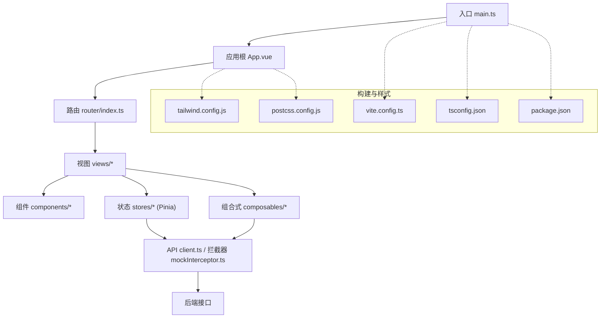
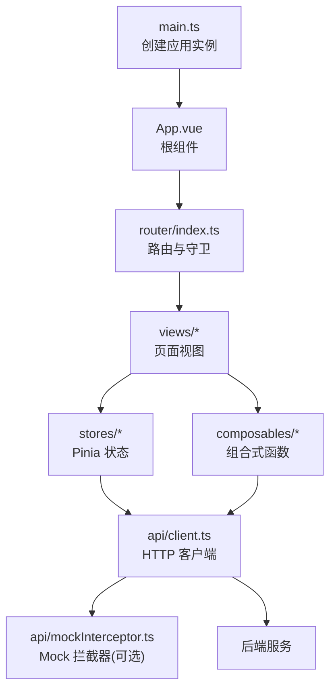
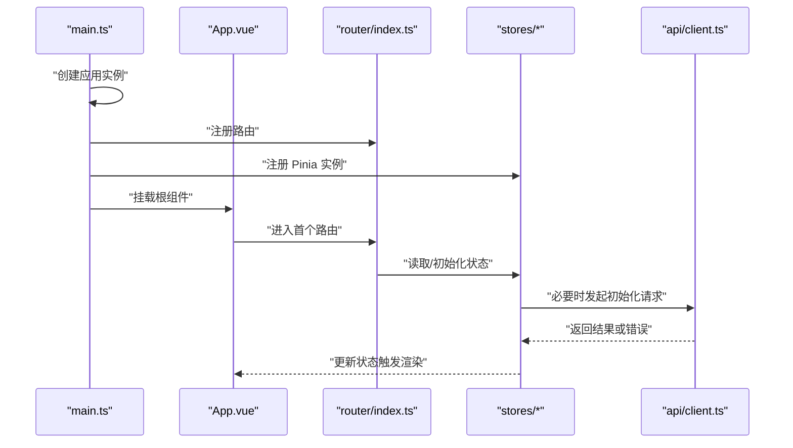
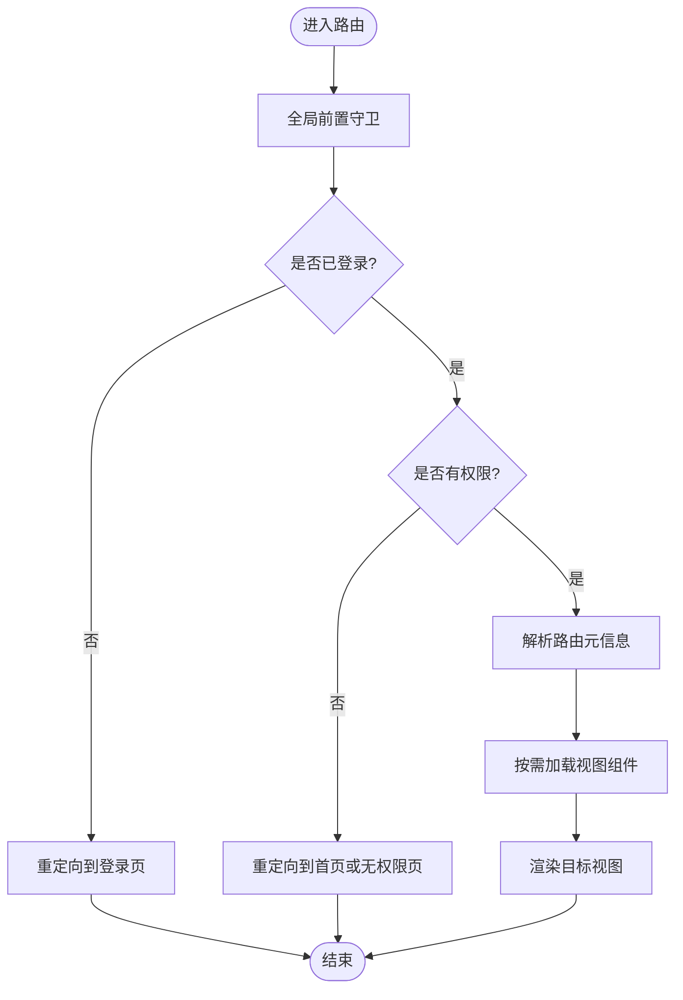
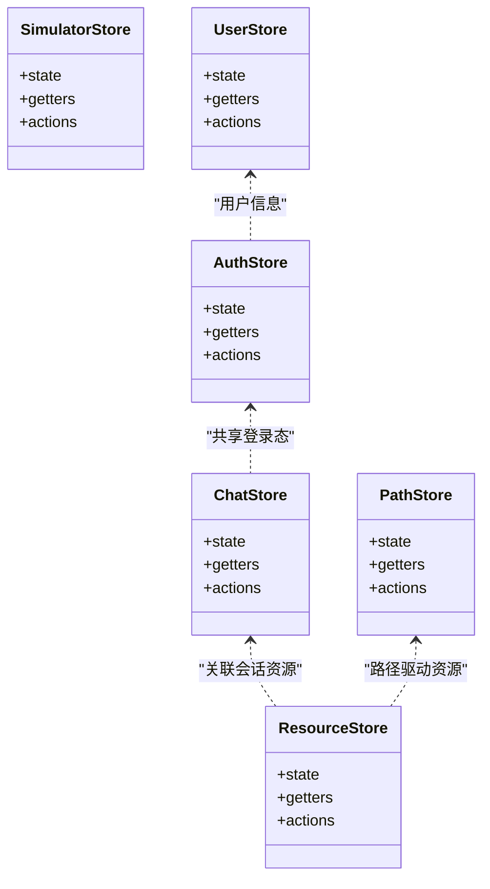
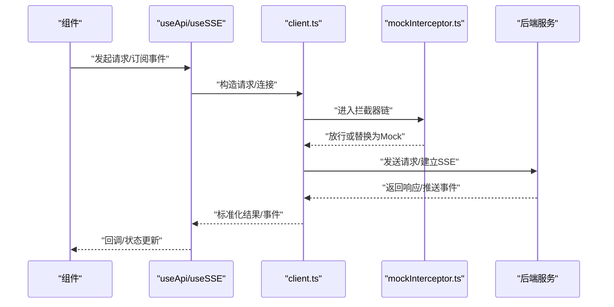
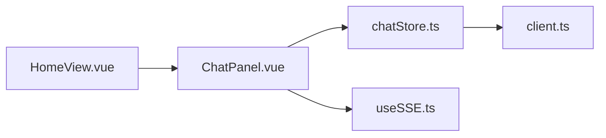
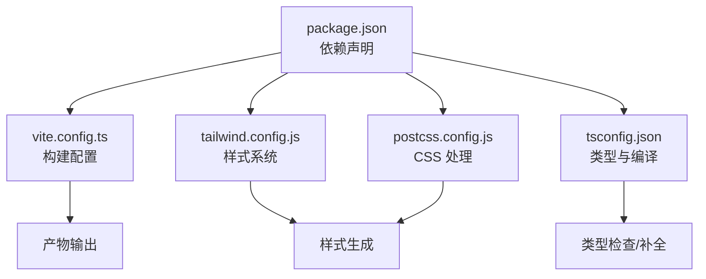

# 前端应用架构

<cite>
**本文引用的文件**   
- [frontend/src/main.ts](file://frontend/src/main.ts)
- [frontend/src/App.vue](file://frontend/src/App.vue)
- [frontend/src/router/index.ts](file://frontend/src/router/index.ts)
- [frontend/vite.config.ts](file://frontend/vite.config.ts)
- [frontend/package.json](file://frontend/package.json)
- [frontend/tailwind.config.js](file://frontend/tailwind.config.js)
- [frontend/postcss.config.js](file://frontend/postcss.config.js)
- [frontend/tsconfig.json](file://frontend/tsconfig.json)
- [frontend/src/stores/authStore.ts](file://frontend/src/stores/authStore.ts)
- [frontend/src/stores/chatStore.ts](file://frontend/src/stores/chatStore.ts)
- [frontend/src/stores/pathStore.ts](file://frontend/src/stores/pathStore.ts)
- [frontend/src/stores/resourceStore.ts](file://frontend/src/stores/resourceStore.ts)
- [frontend/src/stores/simulatorStore.ts](file://frontend/src/stores/simulatorStore.ts)
- [frontend/src/stores/userStore.ts](file://frontend/src/stores/userStore.ts)
- [frontend/src/api/client.ts](file://frontend/src/api/client.ts)
- [frontend/src/api/mockInterceptor.ts](file://frontend/src/api/mockInterceptor.ts)
- [frontend/src/composables/useApi.ts](file://frontend/src/composables/useApi.ts)
- [frontend/src/composables/useSSE.ts](file://frontend/src/composables/useSSE.ts)
- [frontend/src/types/index.ts](file://frontend/src/types/index.ts)
- [frontend/src/views/LoginView.vue](file://frontend/src/views/LoginView.vue)
- [frontend/src/views/HomeView.vue](file://frontend/src/views/HomeView.vue)
- [frontend/src/components/ChatPanel.vue](file://frontend/src/components/ChatPanel.vue)
</cite>

## 目录
1. [简介](#简介)
2. [项目结构](#项目结构)
3. [核心组件](#核心组件)
4. [架构总览](#架构总览)
5. [详细组件分析](#详细组件分析)
6. [依赖关系分析](#依赖关系分析)
7. [性能考虑](#性能考虑)
8. [故障排查指南](#故障排查指南)
9. [结论](#结论)
10. [附录](#附录)

## 简介
本文件面向前端工程，系统化梳理基于 Vue3 + TypeScript 的应用架构与实现要点。内容覆盖应用初始化流程、路由配置与模块组织、状态管理（Pinia）、组件层次结构与通信机制、构建与开发环境配置、生产优化策略、响应式设计与主题定制、国际化支持方案、安全策略、错误监控与用户行为分析集成等。文档以仓库中的实际源码为依据，提供可视化图示与可追溯的“章节来源”。

## 项目结构
前端位于 frontend 子目录，采用按功能域划分的目录组织方式：
- src/api：HTTP 客户端封装、拦截器、业务 API 定义
- src/stores：基于 Pinia 的状态模块（认证、聊天、路径、资源、模拟器、用户）
- src/composables：组合式函数（API 调用、SSE 事件流、虚拟教师交互）
- src/components：通用与领域组件
- src/views：页面级视图
- src/types：TypeScript 类型定义
- src/utils：工具函数与特性检测
- public：静态资源与 mock 数据
- 根配置：vite.config.ts、tailwind.config.js、postcss.config.js、tsconfig.json、package.json

图表来源
- [frontend/src/main.ts](file://frontend/src/main.ts)
- [frontend/src/App.vue](file://frontend/src/App.vue)
- [frontend/src/router/index.ts](file://frontend/src/router/index.ts)
- [frontend/vite.config.ts](file://frontend/vite.config.ts)
- [frontend/tailwind.config.js](file://frontend/tailwind.config.js)
- [frontend/postcss.config.js](file://frontend/postcss.config.js)
- [frontend/tsconfig.json](file://frontend/tsconfig.json)
- [frontend/package.json](file://frontend/package.json)

章节来源
- [frontend/src/main.ts](file://frontend/src/main.ts)
- [frontend/src/App.vue](file://frontend/src/App.vue)
- [frontend/src/router/index.ts](file://frontend/src/router/index.ts)
- [frontend/vite.config.ts](file://frontend/vite.config.ts)
- [frontend/package.json](file://frontend/package.json)
- [frontend/tailwind.config.js](file://frontend/tailwind.config.js)
- [frontend/postcss.config.js](file://frontend/postcss.config.js)
- [frontend/tsconfig.json](file://frontend/tsconfig.json)

## 核心组件
本节聚焦应用初始化、路由与状态管理的核心实现。

- 应用初始化
  - 入口文件负责创建 Vue 应用实例、挂载根组件、注册插件与全局配置。
  - 根组件承载布局与全局上下文（如路由出口、全局提示、主题开关等）。

- 路由配置
  - 集中式路由表，按页面维度划分，支持嵌套与守卫逻辑（鉴权、重定向、懒加载）。
  - 视图与路由一一对应，便于权限控制与按需加载。

- 状态管理（Pinia）
  - 按业务域拆分 store：authStore（认证）、chatStore（会话）、pathStore（学习路径）、resourceStore（资源）、simulatorStore（仿真）、userStore（用户信息）。
  - 通过组合式 API 暴露 state、getters、actions，组件中以 useXxxStore() 访问。

- HTTP 客户端与拦截器
  - 统一请求封装，处理基础 URL、超时、重试、错误码映射。
  - 可选 Mock 拦截器用于本地联调与演示。

- 组合式函数
  - useApi：封装常用请求模式（分页、缓存、取消）。
  - useSSE：封装服务端推送事件流，统一连接、断线重连、消息分发。

章节来源
- [frontend/src/main.ts](file://frontend/src/main.ts)
- [frontend/src/App.vue](file://frontend/src/App.vue)
- [frontend/src/router/index.ts](file://frontend/src/router/index.ts)
- [frontend/src/stores/authStore.ts](file://frontend/src/stores/authStore.ts)
- [frontend/src/stores/chatStore.ts](file://frontend/src/stores/chatStore.ts)
- [frontend/src/stores/pathStore.ts](file://frontend/src/stores/pathStore.ts)
- [frontend/src/stores/resourceStore.ts](file://frontend/src/stores/resourceStore.ts)
- [frontend/src/stores/simulatorStore.ts](file://frontend/src/stores/simulatorStore.ts)
- [frontend/src/stores/userStore.ts](file://frontend/src/stores/userStore.ts)
- [frontend/src/api/client.ts](file://frontend/src/api/client.ts)
- [frontend/src/api/mockInterceptor.ts](file://frontend/src/api/mockInterceptor.ts)
- [frontend/src/composables/useApi.ts](file://frontend/src/composables/useApi.ts)
- [frontend/src/composables/useSSE.ts](file://frontend/src/composables/useSSE.ts)

## 架构总览
下图展示从入口到视图、状态、网络层的整体交互关系。

图表来源
- [frontend/src/main.ts](file://frontend/src/main.ts)
- [frontend/src/App.vue](file://frontend/src/App.vue)
- [frontend/src/router/index.ts](file://frontend/src/router/index.ts)
- [frontend/src/api/client.ts](file://frontend/src/api/client.ts)
- [frontend/src/api/mockInterceptor.ts](file://frontend/src/api/mockInterceptor.ts)

## 详细组件分析

### 应用初始化流程
- 入口职责
  - 创建 Vue 应用实例并挂载至 DOM。
  - 引入并注册必要的插件（如路由、状态管理、UI 库等）。
  - 注入全局配置（如环境变量、主题、语言包等）。
- 根组件职责
  - 提供全局布局容器、路由出口、全局通知与错误边界。
  - 在生命周期中完成一次性初始化（如权限校验、主题恢复、埋点初始化）。

图表来源
- [frontend/src/main.ts](file://frontend/src/main.ts)
- [frontend/src/App.vue](file://frontend/src/App.vue)
- [frontend/src/router/index.ts](file://frontend/src/router/index.ts)
- [frontend/src/stores/authStore.ts](file://frontend/src/stores/authStore.ts)
- [frontend/src/api/client.ts](file://frontend/src/api/client.ts)

章节来源
- [frontend/src/main.ts](file://frontend/src/main.ts)
- [frontend/src/App.vue](file://frontend/src/App.vue)
- [frontend/src/router/index.ts](file://frontend/src/router/index.ts)

### 路由配置与导航守卫
- 路由组织
  - 集中式路由表，按页面维度划分，支持懒加载与参数化路由。
  - 常见页面包括登录、首页、聊天、诊断、路径、资源、模拟器等。
- 导航守卫
  - 全局前置守卫：校验登录态、角色权限、动态菜单生成。
  - 路由独享守卫：针对特定页面的二次校验。
- 路由与视图映射
  - 典型视图示例：LoginView、HomeView 等。

图表来源
- [frontend/src/router/index.ts](file://frontend/src/router/index.ts)
- [frontend/src/views/LoginView.vue](file://frontend/src/views/LoginView.vue)
- [frontend/src/views/HomeView.vue](file://frontend/src/views/HomeView.vue)

章节来源
- [frontend/src/router/index.ts](file://frontend/src/router/index.ts)
- [frontend/src/views/LoginView.vue](file://frontend/src/views/LoginView.vue)
- [frontend/src/views/HomeView.vue](file://frontend/src/views/HomeView.vue)

### 状态管理（Pinia）设计
- 模块划分
  - authStore：登录态、令牌、刷新策略、登出清理。
  - chatStore：会话列表、消息、发送/接收、SSE 接入。
  - pathStore：学习路径、节点状态、进度同步。
  - resourceStore：资源列表、生成任务、下载与预览。
  - simulatorStore：仿真参数、运行状态、回放。
  - userStore：用户资料、偏好设置、主题与语言。
- 状态持久化
  - 关键状态（如 token、用户信息、主题）持久化到 localStorage/sessionStorage。
- 跨组件通信
  - 组件通过 useXxxStore() 直接读写状态；复杂场景使用 actions 聚合操作。

图表来源
- [frontend/src/stores/authStore.ts](file://frontend/src/stores/authStore.ts)
- [frontend/src/stores/chatStore.ts](file://frontend/src/stores/chatStore.ts)
- [frontend/src/stores/pathStore.ts](file://frontend/src/stores/pathStore.ts)
- [frontend/src/stores/resourceStore.ts](file://frontend/src/stores/resourceStore.ts)
- [frontend/src/stores/simulatorStore.ts](file://frontend/src/stores/simulatorStore.ts)
- [frontend/src/stores/userStore.ts](file://frontend/src/stores/userStore.ts)

章节来源
- [frontend/src/stores/authStore.ts](file://frontend/src/stores/authStore.ts)
- [frontend/src/stores/chatStore.ts](file://frontend/src/stores/chatStore.ts)
- [frontend/src/stores/pathStore.ts](file://frontend/src/stores/pathStore.ts)
- [frontend/src/stores/resourceStore.ts](file://frontend/src/stores/resourceStore.ts)
- [frontend/src/stores/simulatorStore.ts](file://frontend/src/stores/simulatorStore.ts)
- [frontend/src/stores/userStore.ts](file://frontend/src/stores/userStore.ts)

### 网络层与 SSE 事件流
- HTTP 客户端
  - 统一 baseURL、超时、重试、错误码映射、请求/响应拦截。
  - 可选 Mock 拦截器，便于离线开发与演示。
- 组合式 API
  - useApi：封装分页、缓存、取消、错误上报。
  - useSSE：封装连接建立、心跳、断线重连、消息分发与错误处理。

图表来源
- [frontend/src/api/client.ts](file://frontend/src/api/client.ts)
- [frontend/src/api/mockInterceptor.ts](file://frontend/src/api/mockInterceptor.ts)
- [frontend/src/composables/useApi.ts](file://frontend/src/composables/useApi.ts)
- [frontend/src/composables/useSSE.ts](file://frontend/src/composables/useSSE.ts)

章节来源
- [frontend/src/api/client.ts](file://frontend/src/api/client.ts)
- [frontend/src/api/mockInterceptor.ts](file://frontend/src/api/mockInterceptor.ts)
- [frontend/src/composables/useApi.ts](file://frontend/src/composables/useApi.ts)
- [frontend/src/composables/useSSE.ts](file://frontend/src/composables/useSSE.ts)

### 组件层次结构与通信机制
- 层次结构
  - 视图层（views）：页面级容器，协调多个领域组件。
  - 领域组件（components）：复用性高的 UI 与业务组件。
  - 组合式函数（composables）：跨组件逻辑复用（网络、事件、动画等）。
- 通信机制
  - Props/Events：父子组件标准通信。
  - Provide/Inject：跨层级轻量共享。
  - Pinia：跨组件/跨页面共享状态。
  - 事件总线/自定义事件：局部解耦（谨慎使用）。
- 示例
  - ChatPanel 作为聊天面板组件，结合 chatStore 与 useSSE 进行消息收发与渲染。

图表来源
- [frontend/src/views/HomeView.vue](file://frontend/src/views/HomeView.vue)
- [frontend/src/components/ChatPanel.vue](file://frontend/src/components/ChatPanel.vue)
- [frontend/src/stores/chatStore.ts](file://frontend/src/stores/chatStore.ts)
- [frontend/src/composables/useSSE.ts](file://frontend/src/composables/useSSE.ts)
- [frontend/src/api/client.ts](file://frontend/src/api/client.ts)

章节来源
- [frontend/src/components/ChatPanel.vue](file://frontend/src/components/ChatPanel.vue)
- [frontend/src/stores/chatStore.ts](file://frontend/src/stores/chatStore.ts)
- [frontend/src/composables/useSSE.ts](file://frontend/src/composables/useSSE.ts)
- [frontend/src/views/HomeView.vue](file://frontend/src/views/HomeView.vue)

## 依赖关系分析
- 运行时依赖
  - Vue3、TypeScript、Vite、TailwindCSS、PostCSS、Pinia、Vue Router 等。
- 构建与开发
  - Vite 作为构建与开发服务器，TS 编译与类型检查，Tailwind 原子化样式。
- 外部集成
  - 后端 API、Mock 数据、可能的第三方 SDK（如视频/3D 相关）。

图表来源
- [frontend/package.json](file://frontend/package.json)
- [frontend/vite.config.ts](file://frontend/vite.config.ts)
- [frontend/tailwind.config.js](file://frontend/tailwind.config.js)
- [frontend/postcss.config.js](file://frontend/postcss.config.js)
- [frontend/tsconfig.json](file://frontend/tsconfig.json)

章节来源
- [frontend/package.json](file://frontend/package.json)
- [frontend/vite.config.ts](file://frontend/vite.config.ts)
- [frontend/tailwind.config.js](file://frontend/tailwind.config.js)
- [frontend/postcss.config.js](file://frontend/postcss.config.js)
- [frontend/tsconfig.json](file://frontend/tsconfig.json)

## 性能考虑
- 构建与打包
  - 启用代码分割与懒加载，减少首屏体积。
  - 静态资源压缩、Tree Shaking、依赖预构建。
- 运行时优化
  - 组件按需引入、避免大对象频繁更新、合理使用计算属性与侦听器。
  - 长列表虚拟化、图片懒加载与 WebP/AVIF 格式。
- 网络优化
  - 请求合并与去抖节流、缓存策略（内存/磁盘）、SSE 断线重连与心跳。
- 可观测性
  - 埋点采集关键指标（首屏时间、交互耗时、错误率），辅助持续优化。

[本节为通用指导，不直接分析具体文件]

## 故障排查指南
- 常见问题定位
  - 路由跳转失败：检查路由表与守卫逻辑、权限配置。
  - 状态不同步：确认 Pinia 模块是否正确注册、action 是否被调用、持久化是否生效。
  - 网络异常：查看拦截器日志、错误码映射、Mock 开关。
  - SSE 连接不稳定：检查心跳、重连策略、服务端推送频率。
- 调试建议
  - 使用浏览器开发者工具 Network/Console/Performance 面板。
  - 在关键 action 与拦截器处增加结构化日志。
  - 对复杂状态变更添加快照对比与变更记录。

章节来源
- [frontend/src/api/client.ts](file://frontend/src/api/client.ts)
- [frontend/src/api/mockInterceptor.ts](file://frontend/src/api/mockInterceptor.ts)
- [frontend/src/composables/useSSE.ts](file://frontend/src/composables/useSSE.ts)
- [frontend/src/stores/authStore.ts](file://frontend/src/stores/authStore.ts)
- [frontend/src/stores/chatStore.ts](file://frontend/src/stores/chatStore.ts)

## 结论
本项目采用 Vue3 + TypeScript + Vite + TailwindCSS 的现代前端技术栈，结合 Pinia 与组合式函数形成清晰的分层架构。通过集中式路由与模块化状态管理，实现了良好的可维护性与扩展性。在网络层与 SSE 方面提供了统一的封装，便于后续接入更多实时能力。建议在后续迭代中完善国际化与主题体系、强化错误监控与用户行为分析，并持续优化构建与运行时性能。

[本节为总结性内容，不直接分析具体文件]

## 附录
- 响应式设计实现
  - 基于 Tailwind 的断点与工具类，配合媒体查询与弹性布局，实现多端适配。
- 国际化支持方案
  - 建议引入 i18n 库，按模块拆分文案，结合路由与用户偏好切换语言。
- 主题定制方案
  - 通过 CSS 变量与 Tailwind 自定义主题色板，实现明暗主题与品牌色切换。
- 前端安全策略
  - 输入校验与输出编码、CSP 策略、敏感信息脱敏、防 XSS/CSRF 措施。
- 错误监控与用户行为分析
  - 集成错误上报 SDK，采集未捕获异常与 Promise 拒绝；埋点关键用户路径与转化漏斗。

[本节为概念性说明，不直接分析具体文件]