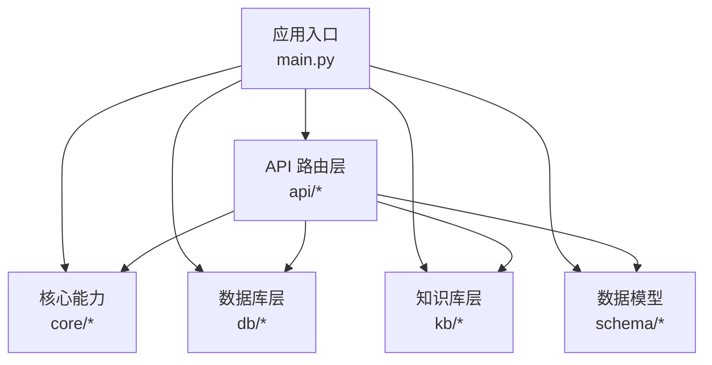
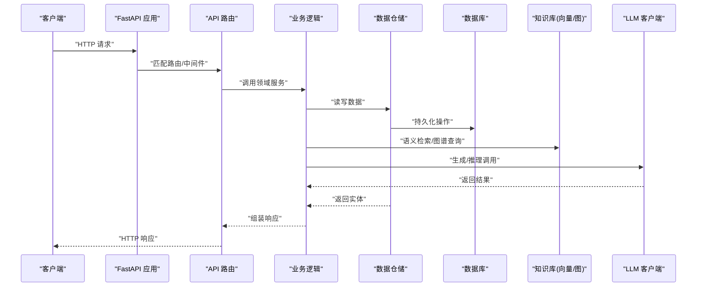
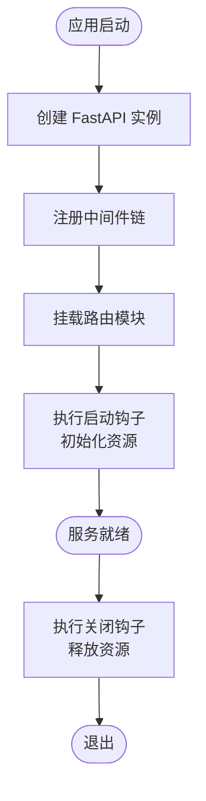
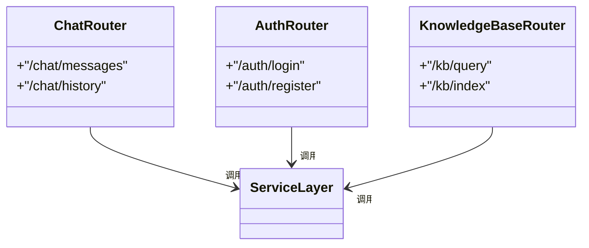
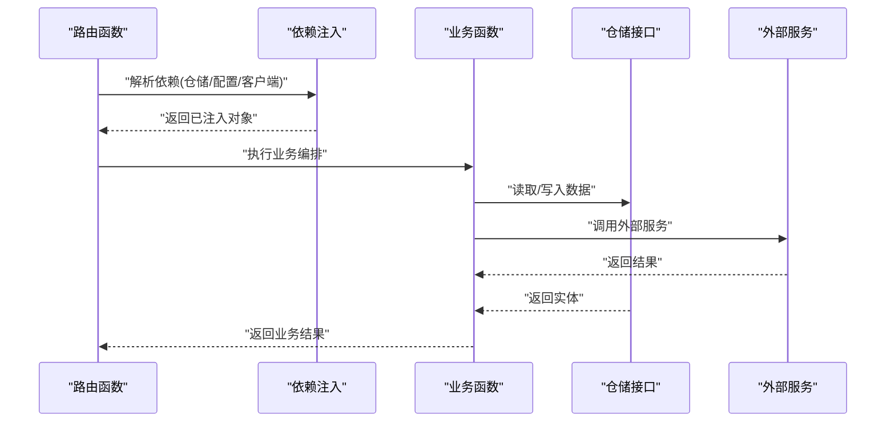
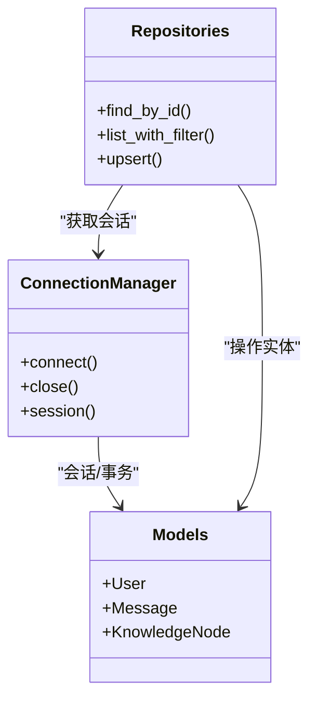
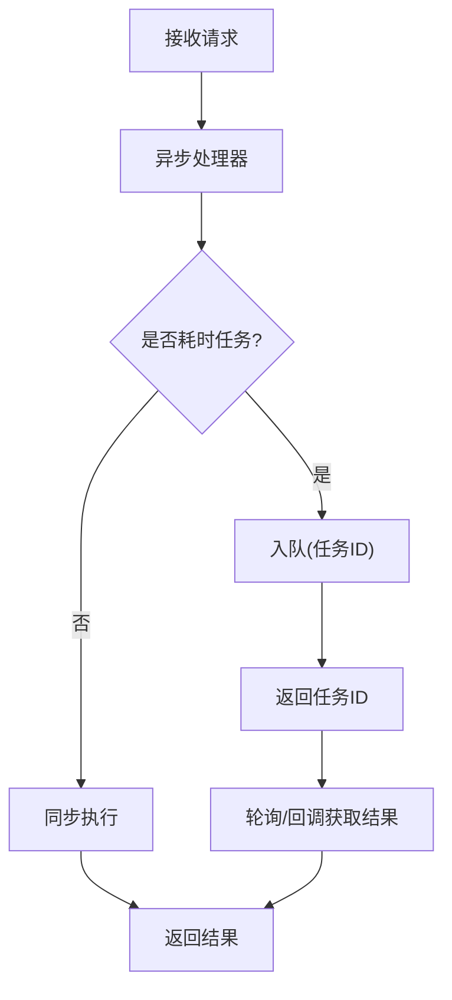
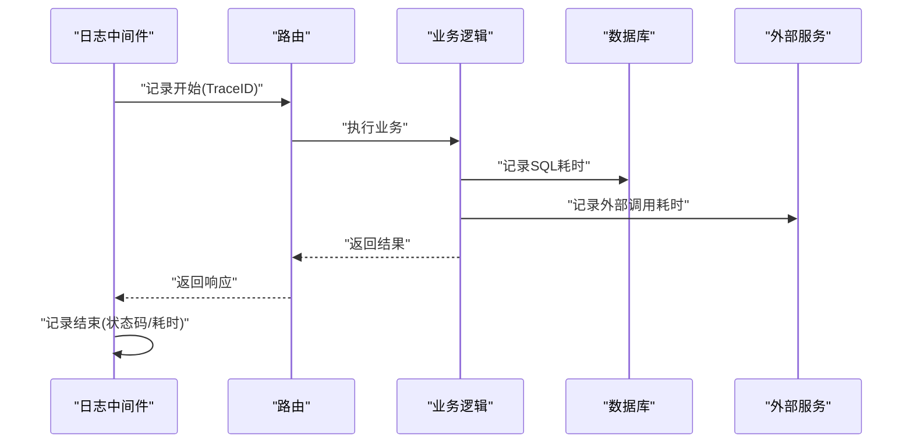
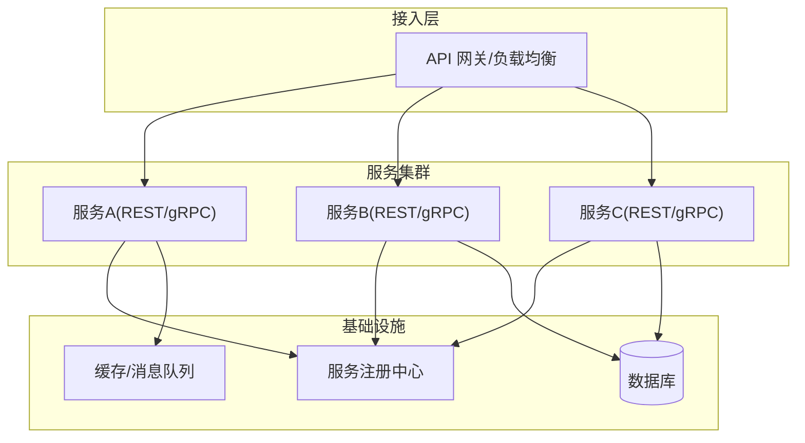
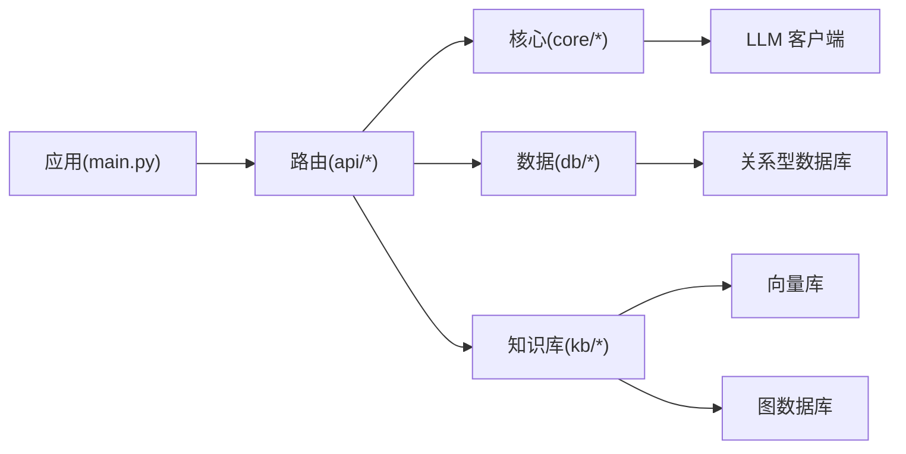

# 后端服务架构

<cite>
**本文引用的文件**   
- [src/loopse/main.py](file://src/loopse/main.py)
- [src/loopse/api/auth.py](file://src/loopse/api/auth.py)
- [src/loopse/api/chat.py](file://src/loopse/api/chat.py)
- [src/loopse/api/knowledge_base.py](file://src/loopse/api/knowledge_base.py)
- [src/loopse/db/connection.py](file://src/loopse/db/connection.py)
- [src/loopse/db/models.py](file://src/loopse/db/models.py)
- [src/loopse/db/repositories.py](file://src/loopse/db/repositories.py)
- [src/loopse/core/llm_client.py](file://src/loopse/core/llm_client.py)
- [src/loopse/core/trust_mechanism.py](file://src/loopse/core/trust_mechanism.py)
- [src/loopse/kb/vector_store.py](file://src/loopse/kb/vector_store.py)
- [src/loopse/kb/knowledge_graph.py](file://src/loopse/kb/knowledge_graph.py)
- [src/loopse/schema/profile.py](file://src/loopse/schema/profile.py)
- [pyproject.toml](file://pyproject.toml)
- [requirements.txt](file://requirements.txt)
</cite>

## 目录
1. [简介](#简介)
2. [项目结构](#项目结构)
3. [核心组件](#核心组件)
4. [架构总览](#架构总览)
5. [详细组件分析](#详细组件分析)
6. [依赖分析](#依赖分析)
7. [性能考虑](#性能考虑)
8. [故障排查指南](#故障排查指南)
9. [结论](#结论)
10. [附录](#附录)

## 简介
本文件面向后端服务架构，聚焦于基于 FastAPI 的 API 层、中间件与启动流程、分层设计（路由/业务/数据访问）、异步处理与并发控制、依赖注入与配置管理、日志记录、以及微服务通信与服务发现/负载均衡策略。文档以代码仓库中的实际实现为依据，结合可视化图示帮助读者快速理解系统结构与关键流程。

## 项目结构
后端主要位于 src/loopse 目录下，采用按职责分层的组织方式：
- api：HTTP 路由与请求处理入口
- core：通用能力（如 LLM 客户端、信任机制）
- db：数据库连接、ORM 模型与仓储抽象
- kb：知识图谱与向量检索等知识库能力
- schema：Pydantic 数据模型定义
- main：应用启动与全局配置

图表来源
- [src/loopse/main.py](file://src/loopse/main.py)
- [src/loopse/api/chat.py](file://src/loopse/api/chat.py)
- [src/loopse/db/connection.py](file://src/loopse/db/connection.py)
- [src/loopse/kb/vector_store.py](file://src/loopse/kb/vector_store.py)

章节来源
- [src/loopse/main.py](file://src/loopse/main.py)
- [pyproject.toml](file://pyproject.toml)
- [requirements.txt](file://requirements.txt)

## 核心组件
- 应用入口与生命周期：负责创建 FastAPI 实例、注册路由、挂载中间件、初始化资源（数据库、缓存、外部服务），并在启动/关闭钩子中完成资源准备与清理。
- API 路由层：按领域划分模块（认证、聊天、知识库等），每个模块提供一组端点，统一进行参数校验、鉴权、限流与响应封装。
- 核心能力：LLM 客户端封装、信任与安全机制等跨域复用能力。
- 数据访问层：通过连接管理、ORM 模型与仓储接口，屏蔽底层存储细节，为上层提供一致的数据操作契约。
- 知识库层：向量检索与知识图谱查询，支撑语义搜索与推理。
- 数据模型：使用 Pydantic 对输入输出进行强类型校验与序列化。

章节来源
- [src/loopse/main.py](file://src/loopse/main.py)
- [src/loopse/api/auth.py](file://src/loopse/api/auth.py)
- [src/loopse/api/chat.py](file://src/loopse/api/chat.py)
- [src/loopse/api/knowledge_base.py](file://src/loopse/api/knowledge_base.py)
- [src/loopse/core/llm_client.py](file://src/loopse/core/llm_client.py)
- [src/loopse/db/connection.py](file://src/loopse/db/connection.py)
- [src/loopse/db/models.py](file://src/loopse/db/models.py)
- [src/loopse/db/repositories.py](file://src/loopse/db/repositories.py)
- [src/loopse/kb/vector_store.py](file://src/loopse/kb/vector_store.py)
- [src/loopse/schema/profile.py](file://src/loopse/schema/profile.py)

## 架构总览
下图展示了从 HTTP 请求进入，到路由分发、业务编排、数据访问与外部服务的整体调用链。

图表来源
- [src/loopse/main.py](file://src/loopse/main.py)
- [src/loopse/api/chat.py](file://src/loopse/api/chat.py)
- [src/loopse/db/repositories.py](file://src/loopse/db/repositories.py)
- [src/loopse/kb/vector_store.py](file://src/loopse/kb/vector_store.py)
- [src/loopse/core/llm_client.py](file://src/loopse/core/llm_client.py)

## 详细组件分析

### 应用启动与中间件管道
- 启动流程要点
  - 创建 FastAPI 实例并设置元信息（版本、描述等）。
  - 注册全局中间件（如 CORS、请求日志、安全头、限流等）。
  - 挂载各业务路由模块。
  - 在 on_event("startup") 中初始化数据库连接池、缓存、外部服务客户端；在 on_event("shutdown") 中释放资源。
- 中间件顺序
  - 建议顺序：CORS → 安全头 → 请求日志 → 鉴权/权限 → 限流/熔断 → 业务路由。
  - 异常中间件应置于最外层，确保所有未捕获异常都能被统一处理。

图表来源
- [src/loopse/main.py](file://src/loopse/main.py)

章节来源
- [src/loopse/main.py](file://src/loopse/main.py)

### API 分层设计与路由注册
- 分层模式
  - 路由层：仅负责解析请求、参数校验、鉴权、调用服务层与格式化响应。
  - 业务层：编排领域逻辑，协调仓储与外部服务，保证事务与一致性。
  - 数据访问层：通过仓储接口屏蔽具体存储实现，支持多后端扩展。
- 路由组织
  - 按领域拆分模块（认证、聊天、知识库等），在应用启动时集中挂载。
  - 使用统一的响应包装器与错误码规范，便于前端消费。

图表来源
- [src/loopse/api/chat.py](file://src/loopse/api/chat.py)
- [src/loopse/api/auth.py](file://src/loopse/api/auth.py)
- [src/loopse/api/knowledge_base.py](file://src/loopse/api/knowledge_base.py)

章节来源
- [src/loopse/api/chat.py](file://src/loopse/api/chat.py)
- [src/loopse/api/auth.py](file://src/loopse/api/auth.py)
- [src/loopse/api/knowledge_base.py](file://src/loopse/api/knowledge_base.py)

### 业务逻辑组织与依赖注入
- 依赖注入
  - 使用 FastAPI 的依赖注入机制，将仓储、配置、外部服务客户端作为依赖传入路由或业务函数，提升可测试性与解耦度。
- 业务编排
  - 将复杂流程拆分为多个小步骤（如检索→排序→生成→后处理），每步可独立替换实现。
- 配置管理
  - 通过环境变量与配置文件加载，区分开发/测试/生产环境。
  - 敏感信息（密钥、DSN）通过环境变量注入，避免硬编码。

图表来源
- [src/loopse/api/chat.py](file://src/loopse/api/chat.py)
- [src/loopse/db/repositories.py](file://src/loopse/db/repositories.py)
- [src/loopse/core/llm_client.py](file://src/loopse/core/llm_client.py)

章节来源
- [src/loopse/api/chat.py](file://src/loopse/api/chat.py)
- [src/loopse/db/repositories.py](file://src/loopse/db/repositories.py)
- [src/loopse/core/llm_client.py](file://src/loopse/core/llm_client.py)

### 数据访问层抽象
- 连接管理
  - 集中管理数据库连接池与生命周期，避免重复创建连接。
- ORM 模型
  - 使用声明式模型映射表结构，提供字段约束与关系定义。
- 仓储接口
  - 定义 CRUD 与领域查询方法，隐藏 SQL/驱动细节，便于替换存储后端。

图表来源
- [src/loopse/db/connection.py](file://src/loopse/db/connection.py)
- [src/loopse/db/models.py](file://src/loopse/db/models.py)
- [src/loopse/db/repositories.py](file://src/loopse/db/repositories.py)

章节来源
- [src/loopse/db/connection.py](file://src/loopse/db/connection.py)
- [src/loopse/db/models.py](file://src/loopse/db/models.py)
- [src/loopse/db/repositories.py](file://src/loopse/db/repositories.py)

### 异步处理、任务队列与并发控制
- 异步处理
  - 使用 async/await 编写 I/O 密集型路由与业务函数，提高吞吐。
- 任务队列
  - 将耗时任务（如批量索引、长时生成）放入消息队列，由消费者异步处理，API 立即返回任务 ID。
- 并发控制
  - 针对外部 LLM 调用与数据库写操作，使用令牌桶/信号量限制并发，防止雪崩。
  - 对热点接口启用幂等键与去重，避免重复提交。

[此图为概念性流程图，不直接映射具体源码文件]

### 日志记录与可观测性
- 结构化日志
  - 统一日志格式（时间戳、级别、请求ID、用户ID、耗时、状态码）。
- 链路追踪
  - 为每个请求分配唯一 TraceID，贯穿中间件、路由、仓储与外部调用。
- 指标采集
  - 暴露健康检查与基础指标（QPS、延迟分布、错误率），供监控告警。

[此图为概念性流程图，不直接映射具体源码文件]

### 微服务通信协议、服务发现与负载均衡
- 通信协议
  - 内部服务间优先采用 gRPC/Protobuf 以获得高性能与强类型契约；对外暴露 REST/JSON 以便浏览器与第三方集成。
- 服务发现
  - 使用轻量级注册中心（如 etcd/Nacos）或服务网格（如 Istio）进行服务注册与发现。
- 负载均衡
  - 网关层（Nginx/Traefik/Envoy）做七层负载均衡与健康检查；gRPC 侧可使用客户端侧负载均衡（如 gRPC LB）。
- 容错与重试
  - 引入熔断器与退避重试，避免级联失败。

[此图为概念性架构图，不直接映射具体源码文件]

## 依赖分析
- 框架与运行时
  - FastAPI、Uvicorn/Gunicorn、Pydantic、SQLAlchemy/驱动、异步库等。
- 外部依赖
  - LLM 客户端 SDK、向量数据库、图数据库、消息队列、缓存等。
- 依赖注入与模块化
  - 通过依赖注入降低耦合，路由只依赖抽象接口，便于单元测试与替换实现。

图表来源
- [src/loopse/main.py](file://src/loopse/main.py)
- [src/loopse/core/llm_client.py](file://src/loopse/core/llm_client.py)
- [src/loopse/kb/vector_store.py](file://src/loopse/kb/vector_store.py)
- [src/loopse/db/connection.py](file://src/loopse/db/connection.py)

章节来源
- [pyproject.toml](file://pyproject.toml)
- [requirements.txt](file://requirements.txt)

## 性能考虑
- 连接池与超时
  - 合理设置数据库连接池大小与超时，避免连接耗尽。
- 异步与批处理
  - 对 I/O 密集路径全面异步化；批量写入与索引合并减少锁竞争。
- 缓存策略
  - 热点数据多级缓存（本地+分布式），TTL 与失效策略清晰。
- 限流与降级
  - 网关与业务层双重限流；外部服务不可用时走降级路径。
- 可观测性
  - 全链路追踪与指标上报，定位瓶颈与异常。

[本节为通用指导，不直接分析具体文件]

## 故障排查指南
- 常见问题
  - 启动失败：检查环境变量、数据库连通性、证书与端口占用。
  - 路由 404：确认路由模块已挂载且前缀正确。
  - 鉴权失败：核对签名算法、过期时间与密钥轮换。
  - 外部服务超时：查看熔断与重试配置，必要时切换备用端点。
- 诊断手段
  - 开启调试日志与详细堆栈；导出 TraceID 关联日志。
  - 使用健康检查端点验证依赖可用性。
  - 压测关键路径，观察 P95/P99 延迟与错误率。

章节来源
- [src/loopse/main.py](file://src/loopse/main.py)
- [src/loopse/api/auth.py](file://src/loopse/api/auth.py)

## 结论
本架构以 FastAPI 为核心，采用清晰的分层与依赖注入，结合异步处理、任务队列与并发控制，满足高吞吐与可扩展需求。通过统一的路由组织、数据访问抽象与知识库能力，形成稳定可靠的 API 服务基座。配合完善的日志、指标与可观测性体系，可在生产环境中获得良好的稳定性与可维护性。

## 附录
- 配置与环境变量
  - 数据库 DSN、缓存地址、LLM 密钥、队列地址等通过环境变量注入。
- 安全与合规
  - 最小权限原则、敏感数据脱敏、审计日志留存。
- 部署建议
  - 容器化部署、滚动更新、灰度发布与回滚策略。

[本节为补充说明，不直接分析具体文件]