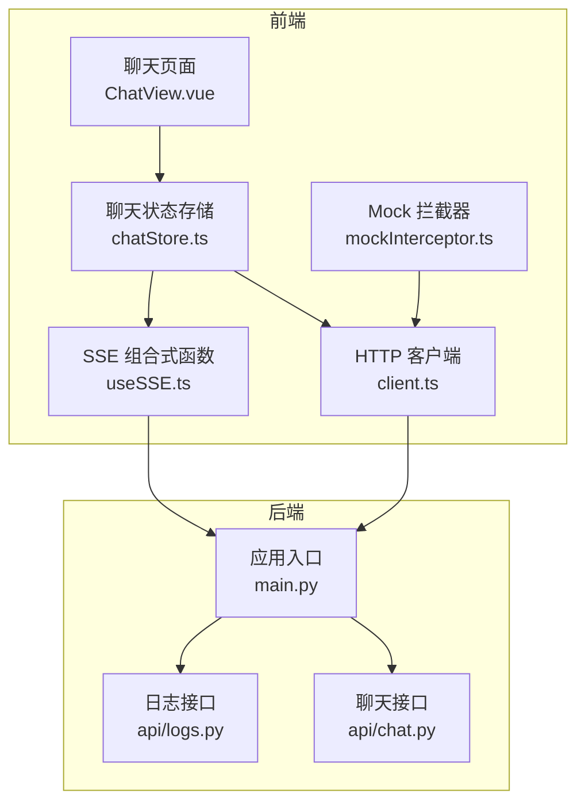
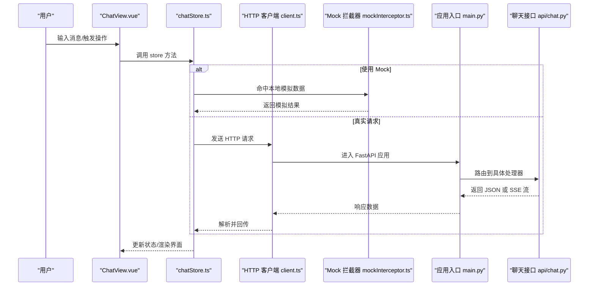
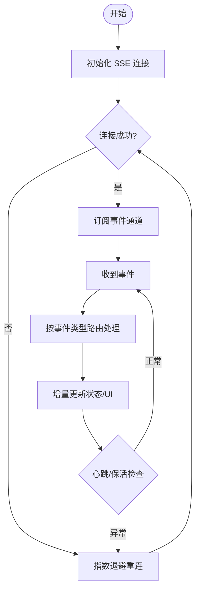
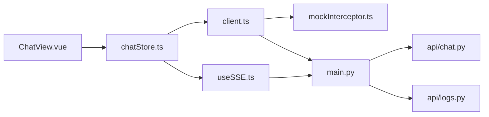

# 数据传输与通信

<cite>
**本文引用的文件**   
- [frontend/src/api/client.ts](file://frontend/src/api/client.ts)
- [frontend/src/composables/useSSE.ts](file://frontend/src/composables/useSSE.ts)
- [frontend/src/types/sse.ts](file://frontend/src/types/sse.ts)
- [frontend/src/api/mockInterceptor.ts](file://frontend/src/api/mockInterceptor.ts)
- [src/loopse/main.py](file://src/loopse/main.py)
- [src/loopse/api/chat.py](file://src/loopse/api/chat.py)
- [src/loopse/api/logs.py](file://src/loopse/api/logs.py)
- [frontend/src/stores/chatStore.ts](file://frontend/src/stores/chatStore.ts)
- [frontend/src/views/ChatView.vue](file://frontend/src/views/ChatView.vue)
</cite>

## 目录
1. [简介](#简介)
2. [项目结构](#项目结构)
3. [核心组件](#核心组件)
4. [架构总览](#架构总览)
5. [详细组件分析](#详细组件分析)
6. [依赖分析](#依赖分析)
7. [性能考虑](#性能考虑)
8. [故障排查指南](#故障排查指南)
9. [结论](#结论)
10. [附录](#附录)

## 简介
本文件聚焦于前后端的数据传输与通信实现，覆盖以下主题：
- 前后端数据交换格式、序列化协议与压缩策略
- 实时通信机制（SSE/WebSocket）的连接管理、消息路由与断线重连
- 跨域资源共享（CORS）、安全传输与加密通信方案
- 数据缓存策略、离线同步与增量更新机制
- 网络请求拦截、错误重试与性能监控的实现要点

## 项目结构
本项目采用前后端分离架构。前端基于 Vue 3 + TypeScript，后端基于 Python（FastAPI）。关键通信相关位置如下：
- 前端 HTTP 客户端与拦截器：frontend/src/api/client.ts、frontend/src/api/mockInterceptor.ts
- 前端 SSE 能力封装：frontend/src/composables/useSSE.ts、frontend/src/types/sse.ts
- 前端状态管理与视图集成：frontend/src/stores/chatStore.ts、frontend/src/views/ChatView.vue
- 后端主应用入口与 API 路由：src/loopse/main.py、src/loopse/api/chat.py、src/loopse/api/logs.py

图表来源
- [frontend/src/api/client.ts](file://frontend/src/api/client.ts)
- [frontend/src/composables/useSSE.ts](file://frontend/src/composables/useSSE.ts)
- [frontend/src/stores/chatStore.ts](file://frontend/src/stores/chatStore.ts)
- [frontend/src/views/ChatView.vue](file://frontend/src/views/ChatView.vue)
- [frontend/src/api/mockInterceptor.ts](file://frontend/src/api/mockInterceptor.ts)
- [src/loopse/main.py](file://src/loopse/main.py)
- [src/loopse/api/chat.py](file://src/loopse/api/chat.py)
- [src/loopse/api/logs.py](file://src/loopse/api/logs.py)

章节来源
- [frontend/src/api/client.ts](file://frontend/src/api/client.ts)
- [frontend/src/composables/useSSE.ts](file://frontend/src/composables/useSSE.ts)
- [frontend/src/types/sse.ts](file://frontend/src/types/sse.ts)
- [frontend/src/api/mockInterceptor.ts](file://frontend/src/api/mockInterceptor.ts)
- [src/loopse/main.py](file://src/loopse/main.py)
- [src/loopse/api/chat.py](file://src/loopse/api/chat.py)
- [src/loopse/api/logs.py](file://src/loopse/api/logs.py)

## 核心组件
- 统一 HTTP 客户端
  - 负责基础请求配置、通用头注入、响应/请求拦截、错误处理与重试策略等。
  - 通过拦截器可接入 Mock 数据或本地缓存层，便于开发与调试。
- SSE 流式通信
  - 提供连接建立、事件订阅、自动重连、心跳保活与错误恢复等能力。
  - 类型定义集中管理，确保前后端事件契约一致。
- 状态与视图集成
  - 将 SSE 事件与聊天消息状态进行整合，驱动 UI 渲染与用户交互。
- 后端 API 路由
  - 暴露 REST 接口与 SSE 流式接口，承载业务逻辑与数据返回。

章节来源
- [frontend/src/api/client.ts](file://frontend/src/api/client.ts)
- [frontend/src/composables/useSSE.ts](file://frontend/src/composables/useSSE.ts)
- [frontend/src/types/sse.ts](file://frontend/src/types/sse.ts)
- [frontend/src/stores/chatStore.ts](file://frontend/src/stores/chatStore.ts)
- [frontend/src/views/ChatView.vue](file://frontend/src/views/ChatView.vue)
- [src/loopse/api/chat.py](file://src/loopse/api/chat.py)
- [src/loopse/api/logs.py](file://src/loopse/api/logs.py)

## 架构总览
下图展示了从前端发起请求到后端处理并返回数据的整体流程，包括 REST 与 SSE 两种通道。

图表来源
- [frontend/src/views/ChatView.vue](file://frontend/src/views/ChatView.vue)
- [frontend/src/stores/chatStore.ts](file://frontend/src/stores/chatStore.ts)
- [frontend/src/api/client.ts](file://frontend/src/api/client.ts)
- [frontend/src/api/mockInterceptor.ts](file://frontend/src/api/mockInterceptor.ts)
- [src/loopse/main.py](file://src/loopse/main.py)
- [src/loopse/api/chat.py](file://src/loopse/api/chat.py)

## 详细组件分析

### 统一 HTTP 客户端与拦截器
- 职责
  - 封装基础 URL、超时、重试、错误码映射、鉴权头等通用逻辑。
  - 通过拦截器支持 Mock 数据注入、请求/响应日志、性能埋点与错误上报。
- 关键点
  - 请求拦截：统一附加会话令牌、追踪 ID、语言偏好等。
  - 响应拦截：统一处理成功/失败分支，标准化错误对象，触发重试或降级。
  - Mock 拦截：在开发环境优先走本地模拟数据，提升联调效率。
- 建议
  - 为不同业务域设置独立重试策略与退避算法。
  - 对大体积响应启用 gzip 压缩，并在客户端正确解码。

章节来源
- [frontend/src/api/client.ts](file://frontend/src/api/client.ts)
- [frontend/src/api/mockInterceptor.ts](file://frontend/src/api/mockInterceptor.ts)

### SSE 实时通信（Server-Sent Events）
- 职责
  - 管理 SSE 连接生命周期：建立、保活、重连、关闭。
  - 事件分发：按事件类型路由到对应处理器，合并增量更新。
  - 错误恢复：网络抖动、服务端重启等场景下的自动重连与幂等恢复。
- 类型契约
  - 通过集中类型定义约束事件结构与字段语义，降低前后端耦合风险。
- 典型流程
  - 初始化连接 -> 订阅事件 -> 接收增量数据 -> 更新状态 -> 异常时指数退避重连。

图表来源
- [frontend/src/composables/useSSE.ts](file://frontend/src/composables/useSSE.ts)
- [frontend/src/types/sse.ts](file://frontend/src/types/sse.ts)

章节来源
- [frontend/src/composables/useSSE.ts](file://frontend/src/composables/useSSE.ts)
- [frontend/src/types/sse.ts](file://frontend/src/types/sse.ts)

### 状态管理与视图集成
- 职责
  - 将 SSE 事件与聊天消息集合进行合并，维护去重、排序与分页。
  - 向视图层暴露稳定的读写接口，屏蔽底层通信细节。
- 关键点
  - 增量更新：仅对新增/变更消息做最小化更新，避免全量刷新。
  - 乐观更新：先渲染用户输入，再根据服务器确认修正。
  - 错误边界：在网络异常或服务端错误时展示友好提示并提供重试入口。

章节来源
- [frontend/src/stores/chatStore.ts](file://frontend/src/stores/chatStore.ts)
- [frontend/src/views/ChatView.vue](file://frontend/src/views/ChatView.vue)

### 后端 API 与 SSE 服务
- 职责
  - 暴露 REST 接口用于常规数据获取与提交。
  - 提供 SSE 接口以推送实时事件流，如对话增量、诊断进度等。
- 关键点
  - 路由组织：按领域划分控制器，保持高内聚低耦合。
  - 流式输出：针对长耗时任务采用流式响应，减少首字节延迟。
  - 日志与可观测性：记录关键请求与事件，便于问题定位。

章节来源
- [src/loopse/main.py](file://src/loopse/main.py)
- [src/loopse/api/chat.py](file://src/loopse/api/chat.py)
- [src/loopse/api/logs.py](file://src/loopse/api/logs.py)

## 依赖分析
- 前端内部依赖
  - ChatView.vue 依赖 chatStore.ts；chatStore.ts 依赖 HTTP 客户端与 SSE 组合式函数。
  - HTTP 客户端可被多个模块复用，并通过拦截器扩展功能。
- 前后端耦合点
  - REST 接口路径与参数契约。
  - SSE 事件名与载荷结构。
- 外部依赖
  - 浏览器原生 Fetch/SSE API。
  - 后端框架提供的路由与中间件能力。

图表来源
- [frontend/src/views/ChatView.vue](file://frontend/src/views/ChatView.vue)
- [frontend/src/stores/chatStore.ts](file://frontend/src/stores/chatStore.ts)
- [frontend/src/api/client.ts](file://frontend/src/api/client.ts)
- [frontend/src/composables/useSSE.ts](file://frontend/src/composables/useSSE.ts)
- [frontend/src/api/mockInterceptor.ts](file://frontend/src/api/mockInterceptor.ts)
- [src/loopse/main.py](file://src/loopse/main.py)
- [src/loopse/api/chat.py](file://src/loopse/api/chat.py)
- [src/loopse/api/logs.py](file://src/loopse/api/logs.py)

章节来源
- [frontend/src/views/ChatView.vue](file://frontend/src/views/ChatView.vue)
- [frontend/src/stores/chatStore.ts](file://frontend/src/stores/chatStore.ts)
- [frontend/src/api/client.ts](file://frontend/src/api/client.ts)
- [frontend/src/composables/useSSE.ts](file://frontend/src/composables/useSSE.ts)
- [frontend/src/api/mockInterceptor.ts](file://frontend/src/api/mockInterceptor.ts)
- [src/loopse/main.py](file://src/loopse/main.py)
- [src/loopse/api/chat.py](file://src/loopse/api/chat.py)
- [src/loopse/api/logs.py](file://src/loopse/api/logs.py)

## 性能考虑
- 传输优化
  - 启用 gzip/br 压缩，合理设置 Content-Encoding。
  - 对大对象进行分片与增量传输，避免一次性加载过多数据。
- 请求控制
  - 请求去抖与节流，避免重复触发。
  - 合理的超时与重试策略，结合指数退避与熔断。
- 渲染优化
  - 列表虚拟滚动、增量更新与局部重绘。
  - 图片与媒体资源懒加载与按需加载。
- 可观测性
  - 采集关键指标：首字节时间、TTFB、端到端耗时、错误率与重连次数。
  - 结合 TraceID 串联前后端链路，快速定位瓶颈。

[本节为通用指导，不直接分析具体文件]

## 故障排查指南
- 常见问题
  - 跨域错误：检查 CORS 配置与预检请求是否放行必要方法与头。
  - SSE 频繁重连：检查心跳间隔、服务端稳定性与网络质量。
  - 数据不一致：核对增量更新逻辑的幂等性与去重键。
- 定位手段
  - 开启请求与事件日志，结合 TraceID 追踪。
  - 使用浏览器开发者工具观察 Network 与 Console 面板。
  - 在后端日志中检索错误堆栈与慢查询。
- 恢复策略
  - 提供手动重试与“拉取最新”按钮。
  - 对关键操作增加二次确认与撤销能力。

章节来源
- [frontend/src/api/client.ts](file://frontend/src/api/client.ts)
- [frontend/src/composables/useSSE.ts](file://frontend/src/composables/useSSE.ts)
- [frontend/src/stores/chatStore.ts](file://frontend/src/stores/chatStore.ts)
- [src/loopse/api/logs.py](file://src/loopse/api/logs.py)

## 结论
本项目在前端侧通过统一的 HTTP 客户端与 SSE 组合式函数实现了稳定可靠的数据传输与实时通信；在后端侧通过清晰的路由组织与流式输出支撑了高性能的交互体验。建议在后续迭代中进一步完善 CORS 与安全策略、完善压缩与缓存策略，并加强可观测性与自动化测试，以提升系统的健壮性与可维护性。

[本节为总结性内容，不直接分析具体文件]

## 附录

### 数据交换格式与序列化协议
- 推荐格式
  - 文本与结构化数据使用 JSON。
  - 二进制数据（图片、音频、视频）使用 Base64 或分块上传。
- 版本化
  - 在请求头或路径中包含 API 版本，便于平滑演进。
- 校验
  - 前后端均进行入参校验与出参规范化，避免脏数据传播。

[本节为通用指导，不直接分析具体文件]

### 压缩策略
- 传输层
  - 启用 gzip/br 压缩，针对静态资源与大型 JSON 响应。
- 应用层
  - 对高频小消息进行字段精简与字典编码。
  - 对长列表采用分页与游标方式传输。

[本节为通用指导，不直接分析具体文件]

### 实时通信机制（SSE/WebSocket）
- SSE 适用场景
  - 单向推送、简单事件模型、易于调试与缓存。
- WebSocket 适用场景
  - 双向通信、复杂交互、需要精细控制连接与帧级别的消息。
- 连接管理
  - 统一连接池、心跳保活、优雅关闭与资源释放。
- 消息路由
  - 基于事件类型或频道进行路由，支持多路复用。
- 断线重连
  - 指数退避、最大重试次数、幂等恢复与状态同步。

[本节为通用指导，不直接分析具体文件]

### 跨域资源共享（CORS）与安全传输
- CORS 配置
  - 明确允许的源、方法与头，严格限制生产环境的白名单。
- 安全传输
  - 全站 HTTPS，启用 HSTS，禁用不安全混合内容。
- 认证与授权
  - 使用短期令牌与刷新令牌机制，敏感操作二次验证。
- 加密通信
  - 传输层 TLS 加密，必要时对敏感字段进行应用层加密。

[本节为通用指导，不直接分析具体文件]

### 数据缓存、离线同步与增量更新
- 缓存策略
  - 内存缓存（短期热点）、持久化缓存（长期可用）、CDN 缓存（静态资源）。
- 离线同步
  - 本地队列与冲突解决策略，网络恢复后自动同步。
- 增量更新
  - 基于版本号或时间戳的增量拉取，减少带宽与计算开销。

[本节为通用指导，不直接分析具体文件]

### 网络请求拦截、错误重试与性能监控
- 拦截器
  - 统一注入鉴权头、追踪 ID、语言与设备信息。
  - 统一记录请求/响应日志与错误上下文。
- 错误重试
  - 针对幂等请求实施重试，非幂等请求谨慎处理。
  - 结合熔断与降级，保护系统稳定性。
- 性能监控
  - 采集端到端耗时、成功率、错误分布与资源占用。
  - 结合分布式追踪与告警规则，快速发现与定位问题。

[本节为通用指导，不直接分析具体文件]