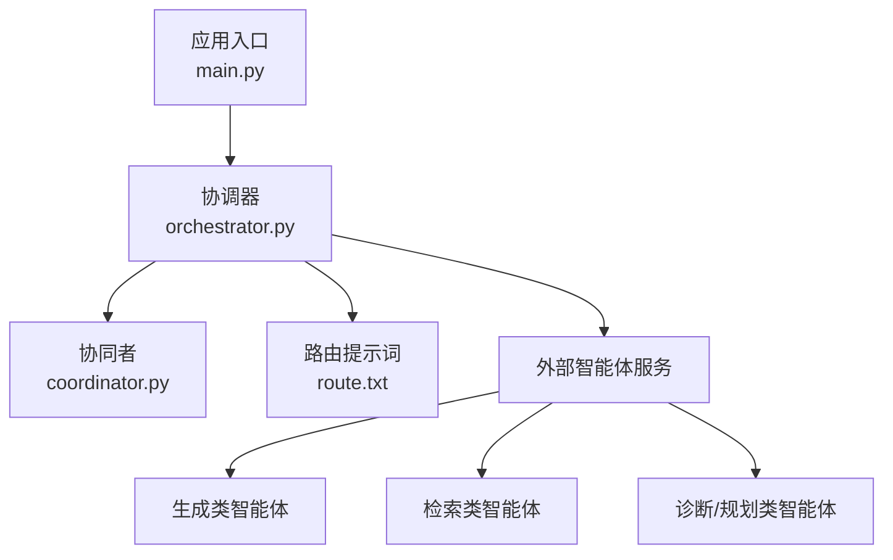
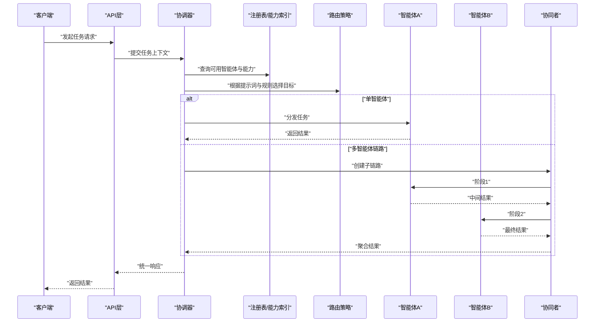
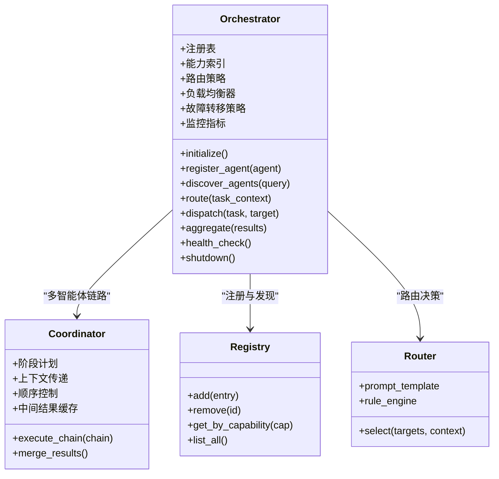
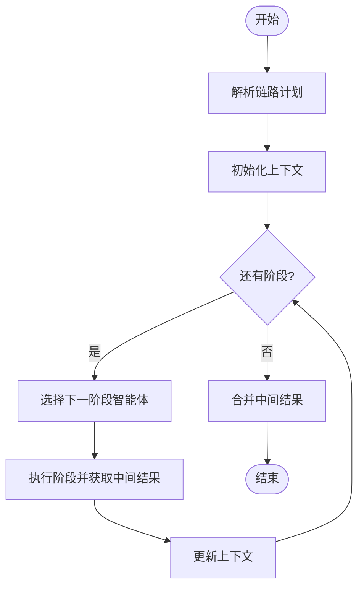
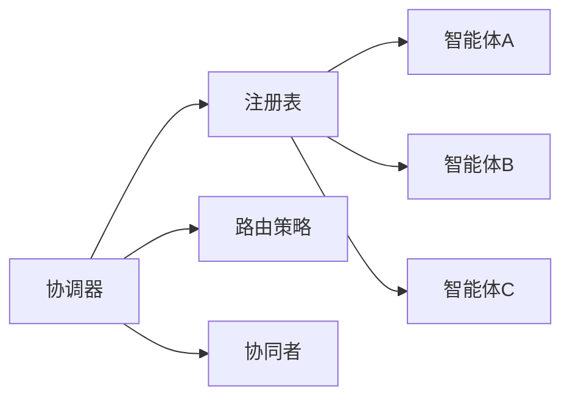

# 协调器(Orchestrator)设计

<cite>
**本文引用的文件**   
- [src/loopse/agent/orchestrator.py](file://src/loopse/agent/orchestrator.py)
- [src/loopse/agent/coordinator.py](file://src/loopse/agent/coordinator.py)
- [config/prompts/orchestrator/route.txt](file://config/prompts/orchestrator/route.txt)
- [src/loopse/main.py](file://src/loopse/main.py)
- [tests/unit/test_orchestrator_integration.py](file://tests/unit/test_orchestrator_integration.py)
</cite>

## 目录
1. [简介](#简介)
2. [项目结构](#项目结构)
3. [核心组件](#核心组件)
4. [架构总览](#架构总览)
5. [详细组件分析](#详细组件分析)
6. [依赖分析](#依赖分析)
7. [性能考虑](#性能考虑)
8. [故障排查指南](#故障排查指南)
9. [结论](#结论)
10. [附录](#附录)

## 简介
本文件聚焦于协调器（Orchestrator）的设计与实现，系统阐述其核心职责、路由算法、任务分发机制、智能体注册与发现流程、动态加载与生命周期管理、消息路由策略、负载均衡与故障转移机制。同时提供配置项说明、监控指标建议与性能调优参数，并给出扩展开发指南，帮助开发者快速添加新智能体与自定义路由规则。

## 项目结构
围绕协调器的关键代码与资源分布如下：
- 协调器实现：src/loopse/agent/orchestrator.py
- 协同者（Coordinator）：src/loopse/agent/coordinator.py
- 编排提示词：config/prompts/orchestrator/route.txt
- 应用入口：src/loopse/main.py
- 集成测试：tests/unit/test_orchestrator_integration.py

图表来源
- [src/loopse/main.py](file://src/loopse/main.py)
- [src/loopse/agent/orchestrator.py](file://src/loopse/agent/orchestrator.py)
- [src/loopse/agent/coordinator.py](file://src/loopse/agent/coordinator.py)
- [config/prompts/orchestrator/route.txt](file://config/prompts/orchestrator/route.txt)

章节来源
- [src/loopse/agent/orchestrator.py](file://src/loopse/agent/orchestrator.py)
- [src/loopse/agent/coordinator.py](file://src/loopse/agent/coordinator.py)
- [config/prompts/orchestrator/route.txt](file://config/prompts/orchestrator/route.txt)
- [src/loopse/main.py](file://src/loopse/main.py)
- [tests/unit/test_orchestrator_integration.py](file://tests/unit/test_orchestrator_integration.py)

## 核心组件
- 协调器（Orchestrator）
  - 负责接收上层请求，解析意图，选择目标智能体或智能体链，执行任务分发与结果聚合。
  - 维护智能体注册表与能力索引，支持动态加载与热更新。
  - 实现路由策略（基于提示词与规则），并提供负载均衡与故障转移。
- 协同者（Coordinator）
  - 作为协调器的内部协作层，负责多智能体间的状态同步、上下文传递与顺序控制。
  - 在复杂链路中充当“子协调器”，将长链路拆分为可管理的阶段。
- 路由提示词（route.txt）
  - 定义用于意图识别与路由决策的提示模板，驱动LLM进行智能体选择。

章节来源
- [src/loopse/agent/orchestrator.py](file://src/loopse/agent/orchestrator.py)
- [src/loopse/agent/coordinator.py](file://src/loopse/agent/coordinator.py)
- [config/prompts/orchestrator/route.txt](file://config/prompts/orchestrator/route.txt)

## 架构总览
协调器处于系统中枢位置，向上承接API与服务调用，向下调度各类智能体；通过注册表与能力索引完成智能体发现，结合路由策略与负载策略进行任务分发，并在异常时执行故障转移。

图表来源
- [src/loopse/agent/orchestrator.py](file://src/loopse/agent/orchestrator.py)
- [src/loopse/agent/coordinator.py](file://src/loopse/agent/coordinator.py)
- [config/prompts/orchestrator/route.txt](file://config/prompts/orchestrator/route.txt)

## 详细组件分析

### 协调器（Orchestrator）
- 核心职责
  - 任务解析与上下文构建：从请求中提取意图、约束与必要数据。
  - 智能体注册与发现：维护注册表与能力索引，支持动态加载。
  - 路由与分发：基于提示词与规则选择目标智能体或链路。
  - 结果聚合与标准化：对多智能体输出进行合并与格式化。
  - 监控与度量：记录关键指标（延迟、吞吐、错误率等）。
- 路由算法
  - 提示词驱动：使用 route.txt 中的模板进行意图识别与候选集筛选。
  - 规则增强：结合能力索引与权重策略进行二次排序。
  - 可选确定性路径：针对高频场景提供硬编码路由以优化性能。
- 任务分发机制
  - 单智能体：直接调用目标实例。
  - 多智能体：通过协同者组织阶段化执行，传递上下文与中间结果。
- 负载均衡
  - 基于健康度与队列长度的加权选择。
  - 支持按能力维度分片（如检索、生成、诊断）。
- 故障转移
  - 超时重试与降级到备用智能体。
  - 熔断与隔离：对不稳定智能体进行临时屏蔽。
- 生命周期管理
  - 启动：初始化注册表、加载提示词、预热缓存。
  - 运行：处理请求、维护健康检查与指标上报。
  - 关闭：优雅停止、释放资源、持久化状态。

图表来源
- [src/loopse/agent/orchestrator.py](file://src/loopse/agent/orchestrator.py)
- [src/loopse/agent/coordinator.py](file://src/loopse/agent/coordinator.py)

章节来源
- [src/loopse/agent/orchestrator.py](file://src/loopse/agent/orchestrator.py)
- [src/loopse/agent/coordinator.py](file://src/loopse/agent/coordinator.py)

### 协同者（Coordinator）
- 角色定位
  - 作为协调器的内部协作层，负责多智能体链路的编排与执行。
- 主要功能
  - 阶段划分：将复杂任务分解为若干阶段。
  - 上下文传递：在各阶段间安全地传递与更新上下文。
  - 顺序控制：确保阶段执行的先后关系与条件分支。
  - 中间结果缓存：避免重复计算，提升整体效率。
- 执行流程
  - 接收协调器下发的链路计划。
  - 依次调度各阶段智能体，收集中间结果。
  - 汇总后返回给协调器进行最终聚合。

图表来源
- [src/loopse/agent/coordinator.py](file://src/loopse/agent/coordinator.py)

章节来源
- [src/loopse/agent/coordinator.py](file://src/loopse/agent/coordinator.py)

### 路由提示词（route.txt）
- 作用
  - 提供意图识别与路由决策的提示模板，驱动LLM进行智能体选择。
- 使用方式
  - 协调器在路由阶段加载该模板，结合任务上下文生成提示。
  - LLM返回候选智能体列表或具体目标，供后续规则引擎与负载均衡进一步处理。
- 扩展建议
  - 新增能力类别时，同步更新模板以覆盖新的意图模式。
  - 引入Few-shot示例以提升分类稳定性。

章节来源
- [config/prompts/orchestrator/route.txt](file://config/prompts/orchestrator/route.txt)

### 应用入口（main.py）
- 职责
  - 初始化协调器与相关组件，启动服务监听，处理进程信号以实现优雅关闭。
- 关键点
  - 协调器生命周期钩子：启动时注册默认智能体，关闭时清理资源。
  - 健康检查端点暴露，便于外部探针探测。

章节来源
- [src/loopse/main.py](file://src/loopse/main.py)

### 集成测试（test_orchestrator_integration.py）
- 目的
  - 验证协调器端到端行为，包括注册、路由、分发与聚合。
- 关注点
  - 多智能体链路执行正确性。
  - 故障转移与降级路径。
  - 指标采集与日志输出。

章节来源
- [tests/unit/test_orchestrator_integration.py](file://tests/unit/test_orchestrator_integration.py)

## 依赖分析
协调器对外部智能体的依赖通过注册表与能力索引解耦，降低耦合度并提高可扩展性。

图表来源
- [src/loopse/agent/orchestrator.py](file://src/loopse/agent/orchestrator.py)
- [src/loopse/agent/coordinator.py](file://src/loopse/agent/coordinator.py)

章节来源
- [src/loopse/agent/orchestrator.py](file://src/loopse/agent/orchestrator.py)
- [src/loopse/agent/coordinator.py](file://src/loopse/agent/coordinator.py)

## 性能考虑
- 路由优化
  - 对高频意图启用确定性路由，减少LLM调用开销。
  - 缓存能力索引与路由结果，缩短查找时间。
- 并发与批处理
  - 合理设置并发度与队列长度，避免过载。
  - 对独立阶段采用并行执行，提升吞吐。
- 资源管理
  - 连接池与对象复用，减少创建销毁成本。
  - 内存与CPU配额限制，防止个别智能体占用过多资源。
- 监控与告警
  - 采集延迟、吞吐、错误率、队列深度等指标。
  - 设置阈值告警，及时发现问题。

[本节为通用指导，不直接分析具体文件]

## 故障排查指南
- 常见问题
  - 路由失败：检查提示词模板与能力索引是否匹配。
  - 智能体不可用：查看健康检查与熔断状态，确认网络与依赖。
  - 链路执行中断：检查协同者的阶段计划与上下文传递。
- 定位方法
  - 查看协调器与协同者的日志输出。
  - 使用集成测试复现问题，逐步缩小范围。
  - 检查指标面板，定位瓶颈与异常点。

章节来源
- [tests/unit/test_orchestrator_integration.py](file://tests/unit/test_orchestrator_integration.py)

## 结论
协调器作为系统的中枢，通过注册与发现、提示词驱动的路由、协同者编排以及负载均衡与故障转移，实现了高内聚、低耦合的智能体调度体系。配合完善的监控与性能调优策略，可在复杂业务场景中保持高可用与高性能。

[本节为总结性内容，不直接分析具体文件]

## 附录

### 配置选项
- 路由相关
  - 提示词模板路径：指向 route.txt 的位置。
  - 确定性路由开关：针对高频场景启用硬编码路由。
- 负载均衡
  - 健康检查间隔与超时。
  - 队列长度上限与背压策略。
- 故障转移
  - 重试次数与退避策略。
  - 熔断阈值与恢复窗口。
- 监控
  - 指标采集频率与导出格式。
  - 日志级别与采样率。

[本节为概念性说明，不直接分析具体文件]

### 监控指标
- 基础指标
  - 请求数、成功数、失败数、平均延迟、P95/P99延迟。
- 路由指标
  - 各智能体被选中的比例、提示词命中率。
- 链路指标
  - 阶段数量、阶段耗时分布、中间结果大小。
- 资源指标
  - CPU、内存、队列深度、连接池使用率。

[本节为概念性说明，不直接分析具体文件]

### 性能调优参数
- 并发度与线程池大小
- 队列长度与背压阈值
- 缓存命中率与过期策略
- I/O超时与重试退避参数

[本节为概念性说明，不直接分析具体文件]

### 扩展开发指南
- 添加新智能体
  - 实现标准接口（输入/输出契约）。
  - 在注册表中登记能力标签与健康检查端点。
  - 更新路由提示词以覆盖新意图。
- 自定义路由规则
  - 在路由策略中增加规则引擎分支。
  - 提供权重与优先级配置。
- 生命周期钩子
  - 在启动时完成初始化与预热。
  - 在关闭时释放资源与持久化状态。

[本节为概念性说明，不直接分析具体文件]