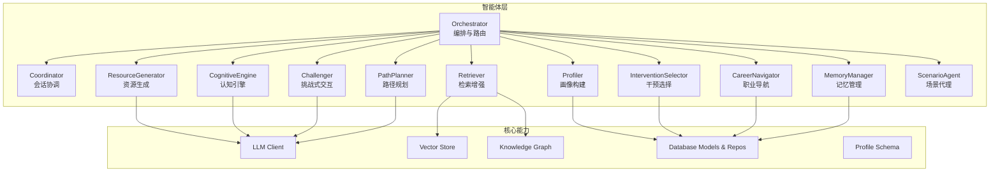
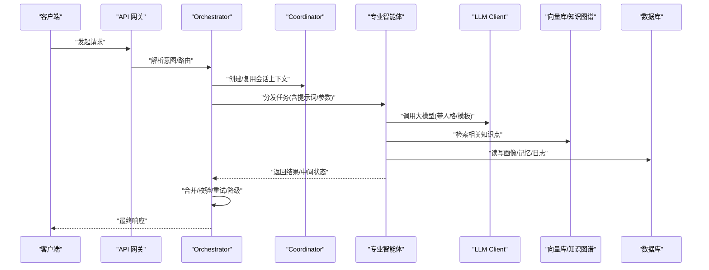
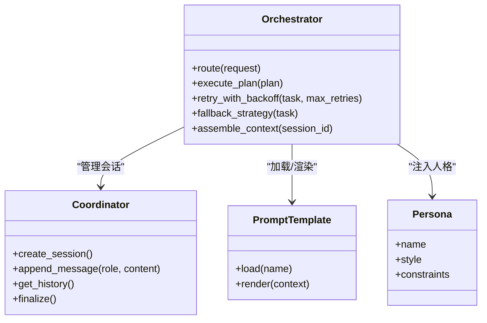
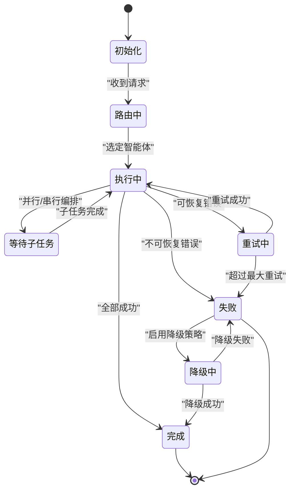
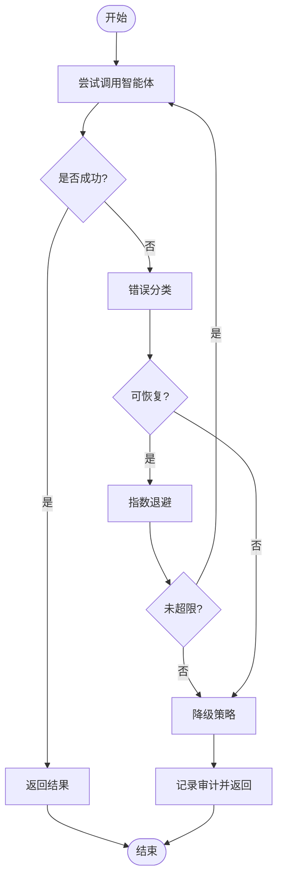
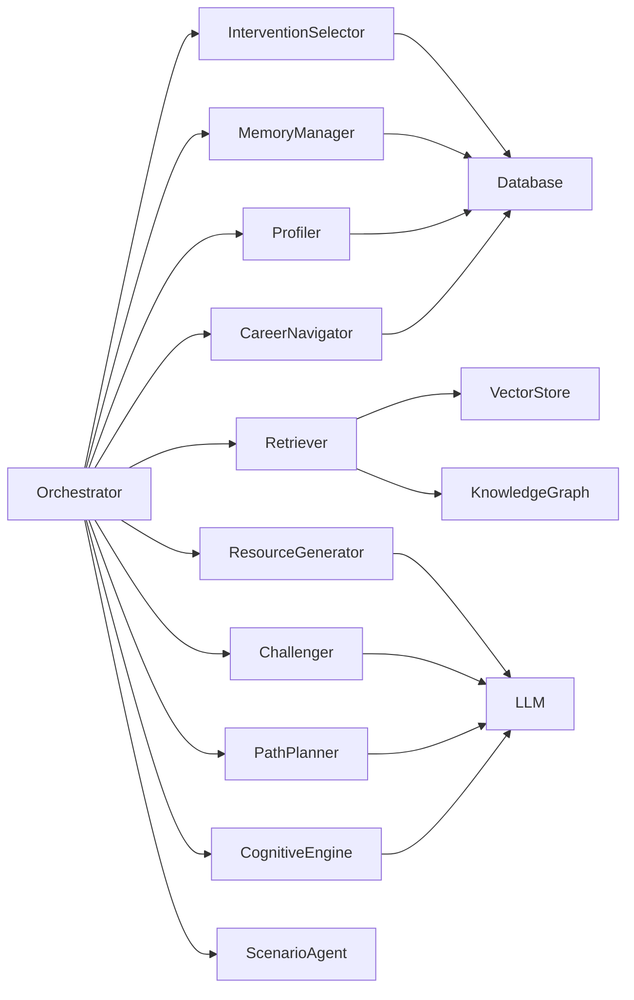

# 多智能体架构设计

<cite>
**本文引用的文件**   
- [src/loopse/agent/orchestrator.py](file://src/loopse/agent/orchestrator.py)
- [src/loopse/agent/coordinator.py](file://src/loopse/agent/coordinator.py)
- [src/loopse/agent/career_navigator.py](file://src/loopse/agent/career_navigator.py)
- [src/loopse/agent/challenger.py](file://src/loopse/agent/challenger.py)
- [src/loopse/agent/cognitive_engine.py](file://src/loopse/agent/cognitive_engine.py)
- [src/loopse/agent/intervention_selector.py](file://src/loopse/agent/intervention_selector.py)
- [src/loopse/agent/memory_manager.py](file://src/loopse/agent/memory_manager.py)
- [src/loopse/agent/path_planner.py](file://src/loopse/agent/path_planner.py)
- [src/loopse/agent/profiler.py](file://src/loopse/agent/profiler.py)
- [src/loopse/agent/resource_generator.py](file://src/loopse/agent/resource_generator.py)
- [src/loopse/agent/retriever.py](file://src/loopse/agent/retriever.py)
- [src/loopse/agent/scenario_agent.py](file://src/loopse/agent/scenario_agent.py)
- [config/agent_personas.json](file://config/agent_personas.json)
- [config/prompts/orchestrator/route.txt](file://config/prompts/orchestrator/route.txt)
- [config/prompts/path_planner/plan_path.txt](file://config/prompts/path_planner/plan_path.txt)
- [config/prompts/profiler/onboarding.txt](file://config/prompts/profiler/onboarding.txt)
- [config/prompts/profiler/update_profile.txt](file://config/prompts/profiler/update_profile.txt)
- [config/prompts/retriever/search_query.txt](file://config/prompts/retriever/search_query.txt)
- [config/prompts/retriever/query_expansion.txt](file://config/prompts/retriever/query_expansion.txt)
- [config/prompts/resource_generator/generate_code.txt](file://config/prompts/resource_generator/generate_code.txt)
- [config/prompts/resource_generator/generate_doc.txt](file://config/prompts/resource_generator/generate_doc.txt)
- [config/prompts/resource_generator/generate_exercise.txt](file://config/prompts/resource_generator/generate_exercise.txt)
- [config/prompts/resource_generator/generate_infographic.txt](file://config/prompts/resource_generator/generate_infographic.txt)
- [config/prompts/resource_generator/generate_script.txt](file://config/prompts/resource_generator/generate_script.txt)
- [config/prompts/trust/scope_check.txt](file://config/prompts/trust/scope_check.txt)
- [config/prompts/trust/source_citation.txt](file://config/prompts/trust/source_citation.txt)
- [config/api_schema.yaml](file://config/api_schema.yaml)
- [src/loopse/core/llm_client.py](file://src/loopse/core/llm_client.py)
- [src/loopse/kb/vector_store.py](file://src/loopse/kb/vector_store.py)
- [src/loopse/kb/knowledge_graph.py](file://src/loopse/kb/knowledge_graph.py)
- [src/loopse/db/models.py](file://src/loopse/db/models.py)
- [src/loopse/db/repositories.py](file://src/loopse/db/repositories.py)
- [src/loopse/schema/profile.py](file://src/loopse/schema/profile.py)
- [src/loopse/schema/student_profile_schema.py](file://src/loopse/schema/student_profile_schema.py)
- [src/loopse/prompt/__init__.py](file://src/loopse/prompt/__init__.py)
- [tests/unit/test_orchestrator_integration.py](file://tests/unit/test_orchestrator_integration.py)
</cite>

## 目录
1. [简介](#简介)
2. [项目结构](#项目结构)
3. [核心组件](#核心组件)
4. [架构总览](#架构总览)
5. [详细组件分析](#详细组件分析)
6. [依赖关系分析](#依赖关系分析)
7. [性能考量](#性能考量)
8. [故障排查指南](#故障排查指南)
9. [结论](#结论)
10. [附录](#附录)

## 简介
本文件面向开发者与架构师，系统化阐述多智能体架构的设计与实现。重点覆盖：
- Orchestrator（协调器）的编排模式、路由策略与全局状态管理
- 智能体间通信协议、消息结构与生命周期
- 专业智能体的职责划分、协作流程与错误处理/重试策略
- 配置系统、人格定义与扩展机制
- 智能体开发指南与最佳实践

## 项目结构
仓库采用分层与按功能域组织相结合的结构：
- agents: 领域智能体实现（Python）
- config: 提示词模板、人格定义、API 契约等配置
- src/loopse: 后端服务与核心能力（LLM 客户端、知识库、数据库、Schema、安全等）
- tests: 单元测试与集成测试
- docs: 架构与设计文档
- frontend: 前端应用（与本架构文档关联度较低）

图表来源
- [src/loopse/agent/orchestrator.py](file://src/loopse/agent/orchestrator.py)
- [src/loopse/agent/coordinator.py](file://src/loopse/agent/coordinator.py)
- [src/loopse/agent/profiler.py](file://src/loopse/agent/profiler.py)
- [src/loopse/agent/retriever.py](file://src/loopse/agent/retriever.py)
- [src/loopse/agent/resource_generator.py](file://src/loopse/agent/resource_generator.py)
- [src/loopse/agent/path_planner.py](file://src/loopse/agent/path_planner.py)
- [src/loopse/agent/challenger.py](file://src/loopse/agent/challenger.py)
- [src/loopse/agent/career_navigator.py](file://src/loopse/agent/career_navigator.py)
- [src/loopse/agent/cognitive_engine.py](file://src/loopse/agent/cognitive_engine.py)
- [src/loopse/agent/intervention_selector.py](file://src/loopse/agent/intervention_selector.py)
- [src/loopse/agent/memory_manager.py](file://src/loopse/agent/memory_manager.py)
- [src/loopse/agent/scenario_agent.py](file://src/loopse/agent/scenario_agent.py)
- [src/loopse/core/llm_client.py](file://src/loopse/core/llm_client.py)
- [src/loopse/kb/vector_store.py](file://src/loopse/kb/vector_store.py)
- [src/loopse/kb/knowledge_graph.py](file://src/loopse/kb/knowledge_graph.py)
- [src/loopse/db/models.py](file://src/loopse/db/models.py)
- [src/loopse/db/repositories.py](file://src/loopse/db/repositories.py)

章节来源
- [src/loopse/agent/orchestrator.py](file://src/loopse/agent/orchestrator.py)
- [src/loopse/agent/coordinator.py](file://src/loopse/agent/coordinator.py)
- [config/agent_personas.json](file://config/agent_personas.json)

## 核心组件
- Orchestrator（编排器）
  - 负责接收外部请求，解析意图，选择并调度专业智能体，维护会话级上下文与全局状态，协调重试与降级策略。
- Coordinator（会话协调器）
  - 管理单条对话的生命周期，聚合各智能体输出，保证顺序与一致性。
- 专业智能体
  - Profiler：用户画像构建与更新
  - Retriever：基于向量与知识图谱的检索增强
  - ResourceGenerator：代码、文档、练习、信息图、脚本等资源生成
  - PathPlanner：学习路径规划
  - Challenger：苏格拉底式提问与挑战
  - CareerNavigator：职业方向建议
  - CognitiveEngine：认知模型与学习阶段判断
  - InterventionSelector：教学干预策略选择
  - MemoryManager：长期/短期记忆存取
  - ScenarioAgent：场景化任务编排
- 核心能力
  - LLM Client：统一大模型调用封装
  - Vector Store / Knowledge Graph：检索与结构化知识
  - Database Models & Repos：持久化与数据访问
  - Profile Schema：学生画像数据结构规范

章节来源
- [src/loopse/agent/orchestrator.py](file://src/loopse/agent/orchestrator.py)
- [src/loopse/agent/coordinator.py](file://src/loopse/agent/coordinator.py)
- [src/loopse/agent/profiler.py](file://src/loopse/agent/profiler.py)
- [src/loopse/agent/retriever.py](file://src/loopse/agent/retriever.py)
- [src/loopse/agent/resource_generator.py](file://src/loopse/agent/resource_generator.py)
- [src/loopse/agent/path_planner.py](file://src/loopse/agent/path_planner.py)
- [src/loopse/agent/challenger.py](file://src/loopse/agent/challenger.py)
- [src/loopse/agent/career_navigator.py](file://src/loopse/agent/career_navigator.py)
- [src/loopse/agent/cognitive_engine.py](file://src/loopse/agent/cognitive_engine.py)
- [src/loopse/agent/intervention_selector.py](file://src/loopse/agent/intervention_selector.py)
- [src/loopse/agent/memory_manager.py](file://src/loopse/agent/memory_manager.py)
- [src/loopse/agent/scenario_agent.py](file://src/loopse/agent/scenario_agent.py)
- [src/loopse/core/llm_client.py](file://src/loopse/core/llm_client.py)
- [src/loopse/kb/vector_store.py](file://src/loopse/kb/vector_store.py)
- [src/loopse/kb/knowledge_graph.py](file://src/loopse/kb/knowledge_graph.py)
- [src/loopse/db/models.py](file://src/loopse/db/models.py)
- [src/loopse/db/repositories.py](file://src/loopse/db/repositories.py)
- [src/loopse/schema/profile.py](file://src/loopse/schema/profile.py)
- [src/loopse/schema/student_profile_schema.py](file://src/loopse/schema/student_profile_schema.py)

## 架构总览
下图展示从入口到智能体执行的关键调用链与数据流。

图表来源
- [src/loopse/agent/orchestrator.py](file://src/loopse/agent/orchestrator.py)
- [src/loopse/agent/coordinator.py](file://src/loopse/agent/coordinator.py)
- [src/loopse/core/llm_client.py](file://src/loopse/core/llm_client.py)
- [src/loopse/kb/vector_store.py](file://src/loopse/kb/vector_store.py)
- [src/loopse/kb/knowledge_graph.py](file://src/loopse/kb/knowledge_graph.py)
- [src/loopse/db/models.py](file://src/loopse/db/models.py)
- [src/loopse/db/repositories.py](file://src/loopse/db/repositories.py)

## 详细组件分析

### Orchestrator 协调器
- 设计模式
  - 命令/策略模式：根据意图选择不同智能体策略
  - 责任链：对输入进行预处理、权限/范围检查、提示词组装
  - 编排器：组合多个智能体步骤，控制并发与顺序
- 关键职责
  - 意图识别与路由
  - 会话上下文装配（用户画像、历史、当前目标）
  - 失败重试与降级（如回退到默认智能体或缓存结果）
  - 输出规范化与审计日志
- 与配置的关系
  - 使用提示词模板与人格定义驱动行为
  - 通过 API 契约约束输入输出结构

图表来源
- [src/loopse/agent/orchestrator.py](file://src/loopse/agent/orchestrator.py)
- [src/loopse/agent/coordinator.py](file://src/loopse/agent/coordinator.py)
- [config/agent_personas.json](file://config/agent_personas.json)
- [config/prompts/orchestrator/route.txt](file://config/prompts/orchestrator/route.txt)

章节来源
- [src/loopse/agent/orchestrator.py](file://src/loopse/agent/orchestrator.py)
- [config/prompts/orchestrator/route.txt](file://config/prompts/orchestrator/route.txt)
- [config/agent_personas.json](file://config/agent_personas.json)

### 智能体间通信协议与消息结构
- 消息类型
  - 路由请求：包含意图、上下文、目标智能体列表
  - 任务指令：具体操作、参数、约束
  - 结果反馈：结构化输出、置信度、引用来源
  - 事件通知：进度、错误、重试触发
- 传输格式
  - 统一 JSON 结构，遵循 API 契约
  - 字段包括：会话ID、时间戳、来源、目标、payload、traceId
- 可靠性
  - 幂等键避免重复执行
  - 超时与心跳检测
  - 死信队列记录失败消息以便人工介入

章节来源
- [config/api_schema.yaml](file://config/api_schema.yaml)

### 状态管理机制
- 会话状态
  - 由 Coordinator 维护消息历史、阶段标记、中间产物
- 用户画像状态
  - Profiler 负责增量更新，MemoryManager 提供持久化
- 全局状态
  - Orchestrator 在编排过程中维护计划状态机（待执行/执行中/完成/失败）

图表来源
- [src/loopse/agent/orchestrator.py](file://src/loopse/agent/orchestrator.py)
- [src/loopse/agent/coordinator.py](file://src/loopse/agent/coordinator.py)

### 专业智能体职责与协作流程

#### Profiler（画像构建）
- 职责：收集初始信息、持续更新画像维度（兴趣、水平、偏好）
- 输入：onboarding/update_profile 提示词模板
- 输出：标准化画像对象，写入数据库
- 协作：被 Orchestrator 在首次交互或画像漂移时触发

章节来源
- [src/loopse/agent/profiler.py](file://src/loopse/agent/profiler.py)
- [config/prompts/profiler/onboarding.txt](file://config/prompts/profiler/onboarding.txt)
- [config/prompts/profiler/update_profile.txt](file://config/prompts/profiler/update_profile.txt)
- [src/loopse/db/models.py](file://src/loopse/db/models.py)
- [src/loopse/db/repositories.py](file://src/loopse/db/repositories.py)
- [src/loopse/schema/profile.py](file://src/loopse/schema/profile.py)
- [src/loopse/schema/student_profile_schema.py](file://src/loopse/schema/student_profile_schema.py)

#### Retriever（检索增强）
- 职责：将用户问题转化为查询，结合向量库与知识图谱召回相关内容
- 输入：search_query/query_expansion 提示词模板
- 输出：相关片段、实体关系、评分
- 协作：为其他智能体提供事实依据，减少幻觉

章节来源
- [src/loopse/agent/retriever.py](file://src/loopse/agent/retriever.py)
- [config/prompts/retriever/search_query.txt](file://config/prompts/retriever/search_query.txt)
- [config/prompts/retriever/query_expansion.txt](file://config/prompts/retriever/query_expansion.txt)
- [src/loopse/kb/vector_store.py](file://src/loopse/kb/vector_store.py)
- [src/loopse/kb/knowledge_graph.py](file://src/loopse/kb/knowledge_graph.py)

#### ResourceGenerator（资源生成）
- 职责：根据需求生成代码、文档、练习、信息图、脚本等
- 输入：对应 generate_* 提示词模板
- 输出：结构化资源对象（含元数据、版本、引用）
- 协作：受 Trust 模块约束，确保来源可追溯

章节来源
- [src/loopse/agent/resource_generator.py](file://src/loopse/agent/resource_generator.py)
- [config/prompts/resource_generator/generate_code.txt](file://config/prompts/resource_generator/generate_code.txt)
- [config/prompts/resource_generator/generate_doc.txt](file://config/prompts/resource_generator/generate_doc.txt)
- [config/prompts/resource_generator/generate_exercise.txt](file://config/prompts/resource_generator/generate_exercise.txt)
- [config/prompts/resource_generator/generate_infographic.txt](file://config/prompts/resource_generator/generate_infographic.txt)
- [config/prompts/resource_generator/generate_script.txt](file://config/prompts/resource_generator/generate_script.txt)
- [config/prompts/trust/source_citation.txt](file://config/prompts/trust/source_citation.txt)

#### PathPlanner（路径规划）
- 职责：基于画像与目标生成学习路径，动态调整
- 输入：plan_path 提示词模板
- 输出：节点序列、前置条件、评估指标
- 协作：与 Profiler、CognitiveEngine 联动

章节来源
- [src/loopse/agent/path_planner.py](file://src/loopse/agent/path_planner.py)
- [config/prompts/path_planner/plan_path.txt](file://config/prompts/path_planner/plan_path.txt)
- [src/loopse/agent/profiler.py](file://src/loopse/agent/profiler.py)
- [src/loopse/agent/cognitive_engine.py](file://src/loopse/agent/cognitive_engine.py)

#### Challenger（挑战式交互）
- 职责：通过追问、反例、对比等方式促进深度理解
- 输入：人格与约束（来自 agent_personas.json）
- 输出：引导性问题、反馈、下一步建议
- 协作：与 Retriever 配合确保问题有据可依

章节来源
- [src/loopse/agent/challenger.py](file://src/loopse/agent/challenger.py)
- [config/agent_personas.json](file://config/agent_personas.json)
- [src/loopse/agent/retriever.py](file://src/loopse/agent/retriever.py)

#### CareerNavigator（职业导航）
- 职责：结合行业趋势与个人画像给出发展方向
- 输入：数据库中的岗位/技能映射
- 输出：路径建议、所需能力清单、学习资源推荐

章节来源
- [src/loopse/agent/career_navigator.py](file://src/loopse/agent/career_navigator.py)
- [src/loopse/db/models.py](file://src/loopse/db/models.py)

#### CognitiveEngine（认知引擎）
- 职责：评估学习者认知阶段、掌握度与误区
- 输入：交互历史、测评结果、画像
- 输出：认知标签、干预建议

章节来源
- [src/loopse/agent/cognitive_engine.py](file://src/loopse/agent/cognitive_engine.py)
- [src/loopse/agent/intervention_selector.py](file://src/loopse/agent/intervention_selector.py)

#### InterventionSelector（干预选择）
- 职责：根据认知状态选择合适教学干预（讲解、练习、可视化等）
- 输入：认知标签、画像、可用资源
- 输出：干预方案与执行计划

章节来源
- [src/loopse/agent/intervention_selector.py](file://src/loopse/agent/intervention_selector.py)
- [src/loopse/agent/resource_generator.py](file://src/loopse/agent/resource_generator.py)

#### MemoryManager（记忆管理）
- 职责：维护短期工作记忆与长期记忆，支持检索与压缩
- 输入：会话片段、关键事实、摘要
- 输出：记忆索引、检索结果

章节来源
- [src/loopse/agent/memory_manager.py](file://src/loopse/agent/memory_manager.py)
- [src/loopse/db/models.py](file://src/loopse/db/models.py)

#### ScenarioAgent（场景代理）
- 职责：编排真实场景任务，串联多个智能体协同完成
- 输入：场景描述、约束、评估标准
- 输出：任务步骤、角色分配、验收结果

章节来源
- [src/loopse/agent/scenario_agent.py](file://src/loopse/agent/scenario_agent.py)

### 错误处理与重试策略
- 分类
  - 可恢复错误：网络抖动、限流、临时性超时
  - 不可恢复错误：参数非法、权限不足、数据缺失
- 策略
  - 指数退避重试，限制最大次数
  - 熔断与降级：当连续失败达到阈值，切换备用策略或返回缓存
  - 幂等与去重：基于 traceId 与幂等键避免重复执行
  - 审计与追踪：记录完整链路便于定位

图表来源
- [src/loopse/agent/orchestrator.py](file://src/loopse/agent/orchestrator.py)

章节来源
- [src/loopse/agent/orchestrator.py](file://src/loopse/agent/orchestrator.py)

### 配置系统、人格定义与扩展机制
- 配置项
  - 提示词模板：按智能体与任务拆分，集中管理
  - 人格定义：风格、约束、语气、边界
  - API 契约：输入输出结构、枚举值、必填字段
- 扩展点
  - 新增智能体：注册路由规则、实现接口、提供提示词与人格
  - 新增资源类型：在 ResourceGenerator 中扩展生成器与校验器
  - 新增检索源：接入新的向量库或图谱存储
- 变更治理
  - 版本化提示词与人格
  - 回归测试覆盖关键路径

章节来源
- [config/agent_personas.json](file://config/agent_personas.json)
- [config/prompts/orchestrator/route.txt](file://config/prompts/orchestrator/route.txt)
- [config/prompts/path_planner/plan_path.txt](file://config/prompts/path_planner/plan_path.txt)
- [config/prompts/profiler/onboarding.txt](file://config/prompts/profiler/onboarding.txt)
- [config/prompts/profiler/update_profile.txt](file://config/prompts/profiler/update_profile.txt)
- [config/prompts/retriever/search_query.txt](file://config/prompts/retriever/search_query.txt)
- [config/prompts/retriever/query_expansion.txt](file://config/prompts/retriever/query_expansion.txt)
- [config/prompts/resource_generator/generate_code.txt](file://config/prompts/resource_generator/generate_code.txt)
- [config/prompts/resource_generator/generate_doc.txt](file://config/prompts/resource_generator/generate_doc.txt)
- [config/prompts/resource_generator/generate_exercise.txt](file://config/prompts/resource_generator/generate_exercise.txt)
- [config/prompts/resource_generator/generate_infographic.txt](file://config/prompts/resource_generator/generate_infographic.txt)
- [config/prompts/resource_generator/generate_script.txt](file://config/prompts/resource_generator/generate_script.txt)
- [config/prompts/trust/scope_check.txt](file://config/prompts/trust/scope_check.txt)
- [config/prompts/trust/source_citation.txt](file://config/prompts/trust/source_citation.txt)
- [config/api_schema.yaml](file://config/api_schema.yaml)

### 智能体生命周期管理
- 启动阶段：加载人格与提示词，初始化连接（LLM、向量库、数据库）
- 运行阶段：接收任务、执行、产出结果、上报状态
- 健康检查：心跳、依赖可用性探测
- 优雅关闭：保存中间状态、释放资源、记录收尾日志

章节来源
- [src/loopse/agent/orchestrator.py](file://src/loopse/agent/orchestrator.py)
- [src/loopse/core/llm_client.py](file://src/loopse/core/llm_client.py)
- [src/loopse/kb/vector_store.py](file://src/loopse/kb/vector_store.py)
- [src/loopse/db/models.py](file://src/loopse/db/models.py)

### 智能体开发指南与最佳实践
- 开发步骤
  - 定义接口与消息结构（遵循 API 契约）
  - 编写提示词模板与人格定义
  - 实现业务逻辑与错误处理
  - 接入记忆与检索能力
  - 编写单元测试与集成测试
- 最佳实践
  - 单一职责：每个智能体聚焦一个明确目标
  - 幂等设计：支持重试不产生副作用
  - 可观测性：埋点、日志、追踪 ID
  - 可配置化：通过配置开关行为，避免硬编码
  - 安全与合规：范围检查、来源引用、隐私保护

章节来源
- [config/api_schema.yaml](file://config/api_schema.yaml)
- [config/agent_personas.json](file://config/agent_personas.json)
- [src/loopse/prompt/__init__.py](file://src/loopse/prompt/__init__.py)

## 依赖关系分析
- 组件耦合
  - Orchestrator 与所有专业智能体存在松耦合依赖（通过接口与消息）
  - 智能体普遍依赖 LLM Client、Vector Store、Knowledge Graph、Database
- 外部依赖
  - LLM 服务、向量数据库、图数据库、关系型数据库
- 潜在循环依赖
  - 应避免智能体之间直接互相导入，改用消息或事件总线

图表来源
- [src/loopse/agent/orchestrator.py](file://src/loopse/agent/orchestrator.py)
- [src/loopse/agent/retriever.py](file://src/loopse/agent/retriever.py)
- [src/loopse/agent/resource_generator.py](file://src/loopse/agent/resource_generator.py)
- [src/loopse/agent/challenger.py](file://src/loopse/agent/challenger.py)
- [src/loopse/agent/path_planner.py](file://src/loopse/agent/path_planner.py)
- [src/loopse/agent/cognitive_engine.py](file://src/loopse/agent/cognitive_engine.py)
- [src/loopse/agent/intervention_selector.py](file://src/loopse/agent/intervention_selector.py)
- [src/loopse/agent/memory_manager.py](file://src/loopse/agent/memory_manager.py)
- [src/loopse/agent/profiler.py](file://src/loopse/agent/profiler.py)
- [src/loopse/agent/career_navigator.py](file://src/loopse/agent/career_navigator.py)
- [src/loopse/core/llm_client.py](file://src/loopse/core/llm_client.py)
- [src/loopse/kb/vector_store.py](file://src/loopse/kb/vector_store.py)
- [src/loopse/kb/knowledge_graph.py](file://src/loopse/kb/knowledge_graph.py)
- [src/loopse/db/models.py](file://src/loopse/db/models.py)

章节来源
- [src/loopse/agent/orchestrator.py](file://src/loopse/agent/orchestrator.py)
- [src/loopse/core/llm_client.py](file://src/loopse/core/llm_client.py)
- [src/loopse/kb/vector_store.py](file://src/loopse/kb/vector_store.py)
- [src/loopse/kb/knowledge_graph.py](file://src/loopse/kb/knowledge_graph.py)
- [src/loopse/db/models.py](file://src/loopse/db/models.py)
- [src/loopse/db/repositories.py](file://src/loopse/db/repositories.py)

## 性能考量
- 并发与批处理
  - 对独立子任务采用并发执行，注意锁与资源竞争
  - 批量检索与写入，减少往返开销
- 缓存与预取
  - 热点画像与常用资源缓存
  - 预取相关知识点降低延迟
- 提示词优化
  - 精简上下文，避免过长导致 LLM 推理变慢
  - 结构化输出，减少后处理成本
- 监控与告警
  - 跟踪端到端耗时、错误率、重试次数
  - 设置阈值自动扩容或降级

[本节为通用指导，无需特定文件来源]

## 故障排查指南
- 常见问题
  - LLM 调用失败：检查密钥、配额、网络连通性与重试策略
  - 检索为空：确认向量库索引与图谱完整性
  - 画像不一致：核对更新流程与幂等键
  - 资源质量不稳定：检查提示词版本与约束
- 诊断手段
  - 查看 Orchestrator 的审计日志与 traceId
  - 回放消息序列，定位失败环节
  - 隔离测试：单独运行智能体验证其正确性
- 恢复措施
  - 启用降级策略与缓存
  - 清理脏数据并重放失败消息
  - 回滚提示词/人格至稳定版本

章节来源
- [src/loopse/agent/orchestrator.py](file://src/loopse/agent/orchestrator.py)
- [tests/unit/test_orchestrator_integration.py](file://tests/unit/test_orchestrator_integration.py)

## 结论
本架构以 Orchestrator 为核心，通过清晰的消息协议与配置化提示词/人格体系，实现了可扩展、可观测、可治理的多智能体协作。借助检索增强与知识图谱，提升了准确性与可信度；通过完善的错误处理与重试策略，增强了鲁棒性。建议在新增智能体时严格遵循接口契约与最佳实践，确保系统整体一致性与可维护性。

[本节为总结，无需特定文件来源]

## 附录
- 术语表
  - 编排器：负责跨智能体任务编排与状态管理的组件
  - 会话协调器：管理单条对话生命周期与上下文
  - 检索增强：结合向量与图谱提升回答质量的技术
  - 幂等：多次执行不会产生额外副作用
- 参考链接
  - API 契约与 Schema 定义见配置文件
  - 提示词模板与人格定义见配置目录

[本节为补充说明，无需特定文件来源]