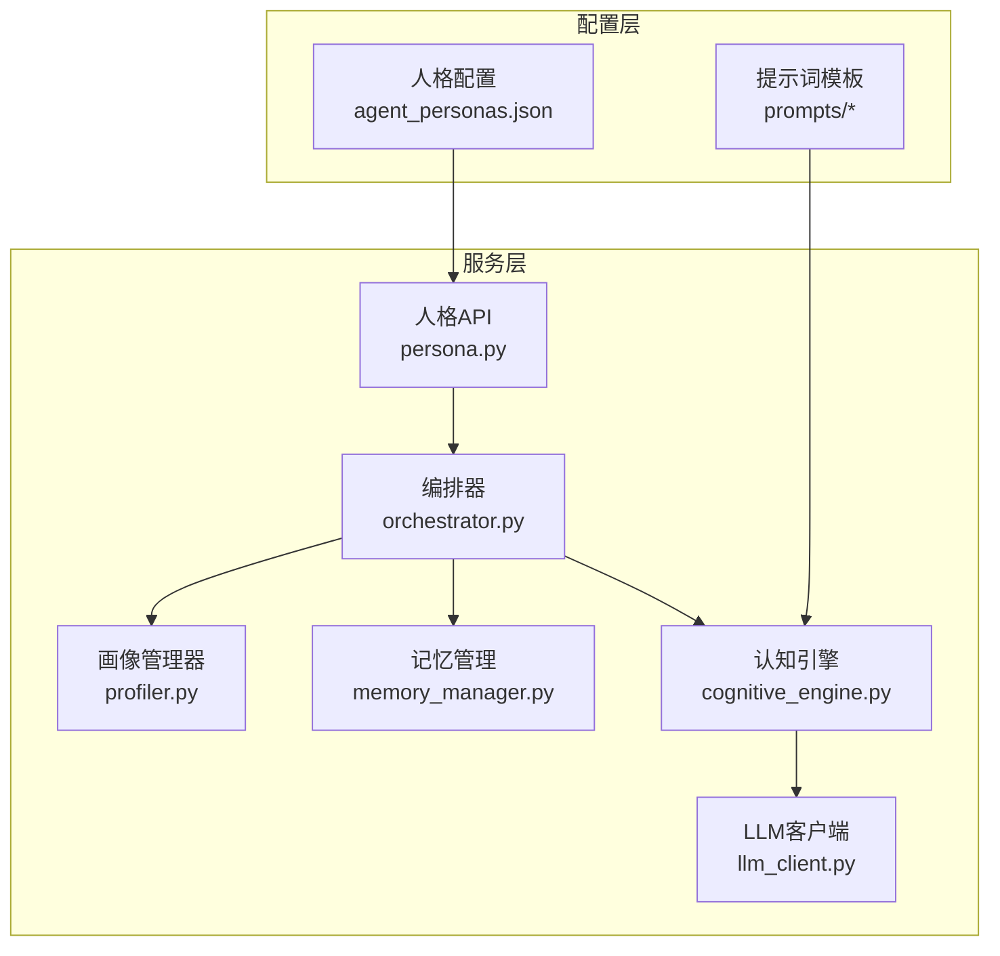
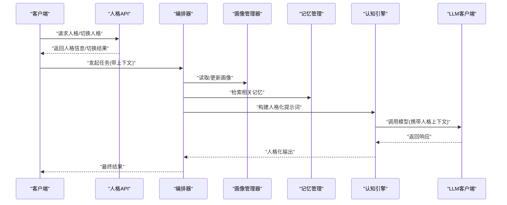
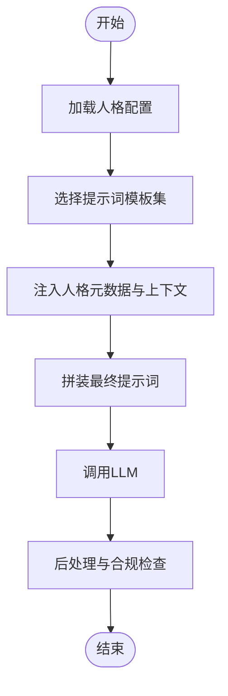
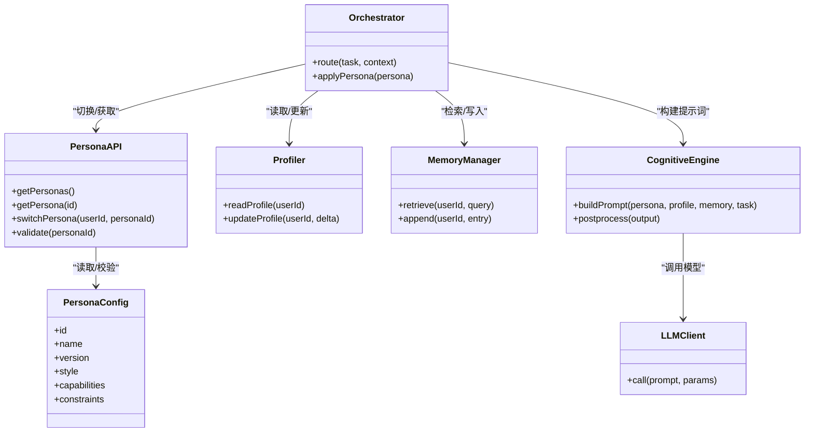
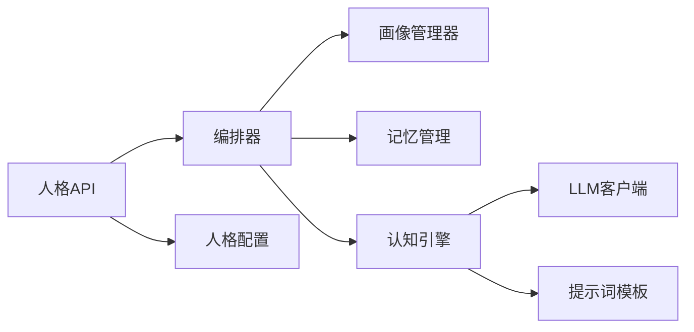

# 智能体人格系统

<cite>
**本文引用的文件**   
- [config/agent_personas.json](file://config/agent_personas.json)
- [src/loopse/api/persona.py](file://src/loopse/api/persona.py)
- [src/loopse/agent/orchestrator.py](file://src/loopse/agent/orchestrator.py)
- [src/loopse/agent/profiler.py](file://src/loopse/agent/profiler.py)
- [src/loopse/agent/cognitive_engine.py](file://src/loopse/agent/cognitive_engine.py)
- [src/loopse/agent/memory_manager.py](file://src/loopse/agent/memory_manager.py)
- [src/loopse/core/llm_client.py](file://src/loopse/core/llm_client.py)
- [config/prompts/profiler/onboarding.txt](file://config/prompts/profiler/onboarding.txt)
- [config/prompts/profiler/update_profile.txt](file://config/prompts/profiler/update_profile.txt)
- [config/prompts/challenger/](file://config/prompts/challenger/)
- [config/prompts/diagnosis/surface_error.txt](file://config/prompts/diagnosis/surface_error.txt)
- [config/prompts/diagnosis/root_cause.txt](file://config/prompts/diagnosis/root_cause.txt)
- [config/prompts/diagnosis/pattern_match.txt](file://config/prompts/diagnosis/pattern_match.txt)
- [config/prompts/retriever/query_expansion.txt](file://config/prompts/retriever/query_expansion.txt)
- [config/prompts/retriever/search_query.txt](file://config/prompts/retriever/search_query.txt)
- [config/prompts/resource_generator/generate_code.txt](file://config/prompts/resource_generator/generate_code.txt)
- [config/prompts/resource_generator/generate_doc.txt](file://config/prompts/resource_generator/generate_doc.txt)
- [config/prompts/resource_generator/generate_exercise.txt](file://config/prompts/resource_generator/generate_exercise.txt)
- [config/prompts/resource_generator/generate_infographic.txt](file://config/prompts/resource_generator/generate_infographic.txt)
- [config/prompts/resource_generator/generate_script.txt](file://config/prompts/resource_generator/generate_script.txt)
- [config/prompts/trust/source_citation.txt](file://config/prompts/trust/source_citation.txt)
- [config/prompts/trust/scope_check.txt](file://config/prompts/trust/scope_check.txt)
- [config/prompts/path_planner/plan_path.txt](file://config/prompts/path_planner/plan_path.txt)
- [config/prompts/orchestrator/route.txt](file://config/prompts/orchestrator/route.txt)
- [tests/unit/test_orchestrator_integration.py](file://tests/unit/test_orchestrator_integration.py)
- [tests/unit/test_resource_generator.py](file://tests/unit/test_resource_generator.py)
- [tests/unit/test_diagnosis_agent.py](file://tests/unit/test_diagnosis_agent.py)
- [tests/unit/test_challenger_agent.py](file://tests/unit/test_challenger_agent.py)
</cite>

## 目录
1. [引言](#引言)
2. [项目结构](#项目结构)
3. [核心组件](#核心组件)
4. [架构总览](#架构总览)
5. [详细组件分析](#详细组件分析)
6. [依赖关系分析](#依赖关系分析)
7. [性能考量](#性能考量)
8. [故障排查指南](#故障排查指南)
9. [结论](#结论)
10. [附录](#附录)

## 引言
本文件系统化阐述 Socrates-Cube 的智能体人格系统，覆盖以下目标：
- 人格配置结构与行为特征定义、交互风格设置
- 人格模板系统与动态切换机制
- 个性化适配与上下文感知策略
- 人格与提示词工程的结合方式
- 人格测试框架、评估指标与调优方法
- 自定义人格开发指南（含教学风格与交互模式）

## 项目结构
围绕“人格”的关键位置与职责如下：
- 人格配置中心：集中管理人格模板、元数据与默认参数
- 人格 API：对外暴露人格查询、切换、应用等接口
- 编排器：根据任务意图路由到对应人格并组合工作流
- 画像与记忆：维护用户画像与短期/长期记忆，支撑个性化
- 认知引擎：将人格注入提示词构建与推理过程
- LLM 客户端：统一调用大模型，承载人格化输出
- 提示词工程：按角色/能力域组织提示词模板，驱动具体行为

图表来源
- [config/agent_personas.json](file://config/agent_personas.json)
- [src/loopse/api/persona.py](file://src/loopse/api/persona.py)
- [src/loopse/agent/orchestrator.py](file://src/loopse/agent/orchestrator.py)
- [src/loopse/agent/profiler.py](file://src/loopse/agent/profiler.py)
- [src/loopse/agent/memory_manager.py](file://src/loopse/agent/memory_manager.py)
- [src/loopse/agent/cognitive_engine.py](file://src/loopse/agent/cognitive_engine.py)
- [src/loopse/core/llm_client.py](file://src/loopse/core/llm_client.py)

章节来源
- [config/agent_personas.json](file://config/agent_personas.json)
- [src/loopse/api/persona.py](file://src/loopse/api/persona.py)
- [src/loopse/agent/orchestrator.py](file://src/loopse/agent/orchestrator.py)
- [src/loopse/agent/profiler.py](file://src/loopse/agent/profiler.py)
- [src/loopse/agent/memory_manager.py](file://src/loopse/agent/memory_manager.py)
- [src/loopse/agent/cognitive_engine.py](file://src/loopse/agent/cognitive_engine.py)
- [src/loopse/core/llm_client.py](file://src/loopse/core/llm_client.py)

## 核心组件
- 人格配置中心
  - 负责定义人格模板、默认行为参数、交互风格、能力域映射与版本控制。
  - 提供人格清单、详情、变更历史等查询能力。
- 人格 API
  - 暴露 REST 接口用于获取人格、切换当前人格、校验人格有效性、批量更新等。
- 编排器
  - 基于用户意图与上下文选择合适的人格或组合，协调各子代理执行。
- 画像与记忆
  - 画像：记录学习者知识水平、偏好、学习路径进度等。
  - 记忆：会话级短期记忆与跨会话长期记忆，支撑上下文感知与个性化。
- 认知引擎
  - 将人格元数据与提示词模板融合，生成结构化提示，驱动 LLM 输出符合人格的行为。
- LLM 客户端
  - 封装模型调用、重试、超时、速率限制与可观测性，确保人格化输出的稳定性。

章节来源
- [config/agent_personas.json](file://config/agent_personas.json)
- [src/loopse/api/persona.py](file://src/loopse/api/persona.py)
- [src/loopse/agent/orchestrator.py](file://src/loopse/agent/orchestrator.py)
- [src/loopse/agent/profiler.py](file://src/loopse/agent/profiler.py)
- [src/loopse/agent/memory_manager.py](file://src/loopse/agent/memory_manager.py)
- [src/loopse/agent/cognitive_engine.py](file://src/loopse/agent/cognitive_engine.py)
- [src/loopse/core/llm_client.py](file://src/loopse/core/llm_client.py)

## 架构总览
下图展示从请求进入、人格选择、提示词组装到模型调用的端到端流程。

图表来源
- [src/loopse/api/persona.py](file://src/loopse/api/persona.py)
- [src/loopse/agent/orchestrator.py](file://src/loopse/agent/orchestrator.py)
- [src/loopse/agent/profiler.py](file://src/loopse/agent/profiler.py)
- [src/loopse/agent/memory_manager.py](file://src/loopse/agent/memory_manager.py)
- [src/loopse/agent/cognitive_engine.py](file://src/loopse/agent/cognitive_engine.py)
- [src/loopse/core/llm_client.py](file://src/loopse/core/llm_client.py)

## 详细组件分析

### 人格配置与模板系统
- 人格模板
  - 通过配置文件定义人格的标识、名称、描述、默认参数、能力域、交互风格、约束与安全策略等。
  - 支持多版本人格与灰度发布，便于 A/B 测试与回滚。
- 提示词模板
  - 按角色/能力域组织提示词，如诊断、挑战者、资源生成、检索、信任与溯源、路径规划、编排等。
  - 提示词模板与人格参数联动，实现“同一模板、不同人格”的输出差异。
- 人格与提示词的结合
  - 在提示词构建阶段，将人格元数据注入为系统指令、风格约束、示例与边界条件，确保输出一致性与可控性。

图表来源
- [config/agent_personas.json](file://config/agent_personas.json)
- [config/prompts/profiler/onboarding.txt](file://config/prompts/profiler/onboarding.txt)
- [config/prompts/profiler/update_profile.txt](file://config/prompts/profiler/update_profile.txt)
- [config/prompts/diagnosis/surface_error.txt](file://config/prompts/diagnosis/surface_error.txt)
- [config/prompts/diagnosis/root_cause.txt](file://config/prompts/diagnosis/root_cause.txt)
- [config/prompts/diagnosis/pattern_match.txt](file://config/prompts/diagnosis/pattern_match.txt)
- [config/prompts/retriever/query_expansion.txt](file://config/prompts/retriever/query_expansion.txt)
- [config/prompts/retriever/search_query.txt](file://config/prompts/retriever/search_query.txt)
- [config/prompts/resource_generator/generate_code.txt](file://config/prompts/resource_generator/generate_code.txt)
- [config/prompts/resource_generator/generate_doc.txt](file://config/prompts/resource_generator/generate_doc.txt)
- [config/prompts/resource_generator/generate_exercise.txt](file://config/prompts/resource_generator/generate_exercise.txt)
- [config/prompts/resource_generator/generate_infographic.txt](file://config/prompts/resource_generator/generate_infographic.txt)
- [config/prompts/resource_generator/generate_script.txt](file://config/prompts/resource_generator/generate_script.txt)
- [config/prompts/trust/source_citation.txt](file://config/prompts/trust/source_citation.txt)
- [config/prompts/trust/scope_check.txt](file://config/prompts/trust/scope_check.txt)
- [config/prompts/path_planner/plan_path.txt](file://config/prompts/path_planner/plan_path.txt)
- [config/prompts/orchestrator/route.txt](file://config/prompts/orchestrator/route.txt)

章节来源
- [config/agent_personas.json](file://config/agent_personas.json)
- [config/prompts/profiler/onboarding.txt](file://config/prompts/profiler/onboarding.txt)
- [config/prompts/profiler/update_profile.txt](file://config/prompts/profiler/update_profile.txt)
- [config/prompts/diagnosis/surface_error.txt](file://config/prompts/diagnosis/surface_error.txt)
- [config/prompts/diagnosis/root_cause.txt](file://config/prompts/diagnosis/root_cause.txt)
- [config/prompts/diagnosis/pattern_match.txt](file://config/prompts/diagnosis/pattern_match.txt)
- [config/prompts/retriever/query_expansion.txt](file://config/prompts/retriever/query_expansion.txt)
- [config/prompts/retriever/search_query.txt](file://config/prompts/retriever/search_query.txt)
- [config/prompts/resource_generator/generate_code.txt](file://config/prompts/resource_generator/generate_code.txt)
- [config/prompts/resource_generator/generate_doc.txt](file://config/prompts/resource_generator/generate_doc.txt)
- [config/prompts/resource_generator/generate_exercise.txt](file://config/prompts/resource_generator/generate_exercise.txt)
- [config/prompts/resource_generator/generate_infographic.txt](file://config/prompts/resource_generator/generate_infographic.txt)
- [config/prompts/resource_generator/generate_script.txt](file://config/prompts/resource_generator/generate_script.txt)
- [config/prompts/trust/source_citation.txt](file://config/prompts/trust/source_citation.txt)
- [config/prompts/trust/scope_check.txt](file://config/prompts/trust/scope_check.txt)
- [config/prompts/path_planner/plan_path.txt](file://config/prompts/path_planner/plan_path.txt)
- [config/prompts/orchestrator/route.txt](file://config/prompts/orchestrator/route.txt)

### 动态人格切换与个性化适配
- 动态切换
  - 通过人格 API 进行人格切换，支持会话级与全局级生效范围。
  - 切换时校验人格存在性、兼容性、权限与版本策略。
- 个性化适配
  - 画像管理器持续更新学习者画像；记忆管理器提供上下文片段；认知引擎据此调整提示词权重与风格。
  - 支持“同任务、多人格”对比输出，辅助教学策略优化。

图表来源
- [src/loopse/api/persona.py](file://src/loopse/api/persona.py)
- [src/loopse/agent/orchestrator.py](file://src/loopse/agent/orchestrator.py)
- [src/loopse/agent/profiler.py](file://src/loopse/agent/profiler.py)
- [src/loopse/agent/memory_manager.py](file://src/loopse/agent/memory_manager.py)
- [src/loopse/agent/cognitive_engine.py](file://src/loopse/agent/cognitive_engine.py)
- [src/loopse/core/llm_client.py](file://src/loopse/core/llm_client.py)

章节来源
- [src/loopse/api/persona.py](file://src/loopse/api/persona.py)
- [src/loopse/agent/orchestrator.py](file://src/loopse/agent/orchestrator.py)
- [src/loopse/agent/profiler.py](file://src/loopse/agent/profiler.py)
- [src/loopse/agent/memory_manager.py](file://src/loopse/agent/memory_manager.py)
- [src/loopse/agent/cognitive_engine.py](file://src/loopse/agent/cognitive_engine.py)
- [src/loopse/core/llm_client.py](file://src/loopse/core/llm_client.py)

### 人格与提示词工程的结合
- 模板分层
  - 基础模板：通用对话与任务框架
  - 角色模板：诊断、挑战者、资源生成、检索、信任与溯源、路径规划、编排等
  - 人格注入：风格、难度、反馈粒度、纠错策略、引用规范等
- 上下文感知
  - 依据画像与记忆动态插入示例、先验知识与约束，减少幻觉与越界回答。
- 安全与可信
  - 使用信任与溯源模板对输出进行来源标注与范围检查，提升可解释性与安全性。

章节来源
- [config/prompts/profiler/onboarding.txt](file://config/prompts/profiler/onboarding.txt)
- [config/prompts/profiler/update_profile.txt](file://config/prompts/profiler/update_profile.txt)
- [config/prompts/diagnosis/surface_error.txt](file://config/prompts/diagnosis/surface_error.txt)
- [config/prompts/diagnosis/root_cause.txt](file://config/prompts/diagnosis/root_cause.txt)
- [config/prompts/diagnosis/pattern_match.txt](file://config/prompts/diagnosis/pattern_match.txt)
- [config/prompts/retriever/query_expansion.txt](file://config/prompts/retriever/query_expansion.txt)
- [config/prompts/retriever/search_query.txt](file://config/prompts/retriever/search_query.txt)
- [config/prompts/resource_generator/generate_code.txt](file://config/prompts/resource_generator/generate_code.txt)
- [config/prompts/resource_generator/generate_doc.txt](file://config/prompts/resource_generator/generate_doc.txt)
- [config/prompts/resource_generator/generate_exercise.txt](file://config/prompts/resource_generator/generate_exercise.txt)
- [config/prompts/resource_generator/generate_infographic.txt](file://config/prompts/resource_generator/generate_infographic.txt)
- [config/prompts/resource_generator/generate_script.txt](file://config/prompts/resource_generator/generate_script.txt)
- [config/prompts/trust/source_citation.txt](file://config/prompts/trust/source_citation.txt)
- [config/prompts/trust/scope_check.txt](file://config/prompts/trust/scope_check.txt)
- [config/prompts/path_planner/plan_path.txt](file://config/prompts/path_planner/plan_path.txt)
- [config/prompts/orchestrator/route.txt](file://config/prompts/orchestrator/route.txt)

### 人格测试框架、评估指标与调优方法
- 测试套件
  - 编排集成测试：验证多人格协作与路由正确性
  - 资源生成测试：验证不同人格下资源质量与一致性
  - 诊断代理测试：验证诊断深度与准确性
  - 挑战者代理测试：验证提问质量与引导效果
- 评估指标建议
  - 相关性/有用性：与学习目标对齐程度
  - 一致性：同一输入在不同人格下的稳定差异
  - 可解释性：是否包含必要说明与来源
  - 安全性：越界内容比例、违规率
  - 效率：首字延迟、总耗时、Token 消耗
- 调优方法
  - 提示词迭代：A/B 对比不同模板与注入策略
  - 人格参数扫描：风格强度、难度梯度、反馈粒度
  - 在线评测：灰度发布与回归监控
  - 自动化回归：用例库与评分脚本

章节来源
- [tests/unit/test_orchestrator_integration.py](file://tests/unit/test_orchestrator_integration.py)
- [tests/unit/test_resource_generator.py](file://tests/unit/test_resource_generator.py)
- [tests/unit/test_diagnosis_agent.py](file://tests/unit/test_diagnosis_agent.py)
- [tests/unit/test_challenger_agent.py](file://tests/unit/test_challenger_agent.py)

### 自定义人格开发指南
- 步骤概览
  - 定义人格元数据：标识、名称、版本、风格、能力域、约束
  - 编写提示词模板：针对目标场景（如诊断、挑战、资源生成）
  - 接入人格 API：注册新人格、配置路由规则
  - 画像与记忆适配：为新人格定制画像字段与记忆策略
  - 测试与评估：编写单元测试与集成测试，建立评估基线
  - 上线与监控：灰度发布、指标看板、异常告警
- 教学风格与交互模式
  - 教学风格：启发式、讲授式、探究式、苏格拉底式等
  - 交互模式：问答式、任务式、情境模拟式、同伴讨论式
  - 难度与节奏：自适应调节，结合画像与记忆动态变化
- 最佳实践
  - 最小可行人格：先跑通闭环再扩展
  - 模板解耦：将通用逻辑与风格分离
  - 可观测性：记录关键决策点与提示词快照
  - 安全护栏：范围检查与来源引用强制开启

章节来源
- [src/loopse/api/persona.py](file://src/loopse/api/persona.py)
- [config/agent_personas.json](file://config/agent_personas.json)
- [config/prompts/orchestrator/route.txt](file://config/prompts/orchestrator/route.txt)
- [config/prompts/diagnosis/surface_error.txt](file://config/prompts/diagnosis/surface_error.txt)
- [config/prompts/diagnosis/root_cause.txt](file://config/prompts/diagnosis/root_cause.txt)
- [config/prompts/diagnosis/pattern_match.txt](file://config/prompts/diagnosis/pattern_match.txt)
- [config/prompts/resource_generator/generate_code.txt](file://config/prompts/resource_generator/generate_code.txt)
- [config/prompts/resource_generator/generate_doc.txt](file://config/prompts/resource_generator/generate_doc.txt)
- [config/prompts/resource_generator/generate_exercise.txt](file://config/prompts/resource_generator/generate_exercise.txt)
- [config/prompts/resource_generator/generate_infographic.txt](file://config/prompts/resource_generator/generate_infographic.txt)
- [config/prompts/resource_generator/generate_script.txt](file://config/prompts/resource_generator/generate_script.txt)
- [config/prompts/trust/source_citation.txt](file://config/prompts/trust/source_citation.txt)
- [config/prompts/trust/scope_check.txt](file://config/prompts/trust/scope_check.txt)

## 依赖关系分析
- 组件耦合
  - 人格 API 与编排器松耦合，通过明确接口契约协作
  - 认知引擎依赖提示词模板与人格配置，不直接访问外部存储
  - 画像与记忆作为共享状态，被多个组件读取/写入
- 外部依赖
  - LLM 客户端抽象了底层模型差异，便于替换与扩展
- 潜在风险
  - 提示词模板过多导致维护成本上升，需引入版本管理与回归测试
  - 人格切换频繁可能影响缓存命中，需要合理失效策略

图表来源
- [src/loopse/api/persona.py](file://src/loopse/api/persona.py)
- [src/loopse/agent/orchestrator.py](file://src/loopse/agent/orchestrator.py)
- [src/loopse/agent/profiler.py](file://src/loopse/agent/profiler.py)
- [src/loopse/agent/memory_manager.py](file://src/loopse/agent/memory_manager.py)
- [src/loopse/agent/cognitive_engine.py](file://src/loopse/agent/cognitive_engine.py)
- [src/loopse/core/llm_client.py](file://src/loopse/core/llm_client.py)
- [config/agent_personas.json](file://config/agent_personas.json)

章节来源
- [src/loopse/api/persona.py](file://src/loopse/api/persona.py)
- [src/loopse/agent/orchestrator.py](file://src/loopse/agent/orchestrator.py)
- [src/loopse/agent/profiler.py](file://src/loopse/agent/profiler.py)
- [src/loopse/agent/memory_manager.py](file://src/loopse/agent/memory_manager.py)
- [src/loopse/agent/cognitive_engine.py](file://src/loopse/agent/cognitive_engine.py)
- [src/loopse/core/llm_client.py](file://src/loopse/core/llm_client.py)
- [config/agent_personas.json](file://config/agent_personas.json)

## 性能考量
- 提示词长度控制：避免过长导致延迟与 Token 浪费
- 缓存策略：对静态模板与常用人格参数进行缓存
- 并发与限流：LLM 客户端增加并发控制与退避重试
- 异步处理：长任务采用异步与 SSE 推送
- 观测与采样：关键路径埋点与日志采样，降低开销

## 故障排查指南
- 常见问题
  - 人格未生效：检查人格 ID、版本与生效范围
  - 输出不一致：核对提示词模板版本与注入顺序
  - 越界或无来源：确认信任与溯源模板是否启用
  - 性能退化：查看 LLM 调用耗时与 Token 用量
- 定位手段
  - 启用提示词快照与人格上下文记录
  - 使用编排器日志追踪路由与决策
  - 对画像与记忆读写进行审计

章节来源
- [src/loopse/api/persona.py](file://src/loopse/api/persona.py)
- [src/loopse/agent/orchestrator.py](file://src/loopse/agent/orchestrator.py)
- [src/loopse/agent/cognitive_engine.py](file://src/loopse/agent/cognitive_engine.py)
- [src/loopse/core/llm_client.py](file://src/loopse/core/llm_client.py)

## 结论
Socrates-Cube 的人格系统以“配置驱动+提示词工程”为核心，通过编排器、画像与记忆、认知引擎与 LLM 客户端协同，实现了可插拔、可观测、可评估的人格化智能体体系。借助完善的测试与评估框架，团队可以快速迭代与验证新的人格与教学风格，持续提升用户体验与教学效果。

## 附录
- 术语
  - 人格：一组行为特征、交互风格与约束的集合
  - 提示词模板：驱动 LLM 行为的文本模板
  - 画像：学习者知识、偏好与状态的抽象
  - 记忆：会话内外的上下文片段
- 参考
  - 人格配置与提示词模板见配置目录
  - 人格 API 与编排逻辑见服务层代码
  - 测试用例见 tests 目录