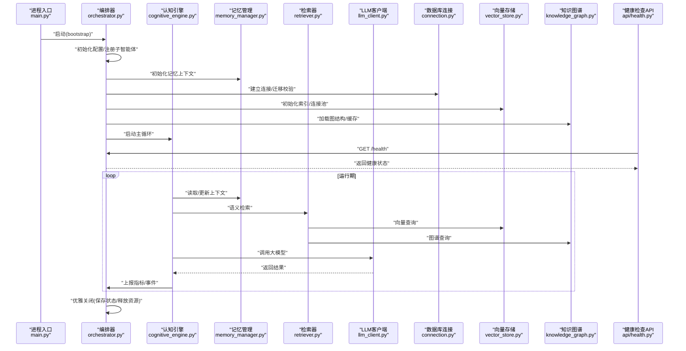
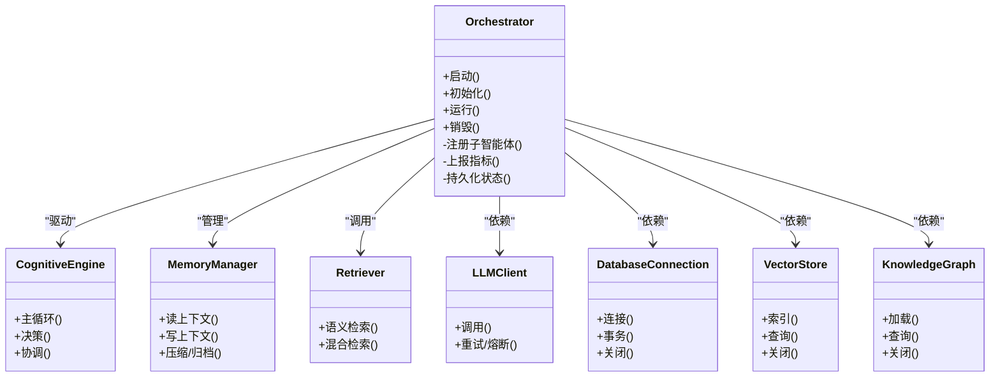
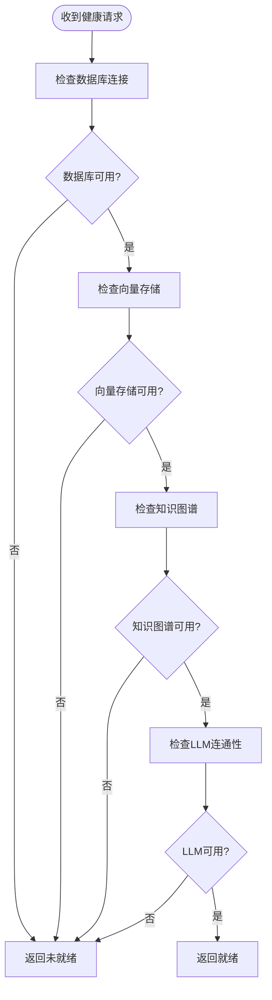
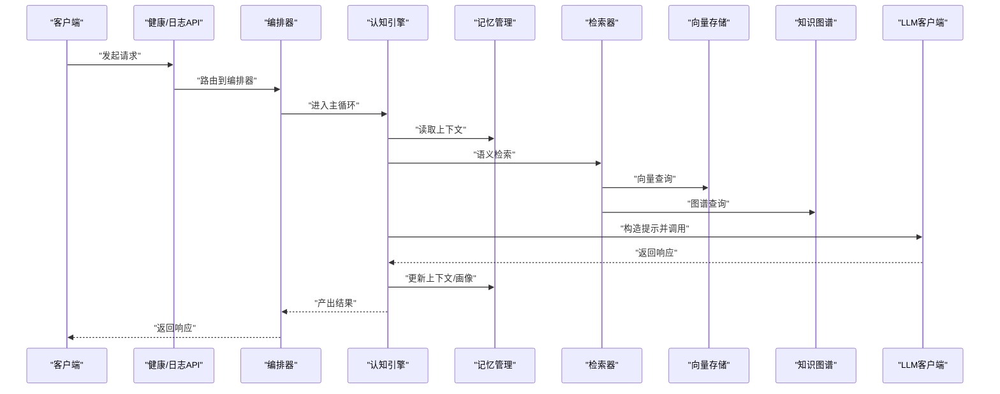
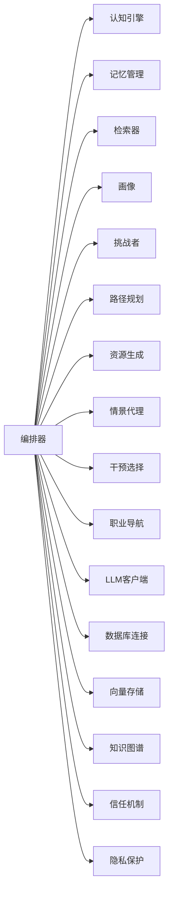

# 智能体生命周期管理

<cite>
**本文引用的文件**   
- [src/loopse/main.py](file://src/loopse/main.py)
- [src/loopse/agent/orchestrator.py](file://src/loopse/agent/orchestrator.py)
- [src/loopse/api/health.py](file://src/loopse/api/health.py)
- [src/loopse/api/logs.py](file://src/loopse/api/logs.py)
- [src/loopse/core/llm_client.py](file://src/loopse/core/llm_client.py)
- [src/loopse/db/connection.py](file://src/loopse/db/connection.py)
- [src/loopse/kb/vector_store.py](file://src/loopse/kb/vector_store.py)
- [src/loopse/kb/knowledge_graph.py](file://src/loopse/kb/knowledge_graph.py)
- [src/loopse/agent/memory_manager.py](file://src/loopse/agent/memory_manager.py)
- [src/loopse/agent/cognitive_engine.py](file://src/loopse/agent/cognitive_engine.py)
- [src/loopse/agent/profiler.py](file://src/loopse/agent/profiler.py)
- [src/loopse/agent/challenger.py](file://src/loopse/agent/challenger.py)
- [src/loopse/agent/path_planner.py](file://src/loopse/agent/path_planner.py)
- [src/loopse/agent/retriever.py](file://src/loopse/agent/retriever.py)
- [src/loopse/agent/resource_generator.py](file://src/loopse/agent/resource_generator.py)
- [src/loopse/agent/scenario_agent.py](file://src/loopse/agent/scenario_agent.py)
- [src/loopse/agent/intervention_selector.py](file://src/loopse/agent/intervention_selector.py)
- [src/loopse/agent/career_navigator.py](file://src/loopse/agent/career_navigator.py)
- [src/loopse/schema/profile.py](file://src/loopse/schema/profile.py)
- [src/loopse/schema/student_profile_schema.py](file://src/loopse/schema/student_profile_schema.py)
- [src/loopse/core/trust_mechanism.py](file://src/loopse/core/trust_mechanism.py)
- [src/loopse/security/privacy.py](file://src/loopse/security/privacy.py)
- [start.sh](file://start.sh)
</cite>

## 目录
1. [简介](#简介)
2. [项目结构](#项目结构)
3. [核心组件](#核心组件)
4. [架构总览](#架构总览)
5. [详细组件分析](#详细组件分析)
6. [依赖关系分析](#依赖关系分析)
7. [性能考量](#性能考量)
8. [故障排查指南](#故障排查指南)
9. [结论](#结论)
10. [附录](#附录)

## 简介
本文件聚焦于Socrates-Cube项目中“智能体”的生命周期管理，覆盖启动、初始化、运行与销毁四个阶段；并系统化阐述资源管理、内存清理与垃圾回收策略；同时给出健康检查、自动重启与故障恢复方案；最后提供监控指标、日志记录与性能分析方法，以及面向开发者的最佳实践，确保智能体的稳定性与可维护性。

## 项目结构
从代码组织看，智能体相关能力集中在 src/loopse 下：
- agent：具体智能体实现（编排器、认知引擎、记忆管理、检索器、资源生成器等）
- api：对外暴露的HTTP接口（健康检查、日志等）
- core：通用基础设施（LLM客户端、信任机制）
- db：数据库连接与模型
- kb：知识图谱与向量存储
- schema：数据模式定义
- security：隐私与安全

```mermaid
graph TB
subgraph "应用入口"
main["main.py"]
startsh["start.sh"]
end
subgraph "API层"
health_api["api/health.py"]
logs_api["api/logs.py"]
end
subgraph "智能体层"
orchestrator["agent/orchestrator.py"]
cognitive["agent/cognitive_engine.py"]
memory["agent/memory_manager.py"]
retriever["agent/retriever.py"]
profiler["agent/profiler.py"]
challenger["agent/challenger.py"]
pathplanner["agent/path_planner.py"]
resourcegen["agent/resource_generator.py"]
scenario["agent/scenario_agent.py"]
intervention["agent/intervention_selector.py"]
career["agent/career_navigator.py"]
end
subgraph "基础设施"
llm["core/llm_client.py"]
trust["core/trust_mechanism.py"]
privacy["security/privacy.py"]
dbconn["db/connection.py"]
vectorstore["kb/vector_store.py"]
kg["kb/knowledge_graph.py"]
profile_schema["schema/profile.py"]
student_schema["schema/student_profile_schema.py"]
end
startsh --> main
main --> orchestrator
orchestrator --> cognitive
orchestrator --> memory
orchestrator --> retriever
orchestrator --> profiler
orchestrator --> challenger
orchestrator --> pathplanner
orchestrator --> resourcegen
orchestrator --> scenario
orchestrator --> intervention
orchestrator --> career
orchestrator --> llm
orchestrator --> dbconn
orchestrator --> vectorstore
orchestrator --> kg
orchestrator --> profile_schema
orchestrator --> student_schema
orchestrator --> trust
orchestrator --> privacy
health_api --> orchestrator
logs_api --> orchestrator
```

图表来源
- [src/loopse/main.py](file://src/loopse/main.py)
- [src/loopse/agent/orchestrator.py](file://src/loopse/agent/orchestrator.py)
- [src/loopse/api/health.py](file://src/loopse/api/health.py)
- [src/loopse/api/logs.py](file://src/loopse/api/logs.py)
- [src/loopse/core/llm_client.py](file://src/loopse/core/llm_client.py)
- [src/loopse/db/connection.py](file://src/loopse/db/connection.py)
- [src/loopse/kb/vector_store.py](file://src/loopse/kb/vector_store.py)
- [src/loopse/kb/knowledge_graph.py](file://src/loopse/kb/knowledge_graph.py)
- [src/loopse/agent/memory_manager.py](file://src/loopse/agent/memory_manager.py)
- [src/loopse/agent/cognitive_engine.py](file://src/loopse/agent/cognitive_engine.py)
- [src/loopse/agent/profiler.py](file://src/loopse/agent/profiler.py)
- [src/loopse/agent/challenger.py](file://src/loopse/agent/challenger.py)
- [src/loopse/agent/path_planner.py](file://src/loopse/agent/path_planner.py)
- [src/loopse/agent/retriever.py](file://src/loopse/agent/retriever.py)
- [src/loopse/agent/resource_generator.py](file://src/loopse/agent/resource_generator.py)
- [src/loopse/agent/scenario_agent.py](file://src/loopse/agent/scenario_agent.py)
- [src/loopse/agent/intervention_selector.py](file://src/loopse/agent/intervention_selector.py)
- [src/loopse/agent/career_navigator.py](file://src/loopse/agent/career_navigator.py)
- [src/loopse/schema/profile.py](file://src/loopse/schema/profile.py)
- [src/loopse/schema/student_profile_schema.py](file://src/loopse/schema/student_profile_schema.py)
- [src/loopse/core/trust_mechanism.py](file://src/loopse/core/trust_mechanism.py)
- [src/loopse/security/privacy.py](file://src/loopse/security/privacy.py)
- [start.sh](file://start.sh)

章节来源
- [src/loopse/main.py](file://src/loopse/main.py)
- [src/loopse/agent/orchestrator.py](file://src/loopse/agent/orchestrator.py)
- [src/loopse/api/health.py](file://src/loopse/api/health.py)
- [src/loopse/api/logs.py](file://src/loopse/api/logs.py)
- [src/loopse/core/llm_client.py](file://src/loopse/core/llm_client.py)
- [src/loopse/db/connection.py](file://src/loopse/db/connection.py)
- [src/loopse/kb/vector_store.py](file://src/loopse/kb/vector_store.py)
- [src/loopse/kb/knowledge_graph.py](file://src/loopse/kb/knowledge_graph.py)
- [src/loopse/agent/memory_manager.py](file://src/loopse/agent/memory_manager.py)
- [src/loopse/agent/cognitive_engine.py](file://src/loopse/agent/cognitive_engine.py)
- [src/loopse/agent/profiler.py](file://src/loopse/agent/profiler.py)
- [src/loopse/agent/challenger.py](file://src/loopse/agent/challenger.py)
- [src/loopse/agent/path_planner.py](file://src/loopse/agent/path_planner.py)
- [src/loopse/agent/retriever.py](file://src/loopse/agent/retriever.py)
- [src/loopse/agent/resource_generator.py](file://src/loopse/agent/resource_generator.py)
- [src/loopse/agent/scenario_agent.py](file://src/loopse/agent/scenario_agent.py)
- [src/loopse/agent/intervention_selector.py](file://src/loopse/agent/intervention_selector.py)
- [src/loopse/agent/career_navigator.py](file://src/loopse/agent/career_navigator.py)
- [src/loopse/schema/profile.py](file://src/loopse/schema/profile.py)
- [src/loopse/schema/student_profile_schema.py](file://src/loopse/schema/student_profile_schema.py)
- [src/loopse/core/trust_mechanism.py](file://src/loopse/core/trust_mechanism.py)
- [src/loopse/security/privacy.py](file://src/loopse/security/privacy.py)
- [start.sh](file://start.sh)

## 核心组件
- 编排器（Orchestrator）：负责智能体实例的创建、调度、状态管理与生命周期钩子（启动、初始化、运行、销毁）。
- 认知引擎（Cognitive Engine）：承载推理与决策主循环，协调各子智能体协作。
- 记忆管理器（Memory Manager）：维护短期/长期记忆、上下文窗口与持久化策略。
- 检索器（Retriever）：对接向量库与知识图谱进行语义检索。
- 画像与评估（Profiler）：构建与维护学生画像与能力雷达。
- 挑战者（Challenger）、路径规划（Path Planner）、资源生成（Resource Generator）、情景代理（Scenario Agent）、干预选择（Intervention Selector）、职业导航（Career Navigator）：按职责划分的领域智能体。
- 外部依赖：LLM客户端、数据库连接、向量存储、知识图谱、信任机制与隐私保护。

章节来源
- [src/loopse/agent/orchestrator.py](file://src/loopse/agent/orchestrator.py)
- [src/loopse/agent/cognitive_engine.py](file://src/loopse/agent/cognitive_engine.py)
- [src/loopse/agent/memory_manager.py](file://src/loopse/agent/memory_manager.py)
- [src/loopse/agent/retriever.py](file://src/loopse/agent/retriever.py)
- [src/loopse/agent/profiler.py](file://src/loopse/agent/profiler.py)
- [src/loopse/agent/challenger.py](file://src/loopse/agent/challenger.py)
- [src/loopse/agent/path_planner.py](file://src/loopse/agent/path_planner.py)
- [src/loopse/agent/resource_generator.py](file://src/loopse/agent/resource_generator.py)
- [src/loopse/agent/scenario_agent.py](file://src/loopse/agent/scenario_agent.py)
- [src/loopse/agent/intervention_selector.py](file://src/loopse/agent/intervention_selector.py)
- [src/loopse/agent/career_navigator.py](file://src/loopse/agent/career_navigator.py)
- [src/loopse/core/llm_client.py](file://src/loopse/core/llm_client.py)
- [src/loopse/db/connection.py](file://src/loopse/db/connection.py)
- [src/loopse/kb/vector_store.py](file://src/loopse/kb/vector_store.py)
- [src/loopse/kb/knowledge_graph.py](file://src/loopse/kb/knowledge_graph.py)
- [src/loopse/schema/profile.py](file://src/loopse/schema/profile.py)
- [src/loopse/schema/student_profile_schema.py](file://src/loopse/schema/student_profile_schema.py)
- [src/loopse/core/trust_mechanism.py](file://src/loopse/core/trust_mechanism.py)
- [src/loopse/security/privacy.py](file://src/loopse/security/privacy.py)

## 架构总览
下图展示了智能体在进程内的主要交互关系与生命周期关键节点。

图表来源
- [src/loopse/main.py](file://src/loopse/main.py)
- [src/loopse/agent/orchestrator.py](file://src/loopse/agent/orchestrator.py)
- [src/loopse/agent/cognitive_engine.py](file://src/loopse/agent/cognitive_engine.py)
- [src/loopse/agent/memory_manager.py](file://src/loopse/agent/memory_manager.py)
- [src/loopse/agent/retriever.py](file://src/loopse/agent/retriever.py)
- [src/loopse/core/llm_client.py](file://src/loopse/core/llm_client.py)
- [src/loopse/db/connection.py](file://src/loopse/db/connection.py)
- [src/loopse/kb/vector_store.py](file://src/loopse/kb/vector_store.py)
- [src/loopse/kb/knowledge_graph.py](file://src/loopse/kb/knowledge_graph.py)
- [src/loopse/api/health.py](file://src/loopse/api/health.py)

## 详细组件分析

### 编排器（Orchestrator）——生命周期中枢
- 启动阶段：解析配置、注册子智能体、准备共享上下文。
- 初始化阶段：建立外部依赖连接（数据库、向量库、知识图谱、LLM），预热缓存与索引。
- 运行阶段：驱动认知引擎主循环，分发任务给专业智能体，收集指标与日志。
- 销毁阶段：持久化状态、关闭连接、释放锁与句柄、触发垃圾回收。

图表来源
- [src/loopse/agent/orchestrator.py](file://src/loopse/agent/orchestrator.py)
- [src/loopse/agent/cognitive_engine.py](file://src/loopse/agent/cognitive_engine.py)
- [src/loopse/agent/memory_manager.py](file://src/loopse/agent/memory_manager.py)
- [src/loopse/agent/retriever.py](file://src/loopse/agent/retriever.py)
- [src/loopse/core/llm_client.py](file://src/loopse/core/llm_client.py)
- [src/loopse/db/connection.py](file://src/loopse/db/connection.py)
- [src/loopse/kb/vector_store.py](file://src/loopse/kb/vector_store.py)
- [src/loopse/kb/knowledge_graph.py](file://src/loopse/kb/knowledge_graph.py)

章节来源
- [src/loopse/agent/orchestrator.py](file://src/loopse/agent/orchestrator.py)

### 健康检查与就绪探针
- 健康端点：对外暴露健康检查接口，聚合各子系统状态（数据库、向量库、知识图谱、LLM连通性等）。
- 就绪判定：当所有关键依赖可用时返回“就绪”，否则返回“未就绪”。
- 自愈联动：容器编排系统根据健康检查结果执行重启或滚动升级。

图表来源
- [src/loopse/api/health.py](file://src/loopse/api/health.py)
- [src/loopse/db/connection.py](file://src/loopse/db/connection.py)
- [src/loopse/kb/vector_store.py](file://src/loopse/kb/vector_store.py)
- [src/loopse/kb/knowledge_graph.py](file://src/loopse/kb/knowledge_graph.py)
- [src/loopse/core/llm_client.py](file://src/loopse/core/llm_client.py)

章节来源
- [src/loopse/api/health.py](file://src/loopse/api/health.py)

### 日志与审计
- 结构化日志：统一输出时间戳、级别、模块、追踪ID、关键参数摘要。
- 分级策略：DEBUG/INFO/WARN/ERROR分层，避免敏感信息泄露。
- 采集与导出：通过日志API或标准输出供外部采集系统抓取。

章节来源
- [src/loopse/api/logs.py](file://src/loopse/api/logs.py)

### 资源管理与内存清理
- 连接池：数据库、向量库、LLM客户端使用连接池，限制最大并发与空闲超时。
- 上下文窗口：记忆管理器对长上下文进行压缩、摘要与归档，控制峰值内存。
- 显式释放：在销毁阶段主动关闭连接、清空缓存、解除引用，配合语言运行时GC回收。
- 背压与限流：对高开销操作（如批量写入、大规模检索）实施限流与队列缓冲。

章节来源
- [src/loopse/agent/memory_manager.py](file://src/loopse/agent/memory_manager.py)
- [src/loopse/db/connection.py](file://src/loopse/db/connection.py)
- [src/loopse/kb/vector_store.py](file://src/loopse/kb/vector_store.py)
- [src/loopse/core/llm_client.py](file://src/loopse/core/llm_client.py)

### 自动重启与故障恢复
- 进程外守护：由启动脚本或容器编排器负责进程存活检测与重启。
- 内部自愈：对瞬时错误（网络抖动、限流）采用指数退避重试；对不可恢复错误触发降级策略（如切换至本地缓存或只读模式）。
- 状态一致性：重启后从持久化状态恢复，保证会话与画像连续性。

章节来源
- [start.sh](file://start.sh)
- [src/loopse/agent/orchestrator.py](file://src/loopse/agent/orchestrator.py)

### 监控指标与性能分析
- 指标维度：请求延迟、吞吐、错误率、LLM调用耗时、检索命中率、向量相似度分布、图谱查询耗时、内存占用、GC次数。
- 采样与聚合：对高频指标进行降采样与滑动窗口聚合，降低存储压力。
- 告警阈值：基于历史基线设置动态阈值，异常波动及时告警。

章节来源
- [src/loopse/agent/orchestrator.py](file://src/loopse/agent/orchestrator.py)
- [src/loopse/agent/cognitive_engine.py](file://src/loopse/agent/cognitive_engine.py)

### 典型工作流：一次对话处理

图表来源
- [src/loopse/api/health.py](file://src/loopse/api/health.py)
- [src/loopse/api/logs.py](file://src/loopse/api/logs.py)
- [src/loopse/agent/orchestrator.py](file://src/loopse/agent/orchestrator.py)
- [src/loopse/agent/cognitive_engine.py](file://src/loopse/agent/cognitive_engine.py)
- [src/loopse/agent/memory_manager.py](file://src/loopse/agent/memory_manager.py)
- [src/loopse/agent/retriever.py](file://src/loopse/agent/retriever.py)
- [src/loopse/kb/vector_store.py](file://src/loopse/kb/vector_store.py)
- [src/loopse/kb/knowledge_graph.py](file://src/loopse/kb/knowledge_graph.py)
- [src/loopse/core/llm_client.py](file://src/loopse/core/llm_client.py)

## 依赖关系分析
- 低耦合高内聚：编排器作为中心协调者，通过明确接口与各子智能体解耦。
- 外部依赖隔离：LLM、数据库、向量库、知识图谱均通过独立模块封装，便于替换与测试。
- 潜在环依赖规避：子智能体之间不直接互相强引用，统一经由编排器或消息总线通信。

图表来源
- [src/loopse/agent/orchestrator.py](file://src/loopse/agent/orchestrator.py)
- [src/loopse/agent/cognitive_engine.py](file://src/loopse/agent/cognitive_engine.py)
- [src/loopse/agent/memory_manager.py](file://src/loopse/agent/memory_manager.py)
- [src/loopse/agent/retriever.py](file://src/loopse/agent/retriever.py)
- [src/loopse/agent/profiler.py](file://src/loopse/agent/profiler.py)
- [src/loopse/agent/challenger.py](file://src/loopse/agent/challenger.py)
- [src/loopse/agent/path_planner.py](file://src/loopse/agent/path_planner.py)
- [src/loopse/agent/resource_generator.py](file://src/loopse/agent/resource_generator.py)
- [src/loopse/agent/scenario_agent.py](file://src/loopse/agent/scenario_agent.py)
- [src/loopse/agent/intervention_selector.py](file://src/loopse/agent/intervention_selector.py)
- [src/loopse/agent/career_navigator.py](file://src/loopse/agent/career_navigator.py)
- [src/loopse/core/llm_client.py](file://src/loopse/core/llm_client.py)
- [src/loopse/db/connection.py](file://src/loopse/db/connection.py)
- [src/loopse/kb/vector_store.py](file://src/loopse/kb/vector_store.py)
- [src/loopse/kb/knowledge_graph.py](file://src/loopse/kb/knowledge_graph.py)
- [src/loopse/core/trust_mechanism.py](file://src/loopse/core/trust_mechanism.py)
- [src/loopse/security/privacy.py](file://src/loopse/security/privacy.py)

章节来源
- [src/loopse/agent/orchestrator.py](file://src/loopse/agent/orchestrator.py)

## 性能考量
- 批处理与异步：对非实时任务（如资源生成、图谱扩展）采用异步队列与批处理，削峰填谷。
- 缓存策略：热点数据（用户画像、常用知识点）加入内存缓存，结合TTL与失效策略。
- 连接复用：数据库与向量库连接复用，减少握手开销。
- 提示工程优化：减少不必要的上下文长度，采用增量更新与摘要压缩。
- 观测先行：上线前完善指标埋点与日志规范，确保问题可定位。

[本节为通用指导，无需特定文件来源]

## 故障排查指南
- 健康检查失败：逐项检查数据库、向量库、知识图谱、LLM连通性与认证配置。
- 内存泄漏迹象：关注记忆管理器上下文增长趋势，必要时强制压缩或归档。
- 高延迟与超时：查看LLM调用耗时与重试次数，调整超时与退避策略。
- 日志缺失或噪声过大：确认日志级别与过滤规则，避免敏感字段输出。
- 重启风暴：核对健康检查间隔与重启冷却时间，避免频繁震荡。

章节来源
- [src/loopse/api/health.py](file://src/loopse/api/health.py)
- [src/loopse/api/logs.py](file://src/loopse/api/logs.py)
- [src/loopse/agent/memory_manager.py](file://src/loopse/agent/memory_manager.py)
- [src/loopse/core/llm_client.py](file://src/loopse/core/llm_client.py)

## 结论
通过以编排器为核心的生命周期管理、完善的健康检查与自愈机制、严格的资源与内存治理、以及全面的监控与日志体系，Socrates-Cube的智能体能够在复杂业务场景下保持稳定与高效。建议在生产环境持续完善指标与告警，定期演练故障恢复流程，确保系统的韧性与可维护性。

[本节为总结性内容，无需特定文件来源]

## 附录

### 开发者最佳实践清单
- 在启动与初始化阶段完成所有外部依赖的探测与预热。
- 将长上下文拆分为片段，按需加载与压缩，避免峰值内存过高。
- 对所有外部调用增加超时、重试与熔断保护。
- 为每个关键路径添加结构化日志与指标埋点。
- 在销毁阶段显式释放资源，确保无悬挂连接与句柄。
- 使用最小权限原则访问数据库与知识库，遵循隐私合规要求。

章节来源
- [src/loopse/agent/orchestrator.py](file://src/loopse/agent/orchestrator.py)
- [src/loopse/agent/memory_manager.py](file://src/loopse/agent/memory_manager.py)
- [src/loopse/core/llm_client.py](file://src/loopse/core/llm_client.py)
- [src/loopse/security/privacy.py](file://src/loopse/security/privacy.py)