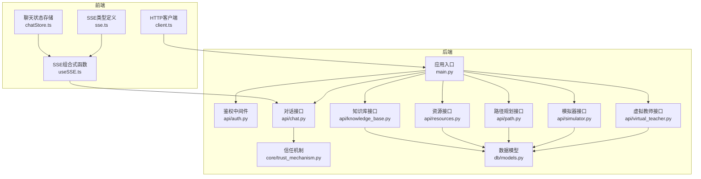
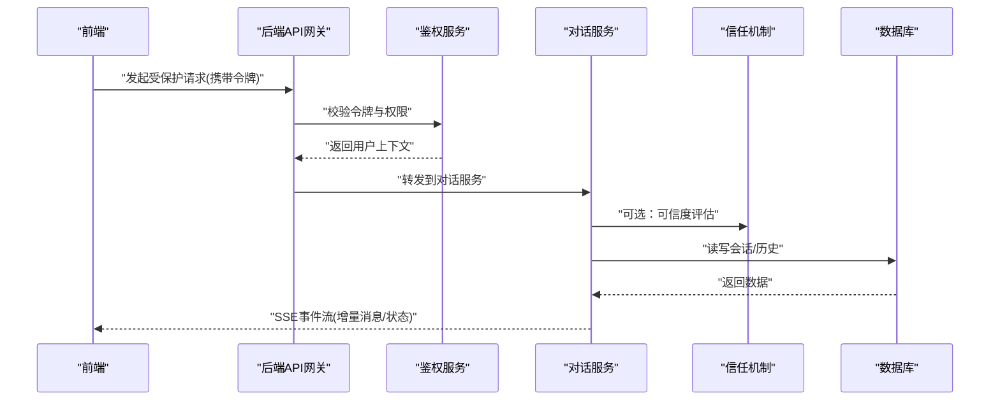
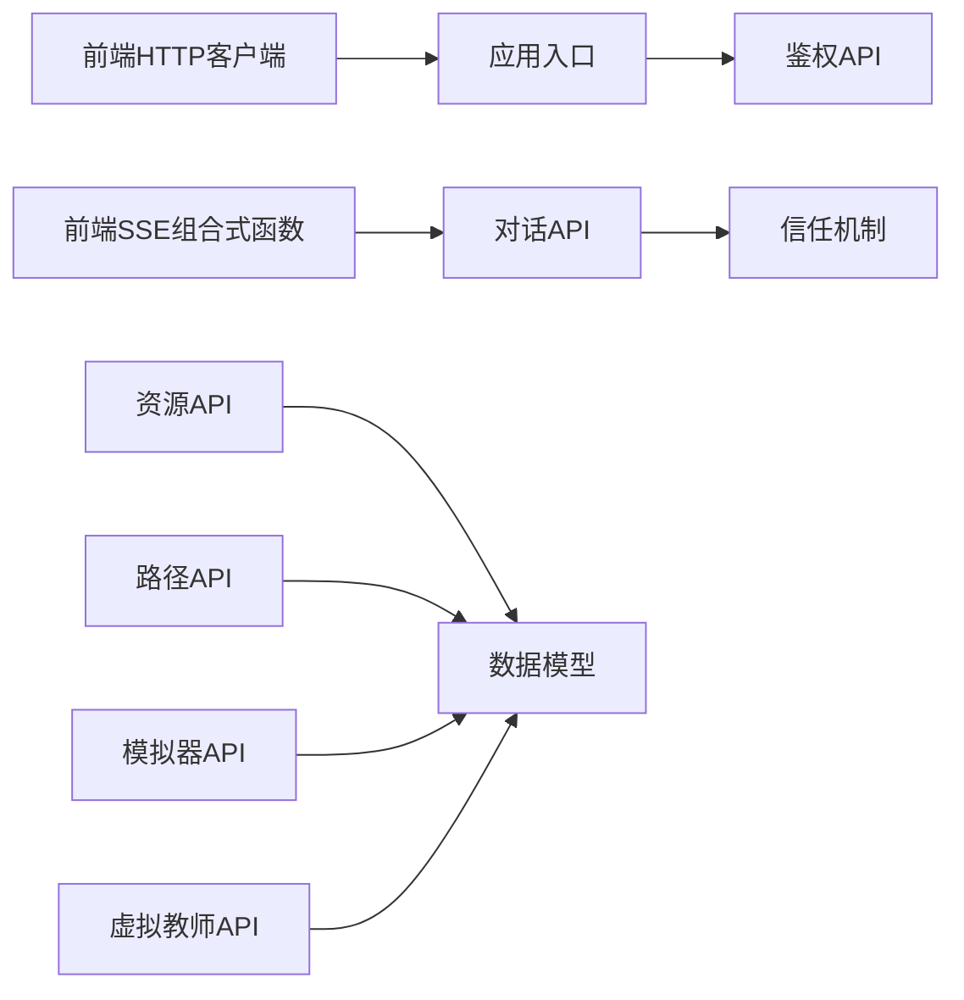

# 智能体通信协议

<cite>
**本文引用的文件**   
- [src/loopse/main.py](file://src/loopse/main.py)
- [src/loopse/api/auth.py](file://src/loopse/api/auth.py)
- [src/loopse/api/chat.py](file://src/loopse/api/chat.py)
- [src/loopse/api/knowledge_base.py](file://src/loopse/api/knowledge_base.py)
- [src/loopse/api/resources.py](file://src/loopse/api/resources.py)
- [src/loopse/api/path.py](file://src/loopse/api/path.py)
- [src/loopse/api/simulator.py](file://src/loopse/api/simulator.py)
- [src/loopse/api/virtual_teacher.py](file://src/loopse/api/virtual_teacher.py)
- [src/loopse/core/trust_mechanism.py](file://src/loopse/core/trust_mechanism.py)
- [src/loopse/db/models.py](file://src/loopse/db/models.py)
- [config/api_schema.yaml](file://config/api_schema.yaml)
- [frontend/src/types/sse.ts](file://frontend/src/types/sse.ts)
- [frontend/src/composables/useSSE.ts](file://frontend/src/composables/useSSE.ts)
- [frontend/src/stores/chatStore.ts](file://frontend/src/stores/chatStore.ts)
- [frontend/src/api/client.ts](file://frontend/src/api/client.ts)
- [frontend/src/api/mockInterceptor.ts](file://frontend/src/api/mockInterceptor.ts)
- [docs/architecture/Agent通信State设计.md](file://docs/architecture/Agent通信State设计.md)
</cite>

## 目录
1. [简介](#简介)
2. [项目结构](#项目结构)
3. [核心组件](#核心组件)
4. [架构总览](#架构总览)
5. [详细组件分析](#详细组件分析)
6. [依赖分析](#依赖分析)
7. [性能考虑](#性能考虑)
8. [故障排查指南](#故障排查指南)
9. [结论](#结论)
10. [附录](#附录)

## 简介
本文件面向开发者，系统化定义并文档化“智能体通信协议”。内容覆盖：
- 消息格式、事件类型与状态同步机制
- 异步消息传递、请求-响应模式、发布-订阅模式的实现要点
- 序列化格式、错误码定义与超时处理策略
- 通信安全、身份验证与权限控制
- 使用示例与调试工具建议

目标是在不暴露具体代码的前提下，提供可落地的协议规范与集成指引。

## 项目结构
后端以 FastAPI 风格 API 组织，前端通过 HTTP 与 SSE（Server-Sent Events）进行交互；核心通信能力由若干 API 模块与前端组合式函数共同实现。

图表来源
- [src/loopse/main.py](file://src/loopse/main.py)
- [src/loopse/api/auth.py](file://src/loopse/api/auth.py)
- [src/loopse/api/chat.py](file://src/loopse/api/chat.py)
- [src/loopse/api/knowledge_base.py](file://src/loopse/api/knowledge_base.py)
- [src/loopse/api/resources.py](file://src/loopse/api/resources.py)
- [src/loopse/api/path.py](file://src/loopse/api/path.py)
- [src/loopse/api/simulator.py](file://src/loopse/api/simulator.py)
- [src/loopse/api/virtual_teacher.py](file://src/loopse/api/virtual_teacher.py)
- [src/loopse/core/trust_mechanism.py](file://src/loopse/core/trust_mechanism.py)
- [src/loopse/db/models.py](file://src/loopse/db/models.py)
- [frontend/src/api/client.ts](file://frontend/src/api/client.ts)
- [frontend/src/composables/useSSE.ts](file://frontend/src/composables/useSSE.ts)
- [frontend/src/stores/chatStore.ts](file://frontend/src/stores/chatStore.ts)
- [frontend/src/types/sse.ts](file://frontend/src/types/sse.ts)

章节来源
- [src/loopse/main.py](file://src/loopse/main.py)
- [config/api_schema.yaml](file://config/api_schema.yaml)

## 核心组件
- 应用入口与路由挂载：负责注册各业务 API 与全局中间件（如鉴权）。
- 鉴权与安全：统一认证、令牌校验、权限范围检查。
- 对话与实时推送：基于 SSE 的流式事件通道，承载对话增量与系统事件。
- 领域 API：知识库、资源、路径规划、模拟器、虚拟教师等。
- 信任机制：对智能体行为与结果的可信度评估与标记。
- 数据模型：持久化实体与关系定义。
- 前端通信层：HTTP 客户端封装、SSE 连接管理、状态存储与类型约束。

章节来源
- [src/loopse/api/auth.py](file://src/loopse/api/auth.py)
- [src/loopse/api/chat.py](file://src/loopse/api/chat.py)
- [src/loopse/core/trust_mechanism.py](file://src/loopse/core/trust_mechanism.py)
- [src/loopse/db/models.py](file://src/loopse/db/models.py)
- [frontend/src/api/client.ts](file://frontend/src/api/client.ts)
- [frontend/src/composables/useSSE.ts](file://frontend/src/composables/useSSE.ts)
- [frontend/src/stores/chatStore.ts](file://frontend/src/stores/chatStore.ts)
- [frontend/src/types/sse.ts](file://frontend/src/types/sse.ts)

## 架构总览
整体采用“前端 HTTP + SSE”的双通道通信：
- 请求-响应：用于常规 CRUD 与任务触发（如生成资源、查询知识、执行模拟）。
- 发布-订阅：通过 SSE 将后端事件（对话片段、诊断进度、系统通知）推送到前端。
- 安全边界：所有受保护接口需携带有效凭据，并在服务端完成权限校验。

图表来源
- [src/loopse/api/auth.py](file://src/loopse/api/auth.py)
- [src/loopse/api/chat.py](file://src/loopse/api/chat.py)
- [src/loopse/core/trust_mechanism.py](file://src/loopse/core/trust_mechanism.py)
- [src/loopse/db/models.py](file://src/loopse/db/models.py)

## 详细组件分析

### 消息格式与事件类型
- 通用消息头
  - id：消息唯一标识（建议 UUID v4）
  - type：消息类型（见下）
  - ts：时间戳（ISO 8601）
  - src/dst：源/目的智能体或角色标识
  - trace_id：链路追踪 ID（跨服务调用时透传）
- 消息体
  - payload：业务负载（JSON），按不同 type 约定字段
- 事件类型（示例）
  - chat.message：对话消息（文本/结构化）
  - chat.progress：对话进度（步骤/阶段）
  - resource.generate：资源生成事件（开始/完成/失败）
  - path.plan：路径规划事件（计划变更）
  - sim.run：模拟器运行事件（开始/步进/结束）
  - system.alert：系统告警（错误/降级）
- 事件顺序与幂等
  - 同一会话内事件按 ts 排序
  - 客户端应基于 id 去重，避免重复渲染

章节来源
- [frontend/src/types/sse.ts](file://frontend/src/types/sse.ts)
- [frontend/src/composables/useSSE.ts](file://frontend/src/composables/useSSE.ts)
- [src/loopse/api/chat.py](file://src/loopse/api/chat.py)

### 异步消息传递（SSE）
- 连接建立
  - 客户端在鉴权后打开 SSE 端点，携带会话标识
- 事件推送
  - 服务端按业务事件持续推送 JSON 事件帧
- 断线重连
  - 客户端实现指数退避重连，保留最后已消费事件 id
- 背压与节流
  - 服务端可对高频事件合并或限流，保障稳定性

章节来源
- [frontend/src/composables/useSSE.ts](file://frontend/src/composables/useSSE.ts)
- [frontend/src/stores/chatStore.ts](file://frontend/src/stores/chatStore.ts)
- [src/loopse/api/chat.py](file://src/loopse/api/chat.py)

### 请求-响应模式
- 适用场景：一次性任务（查询、生成、计算）
- 典型流程
  - 客户端发送带令牌的 HTTP 请求
  - 服务端鉴权后执行业务逻辑
  - 返回标准响应体（含 code/message/data）
- 超时与重试
  - 客户端设置合理超时；服务端对长任务返回任务 ID，配合轮询或 SSE 回调

章节来源
- [frontend/src/api/client.ts](file://frontend/src/api/client.ts)
- [src/loopse/api/resources.py](file://src/loopse/api/resources.py)
- [src/loopse/api/path.py](file://src/loopse/api/path.py)
- [src/loopse/api/simulator.py](file://src/loopse/api/simulator.py)

### 发布-订阅模式
- 主题划分
  - 会话级：按会话 id 隔离
  - 领域级：如“资源生成”、“路径规划”
- 订阅者
  - 前端为默认订阅者；可扩展至其他智能体或服务
- 可靠性
  - 结合持久化事件日志，支持回放与补偿

章节来源
- [src/loopse/api/chat.py](file://src/loopse/api/chat.py)
- [src/loopse/api/resources.py](file://src/loopse/api/resources.py)
- [src/loopse/api/path.py](file://src/loopse/api/path.py)

### 序列化格式
- 传输编码：UTF-8 JSON
- 时间与时区：ISO 8601，统一 UTC
- 数值精度：金额/分数等使用字符串以避免浮点误差
- 大对象：分块传输或附件 URL 方式

章节来源
- [config/api_schema.yaml](file://config/api_schema.yaml)
- [frontend/src/types/sse.ts](file://frontend/src/types/sse.ts)

### 错误码定义
- 分类
  - 4xx：客户端错误（参数、鉴权、权限）
  - 5xx：服务端错误（内部异常、下游不可用）
- 常用码（示例）
  - 1000：成功
  - 1001：参数校验失败
  - 1002：未授权（令牌缺失/过期）
  - 1003：权限不足
  - 1004：资源不存在
  - 1005：速率限制
  - 2001：上游服务超时
  - 2002：上游服务不可用
  - 2003：内部错误
- 错误体
  - code：数字错误码
  - message：人类可读描述
  - details：结构化详情（可选）
  - trace_id：定位线索

章节来源
- [src/loopse/api/auth.py](file://src/loopse/api/auth.py)
- [src/loopse/api/chat.py](file://src/loopse/api/chat.py)

### 超时处理策略
- 客户端
  - 短请求：3-10s；长任务：30-120s 或改用任务ID+轮询/SSE
  - 指数退避重试，最大重试次数与抖动
- 服务端
  - 明确接口超时；对长任务采用异步队列+SSE 回调
  - 熔断与降级：下游不可用时快速失败并返回友好提示

章节来源
- [frontend/src/api/client.ts](file://frontend/src/api/client.ts)
- [src/loopse/api/simulator.py](file://src/loopse/api/simulator.py)

### 通信安全、身份验证与权限控制
- 身份验证
  - 基于令牌（如 JWT）的请求头携带
  - 服务端校验签名、有效期与受众
- 权限控制
  - 基于角色的访问控制（RBAC）或基于资源的细粒度权限
  - 会话级隔离：仅允许访问自身会话数据
- 传输安全
  - 强制 HTTPS；敏感字段加密或脱敏
- 审计与溯源
  - 记录关键操作与 trace_id，便于问题定位

章节来源
- [src/loopse/api/auth.py](file://src/loopse/api/auth.py)
- [src/loopse/core/trust_mechanism.py](file://src/loopse/core/trust_mechanism.py)

### 状态同步机制
- 会话状态
  - 客户端维护本地会话快照，与服务端增量事件对齐
- 一致性
  - 基于事件 id 的去重与顺序保证
  - 冲突解决：服务端权威，客户端最终一致
- 离线恢复
  - 重连后从最后已知事件 id 拉取增量

章节来源
- [frontend/src/stores/chatStore.ts](file://frontend/src/stores/chatStore.ts)
- [frontend/src/composables/useSSE.ts](file://frontend/src/composables/useSSE.ts)
- [docs/architecture/Agent通信State设计.md](file://docs/architecture/Agent通信State设计.md)

### 使用示例与调试工具
- 示例流程
  - 登录获取令牌 -> 发起对话 -> 接收 SSE 增量消息 -> 提交资源生成任务 -> 监听生成事件 -> 查看结果
- 调试建议
  - 启用 trace_id 透传，串联前后端日志
  - 前端网络面板观察 SSE 事件帧
  - 服务端开启结构化日志与慢请求告警

章节来源
- [frontend/src/api/client.ts](file://frontend/src/api/client.ts)
- [frontend/src/composables/useSSE.ts](file://frontend/src/composables/useSSE.ts)
- [src/loopse/api/chat.py](file://src/loopse/api/chat.py)

## 依赖分析
- 耦合关系
  - API 层依赖鉴权与信任机制
  - 业务 API 依赖数据模型与外部服务
  - 前端依赖统一的 HTTP 客户端与 SSE 组合式函数
- 外部依赖
  - 数据库、向量库、LLM 服务等（通过对应 API 抽象）

图表来源
- [src/loopse/main.py](file://src/loopse/main.py)
- [src/loopse/api/auth.py](file://src/loopse/api/auth.py)
- [src/loopse/api/chat.py](file://src/loopse/api/chat.py)
- [src/loopse/api/resources.py](file://src/loopse/api/resources.py)
- [src/loopse/api/path.py](file://src/loopse/api/path.py)
- [src/loopse/api/simulator.py](file://src/loopse/api/simulator.py)
- [src/loopse/api/virtual_teacher.py](file://src/loopse/api/virtual_teacher.py)
- [src/loopse/core/trust_mechanism.py](file://src/loopse/core/trust_mechanism.py)
- [src/loopse/db/models.py](file://src/loopse/db/models.py)
- [frontend/src/api/client.ts](file://frontend/src/api/client.ts)
- [frontend/src/composables/useSSE.ts](file://frontend/src/composables/useSSE.ts)

章节来源
- [src/loopse/main.py](file://src/loopse/main.py)
- [config/api_schema.yaml](file://config/api_schema.yaml)

## 性能考虑
- 事件合并与节流：对高频事件聚合，降低带宽与渲染压力
- 分页与游标：列表类接口使用游标分页
- 缓存策略：热点数据短期缓存，注意失效与一致性
- 连接复用：HTTP 连接池与 SSE 长连接保活
- 背压控制：当消费者处理缓慢时，服务端限速或丢弃低优先级事件

[本节为通用指导，无需特定文件引用]

## 故障排查指南
- 常见问题
  - 鉴权失败：检查令牌有效性与作用域
  - SSE 断连：确认网络与心跳；客户端实现重连
  - 事件乱序：核对 ts 与 id；确保客户端幂等处理
  - 超时频繁：调整超时阈值或改为异步任务
- 定位手段
  - 使用 trace_id 串联日志
  - 开启慢请求与错误率监控
  - 对比前后端时间戳，识别延迟瓶颈

章节来源
- [src/loopse/api/auth.py](file://src/loopse/api/auth.py)
- [frontend/src/composables/useSSE.ts](file://frontend/src/composables/useSSE.ts)
- [frontend/src/api/client.ts](file://frontend/src/api/client.ts)

## 结论
本协议定义了智能体间通信的消息格式、事件体系、状态同步与安全机制，并通过请求-响应与发布-订阅两种模式满足多样化场景。遵循本文档可实现高可用、可观测、易扩展的智能体通信体系。

[本节为总结性内容，无需特定文件引用]

## 附录
- 术语
  - 智能体：具备独立职责与能力的软件实体
  - 会话：一次端到端的交互上下文
  - 事件：不可变的状态变更记录
- 参考
  - 前端类型定义与 SSE 组合式函数
  - 后端鉴权与信任机制
  - 数据模型与 API 契约

章节来源
- [frontend/src/types/sse.ts](file://frontend/src/types/sse.ts)
- [frontend/src/composables/useSSE.ts](file://frontend/src/composables/useSSE.ts)
- [src/loopse/api/auth.py](file://src/loopse/api/auth.py)
- [src/loopse/core/trust_mechanism.py](file://src/loopse/core/trust_mechanism.py)
- [src/loopse/db/models.py](file://src/loopse/db/models.py)
- [config/api_schema.yaml](file://config/api_schema.yaml)