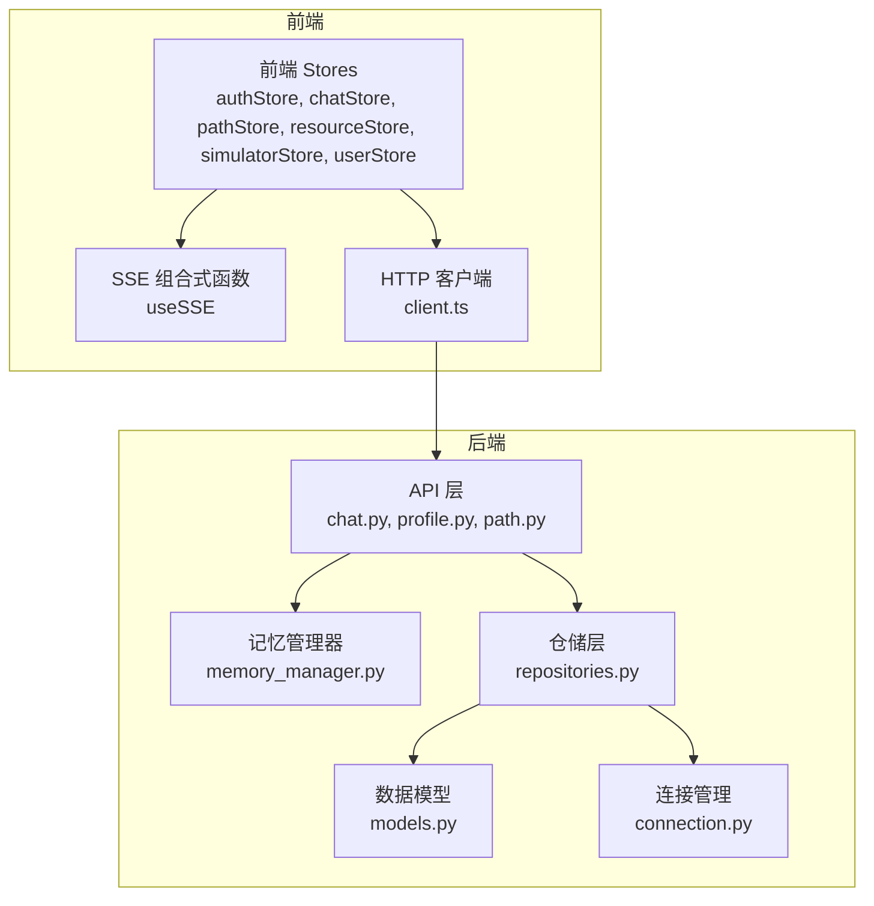
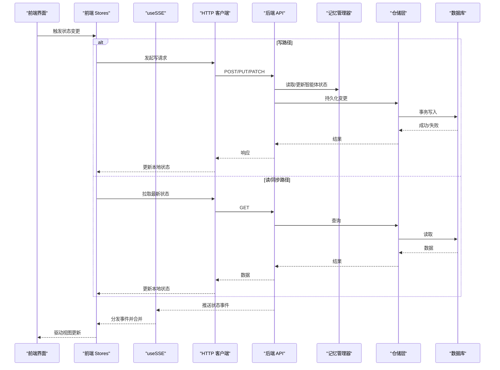
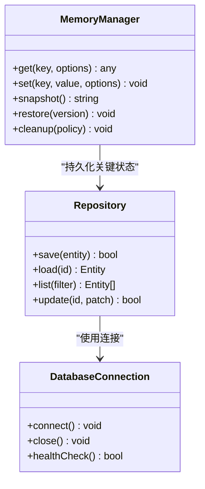
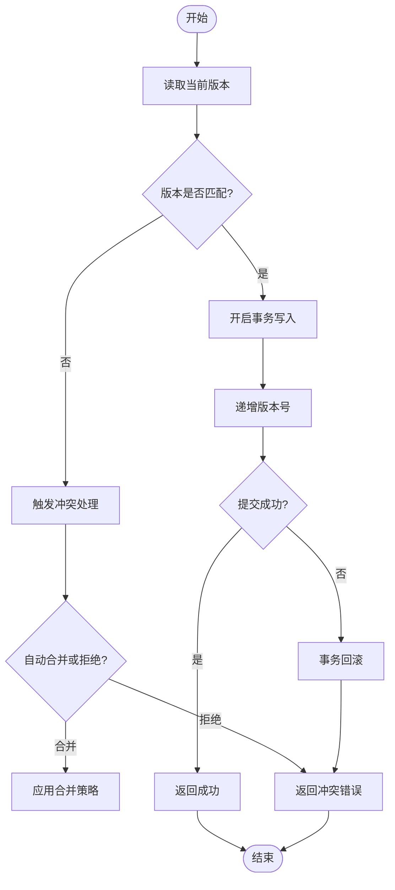
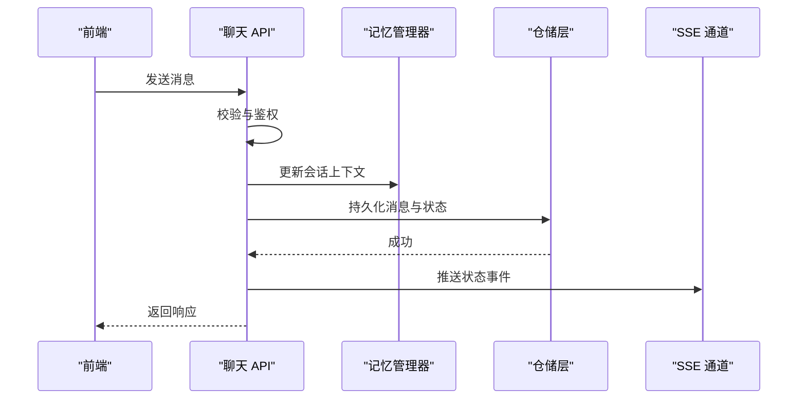
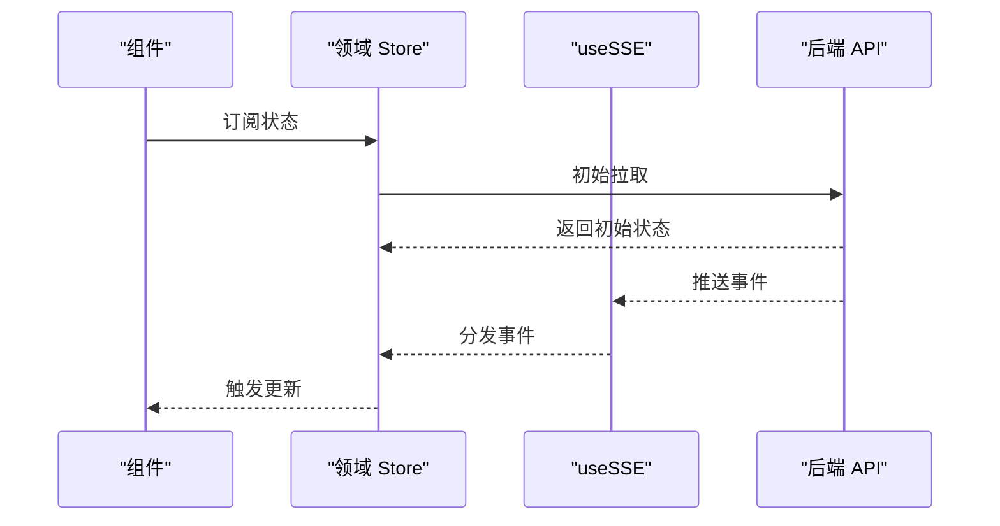
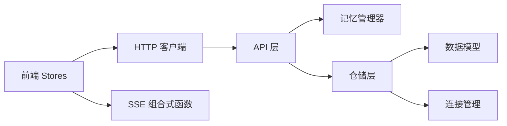

# 状态管理机制

<cite>
**本文引用的文件**   
- [src/loopse/agent/memory_manager.py](file://src/loopse/agent/memory_manager.py)
- [src/loopse/db/models.py](file://src/loopse/db/models.py)
- [src/loopse/db/repositories.py](file://src/loopse/db/repositories.py)
- [src/loopse/db/connection.py](file://src/loopse/db/connection.py)
- [src/loopse/api/chat.py](file://src/loopse/api/chat.py)
- [src/loopse/api/profile.py](file://src/loopse/api/profile.py)
- [src/loopse/api/path.py](file://src/loopse/api/path.py)
- [frontend/src/stores/authStore.ts](file://frontend/src/stores/authStore.ts)
- [frontend/src/stores/chatStore.ts](file://frontend/src/stores/chatStore.ts)
- [frontend/src/stores/pathStore.ts](file://frontend/src/stores/pathStore.ts)
- [frontend/src/stores/resourceStore.ts](file://frontend/src/stores/resourceStore.ts)
- [frontend/src/stores/simulatorStore.ts](file://frontend/src/stores/simulatorStore.ts)
- [frontend/src/stores/userStore.ts](file://frontend/src/stores/userStore.ts)
- [frontend/src/composables/useSSE.ts](file://frontend/src/composables/useSSE.ts)
- [frontend/src/api/client.ts](file://frontend/src/api/client.ts)
- [frontend/src/types/sse.ts](file://frontend/src/types/sse.ts)
- [docs/architecture/Agent通信State设计.md](file://docs/architecture/Agent通信State设计.md)
</cite>

## 目录
1. [引言](#引言)
2. [项目结构](#项目结构)
3. [核心组件](#核心组件)
4. [架构总览](#架构总览)
5. [详细组件分析](#详细组件分析)
6. [依赖关系分析](#依赖关系分析)
7. [性能考量](#性能考量)
8. [故障排查指南](#故障排查指南)
9. [结论](#结论)
10. [附录](#附录)

## 引言
本文件面向多智能体系统的“状态管理”主题，围绕共享状态的设计模式、持久化与一致性保证、版本控制与冲突解决、回滚策略、分布式同步、缓存与性能优化、查询接口、变更监听与事件通知等关键能力进行系统化说明。文档同时覆盖前后端实现要点，并提供最佳实践与常见问题解决方案，以确保在多智能体协作场景下的状态一致性与可观测性。

## 项目结构
本项目在前后端均实现了状态管理的不同层面：
- 后端（Python）：通过数据库模型与仓储层提供状态的持久化与事务保障；API 层暴露查询与更新接口；记忆管理器负责智能体侧的状态组织与生命周期管理。
- 前端（Vue/TS）：通过多个 Store 管理领域状态，结合 SSE 实现服务端推送的实时变更同步；HTTP 客户端统一封装请求与错误处理。

图表来源
- [src/loopse/api/chat.py](file://src/loopse/api/chat.py)
- [src/loopse/api/profile.py](file://src/loopse/api/profile.py)
- [src/loopse/api/path.py](file://src/loopse/api/path.py)
- [src/loopse/agent/memory_manager.py](file://src/loopse/agent/memory_manager.py)
- [src/loopse/db/models.py](file://src/loopse/db/models.py)
- [src/loopse/db/repositories.py](file://src/loopse/db/repositories.py)
- [src/loopse/db/connection.py](file://src/loopse/db/connection.py)
- [frontend/src/stores/authStore.ts](file://frontend/src/stores/authStore.ts)
- [frontend/src/stores/chatStore.ts](file://frontend/src/stores/chatStore.ts)
- [frontend/src/stores/pathStore.ts](file://frontend/src/stores/pathStore.ts)
- [frontend/src/stores/resourceStore.ts](file://frontend/src/stores/resourceStore.ts)
- [frontend/src/stores/simulatorStore.ts](file://frontend/src/stores/simulatorStore.ts)
- [frontend/src/stores/userStore.ts](file://frontend/src/stores/userStore.ts)
- [frontend/src/composables/useSSE.ts](file://frontend/src/composables/useSSE.ts)
- [frontend/src/api/client.ts](file://frontend/src/api/client.ts)

章节来源
- [docs/architecture/Agent通信State设计.md](file://docs/architecture/Agent通信State设计.md)

## 核心组件
- 记忆管理器（Memory Manager）
  - 职责：维护智能体运行期状态、上下文窗口、短期/长期记忆的组织与访问；为上层 API 提供状态读取与写入的抽象。
  - 关键点：线程安全、增量更新、过期清理、快照与回溯支持。
- 数据模型与仓储（Models & Repositories）
  - 职责：定义实体结构与约束；封装 CRUD、事务、索引与分页等通用操作；对外暴露一致的读写契约。
  - 关键点：幂等写入、乐观锁/版本号、审计字段（创建/更新时间）、软删除与归档。
- 连接管理（Connection）
  - 职责：数据库连接池、重试与超时、健康检查、迁移执行入口。
  - 关键点：连接泄漏防护、优雅关闭、慢查询日志。
- API 层（Chat/Profile/Path）
  - 职责：接收前端请求，调用记忆管理器或仓储层完成状态变更；返回标准化响应与错误码。
  - 关键点：输入校验、权限与范围控制、限流与熔断、审计日志。
- 前端 Stores
  - 职责：按领域划分状态（认证、聊天、路径、资源、仿真、用户），提供响应式订阅与本地缓存。
  - 关键点：状态去重、合并策略、离线优先与重试、UI 渲染节流。
- SSE 组合式函数（useSSE）
  - 职责：建立与服务端的事件流，解析并分发到对应 Store，驱动 UI 实时更新。
  - 关键点：断线重连、消息顺序、去抖与批处理、错误恢复。

章节来源
- [src/loopse/agent/memory_manager.py](file://src/loopse/agent/memory_manager.py)
- [src/loopse/db/models.py](file://src/loopse/db/models.py)
- [src/loopse/db/repositories.py](file://src/loopse/db/repositories.py)
- [src/loopse/db/connection.py](file://src/loopse/db/connection.py)
- [src/loopse/api/chat.py](file://src/loopse/api/chat.py)
- [src/loopse/api/profile.py](file://src/loopse/api/profile.py)
- [src/loopse/api/path.py](file://src/loopse/api/path.py)
- [frontend/src/stores/authStore.ts](file://frontend/src/stores/authStore.ts)
- [frontend/src/stores/chatStore.ts](file://frontend/src/stores/chatStore.ts)
- [frontend/src/stores/pathStore.ts](file://frontend/src/stores/pathStore.ts)
- [frontend/src/stores/resourceStore.ts](file://frontend/src/stores/resourceStore.ts)
- [frontend/src/stores/simulatorStore.ts](file://frontend/src/stores/simulatorStore.ts)
- [frontend/src/stores/userStore.ts](file://frontend/src/stores/userStore.ts)
- [frontend/src/composables/useSSE.ts](file://frontend/src/composables/useSSE.ts)

## 架构总览
下图展示了从前端到后端的完整状态流转路径，包括 HTTP 请求与 SSE 事件两条通道，以及数据库持久化与智能体记忆层的交互。

图表来源
- [src/loopse/api/chat.py](file://src/loopse/api/chat.py)
- [src/loopse/api/profile.py](file://src/loopse/api/profile.py)
- [src/loopse/api/path.py](file://src/loopse/api/path.py)
- [src/loopse/agent/memory_manager.py](file://src/loopse/agent/memory_manager.py)
- [src/loopse/db/repositories.py](file://src/loopse/db/repositories.py)
- [src/loopse/db/connection.py](file://src/loopse/db/connection.py)
- [frontend/src/composables/useSSE.ts](file://frontend/src/composables/useSSE.ts)
- [frontend/src/api/client.ts](file://frontend/src/api/client.ts)

## 详细组件分析

### 记忆管理器（Memory Manager）
- 设计要点
  - 分层记忆：工作记忆（短期）、情景记忆（会话级）、语义记忆（长期）。
  - 访问模式：键空间隔离（按会话/用户/智能体维度），时间窗口裁剪，热点缓存。
  - 并发控制：读写锁或原子操作，避免竞态条件。
  - 快照与回溯：定期快照，支持按版本回滚。
- 与仓储层协作
  - 将重要状态落库，确保崩溃恢复与跨进程共享。
  - 使用版本号/时间戳作为一致性凭证。

图表来源
- [src/loopse/agent/memory_manager.py](file://src/loopse/agent/memory_manager.py)
- [src/loopse/db/repositories.py](file://src/loopse/db/repositories.py)
- [src/loopse/db/connection.py](file://src/loopse/db/connection.py)

章节来源
- [src/loopse/agent/memory_manager.py](file://src/loopse/agent/memory_manager.py)

### 数据模型与仓储（Models & Repositories）
- 设计要点
  - 模型定义：字段类型、约束、索引、默认值、审计字段。
  - 仓储契约：统一的增删改查、分页、过滤、排序、事务边界。
  - 一致性：乐观锁（版本号）、幂等键、唯一约束。
- 版本控制与冲突解决
  - 版本号递增，写前比较当前版本，不一致则拒绝或合并。
  - 冲突检测：基于差异字段或全量比对，必要时触发人工确认或自动合并策略。
- 回滚策略
  - 事务内回滚：异常时整体撤销。
  - 应用层回滚：记录变更日志，支持按版本还原。

图表来源
- [src/loopse/db/models.py](file://src/loopse/db/models.py)
- [src/loopse/db/repositories.py](file://src/loopse/db/repositories.py)

章节来源
- [src/loopse/db/models.py](file://src/loopse/db/models.py)
- [src/loopse/db/repositories.py](file://src/loopse/db/repositories.py)

### 连接管理（Connection）
- 设计要点
  - 连接池：最大连接数、空闲回收、超时配置。
  - 健康检查：周期性探测，异常自动剔除。
  - 优雅关闭：等待活跃事务完成，释放资源。
- 可靠性
  - 重试与退避：网络抖动时的指数退避。
  - 慢查询日志：辅助定位性能瓶颈。

章节来源
- [src/loopse/db/connection.py](file://src/loopse/db/connection.py)

### API 层（Chat/Profile/Path）
- 设计要点
  - 路由与参数校验：统一校验中间件，错误码规范化。
  - 权限与范围：基于用户/会话/角色的访问控制。
  - 事件发布：状态变更后向 SSE 通道广播事件。
- 典型流程（以聊天为例）
  - 接收消息 -> 校验与鉴权 -> 更新会话状态 -> 持久化 -> 广播事件 -> 返回响应。

图表来源
- [src/loopse/api/chat.py](file://src/loopse/api/chat.py)
- [src/loopse/agent/memory_manager.py](file://src/loopse/agent/memory_manager.py)
- [src/loopse/db/repositories.py](file://src/loopse/db/repositories.py)

章节来源
- [src/loopse/api/chat.py](file://src/loopse/api/chat.py)
- [src/loopse/api/profile.py](file://src/loopse/api/profile.py)
- [src/loopse/api/path.py](file://src/loopse/api/path.py)

### 前端 Stores 与 SSE 同步
- 设计要点
  - 领域拆分：认证、聊天、路径、资源、仿真、用户等独立 Store，降低耦合。
  - 响应式订阅：组件仅订阅所需字段，减少不必要重渲染。
  - 本地缓存：离线可用，网络恢复后增量同步。
- SSE 事件处理
  - 断线重连：指数退避与心跳检测。
  - 事件合并：同键合并、去重、顺序保证。
  - 错误恢复：降级为轮询或提示用户。

图表来源
- [frontend/src/stores/chatStore.ts](file://frontend/src/stores/chatStore.ts)
- [frontend/src/stores/pathStore.ts](file://frontend/src/stores/pathStore.ts)
- [frontend/src/stores/resourceStore.ts](file://frontend/src/stores/resourceStore.ts)
- [frontend/src/stores/simulatorStore.ts](file://frontend/src/stores/simulatorStore.ts)
- [frontend/src/stores/userStore.ts](file://frontend/src/stores/userStore.ts)
- [frontend/src/stores/authStore.ts](file://frontend/src/stores/authStore.ts)
- [frontend/src/composables/useSSE.ts](file://frontend/src/composables/useSSE.ts)
- [frontend/src/api/client.ts](file://frontend/src/api/client.ts)
- [frontend/src/types/sse.ts](file://frontend/src/types/sse.ts)

章节来源
- [frontend/src/stores/authStore.ts](file://frontend/src/stores/authStore.ts)
- [frontend/src/stores/chatStore.ts](file://frontend/src/stores/chatStore.ts)
- [frontend/src/stores/pathStore.ts](file://frontend/src/stores/pathStore.ts)
- [frontend/src/stores/resourceStore.ts](file://frontend/src/stores/resourceStore.ts)
- [frontend/src/stores/simulatorStore.ts](file://frontend/src/stores/simulatorStore.ts)
- [frontend/src/stores/userStore.ts](file://frontend/src/stores/userStore.ts)
- [frontend/src/composables/useSSE.ts](file://frontend/src/composables/useSSE.ts)
- [frontend/src/api/client.ts](file://frontend/src/api/client.ts)
- [frontend/src/types/sse.ts](file://frontend/src/types/sse.ts)

## 依赖关系分析
- 组件耦合
  - API 层依赖记忆管理器与仓储层，仓储层依赖数据模型与连接管理。
  - 前端 Stores 依赖 HTTP 客户端与 SSE 组合式函数。
- 外部依赖
  - 数据库：用于持久化与事务。
  - SSE：用于实时事件推送。
- 潜在循环依赖
  - 应避免 API 直接依赖前端模块；记忆管理器不应反向依赖 API。

图表来源
- [frontend/src/stores/chatStore.ts](file://frontend/src/stores/chatStore.ts)
- [frontend/src/api/client.ts](file://frontend/src/api/client.ts)
- [frontend/src/composables/useSSE.ts](file://frontend/src/composables/useSSE.ts)
- [src/loopse/api/chat.py](file://src/loopse/api/chat.py)
- [src/loopse/agent/memory_manager.py](file://src/loopse/agent/memory_manager.py)
- [src/loopse/db/repositories.py](file://src/loopse/db/repositories.py)
- [src/loopse/db/models.py](file://src/loopse/db/models.py)
- [src/loopse/db/connection.py](file://src/loopse/db/connection.py)

章节来源
- [src/loopse/api/chat.py](file://src/loopse/api/chat.py)
- [src/loopse/agent/memory_manager.py](file://src/loopse/agent/memory_manager.py)
- [src/loopse/db/repositories.py](file://src/loopse/db/repositories.py)
- [src/loopse/db/models.py](file://src/loopse/db/models.py)
- [src/loopse/db/connection.py](file://src/loopse/db/connection.py)
- [frontend/src/stores/chatStore.ts](file://frontend/src/stores/chatStore.ts)
- [frontend/src/api/client.ts](file://frontend/src/api/client.ts)
- [frontend/src/composables/useSSE.ts](file://frontend/src/composables/useSSE.ts)

## 性能考量
- 后端
  - 索引与查询优化：对高频过滤字段建立复合索引；避免 N+1 查询。
  - 连接池调优：根据并发与延迟目标调整池大小与超时。
  - 批量写入：聚合小变更，减少事务开销。
  - 缓存策略：热点数据使用内存缓存（如 Redis），设置合理 TTL 与失效策略。
- 前端
  - 局部更新：仅订阅必要字段，避免整树重渲染。
  - 事件批处理：合并短时间内的大量事件，降低 UI 压力。
  - 懒加载与分页：按需加载历史数据，减少首屏负担。
  - 离线缓存：IndexedDB 或内存缓存，网络恢复后增量同步。

[本节为通用指导，不直接分析具体文件]

## 故障排查指南
- 常见症状
  - 状态不同步：前端未收到 SSE 事件或事件丢失。
  - 冲突频繁：并发写入导致版本不匹配。
  - 数据库连接异常：连接池耗尽或健康检查失败。
- 排查步骤
  - 检查 SSE 连接状态与重连逻辑，确认事件序列号与去重策略。
  - 查看仓储层事务日志与版本号变化，确认冲突处理分支。
  - 监控连接池指标（活跃/空闲/等待），评估是否需要扩容或优化查询。
- 恢复策略
  - 事件重放：基于事件流水号从最近一致点重放。
  - 版本回滚：按版本号恢复到上一稳定快照。
  - 降级模式：SSE 不可用时切换为短轮询。

章节来源
- [src/loopse/db/repositories.py](file://src/loopse/db/repositories.py)
- [src/loopse/db/connection.py](file://src/loopse/db/connection.py)
- [frontend/src/composables/useSSE.ts](file://frontend/src/composables/useSSE.ts)

## 结论
本状态管理机制通过“记忆管理器 + 仓储层 + 数据库”的后端三层与“领域 Store + SSE”的前端两层协同，实现了多智能体系统下的高内聚、低耦合与强一致。借助版本控制、冲突解决与回滚策略，系统在并发与异常场景下仍能提供可靠的状态服务。配合缓存与性能优化手段，可在大规模多智能体协作中保持稳定的用户体验与系统吞吐。

## 附录
- 术语表
  - 工作记忆：短期、会话级的上下文信息。
  - 情景记忆：与特定任务或对话相关的结构化记录。
  - 语义记忆：长期、跨会话的知识与偏好。
  - 乐观锁：基于版本号的并发控制机制。
  - SSE：服务器发送事件，用于单向实时推送。
- 参考设计文档
  - 智能体通信与状态设计说明

章节来源
- [docs/architecture/Agent通信State设计.md](file://docs/architecture/Agent通信State设计.md)