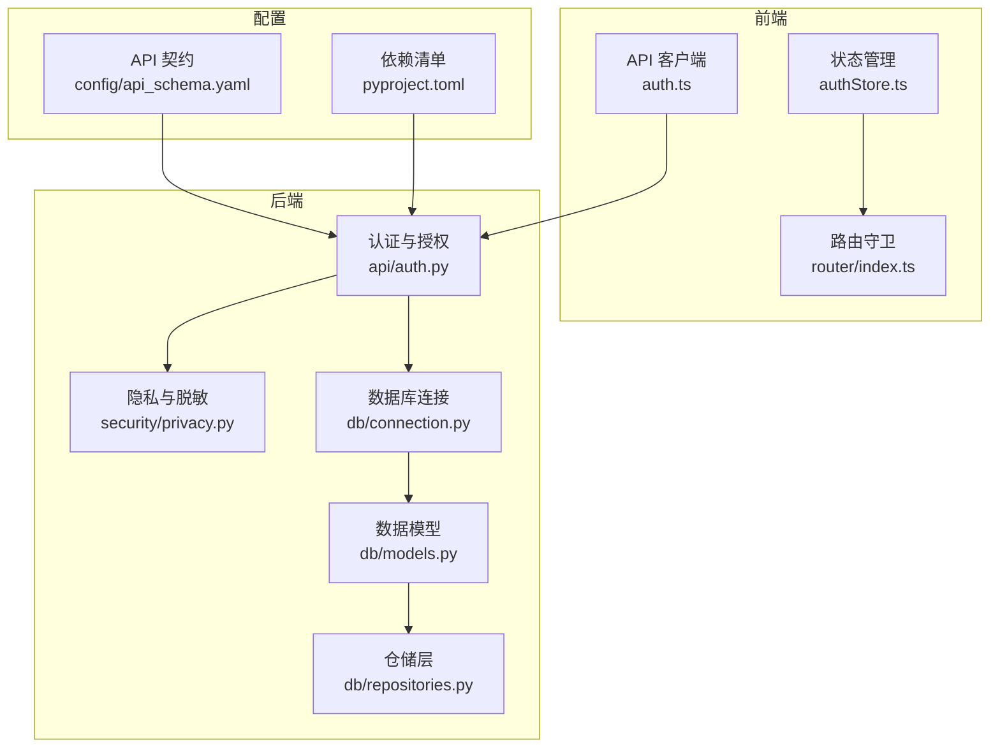
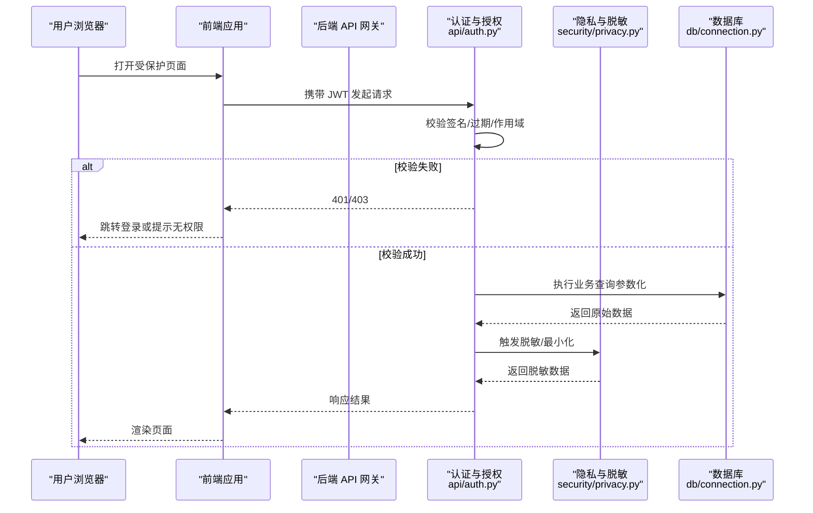
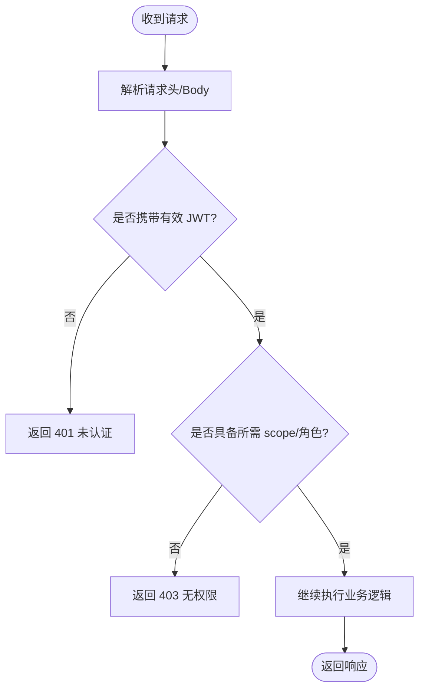
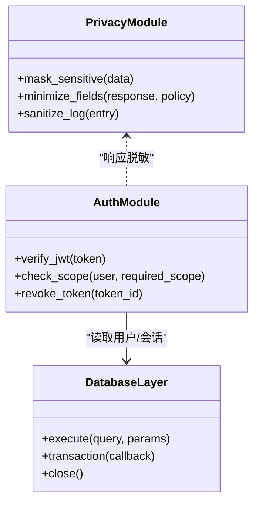
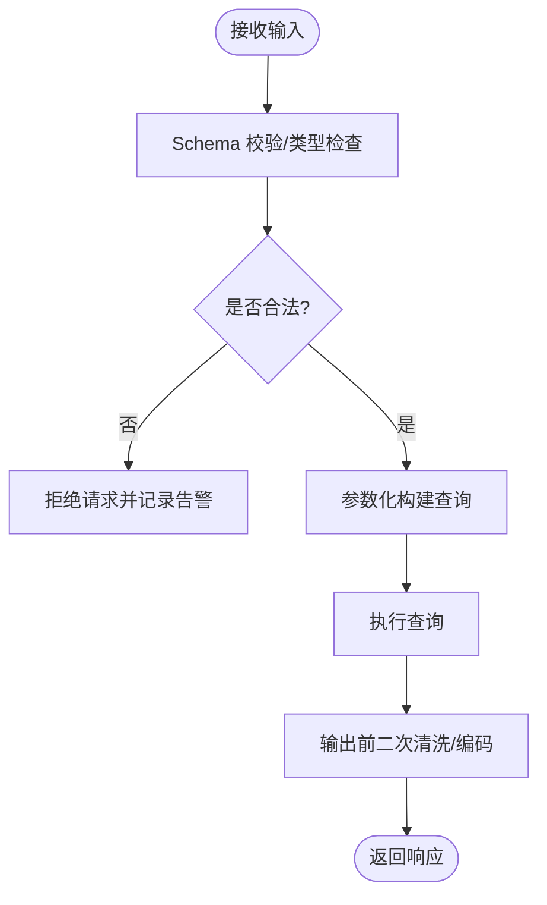
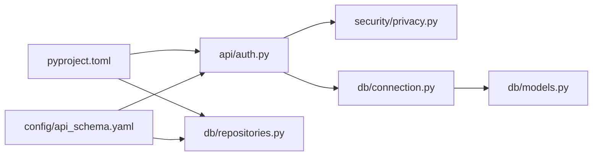

# 安全架构设计

<cite>
**本文引用的文件**   
- [src/loopse/api/auth.py](file://src/loopse/api/auth.py)
- [src/loopse/security/privacy.py](file://src/loopse/security/privacy.py)
- [src/loopse/db/connection.py](file://src/loopse/db/connection.py)
- [src/loopse/db/models.py](file://src/loopse/db/models.py)
- [src/loopse/db/repositories.py](file://src/loopse/db/repositories.py)
- [frontend/src/api/auth.ts](file://frontend/src/api/auth.ts)
- [frontend/src/stores/authStore.ts](file://frontend/src/stores/authStore.ts)
- [frontend/src/router/index.ts](file://frontend/src/router/index.ts)
- [config/api_schema.yaml](file://config/api_schema.yaml)
- [pyproject.toml](file://pyproject.toml)
</cite>

## 目录
1. [简介](#简介)
2. [项目结构](#项目结构)
3. [核心组件](#核心组件)
4. [架构总览](#架构总览)
5. [详细组件分析](#详细组件分析)
6. [依赖分析](#依赖分析)
7. [性能考虑](#性能考虑)
8. [故障排查指南](#故障排查指南)
9. [结论](#结论)
10. [附录](#附录)

## 简介
本文件面向安全工程师与运维人员，系统化梳理 Socrates-Cube 的安全架构设计与实现要点，覆盖身份认证、授权控制、数据安全（存储与传输）、输入校验与注入防护、XSS 防护、隐私保护、审计日志、漏洞扫描与安全监控等主题。文档基于仓库现有代码与配置进行客观描述，并给出可操作的实施建议与排障指引。

## 项目结构
从安全视角看，系统前后端职责清晰：
- 前端负责用户交互、令牌持久化与路由守卫、基础输入过滤与输出编码提示。
- 后端提供 API 网关、鉴权中间件、业务接口、数据库访问与隐私处理模块。
- 配置层定义 API 契约与依赖清单，便于统一治理。

图表来源
- [src/loopse/api/auth.py](file://src/loopse/api/auth.py)
- [src/loopse/security/privacy.py](file://src/loopse/security/privacy.py)
- [src/loopse/db/connection.py](file://src/loopse/db/connection.py)
- [src/loopse/db/models.py](file://src/loopse/db/models.py)
- [src/loopse/db/repositories.py](file://src/loopse/db/repositories.py)
- [frontend/src/api/auth.ts](file://frontend/src/api/auth.ts)
- [frontend/src/stores/authStore.ts](file://frontend/src/stores/authStore.ts)
- [frontend/src/router/index.ts](file://frontend/src/router/index.ts)
- [config/api_schema.yaml](file://config/api_schema.yaml)
- [pyproject.toml](file://pyproject.toml)

章节来源
- [src/loopse/api/auth.py](file://src/loopse/api/auth.py)
- [src/loopse/security/privacy.py](file://src/loopse/security/privacy.py)
- [src/loopse/db/connection.py](file://src/loopse/db/connection.py)
- [src/loopse/db/models.py](file://src/loopse/db/models.py)
- [src/loopse/db/repositories.py](file://src/loopse/db/repositories.py)
- [frontend/src/api/auth.ts](file://frontend/src/api/auth.ts)
- [frontend/src/stores/authStore.ts](file://frontend/src/stores/authStore.ts)
- [frontend/src/router/index.ts](file://frontend/src/router/index.ts)
- [config/api_schema.yaml](file://config/api_schema.yaml)
- [pyproject.toml](file://pyproject.toml)

## 核心组件
- 认证与授权（后端）
  - 负责登录/注册、JWT 签发与校验、权限范围（scope）检查、会话生命周期管理。
  - 关键路径：请求进入 -> 解析凭证 -> 验证签名/过期 -> 提取角色与 scope -> 放行或拒绝。
- 隐私与脱敏（后端）
  - 对敏感字段进行脱敏、最小化暴露；在返回前执行隐私策略。
- 数据库访问（后端）
  - 连接参数管理、SQL 构建与参数化查询、事务边界控制。
- 前端鉴权与路由守卫
  - 令牌存取、自动刷新、未登录跳转、受保护路由拦截。
- API 契约与依赖治理
  - 通过 API Schema 约束入参出参与错误码；通过依赖清单锁定版本，降低供应链风险。

章节来源
- [src/loopse/api/auth.py](file://src/loopse/api/auth.py)
- [src/loopse/security/privacy.py](file://src/loopse/security/privacy.py)
- [src/loopse/db/connection.py](file://src/loopse/db/connection.py)
- [src/loopse/db/models.py](file://src/loopse/db/models.py)
- [src/loopse/db/repositories.py](file://src/loopse/db/repositories.py)
- [frontend/src/api/auth.ts](file://frontend/src/api/auth.ts)
- [frontend/src/stores/authStore.ts](file://frontend/src/stores/authStore.ts)
- [frontend/src/router/index.ts](file://frontend/src/router/index.ts)
- [config/api_schema.yaml](file://config/api_schema.yaml)
- [pyproject.toml](file://pyproject.toml)

## 架构总览
下图展示一次典型受保护 API 的调用链路与安全控制点：

图表来源
- [src/loopse/api/auth.py](file://src/loopse/api/auth.py)
- [src/loopse/security/privacy.py](file://src/loopse/security/privacy.py)
- [src/loopse/db/connection.py](file://src/loopse/db/connection.py)

## 详细组件分析

### 认证与授权（JWT 与权限）
- 令牌管理
  - 登录成功后签发 JWT，包含必要声明（如用户标识、角色、scope），设置合理过期时间。
  - 前端将令牌保存在安全位置（优先 httpOnly Cookie；若使用 localStorage，需配合严格 CSP 与 XSS 防护）。
  - 支持刷新机制：短时效访问令牌 + 长时效刷新令牌，避免频繁重登。
- 权限验证流程
  - 每个受保护接口在入口处校验 JWT 有效性与作用域。
  - 基于角色的访问控制（RBAC）与基于资源的细粒度控制结合，必要时引入 scope 限制。
- 会话安全策略
  - 服务端维护会话黑名单/撤销列表以支持强制下线。
  - 跨站请求伪造（CSRF）防护：同源策略 + SameSite Cookie + CSRF Token。
  - 速率限制与异常登录检测，防止暴力破解与凭据填充。

图表来源
- [src/loopse/api/auth.py](file://src/loopse/api/auth.py)

章节来源
- [src/loopse/api/auth.py](file://src/loopse/api/auth.py)
- [frontend/src/api/auth.ts](file://frontend/src/api/auth.ts)
- [frontend/src/stores/authStore.ts](file://frontend/src/stores/authStore.ts)
- [frontend/src/router/index.ts](file://frontend/src/router/index.ts)

### 数据安全与隐私保护
- 数据传输安全
  - 全站 HTTPS，强制 HSTS，禁用弱加密套件，启用现代 TLS 版本。
  - 敏感 Header 与 Cookie 标记 Secure、HttpOnly、SameSite=Strict/Lax。
- 数据存储安全
  - 密码采用强哈希算法加盐存储（如 bcrypt/argon2），禁止明文。
  - 个人身份信息（PII）与密钥类数据按策略加密存储（AES-GCM/KMS）。
  - 数据库连接使用 TLS，最小权限原则，隔离读写账号。
- 隐私最小化与脱敏
  - 在响应前对敏感字段进行脱敏或裁剪，遵循“仅返回必要字段”的原则。
  - 日志中禁止记录敏感信息，必要时做掩码处理。

图表来源
- [src/loopse/security/privacy.py](file://src/loopse/security/privacy.py)
- [src/loopse/api/auth.py](file://src/loopse/api/auth.py)
- [src/loopse/db/connection.py](file://src/loopse/db/connection.py)

章节来源
- [src/loopse/security/privacy.py](file://src/loopse/security/privacy.py)
- [src/loopse/db/connection.py](file://src/loopse/db/connection.py)
- [src/loopse/db/models.py](file://src/loopse/db/models.py)
- [src/loopse/db/repositories.py](file://src/loopse/db/repositories.py)

### 输入验证与注入/XSS 防护
- 输入验证
  - 后端对所有入参进行类型、长度、格式与白名单校验，拒绝非法输入。
  - 使用 API Schema 作为契约驱动，生成校验器，减少手工遗漏。
- SQL 注入防护
  - 全部使用参数化查询/ORM 映射，禁止字符串拼接 SQL。
  - 数据库账户最小权限，关闭危险函数与扩展。
- XSS 防护
  - 前端输出上下文相关编码（HTML/JS/CSS/URL），禁用危险 API。
  - 配置严格 CSP，限制脚本来源与内联脚本，启用子资源完整性（SRI）。
  - 对富文本内容采用安全的白名单渲染库。

图表来源
- [config/api_schema.yaml](file://config/api_schema.yaml)
- [src/loopse/db/repositories.py](file://src/loopse/db/repositories.py)

章节来源
- [config/api_schema.yaml](file://config/api_schema.yaml)
- [src/loopse/db/repositories.py](file://src/loopse/db/repositories.py)

### 前端安全与令牌持久化
- 令牌存储
  - 推荐 httpOnly Cookie 存储访问令牌，避免被 JS 读取；若必须使用 localStorage，需强化 CSP 与 XSS 防护。
  - 刷新令牌轮换与绑定设备指纹/IP 段，降低泄露风险。
- 路由守卫
  - 全局前置守卫校验登录态与权限，未通过则跳转登录页或显示无权限提示。
- 网络请求
  - 统一拦截器附加令牌、超时与重试策略，屏蔽敏感错误堆栈回显。

章节来源
- [frontend/src/api/auth.ts](file://frontend/src/api/auth.ts)
- [frontend/src/stores/authStore.ts](file://frontend/src/stores/authStore.ts)
- [frontend/src/router/index.ts](file://frontend/src/router/index.ts)

### 安全审计日志与合规
- 审计事件
  - 登录/登出、权限变更、敏感数据访问、批量操作、异常与拒绝事件均需记录。
- 日志规范
  - 固定字段：时间戳、来源 IP、用户标识、动作、资源、结果、追踪 ID。
  - 禁止记录敏感数据；集中收集至不可篡改的审计存储。
- 合规与留存
  - 根据法规要求设定留存周期与访问控制，支持导出与取证。

章节来源
- [src/loopse/api/auth.py](file://src/loopse/api/auth.py)
- [src/loopse/security/privacy.py](file://src/loopse/security/privacy.py)

### 漏洞扫描与安全监控
- 漏洞扫描
  - 依赖漏洞扫描（SCA）、容器镜像扫描、SAST/DAST 流水线集成，阻断高危问题上线。
- 安全监控
  - 指标：认证失败率、越权尝试、慢查询、异常流量、证书到期。
  - 告警：阈值+趋势+关联规则，联动工单与自动化处置。
- 基线与加固
  - 操作系统/中间件/数据库基线核查，最小安装面，定期补丁更新。

章节来源
- [pyproject.toml](file://pyproject.toml)

## 依赖分析
- 外部依赖治理
  - 通过依赖清单锁定版本，启用依赖锁与签名校验，定期升级与回归测试。
  - 对第三方库进行 SBOM 管理与漏洞跟踪。
- 内部耦合
  - 认证模块依赖数据库与隐私模块；前端依赖后端认证与路由守卫；API Schema 贯穿前后端契约。

图表来源
- [pyproject.toml](file://pyproject.toml)
- [config/api_schema.yaml](file://config/api_schema.yaml)
- [src/loopse/api/auth.py](file://src/loopse/api/auth.py)
- [src/loopse/security/privacy.py](file://src/loopse/security/privacy.py)
- [src/loopse/db/connection.py](file://src/loopse/db/connection.py)
- [src/loopse/db/models.py](file://src/loopse/db/models.py)
- [src/loopse/db/repositories.py](file://src/loopse/db/repositories.py)

章节来源
- [pyproject.toml](file://pyproject.toml)
- [config/api_schema.yaml](file://config/api_schema.yaml)

## 性能考虑
- 认证开销
  - JWT 验签与缓存用户权限，避免每次全量查库；短 TTL + 刷新令牌降低负载。
- 数据库安全与性能平衡
  - 参数化查询不引入额外性能损耗；索引优化与只读副本分担查询压力。
- 脱敏与最小化
  - 仅在需要时执行脱敏；对热点接口采用预裁剪字段策略。
- 前端安全与体验
  - 令牌刷新与静默续期减少用户中断；CSP/SRI 适度放宽白名单以提升加载效率。

[本节为通用指导，无需特定文件引用]

## 故障排查指南
- 认证失败
  - 检查 JWT 签名、过期时间、作用域与前端传递方式（Header/Cookie）。
  - 核对服务端时钟同步与密钥轮换策略。
- 权限不足
  - 确认用户角色与资源 scope 匹配；检查 RBAC 配置与缓存一致性。
- 数据库连接异常
  - 校验连接串、TLS 证书、账号权限与防火墙策略。
- 日志缺失
  - 检查审计开关、写入权限与集中采集链路。
- 前端跨域/令牌丢失
  - 核对 CORS 配置、Cookie SameSite 与 Secure 标志；确认路由守卫逻辑。

章节来源
- [src/loopse/api/auth.py](file://src/loopse/api/auth.py)
- [src/loopse/db/connection.py](file://src/loopse/db/connection.py)
- [frontend/src/api/auth.ts](file://frontend/src/api/auth.ts)
- [frontend/src/router/index.ts](file://frontend/src/router/index.ts)

## 结论
本安全架构围绕“零信任”与“最小权限”原则，构建了端到端的认证授权、数据保护与隐私合规体系。通过 JWT 与 RBAC/Scope 控制、参数化查询与输入校验、HTTPS/TLS 与脱敏策略、以及审计与监控闭环，形成可落地、可演进的安全基线。建议在持续交付流水线中固化安全门禁，并以度量驱动持续改进。

[本节为总结性内容，无需特定文件引用]

## 附录
- 术语
  - JWT：JSON Web Token，用于无状态身份认证。
  - RBAC：基于角色的访问控制。
  - CSP：内容安全策略，用于缓解 XSS。
  - SCA/SAST/DAST：软件成分分析/静态/动态安全测试。
- 参考清单
  - 依赖与工具：参见依赖清单文件。
  - API 契约：参见 API Schema 文件。

章节来源
- [pyproject.toml](file://pyproject.toml)
- [config/api_schema.yaml](file://config/api_schema.yaml)