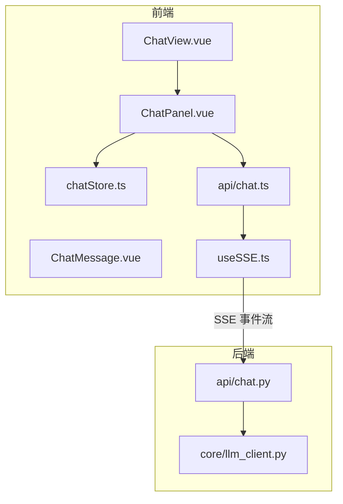
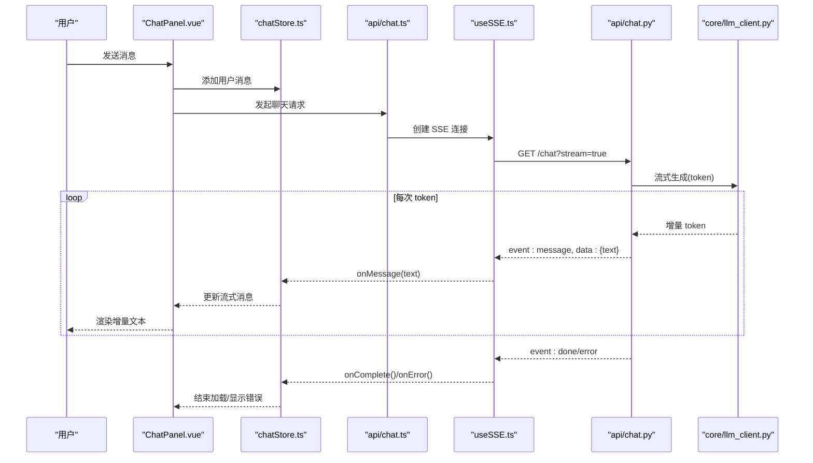
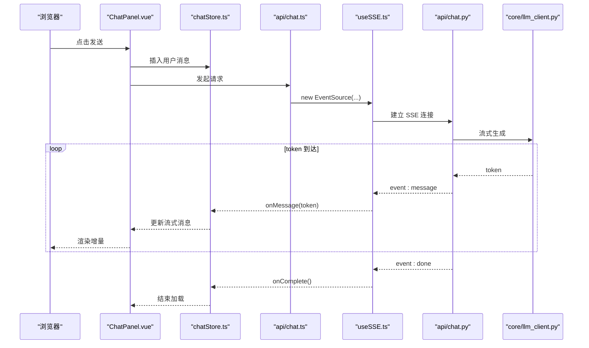
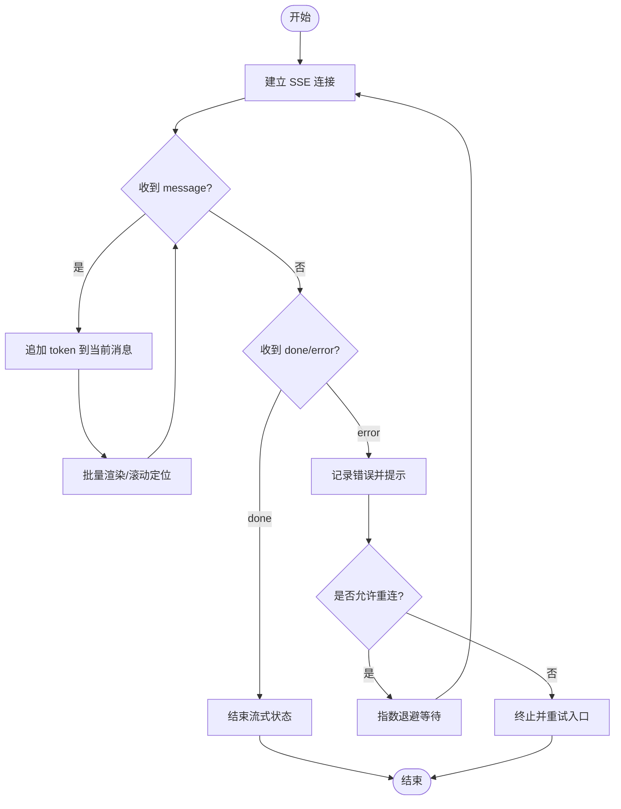
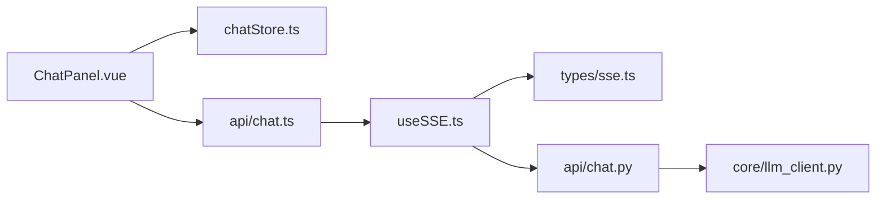

# 实时数据流处理

<cite>
**本文引用的文件**
- [src/loopse/api/chat.py](file://src/loopse/api/chat.py)
- [src/loopse/core/llm_client.py](file://src/loopse/core/llm_client.py)
- [frontend/src/composables/useSSE.ts](file://frontend/src/composables/useSSE.ts)
- [frontend/src/types/sse.ts](file://frontend/src/types/sse.ts)
- [frontend/src/stores/chatStore.ts](file://frontend/src/stores/chatStore.ts)
- [frontend/src/views/ChatView.vue](file://frontend/src/views/ChatView.vue)
- [frontend/src/components/ChatMessage.vue](file://frontend/src/components/ChatMessage.vue)
- [frontend/src/components/ChatPanel.vue](file://frontend/src/components/ChatPanel.vue)
- [frontend/src/api/chat.ts](file://frontend/src/api/chat.ts)
</cite>

## 目录
1. [简介](#简介)
2. [项目结构](#项目结构)
3. [核心组件](#核心组件)
4. [架构总览](#架构总览)
5. [详细组件分析](#详细组件分析)
6. [依赖关系分析](#依赖关系分析)
7. [性能与内存控制](#性能与内存控制)
8. [监控与可观测性](#监控与可观测性)
9. [故障排查指南](#故障排查指南)
10. [结论](#结论)

## 简介
本文件面向“实时数据流处理”主题，聚焦于系统中基于 SSE（Server-Sent Events）的实时通信机制、聊天系统的端到端对话流程、LLM 客户端的流式响应处理（token 级增量传输）、并发连接管理、内存控制与性能优化策略，以及调试工具与故障排查方法。文档以代码为依据，提供从前端到后端的完整链路说明，并给出可视化图示帮助理解。

## 项目结构
围绕实时数据流的关键位置如下：
- 后端 API 层：负责接收聊天请求、编排 Agent 工作流、调用 LLM 客户端并以 SSE 方式推送增量 token。
- LLM 客户端：封装对大模型的流式调用，支持逐 token 返回。
- 前端 SSE 客户端：维护与服务器的长连接，解析事件流，驱动消息渲染。
- 状态与视图：将增量内容合并到消息列表，实现打字机效果与错误提示。

图表来源
- [frontend/src/views/ChatView.vue](file://frontend/src/views/ChatView.vue)
- [frontend/src/components/ChatPanel.vue](file://frontend/src/components/ChatPanel.vue)
- [frontend/src/components/ChatMessage.vue](file://frontend/src/components/ChatMessage.vue)
- [frontend/src/stores/chatStore.ts](file://frontend/src/stores/chatStore.ts)
- [frontend/src/composables/useSSE.ts](file://frontend/src/composables/useSSE.ts)
- [frontend/src/api/chat.ts](file://frontend/src/api/chat.ts)
- [src/loopse/api/chat.py](file://src/loopse/api/chat.py)
- [src/loopse/core/llm_client.py](file://src/loopse/core/llm_client.py)

章节来源
- [src/loopse/api/chat.py](file://src/loopse/api/chat.py)
- [src/loopse/core/llm_client.py](file://src/loopse/core/llm_client.py)
- [frontend/src/composables/useSSE.ts](file://frontend/src/composables/useSSE.ts)
- [frontend/src/types/sse.ts](file://frontend/src/types/sse.ts)
- [frontend/src/stores/chatStore.ts](file://frontend/src/stores/chatStore.ts)
- [frontend/src/views/ChatView.vue](file://frontend/src/views/ChatView.vue)
- [frontend/src/components/ChatMessage.vue](file://frontend/src/components/ChatMessage.vue)
- [frontend/src/components/ChatPanel.vue](file://frontend/src/components/ChatPanel.vue)
- [frontend/src/api/chat.ts](file://frontend/src/api/chat.ts)

## 核心组件
- 后端聊天 API（SSE 服务端）
  - 职责：接收用户消息、构建上下文、调度 Agent 编排器、调用 LLM 客户端获取增量 token，并通过 SSE 通道逐步推送至前端。
  - 关键点：连接生命周期管理、事件类型定义、错误事件推送、超时与取消处理。
- LLM 客户端（流式调用）
  - 职责：封装对大模型服务的流式接口，按 token 或小块文本迭代产出结果。
  - 关键点：流式读取、异常捕获、重试与退避、资源释放。
- 前端 SSE 客户端
  - 职责：建立并维护 SSE 连接，解析事件流，触发回调更新 UI；实现断线重连与指数退避。
  - 关键点：事件类型映射、增量拼接、去抖/节流渲染、错误事件处理。
- 前端状态与视图
  - 职责：维护会话消息列表、当前流式消息片段、加载与错误状态；渲染打字机效果。
  - 关键点：消息追加策略、滚动定位、渲染批处理。

章节来源
- [src/loopse/api/chat.py](file://src/loopse/api/chat.py)
- [src/loopse/core/llm_client.py](file://src/loopse/core/llm_client.py)
- [frontend/src/composables/useSSE.ts](file://frontend/src/composables/useSSE.ts)
- [frontend/src/stores/chatStore.ts](file://frontend/src/stores/chatStore.ts)
- [frontend/src/components/ChatMessage.vue](file://frontend/src/components/ChatMessage.vue)
- [frontend/src/components/ChatPanel.vue](file://frontend/src/components/ChatPanel.vue)

## 架构总览
下图展示了从用户输入到 AI 响应的完整数据链路，包括 SSE 连接建立、增量 token 推送、前端渲染与错误重连流程。

图表来源
- [frontend/src/components/ChatPanel.vue](file://frontend/src/components/ChatPanel.vue)
- [frontend/src/stores/chatStore.ts](file://frontend/src/stores/chatStore.ts)
- [frontend/src/api/chat.ts](file://frontend/src/api/chat.ts)
- [frontend/src/composables/useSSE.ts](file://frontend/src/composables/useSSE.ts)
- [src/loopse/api/chat.py](file://src/loopse/api/chat.py)
- [src/loopse/core/llm_client.py](file://src/loopse/core/llm_client.py)

## 详细组件分析

### 后端聊天 API（SSE 服务端）
- 功能要点
  - 接收聊天请求参数（如用户消息、会话标识、系统提示等）。
  - 调用编排器与 LLM 客户端，获取流式输出。
  - 将每个 token 包装为 SSE 事件（例如 event: message），并在完成或出错时发送 event: done 或 event: error。
  - 管理连接生命周期：在客户端断开或请求取消时及时释放资源。
- 关键设计
  - 事件类型约定：message/done/error，便于前端统一解析。
  - 错误传播：上游异常转换为 error 事件，包含错误码与简要信息。
  - 超时与取消：结合框架能力设置超时，避免长时间占用资源。
- 性能考虑
  - 尽量小粒度推送 token，减少首字延迟。
  - 避免在事件循环中执行阻塞操作。

章节来源
- [src/loopse/api/chat.py](file://src/loopse/api/chat.py)

### LLM 客户端（流式调用）
- 功能要点
  - 封装对大模型服务的流式接口，按 token 或小块文本迭代产出。
  - 处理网络抖动、部分失败与重试逻辑。
  - 保证资源释放（关闭连接、清理缓冲）。
- 关键设计
  - 迭代协议：通过异步迭代器或回调方式逐个产出 token。
  - 错误边界：捕获并向上抛出结构化错误，供上层转为 SSE error 事件。
  - 配置项：最大重试次数、退避策略、超时时间等。
- 性能考虑
  - 使用零拷贝或最小化对象分配，降低 GC 压力。
  - 合理设置缓冲区大小，避免过多内存驻留。

章节来源
- [src/loopse/core/llm_client.py](file://src/loopse/core/llm_client.py)

### 前端 SSE 客户端（useSSE）
- 功能要点
  - 建立与服务器的 SSE 连接，监听 message/done/error 事件。
  - 解析事件体，调用注册的回调函数（onMessage/onComplete/onError）。
  - 实现断线检测与自动重连，采用指数退避与最大重试上限。
- 关键设计
  - 事件映射：将后端事件类型映射为前端回调。
  - 重连策略：等待时间随重试次数递增，避免雪崩。
  - 连接池：同一会话复用连接，避免频繁握手开销。
- 健壮性
  - 网络异常、跨域、证书问题等场景的错误提示与降级。
  - 心跳/保活：必要时通过 ping/pong 或定期空事件维持连接。

章节来源
- [frontend/src/composables/useSSE.ts](file://frontend/src/composables/useSSE.ts)
- [frontend/src/types/sse.ts](file://frontend/src/types/sse.ts)

### 前端状态与视图（chatStore、ChatPanel、ChatMessage）
- chatStore
  - 维护消息列表、当前流式消息片段、加载与错误状态。
  - 提供 addMessage、appendToken、finishStream、setError 等方法。
- ChatPanel
  - 触发发送动作，调用 API 建立 SSE 连接，绑定 store 更新。
  - 展示加载态与错误提示。
- ChatMessage
  - 渲染单条消息，支持增量文本更新与 Markdown 渲染。
  - 优化滚动定位与渲染批处理，避免频繁重排。
- 渲染优化
  - 增量拼接而非整段替换，减少 DOM 操作。
  - 防抖/节流：在高吞吐 token 下合并渲染批次。
  - 虚拟滚动：长对话场景下按需渲染可见区域。

章节来源
- [frontend/src/stores/chatStore.ts](file://frontend/src/stores/chatStore.ts)
- [frontend/src/components/ChatPanel.vue](file://frontend/src/components/ChatPanel.vue)
- [frontend/src/components/ChatMessage.vue](file://frontend/src/components/ChatMessage.vue)
- [frontend/src/views/ChatView.vue](file://frontend/src/views/ChatView.vue)

### 聊天系统端到端流程（时序图）

图表来源
- [frontend/src/components/ChatPanel.vue](file://frontend/src/components/ChatPanel.vue)
- [frontend/src/stores/chatStore.ts](file://frontend/src/stores/chatStore.ts)
- [frontend/src/api/chat.ts](file://frontend/src/api/chat.ts)
- [frontend/src/composables/useSSE.ts](file://frontend/src/composables/useSSE.ts)
- [src/loopse/api/chat.py](file://src/loopse/api/chat.py)
- [src/loopse/core/llm_client.py](file://src/loopse/core/llm_client.py)

### 错误与重连策略（流程图）

图表来源
- [frontend/src/composables/useSSE.ts](file://frontend/src/composables/useSSE.ts)
- [frontend/src/stores/chatStore.ts](file://frontend/src/stores/chatStore.ts)

## 依赖关系分析
- 模块耦合
  - ChatPanel 依赖 api/chat.ts 与 useSSE.ts；chatStore 被多个组件共享。
  - 后端 api/chat.py 依赖 core/llm_client.py。
- 外部依赖
  - 浏览器 EventSource 或自定义 fetch+SSE 解析器。
  - 大模型服务 SDK/HTTP 客户端（流式）。
- 潜在风险
  - 循环依赖：确保 store 不反向依赖视图组件。
  - 全局状态污染：严格限定状态变更入口。

图表来源
- [frontend/src/components/ChatPanel.vue](file://frontend/src/components/ChatPanel.vue)
- [frontend/src/stores/chatStore.ts](file://frontend/src/stores/chatStore.ts)
- [frontend/src/api/chat.ts](file://frontend/src/api/chat.ts)
- [frontend/src/composables/useSSE.ts](file://frontend/src/composables/useSSE.ts)
- [frontend/src/types/sse.ts](file://frontend/src/types/sse.ts)
- [src/loopse/api/chat.py](file://src/loopse/api/chat.py)
- [src/loopse/core/llm_client.py](file://src/loopse/core/llm_client.py)

## 性能与内存控制
- 后端
  - 小粒度推送：按 token 推送，降低首字延迟。
  - 非阻塞 I/O：避免在事件循环中执行 CPU 密集任务。
  - 资源回收：连接关闭时立即释放上下文与缓存。
- 前端
  - 增量渲染：仅更新变化节点，避免整段替换。
  - 渲染批处理：在高吞吐下合并多次写入，减少重排。
  - 虚拟滚动：长对话只渲染可视区，降低 DOM 压力。
  - 内存限制：限制历史消息数量与长度，过期清理。
- 网络
  - 连接复用：同会话复用 SSE 连接，减少握手成本。
  - 压缩与分块：启用 gzip/br，合理设置 chunk 大小。

[本节为通用指导，无需源码引用]

## 监控与可观测性
- 指标采集
  - 连接数、重连次数、平均首字延迟、端到端延迟分布。
  - 错误率（网络/服务端/解析错误）及错误分类。
- 日志与追踪
  - 前后端关联 ID：在一次请求内贯穿传递，便于串联日志。
  - 关键路径打点：连接建立、首次 token、完成、错误。
- 告警
  - 重连风暴、错误率突增、首字延迟超标等阈值告警。

[本节为通用指导，无需源码引用]

## 故障排查指南
- 常见问题
  - 无法建立 SSE 连接：检查跨域、代理、防火墙与证书。
  - 连接频繁断开：检查服务器超时、负载均衡保持连接设置。
  - 前端未渲染增量：确认事件类型映射与回调注册是否正确。
  - 内存泄漏：检查未关闭的连接、定时器与事件监听器。
- 定位步骤
  - 浏览器 Network 面板查看 SSE 连接与事件流。
  - 后端日志核对事件推送与错误堆栈。
  - 增加打点统计，观察重连与错误分布。
- 修复建议
  - 完善错误事件语义，统一错误码与消息。
  - 增加重试上限与退避策略，防止雪崩。
  - 引入连接健康检查与优雅关闭。

章节来源
- [frontend/src/composables/useSSE.ts](file://frontend/src/composables/useSSE.ts)
- [frontend/src/stores/chatStore.ts](file://frontend/src/stores/chatStore.ts)
- [src/loopse/api/chat.py](file://src/loopse/api/chat.py)

## 结论
本方案通过 SSE 实现了低延迟、高吞吐的实时对话体验。后端以 token 粒度推送，前端以增量渲染与批处理优化用户体验，配合稳健的重连与错误处理策略，保障在复杂网络环境下的可用性。建议在上线前完善监控与告警，持续跟踪关键指标，并根据业务规模调整连接与内存策略。