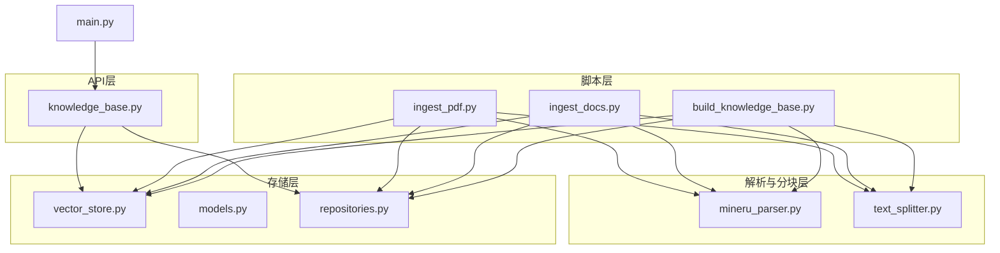
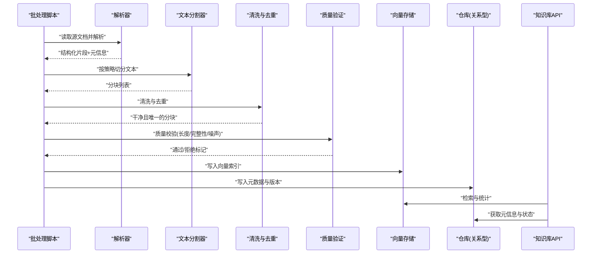
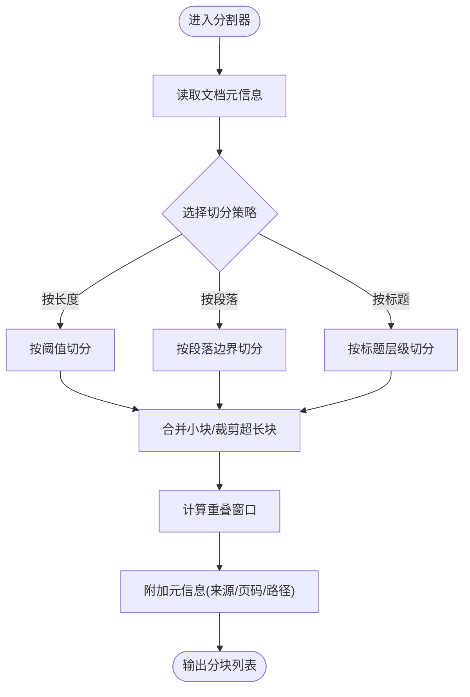
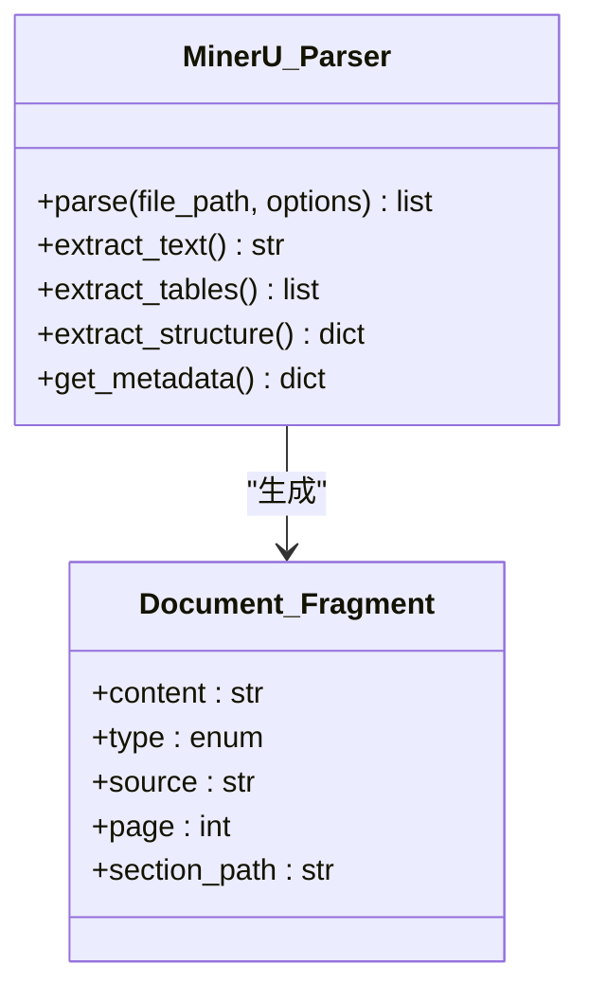
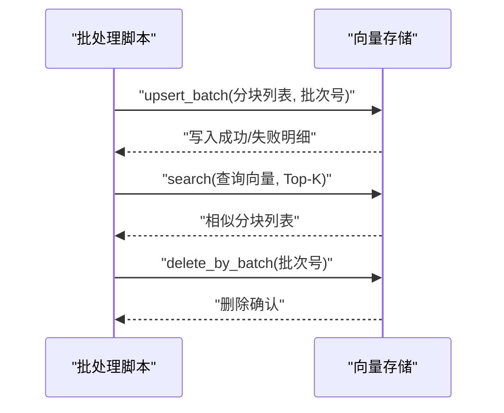
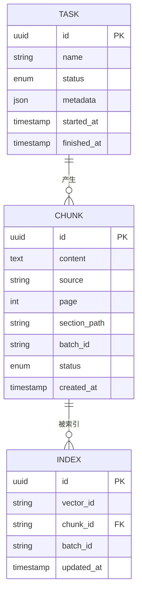
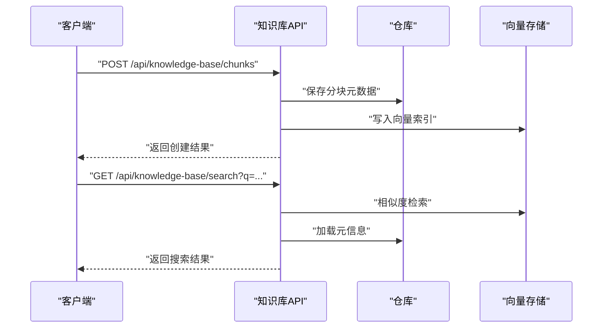
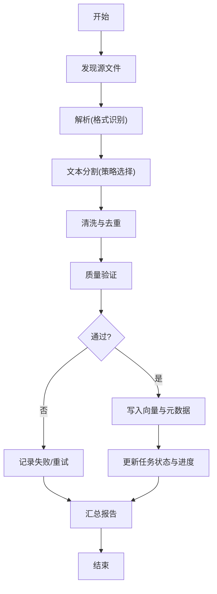
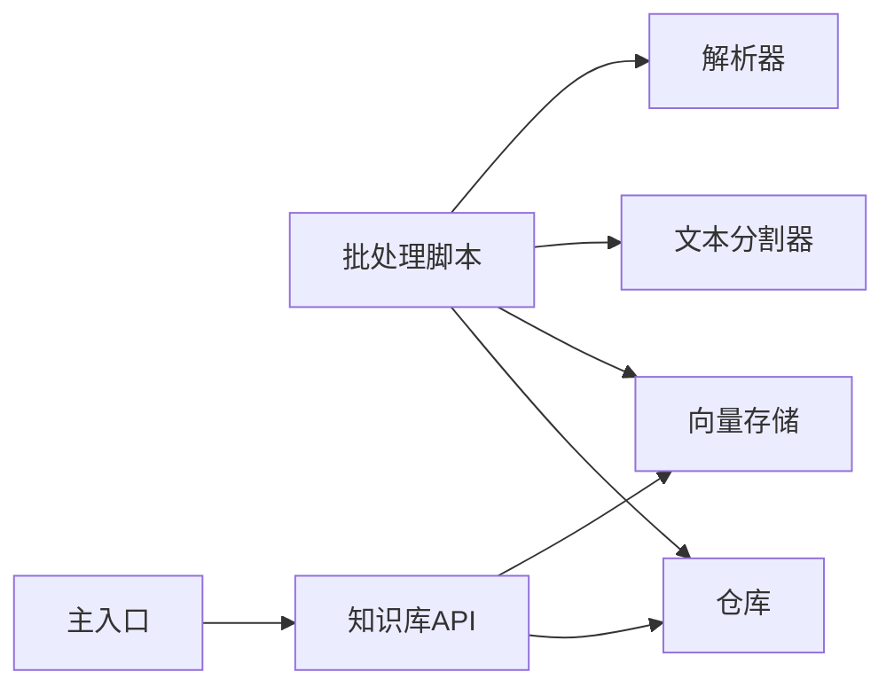

# 批数据处理流程

<cite>
**本文引用的文件**   
- [scripts/build_knowledge_base.py](file://scripts/build_knowledge_base.py)
- [scripts/ingest_docs.py](file://scripts/ingest_docs.py)
- [scripts/ingest_pdf.py](file://scripts/ingest_pdf.py)
- [src/loopse/kb/text_splitter.py](file://src/loopse/kb/text_splitter.py)
- [src/loopse/kb/mineru_parser.py](file://src/loopse/kb/mineru_parser.py)
- [src/loopse/kb/vector_store.py](file://src/loopse/kb/vector_store.py)
- [src/loopse/kb/knowledge_graph.py](file://src/loopse/kb/knowledge_graph.py)
- [src/loopse/api/knowledge_base.py](file://src/loopse/api/knowledge_base.py)
- [src/loopse/db/models.py](file://src/loopse/db/models.py)
- [src/loopse/db/repositories.py](file://src/loopse/db/repositories.py)
- [src/loopse/main.py](file://src/loopse/main.py)
</cite>

## 目录
1. [简介](#简介)
2. [项目结构](#项目结构)
3. [核心组件](#核心组件)
4. [架构总览](#架构总览)
5. [详细组件分析](#详细组件分析)
6. [依赖关系分析](#依赖关系分析)
7. [性能考虑](#性能考虑)
8. [故障排查指南](#故障排查指南)
9. [结论](#结论)
10. [附录](#附录)

## 简介
本文件面向知识库构建与文档解析的批处理流程，覆盖从数据摄入、格式解析、文本分割、清洗去重、质量校验到向量入库与知识图谱扩展的全链路。文档重点说明：
- 批量任务调度机制、进度跟踪与失败重试策略
- 文本分割算法的实现原理与配置项
- 多格式文档（PDF、Markdown、HTML等）的处理策略
- 数据清洗、去重与质量验证流程
- 大数据量处理的性能优化方案与分布式扩展能力
- 批处理脚本的使用指南与二次开发方法

## 项目结构
围绕批处理的核心代码主要分布在以下位置：
- 脚本层：提供一键构建知识库、批量导入文档/PDF、增量更新等入口
- 解析与分块层：统一解析器与文本分割器，支持多种输入格式与可配置切分策略
- 存储层：向量数据库与关系型模型，负责持久化与检索
- API层：对外暴露知识库管理接口，便于前端或外部系统调用
- 应用主入口：服务启动与路由挂载

图表来源
- [scripts/build_knowledge_base.py](file://scripts/build_knowledge_base.py)
- [scripts/ingest_docs.py](file://scripts/ingest_docs.py)
- [scripts/ingest_pdf.py](file://scripts/ingest_pdf.py)
- [src/loopse/kb/mineru_parser.py](file://src/loopse/kb/mineru_parser.py)
- [src/loopse/kb/text_splitter.py](file://src/loopse/kb/text_splitter.py)
- [src/loopse/kb/vector_store.py](file://src/loopse/kb/vector_store.py)
- [src/loopse/db/models.py](file://src/loopse/db/models.py)
- [src/loopse/db/repositories.py](file://src/loopse/db/repositories.py)
- [src/loopse/api/knowledge_base.py](file://src/loopse/api/knowledge_base.py)
- [src/loopse/main.py](file://src/loopse/main.py)

章节来源
- [scripts/build_knowledge_base.py](file://scripts/build_knowledge_base.py)
- [scripts/ingest_docs.py](file://scripts/ingest_docs.py)
- [scripts/ingest_pdf.py](file://scripts/ingest_pdf.py)
- [src/loopse/kb/text_splitter.py](file://src/loopse/kb/text_splitter.py)
- [src/loopse/kb/mineru_parser.py](file://src/loopse/kb/mineru_parser.py)
- [src/loopse/kb/vector_store.py](file://src/loopse/kb/vector_store.py)
- [src/loopse/db/models.py](file://src/loopse/db/models.py)
- [src/loopse/db/repositories.py](file://src/loopse/db/repositories.py)
- [src/loopse/api/knowledge_base.py](file://src/loopse/api/knowledge_base.py)
- [src/loopse/main.py](file://src/loopse/main.py)

## 核心组件
- 解析器（mineru_parser.py）：统一封装不同文档格式的解析逻辑，输出结构化文本片段与元信息，供后续分块使用。
- 文本分割器（text_splitter.py）：实现文本切分算法，支持按长度、段落、标题层级等多策略组合，并提供可配置参数。
- 向量存储（vector_store.py）：负责将分块后的文本向量化并写入向量库，同时提供检索接口。
- 数据模型与仓库（models.py, repositories.py）：定义持久化实体与访问抽象，支撑索引、版本、来源追踪等。
- 知识库API（knowledge_base.py）：暴露创建、更新、删除、查询等REST接口，供上层调用。
- 批处理脚本（build_knowledge_base.py, ingest_docs.py, ingest_pdf.py）：串联解析、分块、清洗、去重、入库等步骤，提供批量执行能力。

章节来源
- [src/loopse/kb/mineru_parser.py](file://src/loopse/kb/mineru_parser.py)
- [src/loopse/kb/text_splitter.py](file://src/loopse/kb/text_splitter.py)
- [src/loopse/kb/vector_store.py](file://src/loopse/kb/vector_store.py)
- [src/loopse/db/models.py](file://src/loopse/db/models.py)
- [src/loopse/db/repositories.py](file://src/loopse/db/repositories.py)
- [src/loopse/api/knowledge_base.py](file://src/loopse/api/knowledge_base.py)
- [scripts/build_knowledge_base.py](file://scripts/build_knowledge_base.py)
- [scripts/ingest_docs.py](file://scripts/ingest_docs.py)
- [scripts/ingest_pdf.py](file://scripts/ingest_pdf.py)

## 架构总览
下图展示了批处理端到端的数据流与控制流：脚本驱动解析与分块，清洗与去重在入库前完成，最终写入向量库与关系型存储；API层提供查询与管理能力。

图表来源
- [scripts/build_knowledge_base.py](file://scripts/build_knowledge_base.py)
- [scripts/ingest_docs.py](file://scripts/ingest_docs.py)
- [scripts/ingest_pdf.py](file://scripts/ingest_pdf.py)
- [src/loopse/kb/mineru_parser.py](file://src/loopse/kb/mineru_parser.py)
- [src/loopse/kb/text_splitter.py](file://src/loopse/kb/text_splitter.py)
- [src/loopse/kb/vector_store.py](file://src/loopse/kb/vector_store.py)
- [src/loopse/db/models.py](file://src/loopse/db/models.py)
- [src/loopse/db/repositories.py](file://src/loopse/db/repositories.py)
- [src/loopse/api/knowledge_base.py](file://src/loopse/api/knowledge_base.py)

## 详细组件分析

### 文本分割器（text_splitter.py）
- 设计目标：在保持语义连贯的前提下，将长文档切分为适合检索与生成的块。
- 关键能力：
  - 多策略切分：按字符/词数阈值、段落边界、标题层级、列表/表格区域保留等
  - 重叠窗口：相邻块之间设置重叠比例，减少跨段语义断裂
  - 元信息继承：为每个分块携带来源、页码、章节路径等上下文
- 复杂度分析：
  - 时间复杂度近似O(n)，n为文档字符数；重叠与合并操作带来常数级额外开销
  - 空间复杂度O(k)，k为分块数量与平均块大小
- 配置项建议：
  - 最大块长度、最小块长度、重叠率、是否按段落切分、是否保留标题层级
  - 针对PDF/HTML/Markdown的差异化策略开关
- 优化点：
  - 预扫描统计字符分布，动态调整阈值
  - 并行切分大块文档，降低单进程耗时

图表来源
- [src/loopse/kb/text_splitter.py](file://src/loopse/kb/text_splitter.py)

章节来源
- [src/loopse/kb/text_splitter.py](file://src/loopse/kb/text_splitter.py)

### 解析器（mineru_parser.py）
- 设计目标：统一多格式文档解析，输出标准化片段与元信息，屏蔽底层差异。
- 支持格式：
  - PDF：提取正文、表格、图片描述、页码与目录结构
  - Markdown：识别标题层级、列表、代码块与引用
  - HTML：清理标签、提取正文与导航结构
- 输出规范：
  - 片段内容、类型（正文/表格/列表/标题）、来源路径、页码、章节路径
- 错误处理：
  - 对损坏文件进行容错跳过，记录日志与失败清单
  - 提供重试与降级策略（如仅提取纯文本）

图表来源
- [src/loopse/kb/mineru_parser.py](file://src/loopse/kb/mineru_parser.py)

章节来源
- [src/loopse/kb/mineru_parser.py](file://src/loopse/kb/mineru_parser.py)

### 向量存储（vector_store.py）
- 职责：
  - 将分块文本向量化并写入向量库
  - 提供相似度检索、过滤与分页
  - 维护索引版本与批次号，便于回滚与增量更新
- 关键接口：
  - upsert_batch：批量写入，支持幂等键避免重复
  - search：按查询向量返回Top-K结果
  - delete_by_batch：按批次号删除，用于重建
- 一致性保障：
  - 事务性写入与失败重试
  - 写入后校验计数与哈希摘要

图表来源
- [src/loopse/kb/vector_store.py](file://src/loopse/kb/vector_store.py)

章节来源
- [src/loopse/kb/vector_store.py](file://src/loopse/kb/vector_store.py)

### 数据模型与仓库（models.py, repositories.py）
- 模型要点：
  - 分块实体：包含内容、来源、页码、章节路径、批次号、状态
  - 索引实体：包含向量ID、批次号、更新时间戳
  - 任务实体：记录批处理任务的开始/结束时间、状态、错误信息
- 仓库抽象：
  - 提供CRUD与批量操作，屏蔽具体数据库细节
  - 支持按批次号、来源、状态筛选与聚合统计

图表来源
- [src/loopse/db/models.py](file://src/loopse/db/models.py)
- [src/loopse/db/repositories.py](file://src/loopse/db/repositories.py)

章节来源
- [src/loopse/db/models.py](file://src/loopse/db/models.py)
- [src/loopse/db/repositories.py](file://src/loopse/db/repositories.py)

### 知识库API（knowledge_base.py）
- 功能范围：
  - 创建/更新/删除知识库条目
  - 查询分块与索引，支持过滤与分页
  - 触发批处理任务（可选），返回任务ID与进度
- 安全与鉴权：
  - 基于中间件的鉴权与权限控制
  - 审计日志记录关键操作

图表来源
- [src/loopse/api/knowledge_base.py](file://src/loopse/api/knowledge_base.py)

章节来源
- [src/loopse/api/knowledge_base.py](file://src/loopse/api/knowledge_base.py)

### 批处理脚本
- build_knowledge_base.py：
  - 一键构建知识库：拉取源数据、解析、分块、清洗、去重、入库、统计
  - 支持断点续跑与增量更新
- ingest_docs.py：
  - 批量导入文档（Markdown/HTML/文本），自动识别格式并解析
- ingest_pdf.py：
  - 批量导入PDF，提取正文、表格与目录，支持并发解析

图表来源
- [scripts/build_knowledge_base.py](file://scripts/build_knowledge_base.py)
- [scripts/ingest_docs.py](file://scripts/ingest_docs.py)
- [scripts/ingest_pdf.py](file://scripts/ingest_pdf.py)

章节来源
- [scripts/build_knowledge_base.py](file://scripts/build_knowledge_base.py)
- [scripts/ingest_docs.py](file://scripts/ingest_docs.py)
- [scripts/ingest_pdf.py](file://scripts/ingest_pdf.py)

### 应用主入口（main.py）
- 作用：
  - 初始化服务、挂载路由、注册中间件
  - 启动HTTP服务与后台任务调度（可选）
- 集成点：
  - 与知识库API、健康检查、日志与监控集成

章节来源
- [src/loopse/main.py](file://src/loopse/main.py)

## 依赖关系分析
- 模块耦合：
  - 脚本层依赖解析器、分割器、向量存储与仓库
  - API层依赖向量存储与仓库，提供查询与管理能力
  - 主入口聚合各模块，提供服务运行环境
- 外部依赖：
  - 向量数据库（嵌入与检索）
  - 关系型数据库（元数据与任务状态）
  - 文档解析库（PDF/Markdown/HTML）

图表来源
- [scripts/build_knowledge_base.py](file://scripts/build_knowledge_base.py)
- [scripts/ingest_docs.py](file://scripts/ingest_docs.py)
- [scripts/ingest_pdf.py](file://scripts/ingest_pdf.py)
- [src/loopse/kb/mineru_parser.py](file://src/loopse/kb/mineru_parser.py)
- [src/loopse/kb/text_splitter.py](file://src/loopse/kb/text_splitter.py)
- [src/loopse/kb/vector_store.py](file://src/loopse/kb/vector_store.py)
- [src/loopse/db/repositories.py](file://src/loopse/db/repositories.py)
- [src/loopse/api/knowledge_base.py](file://src/loopse/api/knowledge_base.py)
- [src/loopse/main.py](file://src/loopse/main.py)

章节来源
- [scripts/build_knowledge_base.py](file://scripts/build_knowledge_base.py)
- [scripts/ingest_docs.py](file://scripts/ingest_docs.py)
- [scripts/ingest_pdf.py](file://scripts/ingest_pdf.py)
- [src/loopse/kb/mineru_parser.py](file://src/loopse/kb/mineru_parser.py)
- [src/loopse/kb/text_splitter.py](file://src/loopse/kb/text_splitter.py)
- [src/loopse/kb/vector_store.py](file://src/loopse/kb/vector_store.py)
- [src/loopse/db/repositories.py](file://src/loopse/db/repositories.py)
- [src/loopse/api/knowledge_base.py](file://src/loopse/api/knowledge_base.py)
- [src/loopse/main.py](file://src/loopse/main.py)

## 性能考虑
- 解析阶段：
  - 并发解析：按CPU核数限制并发度，避免I/O争用
  - 流式读取：大文件采用流式解析，降低内存峰值
- 分块阶段：
  - 并行切分：对独立文档并行切分，共享分割策略配置
  - 动态阈值：根据文档密度与结构自适应调整块大小
- 清洗与去重：
  - 指纹去重：使用局部敏感哈希（LSH）或MinHash快速近似去重
  - 增量去重：结合批次号与内容摘要，避免全量比对
- 向量入库：
  - 批量写入：按批次大小分批提交，平衡吞吐与延迟
  - 幂等键：以内容摘要作为唯一键，避免重复写入
- 资源控制：
  - 限流与背压：对下游向量库与数据库进行限流保护
  - 指标采集：记录吞吐、延迟、失败率，指导容量规划

[本节为通用性能建议，不直接分析具体文件]

## 故障排查指南
- 常见问题定位：
  - 解析失败：检查文件格式与损坏情况，查看失败清单与日志
  - 分块异常：核对分割策略参数，确认重叠率与阈值设置
  - 去重误删：审查指纹算法与相似度阈值，必要时放宽条件
  - 入库失败：检查向量库连接与配额，重试与回滚批次
- 重试与恢复：
  - 指数退避重试：对瞬时错误进行重试，避免雪崩
  - 断点续跑：记录已处理批次与进度，支持从中断处继续
- 监控与告警：
  - 任务状态看板：展示成功/失败/重试次数
  - 质量指标：块长度分布、噪声比例、去重率

章节来源
- [scripts/build_knowledge_base.py](file://scripts/build_knowledge_base.py)
- [scripts/ingest_docs.py](file://scripts/ingest_docs.py)
- [scripts/ingest_pdf.py](file://scripts/ingest_pdf.py)
- [src/loopse/db/models.py](file://src/loopse/db/models.py)
- [src/loopse/db/repositories.py](file://src/loopse/db/repositories.py)

## 结论
本批处理流程以“解析-分块-清洗-去重-验证-入库”为主线，结合可配置的分割策略与稳健的错误处理，实现了高可用、可扩展的知识库构建流水线。通过并发与批量化优化，以及任务调度与进度跟踪，能够稳定支撑大规模文档处理需求。API层提供了便捷的管理与检索能力，便于上层系统集成与二次开发。

[本节为总结性内容，不直接分析具体文件]

## 附录

### 使用指南
- 构建知识库：
  - 运行构建脚本，指定源目录与输出配置
  - 观察任务进度与报告，处理失败清单中的异常文件
- 批量导入文档：
  - 使用文档导入脚本，支持Markdown/HTML/文本
  - 按需开启表格与目录提取选项
- 批量导入PDF：
  - 使用PDF导入脚本，设置并发度与内存上限
  - 启用OCR与表格识别（如需）

章节来源
- [scripts/build_knowledge_base.py](file://scripts/build_knowledge_base.py)
- [scripts/ingest_docs.py](file://scripts/ingest_docs.py)
- [scripts/ingest_pdf.py](file://scripts/ingest_pdf.py)

### 自定义开发方法
- 新增解析器：
  - 遵循统一输出规范，实现解析接口与元信息提取
  - 添加格式识别与容错处理
- 扩展分割策略：
  - 在分割器中注册新策略，提供配置项与默认值
  - 编写单元测试验证边界情况
- 接入新的向量库：
  - 实现向量存储接口，保证幂等与批量写入
  - 增加索引版本管理与回滚能力
- 扩展API：
  - 在知识库API中添加新端点，完善鉴权与审计
  - 提供OpenAPI文档与示例请求

章节来源
- [src/loopse/kb/mineru_parser.py](file://src/loopse/kb/mineru_parser.py)
- [src/loopse/kb/text_splitter.py](file://src/loopse/kb/text_splitter.py)
- [src/loopse/kb/vector_store.py](file://src/loopse/kb/vector_store.py)
- [src/loopse/api/knowledge_base.py](file://src/loopse/api/knowledge_base.py)