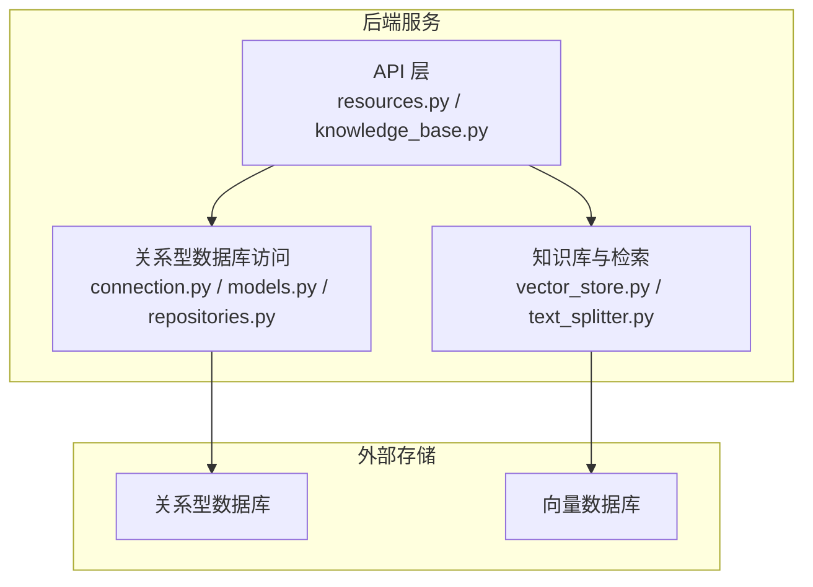
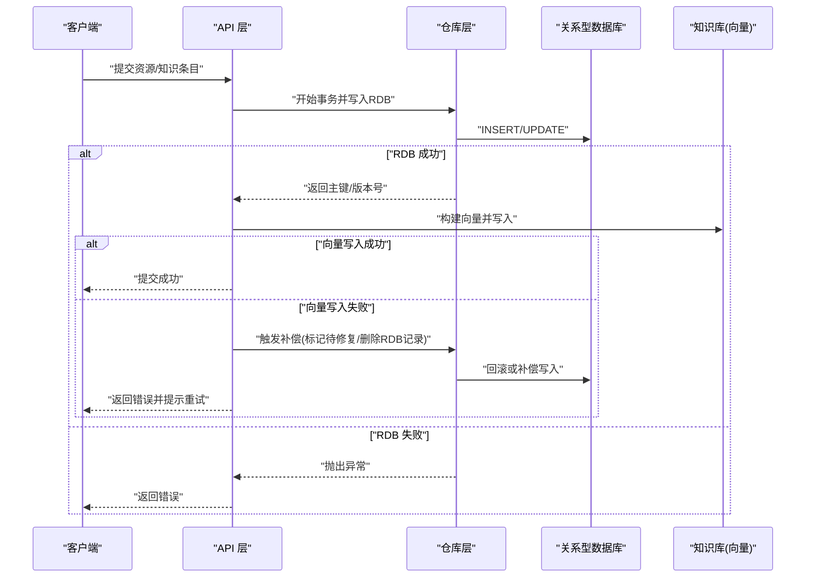
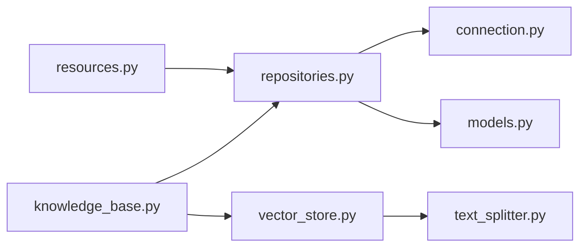

# 数据一致性保障

<cite>
**本文引用的文件**   
- [src/loopse/db/connection.py](file://src/loopse/db/connection.py)
- [src/loopse/db/models.py](file://src/loopse/db/models.py)
- [src/loopse/db/repositories.py](file://src/loopse/db/repositories.py)
- [src/loopse/kb/vector_store.py](file://src/loopse/kb/vector_store.py)
- [src/loopse/kb/text_splitter.py](file://src/loopse/kb/text_splitter.py)
- [src/loopse/api/resources.py](file://src/loopse/api/resources.py)
- [src/loopse/api/knowledge_base.py](file://src/loopse/api/knowledge_base.py)
- [scripts/init_db.py](file://scripts/init_db.py)
- [scripts/init_mysql.py](file://scripts/init_mysql.py)
- [scripts/sync_cloud_db.py](file://scripts/sync_cloud_db.py)
</cite>

## 目录
1. [引言](#引言)
2. [项目结构](#项目结构)
3. [核心组件](#核心组件)
4. [架构总览](#架构总览)
5. [详细组件分析](#详细组件分析)
6. [依赖关系分析](#依赖关系分析)
7. [性能考量](#性能考量)
8. [故障排查指南](#故障排查指南)
9. [结论](#结论)
10. [附录](#附录)

## 引言
本文件聚焦于多数据源环境下的数据一致性保障，覆盖关系型数据库与向量数据库的同步机制、事务处理设计（含跨服务事务与补偿事务）、并发控制策略（乐观锁与悲观锁）、数据版本管理与冲突解决、完整性校验与异常回滚策略，以及一致性监控与诊断工具的使用建议。文档面向工程实现与运维人员，力求在可操作性和可读性之间取得平衡。

## 项目结构
本项目在后端模块中采用分层组织：API 层暴露接口，领域逻辑位于 agents 与 core，数据存储通过 db 层访问关系型数据库，知识库与检索能力由 kb 层提供，其中包含向量存储与文本切分等能力。脚本目录提供初始化、种子数据与同步工具。

图表来源
- [src/loopse/api/resources.py](file://src/loopse/api/resources.py)
- [src/loopse/api/knowledge_base.py](file://src/loopse/api/knowledge_base.py)
- [src/loopse/db/connection.py](file://src/loopse/db/connection.py)
- [src/loopse/db/models.py](file://src/loopse/db/models.py)
- [src/loopse/db/repositories.py](file://src/loopse/db/repositories.py)
- [src/loopse/kb/vector_store.py](file://src/loopse/kb/vector_store.py)
- [src/loopse/kb/text_splitter.py](file://src/loopse/kb/text_splitter.py)

章节来源
- [src/loopse/db/connection.py](file://src/loopse/db/connection.py)
- [src/loopse/db/models.py](file://src/loopse/db/models.py)
- [src/loopse/db/repositories.py](file://src/loopse/db/repositories.py)
- [src/loopse/kb/vector_store.py](file://src/loopse/kb/vector_store.py)
- [src/loopse/kb/text_splitter.py](file://src/loopse/kb/text_splitter.py)
- [src/loopse/api/resources.py](file://src/loopse/api/resources.py)
- [src/loopse/api/knowledge_base.py](file://src/loopse/api/knowledge_base.py)

## 核心组件
- 关系型数据库连接与模型定义：负责连接管理、ORM 映射与基础查询封装。
- 仓库模式（Repositories）：对业务实体的增删改查进行统一封装，便于事务边界与重试策略的统一管理。
- 向量存储与文本切分：负责向量化入库、索引更新与检索；与关系型数据保持语义一致。
- API 资源与知识基座接口：协调关系型与向量库的写入顺序、失败补偿与幂等控制。

章节来源
- [src/loopse/db/connection.py](file://src/loopse/db/connection.py)
- [src/loopse/db/models.py](file://src/loopse/db/models.py)
- [src/loopse/db/repositories.py](file://src/loopse/db/repositories.py)
- [src/loopse/kb/vector_store.py](file://src/loopse/kb/vector_store.py)
- [src/loopse/kb/text_splitter.py](file://src/loopse/kb/text_splitter.py)
- [src/loopse/api/resources.py](file://src/loopse/api/resources.py)
- [src/loopse/api/knowledge_base.py](file://src/loopse/api/knowledge_base.py)

## 架构总览
下图展示了“写路径”的一致性流程：API 层先持久化关系型数据，成功后再异步或同步更新向量库；若任一阶段失败，执行补偿与回滚，保证最终一致性。

图表来源
- [src/loopse/api/resources.py](file://src/loopse/api/resources.py)
- [src/loopse/api/knowledge_base.py](file://src/loopse/api/knowledge_base.py)
- [src/loopse/db/repositories.py](file://src/loopse/db/repositories.py)
- [src/loopse/kb/vector_store.py](file://src/loopse/kb/vector_store.py)

## 详细组件分析

### 关系型数据库连接与模型
- 连接管理：集中配置连接池、超时与重试参数，确保在高并发下稳定可用。
- 模型定义：以 ORM 形式描述实体字段、约束与关联关系，为仓库层提供强类型访问。
- 事务边界：建议在仓库层方法上显式开启事务，将多个写操作纳入同一事务，避免中间状态泄露。

章节来源
- [src/loopse/db/connection.py](file://src/loopse/db/connection.py)
- [src/loopse/db/models.py](file://src/loopse/db/models.py)

### 仓库层与事务处理
- 统一封装：仓库层聚合单表或多表的读写逻辑，对外暴露原子性操作。
- 事务设计：
  - 本地事务：单个 RDB 实例内的多语句事务，保证 ACID。
  - 跨服务事务：通过消息队列或事件总线驱动的最终一致性方案，结合幂等键与去重表。
  - 补偿事务：当下游写入失败时，执行反向操作或标记“待修复”，由后台任务重试直至成功。
- 幂等与去重：为关键写入引入唯一键或幂等令牌，防止重复提交导致的数据不一致。

章节来源
- [src/loopse/db/repositories.py](file://src/loopse/db/repositories.py)

### 向量库与文本切分
- 文本切分：按段落/标题/长度阈值切分，保留元数据（如来源、时间戳、版本），以便后续对齐与回溯。
- 向量写入：
  - 同步写入：适用于低延迟场景，需考虑超时与重试。
  - 异步写入：通过任务队列削峰填谷，提升吞吐，但需保证顺序与幂等。
- 一致性策略：
  - 先 RDB 后向量：确保主数据优先落盘，向量作为二级索引。
  - 失败补偿：向量写入失败时，记录“待重建”标志，由定时任务扫描并重试。
  - 版本对齐：向量文档携带与 RDB 一致的版本号或更新时间戳，用于冲突检测。

章节来源
- [src/loopse/kb/vector_store.py](file://src/loopse/kb/vector_store.py)
- [src/loopse/kb/text_splitter.py](file://src/loopse/kb/text_splitter.py)

### API 资源与知识基座接口
- 资源接口：协调 RDB 与向量库的写入顺序，捕获异常并触发补偿。
- 知识基座接口：提供批量导入、增量更新与清理能力，支持断点续传与进度上报。
- 错误码与重试：定义统一的错误分类（网络、限流、数据校验、业务冲突），配合指数退避重试。

章节来源
- [src/loopse/api/resources.py](file://src/loopse/api/resources.py)
- [src/loopse/api/knowledge_base.py](file://src/loopse/api/knowledge_base.py)

### 并发控制策略
- 乐观锁：
  - 适用场景：读多写少、冲突概率低的热点数据。
  - 实现要点：在更新条件中加入版本号或更新时间戳，冲突时返回重试信号。
- 悲观锁：
  - 适用场景：写多读少、强一致要求高的关键路径。
  - 实现要点：使用行级锁或分布式锁，缩短持锁范围，避免长事务。
- 选择建议：默认采用乐观锁，必要时降级到悲观锁；对高冲突热点单独优化。

章节来源
- [src/loopse/db/repositories.py](file://src/loopse/db/repositories.py)

### 数据版本管理与冲突解决
- 版本字段：为每条记录维护版本号或更新时间戳，作为冲突检测依据。
- 冲突检测：比较客户端与服务端的版本，若服务端版本更高则拒绝合并并返回差异摘要。
- 冲突解决：
  - 自动策略：基于时间戳最新值胜出或字段级合并。
  - 人工介入：对重要数据启用审批流或人工确认。
- 审计追踪：记录版本变更历史，支持回溯与恢复。

章节来源
- [src/loopse/db/models.py](file://src/loopse/db/models.py)
- [src/loopse/db/repositories.py](file://src/loopse/db/repositories.py)

### 数据完整性校验
- 约束校验：在数据库层设置非空、唯一、外键等约束，作为最后一道防线。
- 应用层校验：在 API 入口进行格式、范围、依赖关系校验，减少无效写入。
- 向量一致性：确保向量文档的元数据与 RDB 记录一一对应，缺失则触发重建。

章节来源
- [src/loopse/db/models.py](file://src/loopse/db/models.py)
- [src/loopse/api/resources.py](file://src/loopse/api/resources.py)

### 异常处理与回滚策略
- 异常分类：区分可重试（网络抖动、限流）与不可重试（数据非法、权限不足）。
- 回滚策略：
  - 本地事务：发生异常立即回滚，释放锁与资源。
  - 跨服务：通过补偿事务或死信队列记录失败，后续重试或人工干预。
- 幂等保护：所有可重试写入必须幂等，避免重复执行造成二次副作用。

章节来源
- [src/loopse/api/resources.py](file://src/loopse/api/resources.py)
- [src/loopse/db/repositories.py](file://src/loopse/db/repositories.py)

### 数据一致性监控与诊断
- 指标采集：
  - 写入成功率、重试次数、平均耗时、P99/P999 延迟。
  - 向量库写入失败率、待重建任务积压量。
- 告警规则：
  - 连续失败超过阈值、重试耗尽、补偿任务长时间未消化。
- 诊断工具：
  - 查看最近失败的写入流水与堆栈。
  - 对比 RDB 与向量库的记录数与版本分布。
  - 定位热点冲突记录与高频重试接口。

章节来源
- [src/loopse/api/resources.py](file://src/loopse/api/resources.py)
- [src/loopse/api/knowledge_base.py](file://src/loopse/api/knowledge_base.py)

## 依赖关系分析
- 耦合关系：
  - API 层依赖仓库层与知识库层，形成清晰的职责边界。
  - 仓库层仅依赖连接与模型，降低与具体实现的耦合。
- 外部依赖：
  - 关系型数据库与向量数据库作为外部系统，需通过适配器与重试/熔断策略隔离不稳定因素。
- 潜在循环依赖：
  - 当前分层清晰，未见循环引用；新增功能时应遵循单向依赖原则。

图表来源
- [src/loopse/api/resources.py](file://src/loopse/api/resources.py)
- [src/loopse/api/knowledge_base.py](file://src/loopse/api/knowledge_base.py)
- [src/loopse/db/repositories.py](file://src/loopse/db/repositories.py)
- [src/loopse/db/connection.py](file://src/loopse/db/connection.py)
- [src/loopse/db/models.py](file://src/loopse/db/models.py)
- [src/loopse/kb/vector_store.py](file://src/loopse/kb/vector_store.py)
- [src/loopse/kb/text_splitter.py](file://src/loopse/kb/text_splitter.py)

章节来源
- [src/loopse/api/resources.py](file://src/loopse/api/resources.py)
- [src/loopse/api/knowledge_base.py](file://src/loopse/api/knowledge_base.py)
- [src/loopse/db/repositories.py](file://src/loopse/db/repositories.py)
- [src/loopse/db/connection.py](file://src/loopse/db/connection.py)
- [src/loopse/db/models.py](file://src/loopse/db/models.py)
- [src/loopse/kb/vector_store.py](file://src/loopse/kb/vector_store.py)
- [src/loopse/kb/text_splitter.py](file://src/loopse/kb/text_splitter.py)

## 性能考量
- 连接池与超时：合理设置最大连接数、空闲回收与请求超时，避免连接泄漏与雪崩。
- 批量写入：对向量库采用批量插入与压缩传输，降低往返开销。
- 异步与批处理：将非关键路径（如日志、统计）异步化，缩短主链路耗时。
- 缓存与预取：对热点只读数据引入缓存，减少数据库压力。
- 索引优化：为常用查询字段建立合适索引，避免全表扫描。

[本节为通用指导，不直接分析具体文件]

## 故障排查指南
- 常见问题定位：
  - 写入失败：检查连接池、超时与重试配置，查看错误码与堆栈。
  - 向量不一致：比对 RDB 与向量库记录数量与版本，定位缺失或过期条目。
  - 冲突频繁：分析热点数据与并发写入路径，评估是否需从乐观锁降级为悲观锁。
- 诊断步骤：
  - 拉取失败流水与重试计数，确认是否为瞬时问题。
  - 查看补偿任务队列积压情况，判断是否需要扩容或优化处理逻辑。
  - 核对幂等键与去重表，排除重复提交导致的脏数据。
- 恢复策略：
  - 对少量失败记录手动触发重试。
  - 对大规模不一致执行离线重建任务，逐步恢复一致性。

章节来源
- [src/loopse/api/resources.py](file://src/loopse/api/resources.py)
- [src/loopse/api/knowledge_base.py](file://src/loopse/api/knowledge_base.py)
- [src/loopse/db/repositories.py](file://src/loopse/db/repositories.py)

## 结论
在多数据源环境下，数据一致性需要贯穿“设计—实现—运行—监控”的全生命周期。通过明确的事务边界、幂等与补偿机制、合理的并发控制与版本管理，以及完善的监控与诊断手段，可以在保证可用性的同时达成最终一致性目标。建议在生产环境中持续压测与演练，验证一致性策略在不同负载与故障场景下的表现。

[本节为总结性内容，不直接分析具体文件]

## 附录

### 初始化与同步脚本参考
- 数据库初始化：提供建库、建表与初始数据的脚本，确保环境就绪。
- 云数据库同步：提供增量同步与全量迁移工具，支持断点续传与校验。

章节来源
- [scripts/init_db.py](file://scripts/init_db.py)
- [scripts/init_mysql.py](file://scripts/init_mysql.py)
- [scripts/sync_cloud_db.py](file://scripts/sync_cloud_db.py)