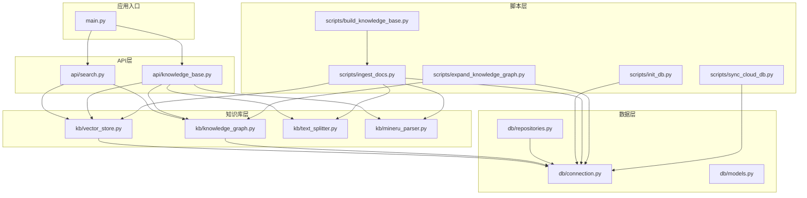
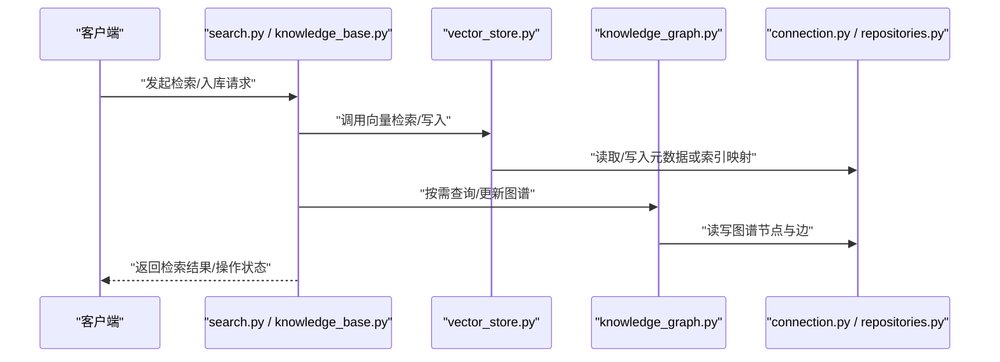
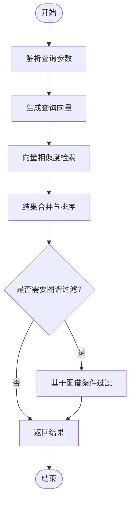
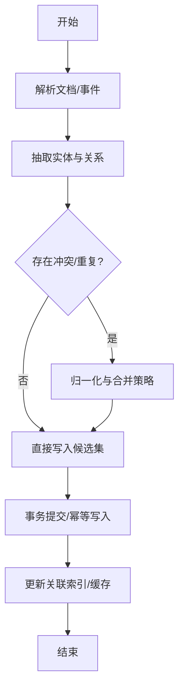
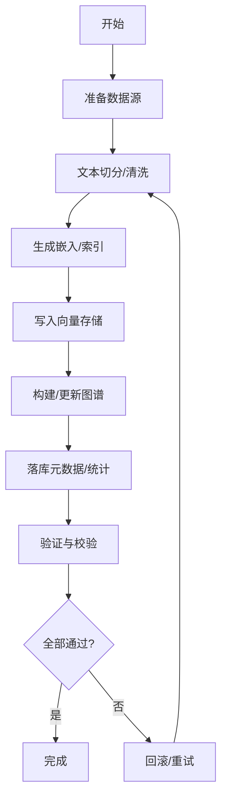
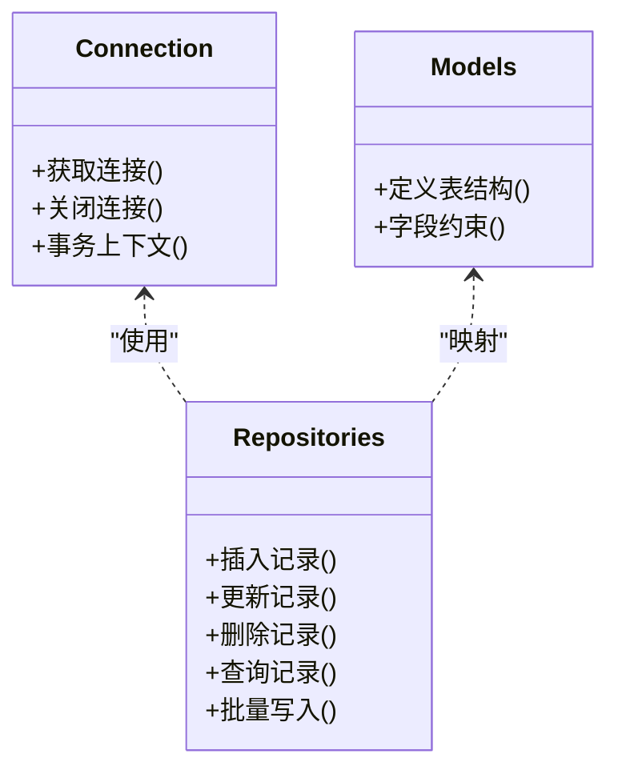
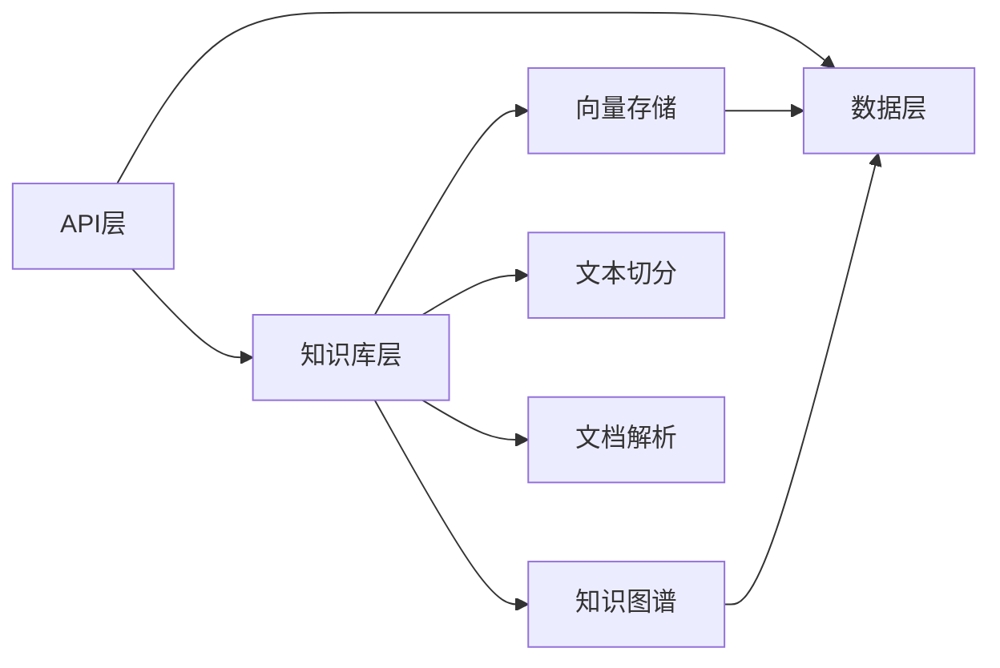

# 数据流架构设计

<cite>
**本文引用的文件**   
- [src/loopse/main.py](file://src/loopse/main.py)
- [src/loopse/db/connection.py](file://src/loopse/db/connection.py)
- [src/loopse/db/models.py](file://src/loopse/db/models.py)
- [src/loopse/db/repositories.py](file://src/loopse/db/repositories.py)
- [src/loopse/kb/vector_store.py](file://src/loopse/kb/vector_store.py)
- [src/loopse/kb/knowledge_graph.py](file://src/loopse/kb/knowledge_graph.py)
- [src/loopse/kb/text_splitter.py](file://src/loopse/kb/text_splitter.py)
- [src/loopse/kb/mineru_parser.py](file://src/loopse/kb/mineru_parser.py)
- [src/loopse/api/search.py](file://src/loopse/api/search.py)
- [src/loopse/api/knowledge_base.py](file://src/loopse/api/knowledge_base.py)
- [scripts/init_db.py](file://scripts/init_db.py)
- [scripts/ingest_docs.py](file://scripts/ingest_docs.py)
- [scripts/build_knowledge_base.py](file://scripts/build_knowledge_base.py)
- [scripts/expand_knowledge_graph.py](file://scripts/expand_knowledge_graph.py)
- [scripts/sync_cloud_db.py](file://scripts/sync_cloud_db.py)
</cite>

## 目录
1. [简介](#简介)
2. [项目结构](#项目结构)
3. [核心组件](#核心组件)
4. [架构总览](#架构总览)
5. [详细组件分析](#详细组件分析)
6. [依赖关系分析](#依赖关系分析)
7. [性能考虑](#性能考虑)
8. [故障排查指南](#故障排查指南)
9. [结论](#结论)
10. [附录](#附录)

## 简介
本文件面向数据工程师与DBA，系统性梳理 Socrates-Cube 的数据流架构，覆盖数据的产生、传输、存储与处理全流程；阐述实时数据流、批量数据处理与缓存策略；文档化数据库访问模式、向量检索流程与知识图谱更新机制；并给出数据一致性保证、事务处理与并发控制策略，以及备份恢复、性能监控与优化方案。

## 项目结构
后端服务以 FastAPI 为入口，围绕“Agent编排 + 知识库（向量+图）+ 持久化（MySQL/云数据库）”组织代码。数据相关的关键路径包括：
- API 层：搜索与知识库管理接口
- 领域层：文本切分、解析、向量化、图构建与查询
- 数据层：连接管理、ORM模型、仓储封装
- 脚本层：初始化、批量入库、图谱扩展、云端同步

**图示来源**
- [src/loopse/main.py](file://src/loopse/main.py)
- [src/loopse/api/search.py](file://src/loopse/api/search.py)
- [src/loopse/api/knowledge_base.py](file://src/loopse/api/knowledge_base.py)
- [src/loopse/kb/vector_store.py](file://src/loopse/kb/vector_store.py)
- [src/loopse/kb/knowledge_graph.py](file://src/loopse/kb/knowledge_graph.py)
- [src/loopse/kb/text_splitter.py](file://src/loopse/kb/text_splitter.py)
- [src/loopse/kb/mineru_parser.py](file://src/loopse/kb/mineru_parser.py)
- [src/loopse/db/connection.py](file://src/loopse/db/connection.py)
- [src/loopse/db/models.py](file://src/loopse/db/models.py)
- [src/loopse/db/repositories.py](file://src/loopse/db/repositories.py)
- [scripts/init_db.py](file://scripts/init_db.py)
- [scripts/ingest_docs.py](file://scripts/ingest_docs.py)
- [scripts/build_knowledge_base.py](file://scripts/build_knowledge_base.py)
- [scripts/expand_knowledge_graph.py](file://scripts/expand_knowledge_graph.py)
- [scripts/sync_cloud_db.py](file://scripts/sync_cloud_db.py)

**章节来源**
- [src/loopse/main.py](file://src/loopse/main.py)
- [src/loopse/api/search.py](file://src/loopse/api/search.py)
- [src/loopse/api/knowledge_base.py](file://src/loopse/api/knowledge_base.py)
- [src/loopse/kb/vector_store.py](file://src/loopse/kb/vector_store.py)
- [src/loopse/kb/knowledge_graph.py](file://src/loopse/kb/knowledge_graph.py)
- [src/loopse/kb/text_splitter.py](file://src/loopse/kb/text_splitter.py)
- [src/loopse/kb/mineru_parser.py](file://src/loopse/kb/mineru_parser.py)
- [src/loopse/db/connection.py](file://src/loopse/db/connection.py)
- [src/loopse/db/models.py](file://src/loopse/db/models.py)
- [src/loopse/db/repositories.py](file://src/loopse/db/repositories.py)
- [scripts/init_db.py](file://scripts/init_db.py)
- [scripts/ingest_docs.py](file://scripts/ingest_docs.py)
- [scripts/build_knowledge_base.py](file://scripts/build_knowledge_base.py)
- [scripts/expand_knowledge_graph.py](file://scripts/expand_knowledge_graph.py)
- [scripts/sync_cloud_db.py](file://scripts/sync_cloud_db.py)

## 核心组件
- 应用入口与路由挂载：负责启动服务、注册API、加载配置与中间件。
- 知识库子系统：
  - 文本切分器：将长文档切分为可索引的片段。
  - 文档解析器：从PDF/文档中抽取结构化内容。
  - 向量存储：提供嵌入生成与相似度检索。
  - 知识图谱：维护实体与关系，支持图谱查询与更新。
- 数据访问层：
  - 连接管理：统一数据库连接池与生命周期。
  - ORM模型：定义业务表结构与约束。
  - 仓储封装：对CRUD与复杂查询进行抽象。
- 批处理与运维脚本：
  - 初始化数据库与种子数据。
  - 批量文档入库与向量化。
  - 知识图谱增量扩展。
  - 云端数据库同步。

**章节来源**
- [src/loopse/main.py](file://src/loopse/main.py)
- [src/loopse/kb/text_splitter.py](file://src/loopse/kb/text_splitter.py)
- [src/loopse/kb/mineru_parser.py](file://src/loopse/kb/mineru_parser.py)
- [src/loopse/kb/vector_store.py](file://src/loopse/kb/vector_store.py)
- [src/loopse/kb/knowledge_graph.py](file://src/loopse/kb/knowledge_graph.py)
- [src/loopse/db/connection.py](file://src/loopse/db/connection.py)
- [src/loopse/db/models.py](file://src/loopse/db/models.py)
- [src/loopse/db/repositories.py](file://src/loopse/db/repositories.py)
- [scripts/init_db.py](file://scripts/init_db.py)
- [scripts/ingest_docs.py](file://scripts/ingest_docs.py)
- [scripts/build_knowledge_base.py](file://scripts/build_knowledge_base.py)
- [scripts/expand_knowledge_graph.py](file://scripts/expand_knowledge_graph.py)
- [scripts/sync_cloud_db.py](file://scripts/sync_cloud_db.py)

## 架构总览
系统采用“API驱动 + 批处理辅助”的双通道数据流：
- 实时数据流：通过API接收用户请求，触发检索或轻量写入，返回近实时结果。
- 批量数据流：通过脚本完成大规模文档解析、切分、向量化与图谱构建，保障吞吐与一致性。

**图示来源**
- [src/loopse/api/search.py](file://src/loopse/api/search.py)
- [src/loopse/api/knowledge_base.py](file://src/loopse/api/knowledge_base.py)
- [src/loopse/kb/vector_store.py](file://src/loopse/kb/vector_store.py)
- [src/loopse/kb/knowledge_graph.py](file://src/loopse/kb/knowledge_graph.py)
- [src/loopse/db/connection.py](file://src/loopse/db/connection.py)
- [src/loopse/db/repositories.py](file://src/loopse/db/repositories.py)

## 详细组件分析

### 向量检索流程
- 输入：自然语言查询或关键词。
- 处理：
  - 可选查询改写/扩展（由上层逻辑决定）。
  - 调用向量存储执行相似度检索。
  - 合并排序与去重，必要时结合图谱过滤。
- 输出：Top-K相关片段及来源信息。

**图示来源**
- [src/loopse/api/search.py](file://src/loopse/api/search.py)
- [src/loopse/kb/vector_store.py](file://src/loopse/kb/vector_store.py)
- [src/loopse/kb/knowledge_graph.py](file://src/loopse/kb/knowledge_graph.py)

**章节来源**
- [src/loopse/api/search.py](file://src/loopse/api/search.py)
- [src/loopse/kb/vector_store.py](file://src/loopse/kb/vector_store.py)
- [src/loopse/kb/knowledge_graph.py](file://src/loopse/kb/knowledge_graph.py)

### 知识图谱更新机制
- 触发源：
  - 批量脚本：从文档解析结果中提取实体与关系，增量构建或更新图谱。
  - 在线写入：在特定场景下，经校验后更新图谱节点/边。
- 关键步骤：
  - 实体归一化与冲突检测。
  - 关系抽取与置信度评估。
  - 原子性写入与版本标记。
  - 失效缓存与下游索引重建。

**图示来源**
- [src/loopse/kb/knowledge_graph.py](file://src/loopse/kb/knowledge_graph.py)
- [scripts/expand_knowledge_graph.py](file://scripts/expand_knowledge_graph.py)
- [src/loopse/db/repositories.py](file://src/loopse/db/repositories.py)

**章节来源**
- [src/loopse/kb/knowledge_graph.py](file://src/loopse/kb/knowledge_graph.py)
- [scripts/expand_knowledge_graph.py](file://scripts/expand_knowledge_graph.py)
- [src/loopse/db/repositories.py](file://src/loopse/db/repositories.py)

### 批量数据处理流水线
- 阶段划分：
  - 文档下载与预处理。
  - 文本切分与清洗。
  - 向量化与索引写入。
  - 图谱构建与校验。
  - 元数据落库与统计。
- 可靠性：
  - 断点续传与任务分片。
  - 幂等写入与重试机制。
  - 失败告警与回滚策略。

**图示来源**
- [scripts/ingest_docs.py](file://scripts/ingest_docs.py)
- [scripts/build_knowledge_base.py](file://scripts/build_knowledge_base.py)
- [src/loopse/kb/text_splitter.py](file://src/loopse/kb/text_splitter.py)
- [src/loopse/kb/mineru_parser.py](file://src/loopse/kb/mineru_parser.py)
- [src/loopse/kb/vector_store.py](file://src/loopse/kb/vector_store.py)
- [src/loopse/kb/knowledge_graph.py](file://src/loopse/kb/knowledge_graph.py)
- [src/loopse/db/repositories.py](file://src/loopse/db/repositories.py)

**章节来源**
- [scripts/ingest_docs.py](file://scripts/ingest_docs.py)
- [scripts/build_knowledge_base.py](file://scripts/build_knowledge_base.py)
- [src/loopse/kb/text_splitter.py](file://src/loopse/kb/text_splitter.py)
- [src/loopse/kb/mineru_parser.py](file://src/loopse/kb/mineru_parser.py)
- [src/loopse/kb/vector_store.py](file://src/loopse/kb/vector_store.py)
- [src/loopse/kb/knowledge_graph.py](file://src/loopse/kb/knowledge_graph.py)
- [src/loopse/db/repositories.py](file://src/loopse/db/repositories.py)

### 数据库访问模式与事务策略
- 连接管理：集中式连接池，统一生命周期与错误处理。
- 模型与仓储：
  - ORM模型定义表结构与约束。
  - 仓储层封装常用CRUD与复合查询，屏蔽底层细节。
- 事务与并发：
  - 写操作使用事务包裹，确保原子性与一致性。
  - 读多写少场景采用短事务与只读副本（若可用）。
  - 并发控制通过连接池限流与队列串行化热点写入。

**图示来源**
- [src/loopse/db/connection.py](file://src/loopse/db/connection.py)
- [src/loopse/db/models.py](file://src/loopse/db/models.py)
- [src/loopse/db/repositories.py](file://src/loopse/db/repositories.py)

**章节来源**
- [src/loopse/db/connection.py](file://src/loopse/db/connection.py)
- [src/loopse/db/models.py](file://src/loopse/db/models.py)
- [src/loopse/db/repositories.py](file://src/loopse/db/repositories.py)

### 缓存策略与一致性
- 缓存层级：
  - 本地内存缓存：热点查询结果短期缓存。
  - 分布式缓存（如Redis）：跨进程共享的会话/结果缓存。
- 一致性策略：
  - 写穿：先写持久化，再更新缓存。
  - 失效：图谱/索引变更后主动失效相关缓存键。
  - 延迟双删：针对极端一致性的场景采用二次失效。
- 监控与降级：
  - 缓存命中率与延迟指标上报。
  - 缓存不可用时自动降级到直连数据库。

[本节为通用策略说明，不直接分析具体文件]

## 依赖关系分析
- 模块耦合：
  - API层依赖知识库层与数据层。
  - 知识库层依赖文本切分、解析、向量存储与图谱。
  - 数据层被所有需要持久化的模块复用。
- 外部依赖：
  - 向量存储后端（如Milvus/FAISS/Pinecone等，按实现选择）。
  - 关系型数据库（MySQL/PostgreSQL等）。
  - 可选：消息队列用于异步任务解耦。

**图示来源**
- [src/loopse/api/search.py](file://src/loopse/api/search.py)
- [src/loopse/api/knowledge_base.py](file://src/loopse/api/knowledge_base.py)
- [src/loopse/kb/vector_store.py](file://src/loopse/kb/vector_store.py)
- [src/loopse/kb/knowledge_graph.py](file://src/loopse/kb/knowledge_graph.py)
- [src/loopse/kb/text_splitter.py](file://src/loopse/kb/text_splitter.py)
- [src/loopse/kb/mineru_parser.py](file://src/loopse/kb/mineru_parser.py)
- [src/loopse/db/connection.py](file://src/loopse/db/connection.py)
- [src/loopse/db/repositories.py](file://src/loopse/db/repositories.py)

**章节来源**
- [src/loopse/api/search.py](file://src/loopse/api/search.py)
- [src/loopse/api/knowledge_base.py](file://src/loopse/api/knowledge_base.py)
- [src/loopse/kb/vector_store.py](file://src/loopse/kb/vector_store.py)
- [src/loopse/kb/knowledge_graph.py](file://src/loopse/kb/knowledge_graph.py)
- [src/loopse/kb/text_splitter.py](file://src/loopse/kb/text_splitter.py)
- [src/loopse/kb/mineru_parser.py](file://src/loopse/kb/mineru_parser.py)
- [src/loopse/db/connection.py](file://src/loopse/db/connection.py)
- [src/loopse/db/repositories.py](file://src/loopse/db/repositories.py)

## 性能考虑
- 向量检索优化：
  - 合理设置Top-K与阈值，减少无效召回。
  - 预计算热门查询的向量与缓存命中。
  - 使用近似最近邻算法与索引分区提升吞吐。
- 数据库优化：
  - 热点表加索引，避免全表扫描。
  - 批量写入使用事务聚合与分批提交。
  - 读写分离与只读副本分担查询压力。
- 批处理优化：
  - 并行切分与解析，限制并发度避免资源争用。
  - 断点续传与任务分片，失败重试与幂等写入。
- 监控与观测：
  - 采集P95/P99延迟、QPS、错误率、缓存命中率、索引大小等指标。
  - 慢查询日志与SQL审计，定期分析优化。

[本节为通用指导，不直接分析具体文件]

## 故障排查指南
- 常见问题定位：
  - 连接池耗尽：检查连接泄漏与超时配置。
  - 向量检索超时：确认索引健康与负载情况。
  - 图谱写入冲突：核对实体归一化规则与幂等键。
  - 批处理中断：查看任务分片状态与重试计数。
- 诊断手段：
  - 启用详细日志与链路追踪。
  - 导出慢查询与异常堆栈。
  - 使用脚本进行连通性与基准测试。

**章节来源**
- [src/loopse/db/connection.py](file://src/loopse/db/connection.py)
- [src/loopse/kb/vector_store.py](file://src/loopse/kb/vector_store.py)
- [src/loopse/kb/knowledge_graph.py](file://src/loopse/kb/knowledge_graph.py)
- [scripts/ingest_docs.py](file://scripts/ingest_docs.py)

## 结论
本架构以API与批处理双通道驱动数据流，结合向量检索与知识图谱增强语义理解与推理能力。通过统一的连接管理与仓储封装，保障数据一致性与可维护性；借助缓存与索引优化，满足高并发与低延迟需求。建议在生产环境完善监控告警、灰度发布与灾备演练，持续提升稳定性与性能。

## 附录

### 数据备份与恢复
- 备份策略：
  - 定期全量备份与增量备份组合。
  - 向量索引快照与图谱导出。
- 恢复流程：
  - 停止写入，拉取最新备份。
  - 校验完整性后导入，重建索引与缓存。
  - 灰度切换流量并观察指标。

[本节为通用流程说明，不直接分析具体文件]

### 云端同步与多活
- 同步方向：
  - 主库到只读副本或异地容灾库。
  - 向量索引与图谱的跨域复制。
- 一致性保障：
  - 基于时间戳或版本号的对齐。
  - 冲突解决策略与人工介入流程。

**章节来源**
- [scripts/sync_cloud_db.py](file://scripts/sync_cloud_db.py)

### 初始化与种子数据
- 数据库初始化：
  - 创建库表与索引。
  - 注入基础字典与模板数据。
- 知识库预热：
  - 构建初始向量索引与图谱。
  - 验证检索与查询可用性。

**章节来源**
- [scripts/init_db.py](file://scripts/init_db.py)
- [scripts/build_knowledge_base.py](file://scripts/build_knowledge_base.py)