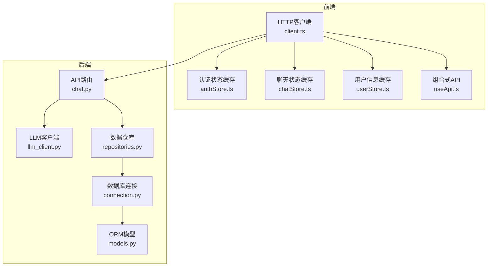
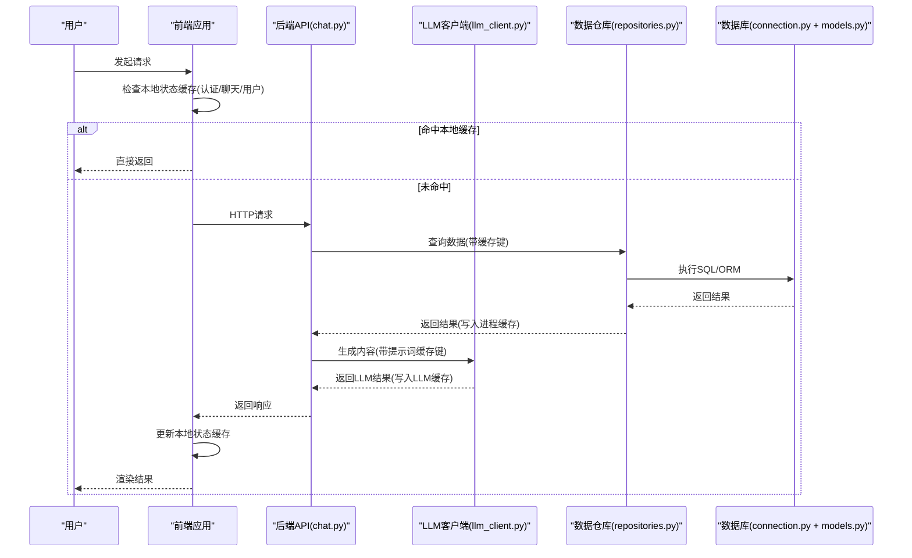
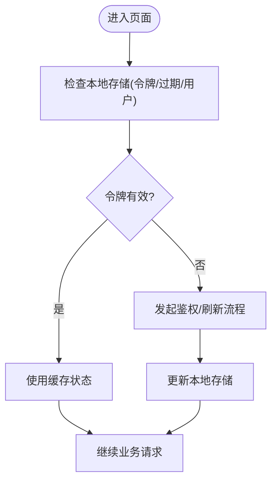
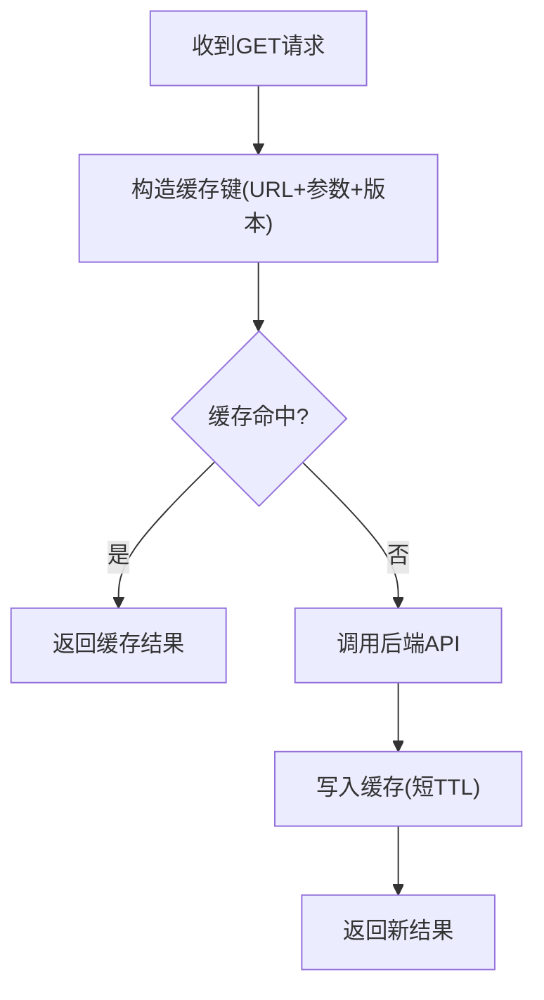
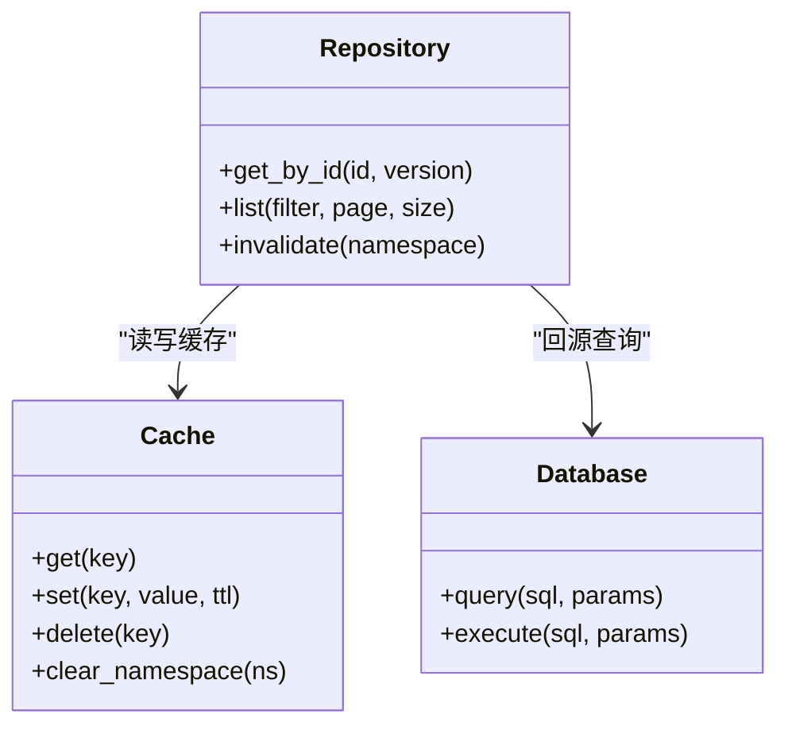
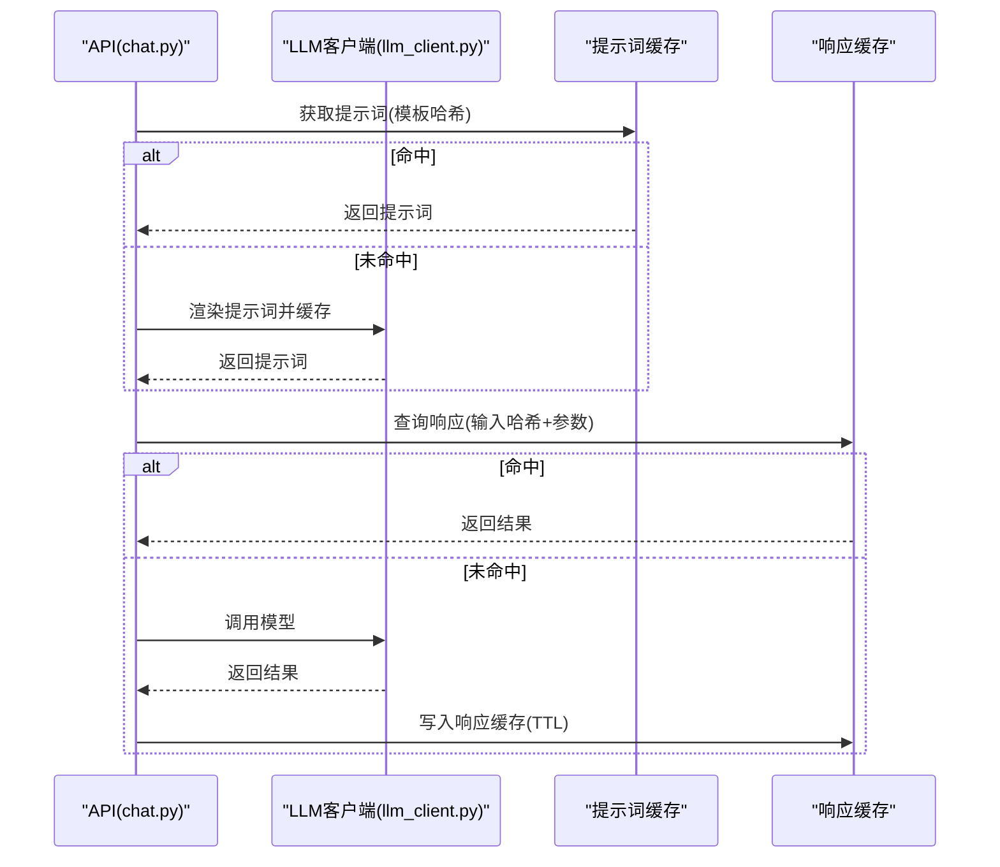
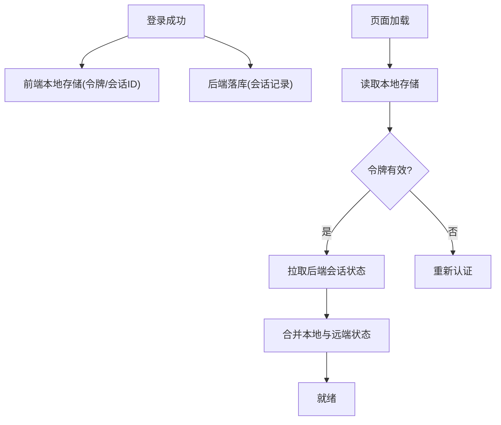
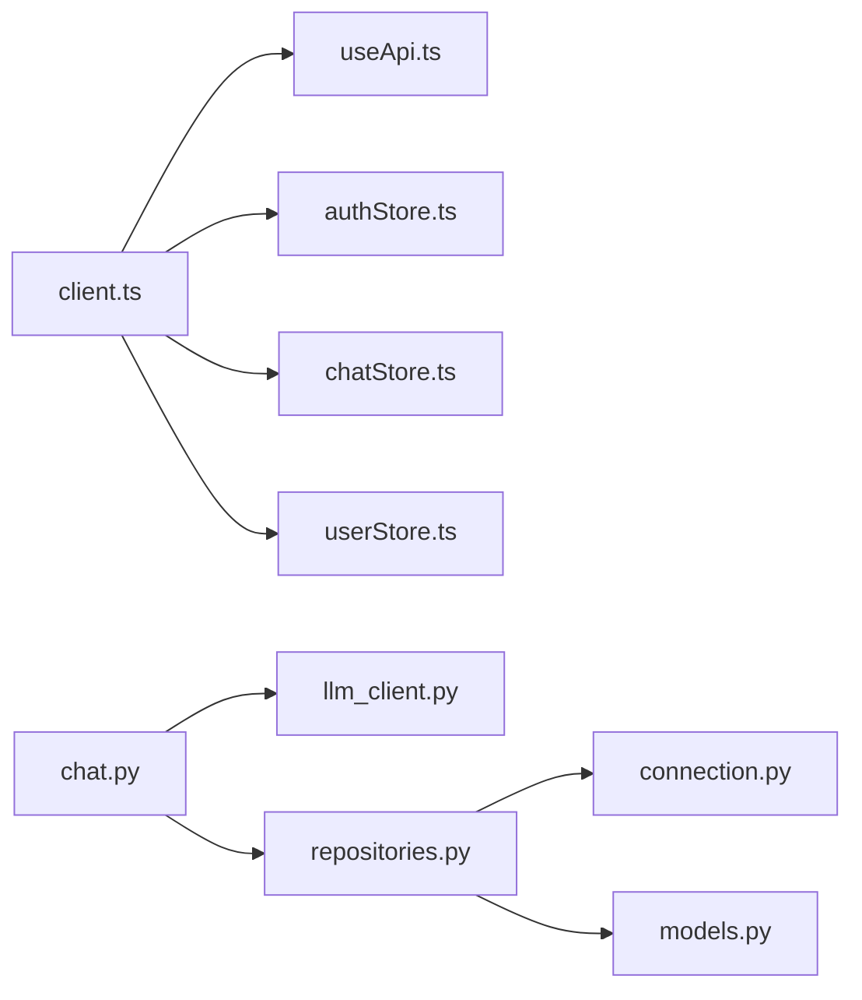

# 缓存策略设计

<cite>
**本文引用的文件**   
- [src/loopse/core/llm_client.py](file://src/loopse/core/llm_client.py)
- [src/loopse/api/chat.py](file://src/loopse/api/chat.py)
- [src/loopse/db/connection.py](file://src/loopse/db/connection.py)
- [src/loopse/db/models.py](file://src/loopse/db/models.py)
- [src/loopse/db/repositories.py](file://src/loopse/db/repositories.py)
- [frontend/src/stores/authStore.ts](file://frontend/src/stores/authStore.ts)
- [frontend/src/stores/chatStore.ts](file://frontend/src/stores/chatStore.ts)
- [frontend/src/stores/userStore.ts](file://frontend/src/stores/userStore.ts)
- [frontend/src/api/client.ts](file://frontend/src/api/client.ts)
- [frontend/src/composables/useApi.ts](file://frontend/src/composables/useApi.ts)
- [config/prompts/orchestrator/route.txt](file://config/prompts/orchestrator/route.txt)
- [config/prompts/profiler/update_profile.txt](file://config/prompts/profiler/update_profile.txt)
</cite>

## 目录
1. [引言](#引言)
2. [项目结构](#项目结构)
3. [核心组件](#核心组件)
4. [架构总览](#架构总览)
5. [详细组件分析](#详细组件分析)
6. [依赖关系分析](#依赖关系分析)
7. [性能考量](#性能考量)
8. [故障排查指南](#故障排查指南)
9. [结论](#结论)
10. [附录](#附录)

## 引言
本文件面向多级缓存架构的设计与落地，覆盖前端状态缓存、API响应缓存、数据库查询缓存以及LLM调用结果缓存（提示词缓存与响应结果缓存）。文档同时给出缓存失效策略、一致性保证与更新机制，并包含用户会话数据的缓存设计与持久化方案。最后提供监控指标、命中率统计、容量管理、配置调优与故障恢复建议，帮助在现有代码基础上构建可观测、可扩展的缓存体系。

## 项目结构
本项目采用前后端分离：
- 前端使用Vue生态，通过HTTP客户端与后端交互，并在本地存储中维护用户会话与部分应用状态。
- 后端基于Python服务，提供REST API，封装LLM客户端、数据库访问层与业务API路由。

图表来源
- [frontend/src/api/client.ts](file://frontend/src/api/client.ts)
- [frontend/src/stores/authStore.ts](file://frontend/src/stores/authStore.ts)
- [frontend/src/stores/chatStore.ts](file://frontend/src/stores/chatStore.ts)
- [frontend/src/stores/userStore.ts](file://frontend/src/stores/userStore.ts)
- [frontend/src/composables/useApi.ts](file://frontend/src/composables/useApi.ts)
- [src/loopse/api/chat.py](file://src/loopse/api/chat.py)
- [src/loopse/core/llm_client.py](file://src/loopse/core/llm_client.py)
- [src/loopse/db/connection.py](file://src/loopse/db/connection.py)
- [src/loopse/db/repositories.py](file://src/loopse/db/repositories.py)
- [src/loopse/db/models.py](file://src/loopse/db/models.py)

章节来源
- [frontend/src/api/client.ts](file://frontend/src/api/client.ts)
- [frontend/src/stores/authStore.ts](file://frontend/src/stores/authStore.ts)
- [frontend/src/stores/chatStore.ts](file://frontend/src/stores/chatStore.ts)
- [frontend/src/stores/userStore.ts](file://frontend/src/stores/userStore.ts)
- [frontend/src/composables/useApi.ts](file://frontend/src/composables/useApi.ts)
- [src/loopse/api/chat.py](file://src/loopse/api/chat.py)
- [src/loopse/core/llm_client.py](file://src/loopse/core/llm_client.py)
- [src/loopse/db/connection.py](file://src/loopse/db/connection.py)
- [src/loopse/db/repositories.py](file://src/loopse/db/repositories.py)
- [src/loopse/db/models.py](file://src/loopse/db/models.py)

## 核心组件
- 前端状态缓存
  - 认证与会话：在本地存储中维护登录态、令牌与过期时间，减少重复鉴权请求。
  - 聊天上下文：将对话历史、消息列表与UI状态驻留内存，提升交互流畅度。
  - 用户画像：缓存用户基本信息与偏好，降低频繁读取成本。
- API响应缓存
  - 针对幂等GET请求进行短期缓存，结合ETag或版本字段控制失效。
  - 对热点资源（如课程目录、路径规划）设置较短TTL，兼顾时效性与性能。
- 数据库查询缓存
  - 在仓库层引入轻量级进程内缓存，对高频只读查询进行去重与结果缓存。
  - 写操作触发相关键空间失效，确保一致性。
- LLM调用结果缓存
  - 提示词缓存：对稳定模板（如编排路由、画像更新）进行哈希缓存，避免重复渲染与网络开销。
  - 响应结果缓存：对相同输入（含系统提示、用户输入、参数）的LLM输出进行短期缓存，加速冷启动与重试场景。
- 用户会话数据
  - 前端持久化：本地存储保存会话ID、令牌与基础画像。
  - 后端持久化：会话状态落库，支持跨设备与崩溃恢复。

章节来源
- [frontend/src/stores/authStore.ts](file://frontend/src/stores/authStore.ts)
- [frontend/src/stores/chatStore.ts](file://frontend/src/stores/chatStore.ts)
- [frontend/src/stores/userStore.ts](file://frontend/src/stores/userStore.ts)
- [frontend/src/api/client.ts](file://frontend/src/api/client.ts)
- [frontend/src/composables/useApi.ts](file://frontend/src/composables/useApi.ts)
- [src/loopse/db/repositories.py](file://src/loopse/db/repositories.py)
- [src/loopse/core/llm_client.py](file://src/loopse/core/llm_client.py)
- [config/prompts/orchestrator/route.txt](file://config/prompts/orchestrator/route.txt)
- [config/prompts/profiler/update_profile.txt](file://config/prompts/profiler/update_profile.txt)

## 架构总览
下图展示从前端到后端的完整请求链路及缓存参与点。

图表来源
- [frontend/src/api/client.ts](file://frontend/src/api/client.ts)
- [frontend/src/stores/authStore.ts](file://frontend/src/stores/authStore.ts)
- [frontend/src/stores/chatStore.ts](file://frontend/src/stores/chatStore.ts)
- [frontend/src/stores/userStore.ts](file://frontend/src/stores/userStore.ts)
- [src/loopse/api/chat.py](file://src/loopse/api/chat.py)
- [src/loopse/core/llm_client.py](file://src/loopse/core/llm_client.py)
- [src/loopse/db/repositories.py](file://src/loopse/db/repositories.py)
- [src/loopse/db/connection.py](file://src/loopse/db/connection.py)
- [src/loopse/db/models.py](file://src/loopse/db/models.py)

## 详细组件分析

### 前端状态缓存
- 认证与会话
  - 本地存储保存令牌、过期时间与用户标识；每次请求前校验有效期，必要时刷新或跳转登录。
  - 建议为令牌增加短TTL与自动续期逻辑，降低并发刷新风暴风险。
- 聊天上下文
  - 内存中维护消息队列与滚动位置；页面切换时按需持久化摘要，避免大对象常驻。
- 用户画像
  - 首次加载后缓存至本地存储；当用户资料变更时主动失效并重新拉取。

章节来源
- [frontend/src/stores/authStore.ts](file://frontend/src/stores/authStore.ts)
- [frontend/src/stores/chatStore.ts](file://frontend/src/stores/chatStore.ts)
- [frontend/src/stores/userStore.ts](file://frontend/src/stores/userStore.ts)
- [frontend/src/api/client.ts](file://frontend/src/api/client.ts)
- [frontend/src/composables/useApi.ts](file://frontend/src/composables/useApi.ts)

### API响应缓存
- 适用场景
  - 幂等且变化不频繁的GET接口，如静态资源清单、路径规划结果、诊断模板等。
- 策略要点
  - 短TTL（秒级）+ ETag/版本号双重校验；写操作触发对应命名空间失效。
  - 对热点接口启用请求合并与防抖，避免雪崩。
- 失效范围
  - 按资源维度划分键空间，例如“路径”、“资源”、“诊断”，写操作仅失效相关命名空间。

章节来源
- [frontend/src/api/client.ts](file://frontend/src/api/client.ts)
- [frontend/src/composables/useApi.ts](file://frontend/src/composables/useApi.ts)
- [src/loopse/api/chat.py](file://src/loopse/api/chat.py)

### 数据库查询缓存
- 目标
  - 降低热读压力，提高QPS与稳定性。
- 实现要点
  - 在仓库层对只读查询加一层进程内缓存；键由表名、主键/过滤条件与版本组成。
  - 写操作（增删改）触发相关键空间失效；批量写后进行延迟失效，避免抖动。
- 一致性保障
  - 强一致场景禁用缓存或采用短TTL；最终一致场景允许短暂不一致，配合版本号与ETag。

图表来源
- [src/loopse/db/repositories.py](file://src/loopse/db/repositories.py)
- [src/loopse/db/connection.py](file://src/loopse/db/connection.py)
- [src/loopse/db/models.py](file://src/loopse/db/models.py)

章节来源
- [src/loopse/db/repositories.py](file://src/loopse/db/repositories.py)
- [src/loopse/db/connection.py](file://src/loopse/db/connection.py)
- [src/loopse/db/models.py](file://src/loopse/db/models.py)

### LLM调用结果缓存
- 提示词缓存
  - 对稳定的提示词模板（如编排路由、画像更新）计算哈希作为键，避免重复拼接与网络传输。
  - 模板变更需强制失效旧缓存。
- 响应结果缓存
  - 以“系统提示哈希 + 用户输入哈希 + 关键参数”作为复合键，设置短TTL。
  - 对高价值、低变化输出（如诊断规则、路径规划模板）可适当延长TTL。
- 一致性策略
  - 当提示词或模型版本升级时，通过键前缀或版本号强制失效。

图表来源
- [src/loopse/api/chat.py](file://src/loopse/api/chat.py)
- [src/loopse/core/llm_client.py](file://src/loopse/core/llm_client.py)
- [config/prompts/orchestrator/route.txt](file://config/prompts/orchestrator/route.txt)
- [config/prompts/profiler/update_profile.txt](file://config/prompts/profiler/update_profile.txt)

章节来源
- [src/loopse/core/llm_client.py](file://src/loopse/core/llm_client.py)
- [config/prompts/orchestrator/route.txt](file://config/prompts/orchestrator/route.txt)
- [config/prompts/profiler/update_profile.txt](file://config/prompts/profiler/update_profile.txt)

### 用户会话数据缓存与持久化
- 前端持久化
  - 本地存储保存会话ID、令牌与基础画像；页面重载后恢复。
- 后端持久化
  - 会话状态落库，支持多端同步与崩溃恢复；定期清理过期会话。
- 一致性
  - 前端缓存与后端状态冲突时，以后端为准；前端在关键操作后主动拉取最新状态。

章节来源
- [frontend/src/stores/authStore.ts](file://frontend/src/stores/authStore.ts)
- [frontend/src/stores/userStore.ts](file://frontend/src/stores/userStore.ts)
- [src/loopse/db/models.py](file://src/loopse/db/models.py)

## 依赖关系分析
- 前端模块耦合
  - HTTP客户端与组合式API共同负责请求拦截、缓存键构造与错误处理。
  - 各store职责清晰：认证、聊天、用户分别维护自身状态与失效边界。
- 后端模块耦合
  - API层协调LLM与仓库层；仓库层统一封装缓存与数据库访问。
  - 模型与连接层解耦，便于替换存储实现。

图表来源
- [frontend/src/api/client.ts](file://frontend/src/api/client.ts)
- [frontend/src/composables/useApi.ts](file://frontend/src/composables/useApi.ts)
- [frontend/src/stores/authStore.ts](file://frontend/src/stores/authStore.ts)
- [frontend/src/stores/chatStore.ts](file://frontend/src/stores/chatStore.ts)
- [frontend/src/stores/userStore.ts](file://frontend/src/stores/userStore.ts)
- [src/loopse/api/chat.py](file://src/loopse/api/chat.py)
- [src/loopse/core/llm_client.py](file://src/loopse/core/llm_client.py)
- [src/loopse/db/repositories.py](file://src/loopse/db/repositories.py)
- [src/loopse/db/connection.py](file://src/loopse/db/connection.py)
- [src/loopse/db/models.py](file://src/loopse/db/models.py)

章节来源
- [frontend/src/api/client.ts](file://frontend/src/api/client.ts)
- [frontend/src/composables/useApi.ts](file://frontend/src/composables/useApi.ts)
- [frontend/src/stores/authStore.ts](file://frontend/src/stores/authStore.ts)
- [frontend/src/stores/chatStore.ts](file://frontend/src/stores/chatStore.ts)
- [frontend/src/stores/userStore.ts](file://frontend/src/stores/userStore.ts)
- [src/loopse/api/chat.py](file://src/loopse/api/chat.py)
- [src/loopse/core/llm_client.py](file://src/loopse/core/llm_client.py)
- [src/loopse/db/repositories.py](file://src/loopse/db/repositories.py)
- [src/loopse/db/connection.py](file://src/loopse/db/connection.py)
- [src/loopse/db/models.py](file://src/loopse/db/models.py)

## 性能考量
- 缓存层级选择
  - 前端内存优先，其次本地存储；后端进程内缓存优先，再考虑外部缓存（如Redis）。
- TTL与失效粒度
  - 短TTL用于高频变动数据；长TTL用于静态或低频数据。
  - 命名空间级失效优于全量清理，降低误伤面。
- 命中率与容量
  - 监控命中率、平均延迟、内存占用；设置上限与淘汰策略（LRU/LFU）。
- 并发与雪崩防护
  - 请求合并、互斥锁、随机抖动TTL、熔断降级。

[本节为通用指导，无需具体文件引用]

## 故障排查指南
- 常见问题定位
  - 缓存未命中：检查键构造是否稳定（参数、版本、哈希算法）。
  - 一致性异常：确认写操作是否触发正确命名空间失效。
  - 内存增长：评估缓存大小上限与淘汰策略是否生效。
- 日志与指标
  - 记录缓存命中/未命中、TTL到期、失效事件、回源耗时。
  - 暴露关键指标：命中率、P95/P99延迟、内存使用、失败率。
- 恢复策略
  - 快速失效：提供按命名空间或全局的失效接口。
  - 降级模式：缓存不可用时直接回源，保持可用性。

章节来源
- [src/loopse/db/repositories.py](file://src/loopse/db/repositories.py)
- [src/loopse/api/chat.py](file://src/loopse/api/chat.py)
- [frontend/src/composables/useApi.ts](file://frontend/src/composables/useApi.ts)

## 结论
通过在多层级引入合适的缓存策略，并结合一致的失效与监控机制，可在保证一致性的前提下显著提升系统吞吐与用户体验。建议逐步落地：先在前端与仓库层实施轻量缓存，随后扩展至LLM结果缓存与外部缓存，完善指标与治理手段，持续优化命中率与容量。

[本节为总结性内容，无需具体文件引用]

## 附录
- 配置调优建议
  - 根据业务特征设定不同命名空间的TTL与容量上限。
  - 对热点接口开启请求合并与防抖，降低后端压力。
- 最佳实践
  - 明确缓存键规范（包含版本与必要参数）。
  - 写操作遵循最小失效原则，避免过度失效。
  - 建立灰度发布与回滚机制，确保缓存策略变更可控。

[本节为补充说明，无需具体文件引用]