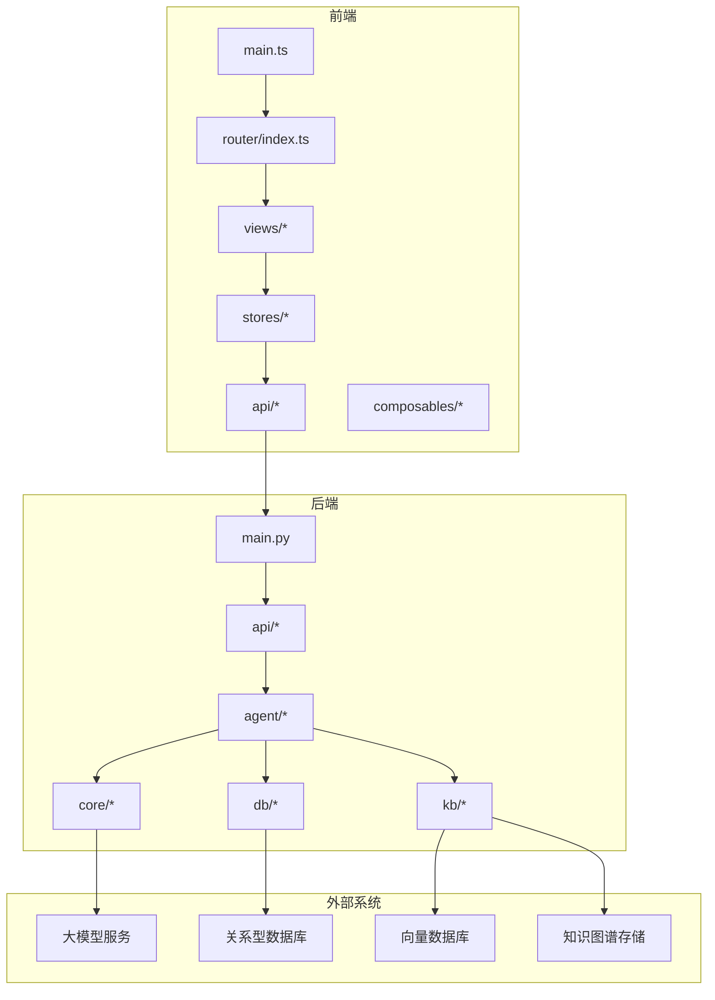
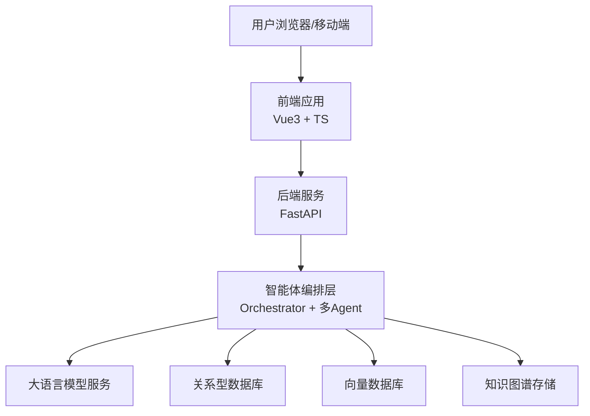
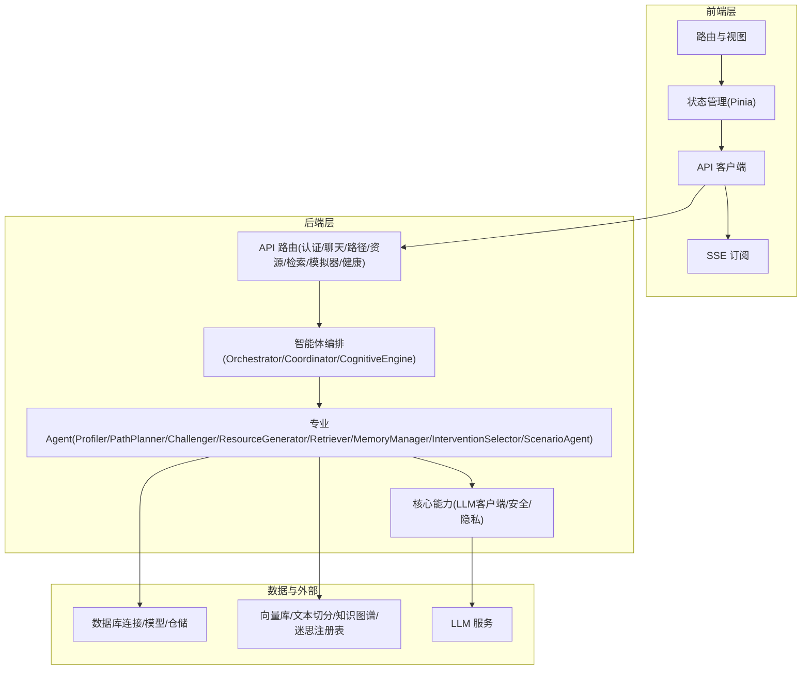
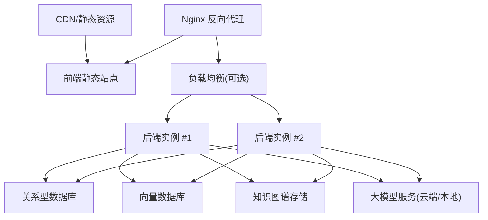
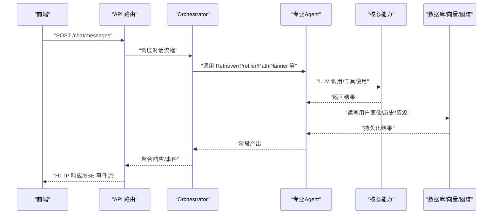
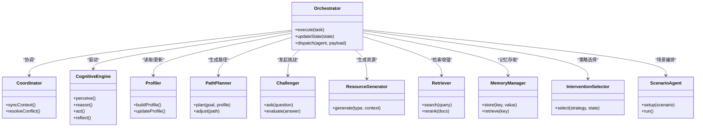
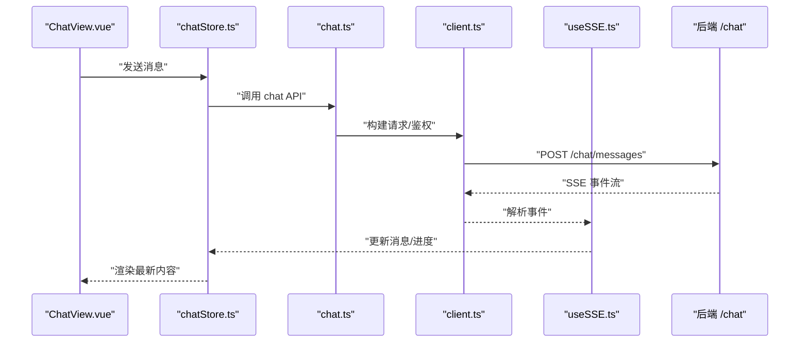
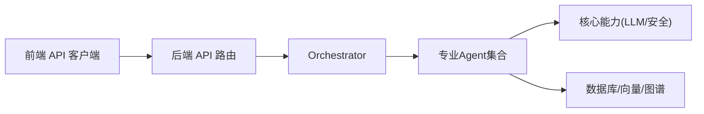

# 整体架构概览

<cite>
**本文引用的文件**   
- [src/loopse/main.py](file://src/loopse/main.py)
- [src/loopse/api/auth.py](file://src/loopse/api/auth.py)
- [src/loopse/api/chat.py](file://src/loopse/api/chat.py)
- [src/loopse/api/path.py](file://src/loopse/api/path.py)
- [src/loopse/api/resources.py](file://src/loopse/api/resources.py)
- [src/loopse/api/knowledge_base.py](file://src/loopse/api/knowledge_base.py)
- [src/loopse/api/simulator.py](file://src/loopse/api/simulator.py)
- [src/loopse/api/health.py](file://src/loopse/api/health.py)
- [src/loopse/core/llm_client.py](file://src/loopse/core/llm_client.py)
- [src/loopse/db/connection.py](file://src/loopse/db/connection.py)
- [src/loopse/db/models.py](file://src/loopse/db/models.py)
- [src/loopse/db/repositories.py](file://src/loopse/db/repositories.py)
- [src/loopse/kb/vector_store.py](file://src/loopse/kb/vector_store.py)
- [src/loopse/kb/knowledge_graph.py](file://src/loopse/kb/knowledge_graph.py)
- [src/loopse/kb/misconception_registry.py](file://src/loopse/kb/misconception_registry.py)
- [src/loopse/kb/text_splitter.py](file://src/loopse/kb/text_splitter.py)
- [src/loopse/agent/orchestrator.py](file://src/loopse/agent/orchestrator.py)
- [src/loopse/agent/coordinator.py](file://src/loopse/agent/coordinator.py)
- [src/loopse/agent/cognitive_engine.py](file://src/loopse/agent/cognitive_engine.py)
- [src/loopse/agent/profiler.py](file://src/loopse/agent/profiler.py)
- [src/loopse/agent/path_planner.py](file://src/loopse/agent/path_planner.py)
- [src/loopse/agent/challenger.py](file://src/loopse/agent/challenger.py)
- [src/loopse/agent/resource_generator.py](file://src/loopse/agent/resource_generator.py)
- [src/loopse/agent/retriever.py](file://src/loopse/agent/retriever.py)
- [src/loopse/agent/memory_manager.py](file://src/loopse/agent/memory_manager.py)
- [src/loopse/agent/intervention_selector.py](file://src/loopse/agent/intervention_selector.py)
- [src/loopse/agent/scenario_agent.py](file://src/loopse/agent/scenario_agent.py)
- [frontend/src/main.ts](file://frontend/src/main.ts)
- [frontend/src/router/index.ts](file://frontend/src/router/index.ts)
- [frontend/src/stores/authStore.ts](file://frontend/src/stores/authStore.ts)
- [frontend/src/stores/chatStore.ts](file://frontend/src/stores/chatStore.ts)
- [frontend/src/stores/pathStore.ts](file://frontend/src/stores/pathStore.ts)
- [frontend/src/stores/resourceStore.ts](file://frontend/src/stores/resourceStore.ts)
- [frontend/src/composables/useSSE.ts](file://frontend/src/composables/useSSE.ts)
- [frontend/src/api/client.ts](file://frontend/src/api/client.ts)
- [frontend/src/api/chat.ts](file://frontend/src/api/chat.ts)
- [frontend/src/api/path.ts](file://frontend/src/api/path.ts)
- [frontend/src/api/resources.ts](file://frontend/src/api/resources.ts)
- [frontend/src/views/ChatView.vue](file://frontend/src/views/ChatView.vue)
- [frontend/src/views/PathView.vue](file://frontend/src/views/PathView.vue)
- [frontend/src/views/ResourcesView.vue](file://frontend/src/views/ResourcesView.vue)
- [config/api_schema.yaml](file://config/api_schema.yaml)
- [pyproject.toml](file://pyproject.toml)
- [requirements.txt](file://requirements.txt)
</cite>

## 目录
1. [简介](#简介)
2. [项目结构](#项目结构)
3. [核心组件](#核心组件)
4. [架构总览](#架构总览)
5. [详细组件分析](#详细组件分析)
6. [依赖关系分析](#依赖关系分析)
7. [性能与可扩展性](#性能与可扩展性)
8. [故障排查指南](#故障排查指南)
9. [结论](#结论)
10. [附录](#附录)

## 简介
本文件为 Socrates-Cube 系统的整体架构概览，面向架构师与技术决策者，聚焦于高层设计、技术栈选择、前后端分离、微服务化边界与事件驱动通信。文档包含系统上下文图、技术架构图与部署拓扑图，并说明各层职责边界、数据流向与外部系统集成点，帮助读者快速建立对系统的全局认知。

## 项目结构
仓库采用“前端 + 后端 + 智能体 + 知识库 + 配置与脚本”的分层组织方式：
- 前端（Vue 3 + TypeScript）：提供用户界面、状态管理、API 客户端与 SSE 实时通信能力。
- 后端（Python FastAPI）：对外暴露 REST API，编排智能体工作流，访问数据库与向量/图谱存储。
- 智能体层（Agent）：以 Orchestrator 为核心协调器，组合多个专业 Agent 完成诊断、路径规划、资源生成、挑战问答等任务。
- 知识层（KB）：文本切分、向量化检索、知识图谱与迷思概念注册表。
- 配置与脚本：提示词模板、API 契约、初始化与数据处理脚本。

图表来源
- [src/loopse/main.py](file://src/loopse/main.py)
- [frontend/src/main.ts](file://frontend/src/main.ts)
- [frontend/src/router/index.ts](file://frontend/src/router/index.ts)

章节来源
- [src/loopse/main.py](file://src/loopse/main.py)
- [frontend/src/main.ts](file://frontend/src/main.ts)
- [frontend/src/router/index.ts](file://frontend/src/router/index.ts)

## 核心组件
- 应用入口与路由
  - 后端主入口负责启动服务、挂载中间件与路由。
  - 前端主入口初始化应用、注册路由与全局插件。
- API 网关与控制器
  - 按领域划分的路由模块：认证、聊天、学习路径、资源、知识检索、模拟器、健康检查等。
- 智能体编排层
  - Orchestrator 作为总控，协调 Coordinator、Cognitive Engine、Profiler、Path Planner、Challenger、Resource Generator、Retriever、Memory Manager、Intervention Selector、Scenario Agent 等。
- 核心能力
  - LLM 客户端封装统一调用策略。
  - 数据库连接、ORM 模型与仓储抽象。
  - 知识处理：文本切分、向量检索、知识图谱、迷思概念注册。
- 前端状态与交互
  - 基于 Pinia 的 stores 管理认证、聊天、路径、资源等状态。
  - useSSE 实现服务端事件推送，用于长时任务进度与对话增量更新。

章节来源
- [src/loopse/main.py](file://src/loopse/main.py)
- [src/loopse/api/auth.py](file://src/loopse/api/auth.py)
- [src/loopse/api/chat.py](file://src/loopse/api/chat.py)
- [src/loopse/api/path.py](file://src/loopse/api/path.py)
- [src/loopse/api/resources.py](file://src/loopse/api/resources.py)
- [src/loopse/api/knowledge_base.py](file://src/loopse/api/knowledge_base.py)
- [src/loopse/api/simulator.py](file://src/loopse/api/simulator.py)
- [src/loopse/api/health.py](file://src/loopse/api/health.py)
- [src/loopse/agent/orchestrator.py](file://src/loopse/agent/orchestrator.py)
- [src/loopse/agent/coordinator.py](file://src/loopse/agent/coordinator.py)
- [src/loopse/agent/cognitive_engine.py](file://src/loopse/agent/cognitive_engine.py)
- [src/loopse/agent/profiler.py](file://src/loopse/agent/profiler.py)
- [src/loopse/agent/path_planner.py](file://src/loopse/agent/path_planner.py)
- [src/loopse/agent/challenger.py](file://src/loopse/agent/challenger.py)
- [src/loopse/agent/resource_generator.py](file://src/loopse/agent/resource_generator.py)
- [src/loopse/agent/retriever.py](file://src/loopse/agent/retriever.py)
- [src/loopse/agent/memory_manager.py](file://src/loopse/agent/memory_manager.py)
- [src/loopse/agent/intervention_selector.py](file://src/loopse/agent/intervention_selector.py)
- [src/loopse/agent/scenario_agent.py](file://src/loopse/agent/scenario_agent.py)
- [src/loopse/core/llm_client.py](file://src/loopse/core/llm_client.py)
- [src/loopse/db/connection.py](file://src/loopse/db/connection.py)
- [src/loopse/db/models.py](file://src/loopse/db/models.py)
- [src/loopse/db/repositories.py](file://src/loopse/db/repositories.py)
- [src/loopse/kb/vector_store.py](file://src/loopse/kb/vector_store.py)
- [src/loopse/kb/knowledge_graph.py](file://src/loopse/kb/knowledge_graph.py)
- [src/loopse/kb/misconception_registry.py](file://src/loopse/kb/misconception_registry.py)
- [src/loopse/kb/text_splitter.py](file://src/loopse/kb/text_splitter.py)
- [frontend/src/main.ts](file://frontend/src/main.ts)
- [frontend/src/router/index.ts](file://frontend/src/router/index.ts)
- [frontend/src/stores/authStore.ts](file://frontend/src/stores/authStore.ts)
- [frontend/src/stores/chatStore.ts](file://frontend/src/stores/chatStore.ts)
- [frontend/src/stores/pathStore.ts](file://frontend/src/stores/pathStore.ts)
- [frontend/src/stores/resourceStore.ts](file://frontend/src/stores/resourceStore.ts)
- [frontend/src/composables/useSSE.ts](file://frontend/src/composables/useSSE.ts)
- [frontend/src/api/client.ts](file://frontend/src/api/client.ts)
- [frontend/src/api/chat.ts](file://frontend/src/api/chat.ts)
- [frontend/src/api/path.ts](file://frontend/src/api/path.ts)
- [frontend/src/api/resources.ts](file://frontend/src/api/resources.ts)

## 架构总览
本节从三个维度呈现系统视图：系统上下文、技术架构与部署拓扑。

### 系统上下文图
展示 Socrates-Cube 与用户、外部 AI 服务、数据存储的关系。

图表来源
- [src/loopse/main.py](file://src/loopse/main.py)
- [src/loopse/agent/orchestrator.py](file://src/loopse/agent/orchestrator.py)
- [src/loopse/core/llm_client.py](file://src/loopse/core/llm_client.py)
- [src/loopse/db/connection.py](file://src/loopse/db/connection.py)
- [src/loopse/kb/vector_store.py](file://src/loopse/kb/vector_store.py)
- [src/loopse/kb/knowledge_graph.py](file://src/loopse/kb/knowledge_graph.py)

### 技术架构图
分层与组件交互：前端 -> API -> 智能体 -> 核心能力 -> 数据与外部服务。

图表来源
- [src/loopse/api/auth.py](file://src/loopse/api/auth.py)
- [src/loopse/api/chat.py](file://src/loopse/api/chat.py)
- [src/loopse/api/path.py](file://src/loopse/api/path.py)
- [src/loopse/api/resources.py](file://src/loopse/api/resources.py)
- [src/loopse/api/knowledge_base.py](file://src/loopse/api/knowledge_base.py)
- [src/loopse/api/simulator.py](file://src/loopse/api/simulator.py)
- [src/loopse/api/health.py](file://src/loopse/api/health.py)
- [src/loopse/agent/orchestrator.py](file://src/loopse/agent/orchestrator.py)
- [src/loopse/agent/coordinator.py](file://src/loopse/agent/coordinator.py)
- [src/loopse/agent/cognitive_engine.py](file://src/loopse/agent/cognitive_engine.py)
- [src/loopse/agent/profiler.py](file://src/loopse/agent/profiler.py)
- [src/loopse/agent/path_planner.py](file://src/loopse/agent/path_planner.py)
- [src/loopse/agent/challenger.py](file://src/loopse/agent/challenger.py)
- [src/loopse/agent/resource_generator.py](file://src/loopse/agent/resource_generator.py)
- [src/loopse/agent/retriever.py](file://src/loopse/agent/retriever.py)
- [src/loopse/agent/memory_manager.py](file://src/loopse/agent/memory_manager.py)
- [src/loopse/agent/intervention_selector.py](file://src/loopse/agent/intervention_selector.py)
- [src/loopse/agent/scenario_agent.py](file://src/loopse/agent/scenario_agent.py)
- [src/loopse/core/llm_client.py](file://src/loopse/core/llm_client.py)
- [src/loopse/db/connection.py](file://src/loopse/db/connection.py)
- [src/loopse/db/models.py](file://src/loopse/db/models.py)
- [src/loopse/db/repositories.py](file://src/loopse/db/repositories.py)
- [src/loopse/kb/vector_store.py](file://src/loopse/kb/vector_store.py)
- [src/loopse/kb/knowledge_graph.py](file://src/loopse/kb/knowledge_graph.py)
- [src/loopse/kb/misconception_registry.py](file://src/loopse/kb/misconception_registry.py)
- [src/loopse/kb/text_splitter.py](file://src/loopse/kb/text_splitter.py)
- [frontend/src/api/client.ts](file://frontend/src/api/client.ts)
- [frontend/src/composables/useSSE.ts](file://frontend/src/composables/useSSE.ts)

### 部署拓扑图
典型部署形态：前端静态站点/Nginx 反代，后端单实例或容器化多副本，共享外部数据库与向量/图谱存储。

[此图为概念性部署拓扑，不直接映射具体源码文件]

## 详细组件分析

### 后端入口与 API 层
- 入口与路由挂载
  - 后端主入口负责创建应用实例、注册中间件、挂载各业务路由与健康检查。
- 领域 API
  - 认证：登录、注册、令牌校验。
  - 聊天：会话创建、消息发送、SSE 事件流。
  - 路径：个性化学习路径查询与更新。
  - 资源：资源生成、检索与元数据管理。
  - 知识检索：语义搜索与召回。
  - 模拟器：仿真场景参数与回放。
  - 健康检查：存活与就绪探针。

图表来源
- [src/loopse/api/chat.py](file://src/loopse/api/chat.py)
- [src/loopse/agent/orchestrator.py](file://src/loopse/agent/orchestrator.py)
- [src/loopse/agent/retriever.py](file://src/loopse/agent/retriever.py)
- [src/loopse/agent/profiler.py](file://src/loopse/agent/profiler.py)
- [src/loopse/agent/path_planner.py](file://src/loopse/agent/path_planner.py)
- [src/loopse/core/llm_client.py](file://src/loopse/core/llm_client.py)
- [src/loopse/db/connection.py](file://src/loopse/db/connection.py)

章节来源
- [src/loopse/main.py](file://src/loopse/main.py)
- [src/loopse/api/auth.py](file://src/loopse/api/auth.py)
- [src/loopse/api/chat.py](file://src/loopse/api/chat.py)
- [src/loopse/api/path.py](file://src/loopse/api/path.py)
- [src/loopse/api/resources.py](file://src/loopse/api/resources.py)
- [src/loopse/api/knowledge_base.py](file://src/loopse/api/knowledge_base.py)
- [src/loopse/api/simulator.py](file://src/loopse/api/simulator.py)
- [src/loopse/api/health.py](file://src/loopse/api/health.py)

### 智能体编排层
- Orchestrator：定义端到端工作流，维护任务状态机，协调子 Agent 顺序与并行执行。
- Coordinator：跨 Agent 的上下文同步与冲突消解。
- Cognitive Engine：认知循环（感知-推理-行动-反思），驱动自适应教学策略。
- Profiler：学习者画像建模与动态更新。
- Path Planner：基于目标与现状生成学习路径。
- Challenger：苏格拉底式提问与评估。
- Resource Generator：按需生成代码、文档、练习、信息图等。
- Retriever：语义检索与召回增强。
- Memory Manager：短期/长期记忆管理与检索。
- Intervention Selector：干预策略选择（提示、脚手架、反馈）。
- Scenario Agent：场景化任务编排与仿真。

图表来源
- [src/loopse/agent/orchestrator.py](file://src/loopse/agent/orchestrator.py)
- [src/loopse/agent/coordinator.py](file://src/loopse/agent/coordinator.py)
- [src/loopse/agent/cognitive_engine.py](file://src/loopse/agent/cognitive_engine.py)
- [src/loopse/agent/profiler.py](file://src/loopse/agent/profiler.py)
- [src/loopse/agent/path_planner.py](file://src/loopse/agent/path_planner.py)
- [src/loopse/agent/challenger.py](file://src/loopse/agent/challenger.py)
- [src/loopse/agent/resource_generator.py](file://src/loopse/agent/resource_generator.py)
- [src/loopse/agent/retriever.py](file://src/loopse/agent/retriever.py)
- [src/loopse/agent/memory_manager.py](file://src/loopse/agent/memory_manager.py)
- [src/loopse/agent/intervention_selector.py](file://src/loopse/agent/intervention_selector.py)
- [src/loopse/agent/scenario_agent.py](file://src/loopse/agent/scenario_agent.py)

章节来源
- [src/loopse/agent/orchestrator.py](file://src/loopse/agent/orchestrator.py)
- [src/loopse/agent/coordinator.py](file://src/loopse/agent/coordinator.py)
- [src/loopse/agent/cognitive_engine.py](file://src/loopse/agent/cognitive_engine.py)
- [src/loopse/agent/profiler.py](file://src/loopse/agent/profiler.py)
- [src/loopse/agent/path_planner.py](file://src/loopse/agent/path_planner.py)
- [src/loopse/agent/challenger.py](file://src/loopse/agent/challenger.py)
- [src/loopse/agent/resource_generator.py](file://src/loopse/agent/resource_generator.py)
- [src/loopse/agent/retriever.py](file://src/loopse/agent/retriever.py)
- [src/loopse/agent/memory_manager.py](file://src/loopse/agent/memory_manager.py)
- [src/loopse/agent/intervention_selector.py](file://src/loopse/agent/intervention_selector.py)
- [src/loopse/agent/scenario_agent.py](file://src/loopse/agent/scenario_agent.py)

### 核心能力：LLM 客户端与数据安全
- LLM 客户端：统一封装请求、重试、超时、限流与错误码映射。
- 安全与隐私：敏感字段脱敏、最小权限访问控制、审计日志。

章节来源
- [src/loopse/core/llm_client.py](file://src/loopse/core/llm_client.py)

### 数据层：数据库与仓储
- 连接管理：连接池、事务、迁移。
- 模型定义：实体与关系映射。
- 仓储接口：CRUD 与复杂查询抽象，便于替换底层实现。

章节来源
- [src/loopse/db/connection.py](file://src/loopse/db/connection.py)
- [src/loopse/db/models.py](file://src/loopse/db/models.py)
- [src/loopse/db/repositories.py](file://src/loopse/db/repositories.py)

### 知识层：文本切分、向量检索与知识图谱
- 文本切分：按段落/主题/难度进行分段与标注。
- 向量检索：嵌入生成、相似度检索、重排。
- 知识图谱：节点/边建模、关系推理与可视化。
- 迷思概念注册表：常见误解记录与检测规则。

章节来源
- [src/loopse/kb/text_splitter.py](file://src/loopse/kb/text_splitter.py)
- [src/loopse/kb/vector_store.py](file://src/loopse/kb/vector_store.py)
- [src/loopse/kb/knowledge_graph.py](file://src/loopse/kb/knowledge_graph.py)
- [src/loopse/kb/misconception_registry.py](file://src/loopse/kb/misconception_registry.py)

### 前端：路由、状态与实时通信
- 路由与视图：页面级路由与功能视图拆分。
- 状态管理：认证、聊天、路径、资源等独立 store。
- API 客户端：统一拦截器、错误处理、Mock 开关。
- SSE 订阅：长连接接收增量消息与任务进度。

图表来源
- [frontend/src/views/ChatView.vue](file://frontend/src/views/ChatView.vue)
- [frontend/src/stores/chatStore.ts](file://frontend/src/stores/chatStore.ts)
- [frontend/src/api/chat.ts](file://frontend/src/api/chat.ts)
- [frontend/src/api/client.ts](file://frontend/src/api/client.ts)
- [frontend/src/composables/useSSE.ts](file://frontend/src/composables/useSSE.ts)

章节来源
- [frontend/src/main.ts](file://frontend/src/main.ts)
- [frontend/src/router/index.ts](file://frontend/src/router/index.ts)
- [frontend/src/stores/authStore.ts](file://frontend/src/stores/authStore.ts)
- [frontend/src/stores/chatStore.ts](file://frontend/src/stores/chatStore.ts)
- [frontend/src/stores/pathStore.ts](file://frontend/src/stores/pathStore.ts)
- [frontend/src/stores/resourceStore.ts](file://frontend/src/stores/resourceStore.ts)
- [frontend/src/composables/useSSE.ts](file://frontend/src/composables/useSSE.ts)
- [frontend/src/api/client.ts](file://frontend/src/api/client.ts)
- [frontend/src/api/chat.ts](file://frontend/src/api/chat.ts)
- [frontend/src/api/path.ts](file://frontend/src/api/path.ts)
- [frontend/src/api/resources.ts](file://frontend/src/api/resources.ts)
- [frontend/src/views/ChatView.vue](file://frontend/src/views/ChatView.vue)
- [frontend/src/views/PathView.vue](file://frontend/src/views/PathView.vue)
- [frontend/src/views/ResourcesView.vue](file://frontend/src/views/ResourcesView.vue)

## 依赖关系分析
- 内部依赖
  - API 层依赖智能体编排层；编排层依赖核心能力与数据/知识层。
  - 前端通过 API 客户端与后端交互，SSE 用于实时回推。
- 外部依赖
  - 大模型服务：通过 LLM 客户端统一接入。
  - 数据库/向量/图谱：持久化与检索增强。
- 耦合与内聚
  - 智能体间通过 Orchestrator 松耦合协作，降低直接依赖。
  - 仓储抽象屏蔽底层差异，提升可替换性。

图表来源
- [frontend/src/api/client.ts](file://frontend/src/api/client.ts)
- [src/loopse/api/chat.py](file://src/loopse/api/chat.py)
- [src/loopse/agent/orchestrator.py](file://src/loopse/agent/orchestrator.py)
- [src/loopse/core/llm_client.py](file://src/loopse/core/llm_client.py)
- [src/loopse/db/connection.py](file://src/loopse/db/connection.py)
- [src/loopse/kb/vector_store.py](file://src/loopse/kb/vector_store.py)
- [src/loopse/kb/knowledge_graph.py](file://src/loopse/kb/knowledge_graph.py)

章节来源
- [frontend/src/api/client.ts](file://frontend/src/api/client.ts)
- [src/loopse/api/chat.py](file://src/loopse/api/chat.py)
- [src/loopse/agent/orchestrator.py](file://src/loopse/agent/orchestrator.py)
- [src/loopse/core/llm_client.py](file://src/loopse/core/llm_client.py)
- [src/loopse/db/connection.py](file://src/loopse/db/connection.py)
- [src/loopse/kb/vector_store.py](file://src/loopse/kb/vector_store.py)
- [src/loopse/kb/knowledge_graph.py](file://src/loopse/kb/knowledge_graph.py)

## 性能与可扩展性
- 并发与吞吐
  - 后端建议启用多进程/异步 I/O，结合连接池与缓存减少热点 IO。
  - 前端对长耗时任务采用 SSE 增量渲染，避免阻塞 UI。
- 检索增强
  - 向量检索引入重排与过滤，提高召回质量与速度。
- 扩展性
  - 智能体模块化，新增 Agent 无需改动现有编排逻辑。
  - 仓储抽象支持多后端切换与水平扩展。
- 成本优化
  - LLM 调用增加缓存与降级策略，减少不必要请求。

[本节为通用指导，不直接分析具体文件]

## 故障排查指南
- 健康检查
  - 使用健康检查接口验证服务存活与依赖可用性。
- 日志与追踪
  - 关键链路打点：API 入口、Agent 阶段、LLM 调用、数据库操作。
- 常见问题定位
  - 认证失败：检查令牌签发与校验逻辑。
  - 聊天无响应：确认 SSE 订阅与后端事件流是否正常。
  - 资源生成慢：检查 LLM 限流与队列堆积情况。
  - 检索不准确：调整检索参数与重排策略。

章节来源
- [src/loopse/api/health.py](file://src/loopse/api/health.py)
- [src/loopse/api/auth.py](file://src/loopse/api/auth.py)
- [src/loopse/api/chat.py](file://src/loopse/api/chat.py)
- [src/loopse/api/resources.py](file://src/loopse/api/resources.py)
- [src/loopse/kb/vector_store.py](file://src/loopse/kb/vector_store.py)

## 结论
Socrates-Cube 采用前后端分离与微服务化的智能体编排模式，以 Orchestrator 为中心串联多专业 Agent，结合 LLM 与知识检索形成闭环的学习体验。系统具备清晰的职责边界、良好的可扩展性与可观测性，适合在多种部署环境中落地。

## 附录
- API 契约与提示词模板
  - API 契约定义位于配置目录，便于前后端联调与版本管理。
  - 提示词模板覆盖诊断、编排、路径规划、资源生成、检索、信任机制等场景。

章节来源
- [config/api_schema.yaml](file://config/api_schema.yaml)