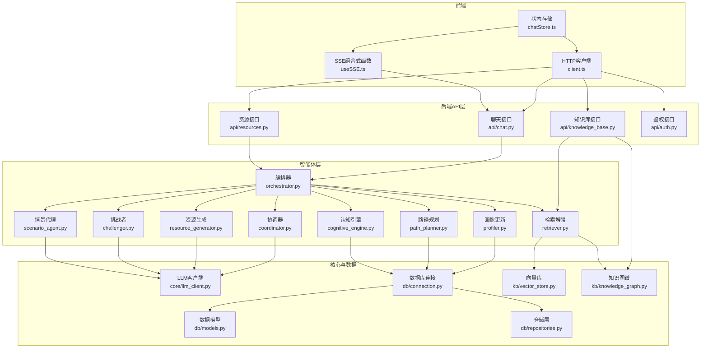
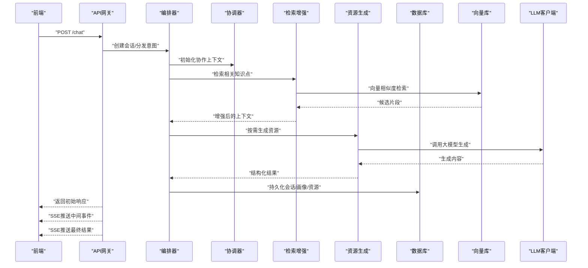
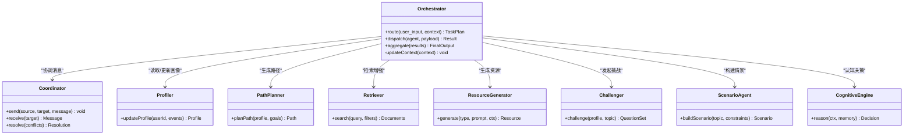
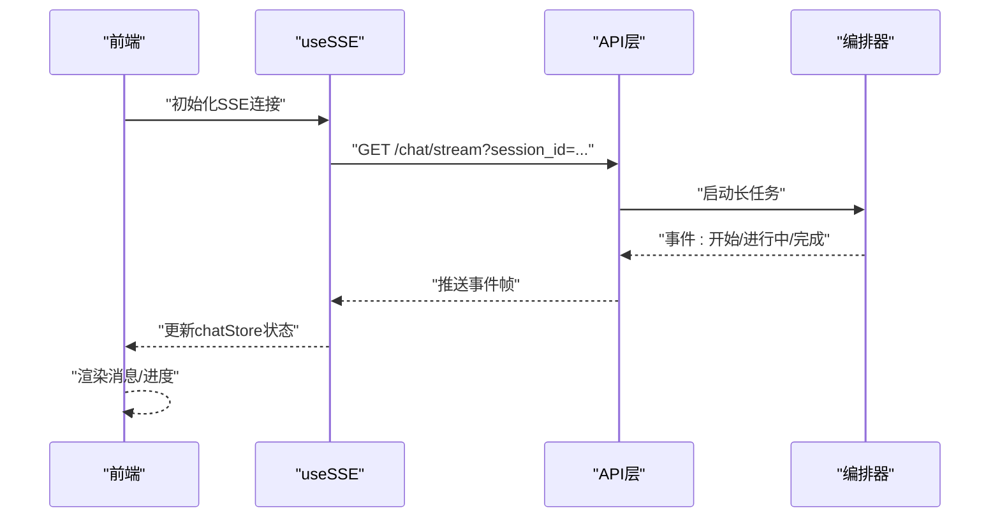
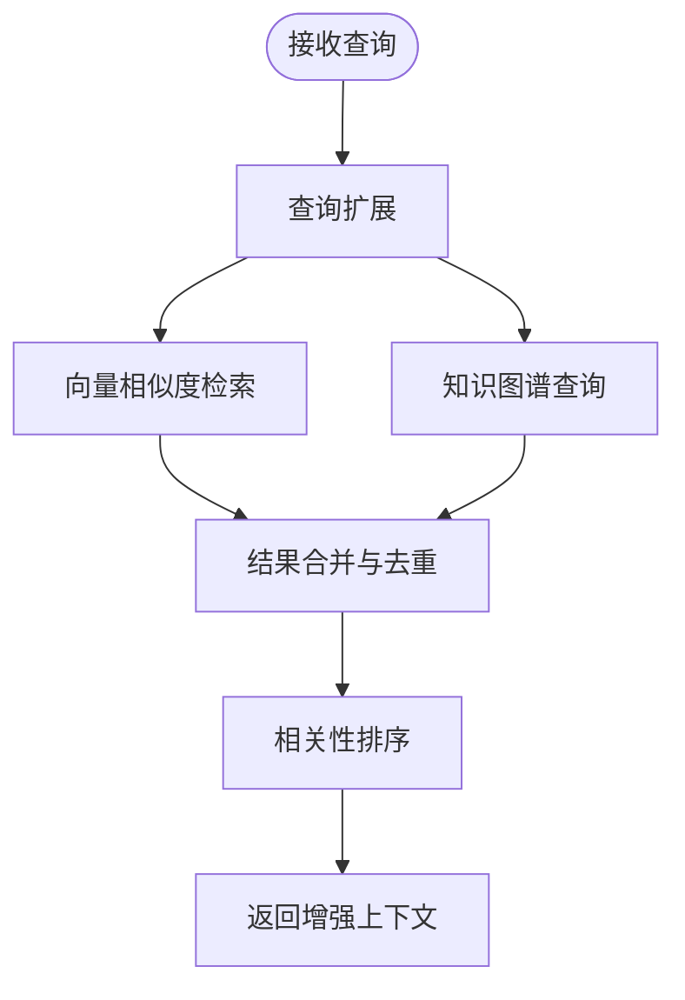
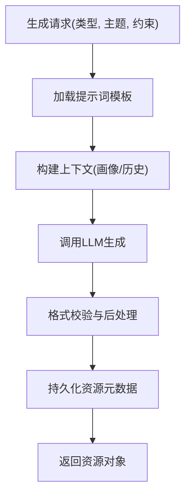
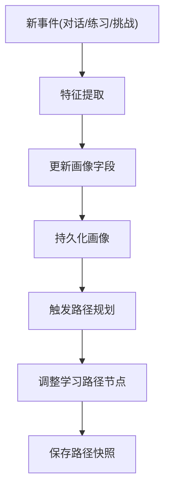
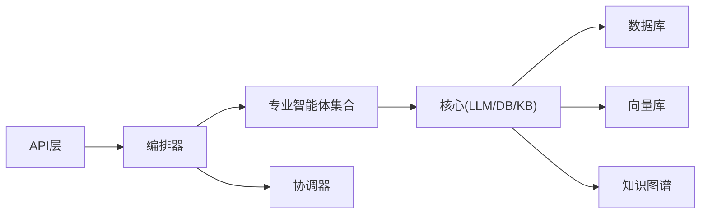
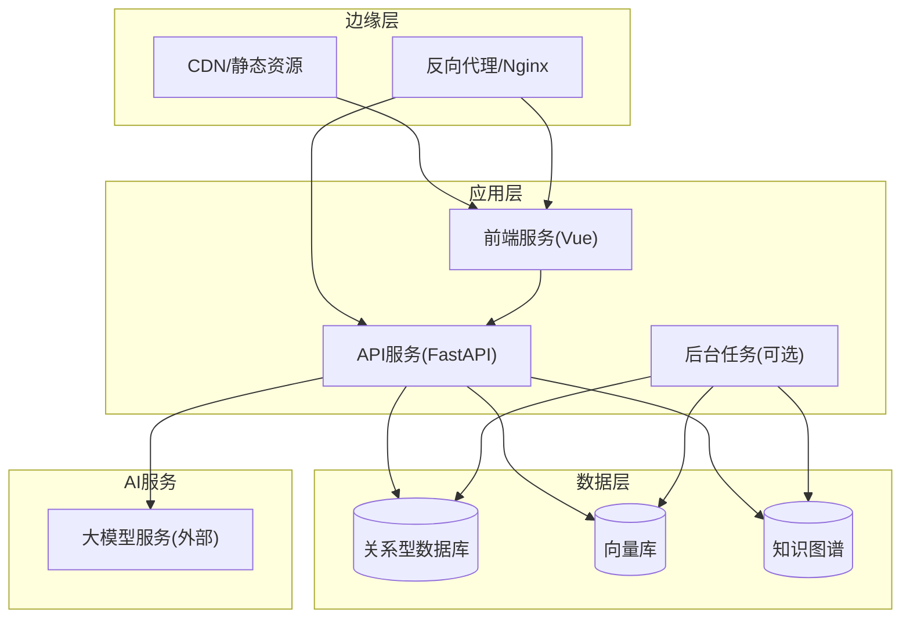

# 系统架构设计

<cite>
**本文引用的文件**   
- [src/loopse/main.py](file://src/loopse/main.py)
- [src/loopse/agent/orchestrator.py](file://src/loopse/agent/orchestrator.py)
- [src/loopse/agent/coordinator.py](file://src/loopse/agent/coordinator.py)
- [src/loopse/agent/cognitive_engine.py](file://src/loopse/agent/cognitive_engine.py)
- [src/loopse/agent/profiler.py](file://src/loopse/agent/profiler.py)
- [src/loopse/agent/path_planner.py](file://src/loopse/agent/path_planner.py)
- [src/loopse/agent/retriever.py](file://src/loopse/agent/retriever.py)
- [src/loopse/agent/resource_generator.py](file://src/loopse/agent/resource_generator.py)
- [src/loopse/agent/challenger.py](file://src/loopse/agent/challenger.py)
- [src/loopse/agent/scenario_agent.py](file://src/loopse/agent/scenario_agent.py)
- [src/loopse/api/chat.py](file://src/loopse/api/chat.py)
- [src/loopse/api/resources.py](file://src/loopse/api/resources.py)
- [src/loopse/api/knowledge_base.py](file://src/loopse/api/knowledge_base.py)
- [src/loopse/api/auth.py](file://src/loopse/api/auth.py)
- [src/loopse/core/llm_client.py](file://src/loopse/core/llm_client.py)
- [src/loopse/db/connection.py](file://src/loopse/db/connection.py)
- [src/loopse/db/models.py](file://src/loopse/db/models.py)
- [src/loopse/db/repositories.py](file://src/loopse/db/repositories.py)
- [src/loopse/kb/vector_store.py](file://src/loopse/kb/vector_store.py)
- [src/loopse/kb/knowledge_graph.py](file://src/loopse/kb/knowledge_graph.py)
- [config/prompts/orchestrator/route.txt](file://config/prompts/orchestrator/route.txt)
- [config/prompts/path_planner/plan_path.txt](file://config/prompts/path_planner/plan_path.txt)
- [config/prompts/retriever/search_query.txt](file://config/prompts/retriever/search_query.txt)
- [config/prompts/resource_generator/generate_code.txt](file://config/prompts/resource_generator/generate_code.txt)
- [config/prompts/profiler/update_profile.txt](file://config/prompts/profiler/update_profile.txt)
- [frontend/src/api/client.ts](file://frontend/src/api/client.ts)
- [frontend/src/composables/useSSE.ts](file://frontend/src/composables/useSSE.ts)
- [frontend/src/stores/chatStore.ts](file://frontend/src/stores/chatStore.ts)
- [frontend/src/types/sse.ts](file://frontend/src/types/sse.ts)
- [pyproject.toml](file://pyproject.toml)
- [requirements.txt](file://requirements.txt)
</cite>

## 目录
1. [引言](#引言)
2. [项目结构](#项目结构)
3. [核心组件](#核心组件)
4. [架构总览](#架构总览)
5. [详细组件分析](#详细组件分析)
6. [依赖关系分析](#依赖关系分析)
7. [性能考虑](#性能考虑)
8. [故障排查指南](#故障排查指南)
9. [结论](#结论)
10. [附录](#附录)

## 引言
本架构文档面向架构师与高级开发者，系统性阐述 Socrates-Cube 的多智能体架构、前后端分离模式与事件驱动通信机制。重点说明 Orchestrator 协调器如何编排不同专业智能体的协作流程，API 网关边界划分、微服务职责与数据流路径，并给出组件交互图、部署拓扑图与扩展点设计。同时总结技术选型决策、性能与安全考量，为后续演进提供指导。

## 项目结构
仓库采用前后端分离与多智能体后端组织方式：
- 前端（Vue 3 + TypeScript）：通过 REST/SSE 与后端交互，管理会话、资源生成、诊断与学习路径等界面状态。
- 后端（Python FastAPI）：以 API 层暴露能力，Agent 层实现多智能体协作，Core/KB/DB 提供通用支撑。
- 配置与提示词：集中存放于 config/prompts，便于策略与模型提示的可配置化。
- 脚本与测试：scripts 用于数据工程与初始化；tests 覆盖关键 Agent 与集成场景。

图表来源
- [src/loopse/main.py:1-200](file://src/loopse/main.py#L1-L200)
- [src/loopse/api/chat.py:1-200](file://src/loopse/api/chat.py#L1-L200)
- [src/loopse/api/resources.py:1-200](file://src/loopse/api/resources.py#L1-L200)
- [src/loopse/api/knowledge_base.py:1-200](file://src/loopse/api/knowledge_base.py#L1-L200)
- [src/loopse/api/auth.py:1-200](file://src/loopse/api/auth.py#L1-L200)
- [src/loopse/agent/orchestrator.py:1-200](file://src/loopse/agent/orchestrator.py#L1-L200)
- [src/loopse/agent/coordinator.py:1-200](file://src/loopse/agent/coordinator.py#L1-L200)
- [src/loopse/agent/profiler.py:1-200](file://src/loopse/agent/profiler.py#L1-L200)
- [src/loopse/agent/path_planner.py:1-200](file://src/loopse/agent/path_planner.py#L1-L200)
- [src/loopse/agent/retriever.py:1-200](file://src/loopse/agent/retriever.py#L1-L200)
- [src/loopse/agent/resource_generator.py:1-200](file://src/loopse/agent/resource_generator.py#L1-L200)
- [src/loopse/agent/challenger.py:1-200](file://src/loopse/agent/challenger.py#L1-L200)
- [src/loopse/agent/scenario_agent.py:1-200](file://src/loopse/agent/scenario_agent.py#L1-L200)
- [src/loopse/agent/cognitive_engine.py:1-200](file://src/loopse/agent/cognitive_engine.py#L1-L200)
- [src/loopse/core/llm_client.py:1-200](file://src/loopse/core/llm_client.py#L1-L200)
- [src/loopse/db/connection.py:1-200](file://src/loopse/db/connection.py#L1-L200)
- [src/loopse/db/models.py:1-200](file://src/loopse/db/models.py#L1-L200)
- [src/loopse/db/repositories.py:1-200](file://src/loopse/db/repositories.py#L1-L200)
- [src/loopse/kb/vector_store.py:1-200](file://src/loopse/kb/vector_store.py#L1-L200)
- [src/loopse/kb/knowledge_graph.py:1-200](file://src/loopse/kb/knowledge_graph.py#L1-L200)

章节来源
- [src/loopse/main.py:1-200](file://src/loopse/main.py#L1-L200)
- [pyproject.toml:1-200](file://pyproject.toml#L1-L200)
- [requirements.txt:1-200](file://requirements.txt#L1-L200)

## 核心组件
- 编排器（Orchestrator）：统一入口，解析用户意图，选择并调度专业智能体，维护任务上下文与结果聚合。
- 协调器（Coordinator）：负责跨智能体的消息路由、状态同步与冲突消解。
- 画像更新（Profiler）：基于对话与行为增量更新学习者画像，持久化至数据库。
- 路径规划（PathPlanner）：依据画像与目标生成个性化学习路径。
- 检索增强（Retriever）：结合向量检索与知识图谱进行查询扩展与召回。
- 资源生成（ResourceGenerator）：按类型生成代码、文档、练习、信息图等教学资源。
- 挑战者（Challenger）：发起问答与挑战，评估理解度并提供反馈。
- 情景代理（ScenarioAgent）：构造情境化任务与仿真环境。
- 认知引擎（CognitiveEngine）：整合记忆、推理与干预策略。
- LLM客户端（LLMClient）：封装大模型调用、重试与限流。
- 数据层（DB/KB）：关系型数据库、向量库与知识图谱的读写抽象。

章节来源
- [src/loopse/agent/orchestrator.py:1-200](file://src/loopse/agent/orchestrator.py#L1-L200)
- [src/loopse/agent/coordinator.py:1-200](file://src/loopse/agent/coordinator.py#L1-L200)
- [src/loopse/agent/profiler.py:1-200](file://src/loopse/agent/profiler.py#L1-L200)
- [src/loopse/agent/path_planner.py:1-200](file://src/loopse/agent/path_planner.py#L1-L200)
- [src/loopse/agent/retriever.py:1-200](file://src/loopse/agent/retriever.py#L1-L200)
- [src/loopse/agent/resource_generator.py:1-200](file://src/loopse/agent/resource_generator.py#L1-L200)
- [src/loopse/agent/challenger.py:1-200](file://src/loopse/agent/challenger.py#L1-L200)
- [src/loopse/agent/scenario_agent.py:1-200](file://src/loopse/agent/scenario_agent.py#L1-L200)
- [src/loopse/agent/cognitive_engine.py:1-200](file://src/loopse/agent/cognitive_engine.py#L1-L200)
- [src/loopse/core/llm_client.py:1-200](file://src/loopse/core/llm_client.py#L1-L200)
- [src/loopse/db/connection.py:1-200](file://src/loopse/db/connection.py#L1-L200)
- [src/loopse/db/models.py:1-200](file://src/loopse/db/models.py#L1-L200)
- [src/loopse/db/repositories.py:1-200](file://src/loopse/db/repositories.py#L1-L200)
- [src/loopse/kb/vector_store.py:1-200](file://src/loopse/kb/vector_store.py#L1-L200)
- [src/loopse/kb/knowledge_graph.py:1-200](file://src/loopse/kb/knowledge_graph.py#L1-L200)

## 架构总览
整体采用“前后端分离 + 多智能体 + 事件驱动”的分层架构：
- 前端通过 HTTP 发起请求，使用 SSE 接收实时事件（如对话流、生成进度）。
- API 层作为网关，将请求路由到对应智能体或编排器。
- 编排器根据提示词策略与上下文决定下一步动作，协调各智能体协作。
- 数据层提供结构化与非结构化数据的持久化与检索。

图表来源
- [src/loopse/api/chat.py:1-200](file://src/loopse/api/chat.py#L1-L200)
- [src/loopse/agent/orchestrator.py:1-200](file://src/loopse/agent/orchestrator.py#L1-L200)
- [src/loopse/agent/coordinator.py:1-200](file://src/loopse/agent/coordinator.py#L1-L200)
- [src/loopse/agent/retriever.py:1-200](file://src/loopse/agent/retriever.py#L1-L200)
- [src/loopse/agent/resource_generator.py:1-200](file://src/loopse/agent/resource_generator.py#L1-L200)
- [src/loopse/core/llm_client.py:1-200](file://src/loopse/core/llm_client.py#L1-L200)
- [src/loopse/db/connection.py:1-200](file://src/loopse/db/connection.py#L1-L200)
- [src/loopse/kb/vector_store.py:1-200](file://src/loopse/kb/vector_store.py#L1-L200)

## 详细组件分析

### 编排器（Orchestrator）与协调器（Coordinator）
- 编排器职责：
  - 解析用户输入，结合画像与历史上下文确定任务类型。
  - 选择并调度专业智能体（检索、生成、挑战、情景等）。
  - 维护全局状态机，确保顺序与并发控制。
- 协调器职责：
  - 在多个智能体之间传递消息与中间结果。
  - 处理冲突与回退策略，保证一致性。

图表来源
- [src/loopse/agent/orchestrator.py:1-200](file://src/loopse/agent/orchestrator.py#L1-L200)
- [src/loopse/agent/coordinator.py:1-200](file://src/loopse/agent/coordinator.py#L1-L200)
- [src/loopse/agent/profiler.py:1-200](file://src/loopse/agent/profiler.py#L1-L200)
- [src/loopse/agent/path_planner.py:1-200](file://src/loopse/agent/path_planner.py#L1-L200)
- [src/loopse/agent/retriever.py:1-200](file://src/loopse/agent/retriever.py#L1-L200)
- [src/loopse/agent/resource_generator.py:1-200](file://src/loopse/agent/resource_generator.py#L1-L200)
- [src/loopse/agent/challenger.py:1-200](file://src/loopse/agent/challenger.py#L1-L200)
- [src/loopse/agent/scenario_agent.py:1-200](file://src/loopse/agent/scenario_agent.py#L1-L200)
- [src/loopse/agent/cognitive_engine.py:1-200](file://src/loopse/agent/cognitive_engine.py#L1-L200)

章节来源
- [src/loopse/agent/orchestrator.py:1-200](file://src/loopse/agent/orchestrator.py#L1-L200)
- [src/loopse/agent/coordinator.py:1-200](file://src/loopse/agent/coordinator.py#L1-L200)

### 事件驱动通信（SSE）
- 前端通过 useSSE 建立与服务器的 Server-Sent Events 连接，订阅会话事件。
- chatStore 管理会话状态，将事件映射为 UI 可渲染的消息与进度。
- 后端在 API 层以流式方式推送中间结果与最终输出。

图表来源
- [frontend/src/composables/useSSE.ts:1-200](file://frontend/src/composables/useSSE.ts#L1-L200)
- [frontend/src/stores/chatStore.ts:1-200](file://frontend/src/stores/chatStore.ts#L1-L200)
- [frontend/src/types/sse.ts:1-200](file://frontend/src/types/sse.ts#L1-L200)
- [src/loopse/api/chat.py:1-200](file://src/loopse/api/chat.py#L1-L200)

章节来源
- [frontend/src/composables/useSSE.ts:1-200](file://frontend/src/composables/useSSE.ts#L1-L200)
- [frontend/src/stores/chatStore.ts:1-200](file://frontend/src/stores/chatStore.ts#L1-L200)
- [frontend/src/types/sse.ts:1-200](file://frontend/src/types/sse.ts#L1-L200)
- [src/loopse/api/chat.py:1-200](file://src/loopse/api/chat.py#L1-L200)

### 检索增强与知识图谱
- 检索增强（Retriever）：对查询进行扩展，结合向量库与知识图谱进行召回与排序。
- 知识图谱（KG）：提供实体关系与概念层级，辅助语义理解与解释性输出。

图表来源
- [src/loopse/agent/retriever.py:1-200](file://src/loopse/agent/retriever.py#L1-L200)
- [src/loopse/kb/vector_store.py:1-200](file://src/loopse/kb/vector_store.py#L1-L200)
- [src/loopse/kb/knowledge_graph.py:1-200](file://src/loopse/kb/knowledge_graph.py#L1-L200)

章节来源
- [src/loopse/agent/retriever.py:1-200](file://src/loopse/agent/retriever.py#L1-L200)
- [src/loopse/kb/vector_store.py:1-200](file://src/loopse/kb/vector_store.py#L1-L200)
- [src/loopse/kb/knowledge_graph.py:1-200](file://src/loopse/kb/knowledge_graph.py#L1-L200)

### 资源生成与提示词策略
- 资源生成（ResourceGenerator）：根据类型与提示词模板生成代码、文档、练习与信息图。
- 提示词位于 config/prompts，支持按角色与任务定制，便于 A/B 实验与版本管理。

图表来源
- [src/loopse/agent/resource_generator.py:1-200](file://src/loopse/agent/resource_generator.py#L1-L200)
- [config/prompts/resource_generator/generate_code.txt:1-200](file://config/prompts/resource_generator/generate_code.txt#L1-L200)
- [src/loopse/core/llm_client.py:1-200](file://src/loopse/core/llm_client.py#L1-L200)

章节来源
- [src/loopse/agent/resource_generator.py:1-200](file://src/loopse/agent/resource_generator.py#L1-L200)
- [config/prompts/resource_generator/generate_code.txt:1-200](file://config/prompts/resource_generator/generate_code.txt#L1-L200)
- [src/loopse/core/llm_client.py:1-200](file://src/loopse/core/llm_client.py#L1-L200)

### 画像更新与路径规划
- 画像更新（Profiler）：从对话与行为事件中提取特征，增量更新学习者画像。
- 路径规划（PathPlanner）：基于画像与学习目标生成个性化路径，支持动态调整。

图表来源
- [src/loopse/agent/profiler.py:1-200](file://src/loopse/agent/profiler.py#L1-L200)
- [src/loopse/agent/path_planner.py:1-200](file://src/loopse/agent/path_planner.py#L1-L200)
- [config/prompts/profiler/update_profile.txt:1-200](file://config/prompts/profiler/update_profile.txt#L1-L200)
- [config/prompts/path_planner/plan_path.txt:1-200](file://config/prompts/path_planner/plan_path.txt#L1-L200)

章节来源
- [src/loopse/agent/profiler.py:1-200](file://src/loopse/agent/profiler.py#L1-L200)
- [src/loopse/agent/path_planner.py:1-200](file://src/loopse/agent/path_planner.py#L1-L200)
- [config/prompts/profiler/update_profile.txt:1-200](file://config/prompts/profiler/update_profile.txt#L1-L200)
- [config/prompts/path_planner/plan_path.txt:1-200](file://config/prompts/path_planner/plan_path.txt#L1-L200)

### 挑战者与情景代理
- 挑战者（Challenger）：根据当前主题与画像生成问题集，评估理解度并给出反馈。
- 情景代理（ScenarioAgent）：构造贴近真实场景的任务，提升迁移与应用能力。

章节来源
- [src/loopse/agent/challenger.py:1-200](file://src/loopse/agent/challenger.py#L1-L200)
- [src/loopse/agent/scenario_agent.py:1-200](file://src/loopse/agent/scenario_agent.py#L1-L200)

### 前端API客户端与状态管理
- client.ts：封装基础HTTP请求、拦截器与错误处理。
- chatStore.ts：管理会话、消息列表与生成进度，配合SSE实时更新。
- useSSE.ts：统一SSE连接生命周期与事件分发。

章节来源
- [frontend/src/api/client.ts:1-200](file://frontend/src/api/client.ts#L1-L200)
- [frontend/src/stores/chatStore.ts:1-200](file://frontend/src/stores/chatStore.ts#L1-L200)
- [frontend/src/composables/useSSE.ts:1-200](file://frontend/src/composables/useSSE.ts#L1-L200)

## 依赖关系分析
- 模块耦合：
  - API 层仅依赖编排器与必要的数据仓储，保持薄网关特性。
  - 编排器对专业智能体存在强依赖，但通过协调器降低直接耦合。
  - 数据层通过仓储抽象屏蔽具体存储细节，便于替换与扩展。
- 外部依赖：
  - LLM 客户端封装第三方大模型服务，支持重试与限流。
  - 向量库与知识图谱提供非结构化与结构化知识的检索能力。

图表来源
- [src/loopse/main.py:1-200](file://src/loopse/main.py#L1-L200)
- [src/loopse/agent/orchestrator.py:1-200](file://src/loopse/agent/orchestrator.py#L1-L200)
- [src/loopse/core/llm_client.py:1-200](file://src/loopse/core/llm_client.py#L1-L200)
- [src/loopse/db/connection.py:1-200](file://src/loopse/db/connection.py#L1-L200)
- [src/loopse/kb/vector_store.py:1-200](file://src/loopse/kb/vector_store.py#L1-L200)
- [src/loopse/kb/knowledge_graph.py:1-200](file://src/loopse/kb/knowledge_graph.py#L1-L200)

章节来源
- [src/loopse/main.py:1-200](file://src/loopse/main.py#L1-L200)
- [src/loopse/agent/orchestrator.py:1-200](file://src/loopse/agent/orchestrator.py#L1-L200)
- [src/loopse/core/llm_client.py:1-200](file://src/loopse/core/llm_client.py#L1-L200)
- [src/loopse/db/connection.py:1-200](file://src/loopse/db/connection.py#L1-L200)
- [src/loopse/kb/vector_store.py:1-200](file://src/loopse/kb/vector_store.py#L1-L200)
- [src/loopse/kb/knowledge_graph.py:1-200](file://src/loopse/kb/knowledge_graph.py#L1-L200)

## 性能考虑
- 并发与异步：
  - 使用异步I/O与流式响应，减少阻塞，提高吞吐。
  - 对LLM调用实施限流与重试，避免雪崩。
- 缓存与索引：
  - 对热点查询结果与画像快照进行缓存，降低重复计算。
  - 向量库与知识图谱索引优化，提升检索速度。
- 资源生成优化：
  - 分块生成与增量返回，改善首字节延迟。
  - 模板与提示词版本化管理，便于快速回滚与A/B测试。
- 前端体验：
  - SSE 事件节流与去抖，避免UI频繁重绘。
  - 离线与降级策略，保障弱网可用性。

[本节为通用性能建议，不直接分析具体文件]

## 故障排查指南
- 常见问题定位：
  - SSE断连：检查前端连接生命周期与后端事件推送是否持续。
  - LLM超时：查看客户端重试与限流配置，确认上游服务健康。
  - 检索质量差：核对向量库索引与查询扩展策略，验证知识图谱边权重。
  - 画像漂移：审查事件抽取逻辑与更新频率，必要时引入人工校准。
- 日志与监控：
  - 在编排器与协调器增加关键路径日志，记录事件ID与耗时。
  - 对API层添加访问与错误统计，便于容量规划与异常告警。

章节来源
- [src/loopse/agent/orchestrator.py:1-200](file://src/loopse/agent/orchestrator.py#L1-L200)
- [src/loopse/agent/coordinator.py:1-200](file://src/loopse/agent/coordinator.py#L1-L200)
- [src/loopse/api/chat.py:1-200](file://src/loopse/api/chat.py#L1-L200)
- [frontend/src/composables/useSSE.ts:1-200](file://frontend/src/composables/useSSE.ts#L1-L200)

## 结论
Socrates-Cube 通过编排器与协调器实现多智能体协作，结合检索增强与知识图谱提升回答质量与可解释性。前后端分离与事件驱动通信保障了良好的用户体验与可扩展性。建议在后续迭代中强化安全与隐私保护、完善监控与可观测性，并持续优化提示词与检索策略，以提升系统稳定性与效果。

[本节为总结性内容，不直接分析具体文件]

## 附录

### 部署拓扑图

[此图为概念性部署拓扑，未直接映射具体源码文件]

### 扩展点设计
- 新增智能体：
  - 在编排器注册新智能体路由，定义输入输出契约。
  - 在协调器中声明消息协议与冲突消解规则。
- 新增资源类型：
  - 在资源生成器中扩展类型分支与提示词模板。
  - 在前端增加卡片组件与展示逻辑。
- 检索策略升级：
  - 在检索增强中接入新的向量模型或图谱算法。
  - 提供查询扩展与重排插件接口。
- 安全与隐私：
  - 在鉴权与隐私模块增加细粒度权限与审计日志。
  - 对敏感数据进行脱敏与加密存储。

[本节为概念性扩展点设计，不直接分析具体文件]