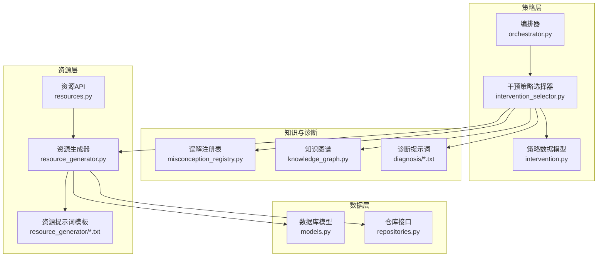
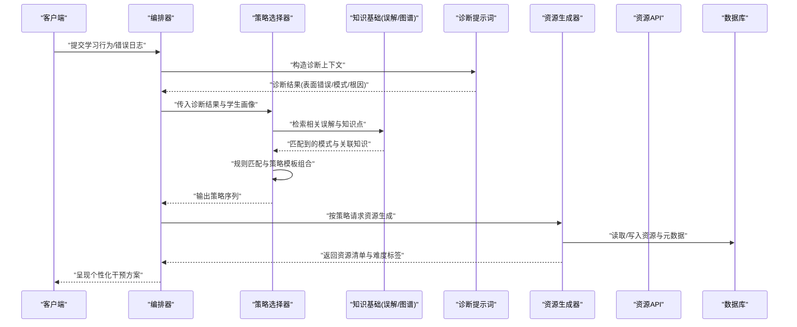
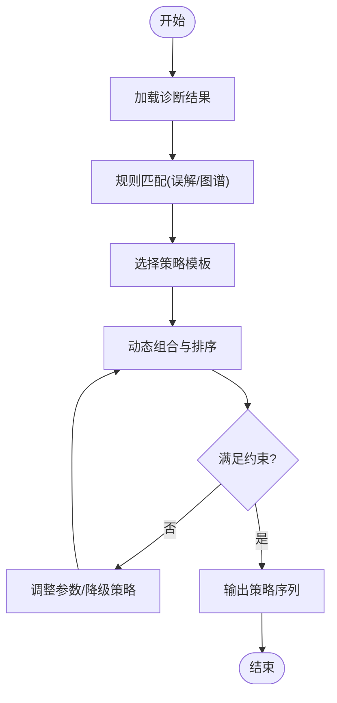
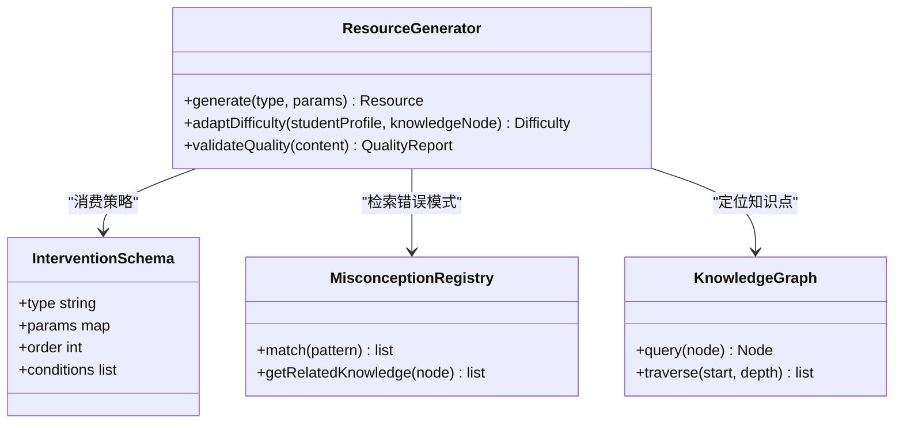
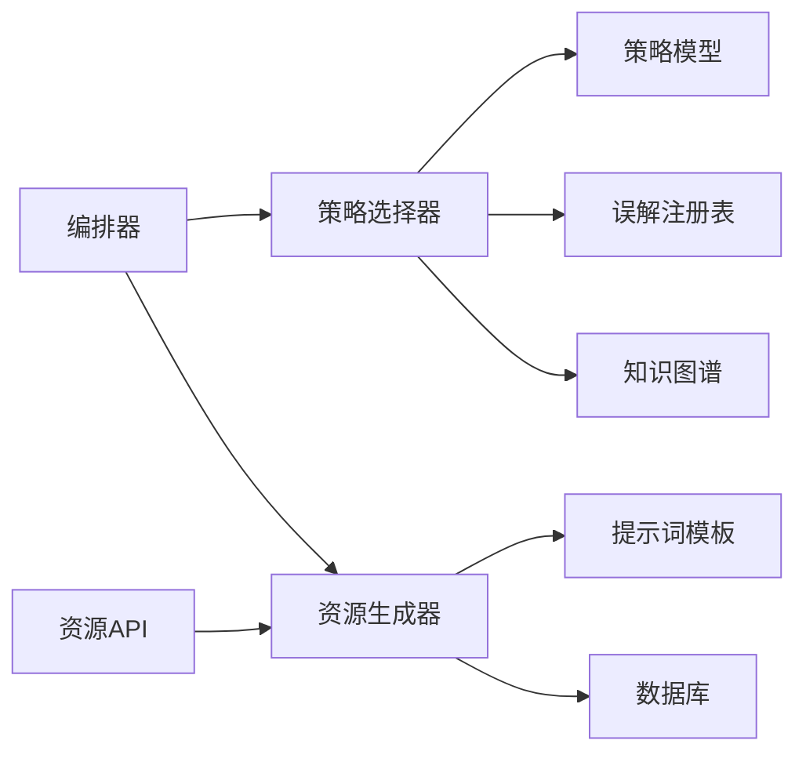

# 干预策略生成

<cite>
**本文引用的文件**   
- [src/loopse/agent/intervention_selector.py](file://src/loopse/agent/intervention_selector.py)
- [src/loopse/schema/intervention.py](file://src/loopse/schema/intervention.py)
- [src/loopse/agent/orchestrator.py](file://src/loopse/agent/orchestrator.py)
- [src/loopse/api/resources.py](file://src/loopse/api/resources.py)
- [src/loopse/agent/resource_generator.py](file://src/loopse/agent/resource_generator.py)
- [config/prompts/resource_generator/generate_exercise.txt](file://config/prompts/resource_generator/generate_exercise.txt)
- [config/prompts/resource_generator/generate_doc.txt](file://config/prompts/resource_generator/generate_doc.txt)
- [config/prompts/resource_generator/generate_code.txt](file://config/prompts/resource_generator/generate_code.txt)
- [config/prompts/resource_generator/generate_infographic.txt](file://config/prompts/resource_generator/generate_infographic.txt)
- [config/prompts/resource_generator/generate_script.txt](file://config/prompts/resource_generator/generate_script.txt)
- [config/prompts/diagnosis/pattern_match.txt](file://config/prompts/diagnosis/pattern_match.txt)
- [config/prompts/diagnosis/root_cause.txt](file://config/prompts/diagnosis/root_cause.txt)
- [config/prompts/diagnosis/surface_error.txt](file://config/prompts/diagnosis/surface_error.txt)
- [src/loopse/kb/misconception_registry.py](file://src/loopse/kb/misconception_registry.py)
- [src/loopse/kb/knowledge_graph.py](file://src/loopse/kb/knowledge_graph.py)
- [src/loopse/db/models.py](file://src/loopse/db/models.py)
- [src/loopse/db/repositories.py](file://src/loopse/db/repositories.py)
- [tests/unit/test_resource_generator.py](file://tests/unit/test_resource_generator.py)
- [tests/unit/test_resource_generator_all_types.py](file://tests/unit/test_resource_generator_all_types.py)
</cite>

## 目录
1. [引言](#引言)
2. [项目结构](#项目结构)
3. [核心组件](#核心组件)
4. [架构总览](#架构总览)
5. [详细组件分析](#详细组件分析)
6. [依赖关系分析](#依赖关系分析)
7. [性能考虑](#性能考虑)
8. [故障排查指南](#故障排查指南)
9. [结论](#结论)
10. [附录](#附录)

## 引言
本技术文档聚焦于“干预策略生成”模块，围绕基于诊断结果的个性化干预策略生成机制展开，涵盖：
- 策略模板系统、规则引擎与动态组合算法
- 针对不同类型错误的干预方案设计原则（补救练习、概念讲解、示例演示、渐进式引导）
- 与资源生成系统的集成方式（资源匹配、难度适配、效果预测）
- 策略有效性评估、A/B测试框架与持续优化机制
- 自定义干预策略的开发规范与最佳实践

目标读者包括后端工程师、教育产品设计师与数据科学团队。

## 项目结构
与干预策略生成相关的代码主要位于后端服务中，关键路径如下：
- 策略选择与编排：src/loopse/agent/intervention_selector.py、src/loopse/agent/orchestrator.py
- 策略数据模型：src/loopse/schema/intervention.py
- 资源生成与API：src/loopse/agent/resource_generator.py、src/loopse/api/resources.py
- 知识基础与错误模式：src/loopse/kb/misconception_registry.py、src/loopse/kb/knowledge_graph.py
- 持久化模型与仓库：src/loopse/db/models.py、src/loopse/db/repositories.py
- 提示词模板（资源生成）：config/prompts/resource_generator/*.txt
- 诊断提示词模板：config/prompts/diagnosis/*.txt
- 单元测试：tests/unit/test_resource_generator*.py

图表来源
- [src/loopse/agent/intervention_selector.py](file://src/loopse/agent/intervention_selector.py)
- [src/loopse/agent/orchestrator.py](file://src/loopse/agent/orchestrator.py)
- [src/loopse/schema/intervention.py](file://src/loopse/schema/intervention.py)
- [src/loopse/kb/misconception_registry.py](file://src/loopse/kb/misconception_registry.py)
- [src/loopse/kb/knowledge_graph.py](file://src/loopse/kb/knowledge_graph.py)
- [src/loopse/agent/resource_generator.py](file://src/loopse/agent/resource_generator.py)
- [src/loopse/api/resources.py](file://src/loopse/api/resources.py)
- [src/loopse/db/models.py](file://src/loopse/db/models.py)
- [src/loopse/db/repositories.py](file://src/loopse/db/repositories.py)
- [config/prompts/diagnosis/pattern_match.txt](file://config/prompts/diagnosis/pattern_match.txt)
- [config/prompts/diagnosis/root_cause.txt](file://config/prompts/diagnosis/root_cause.txt)
- [config/prompts/diagnosis/surface_error.txt](file://config/prompts/diagnosis/surface_error.txt)
- [config/prompts/resource_generator/generate_exercise.txt](file://config/prompts/resource_generator/generate_exercise.txt)
- [config/prompts/resource_generator/generate_doc.txt](file://config/prompts/resource_generator/generate_doc.txt)
- [config/prompts/resource_generator/generate_code.txt](file://config/prompts/resource_generator/generate_code.txt)
- [config/prompts/resource_generator/generate_infographic.txt](file://config/prompts/resource_generator/generate_infographic.txt)
- [config/prompts/resource_generator/generate_script.txt](file://config/prompts/resource_generator/generate_script.txt)

章节来源
- [src/loopse/agent/intervention_selector.py](file://src/loopse/agent/intervention_selector.py)
- [src/loopse/agent/orchestrator.py](file://src/loopse/agent/orchestrator.py)
- [src/loopse/schema/intervention.py](file://src/loopse/schema/intervention.py)
- [src/loopse/agent/resource_generator.py](file://src/loopse/agent/resource_generator.py)
- [src/loopse/api/resources.py](file://src/loopse/api/resources.py)
- [src/loopse/kb/misconception_registry.py](file://src/loopse/kb/misconception_registry.py)
- [src/loopse/kb/knowledge_graph.py](file://src/loopse/kb/knowledge_graph.py)
- [src/loopse/db/models.py](file://src/loopse/db/models.py)
- [src/loopse/db/repositories.py](file://src/loopse/db/repositories.py)
- [config/prompts/diagnosis/pattern_match.txt](file://config/prompts/diagnosis/pattern_match.txt)
- [config/prompts/diagnosis/root_cause.txt](file://config/prompts/diagnosis/root_cause.txt)
- [config/prompts/diagnosis/surface_error.txt](file://config/prompts/diagnosis/surface_error.txt)
- [config/prompts/resource_generator/generate_exercise.txt](file://config/prompts/resource_generator/generate_exercise.txt)
- [config/prompts/resource_generator/generate_doc.txt](file://config/prompts/resource_generator/generate_doc.txt)
- [config/prompts/resource_generator/generate_code.txt](file://config/prompts/resource_generator/generate_code.txt)
- [config/prompts/resource_generator/generate_infographic.txt](file://config/prompts/resource_generator/generate_infographic.txt)
- [config/prompts/resource_generator/generate_script.txt](file://config/prompts/resource_generator/generate_script.txt)

## 核心组件
- 干预策略选择器：负责将诊断结果映射为可执行的干预策略序列，支持模板化策略、规则匹配与动态组合。
- 策略数据模型：定义策略类型、参数、顺序、条件与元数据，确保前后端一致的数据契约。
- 资源生成器：根据策略需求生成具体学习资源（练习、文档、代码、信息图、脚本等），并支持难度适配与质量校验。
- 资源API：对外暴露资源生成与查询接口，供前端或外部系统调用。
- 知识基础：包含误解注册表与知识图谱，用于错误归因、知识点定位与内容检索。
- 编排器：串联诊断、策略选择、资源生成与反馈收集，形成闭环。

章节来源
- [src/loopse/agent/intervention_selector.py](file://src/loopse/agent/intervention_selector.py)
- [src/loopse/schema/intervention.py](file://src/loopse/schema/intervention.py)
- [src/loopse/agent/resource_generator.py](file://src/loopse/agent/resource_generator.py)
- [src/loopse/api/resources.py](file://src/loopse/api/resources.py)
- [src/loopse/kb/misconception_registry.py](file://src/loopse/kb/misconception_registry.py)
- [src/loopse/kb/knowledge_graph.py](file://src/loopse/kb/knowledge_graph.py)
- [src/loopse/agent/orchestrator.py](file://src/loopse/agent/orchestrator.py)

## 架构总览
下图展示了从诊断到策略生成再到资源产出的端到端流程，以及数据在组件间的流转。

图表来源
- [src/loopse/agent/orchestrator.py](file://src/loopse/agent/orchestrator.py)
- [src/loopse/agent/intervention_selector.py](file://src/loopse/agent/intervention_selector.py)
- [src/loopse/kb/misconception_registry.py](file://src/loopse/kb/misconception_registry.py)
- [src/loopse/kb/knowledge_graph.py](file://src/loopse/kb/knowledge_graph.py)
- [config/prompts/diagnosis/pattern_match.txt](file://config/prompts/diagnosis/pattern_match.txt)
- [config/prompts/diagnosis/root_cause.txt](file://config/prompts/diagnosis/root_cause.txt)
- [config/prompts/diagnosis/surface_error.txt](file://config/prompts/diagnosis/surface_error.txt)
- [src/loopse/agent/resource_generator.py](file://src/loopse/agent/resource_generator.py)
- [src/loopse/api/resources.py](file://src/loopse/api/resources.py)
- [src/loopse/db/models.py](file://src/loopse/db/models.py)
- [src/loopse/db/repositories.py](file://src/loopse/db/repositories.py)

## 详细组件分析

### 干预策略选择器（规则引擎与动态组合）
- 输入：诊断结果（表面错误、错误模式、根因）、学生画像（能力、偏好、历史表现）。
- 处理：
  - 规则匹配：依据误解注册表与知识图谱进行模式识别与知识点定位。
  - 模板组合：从策略模板库中选择合适模板，按优先级与约束条件进行排序与拼接。
  - 动态组合：根据学生当前状态与资源可用性，调整策略顺序与粒度（如先概念讲解再示例演示最后补救练习）。
- 输出：策略序列（含类型、参数、顺序、条件、预期效果与评估指标）。

图表来源
- [src/loopse/agent/intervention_selector.py](file://src/loopse/agent/intervention_selector.py)
- [src/loopse/kb/misconception_registry.py](file://src/loopse/kb/misconception_registry.py)
- [src/loopse/kb/knowledge_graph.py](file://src/loopse/kb/knowledge_graph.py)
- [src/loopse/schema/intervention.py](file://src/loopse/schema/intervention.py)

章节来源
- [src/loopse/agent/intervention_selector.py](file://src/loopse/agent/intervention_selector.py)
- [src/loopse/schema/intervention.py](file://src/loopse/schema/intervention.py)
- [src/loopse/kb/misconception_registry.py](file://src/loopse/kb/misconception_registry.py)
- [src/loopse/kb/knowledge_graph.py](file://src/loopse/kb/knowledge_graph.py)

### 策略数据模型（策略模板系统）
- 设计要点：
  - 策略类型：如“补救练习”“概念讲解”“示例演示”“渐进式引导”。
  - 参数化：难度、步骤数、提示级别、资源类型、评估阈值。
  - 组合约束：互斥、依赖、顺序、条件触发。
  - 元数据：版本、来源、适用场景、效果预估。
- 作用：统一前后端契约，支撑策略模板管理与扩展。

章节来源
- [src/loopse/schema/intervention.py](file://src/loopse/schema/intervention.py)

### 资源生成器（与策略的集成）
- 职责：
  - 根据策略类型与参数生成对应资源（练习、文档、代码、信息图、脚本）。
  - 难度适配：结合学生画像与知识点掌握度调整资源难度。
  - 质量校验：对生成内容进行一致性、可读性与教学有效性检查。
- 集成点：
  - 接收策略序列，逐项解析并调用相应提示词模板。
  - 与数据库交互，持久化资源与元数据，便于追踪与评估。

图表来源
- [src/loopse/agent/resource_generator.py](file://src/loopse/agent/resource_generator.py)
- [src/loopse/schema/intervention.py](file://src/loopse/schema/intervention.py)
- [src/loopse/kb/misconception_registry.py](file://src/loopse/kb/misconception_registry.py)
- [src/loopse/kb/knowledge_graph.py](file://src/loopse/kb/knowledge_graph.py)

章节来源
- [src/loopse/agent/resource_generator.py](file://src/loopse/agent/resource_generator.py)
- [src/loopse/schema/intervention.py](file://src/loopse/schema/intervention.py)
- [src/loopse/kb/misconception_registry.py](file://src/loopse/kb/misconception_registry.py)
- [src/loopse/kb/knowledge_graph.py](file://src/loopse/kb/knowledge_graph.py)

### 资源API（对外接口）
- 功能：提供资源生成、查询、更新与删除接口；支持批量生成与异步任务。
- 安全与限流：鉴权、速率限制、审计日志。
- 与策略层协作：接受策略ID或策略片段，驱动资源生成流水线。

章节来源
- [src/loopse/api/resources.py](file://src/loopse/api/resources.py)

### 编排器（端到端流程控制）
- 职责：协调诊断、策略选择、资源生成与反馈收集；管理状态机与重试/降级策略。
- 关键点：
  - 诊断阶段：使用诊断提示词模板构建上下文，产出结构化诊断结果。
  - 策略阶段：调用策略选择器生成策略序列。
  - 资源阶段：调度资源生成器并按需并行生成。
  - 评估阶段：记录执行日志与效果指标，进入持续优化循环。

章节来源
- [src/loopse/agent/orchestrator.py](file://src/loopse/agent/orchestrator.py)
- [config/prompts/diagnosis/pattern_match.txt](file://config/prompts/diagnosis/pattern_match.txt)
- [config/prompts/diagnosis/root_cause.txt](file://config/prompts/diagnosis/root_cause.txt)
- [config/prompts/diagnosis/surface_error.txt](file://config/prompts/diagnosis/surface_error.txt)

### 知识基础（误解注册表与知识图谱）
- 误解注册表：维护常见错误模式与对应知识点，支持快速匹配与溯源。
- 知识图谱：组织知识点层级与依赖关系，支持路径规划与难度递进。
- 与策略/资源的联动：为策略选择提供依据，为资源生成提供内容与难度参考。

章节来源
- [src/loopse/kb/misconception_registry.py](file://src/loopse/kb/misconception_registry.py)
- [src/loopse/kb/knowledge_graph.py](file://src/loopse/kb/knowledge_graph.py)

### 数据模型与仓库（持久化）
- 模型：定义资源、策略、用户画像、诊断结果等实体及其关系。
- 仓库：封装CRUD操作与复杂查询，支持索引与分页。
- 与生成器的集成：读写资源元数据、记录生成历史与质量报告。

章节来源
- [src/loopse/db/models.py](file://src/loopse/db/models.py)
- [src/loopse/db/repositories.py](file://src/loopse/db/repositories.py)

### 提示词模板（资源生成与诊断）
- 资源生成模板：针对不同资源类型（练习、文档、代码、信息图、脚本）提供结构化提示词，确保生成内容的教学有效性与一致性。
- 诊断模板：覆盖表面错误、错误模式与根因分析，提升诊断准确性与可解释性。

章节来源
- [config/prompts/resource_generator/generate_exercise.txt](file://config/prompts/resource_generator/generate_exercise.txt)
- [config/prompts/resource_generator/generate_doc.txt](file://config/prompts/resource_generator/generate_doc.txt)
- [config/prompts/resource_generator/generate_code.txt](file://config/prompts/resource_generator/generate_code.txt)
- [config/prompts/resource_generator/generate_infographic.txt](file://config/prompts/resource_generator/generate_infographic.txt)
- [config/prompts/resource_generator/generate_script.txt](file://config/prompts/resource_generator/generate_script.txt)
- [config/prompts/diagnosis/pattern_match.txt](file://config/prompts/diagnosis/pattern_match.txt)
- [config/prompts/diagnosis/root_cause.txt](file://config/prompts/diagnosis/root_cause.txt)
- [config/prompts/diagnosis/surface_error.txt](file://config/prompts/diagnosis/surface_error.txt)

## 依赖关系分析
- 组件耦合：
  - 策略选择器依赖知识基础与策略数据模型，低耦合高内聚。
  - 资源生成器依赖策略模型与知识基础，通过API与数据库解耦。
  - 编排器作为控制器，聚合各组件能力，保持流程清晰。
- 外部依赖：
  - LLM提示词模板（配置化），便于替换与迭代。
  - 数据库与仓库接口，支持迁移与扩展。

图表来源
- [src/loopse/agent/orchestrator.py](file://src/loopse/agent/orchestrator.py)
- [src/loopse/agent/intervention_selector.py](file://src/loopse/agent/intervention_selector.py)
- [src/loopse/schema/intervention.py](file://src/loopse/schema/intervention.py)
- [src/loopse/kb/misconception_registry.py](file://src/loopse/kb/misconception_registry.py)
- [src/loopse/kb/knowledge_graph.py](file://src/loopse/kb/knowledge_graph.py)
- [src/loopse/agent/resource_generator.py](file://src/loopse/agent/resource_generator.py)
- [src/loopse/api/resources.py](file://src/loopse/api/resources.py)
- [src/loopse/db/models.py](file://src/loopse/db/models.py)
- [src/loopse/db/repositories.py](file://src/loopse/db/repositories.py)

章节来源
- [src/loopse/agent/orchestrator.py](file://src/loopse/agent/orchestrator.py)
- [src/loopse/agent/intervention_selector.py](file://src/loopse/agent/intervention_selector.py)
- [src/loopse/schema/intervention.py](file://src/loopse/schema/intervention.py)
- [src/loopse/agent/resource_generator.py](file://src/loopse/agent/resource_generator.py)
- [src/loopse/api/resources.py](file://src/loopse/api/resources.py)
- [src/loopse/kb/misconception_registry.py](file://src/loopse/kb/misconception_registry.py)
- [src/loopse/kb/knowledge_graph.py](file://src/loopse/kb/knowledge_graph.py)
- [src/loopse/db/models.py](file://src/loopse/db/models.py)
- [src/loopse/db/repositories.py](file://src/loopse/db/repositories.py)

## 性能考虑
- 并行生成：资源生成器可对多策略并行生成，缩短整体时延。
- 缓存策略：对高频知识点与模板结果进行缓存，减少重复计算。
- 增量更新：仅对变化部分重新生成，避免全量重建。
- 异步任务：大体积资源（视频、信息图）采用异步队列与进度回调。
- 索引优化：对知识图谱与误解注册表建立高效索引，加速匹配。

[本节为通用指导，不直接分析具体文件]

## 故障排查指南
- 常见问题：
  - 诊断结果不稳定：检查诊断提示词模板与上下文构造逻辑。
  - 策略未生效：确认策略模板参数与约束条件是否满足。
  - 资源生成失败：查看资源生成器日志与质量报告，核对提示词模板。
  - 数据库写入异常：检查仓库接口与模型定义的一致性。
- 建议工具：
  - 启用详细日志与链路追踪。
  - 使用单元测试验证策略与资源生成的边界情况。
  - 引入回归测试与A/B对比，定位问题影响面。

章节来源
- [tests/unit/test_resource_generator.py](file://tests/unit/test_resource_generator.py)
- [tests/unit/test_resource_generator_all_types.py](file://tests/unit/test_resource_generator_all_types.py)

## 结论
本模块以“诊断→策略→资源”为主线，通过模板化策略、规则引擎与动态组合算法实现个性化干预。借助知识基础与提示词模板，系统在可扩展性与教学效果之间取得平衡。后续可通过A/B测试与持续优化机制进一步提升策略有效性与用户体验。

[本节为总结性内容，不直接分析具体文件]

## 附录

### 不同类型错误的干预方案设计原则
- 补救练习：针对技能型错误，提供针对性练习与即时反馈，逐步提升正确率。
- 概念讲解：针对理解型错误，重构概念框架，强调关键差异与联系。
- 示例演示：针对应用困难，展示典型样例与反例，强化迁移能力。
- 渐进式引导：针对复杂问题，分步拆解并提供脚手架，降低认知负荷。

[本节为概念性说明，不直接分析具体文件]

### 与资源生成系统的集成方式
- 资源匹配：依据策略类型与知识点定位，选择最合适的资源模板。
- 难度适配：结合学生画像与掌握度，动态调整资源难度与提示级别。
- 效果预测：基于历史数据与质量报告，预估策略与资源的预期收益。

章节来源
- [src/loopse/agent/resource_generator.py](file://src/loopse/agent/resource_generator.py)
- [src/loopse/api/resources.py](file://src/loopse/api/resources.py)
- [src/loopse/db/models.py](file://src/loopse/db/models.py)
- [src/loopse/db/repositories.py](file://src/loopse/db/repositories.py)

### 策略有效性评估、A/B测试与持续优化
- 评估指标：正确率提升、完成时间、参与度、满意度、迁移效果。
- A/B框架：随机分组、对照组设置、显著性检验与置信区间。
- 持续优化：基于反馈数据迭代策略模板与规则权重，定期复盘与回滚机制。

[本节为方法论说明，不直接分析具体文件]

### 自定义干预策略开发规范与最佳实践
- 规范：
  - 明确策略类型与参数契约，遵循策略数据模型。
  - 提供清晰的触发条件与退出标准。
  - 编写单元测试与集成测试，覆盖边界与异常路径。
- 最佳实践：
  - 小步快跑，灰度发布新策略。
  - 结合知识图谱与误解注册表，确保策略的可解释性。
  - 记录生成日志与效果指标，形成闭环优化。

章节来源
- [src/loopse/schema/intervention.py](file://src/loopse/schema/intervention.py)
- [tests/unit/test_resource_generator.py](file://tests/unit/test_resource_generator.py)
- [tests/unit/test_resource_generator_all_types.py](file://tests/unit/test_resource_generator_all_types.py)