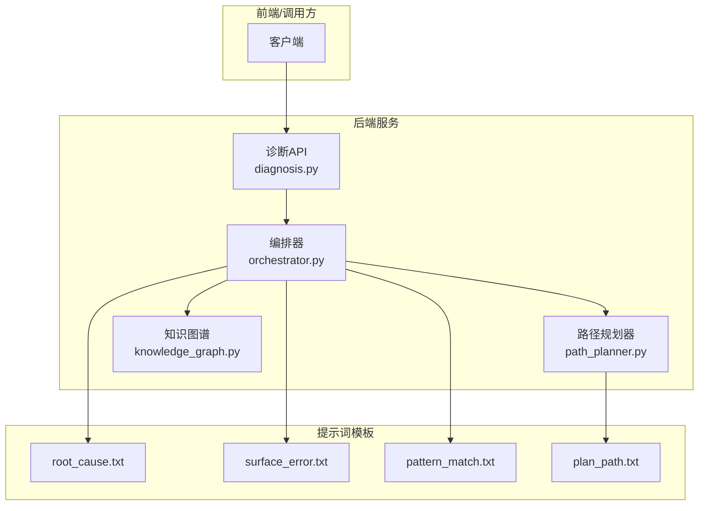
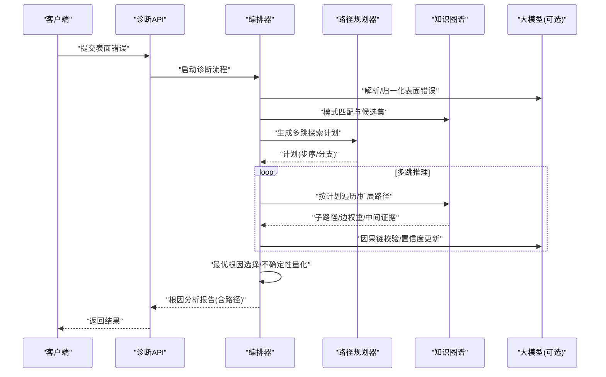
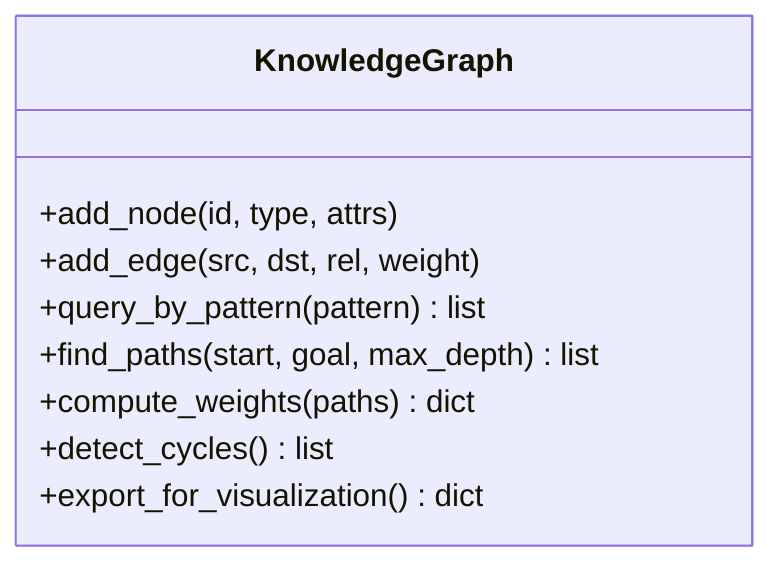
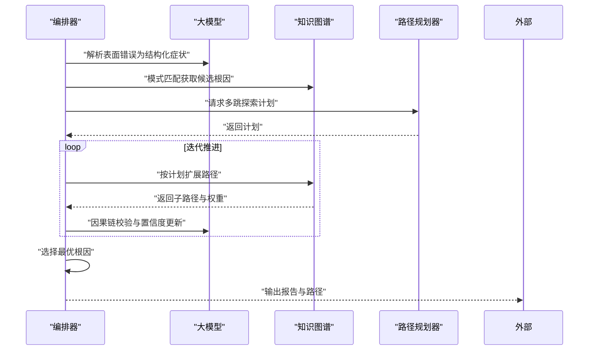
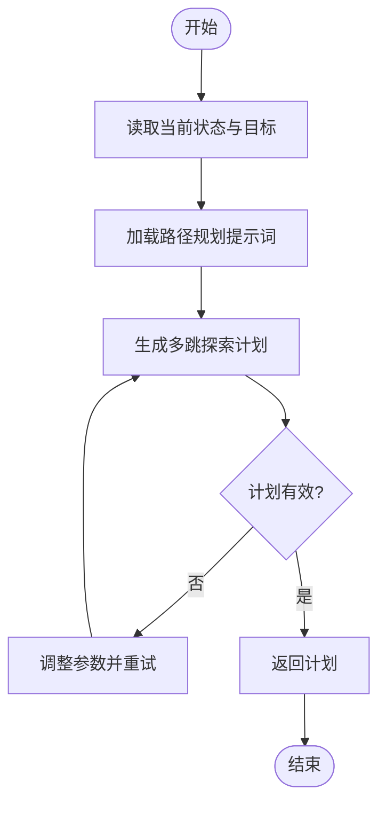
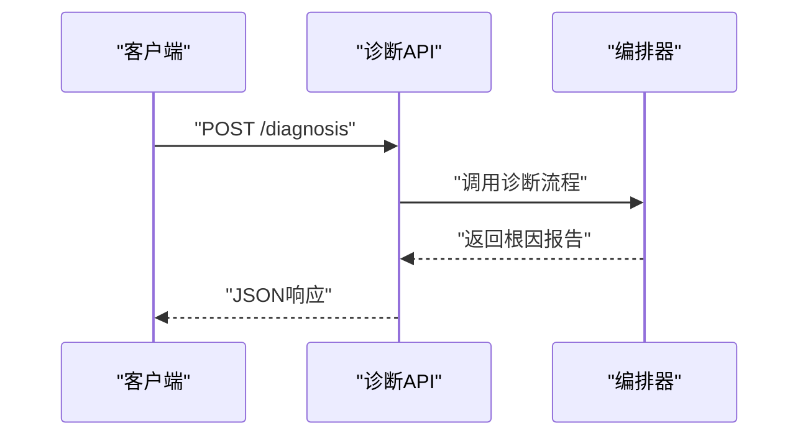
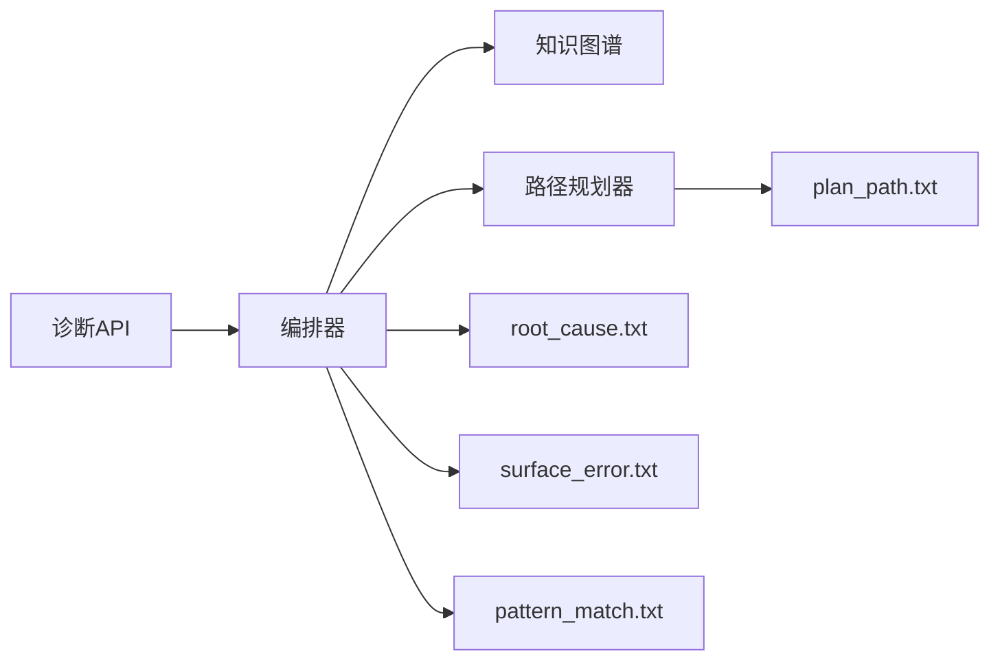

# 根因分析引擎

<cite>
**本文引用的文件**   
- [src/loopse/kb/knowledge_graph.py](file://src/loopse/kb/knowledge_graph.py)
- [src/loopse/agent/orchestrator.py](file://src/loopse/agent/orchestrator.py)
- [src/loopse/agent/path_planner.py](file://src/loopse/agent/path_planner.py)
- [src/loopse/api/diagnosis.py](file://src/loopse/api/diagnosis.py)
- [config/prompts/diagnosis/root_cause.txt](file://config/prompts/diagnosis/root_cause.txt)
- [config/prompts/diagnosis/surface_error.txt](file://config/prompts/diagnosis/surface_error.txt)
- [config/prompts/diagnosis/pattern_match.txt](file://config/prompts/diagnosis/pattern_match.txt)
- [config/prompts/path_planner/plan_path.txt](file://config/prompts/path_planner/plan_path.txt)
- [tests/unit/test_diagnosis_agent.py](file://tests/unit/test_diagnosis_agent.py)
- [tests/unit/test_diagnosis_layer3.py](file://tests/unit/test_diagnosis_layer3.py)
- [tests/unit/test_diagnosis_path_integration.py](file://tests/unit/test_diagnosis_path_integration.py)
</cite>

## 目录
1. [简介](#简介)
2. [项目结构](#项目结构)
3. [核心组件](#核心组件)
4. [架构总览](#架构总览)
5. [详细组件分析](#详细组件分析)
6. [依赖关系分析](#依赖关系分析)
7. [性能考量](#性能考量)
8. [故障排查指南](#故障排查指南)
9. [结论](#结论)
10. [附录](#附录)

## 简介
本技术文档聚焦于“根因分析引擎”，围绕知识图谱遍历、因果链推理与依赖关系分析，系统化阐述从表面错误到根本原因的定位过程。内容涵盖多跳推理、路径搜索与最优解选择；知识图谱在根因分析中的应用（节点关系挖掘、路径权重计算、循环依赖检测）；推理过程的可视化展示、不确定性处理与可解释性输出；以及自定义推理规则与扩展方法的实现指南。

## 项目结构
根因分析相关代码主要分布在以下模块：
- 知识图谱与检索：src/loopse/kb/knowledge_graph.py
- 诊断编排与流程控制：src/loopse/agent/orchestrator.py
- 路径规划与策略生成：src/loopse/agent/path_planner.py
- 诊断API入口：src/loopse/api/diagnosis.py
- 诊断提示词模板：config/prompts/diagnosis/* 与 config/prompts/path_planner/*
- 单元测试覆盖：tests/unit/test_diagnosis_*.py

图表来源
- [src/loopse/api/diagnosis.py](file://src/loopse/api/diagnosis.py)
- [src/loopse/agent/orchestrator.py](file://src/loopse/agent/orchestrator.py)
- [src/loopse/agent/path_planner.py](file://src/loopse/agent/path_planner.py)
- [src/loopse/kb/knowledge_graph.py](file://src/loopse/kb/knowledge_graph.py)
- [config/prompts/diagnosis/root_cause.txt](file://config/prompts/diagnosis/root_cause.txt)
- [config/prompts/diagnosis/surface_error.txt](file://config/prompts/diagnosis/surface_error.txt)
- [config/prompts/diagnosis/pattern_match.txt](file://config/prompts/diagnosis/pattern_match.txt)
- [config/prompts/path_planner/plan_path.txt](file://config/prompts/path_planner/plan_path.txt)

章节来源
- [src/loopse/api/diagnosis.py](file://src/loopse/api/diagnosis.py)
- [src/loopse/agent/orchestrator.py](file://src/loopse/agent/orchestrator.py)
- [src/loopse/agent/path_planner.py](file://src/loopse/agent/path_planner.py)
- [src/loopse/kb/knowledge_graph.py](file://src/loopse/kb/knowledge_graph.py)
- [config/prompts/diagnosis/root_cause.txt](file://config/prompts/diagnosis/root_cause.txt)
- [config/prompts/diagnosis/surface_error.txt](file://config/prompts/diagnosis/surface_error.txt)
- [config/prompts/diagnosis/pattern_match.txt](file://config/prompts/diagnosis/pattern_match.txt)
- [config/prompts/path_planner/plan_path.txt](file://config/prompts/path_planner/plan_path.txt)

## 核心组件
- 知识图谱（KG）
  - 负责节点与关系的建模、查询与遍历，提供路径发现、权重计算与环检测能力。
- 编排器（Orchestrator）
  - 协调诊断流程：解析表面错误、触发模式匹配、组织多跳推理、汇总证据并生成可解释报告。
- 路径规划器（PathPlanner）
  - 基于提示词与图结构生成探索计划，指导多跳搜索的步序与分支策略。
- 诊断API
  - 对外暴露诊断接口，接收表面错误描述，返回根因分析与建议路径。

章节来源
- [src/loopse/kb/knowledge_graph.py](file://src/loopse/kb/knowledge_graph.py)
- [src/loopse/agent/orchestrator.py](file://src/loopse/agent/orchestrator.py)
- [src/loopse/agent/path_planner.py](file://src/loopse/agent/path_planner.py)
- [src/loopse/api/diagnosis.py](file://src/loopse/api/diagnosis.py)

## 架构总览
根因分析的整体流程如下：
- 输入：表面错误描述或症状集合
- 步骤：
  1) 表面错误解析与归一化
  2) 模式匹配与候选根因初筛
  3) 路径规划与多跳探索
  4) 因果链构建与证据聚合
  5) 最优根因选择与不确定性评估
  6) 可解释报告输出（含可视化路径）

图表来源
- [src/loopse/api/diagnosis.py](file://src/loopse/api/diagnosis.py)
- [src/loopse/agent/orchestrator.py](file://src/loopse/agent/orchestrator.py)
- [src/loopse/agent/path_planner.py](file://src/loopse/agent/path_planner.py)
- [src/loopse/kb/knowledge_graph.py](file://src/loopse/kb/knowledge_graph.py)

## 详细组件分析

### 知识图谱（KG）
职责与能力
- 节点与关系建模：支持概念、现象、原因、证据等实体类型及有向关系。
- 路径发现：广度/深度/启发式搜索，支持带权边与约束条件。
- 权重计算：综合语义相似度、历史命中频率、专家标注等信号。
- 循环依赖检测：识别并剪枝环路，避免无限展开。
- 可视化导出：输出节点、边与路径序列供前端渲染。

关键数据结构与复杂度
- 邻接表表示图，时间复杂度与边数线性相关；路径搜索受分支因子与最大深度影响。
- 权重聚合可采用对数平滑或贝叶斯更新，保证数值稳定。

优化机会
- 缓存热点路径与中间结果
- 预计算局部中心性与社区划分以加速候选筛选
- 使用双向搜索或A*启发式减少搜索空间

图表来源
- [src/loopse/kb/knowledge_graph.py](file://src/loopse/kb/knowledge_graph.py)

章节来源
- [src/loopse/kb/knowledge_graph.py](file://src/loopse/kb/knowledge_graph.py)

### 编排器（Orchestrator）
职责与流程
- 接收表面错误，调用LLM进行结构化解析。
- 驱动模式匹配，生成候选根因集合。
- 协同路径规划器执行多跳推理，维护证据与置信度。
- 选择最优根因，输出可解释报告与可视化路径。

交互时序

图表来源
- [src/loopse/agent/orchestrator.py](file://src/loopse/agent/orchestrator.py)
- [src/loopse/agent/path_planner.py](file://src/loopse/agent/path_planner.py)
- [src/loopse/kb/knowledge_graph.py](file://src/loopse/kb/knowledge_graph.py)

章节来源
- [src/loopse/agent/orchestrator.py](file://src/loopse/agent/orchestrator.py)

### 路径规划器（PathPlanner）
职责与策略
- 根据当前状态与目标，生成多跳探索计划（步序、分支、终止条件）。
- 结合提示词模板与图特征，动态调整搜索策略。
- 输出可执行的计划供编排器调度。

图表来源
- [src/loopse/agent/path_planner.py](file://src/loopse/agent/path_planner.py)
- [config/prompts/path_planner/plan_path.txt](file://config/prompts/path_planner/plan_path.txt)

章节来源
- [src/loopse/agent/path_planner.py](file://src/loopse/agent/path_planner.py)
- [config/prompts/path_planner/plan_path.txt](file://config/prompts/path_planner/plan_path.txt)

### 诊断API
职责与契约
- 暴露诊断接口，接收表面错误描述，返回根因分析与建议路径。
- 负责鉴权、限流与日志记录（由上层框架保障）。
- 将编排器输出的结构化结果转换为统一响应格式。

图表来源
- [src/loopse/api/diagnosis.py](file://src/loopse/api/diagnosis.py)
- [src/loopse/agent/orchestrator.py](file://src/loopse/agent/orchestrator.py)

章节来源
- [src/loopse/api/diagnosis.py](file://src/loopse/api/diagnosis.py)

### 提示词模板与可解释性
- surface_error.txt：用于将自然语言症状标准化为结构化字段。
- pattern_match.txt：定义模式匹配规则与候选根因筛选逻辑。
- root_cause.txt：引导因果链构建、证据聚合与最终结论生成。
- plan_path.txt：指导多跳探索的计划生成与终止条件。

这些模板通过编排器注入上下文，确保推理过程具备一致性与可解释性。

章节来源
- [config/prompts/diagnosis/surface_error.txt](file://config/prompts/diagnosis/surface_error.txt)
- [config/prompts/diagnosis/pattern_match.txt](file://config/prompts/diagnosis/pattern_match.txt)
- [config/prompts/diagnosis/root_cause.txt](file://config/prompts/diagnosis/root_cause.txt)
- [config/prompts/path_planner/plan_path.txt](file://config/prompts/path_planner/plan_path.txt)

## 依赖关系分析
组件间耦合与协作
- 诊断API仅依赖编排器，保持对外契约稳定。
- 编排器依赖知识图谱与路径规划器，并通过提示词模板增强可解释性。
- 路径规划器依赖提示词模板与图结构信息。
- 知识图谱作为底层基础设施，被编排器与路径规划器共同复用。

图表来源
- [src/loopse/api/diagnosis.py](file://src/loopse/api/diagnosis.py)
- [src/loopse/agent/orchestrator.py](file://src/loopse/agent/orchestrator.py)
- [src/loopse/agent/path_planner.py](file://src/loopse/agent/path_planner.py)
- [src/loopse/kb/knowledge_graph.py](file://src/loopse/kb/knowledge_graph.py)
- [config/prompts/diagnosis/root_cause.txt](file://config/prompts/diagnosis/root_cause.txt)
- [config/prompts/diagnosis/surface_error.txt](file://config/prompts/diagnosis/surface_error.txt)
- [config/prompts/diagnosis/pattern_match.txt](file://config/prompts/diagnosis/pattern_match.txt)
- [config/prompts/path_planner/plan_path.txt](file://config/prompts/path_planner/plan_path.txt)

章节来源
- [src/loopse/api/diagnosis.py](file://src/loopse/api/diagnosis.py)
- [src/loopse/agent/orchestrator.py](file://src/loopse/agent/orchestrator.py)
- [src/loopse/agent/path_planner.py](file://src/loopse/agent/path_planner.py)
- [src/loopse/kb/knowledge_graph.py](file://src/loopse/kb/knowledge_graph.py)
- [config/prompts/diagnosis/root_cause.txt](file://config/prompts/diagnosis/root_cause.txt)
- [config/prompts/diagnosis/surface_error.txt](file://config/prompts/diagnosis/surface_error.txt)
- [config/prompts/diagnosis/pattern_match.txt](file://config/prompts/diagnosis/pattern_match.txt)
- [config/prompts/path_planner/plan_path.txt](file://config/prompts/path_planner/plan_path.txt)

## 性能考量
- 搜索空间控制：限制最大深度与分支因子，采用启发式排序优先扩展高置信度路径。
- 缓存与去重：缓存已访问节点与路径片段，避免重复计算。
- 增量更新：对新增证据采用增量权重更新，降低全量重算开销。
- 并行化：对独立分支的图遍历与LLM校验进行并发执行，提升吞吐。
- 资源监控：记录各阶段耗时与内存占用，便于定位瓶颈。

[本节为通用性能建议，不直接分析具体文件]

## 故障排查指南
常见问题与定位方法
- 表面错误解析失败：检查surface_error.txt模板与输入质量，必要时增加清洗与规范化步骤。
- 模式匹配无候选：确认知识图谱中是否存在对应关系，或放宽匹配阈值。
- 路径搜索超时：降低max_depth、启用剪枝与缓存，或引入更有效的启发函数。
- 循环依赖导致死循环：启用循环检测与自动剪枝，输出环信息以便人工复核。
- 置信度过低或不稳定：检查权重计算与证据聚合逻辑，考虑引入更多可靠信号源。

章节来源
- [tests/unit/test_diagnosis_agent.py](file://tests/unit/test_diagnosis_agent.py)
- [tests/unit/test_diagnosis_layer3.py](file://tests/unit/test_diagnosis_layer3.py)
- [tests/unit/test_diagnosis_path_integration.py](file://tests/unit/test_diagnosis_path_integration.py)

## 结论
根因分析引擎以知识图谱为基础，结合编排器与路径规划器，实现了从表面错误到根本原因的多跳推理与可解释输出。通过提示词模板与不确定性量化，系统在保证可解释性的同时提升了鲁棒性与可扩展性。未来可在权重学习、启发式搜索与并行化方面持续优化，以满足更大规模与更高时效性的需求。

[本节为总结性内容，不直接分析具体文件]

## 附录

### 自定义推理规则与扩展方法
- 扩展知识图谱关系类型
  - 在KG中添加新关系类型与权重计算策略，并在模式匹配模板中声明相应规则。
- 新增模式匹配规则
  - 在pattern_match.txt中补充规则描述与触发条件，编排器将自动纳入候选集生成。
- 定制路径规划策略
  - 修改plan_path.txt以调整探索步序、分支策略与终止条件，适配不同场景。
- 集成新的证据源
  - 在编排器的证据聚合阶段接入新数据源，并更新置信度计算逻辑。
- 可解释性增强
  - 在root_cause.txt中细化因果链表达与证据引用格式，提升报告可读性。

章节来源
- [src/loopse/kb/knowledge_graph.py](file://src/loopse/kb/knowledge_graph.py)
- [config/prompts/diagnosis/pattern_match.txt](file://config/prompts/diagnosis/pattern_match.txt)
- [config/prompts/path_planner/plan_path.txt](file://config/prompts/path_planner/plan_path.txt)
- [config/prompts/diagnosis/root_cause.txt](file://config/prompts/diagnosis/root_cause.txt)
- [src/loopse/agent/orchestrator.py](file://src/loopse/agent/orchestrator.py)