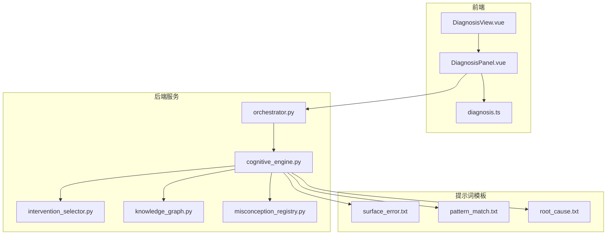
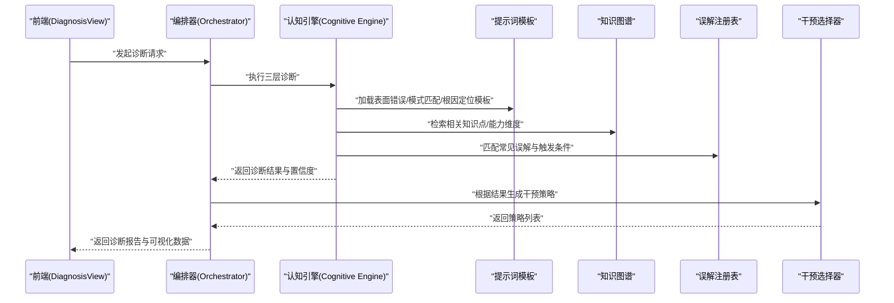
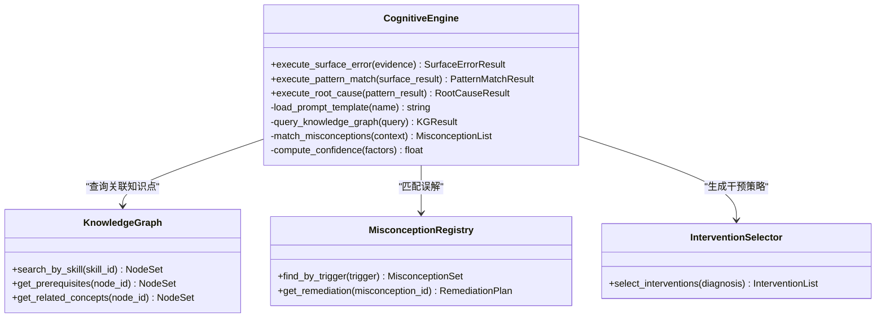
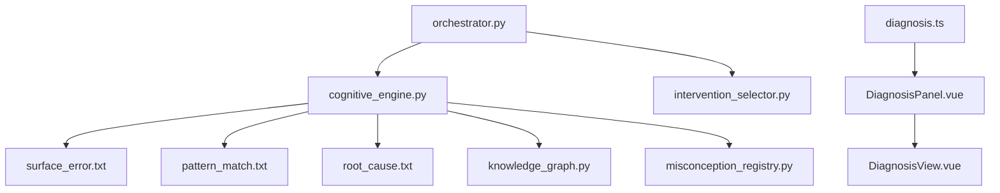

# 认知诊断系统

<cite>
**本文引用的文件**   
- [config/prompts/diagnosis/surface_error.txt](file://config/prompts/diagnosis/surface_error.txt)
- [config/prompts/diagnosis/pattern_match.txt](file://config/prompts/diagnosis/pattern_match.txt)
- [config/prompts/diagnosis/root_cause.txt](file://config/prompts/diagnosis/root_cause.txt)
- [src/loopse/agent/cognitive_engine.py](file://src/loopse/agent/cognitive_engine.py)
- [src/loopse/agent/orchestrator.py](file://src/loopse/agent/orchestrator.py)
- [src/loopse/agent/intervention_selector.py](file://src/loopse/agent/intervention_selector.py)
- [src/loopse/kb/knowledge_graph.py](file://src/loopse/kb/knowledge_graph.py)
- [src/loopse/kb/misconception_registry.py](file://src/loopse/kb/misconception_registry.py)
- [src/loopse/schema/intervention.py](file://src/loopse/schema/intervention.py)
- [src/loopse/schema/profile.py](file://src/loopse/schema/profile.py)
- [frontend/src/types/diagnosis.ts](file://frontend/src/types/diagnosis.ts)
- [frontend/src/components/DiagnosisPanel.vue](file://frontend/src/components/DiagnosisPanel.vue)
- [frontend/src/views/DiagnosisView.vue](file://frontend/src/views/DiagnosisView.vue)
- [scripts/run_diagnosis_accuracy_test.py](file://scripts/run_diagnosis_accuracy_test.py)
</cite>

## 目录
1. [引言](#引言)
2. [项目结构](#项目结构)
3. [核心组件](#核心组件)
4. [架构总览](#架构总览)
5. [详细组件分析](#详细组件分析)
6. [依赖关系分析](#依赖关系分析)
7. [性能考量](#性能考量)
8. [故障排查指南](#故障排查指南)
9. [结论](#结论)
10. [附录](#附录)

## 引言
本技术文档面向“认知诊断系统”，聚焦多层诊断架构的设计理念与实现，包括表面错误识别、模式匹配分析与根因定位。文档深入阐述错误模式识别算法、知识图谱关联分析与干预策略生成机制；系统化说明诊断提示词模板的设计原则与定制方法；定义诊断结果的数据结构、置信度计算与可视化展示方案；提供诊断准确率评估方法与持续优化策略；并给出扩展新错误类型与诊断规则的方法论与实践路径。

## 项目结构
本项目采用前后端分离与多智能体协作的架构：前端负责交互与可视化，后端以智能体为核心编排诊断流程，结合知识库（知识图谱与误解注册表）进行推理与决策，并通过提示词模板驱动大模型完成分层诊断任务。

图表来源
- [frontend/src/views/DiagnosisView.vue](file://frontend/src/views/DiagnosisView.vue)
- [frontend/src/components/DiagnosisPanel.vue](file://frontend/src/components/DiagnosisPanel.vue)
- [frontend/src/types/diagnosis.ts](file://frontend/src/types/diagnosis.ts)
- [src/loopse/agent/orchestrator.py](file://src/loopse/agent/orchestrator.py)
- [src/loopse/agent/cognitive_engine.py](file://src/loopse/agent/cognitive_engine.py)
- [src/loopse/agent/intervention_selector.py](file://src/loopse/agent/intervention_selector.py)
- [src/loopse/kb/knowledge_graph.py](file://src/loopse/kb/knowledge_graph.py)
- [src/loopse/kb/misconception_registry.py](file://src/loopse/kb/misconception_registry.py)
- [config/prompts/diagnosis/surface_error.txt](file://config/prompts/diagnosis/surface_error.txt)
- [config/prompts/diagnosis/pattern_match.txt](file://config/prompts/diagnosis/pattern_match.txt)
- [config/prompts/diagnosis/root_cause.txt](file://config/prompts/diagnosis/root_cause.txt)

章节来源
- [frontend/src/views/DiagnosisView.vue](file://frontend/src/views/DiagnosisView.vue)
- [frontend/src/components/DiagnosisPanel.vue](file://frontend/src/components/DiagnosisPanel.vue)
- [frontend/src/types/diagnosis.ts](file://frontend/src/types/diagnosis.ts)
- [src/loopse/agent/orchestrator.py](file://src/loopse/agent/orchestrator.py)
- [src/loopse/agent/cognitive_engine.py](file://src/loopse/agent/cognitive_engine.py)
- [src/loopse/agent/intervention_selector.py](file://src/loopse/agent/intervention_selector.py)
- [src/loopse/kb/knowledge_graph.py](file://src/loopse/kb/knowledge_graph.py)
- [src/loopse/kb/misconception_registry.py](file://src/loopse/kb/misconception_registry.py)
- [config/prompts/diagnosis/surface_error.txt](file://config/prompts/diagnosis/surface_error.txt)
- [config/prompts/diagnosis/pattern_match.txt](file://config/prompts/diagnosis/pattern_match.txt)
- [config/prompts/diagnosis/root_cause.txt](file://config/prompts/diagnosis/root_cause.txt)

## 核心组件
- 认知引擎（Cognitive Engine）：承载三层诊断流水线（表面错误识别→模式匹配→根因定位），协调提示词模板、知识图谱与误解注册表，输出结构化诊断结果与置信度。
- 编排器（Orchestrator）：对外暴露诊断接口，管理会话状态、调用认知引擎、聚合结果并返回给前端。
- 干预选择器（Intervention Selector）：基于诊断结果与学习者画像，生成个性化干预策略。
- 知识图谱（Knowledge Graph）：维护知识点、技能、能力维度及其关系，支撑关联分析与溯源。
- 误解注册表（Misconception Registry）：集中管理常见误解、触发条件与修复建议，辅助模式匹配与根因推断。
- 提示词模板（Prompt Templates）：为三层诊断分别提供结构化输入与输出约束，确保可解释性与一致性。
- 前端诊断视图与类型：定义诊断数据结构、渲染诊断步骤与可视化结果。

章节来源
- [src/loopse/agent/cognitive_engine.py](file://src/loopse/agent/cognitive_engine.py)
- [src/loopse/agent/orchestrator.py](file://src/loopse/agent/orchestrator.py)
- [src/loopse/agent/intervention_selector.py](file://src/loopse/agent/intervention_selector.py)
- [src/loopse/kb/knowledge_graph.py](file://src/loopse/kb/knowledge_graph.py)
- [src/loopse/kb/misconception_registry.py](file://src/loopse/kb/misconception_registry.py)
- [config/prompts/diagnosis/surface_error.txt](file://config/prompts/diagnosis/surface_error.txt)
- [config/prompts/diagnosis/pattern_match.txt](file://config/prompts/diagnosis/pattern_match.txt)
- [config/prompts/diagnosis/root_cause.txt](file://config/prompts/diagnosis/root_cause.txt)
- [frontend/src/types/diagnosis.ts](file://frontend/src/types/diagnosis.ts)
- [frontend/src/components/DiagnosisPanel.vue](file://frontend/src/components/DiagnosisPanel.vue)
- [frontend/src/views/DiagnosisView.vue](file://frontend/src/views/DiagnosisView.vue)

## 架构总览
多层诊断架构通过“感知—匹配—归因”的分层处理，将原始学习行为或作答证据转化为可解释的诊断结论与可执行的干预策略。

图表来源
- [src/loopse/agent/orchestrator.py](file://src/loopse/agent/orchestrator.py)
- [src/loopse/agent/cognitive_engine.py](file://src/loopse/agent/cognitive_engine.py)
- [config/prompts/diagnosis/surface_error.txt](file://config/prompts/diagnosis/surface_error.txt)
- [config/prompts/diagnosis/pattern_match.txt](file://config/prompts/diagnosis/pattern_match.txt)
- [config/prompts/diagnosis/root_cause.txt](file://config/prompts/diagnosis/root_cause.txt)
- [src/loopse/kb/knowledge_graph.py](file://src/loopse/kb/knowledge_graph.py)
- [src/loopse/kb/misconception_registry.py](file://src/loopse/kb/misconception_registry.py)
- [src/loopse/agent/intervention_selector.py](file://src/loopse/agent/intervention_selector.py)

## 详细组件分析

### 认知引擎（Cognitive Engine）
认知引擎是诊断系统的核心，负责串联三层诊断流程，并将外部资源（提示词模板、知识图谱、误解注册表）整合为统一的诊断管线。

图表来源
- [src/loopse/agent/cognitive_engine.py](file://src/loopse/agent/cognitive_engine.py)
- [src/loopse/kb/knowledge_graph.py](file://src/loopse/kb/knowledge_graph.py)
- [src/loopse/kb/misconception_registry.py](file://src/loopse/kb/misconception_registry.py)
- [src/loopse/agent/intervention_selector.py](file://src/loopse/agent/intervention_selector.py)

章节来源
- [src/loopse/agent/cognitive_engine.py](file://src/loopse/agent/cognitive_engine.py)

#### 表面错误识别（Surface Error Identification）
- 目标：从原始证据（如作答记录、交互日志）中抽取显式错误信号，形成初步的错误描述与上下文。
- 输入：学习者行为证据、题目元数据、时间戳等。
- 处理：使用“表面错误”提示词模板引导模型进行结构化提取，结合前置条件与知识点边界过滤噪声。
- 输出：表面错误对象，包含错误类型、位置、证据片段、初步置信度。

章节来源
- [config/prompts/diagnosis/surface_error.txt](file://config/prompts/diagnosis/surface_error.txt)
- [src/loopse/agent/cognitive_engine.py](file://src/loopse/agent/cognitive_engine.py)

#### 模式匹配分析（Pattern Matching Analysis）
- 目标：将表面错误映射到已知错误模式集合，识别重复出现的思维偏差或解题路径错误。
- 输入：表面错误结果、学习者历史表现、当前题目情境。
- 处理：使用“模式匹配”提示词模板，结合误解注册表的触发条件进行匹配，必要时引入知识图谱的关联概念增强上下文。
- 输出：匹配到的错误模式、相似案例、模式置信度、关联知识点。

章节来源
- [config/prompts/diagnosis/pattern_match.txt](file://config/prompts/diagnosis/pattern_match.txt)
- [src/loopse/kb/misconception_registry.py](file://src/loopse/kb/misconception_registry.py)
- [src/loopse/kb/knowledge_graph.py](file://src/loopse/kb/knowledge_graph.py)
- [src/loopse/agent/cognitive_engine.py](file://src/loopse/agent/cognitive_engine.py)

#### 根因定位（Root Cause Localization）
- 目标：在模式匹配基础上，进一步定位导致错误的深层原因（如先备知识缺失、概念混淆、策略不当）。
- 输入：模式匹配结果、知识图谱中的先决关系与关联概念、学习者画像。
- 处理：使用“根因定位”提示词模板，综合知识图谱的先决依赖与误解注册表的修复建议，生成可解释的根因链。
- 输出：根因节点、影响范围、修复优先级、置信度。

章节来源
- [config/prompts/diagnosis/root_cause.txt](file://config/prompts/diagnosis/root_cause.txt)
- [src/loopse/kb/knowledge_graph.py](file://src/loopse/kb/knowledge_graph.py)
- [src/loopse/agent/cognitive_engine.py](file://src/loopse/agent/cognitive_engine.py)

### 编排器（Orchestrator）
编排器作为对外服务入口，负责接收诊断请求、调度认知引擎、聚合结果并返回给前端。其职责包括：
- 参数校验与会话管理
- 调用认知引擎的三层诊断流程
- 合并干预策略与可视化数据
- 错误处理与重试策略

章节来源
- [src/loopse/agent/orchestrator.py](file://src/loopse/agent/orchestrator.py)

### 干预选择器（Intervention Selector）
基于诊断结果与学习者画像，生成个性化干预策略，包括：
- 资源推荐（微课、练习、文档）
- 路径规划（补救学习顺序）
- 反馈提示（即时纠错与反思问题）
- 难度调整（自适应升降级）

章节来源
- [src/loopse/agent/intervention_selector.py](file://src/loopse/agent/intervention_selector.py)
- [src/loopse/schema/intervention.py](file://src/loopse/schema/intervention.py)

### 知识图谱（Knowledge Graph）
知识图谱用于表示知识点、技能、能力维度及其关系，支持：
- 按技能检索相关节点
- 获取先决条件与关联概念
- 构建根因影响的传播路径

章节来源
- [src/loopse/kb/knowledge_graph.py](file://src/loopse/kb/knowledge_graph.py)

### 误解注册表（Misconception Registry）
误解注册表集中管理常见误解、触发条件与修复建议，支持：
- 基于触发条件的快速匹配
- 获取针对性修复计划
- 与知识图谱联动，定位先备知识缺口

章节来源
- [src/loopse/kb/misconception_registry.py](file://src/loopse/kb/misconception_registry.py)

### 提示词模板设计原则与定制方法
- 设计原则
  - 结构化输入输出：明确字段与约束，便于解析与验证
  - 可解释性：要求模型输出依据与证据片段
  - 可扩展性：预留占位符与可选模块，支持新增错误类型
  - 一致性：统一术语与分类体系，避免歧义
- 定制方法
  - 新增错误类型：在对应模板中添加类别枚举与示例
  - 调整置信度因子：在模板中增加权重说明与计算公式
  - 扩展上下文：引入更多学习者画像或历史行为字段
  - 版本管理：对模板进行版本控制与灰度发布

章节来源
- [config/prompts/diagnosis/surface_error.txt](file://config/prompts/diagnosis/surface_error.txt)
- [config/prompts/diagnosis/pattern_match.txt](file://config/prompts/diagnosis/pattern_match.txt)
- [config/prompts/diagnosis/root_cause.txt](file://config/prompts/diagnosis/root_cause.txt)

### 诊断结果数据结构、置信度计算与可视化
- 数据结构
  - 表面错误：错误类型、位置、证据片段、初步置信度
  - 模式匹配：匹配模式、相似案例、关联知识点、模式置信度
  - 根因定位：根因节点、影响范围、修复优先级、根因置信度
  - 干预策略：策略类型、内容、适用场景、预期效果
- 置信度计算
  - 多因子加权：证据强度、历史一致性、知识图谱关联度、误解匹配度
  - 动态校准：基于评估结果对权重进行在线更新
- 可视化展示
  - 诊断步骤进度条
  - 根因链图与影响范围高亮
  - 干预策略卡片与一键应用

章节来源
- [frontend/src/types/diagnosis.ts](file://frontend/src/types/diagnosis.ts)
- [frontend/src/components/DiagnosisPanel.vue](file://frontend/src/components/DiagnosisPanel.vue)
- [frontend/src/views/DiagnosisView.vue](file://frontend/src/views/DiagnosisView.vue)
- [src/loopse/schema/intervention.py](file://src/loopse/schema/intervention.py)
- [src/loopse/schema/profile.py](file://src/loopse/schema/profile.py)

### 诊断准确率评估方法与持续优化策略
- 评估方法
  - 基准集构建：标注真实根因与正确模式
  - 指标定义：准确率、召回率、F1、平均置信度误差
  - 离线评测：脚本化批量运行与结果对比
- 持续优化
  - 反馈闭环：收集用户修正与教师审核意见
  - 权重调优：基于评估结果对置信度因子进行再训练
  - 模板迭代：定期审查提示词模板的有效性与覆盖率
  - 知识图谱扩展：补充新的先决关系与关联概念

章节来源
- [scripts/run_diagnosis_accuracy_test.py](file://scripts/run_diagnosis_accuracy_test.py)

### 扩展新错误类型与诊断规则
- 新增错误类型
  - 在误解注册表中添加新条目（触发条件、修复建议）
  - 在模式匹配模板中扩展类别与示例
  - 在知识图谱中建立与新错误相关的节点与边
- 新增诊断规则
  - 在认知引擎中注册新的匹配函数或启发式规则
  - 在干预选择器中定义对应的策略映射
  - 在前端类型与视图中支持新字段的展示

章节来源
- [src/loopse/kb/misconception_registry.py](file://src/loopse/kb/misconception_registry.py)
- [config/prompts/diagnosis/pattern_match.txt](file://config/prompts/diagnosis/pattern_match.txt)
- [src/loopse/kb/knowledge_graph.py](file://src/loopse/kb/knowledge_graph.py)
- [src/loopse/agent/cognitive_engine.py](file://src/loopse/agent/cognitive_engine.py)
- [src/loopse/agent/intervention_selector.py](file://src/loopse/agent/intervention_selector.py)
- [frontend/src/types/diagnosis.ts](file://frontend/src/types/diagnosis.ts)

## 依赖关系分析
认知引擎依赖提示词模板、知识图谱与误解注册表；编排器依赖认知引擎与干预选择器；前端依赖诊断类型定义与组件。

图表来源
- [src/loopse/agent/cognitive_engine.py](file://src/loopse/agent/cognitive_engine.py)
- [config/prompts/diagnosis/surface_error.txt](file://config/prompts/diagnosis/surface_error.txt)
- [config/prompts/diagnosis/pattern_match.txt](file://config/prompts/diagnosis/pattern_match.txt)
- [config/prompts/diagnosis/root_cause.txt](file://config/prompts/diagnosis/root_cause.txt)
- [src/loopse/kb/knowledge_graph.py](file://src/loopse/kb/knowledge_graph.py)
- [src/loopse/kb/misconception_registry.py](file://src/loopse/kb/misconception_registry.py)
- [src/loopse/agent/orchestrator.py](file://src/loopse/agent/orchestrator.py)
- [src/loopse/agent/intervention_selector.py](file://src/loopse/agent/intervention_selector.py)
- [frontend/src/types/diagnosis.ts](file://frontend/src/types/diagnosis.ts)
- [frontend/src/components/DiagnosisPanel.vue](file://frontend/src/components/DiagnosisPanel.vue)
- [frontend/src/views/DiagnosisView.vue](file://frontend/src/views/DiagnosisView.vue)

## 性能考量
- 缓存策略：对知识图谱查询与误解匹配结果进行缓存，减少重复计算
- 并行处理：在证据预处理与模板填充阶段并行执行，缩短端到端延迟
- 增量更新：对误解注册表与知识图谱进行增量更新，避免全量重建
- 降级策略：当大模型响应超时或失败时，回退到规则基线诊断

## 故障排查指南
- 常见问题
  - 模板加载失败：检查模板路径与版本兼容性
  - 知识图谱查询为空：确认节点ID与关系边是否正确
  - 误解匹配无结果：核对触发条件与上下文字段是否完整
  - 置信度异常：检查权重配置与评估脚本输出
- 调试建议
  - 启用中间结果日志，记录每层诊断的输出与耗时
  - 使用评估脚本进行回归测试，确保变更不影响准确率
  - 对前端展示进行断点调试，确认数据结构与渲染逻辑一致

## 结论
本认知诊断系统通过多层诊断架构实现了从表面错误识别到根因定位的完整链路，结合知识图谱与误解注册表提升了可解释性与准确性。通过提示词模板的结构化设计与持续评估优化，系统具备良好的可扩展性与工程落地能力。未来可在置信度动态校准、在线学习与个性化干预方面进一步深化。

## 附录
- 术语表
  - 表面错误：可直接观测到的错误信号
  - 错误模式：反复出现的思维或解题路径偏差
  - 根因：导致错误的深层原因（知识缺失、概念混淆等）
  - 干预策略：针对根因制定的补救措施
- 参考文件
  - 诊断类型定义：[frontend/src/types/diagnosis.ts](file://frontend/src/types/diagnosis.ts)
  - 干预策略结构：[src/loopse/schema/intervention.py](file://src/loopse/schema/intervention.py)
  - 学习者画像结构：[src/loopse/schema/profile.py](file://src/loopse/schema/profile.py)