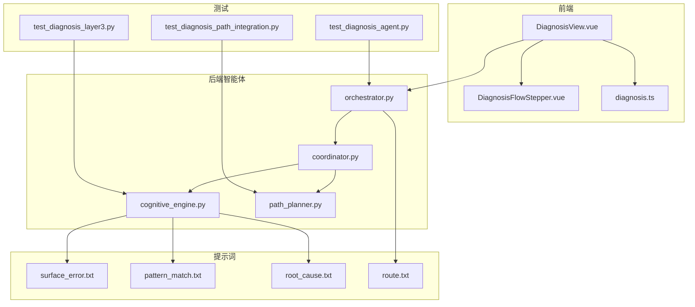
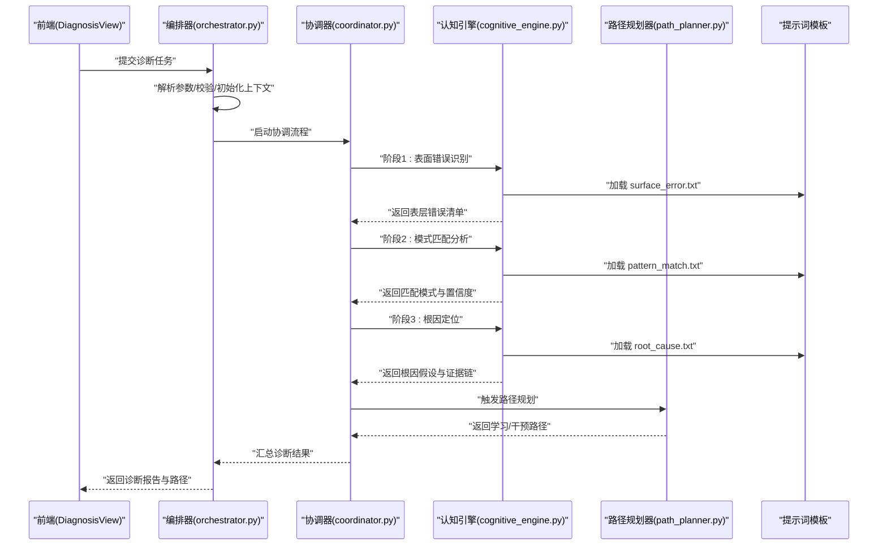
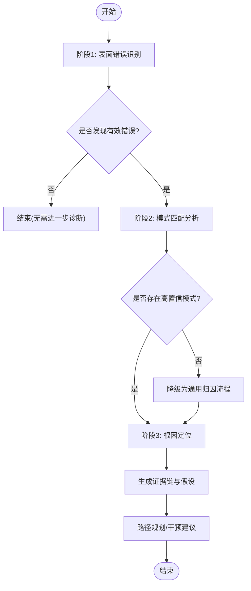
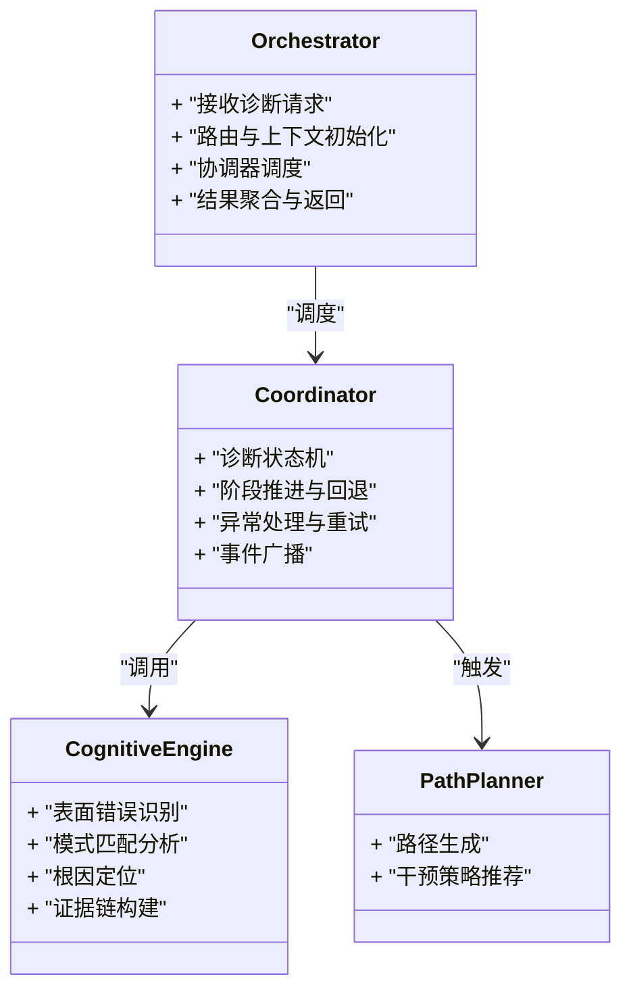
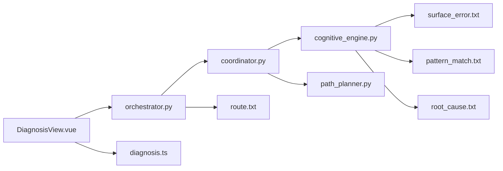

# 诊断架构设计

<cite>
**本文引用的文件**   
- [src/loopse/agent/cognitive_engine.py](file://src/loopse/agent/cognitive_engine.py)
- [src/loopse/agent/orchestrator.py](file://src/loopse/agent/orchestrator.py)
- [src/loopse/agent/coordinator.py](file://src/loopse/agent/coordinator.py)
- [src/loopse/agent/path_planner.py](file://src/loopse/agent/path_planner.py)
- [config/prompts/diagnosis/surface_error.txt](file://config/prompts/diagnosis/surface_error.txt)
- [config/prompts/diagnosis/pattern_match.txt](file://config/prompts/diagnosis/pattern_match.txt)
- [config/prompts/diagnosis/root_cause.txt](file://config/prompts/diagnosis/root_cause.txt)
- [config/prompts/orchestrator/route.txt](file://config/prompts/orchestrator/route.txt)
- [frontend/src/types/diagnosis.ts](file://frontend/src/types/diagnosis.ts)
- [frontend/src/components/DiagnosisFlowStepper.vue](file://frontend/src/components/DiagnosisFlowStepper.vue)
- [frontend/src/views/DiagnosisView.vue](file://frontend/src/views/DiagnosisView.vue)
- [tests/unit/test_diagnosis_agent.py](file://tests/unit/test_diagnosis_agent.py)
- [tests/unit/test_diagnosis_layer3.py](file://tests/unit/test_diagnosis_layer3.py)
- [tests/unit/test_diagnosis_path_integration.py](file://tests/unit/test_diagnosis_path_integration.py)
</cite>

## 目录
1. [简介](#简介)
2. [项目结构](#项目结构)
3. [核心组件](#核心组件)
4. [架构总览](#架构总览)
5. [详细组件分析](#详细组件分析)
6. [依赖关系分析](#依赖关系分析)
7. [性能考虑](#性能考虑)
8. [故障排查指南](#故障排查指南)
9. [结论](#结论)
10. [附录](#附录)

## 简介
本文件面向认知诊断系统的架构设计与实现，聚焦“多层诊断架构”的整体理念与落地方案。系统采用三层诊断模型：表面错误识别、模式匹配分析、根因定位，并通过编排器与协调器驱动状态流转、错误处理与扩展点接入。文档涵盖数据流、状态管理、错误策略、性能优化以及前后端交互契约，帮助读者快速理解并扩展诊断能力。

## 项目结构
围绕诊断能力的代码主要分布在后端智能体层（Agent）、提示词配置（Prompts）、前端类型与视图、以及单元测试中。整体组织遵循“按功能域分层 + 按领域分模块”的混合方式：
- 智能体层：负责诊断流程编排、状态机、路径规划与具体诊断步骤执行
- 提示词层：定义三层诊断的提示模板，便于替换与迭代
- 前端层：提供诊断流程可视化、状态步进展示与结果呈现
- 测试层：覆盖单步诊断、端到端流程与路径集成验证

图表来源
- [src/loopse/agent/orchestrator.py](file://src/loopse/agent/orchestrator.py)
- [src/loopse/agent/coordinator.py](file://src/loopse/agent/coordinator.py)
- [src/loopse/agent/cognitive_engine.py](file://src/loopse/agent/cognitive_engine.py)
- [src/loopse/agent/path_planner.py](file://src/loopse/agent/path_planner.py)
- [config/prompts/diagnosis/surface_error.txt](file://config/prompts/diagnosis/surface_error.txt)
- [config/prompts/diagnosis/pattern_match.txt](file://config/prompts/diagnosis/pattern_match.txt)
- [config/prompts/diagnosis/root_cause.txt](file://config/prompts/diagnosis/root_cause.txt)
- [config/prompts/orchestrator/route.txt](file://config/prompts/orchestrator/route.txt)
- [frontend/src/views/DiagnosisView.vue](file://frontend/src/views/DiagnosisView.vue)
- [frontend/src/components/DiagnosisFlowStepper.vue](file://frontend/src/components/DiagnosisFlowStepper.vue)
- [frontend/src/types/diagnosis.ts](file://frontend/src/types/diagnosis.ts)
- [tests/unit/test_diagnosis_agent.py](file://tests/unit/test_diagnosis_agent.py)
- [tests/unit/test_diagnosis_layer3.py](file://tests/unit/test_diagnosis_layer3.py)
- [tests/unit/test_diagnosis_path_integration.py](file://tests/unit/test_diagnosis_path_integration.py)

章节来源
- [src/loopse/agent/orchestrator.py](file://src/loopse/agent/orchestrator.py)
- [src/loopse/agent/coordinator.py](file://src/loopse/agent/coordinator.py)
- [src/loopse/agent/cognitive_engine.py](file://src/loopse/agent/cognitive_engine.py)
- [src/loopse/agent/path_planner.py](file://src/loopse/agent/path_planner.py)
- [config/prompts/diagnosis/surface_error.txt](file://config/prompts/diagnosis/surface_error.txt)
- [config/prompts/diagnosis/pattern_match.txt](file://config/prompts/diagnosis/pattern_match.txt)
- [config/prompts/diagnosis/root_cause.txt](file://config/prompts/diagnosis/root_cause.txt)
- [config/prompts/orchestrator/route.txt](file://config/prompts/orchestrator/route.txt)
- [frontend/src/views/DiagnosisView.vue](file://frontend/src/views/DiagnosisView.vue)
- [frontend/src/components/DiagnosisFlowStepper.vue](file://frontend/src/components/DiagnosisFlowStepper.vue)
- [frontend/src/types/diagnosis.ts](file://frontend/src/types/diagnosis.ts)
- [tests/unit/test_diagnosis_agent.py](file://tests/unit/test_diagnosis_agent.py)
- [tests/unit/test_diagnosis_layer3.py](file://tests/unit/test_diagnosis_layer3.py)
- [tests/unit/test_diagnosis_path_integration.py](file://tests/unit/test_diagnosis_path_integration.py)

## 核心组件
- 编排器（Orchestrator）：对外暴露诊断入口，解析请求、选择路由、调度协调器，维护全局上下文与生命周期。
- 协调器（Coordinator）：驱动三层诊断的状态机，控制阶段推进、分支跳转与回退，聚合各层输出。
- 认知引擎（Cognitive Engine）：封装三层诊断的具体推理逻辑，调用对应提示词模板，产出结构化诊断结果。
- 路径规划器（Path Planner）：基于诊断结果生成个性化学习路径或干预建议，并与上层编排器协同。
- 提示词模板（Prompts）：分别定义表面错误识别、模式匹配分析与根因定位的输入结构与约束，支持可插拔替换。
- 前端诊断视图与类型：统一描述诊断任务、阶段、证据与结论的数据契约，并提供流程步进可视化。

章节来源
- [src/loopse/agent/orchestrator.py](file://src/loopse/agent/orchestrator.py)
- [src/loopse/agent/coordinator.py](file://src/loopse/agent/coordinator.py)
- [src/loopse/agent/cognitive_engine.py](file://src/loopse/agent/cognitive_engine.py)
- [src/loopse/agent/path_planner.py](file://src/loopse/agent/path_planner.py)
- [config/prompts/diagnosis/surface_error.txt](file://config/prompts/diagnosis/surface_error.txt)
- [config/prompts/diagnosis/pattern_match.txt](file://config/prompts/diagnosis/pattern_match.txt)
- [config/prompts/diagnosis/root_cause.txt](file://config/prompts/diagnosis/root_cause.txt)
- [config/prompts/orchestrator/route.txt](file://config/prompts/orchestrator/route.txt)
- [frontend/src/types/diagnosis.ts](file://frontend/src/types/diagnosis.ts)
- [frontend/src/components/DiagnosisFlowStepper.vue](file://frontend/src/components/DiagnosisFlowStepper.vue)
- [frontend/src/views/DiagnosisView.vue](file://frontend/src/views/DiagnosisView.vue)

## 架构总览
下图展示了从前端发起诊断到三层诊断完成并输出路径建议的整体交互。编排器作为网关，协调器作为状态机控制器，认知引擎承载具体诊断推理，路径规划器在根因确认后生成后续计划。

图表来源
- [src/loopse/agent/orchestrator.py](file://src/loopse/agent/orchestrator.py)
- [src/loopse/agent/coordinator.py](file://src/loopse/agent/coordinator.py)
- [src/loopse/agent/cognitive_engine.py](file://src/loopse/agent/cognitive_engine.py)
- [src/loopse/agent/path_planner.py](file://src/loopse/agent/path_planner.py)
- [config/prompts/diagnosis/surface_error.txt](file://config/prompts/diagnosis/surface_error.txt)
- [config/prompts/diagnosis/pattern_match.txt](file://config/prompts/diagnosis/pattern_match.txt)
- [config/prompts/diagnosis/root_cause.txt](file://config/prompts/diagnosis/root_cause.txt)

## 详细组件分析

### 三层诊断模型与数据流转
- 表面错误识别：抽取用户行为或作答中的显式错误信号，形成初始问题集。
- 模式匹配分析：将表层错误映射到已知错误模式库，评估匹配度与典型性。
- 根因定位：结合上下文与证据链，推断深层原因并提出可验证假设。

图表来源
- [src/loopse/agent/cognitive_engine.py](file://src/loopse/agent/cognitive_engine.py)
- [config/prompts/diagnosis/surface_error.txt](file://config/prompts/diagnosis/surface_error.txt)
- [config/prompts/diagnosis/pattern_match.txt](file://config/prompts/diagnosis/pattern_match.txt)
- [config/prompts/diagnosis/root_cause.txt](file://config/prompts/diagnosis/root_cause.txt)
- [src/loopse/agent/path_planner.py](file://src/loopse/agent/path_planner.py)

章节来源
- [src/loopse/agent/cognitive_engine.py](file://src/loopse/agent/cognitive_engine.py)
- [config/prompts/diagnosis/surface_error.txt](file://config/prompts/diagnosis/surface_error.txt)
- [config/prompts/diagnosis/pattern_match.txt](file://config/prompts/diagnosis/pattern_match.txt)
- [config/prompts/diagnosis/root_cause.txt](file://config/prompts/diagnosis/root_cause.txt)
- [src/loopse/agent/path_planner.py](file://src/loopse/agent/path_planner.py)

### 编排器与协调器：状态管理与通信机制
- 编排器职责：接收外部请求、路由决策、生命周期管理、结果聚合与对外响应。
- 协调器职责：维护诊断状态机，驱动阶段推进、异常恢复、分支跳转与回退。
- 通信机制：通过结构化上下文对象在各组件间传递；关键事件以消息形式广播给观察者（如前端步进更新）。

图表来源
- [src/loopse/agent/orchestrator.py](file://src/loopse/agent/orchestrator.py)
- [src/loopse/agent/coordinator.py](file://src/loopse/agent/coordinator.py)
- [src/loopse/agent/cognitive_engine.py](file://src/loopse/agent/cognitive_engine.py)
- [src/loopse/agent/path_planner.py](file://src/loopse/agent/path_planner.py)

章节来源
- [src/loopse/agent/orchestrator.py](file://src/loopse/agent/orchestrator.py)
- [src/loopse/agent/coordinator.py](file://src/loopse/agent/coordinator.py)

### 提示词模板与可扩展性
- 三层诊断各自拥有独立提示词模板，便于内容迭代与A/B测试。
- 编排器路由提示词用于动态选择诊断策略或专家代理。
- 扩展点：新增诊断维度可通过添加新模板并在协调器中注册新阶段实现。

章节来源
- [config/prompts/diagnosis/surface_error.txt](file://config/prompts/diagnosis/surface_error.txt)
- [config/prompts/diagnosis/pattern_match.txt](file://config/prompts/diagnosis/pattern_match.txt)
- [config/prompts/diagnosis/root_cause.txt](file://config/prompts/diagnosis/root_cause.txt)
- [config/prompts/orchestrator/route.txt](file://config/prompts/orchestrator/route.txt)

### 前端诊断视图与数据契约
- 前端通过统一类型定义描述诊断任务、阶段、证据与结论，确保前后端一致。
- 诊断流程步进组件根据后端状态实时更新界面，提升可观测性与用户体验。

章节来源
- [frontend/src/types/diagnosis.ts](file://frontend/src/types/diagnosis.ts)
- [frontend/src/components/DiagnosisFlowStepper.vue](file://frontend/src/components/DiagnosisFlowStepper.vue)
- [frontend/src/views/DiagnosisView.vue](file://frontend/src/views/DiagnosisView.vue)

### 测试与验收
- 单测覆盖：诊断代理入口、第三层根因定位、与路径规划的集成场景。
- 目标：保障三层诊断稳定性、状态机正确性与端到端一致性。

章节来源
- [tests/unit/test_diagnosis_agent.py](file://tests/unit/test_diagnosis_agent.py)
- [tests/unit/test_diagnosis_layer3.py](file://tests/unit/test_diagnosis_layer3.py)
- [tests/unit/test_diagnosis_path_integration.py](file://tests/unit/test_diagnosis_path_integration.py)

## 依赖关系分析
- 组件耦合：编排器对协调器强依赖；协调器对认知引擎与路径规划器弱依赖（可替换实现）。
- 外部依赖：提示词模板为纯文本配置，解耦于推理逻辑；前端仅依赖类型契约与API。
- 潜在循环：当前无直接循环依赖；若扩展阶段需反向引用，应通过事件总线或回调避免环。

图表来源
- [src/loopse/agent/orchestrator.py](file://src/loopse/agent/orchestrator.py)
- [src/loopse/agent/coordinator.py](file://src/loopse/agent/coordinator.py)
- [src/loopse/agent/cognitive_engine.py](file://src/loopse/agent/cognitive_engine.py)
- [src/loopse/agent/path_planner.py](file://src/loopse/agent/path_planner.py)
- [config/prompts/diagnosis/surface_error.txt](file://config/prompts/diagnosis/surface_error.txt)
- [config/prompts/diagnosis/pattern_match.txt](file://config/prompts/diagnosis/pattern_match.txt)
- [config/prompts/diagnosis/root_cause.txt](file://config/prompts/diagnosis/root_cause.txt)
- [config/prompts/orchestrator/route.txt](file://config/prompts/orchestrator/route.txt)
- [frontend/src/views/DiagnosisView.vue](file://frontend/src/views/DiagnosisView.vue)
- [frontend/src/types/diagnosis.ts](file://frontend/src/types/diagnosis.ts)

章节来源
- [src/loopse/agent/orchestrator.py](file://src/loopse/agent/orchestrator.py)
- [src/loopse/agent/coordinator.py](file://src/loopse/agent/coordinator.py)
- [src/loopse/agent/cognitive_engine.py](file://src/loopse/agent/cognitive_engine.py)
- [src/loopse/agent/path_planner.py](file://src/loopse/agent/path_planner.py)
- [config/prompts/diagnosis/surface_error.txt](file://config/prompts/diagnosis/surface_error.txt)
- [config/prompts/diagnosis/pattern_match.txt](file://config/prompts/diagnosis/pattern_match.txt)
- [config/prompts/diagnosis/root_cause.txt](file://config/prompts/diagnosis/root_cause.txt)
- [config/prompts/orchestrator/route.txt](file://config/prompts/orchestrator/route.txt)
- [frontend/src/views/DiagnosisView.vue](file://frontend/src/views/DiagnosisView.vue)
- [frontend/src/types/diagnosis.ts](file://frontend/src/types/diagnosis.ts)

## 性能考虑
- 并行化：在条件允许时，将多路证据收集与模式检索并行执行，缩短端到端延迟。
- 缓存：对高频错误模式与根因假设进行缓存，减少重复计算。
- 增量更新：前端通过事件流逐步渲染诊断阶段，降低首屏等待时间。
- 资源限制：对大模型调用设置超时与重试上限，避免雪崩效应。
- 批处理：批量诊断任务合并处理，提高吞吐率。

[本节为通用指导，不直接分析具体文件]

## 故障排查指南
- 常见错误
  - 提示词缺失或格式错误：检查对应txt文件是否存在且字段完整。
  - 状态机卡死：确认协调器阶段推进与事件广播是否正常。
  - 前端显示不同步：核对类型契约与后端返回结构是否一致。
- 定位方法
  - 查看编排器日志，确认路由选择与上下文初始化。
  - 追踪协调器状态变更，定位失败阶段。
  - 使用单测复现问题，缩小范围至具体组件。
- 恢复策略
  - 自动重试与降级：对临时失败进行有限次重试，必要时走通用归因流程。
  - 回滚与补偿：在阶段失败时回滚到上一稳定状态，保证一致性。

章节来源
- [src/loopse/agent/orchestrator.py](file://src/loopse/agent/orchestrator.py)
- [src/loopse/agent/coordinator.py](file://src/loopse/agent/coordinator.py)
- [config/prompts/diagnosis/surface_error.txt](file://config/prompts/diagnosis/surface_error.txt)
- [config/prompts/diagnosis/pattern_match.txt](file://config/prompts/diagnosis/pattern_match.txt)
- [config/prompts/diagnosis/root_cause.txt](file://config/prompts/diagnosis/root_cause.txt)
- [frontend/src/types/diagnosis.ts](file://frontend/src/types/diagnosis.ts)

## 结论
本架构以“三层诊断模型 + 编排/协调双控”为核心，实现了从表层错误到根因定位的可解释、可扩展的诊断流水线。通过提示词模板与类型契约解耦业务逻辑与展示层，配合完善的测试与性能优化策略，系统在准确性、可维护性与用户体验之间取得良好平衡。未来可在模式库扩充、多模态证据融合与在线学习方面持续演进。

[本节为总结性内容，不直接分析具体文件]

## 附录
- 术语
  - 表面错误：可直接观察到的错误信号
  - 模式匹配：将错误信号映射到已知错误模式
  - 根因定位：推断深层原因并构建证据链
  - 编排器：对外接口与生命周期管理者
  - 协调器：内部状态机与流程控制器
- 扩展建议
  - 新增诊断维度：在协调器注册新阶段，并配套提示词模板
  - 引入外部知识源：在认知引擎中增加检索与融合步骤
  - 增强可观测性：完善事件总线与指标上报

[本节为补充信息，不直接分析具体文件]