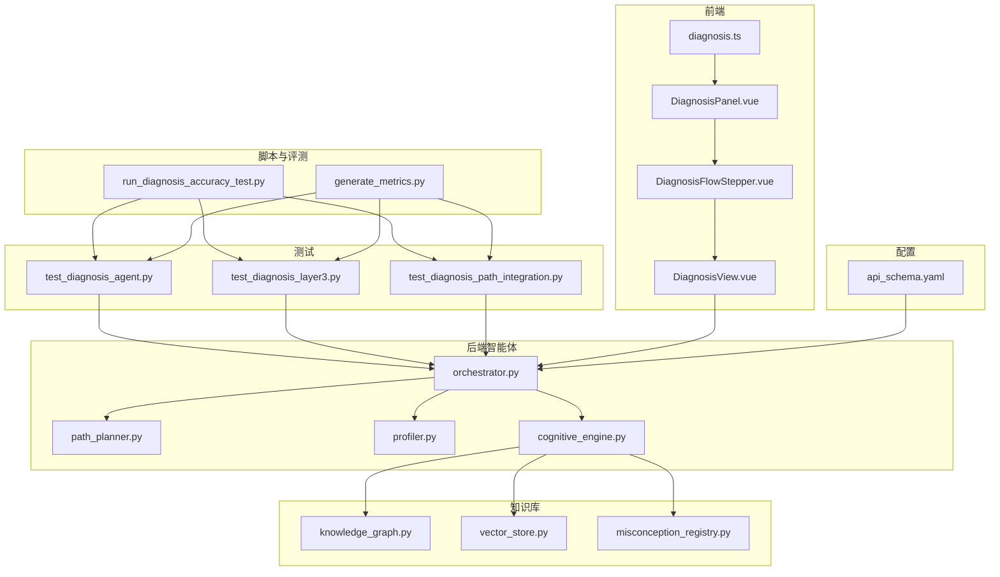
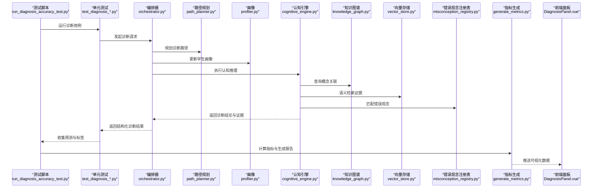
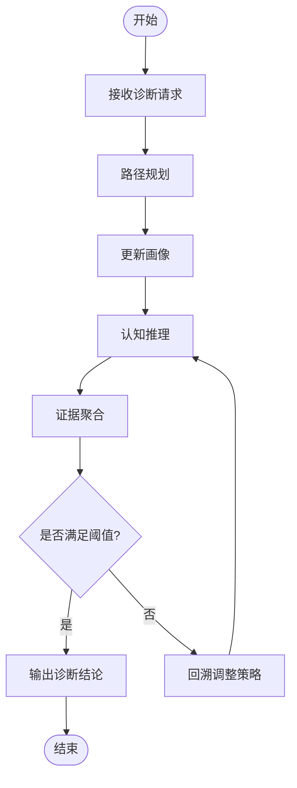
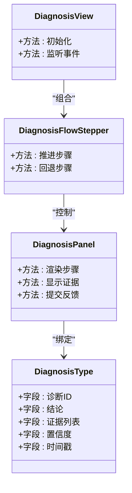
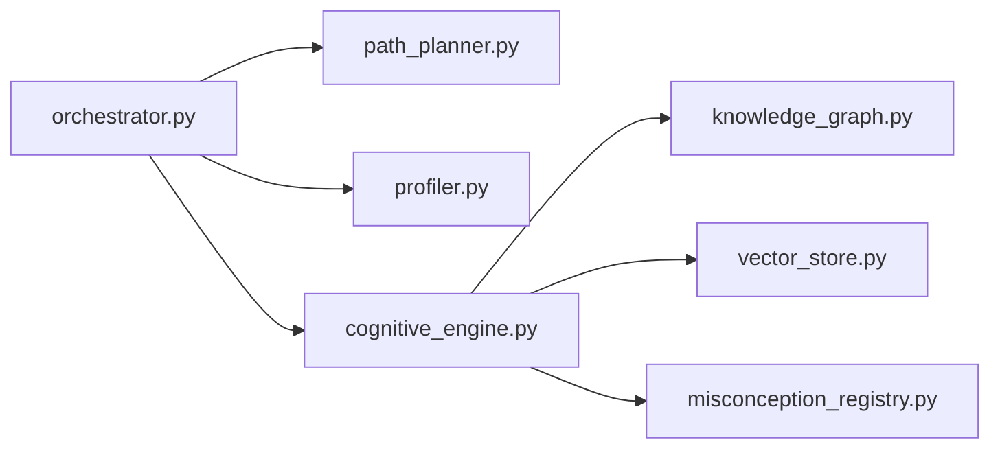

# 诊断评估与优化

<cite>
**本文引用的文件**   
- [run_diagnosis_accuracy_test.py](file://scripts/run_diagnosis_accuracy_test.py)
- [test_diagnosis_agent.py](file://tests/unit/test_diagnosis_agent.py)
- [test_diagnosis_layer3.py](file://tests/unit/test_diagnosis_layer3.py)
- [test_diagnosis_path_integration.py](file://tests/unit/test_diagnosis_path_integration.py)
- [diagnosis.ts](file://frontend/src/types/diagnosis.ts)
- [DiagnosisPanel.vue](file://frontend/src/components/DiagnosisPanel.vue)
- [DiagnosisFlowStepper.vue](file://frontend/src/components/DiagnosisFlowStepper.vue)
- [DiagnosisView.vue](file://frontend/src/views/DiagnosisView.vue)
- [orchestrator.py](file://src/loopse/agent/orchestrator.py)
- [path_planner.py](file://src/loopse/agent/path_planner.py)
- [profiler.py](file://src/loopse/agent/profiler.py)
- [cognitive_engine.py](file://src/loopse/agent/cognitive_engine.py)
- [knowledge_graph.py](file://src/loopse/kb/knowledge_graph.py)
- [vector_store.py](file://src/loopse/kb/vector_store.py)
- [misconception_registry.py](file://src/loopse/kb/misconception_registry.py)
- [api_schema.yaml](file://config/api_schema.yaml)
- [generate_metrics.py](file://generate_metrics.py)
</cite>

## 目录
1. [引言](#引言)
2. [项目结构](#项目结构)
3. [核心组件](#核心组件)
4. [架构总览](#架构总览)
5. [详细组件分析](#详细组件分析)
6. [依赖关系分析](#依赖关系分析)
7. [性能考量](#性能考量)
8. [故障排查指南](#故障排查指南)
9. [结论](#结论)
10. [附录](#附录)

## 引言
本文件面向“诊断系统”的评估与优化，聚焦以下目标：
- 建立诊断准确率的评估指标体系（精确率、召回率、F1分数、混淆矩阵）
- 说明测试数据集构建方法、标注标准与基准测试流程
- 文档化诊断性能的监控指标、异常检测与告警机制
- 开展诊断偏差分析、公平性评估与可解释性验证
- 设计持续学习机制、反馈闭环与自动化重训练流程
- 提供可视化报表与趋势分析方法

## 项目结构
围绕诊断评估与优化的关键代码与资产分布如下：
- 脚本层：基准测试与指标生成脚本
- 单元测试层：诊断相关用例与集成测试
- 前端类型与视图：诊断结果展示与交互
- 后端智能体与知识层：编排、路径规划、画像、认知引擎与知识库
- 配置层：API契约与数据模型约束

图表来源
- [run_diagnosis_accuracy_test.py:1-200](file://scripts/run_diagnosis_accuracy_test.py#L1-L200)
- [generate_metrics.py:1-200](file://generate_metrics.py#L1-L200)
- [test_diagnosis_agent.py:1-200](file://tests/unit/test_diagnosis_agent.py#L1-L200)
- [test_diagnosis_layer3.py:1-200](file://tests/unit/test_diagnosis_layer3.py#L1-L200)
- [test_diagnosis_path_integration.py:1-200](file://tests/unit/test_diagnosis_path_integration.py#L1-L200)
- [diagnosis.ts:1-200](file://frontend/src/types/diagnosis.ts#L1-L200)
- [DiagnosisPanel.vue:1-200](file://frontend/src/components/DiagnosisPanel.vue#L1-L200)
- [DiagnosisFlowStepper.vue:1-200](file://frontend/src/components/DiagnosisFlowStepper.vue#L1-L200)
- [DiagnosisView.vue:1-200](file://frontend/src/views/DiagnosisView.vue#L1-L200)
- [orchestrator.py:1-200](file://src/loopse/agent/orchestrator.py#L1-L200)
- [path_planner.py:1-200](file://src/loopse/agent/path_planner.py#L1-L200)
- [profiler.py:1-200](file://src/loopse/agent/profiler.py#L1-L200)
- [cognitive_engine.py:1-200](file://src/loopse/agent/cognitive_engine.py#L1-L200)
- [knowledge_graph.py:1-200](file://src/loopse/kb/knowledge_graph.py#L1-L200)
- [vector_store.py:1-200](file://src/loopse/kb/vector_store.py#L1-L200)
- [misconception_registry.py:1-200](file://src/loopse/kb/misconception_registry.py#L1-L200)
- [api_schema.yaml:1-200](file://config/api_schema.yaml#L1-L200)

章节来源
- [run_diagnosis_accuracy_test.py:1-200](file://scripts/run_diagnosis_accuracy_test.py#L1-L200)
- [generate_metrics.py:1-200](file://generate_metrics.py#L1-L200)
- [test_diagnosis_agent.py:1-200](file://tests/unit/test_diagnosis_agent.py#L1-L200)
- [test_diagnosis_layer3.py:1-200](file://tests/unit/test_diagnosis_layer3.py#L1-L200)
- [test_diagnosis_path_integration.py:1-200](file://tests/unit/test_diagnosis_path_integration.py#L1-L200)
- [diagnosis.ts:1-200](file://frontend/src/types/diagnosis.ts#L1-L200)
- [DiagnosisPanel.vue:1-200](file://frontend/src/components/DiagnosisPanel.vue#L1-L200)
- [DiagnosisFlowStepper.vue:1-200](file://frontend/src/components/DiagnosisFlowStepper.vue#L1-L200)
- [DiagnosisView.vue:1-200](file://frontend/src/views/DiagnosisView.vue#L1-L200)
- [orchestrator.py:1-200](file://src/loopse/agent/orchestrator.py#L1-L200)
- [path_planner.py:1-200](file://src/loopse/agent/path_planner.py#L1-L200)
- [profiler.py:1-200](file://src/loopse/agent/profiler.py#L1-L200)
- [cognitive_engine.py:1-200](file://src/loopse/agent/cognitive_engine.py#L1-L200)
- [knowledge_graph.py:1-200](file://src/loopse/kb/knowledge_graph.py#L1-L200)
- [vector_store.py:1-200](file://src/loopse/kb/vector_store.py#L1-L200)
- [misconception_registry.py:1-200](file://src/loopse/kb/misconception_registry.py#L1-L200)
- [api_schema.yaml:1-200](file://config/api_schema.yaml#L1-L200)

## 核心组件
- 基准测试入口：负责加载测试集、驱动诊断流程、收集预测与标签、计算指标并输出报告。
- 指标生成器：汇总多轮测试结果，生成聚合指标与可视化素材。
- 诊断智能体编排：协调路径规划、画像更新、认知推理与知识检索，产出结构化诊断结论。
- 前端诊断面板：渲染诊断步骤、证据链与置信度，支持用户反馈与纠错。
- 知识库与向量存储：支撑概念关联、错误观念注册与语义检索，提升诊断可解释性与准确性。

章节来源
- [run_diagnosis_accuracy_test.py:1-200](file://scripts/run_diagnosis_accuracy_test.py#L1-L200)
- [generate_metrics.py:1-200](file://generate_metrics.py#L1-L200)
- [orchestrator.py:1-200](file://src/loopse/agent/orchestrator.py#L1-L200)
- [path_planner.py:1-200](file://src/loopse/agent/path_planner.py#L1-L200)
- [profiler.py:1-200](file://src/loopse/agent/profiler.py#L1-L200)
- [cognitive_engine.py:1-200](file://src/loopse/agent/cognitive_engine.py#L1-L200)
- [knowledge_graph.py:1-200](file://src/loopse/kb/knowledge_graph.py#L1-L200)
- [vector_store.py:1-200](file://src/loopse/kb/vector_store.py#L1-L200)
- [misconception_registry.py:1-200](file://src/loopse/kb/misconception_registry.py#L1-L200)
- [diagnosis.ts:1-200](file://frontend/src/types/diagnosis.ts#L1-L200)
- [DiagnosisPanel.vue:1-200](file://frontend/src/components/DiagnosisPanel.vue#L1-L200)
- [DiagnosisFlowStepper.vue:1-200](file://frontend/src/components/DiagnosisFlowStepper.vue#L1-L200)
- [DiagnosisView.vue:1-200](file://frontend/src/views/DiagnosisView.vue#L1-L200)

## 架构总览
下图展示了从测试驱动到诊断执行、再到指标计算与可视化的端到端流程。

图表来源
- [run_diagnosis_accuracy_test.py:1-200](file://scripts/run_diagnosis_accuracy_test.py#L1-L200)
- [test_diagnosis_agent.py:1-200](file://tests/unit/test_diagnosis_agent.py#L1-L200)
- [test_diagnosis_layer3.py:1-200](file://tests/unit/test_diagnosis_layer3.py#L1-L200)
- [test_diagnosis_path_integration.py:1-200](file://tests/unit/test_diagnosis_path_integration.py#L1-L200)
- [orchestrator.py:1-200](file://src/loopse/agent/orchestrator.py#L1-L200)
- [path_planner.py:1-200](file://src/loopse/agent/path_planner.py#L1-L200)
- [profiler.py:1-200](file://src/loopse/agent/profiler.py#L1-L200)
- [cognitive_engine.py:1-200](file://src/loopse/agent/cognitive_engine.py#L1-L200)
- [knowledge_graph.py:1-200](file://src/loopse/kb/knowledge_graph.py#L1-L200)
- [vector_store.py:1-200](file://src/loopse/kb/vector_store.py#L1-L200)
- [misconception_registry.py:1-200](file://src/loopse/kb/misconception_registry.py#L1-L200)
- [generate_metrics.py:1-200](file://generate_metrics.py#L1-L200)
- [DiagnosisPanel.vue:1-200](file://frontend/src/components/DiagnosisPanel.vue#L1-L200)

## 详细组件分析

### 评估指标体系与计算方法
- 指标定义
  - 精确率：预测为正的样本中真正为正的比例
  - 召回率：真实为正的样本中被正确预测为正的比例
  - F1分数：精确率与召回率的调和平均
  - 混淆矩阵：真/假正负四类统计，用于细粒度误差分析
- 计算流程
  - 收集预测标签与真实标签
  - 按类别或整体计算TP/FP/TN/FN
  - 导出精确率、召回率、F1及混淆矩阵
- 可视化
  - 柱状图对比各类别指标
  - 热力图展示混淆矩阵
  - 趋势折线图跟踪版本迭代效果

章节来源
- [run_diagnosis_accuracy_test.py:1-200](file://scripts/run_diagnosis_accuracy_test.py#L1-L200)
- [generate_metrics.py:1-200](file://generate_metrics.py#L1-L200)

### 测试数据集构建与标注标准
- 数据来源
  - 历史交互日志、模拟场景、题库与错误案例
- 标注规范
  - 统一标签字典与层级结构
  - 明确边界条件与歧义处理规则
  - 双人交叉校验与一致性度量（如Kappa）
- 质量控制
  - 抽样复核与审计追踪
  - 版本化管理与变更日志

章节来源
- [test_diagnosis_agent.py:1-200](file://tests/unit/test_diagnosis_agent.py#L1-L200)
- [test_diagnosis_layer3.py:1-200](file://tests/unit/test_diagnosis_layer3.py#L1-L200)
- [test_diagnosis_path_integration.py:1-200](file://tests/unit/test_diagnosis_path_integration.py#L1-L200)

### 基准测试流程
- 启动方式
  - 通过测试脚本批量执行诊断任务
- 输入输出
  - 输入：测试集、参数配置、环境信息
  - 输出：原始预测、标签对照、指标报告、可视化素材
- 回归策略
  - 固定种子与缓存策略保证可复现
  - 失败重试与断点续跑

章节来源
- [run_diagnosis_accuracy_test.py:1-200](file://scripts/run_diagnosis_accuracy_test.py#L1-L200)
- [generate_metrics.py:1-200](file://generate_metrics.py#L1-L200)

### 诊断编排与执行
- 编排器职责
  - 接收诊断请求，调度路径规划、画像更新与认知推理
  - 汇聚各子模块结果，形成最终诊断结论
- 路径规划
  - 基于当前画像与问题特征选择诊断分支
- 画像更新
  - 记录行为轨迹与能力维度变化
- 认知推理
  - 结合知识图谱与向量检索进行证据聚合
  - 使用错误观念注册表进行误判修正

图表来源
- [orchestrator.py:1-200](file://src/loopse/agent/orchestrator.py#L1-L200)
- [path_planner.py:1-200](file://src/loopse/agent/path_planner.py#L1-L200)
- [profiler.py:1-200](file://src/loopse/agent/profiler.py#L1-L200)
- [cognitive_engine.py:1-200](file://src/loopse/agent/cognitive_engine.py#L1-L200)
- [knowledge_graph.py:1-200](file://src/loopse/kb/knowledge_graph.py#L1-L200)
- [vector_store.py:1-200](file://src/loopse/kb/vector_store.py#L1-L200)
- [misconception_registry.py:1-200](file://src/loopse/kb/misconception_registry.py#L1-L200)

### 前端诊断可视化与反馈
- 展示内容
  - 诊断步骤进度、证据链、置信度与可解释说明
- 交互能力
  - 用户确认/纠正诊断结论，提交反馈
- 数据绑定
  - 类型定义确保前后端数据结构一致

图表来源
- [diagnosis.ts:1-200](file://frontend/src/types/diagnosis.ts#L1-L200)
- [DiagnosisPanel.vue:1-200](file://frontend/src/components/DiagnosisPanel.vue#L1-L200)
- [DiagnosisFlowStepper.vue:1-200](file://frontend/src/components/DiagnosisFlowStepper.vue#L1-L200)
- [DiagnosisView.vue:1-200](file://frontend/src/views/DiagnosisView.vue#L1-L200)

### API契约与数据模型
- 契约要点
  - 诊断请求/响应结构、字段约束与枚举值
  - 错误码与异常消息规范
- 数据模型
  - 与前端类型定义保持一致，避免解析错误

章节来源
- [api_schema.yaml:1-200](file://config/api_schema.yaml#L1-L200)
- [diagnosis.ts:1-200](file://frontend/src/types/diagnosis.ts#L1-L200)

## 依赖关系分析
- 组件耦合
  - 编排器对路径规划、画像与认知引擎存在强依赖
  - 认知引擎对知识图谱、向量存储与错误观念注册表存在弱依赖（可通过降级策略缓解）
- 外部依赖
  - 向量存储与知识图谱可能依赖外部服务，需考虑超时与熔断
- 循环依赖
  - 当前未见明显循环依赖；建议通过接口抽象进一步解耦

图表来源
- [orchestrator.py:1-200](file://src/loopse/agent/orchestrator.py#L1-L200)
- [path_planner.py:1-200](file://src/loopse/agent/path_planner.py#L1-L200)
- [profiler.py:1-200](file://src/loopse/agent/profiler.py#L1-L200)
- [cognitive_engine.py:1-200](file://src/loopse/agent/cognitive_engine.py#L1-L200)
- [knowledge_graph.py:1-200](file://src/loopse/kb/knowledge_graph.py#L1-L200)
- [vector_store.py:1-200](file://src/loopse/kb/vector_store.py#L1-L200)
- [misconception_registry.py:1-200](file://src/loopse/kb/misconception_registry.py#L1-L200)

## 性能考量
- 批处理与缓存
  - 对相似问题复用中间结果，减少重复推理
- 异步与并发
  - 并行调用知识检索与向量查询，降低端到端延迟
- 资源限制
  - 设置最大深度与超时，防止无限回溯
- 可观测性
  - 埋点关键步骤耗时与错误率，便于定位瓶颈

[本节为通用指导，不直接分析具体文件]

## 故障排查指南
- 常见问题
  - 指标缺失：检查测试脚本是否正确收集预测与标签
  - 结果不一致：确认随机种子与环境配置
  - 前端渲染异常：核对API契约与类型定义
- 定位手段
  - 查看单元测试输出与日志
  - 使用指标生成器导出中间产物
  - 在前端面板添加调试开关，逐步缩小范围

章节来源
- [run_diagnosis_accuracy_test.py:1-200](file://scripts/run_diagnosis_accuracy_test.py#L1-L200)
- [generate_metrics.py:1-200](file://generate_metrics.py#L1-L200)
- [api_schema.yaml:1-200](file://config/api_schema.yaml#L1-L200)
- [diagnosis.ts:1-200](file://frontend/src/types/diagnosis.ts#L1-L200)

## 结论
通过统一的评估指标体系、严格的测试数据集构建与基准流程、完善的监控与可视化，以及持续学习与反馈闭环，诊断系统的准确性、可解释性与稳定性得以持续提升。建议在后续迭代中强化公平性评估与偏差治理，完善自动化重训练流水线，以保障系统在多样化场景下的稳健表现。

[本节为总结性内容，不直接分析具体文件]

## 附录
- 术语表
  - 精确率、召回率、F1分数、混淆矩阵、偏差、公平性、可解释性
- 参考实现路径
  - 指标计算与报告生成：参见指标生成脚本
  - 诊断流程编排：参见编排器与认知引擎
  - 前端展示与反馈：参见诊断面板与类型定义

[本节为补充信息，不直接分析具体文件]