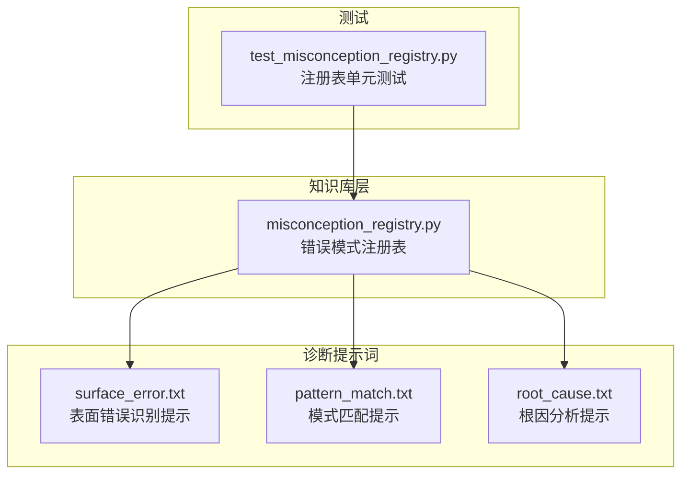
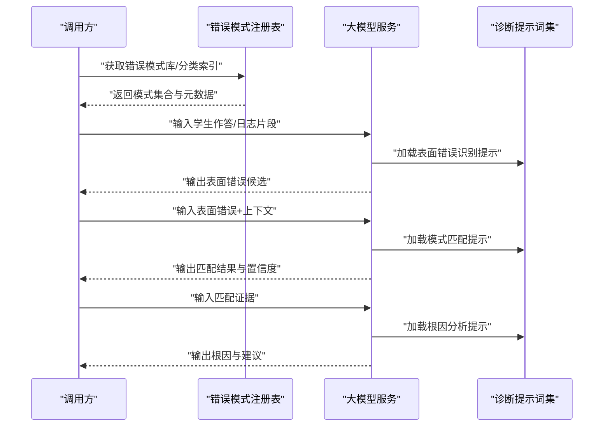
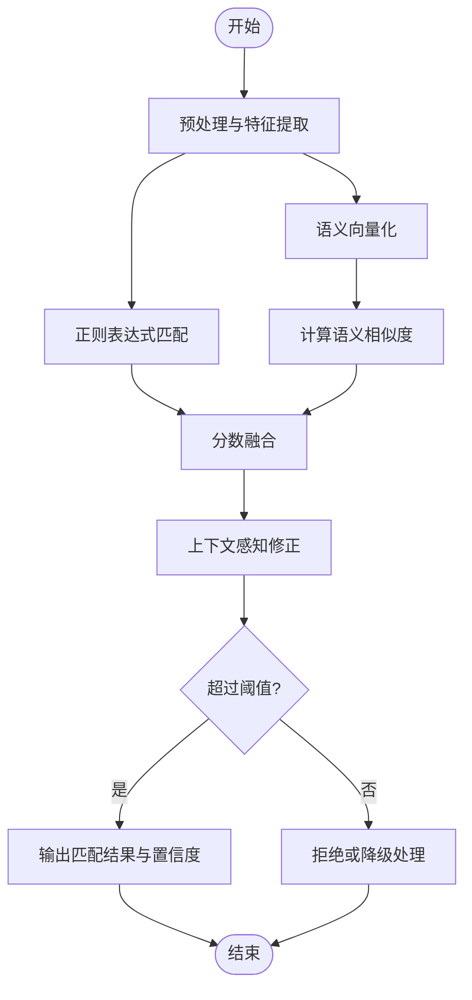
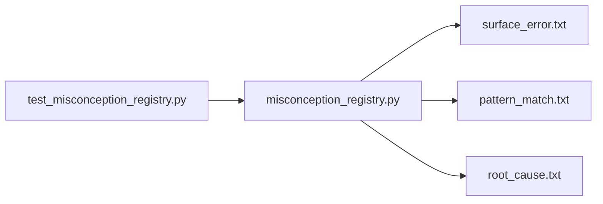

# 错误模式识别

<cite>
**本文引用的文件**   
- [src/loopse/kb/misconception_registry.py](file://src/loopse/kb/misconception_registry.py)
- [config/prompts/diagnosis/surface_error.txt](file://config/prompts/diagnosis/surface_error.txt)
- [config/prompts/diagnosis/pattern_match.txt](file://config/prompts/diagnosis/pattern_match.txt)
- [config/prompts/diagnosis/root_cause.txt](file://config/prompts/diagnosis/root_cause.txt)
- [tests/unit/test_misconception_registry.py](file://tests/unit/test_misconception_registry.py)
</cite>

## 目录
1. [引言](#引言)
2. [项目结构](#项目结构)
3. [核心组件](#核心组件)
4. [架构总览](#架构总览)
5. [详细组件分析](#详细组件分析)
6. [依赖关系分析](#依赖关系分析)
7. [性能考量](#性能考量)
8. [故障排查指南](#故障排查指南)
9. [结论](#结论)
10. [附录](#附录)

## 引言
本技术文档聚焦于“错误模式识别”模块，围绕表面错误识别算法、模式匹配引擎、错误模式库的结构设计与更新机制展开。文档从自然语言处理与语义分析的角度解释错误特征提取方法，说明正则表达式匹配、语义相似度计算与上下文感知匹配的协同工作机制，并给出误报率控制、置信度评估与模式权重调整策略。同时提供新错误模式的添加方法与测试验证流程，帮助开发者快速扩展与维护错误模式库。

## 项目结构
错误模式识别相关能力主要分布在以下位置：
- 知识库层：错误/误解模式注册表（用于存储、检索与管理错误模式）
- 诊断提示词：表面错误识别、模式匹配、根因分析的提示模板
- 单元测试：针对错误模式注册表的用例，覆盖新增、查询、过滤等关键路径

图表来源
- [src/loopse/kb/misconception_registry.py](file://src/loopse/kb/misconception_registry.py)
- [config/prompts/diagnosis/surface_error.txt](file://config/prompts/diagnosis/surface_error.txt)
- [config/prompts/diagnosis/pattern_match.txt](file://config/prompts/diagnosis/pattern_match.txt)
- [config/prompts/diagnosis/root_cause.txt](file://config/prompts/diagnosis/root_cause.txt)
- [tests/unit/test_misconception_registry.py](file://tests/unit/test_misconception_registry.py)

章节来源
- [src/loopse/kb/misconception_registry.py](file://src/loopse/kb/misconception_registry.py)
- [config/prompts/diagnosis/surface_error.txt](file://config/prompts/diagnosis/surface_error.txt)
- [config/prompts/diagnosis/pattern_match.txt](file://config/prompts/diagnosis/pattern_match.txt)
- [config/prompts/diagnosis/root_cause.txt](file://config/prompts/diagnosis/root_cause.txt)
- [tests/unit/test_misconception_registry.py](file://tests/unit/test_misconception_registry.py)

## 核心组件
- 错误模式注册表：负责错误模式的增删改查、分类索引、版本管理与元数据维护，为上层诊断流程提供统一的数据访问接口。
- 诊断提示词集：包含表面错误识别、模式匹配与根因分析三类提示模板，驱动大模型进行语义分析与推理。
- 单元测试：对注册表的关键操作进行断言，保障新增、查询、过滤等行为的正确性与稳定性。

章节来源
- [src/loopse/kb/misconception_registry.py](file://src/loopse/kb/misconception_registry.py)
- [config/prompts/diagnosis/surface_error.txt](file://config/prompts/diagnosis/surface_error.txt)
- [config/prompts/diagnosis/pattern_match.txt](file://config/prompts/diagnosis/pattern_match.txt)
- [config/prompts/diagnosis/root_cause.txt](file://config/prompts/diagnosis/root_cause.txt)
- [tests/unit/test_misconception_registry.py](file://tests/unit/test_misconception_registry.py)

## 架构总览
错误模式识别的整体流程分为三个阶段：表面错误识别、模式匹配与根因分析。各阶段通过提示词驱动的大模型完成语义理解与推理，并由错误模式注册表提供结构化知识支撑。

图表来源
- [config/prompts/diagnosis/surface_error.txt](file://config/prompts/diagnosis/surface_error.txt)
- [config/prompts/diagnosis/pattern_match.txt](file://config/prompts/diagnosis/pattern_match.txt)
- [config/prompts/diagnosis/root_cause.txt](file://config/prompts/diagnosis/root_cause.txt)
- [src/loopse/kb/misconception_registry.py](file://src/loopse/kb/misconception_registry.py)

## 详细组件分析

### 表面错误识别算法
- 目标：从学生作答或交互日志中抽取可观测的“表面错误”，作为后续模式匹配与根因分析的输入。
- NLP技术与语义分析：
  - 文本预处理：清洗、分句、去停用词、规范化表达，提升后续语义匹配的鲁棒性。
  - 语义表征：将自然语言描述映射到向量空间，便于计算相似度与聚类。
  - 错误特征提取：基于关键词、语法结构、常见错误表达与领域术语，构建特征向量。
- 实现要点：
  - 使用提示词引导大模型进行结构化抽取，确保输出稳定且可解析。
  - 结合上下文窗口，保留前后文信息以增强歧义消解能力。
  - 对抽取结果进行后处理与校验，降低噪声与重复项。

章节来源
- [config/prompts/diagnosis/surface_error.txt](file://config/prompts/diagnosis/surface_error.txt)

### 模式匹配引擎
- 目标：将表面错误与错误模式库中的条目进行匹配，输出候选模式及置信度。
- 匹配策略：
  - 正则表达式匹配：对固定格式的错误表达（如错误码、特定语法片段）进行快速定位。
  - 语义相似度计算：基于向量相似度（如余弦相似度）衡量表面错误与模式描述的相近程度。
  - 上下文感知匹配：引入对话历史、任务类型、知识点标签等上下文信息，提高匹配准确性。
- 置信度评估：
  - 多信号融合：正则命中得分、语义相似度得分、上下文一致性得分加权组合。
  - 阈值控制：根据业务需求设置动态阈值，平衡召回与精确率。
  - 置信度校准：利用历史标注数据对置信度分布进行校准，减少极端值影响。

图表来源
- [config/prompts/diagnosis/pattern_match.txt](file://config/prompts/diagnosis/pattern_match.txt)
- [src/loopse/kb/misconception_registry.py](file://src/loopse/kb/misconception_registry.py)

章节来源
- [config/prompts/diagnosis/pattern_match.txt](file://config/prompts/diagnosis/pattern_match.txt)
- [src/loopse/kb/misconception_registry.py](file://src/loopse/kb/misconception_registry.py)

### 错误模式库结构与分类体系
- 结构设计：
  - 模式条目：包含模式标识、名称、描述、示例、适用场景、关联知识点、版本与元数据。
  - 分类体系：按学科、知识点、错误类型（概念性、程序性、策略性）等多维标签组织。
  - 索引结构：支持按标签、关键词、语义向量等多路索引，提升检索效率。
- 更新机制：
  - 版本管理：每次变更记录版本号与变更摘要，支持回滚与审计。
  - 审核流程：新增/修改需经过人工审核与自动化校验，确保质量。
  - 增量同步：支持热更新与灰度发布，避免影响线上服务。

章节来源
- [src/loopse/kb/misconception_registry.py](file://src/loopse/kb/misconception_registry.py)

### 根因分析提示与输出
- 目标：在模式匹配基础上，进一步推断错误的根本原因，并提供修复建议。
- 提示设计：
  - 输入：表面错误、匹配证据、上下文信息。
  - 输出：根因类别、解释、学习建议与资源链接。
- 质量控制：
  - 约束条件：限制输出长度与结构，便于下游解析与展示。
  - 事实核查：结合知识库与权威资料，减少幻觉与误导。

章节来源
- [config/prompts/diagnosis/root_cause.txt](file://config/prompts/diagnosis/root_cause.txt)

### 误报率控制、置信度评估与模式权重调整
- 误报率控制：
  - 多级阈值：根据业务风险设定不同阈值，高风险场景采用更严格阈值。
  - 负样本挖掘：收集误报案例，持续优化特征与阈值。
- 置信度评估：
  - 多源信号：正则命中、语义相似度、上下文一致性与历史命中率综合评分。
  - 动态校准：随数据积累对置信度分布进行再校准。
- 模式权重调整：
  - 反馈闭环：依据用户反馈与效果指标自动调权。
  - A/B测试：对比不同权重策略的效果，选择最优方案。

章节来源
- [src/loopse/kb/misconception_registry.py](file://src/loopse/kb/misconception_registry.py)
- [config/prompts/diagnosis/pattern_match.txt](file://config/prompts/diagnosis/pattern_match.txt)

### 新错误模式的添加方法与测试验证流程
- 添加步骤：
  - 准备模式条目：填写标识、名称、描述、示例、标签、适用场景等字段。
  - 提交审核：进入审核流程，确保内容准确与合规。
  - 入库与索引：审核通过后写入注册表并重建索引。
- 测试验证：
  - 单元测试：覆盖新增、查询、过滤、版本管理等关键路径。
  - 回归测试：使用历史数据集验证准确率与召回率变化。
  - 在线验证：小流量灰度观察误报率与用户反馈。

章节来源
- [tests/unit/test_misconception_registry.py](file://tests/unit/test_misconception_registry.py)
- [src/loopse/kb/misconception_registry.py](file://src/loopse/kb/misconception_registry.py)

## 依赖关系分析
错误模式识别模块的依赖关系如下：
- 错误模式注册表依赖诊断提示词集，用于驱动大模型进行语义分析与推理。
- 单元测试依赖注册表，验证其功能正确性与稳定性。

图表来源
- [tests/unit/test_misconception_registry.py](file://tests/unit/test_misconception_registry.py)
- [src/loopse/kb/misconception_registry.py](file://src/loopse/kb/misconception_registry.py)
- [config/prompts/diagnosis/surface_error.txt](file://config/prompts/diagnosis/surface_error.txt)
- [config/prompts/diagnosis/pattern_match.txt](file://config/prompts/diagnosis/pattern_match.txt)
- [config/prompts/diagnosis/root_cause.txt](file://config/prompts/diagnosis/root_cause.txt)

章节来源
- [tests/unit/test_misconception_registry.py](file://tests/unit/test_misconception_registry.py)
- [src/loopse/kb/misconception_registry.py](file://src/loopse/kb/misconception_registry.py)
- [config/prompts/diagnosis/surface_error.txt](file://config/prompts/diagnosis/surface_error.txt)
- [config/prompts/diagnosis/pattern_match.txt](file://config/prompts/diagnosis/pattern_match.txt)
- [config/prompts/diagnosis/root_cause.txt](file://config/prompts/diagnosis/root_cause.txt)

## 性能考量
- 索引优化：为高频查询字段建立倒排索引与向量索引，缩短检索时间。
- 缓存策略：对热点模式与常见表面错误进行缓存，降低重复计算开销。
- 批处理：批量处理相似请求，提升吞吐能力。
- 异步化：将耗时操作（如向量化、相似度计算）异步执行，提高响应速度。

[本节为通用性能指导，不直接分析具体文件]

## 故障排查指南
- 常见问题：
  - 匹配失败：检查正则表达式是否覆盖目标表达，确认语义向量是否有效。
  - 置信度过低：调整阈值与权重，补充上下文信息。
  - 误报率高：收集负样本，优化特征与阈值策略。
- 调试手段：
  - 日志追踪：记录匹配过程中的中间结果与得分。
  - 单元测试：运行注册表相关用例，定位问题边界。
  - 提示词迭代：根据失败案例优化提示词模板。

章节来源
- [tests/unit/test_misconception_registry.py](file://tests/unit/test_misconception_registry.py)
- [config/prompts/diagnosis/pattern_match.txt](file://config/prompts/diagnosis/pattern_match.txt)

## 结论
错误模式识别模块通过“表面错误识别—模式匹配—根因分析”的三段式流程，结合正则表达式、语义相似度与上下文感知匹配，实现了高鲁棒性的错误诊断能力。错误模式注册表提供了结构化、可演进的知识底座，配合完善的测试与审核流程，保障了系统的稳定性与可扩展性。未来可继续优化置信度校准与权重自适应策略，进一步提升准确率与用户体验。

[本节为总结性内容，不直接分析具体文件]

## 附录
- 术语表：
  - 表面错误：可直接观测到的错误表现，如语法错误、逻辑错误等。
  - 模式匹配：将表面错误与错误模式库条目进行比对的过程。
  - 置信度：匹配结果的可靠程度，通常以数值表示。
- 参考文件：
  - 错误模式注册表实现
  - 诊断提示词模板
  - 单元测试用例

[本节为补充信息，不直接分析具体文件]