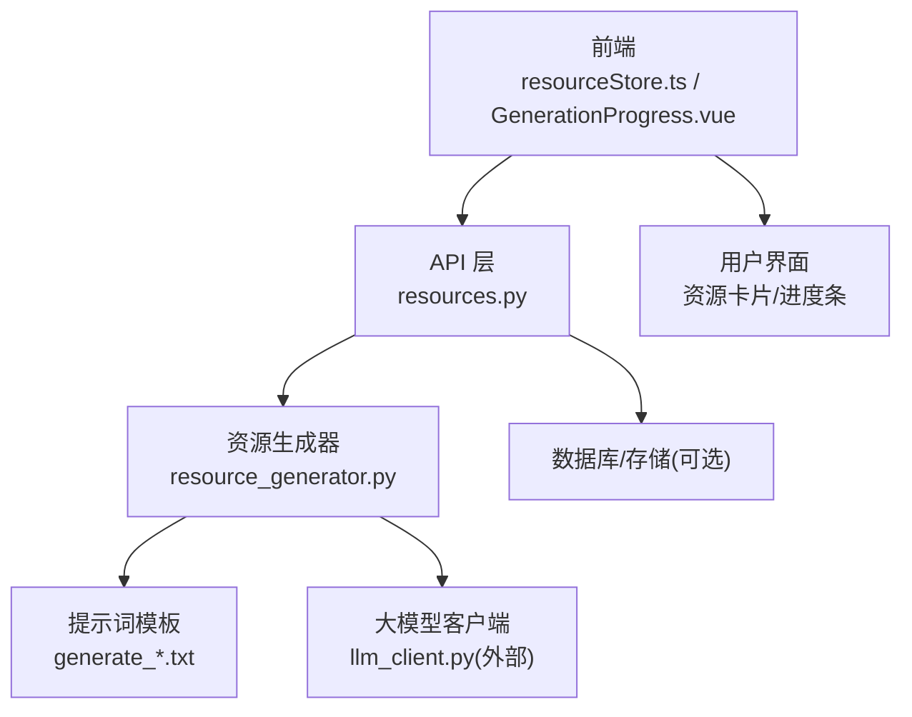
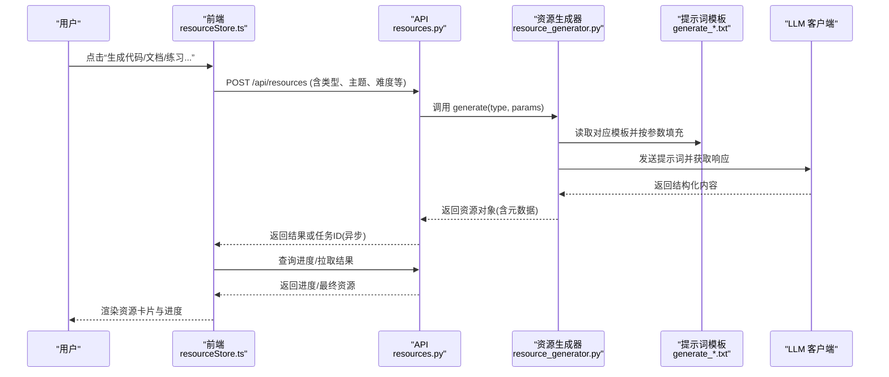
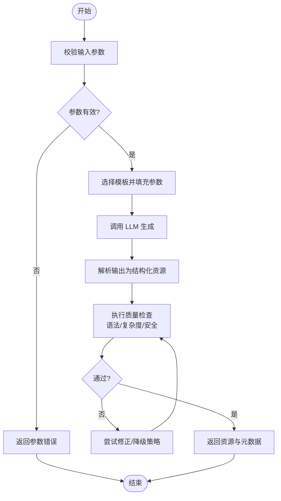
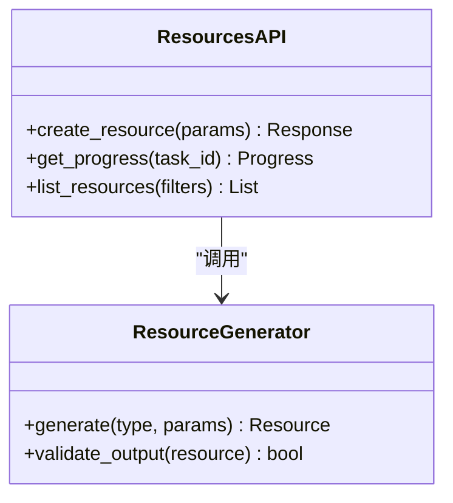
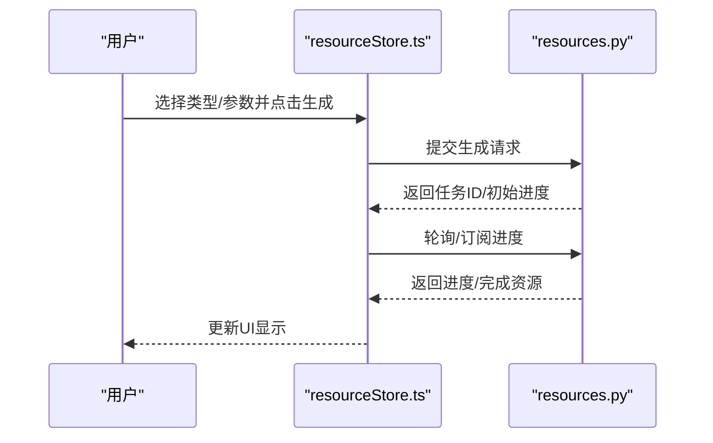
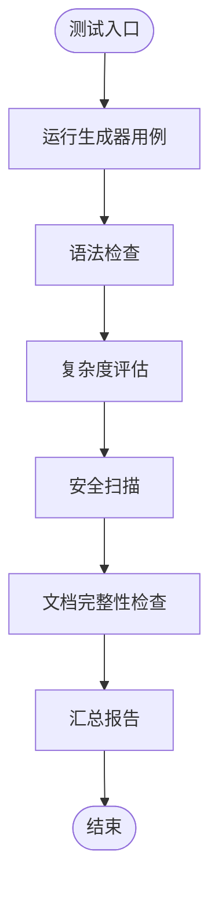
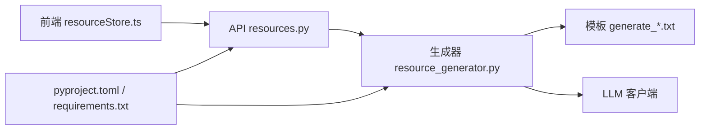

# 代码资源生成

<cite>
**本文引用的文件**   
- [src/loopse/agent/resource_generator.py](file://src/loopse/agent/resource_generator.py)
- [config/prompts/resource_generator/generate_code.txt](file://config/prompts/resource_generator/generate_code.txt)
- [config/prompts/resource_generator/generate_doc.txt](file://config/prompts/resource_generator/generate_doc.txt)
- [config/prompts/resource_generator/generate_exercise.txt](file://config/prompts/resource_generator/generate_exercise.txt)
- [config/prompts/resource_generator/generate_infographic.txt](file://config/prompts/resource_generator/generate_infographic.txt)
- [config/prompts/resource_generator/generate_script.txt](file://config/prompts/resource_generator/generate_script.txt)
- [src/loopse/api/resources.py](file://src/loopse/api/resources.py)
- [frontend/src/stores/resourceStore.ts](file://frontend/src/stores/resourceStore.ts)
- [frontend/src/components/resources/GenerationProgress.vue](file://frontend/src/components/resources/GenerationProgress.vue)
- [tests/unit/test_resource_generator.py](file://tests/unit/test_resource_generator.py)
- [tests/unit/test_resource_quality.py](file://tests/unit/test_resource_quality.py)
- [pyproject.toml](file://pyproject.toml)
- [requirements.txt](file://requirements.txt)
</cite>

## 目录
1. [简介](#简介)
2. [项目结构](#项目结构)
3. [核心组件](#核心组件)
4. [架构总览](#架构总览)
5. [详细组件分析](#详细组件分析)
6. [依赖分析](#依赖分析)
7. [性能考虑](#性能考虑)
8. [故障排查指南](#故障排查指南)
9. [结论](#结论)
10. [附录](#附录)

## 简介
本文件聚焦“代码资源生成”的端到端机制，覆盖从前端触发、后端编排、提示词模板驱动、到质量与安全校验的全链路。文档面向不同技术背景的读者，提供分层说明与可视化图示，帮助快速理解并扩展系统能力。

## 项目结构
围绕“代码资源生成”，关键路径包括：
- 前端资源面板与状态管理：发起生成请求、展示进度与结果
- 后端 API：接收请求、路由至资源生成器
- 资源生成器：组合提示词模板、调用 LLM、产出结构化资源
- 测试与质量评估：对生成结果进行语法、质量与安全验证
- 配置与依赖：提示词模板、Python 依赖与构建配置

图表来源
- [src/loopse/api/resources.py](file://src/loopse/api/resources.py)
- [src/loopse/agent/resource_generator.py](file://src/loopse/agent/resource_generator.py)
- [config/prompts/resource_generator/generate_code.txt](file://config/prompts/resource_generator/generate_code.txt)
- [config/prompts/resource_generator/generate_doc.txt](file://config/prompts/resource_generator/generate_doc.txt)
- [config/prompts/resource_generator/generate_exercise.txt](file://config/prompts/resource_generator/generate_exercise.txt)
- [config/prompts/resource_generator/generate_infographic.txt](file://config/prompts/resource_generator/generate_infographic.txt)
- [config/prompts/resource_generator/generate_script.txt](file://config/prompts/resource_generator/generate_script.txt)
- [frontend/src/stores/resourceStore.ts](file://frontend/src/stores/resourceStore.ts)
- [frontend/src/components/resources/GenerationProgress.vue](file://frontend/src/components/resources/GenerationProgress.vue)

章节来源
- [src/loopse/api/resources.py](file://src/loopse/api/resources.py)
- [src/loopse/agent/resource_generator.py](file://src/loopse/agent/resource_generator.py)
- [config/prompts/resource_generator/generate_code.txt](file://config/prompts/resource_generator/generate_code.txt)
- [config/prompts/resource_generator/generate_doc.txt](file://config/prompts/resource_generator/generate_doc.txt)
- [config/prompts/resource_generator/generate_exercise.txt](file://config/prompts/resource_generator/generate_exercise.txt)
- [config/prompts/resource_generator/generate_infographic.txt](file://config/prompts/resource_generator/generate_infographic.txt)
- [config/prompts/resource_generator/generate_script.txt](file://config/prompts/resource_generator/generate_script.txt)
- [frontend/src/stores/resourceStore.ts](file://frontend/src/stores/resourceStore.ts)
- [frontend/src/components/resources/GenerationProgress.vue](file://frontend/src/components/resources/GenerationProgress.vue)

## 核心组件
- 资源生成器（Resource Generator）
  - 职责：根据输入参数与类型选择对应提示词模板，组织上下文，调用 LLM 生成资源；支持多类型（代码、文档、练习、信息图、脚本）。
  - 关键点：模板加载、参数注入、输出解析、错误回退、可插拔质量检查钩子。
- API 层（Resources API）
  - 职责：暴露 REST 接口，负责鉴权、入参校验、异步任务调度、SSE/轮询进度推送。
- 前端资源面板
  - 职责：发起生成、展示进度、渲染结果卡片、重试与导出。
- 测试与质量评估
  - 职责：单元测试覆盖生成流程；质量评估包含语法检查、复杂度控制、安全扫描等。

章节来源
- [src/loopse/agent/resource_generator.py](file://src/loopse/agent/resource_generator.py)
- [src/loopse/api/resources.py](file://src/loopse/api/resources.py)
- [frontend/src/stores/resourceStore.ts](file://frontend/src/stores/resourceStore.ts)
- [frontend/src/components/resources/GenerationProgress.vue](file://frontend/src/components/resources/GenerationProgress.vue)
- [tests/unit/test_resource_generator.py](file://tests/unit/test_resource_generator.py)
- [tests/unit/test_resource_quality.py](file://tests/unit/test_resource_quality.py)

## 架构总览
下图展示了从前端到后端的完整调用链路与数据流，以及提示词模板在生成过程中的作用。

图表来源
- [src/loopse/api/resources.py](file://src/loopse/api/resources.py)
- [src/loopse/agent/resource_generator.py](file://src/loopse/agent/resource_generator.py)
- [config/prompts/resource_generator/generate_code.txt](file://config/prompts/resource_generator/generate_code.txt)
- [config/prompts/resource_generator/generate_doc.txt](file://config/prompts/resource_generator/generate_doc.txt)
- [config/prompts/resource_generator/generate_exercise.txt](file://config/prompts/resource_generator/generate_exercise.txt)
- [config/prompts/resource_generator/generate_infographic.txt](file://config/prompts/resource_generator/generate_infographic.txt)
- [config/prompts/resource_generator/generate_script.txt](file://config/prompts/resource_generator/generate_script.txt)
- [frontend/src/stores/resourceStore.ts](file://frontend/src/stores/resourceStore.ts)

## 详细组件分析

### 资源生成器（Resource Generator）
- 设计要点
  - 模板驱动：按资源类型映射到 config/prompts/resource_generator/*.txt，统一由生成器加载与填充。
  - 参数化：支持语言、框架、难度、示例模式、注释风格、复杂度阈值等。
  - 可扩展：新增资源类型仅需添加模板与映射逻辑。
- 处理流程
  - 入参校验 → 选择模板 → 构造提示词 → 调用 LLM → 解析输出 → 质量检查 → 返回结果
- 质量与安全
  - 语法检查：针对目标语言执行静态检查（如 linter/parser），失败则回退或提示修正。
  - 复杂度控制：限制圈复杂度、嵌套层级、函数长度等，必要时自动拆分或简化。
  - 安全验证：过滤危险 API、注入风险、敏感信息泄露；对脚本类资源增加沙箱策略建议。
- 注释与文档字符串
  - 自动生成函数/模块级注释与文档字符串，遵循所选语言的约定风格。
- 调试信息
  - 记录提示词版本、参数快照、耗时、质量评分与错误堆栈，便于回溯。

图表来源
- [src/loopse/agent/resource_generator.py](file://src/loopse/agent/resource_generator.py)
- [config/prompts/resource_generator/generate_code.txt](file://config/prompts/resource_generator/generate_code.txt)
- [config/prompts/resource_generator/generate_doc.txt](file://config/prompts/resource_generator/generate_doc.txt)
- [config/prompts/resource_generator/generate_exercise.txt](file://config/prompts/resource_generator/generate_exercise.txt)
- [config/prompts/resource_generator/generate_infographic.txt](file://config/prompts/resource_generator/generate_infographic.txt)
- [config/prompts/resource_generator/generate_script.txt](file://config/prompts/resource_generator/generate_script.txt)

章节来源
- [src/loopse/agent/resource_generator.py](file://src/loopse/agent/resource_generator.py)
- [config/prompts/resource_generator/generate_code.txt](file://config/prompts/resource_generator/generate_code.txt)
- [config/prompts/resource_generator/generate_doc.txt](file://config/prompts/resource_generator/generate_doc.txt)
- [config/prompts/resource_generator/generate_exercise.txt](file://config/prompts/resource_generator/generate_exercise.txt)
- [config/prompts/resource_generator/generate_infographic.txt](file://config/prompts/resource_generator/generate_infographic.txt)
- [config/prompts/resource_generator/generate_script.txt](file://config/prompts/resource_generator/generate_script.txt)

### API 层（Resources API）
- 职责
  - 定义资源生成相关 REST 接口，处理鉴权、入参校验、异步任务与进度查询。
  - 将前端请求转发给资源生成器，封装统一响应格式。
- 集成点
  - 与资源生成器解耦，便于替换实现或引入缓存/队列。
  - 可与 SSE/轮询结合，提供实时进度反馈。

图表来源
- [src/loopse/api/resources.py](file://src/loopse/api/resources.py)
- [src/loopse/agent/resource_generator.py](file://src/loopse/agent/resource_generator.py)

章节来源
- [src/loopse/api/resources.py](file://src/loopse/api/resources.py)

### 前端资源面板
- 功能
  - 发起生成请求、展示进度条、渲染资源卡片、支持重试与导出。
  - 使用 store 集中管理资源状态与生命周期。
- 交互
  - 与 API 层通过 HTTP/SSE 通信，实时更新进度与结果。

图表来源
- [frontend/src/stores/resourceStore.ts](file://frontend/src/stores/resourceStore.ts)
- [frontend/src/components/resources/GenerationProgress.vue](file://frontend/src/components/resources/GenerationProgress.vue)
- [src/loopse/api/resources.py](file://src/loopse/api/resources.py)

章节来源
- [frontend/src/stores/resourceStore.ts](file://frontend/src/stores/resourceStore.ts)
- [frontend/src/components/resources/GenerationProgress.vue](file://frontend/src/components/resources/GenerationProgress.vue)

### 测试与质量评估
- 单元测试
  - 覆盖生成器主流程、异常分支、模板加载与参数注入。
- 质量评估
  - 语法检查：基于语言工具链进行静态分析。
  - 复杂度控制：圈复杂度、嵌套深度、重复片段检测。
  - 安全验证：危险 API 白名单/黑名单、注入风险扫描。
  - 文档完整性：是否包含必要注释与文档字符串。

图表来源
- [tests/unit/test_resource_generator.py](file://tests/unit/test_resource_generator.py)
- [tests/unit/test_resource_quality.py](file://tests/unit/test_resource_quality.py)

章节来源
- [tests/unit/test_resource_generator.py](file://tests/unit/test_resource_generator.py)
- [tests/unit/test_resource_quality.py](file://tests/unit/test_resource_quality.py)

### 概念性概览
- 模板格式与片段库
  - 模板采用文本占位符与结构化字段描述，便于参数化注入。
  - 片段库可按语言/框架/场景分类，供模板引用与组合。
- 示例模式
  - 常见模式包括：最小可运行示例、教学式分步示例、对比示例（正确/错误）、边界条件示例。
- 自定义模板开发方法
  - 新增模板文件于 config/prompts/resource_generator/ 下，并在生成器中注册类型映射。
  - 定义参数 schema，确保前端表单与后端校验一致。
- 代码风格配置选项
  - 支持缩进、命名规范、导入顺序、注释风格等，可通过配置项切换。
- 依赖管理与版本兼容性
  - 使用 pyproject.toml 与 requirements.txt 声明依赖，锁定版本范围，避免破坏性升级。
  - 对 LLM 客户端与第三方工具进行版本约束与兼容测试。

[本节为概念性说明，不直接分析具体文件]

## 依赖分析
- 内部依赖
  - API 层依赖资源生成器；生成器依赖提示词模板与 LLM 客户端。
  - 前端依赖 API 与状态管理。
- 外部依赖
  - Python 包依赖与构建配置由 pyproject.toml 与 requirements.txt 管理。
- 潜在耦合
  - 生成器与模板强耦合，但通过映射表降低硬编码；建议抽象模板工厂以增强可测试性。
  - API 与生成器之间通过接口契约解耦，便于替换实现。

图表来源
- [src/loopse/api/resources.py](file://src/loopse/api/resources.py)
- [src/loopse/agent/resource_generator.py](file://src/loopse/agent/resource_generator.py)
- [config/prompts/resource_generator/generate_code.txt](file://config/prompts/resource_generator/generate_code.txt)
- [config/prompts/resource_generator/generate_doc.txt](file://config/prompts/resource_generator/generate_doc.txt)
- [config/prompts/resource_generator/generate_exercise.txt](file://config/prompts/resource_generator/generate_exercise.txt)
- [config/prompts/resource_generator/generate_infographic.txt](file://config/prompts/resource_generator/generate_infographic.txt)
- [config/prompts/resource_generator/generate_script.txt](file://config/prompts/resource_generator/generate_script.txt)
- [frontend/src/stores/resourceStore.ts](file://frontend/src/stores/resourceStore.ts)
- [pyproject.toml](file://pyproject.toml)
- [requirements.txt](file://requirements.txt)

章节来源
- [pyproject.toml](file://pyproject.toml)
- [requirements.txt](file://requirements.txt)
- [src/loopse/api/resources.py](file://src/loopse/api/resources.py)
- [src/loopse/agent/resource_generator.py](file://src/loopse/agent/resource_generator.py)

## 性能考虑
- 并发与异步
  - 生成任务可异步执行，配合任务队列与进度上报，提升吞吐与用户体验。
- 缓存与复用
  - 对相同参数的生成结果进行缓存，减少重复计算与 LLM 调用成本。
- 模板优化
  - 精简提示词长度，提高解析稳定性与响应速度。
- 质量检查批量化
  - 批量执行语法/复杂度/安全检查，合并错误报告，降低 I/O 开销。

[本节提供通用指导，不直接分析具体文件]

## 故障排查指南
- 常见问题
  - 模板缺失或参数未注入：检查模板路径与映射关系。
  - LLM 调用失败：确认网络、密钥与限流策略；查看错误码与重试次数。
  - 语法检查失败：定位具体文件与行号，依据错误信息进行修正。
  - 复杂度超标：调整模板参数或启用自动简化策略。
  - 安全扫描告警：移除危险 API 或增加白名单审批流程。
- 调试信息
  - 查看生成日志中的提示词版本、参数快照、耗时与质量评分。
  - 使用任务 ID 追踪前后端状态一致性。

章节来源
- [tests/unit/test_resource_generator.py](file://tests/unit/test_resource_generator.py)
- [tests/unit/test_resource_quality.py](file://tests/unit/test_resource_quality.py)

## 结论
本系统以模板驱动为核心，结合 API 层与前端面板，形成完整的代码资源生成闭环。通过质量与安全校验、复杂度控制与调试信息输出，保障生成内容的可用性与安全性。未来可在模板工厂、缓存策略与异步任务编排方面进一步优化，以提升性能与可维护性。

## 附录
- 模板清单
  - 代码生成：generate_code.txt
  - 文档生成：generate_doc.txt
  - 练习生成：generate_exercise.txt
  - 信息图生成：generate_infographic.txt
  - 脚本生成：generate_script.txt
- 前端组件
  - 资源进度：GenerationProgress.vue
  - 资源状态：resourceStore.ts
- 测试用例
  - 生成器单测：test_resource_generator.py
  - 质量评估单测：test_resource_quality.py

章节来源
- [config/prompts/resource_generator/generate_code.txt](file://config/prompts/resource_generator/generate_code.txt)
- [config/prompts/resource_generator/generate_doc.txt](file://config/prompts/resource_generator/generate_doc.txt)
- [config/prompts/resource_generator/generate_exercise.txt](file://config/prompts/resource_generator/generate_exercise.txt)
- [config/prompts/resource_generator/generate_infographic.txt](file://config/prompts/resource_generator/generate_infographic.txt)
- [config/prompts/resource_generator/generate_script.txt](file://config/prompts/resource_generator/generate_script.txt)
- [frontend/src/components/resources/GenerationProgress.vue](file://frontend/src/components/resources/GenerationProgress.vue)
- [frontend/src/stores/resourceStore.ts](file://frontend/src/stores/resourceStore.ts)
- [tests/unit/test_resource_generator.py](file://tests/unit/test_resource_generator.py)
- [tests/unit/test_resource_quality.py](file://tests/unit/test_resource_quality.py)