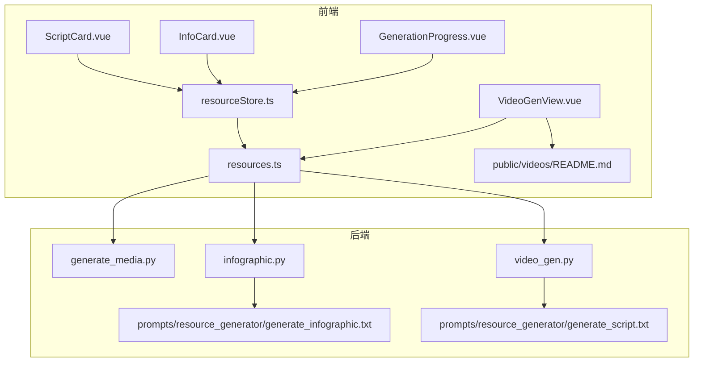
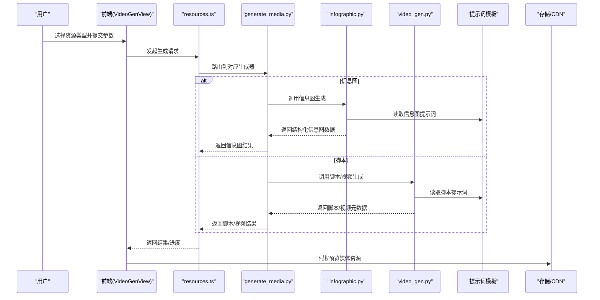
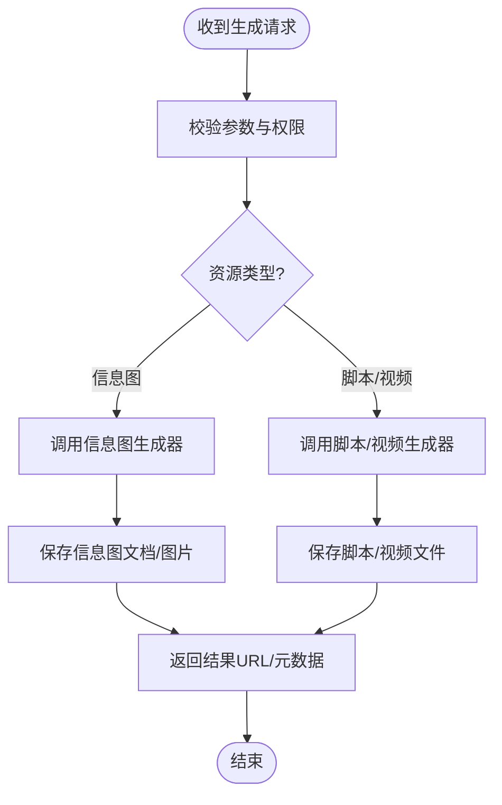
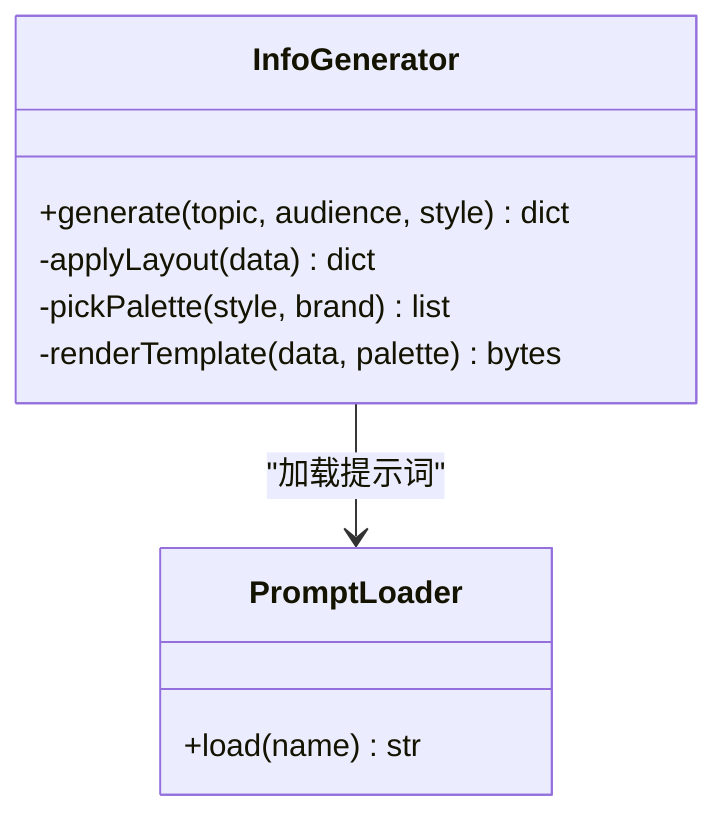
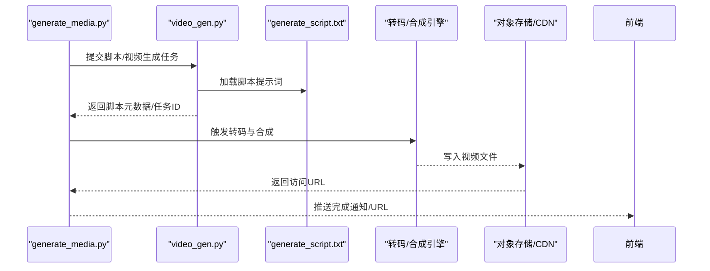
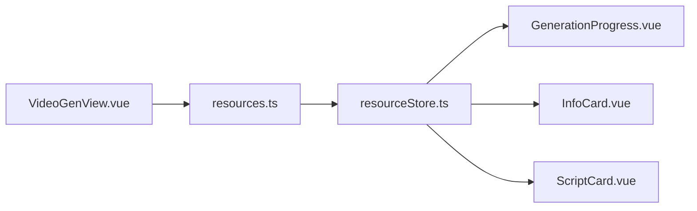
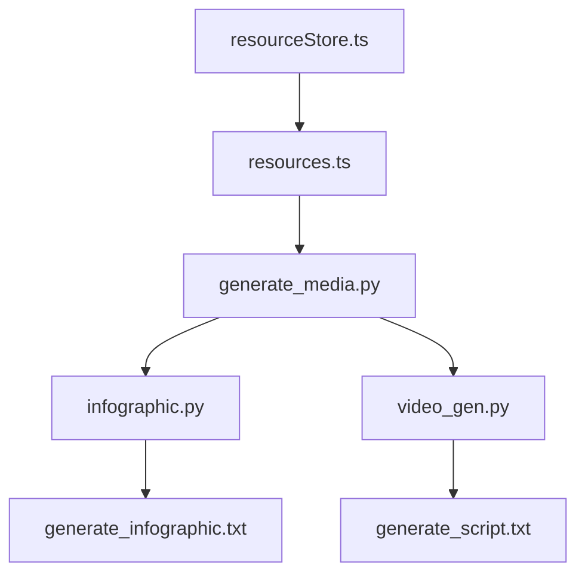

# 多媒体资源生成

<cite>
**本文引用的文件**   
- [src/loopse/api/generate_media.py](file://src/loopse/api/generate_media.py)
- [src/loopse/api/infographic.py](file://src/loopse/api/infographic.py)
- [src/loopse/api/video_gen.py](file://src/loopse/api/video_gen.py)
- [config/prompts/resource_generator/generate_infographic.txt](file://config/prompts/resource_generator/generate_infographic.txt)
- [config/prompts/resource_generator/generate_script.txt](file://config/prompts/resource_generator/generate_script.txt)
- [frontend/src/views/VideoGenView.vue](file://frontend/src/views/VideoGenView.vue)
- [frontend/src/components/resources/GenerationProgress.vue](file://frontend/src/components/resources/GenerationProgress.vue)
- [frontend/src/components/resources/InfoCard.vue](file://frontend/src/components/resources/InfoCard.vue)
- [frontend/src/components/resources/ScriptCard.vue](file://frontend/src/components/resources/ScriptCard.vue)
- [frontend/src/api/resources.ts](file://frontend/src/api/resources.ts)
- [frontend/src/stores/resourceStore.ts](file://frontend/src/stores/resourceStore.ts)
- [frontend/public/videos/README.md](file://frontend/public/videos/README.md)
</cite>

## 目录
1. [简介](#简介)
2. [项目结构](#项目结构)
3. [核心组件](#核心组件)
4. [架构总览](#架构总览)
5. [详细组件分析](#详细组件分析)
6. [依赖关系分析](#依赖关系分析)
7. [性能与优化](#性能与优化)
8. [故障排查指南](#故障排查指南)
9. [结论](#结论)
10. [附录](#附录)

## 简介
本文件面向“多媒体资源生成”能力，覆盖信息图、脚本与视频内容的自动生成流程。文档从系统架构、数据流、处理逻辑、错误处理、性能特性等维度进行系统化说明，并给出可视化元素设计、布局算法与色彩搭配规则建议；解释脚本结构组织、对话生成与场景描述方法；包含媒体格式支持、压缩优化与跨平台兼容性策略；提供模板定制、品牌标识集成与响应式设计实践；并展示如何集成第三方媒体服务与内容分发网络（CDN）。

## 项目结构
围绕多媒体资源生成的关键路径包括：
- 后端 API：信息图生成、脚本生成、视频生成以及统一的媒体生成入口
- 提示词模板：信息图与脚本的生成提示词
- 前端视图与组件：视频生成页面、进度展示、卡片渲染
- 前端 API 与状态管理：资源请求封装与全局状态
- 静态资源：视频占位与说明

图表来源
- [src/loopse/api/generate_media.py](file://src/loopse/api/generate_media.py)
- [src/loopse/api/infographic.py](file://src/loopse/api/infographic.py)
- [src/loopse/api/video_gen.py](file://src/loopse/api/video_gen.py)
- [config/prompts/resource_generator/generate_infographic.txt](file://config/prompts/resource_generator/generate_infographic.txt)
- [config/prompts/resource_generator/generate_script.txt](file://config/prompts/resource_generator/generate_script.txt)
- [frontend/src/views/VideoGenView.vue](file://frontend/src/views/VideoGenView.vue)
- [frontend/src/components/resources/GenerationProgress.vue](file://frontend/src/components/resources/GenerationProgress.vue)
- [frontend/src/components/resources/InfoCard.vue](file://frontend/src/components/resources/InfoCard.vue)
- [frontend/src/components/resources/ScriptCard.vue](file://frontend/src/components/resources/ScriptCard.vue)
- [frontend/src/api/resources.ts](file://frontend/src/api/resources.ts)
- [frontend/src/stores/resourceStore.ts](file://frontend/src/stores/resourceStore.ts)
- [frontend/public/videos/README.md](file://frontend/public/videos/README.md)

章节来源
- [src/loopse/api/generate_media.py](file://src/loopse/api/generate_media.py)
- [src/loopse/api/infographic.py](file://src/loopse/api/infographic.py)
- [src/loopse/api/video_gen.py](file://src/loopse/api/video_gen.py)
- [config/prompts/resource_generator/generate_infographic.txt](file://config/prompts/resource_generator/generate_infographic.txt)
- [config/prompts/resource_generator/generate_script.txt](file://config/prompts/resource_generator/generate_script.txt)
- [frontend/src/views/VideoGenView.vue](file://frontend/src/views/VideoGenView.vue)
- [frontend/src/components/resources/GenerationProgress.vue](file://frontend/src/components/resources/GenerationProgress.vue)
- [frontend/src/components/resources/InfoCard.vue](file://frontend/src/components/resources/InfoCard.vue)
- [frontend/src/components/resources/ScriptCard.vue](file://frontend/src/components/resources/ScriptCard.vue)
- [frontend/src/api/resources.ts](file://frontend/src/api/resources.ts)
- [frontend/src/stores/resourceStore.ts](file://frontend/src/stores/resourceStore.ts)
- [frontend/public/videos/README.md](file://frontend/public/videos/README.md)

## 核心组件
- 统一媒体生成入口：对外暴露统一的媒体生成接口，协调不同资源类型（信息图、脚本、视频）的生成任务
- 信息图生成器：基于提示词模板生成结构化信息图数据，供前端渲染为卡片或可视化组件
- 脚本生成器：根据主题与受众生成结构化脚本（含场景、角色、对话），用于后续配音或视频合成
- 视频生成器：将脚本与素材编排为可播放的视频输出，支持多格式与转码
- 前端资源视图与组件：提供视频生成入口、进度反馈与信息图/脚本卡片展示
- 前端 API 与状态管理：封装资源请求、错误重试与进度同步，驱动 UI 更新

章节来源
- [src/loopse/api/generate_media.py](file://src/loopse/api/generate_media.py)
- [src/loopse/api/infographic.py](file://src/loopse/api/infographic.py)
- [src/loopse/api/video_gen.py](file://src/loopse/api/video_gen.py)
- [frontend/src/api/resources.ts](file://frontend/src/api/resources.ts)
- [frontend/src/stores/resourceStore.ts](file://frontend/src/stores/resourceStore.ts)
- [frontend/src/components/resources/GenerationProgress.vue](file://frontend/src/components/resources/GenerationProgress.vue)
- [frontend/src/components/resources/InfoCard.vue](file://frontend/src/components/resources/InfoCard.vue)
- [frontend/src/components/resources/ScriptCard.vue](file://frontend/src/components/resources/ScriptCard.vue)

## 架构总览
下图展示了从用户触发到媒体产出的端到端流程，涵盖前后端交互、提示词模板与资源落盘/返回。

图表来源
- [src/loopse/api/generate_media.py](file://src/loopse/api/generate_media.py)
- [src/loopse/api/infographic.py](file://src/loopse/api/infographic.py)
- [src/loopse/api/video_gen.py](file://src/loopse/api/video_gen.py)
- [config/prompts/resource_generator/generate_infographic.txt](file://config/prompts/resource_generator/generate_infographic.txt)
- [config/prompts/resource_generator/generate_script.txt](file://config/prompts/resource_generator/generate_script.txt)
- [frontend/src/views/VideoGenView.vue](file://frontend/src/views/VideoGenView.vue)
- [frontend/src/api/resources.ts](file://frontend/src/api/resources.ts)

## 详细组件分析

### 统一媒体生成入口（generate_media.py）
- 职责：接收前端资源生成请求，按类型路由至具体生成器；统一入参校验、鉴权与错误包装；聚合进度与结果
- 关键点：
  - 类型分发：信息图、脚本、视频三类资源的差异化处理
  - 异步任务：长耗时任务采用任务队列或 SSE 推送进度
  - 产物管理：本地存储或对象存储（S3/OSS）上传，返回访问 URL
  - 错误处理：标准化错误码与消息，便于前端统一提示

图表来源
- [src/loopse/api/generate_media.py](file://src/loopse/api/generate_media.py)

章节来源
- [src/loopse/api/generate_media.py](file://src/loopse/api/generate_media.py)

### 信息图生成器（infographic.py）
- 职责：基于输入主题与受众画像，结合提示词模板生成信息图的结构化数据（如标题、要点、图示建议、配色方案）
- 关键点：
  - 提示词驱动：通过 generate_infographic.txt 控制风格、结构与约束
  - 结构化输出：字段规范利于前端卡片渲染与响应式排版
  - 视觉规则：内置布局算法与色彩搭配建议，保证可读性与一致性
  - 扩展性：支持多种信息图样式模板与品牌色注入

图表来源
- [src/loopse/api/infographic.py](file://src/loopse/api/infographic.py)
- [config/prompts/resource_generator/generate_infographic.txt](file://config/prompts/resource_generator/generate_infographic.txt)

章节来源
- [src/loopse/api/infographic.py](file://src/loopse/api/infographic.py)
- [config/prompts/resource_generator/generate_infographic.txt](file://config/prompts/resource_generator/generate_infographic.txt)

### 脚本与视频生成器（video_gen.py）
- 职责：根据主题生成结构化脚本（场景、角色、对白、镜头提示），并可进一步编排为视频；支持多格式输出与转码
- 关键点：
  - 提示词驱动：通过 generate_script.txt 控制叙事结构、语气与时长
  - 场景组织：分镜/段落/对白三段式结构，便于配音与画面合成
  - 媒体编排：字幕、背景音、转场、封面图合成
  - 格式与压缩：MP4/WebM/HLS 等格式，H.264/HEVC 编码，码率自适应
  - 存储与分发：对象存储直传，CDN 加速与缓存策略

图表来源
- [src/loopse/api/video_gen.py](file://src/loopse/api/video_gen.py)
- [config/prompts/resource_generator/generate_script.txt](file://config/prompts/resource_generator/generate_script.txt)
- [src/loopse/api/generate_media.py](file://src/loopse/api/generate_media.py)

章节来源
- [src/loopse/api/video_gen.py](file://src/loopse/api/video_gen.py)
- [config/prompts/resource_generator/generate_script.txt](file://config/prompts/resource_generator/generate_script.txt)
- [src/loopse/api/generate_media.py](file://src/loopse/api/generate_media.py)

### 前端资源视图与组件
- 视频生成页（VideoGenView.vue）：提供资源类型选择、参数配置、进度查看与结果预览
- 进度组件（GenerationProgress.vue）：轮询或 SSE 订阅任务进度，显示阶段与错误信息
- 信息图卡片（InfoCard.vue）：渲染信息图结构化数据，支持缩放与导出
- 脚本卡片（ScriptCard.vue）：展示脚本大纲、对白与分镜，支持复制与分享
- 资源 API（resources.ts）：封装统一请求、重试与错误处理
- 资源状态（resourceStore.ts）：集中管理生成任务、结果与缓存

图表来源
- [frontend/src/views/VideoGenView.vue](file://frontend/src/views/VideoGenView.vue)
- [frontend/src/components/resources/GenerationProgress.vue](file://frontend/src/components/resources/GenerationProgress.vue)
- [frontend/src/components/resources/InfoCard.vue](file://frontend/src/components/resources/InfoCard.vue)
- [frontend/src/components/resources/ScriptCard.vue](file://frontend/src/components/resources/ScriptCard.vue)
- [frontend/src/api/resources.ts](file://frontend/src/api/resources.ts)
- [frontend/src/stores/resourceStore.ts](file://frontend/src/stores/resourceStore.ts)

章节来源
- [frontend/src/views/VideoGenView.vue](file://frontend/src/views/VideoGenView.vue)
- [frontend/src/components/resources/GenerationProgress.vue](file://frontend/src/components/resources/GenerationProgress.vue)
- [frontend/src/components/resources/InfoCard.vue](file://frontend/src/components/resources/InfoCard.vue)
- [frontend/src/components/resources/ScriptCard.vue](file://frontend/src/components/resources/ScriptCard.vue)
- [frontend/src/api/resources.ts](file://frontend/src/api/resources.ts)
- [frontend/src/stores/resourceStore.ts](file://frontend/src/stores/resourceStore.ts)

### 视觉元素设计与布局算法
- 布局算法：
  - 网格与栅格：基于信息图要点数量动态计算列数与行高，适配移动端与桌面端
  - 层次结构：标题区、摘要区、要点区、图示区四段式布局，确保阅读动线清晰
  - 留白与对齐：统一内边距与间距比例，提升可读性与美观度
- 色彩搭配规则：
  - 主色/辅色/强调色三元体系，遵循对比度标准保障无障碍
  - 品牌色注入：通过配置项替换默认调色板，保持品牌一致性
  - 暗色模式：自动切换明暗主题，保证对比度与可读性
- 字体与图标：
  - 无衬线字体优先，层级字号与字重区分信息重要性
  - 图标语义化，避免歧义与过度装饰

[本节为通用设计指导，不直接分析具体文件]

### 脚本结构组织、对话生成与场景描述
- 结构组织：
  - 三幕式结构：引入—展开—总结，适配短视频节奏
  - 分镜表：每段包含场景、角色、对白、镜头提示与时长
- 对话生成：
  - 角色设定：明确说话人身份、语气与知识水平
  - 引导式提问：以问题驱动理解，增强互动感
- 场景描述：
  - 画面提示：背景、动作、转场、字幕位置
  - 音效与配乐：情绪匹配与音量平衡

章节来源
- [config/prompts/resource_generator/generate_script.txt](file://config/prompts/resource_generator/generate_script.txt)

### 媒体格式支持、压缩优化与跨平台兼容性
- 格式支持：
  - 视频：MP4(H.264/HEVC)、WebM(VP9)、HLS(m3u8)
  - 图像：PNG/JPEG/WebP/SVG
  - 音频：AAC/Opus
- 压缩优化：
  - 码率自适应：根据带宽与设备能力动态调整清晰度
  - 关键帧间隔与 GOP 设置：平衡画质与缓冲
  - 去冗余：去除多余轨道与重复片段
- 跨平台兼容：
  - 浏览器回退：WebM 不可用时回退 MP4
  - 移动端优化：横竖屏适配、触摸手势与内存限制考虑
  - CDN 缓存：合理 Cache-Control 与 ETag

[本节为通用技术建议，不直接分析具体文件]

### 多媒体模板定制、品牌标识集成与响应式设计
- 模板定制：
  - 信息图模板：卡片、时间轴、流程图、雷达图等
  - 视频模板：片头/片尾、转场、字幕样式、封面图
- 品牌集成：
  - Logo 水印与角标：可配置透明度与位置
  - 品牌色与字体：通过配置中心下发
- 响应式设计：
  - 断点策略：小屏单列、大屏多列
  - 触控友好：按钮尺寸与点击热区

[本节为通用实现建议，不直接分析具体文件]

### 第三方媒体服务与 CDN 集成
- 媒体服务：
  - 云转码：对接云厂商转码 API，批量任务与回调
  - 语音合成：TTS 服务接入，音色与语速可调
  - 图像生成：AI 绘图服务生成配图与封面
- CDN 与存储：
  - 对象存储直传：减少后端压力
  - CDN 预热与边缘缓存：热点资源预取
  - 安全访问：签名 URL 与防盗链

[本节为通用集成建议，不直接分析具体文件]

## 依赖关系分析
- 模块耦合：
  - 统一入口与具体生成器松耦合，通过类型路由与接口契约解耦
  - 前端通过 resources.ts 抽象后端差异，降低视图层复杂度
- 外部依赖：
  - 提示词模板作为“软配置”，便于 A/B 测试与快速迭代
  - 对象存储/CDN 作为持久化与分发层，屏蔽底层差异

图表来源
- [src/loopse/api/generate_media.py](file://src/loopse/api/generate_media.py)
- [src/loopse/api/infographic.py](file://src/loopse/api/infographic.py)
- [src/loopse/api/video_gen.py](file://src/loopse/api/video_gen.py)
- [config/prompts/resource_generator/generate_infographic.txt](file://config/prompts/resource_generator/generate_infographic.txt)
- [config/prompts/resource_generator/generate_script.txt](file://config/prompts/resource_generator/generate_script.txt)
- [frontend/src/api/resources.ts](file://frontend/src/api/resources.ts)
- [frontend/src/stores/resourceStore.ts](file://frontend/src/stores/resourceStore.ts)

章节来源
- [src/loopse/api/generate_media.py](file://src/loopse/api/generate_media.py)
- [src/loopse/api/infographic.py](file://src/loopse/api/infographic.py)
- [src/loopse/api/video_gen.py](file://src/loopse/api/video_gen.py)
- [config/prompts/resource_generator/generate_infographic.txt](file://config/prompts/resource_generator/generate_infographic.txt)
- [config/prompts/resource_generator/generate_script.txt](file://config/prompts/resource_generator/generate_script.txt)
- [frontend/src/api/resources.ts](file://frontend/src/api/resources.ts)
- [frontend/src/stores/resourceStore.ts](file://frontend/src/stores/resourceStore.ts)

## 性能与优化
- 生成流水线：
  - 并行化：信息图与视频生成可并发执行
  - 增量更新：仅对变更部分重新渲染或转码
- 传输优化：
  - 分块下载与断点续传
  - 图片懒加载与视频首帧预加载
- 缓存策略：
  - 前端缓存：结果与模板缓存
  - 服务端缓存：热门提示词与模板结果
- 监控与告警：
  - 生成耗时、失败率与资源大小分布
  - 异常堆栈与上下文日志

[本节为通用性能建议，不直接分析具体文件]

## 故障排查指南
- 常见问题：
  - 生成超时：检查任务队列与转码节点负载
  - 资源无法访问：核对对象存储权限与 CDN 缓存命中
  - 前端进度不更新：确认 SSE/轮询连接与重试策略
- 定位步骤：
  - 查看任务 ID 与日志关联
  - 验证提示词模板是否生效
  - 回放请求链路，比对前后端数据结构
- 恢复措施：
  - 重试与降级：失败自动重试，必要时回退默认模板
  - 熔断与限流：保护后端与第三方服务

章节来源
- [frontend/src/components/resources/GenerationProgress.vue](file://frontend/src/components/resources/GenerationProgress.vue)
- [frontend/src/api/resources.ts](file://frontend/src/api/resources.ts)

## 结论
本方案以提示词驱动为核心，结合前后端协作与对象存储/CDN 的分发能力，实现了信息图、脚本与视频的自动化生成与交付。通过模块化设计与模板化配置，系统在可扩展性、可维护性与用户体验方面具备良好基础。后续可在 AI 生成质量评估、A/B 测试与个性化推荐等方面持续演进。

## 附录
- 媒体占位与说明：参考 public/videos/README.md 中的说明与示例
- 前端资源卡片：InfoCard.vue 与 ScriptCard.vue 可作为二次开发的基础组件

章节来源
- [frontend/public/videos/README.md](file://frontend/public/videos/README.md)
- [frontend/src/components/resources/InfoCard.vue](file://frontend/src/components/resources/InfoCard.vue)
- [frontend/src/components/resources/ScriptCard.vue](file://frontend/src/components/resources/ScriptCard.vue)