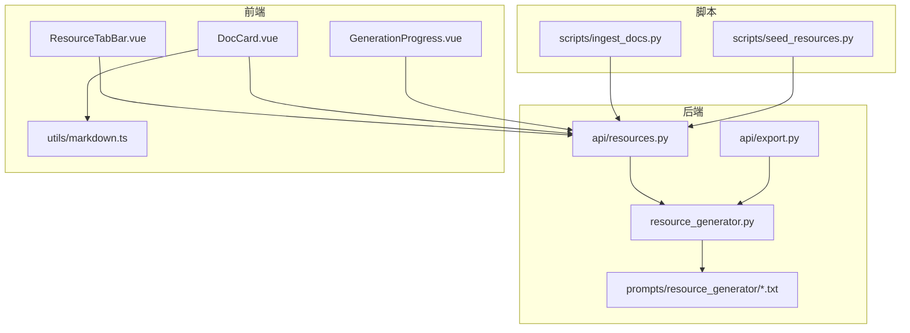
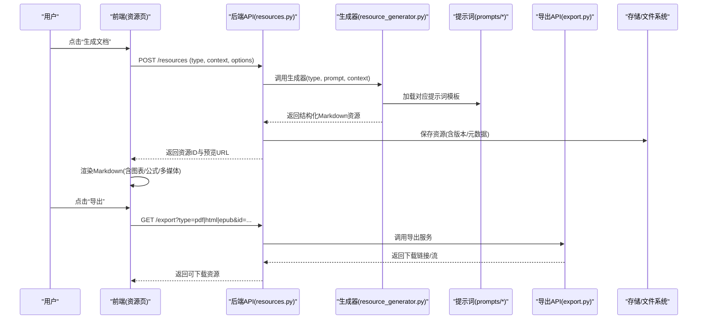
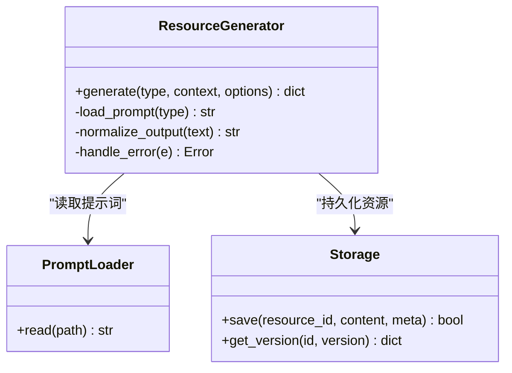
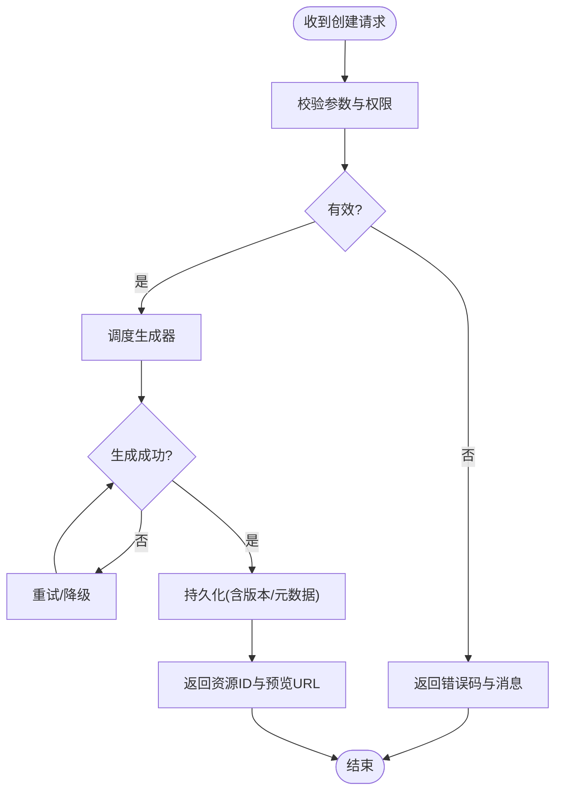
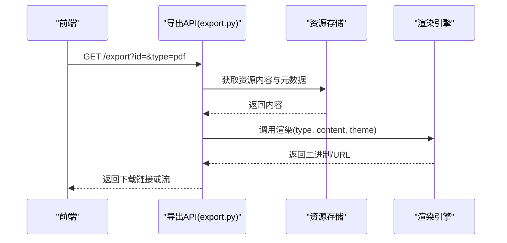
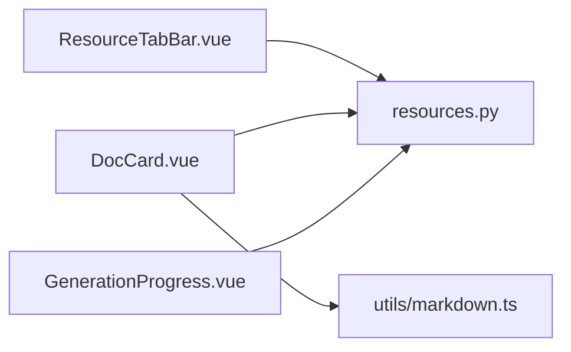
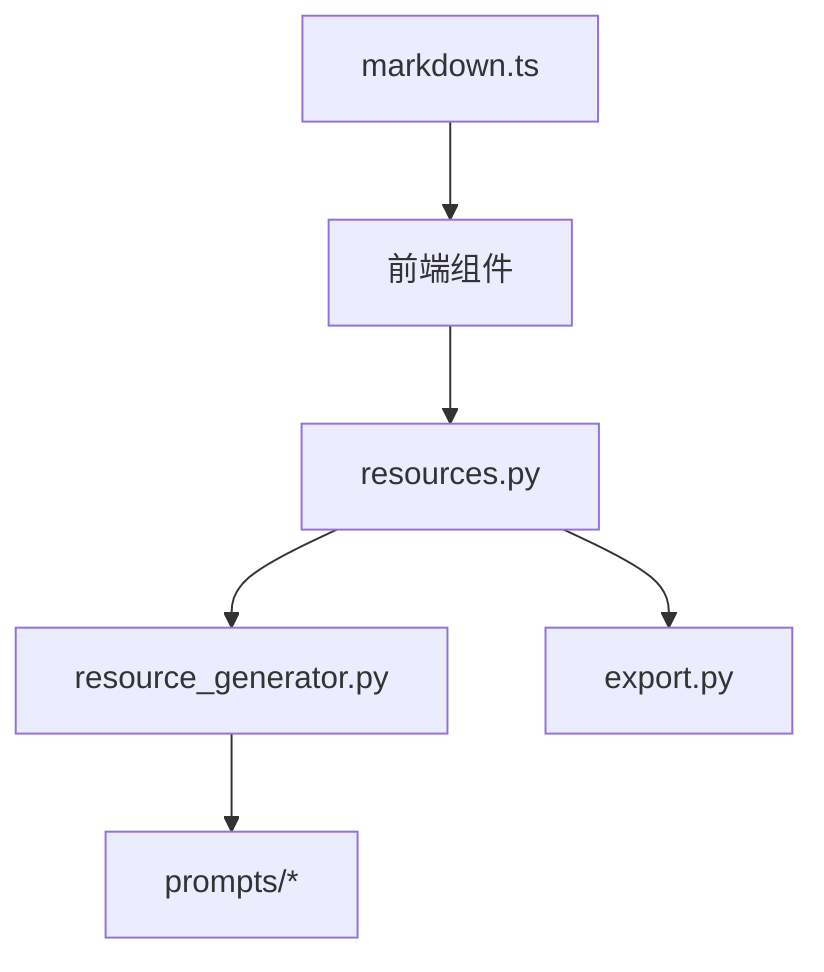

# 文档资源生成

<cite>
**本文引用的文件**   
- [src/loopse/agent/resource_generator.py](file://src/loopse/agent/resource_generator.py)
- [config/prompts/resource_generator/generate_doc.txt](file://config/prompts/resource_generator/generate_doc.txt)
- [config/prompts/resource_generator/generate_code.txt](file://config/prompts/resource_generator/generate_code.txt)
- [config/prompts/resource_generator/generate_exercise.txt](file://config/prompts/resource_generator/generate_exercise.txt)
- [config/prompts/resource_generator/generate_infographic.txt](file://config/prompts/resource_generator/generate_infographic.txt)
- [config/prompts/resource_generator/generate_script.txt](file://config/prompts/resource_generator/generate_script.txt)
- [src/loopse/api/resources.py](file://src/loopse/api/resources.py)
- [src/loopse/api/export.py](file://src/loopse/api/export.py)
- [frontend/src/components/resources/GenerationProgress.vue](file://frontend/src/components/resources/GenerationProgress.vue)
- [frontend/src/components/resources/ResourceTabBar.vue](file://frontend/src/components/resources/ResourceTabBar.vue)
- [frontend/src/components/resources/DocCard.vue](file://frontend/src/components/resources/DocCard.vue)
- [frontend/src/utils/markdown.ts](file://frontend/src/utils/markdown.ts)
- [scripts/ingest_docs.py](file://scripts/ingest_docs.py)
- [scripts/seed_resources.py](file://scripts/seed_resources.py)
</cite>

## 目录
1. [简介](#简介)
2. [项目结构](#项目结构)
3. [核心组件](#核心组件)
4. [架构总览](#架构总览)
5. [详细组件分析](#详细组件分析)
6. [依赖关系分析](#依赖关系分析)
7. [性能考虑](#性能考虑)
8. [故障排查指南](#故障排查指南)
9. [结论](#结论)
10. [附录](#附录)

## 简介
本文件面向“文档资源生成”能力，系统性说明技术文档、教程与说明文档的自动生成流程。内容覆盖：
- Markdown 格式支持与多级标题管理
- 结构化内容组织（章节、段落、列表、表格等）
- 图表插入、公式渲染与多媒体嵌入策略
- 文档版本控制、变更追踪与协作编辑支持
- 模板定制、样式主题配置与导出格式支持
- 构建工具集成与发布流程建议

## 项目结构
围绕文档资源生成的关键位置如下：
- 后端生成器与提示词：agents/resource_generator 与 prompts/resource_generator
- API 层：resources 与 export 接口
- 前端展示与交互：资源卡片、进度条、Markdown 渲染工具
- 脚本：文档入库与种子数据初始化

图示来源
- [src/loopse/agent/resource_generator.py](file://src/loopse/agent/resource_generator.py)
- [src/loopse/api/resources.py](file://src/loopse/api/resources.py)
- [src/loopse/api/export.py](file://src/loopse/api/export.py)
- [config/prompts/resource_generator/generate_doc.txt](file://config/prompts/resource_generator/generate_doc.txt)
- [config/prompts/resource_generator/generate_code.txt](file://config/prompts/resource_generator/generate_code.txt)
- [config/prompts/resource_generator/generate_exercise.txt](file://config/prompts/resource_generator/generate_exercise.txt)
- [config/prompts/resource_generator/generate_infographic.txt](file://config/prompts/resource_generator/generate_infographic.txt)
- [config/prompts/resource_generator/generate_script.txt](file://config/prompts/resource_generator/generate_script.txt)
- [frontend/src/components/resources/ResourceTabBar.vue](file://frontend/src/components/resources/ResourceTabBar.vue)
- [frontend/src/components/resources/DocCard.vue](file://frontend/src/components/resources/DocCard.vue)
- [frontend/src/components/resources/GenerationProgress.vue](file://frontend/src/components/resources/GenerationProgress.vue)
- [frontend/src/utils/markdown.ts](file://frontend/src/utils/markdown.ts)
- [scripts/ingest_docs.py](file://scripts/ingest_docs.py)
- [scripts/seed_resources.py](file://scripts/seed_resources.py)

章节来源
- [src/loopse/agent/resource_generator.py](file://src/loopse/agent/resource_generator.py)
- [src/loopse/api/resources.py](file://src/loopse/api/resources.py)
- [src/loopse/api/export.py](file://src/loopse/api/export.py)
- [config/prompts/resource_generator/generate_doc.txt](file://config/prompts/resource_generator/generate_doc.txt)
- [config/prompts/resource_generator/generate_code.txt](file://config/prompts/resource_generator/generate_code.txt)
- [config/prompts/resource_generator/generate_exercise.txt](file://config/prompts/resource_generator/generate_exercise.txt)
- [config/prompts/resource_generator/generate_infographic.txt](file://config/prompts/resource_generator/generate_infographic.txt)
- [config/prompts/resource_generator/generate_script.txt](file://config/prompts/resource_generator/generate_script.txt)
- [frontend/src/components/resources/ResourceTabBar.vue](file://frontend/src/components/resources/ResourceTabBar.vue)
- [frontend/src/components/resources/DocCard.vue](file://frontend/src/components/resources/DocCard.vue)
- [frontend/src/components/resources/GenerationProgress.vue](file://frontend/src/components/resources/GenerationProgress.vue)
- [frontend/src/utils/markdown.ts](file://frontend/src/utils/markdown.ts)
- [scripts/ingest_docs.py](file://scripts/ingest_docs.py)
- [scripts/seed_resources.py](file://scripts/seed_resources.py)

## 核心组件
- 资源生成器（resource_generator.py）
  - 职责：根据输入上下文与类型选择对应提示词，驱动大模型输出结构化文档资源（如技术文档、教程、说明文档）。
  - 关键点：类型路由、提示词加载、结果规范化、错误处理与重试。
- 提示词集（prompts/resource_generator/*.txt）
  - 职责：定义不同资源类型的生成约束、结构与风格，确保一致的 Markdown 输出。
  - 关键点：模板字段、层级标题约定、图表/公式/多媒体占位符规范。
- 资源 API（api/resources.py）
  - 职责：暴露创建、查询、更新、删除资源的 REST 接口；协调生成器与持久化。
  - 关键点：请求校验、异步任务编排、状态回传、权限与范围检查。
- 导出 API（api/export.py）
  - 职责：将文档资源导出为多种格式（如 PDF、HTML、EPUB 等），并返回下载链接或流式响应。
  - 关键点：格式选择、渲染管线、缓存与并发限制。
- 前端资源展示（DocCard.vue、ResourceTabBar.vue、GenerationProgress.vue）
  - 职责：展示资源卡片、切换资源类型、显示生成进度与结果预览。
  - 关键点：SSE/轮询进度、Markdown 渲染、图片/视频/图表占位处理。
- Markdown 工具（utils/markdown.ts）
  - 职责：前端 Markdown 解析与增强（代码高亮、数学公式、Mermaid 图表等）。
  - 关键点：插件扩展、安全过滤、主题适配。
- 脚本（ingest_docs.py、seed_resources.py）
  - 职责：批量导入外部文档到知识库/资源库；初始化演示数据。
  - 关键点：分块策略、元数据抽取、去重与版本标记。

章节来源
- [src/loopse/agent/resource_generator.py](file://src/loopse/agent/resource_generator.py)
- [src/loopse/api/resources.py](file://src/loopse/api/resources.py)
- [src/loopse/api/export.py](file://src/loopse/api/export.py)
- [config/prompts/resource_generator/generate_doc.txt](file://config/prompts/resource_generator/generate_doc.txt)
- [config/prompts/resource_generator/generate_code.txt](file://config/prompts/resource_generator/generate_code.txt)
- [config/prompts/resource_generator/generate_exercise.txt](file://config/prompts/resource_generator/generate_exercise.txt)
- [config/prompts/resource_generator/generate_infographic.txt](file://config/prompts/resource_generator/generate_infographic.txt)
- [config/prompts/resource_generator/generate_script.txt](file://config/prompts/resource_generator/generate_script.txt)
- [frontend/src/components/resources/DocCard.vue](file://frontend/src/components/resources/DocCard.vue)
- [frontend/src/components/resources/ResourceTabBar.vue](file://frontend/src/components/resources/ResourceTabBar.vue)
- [frontend/src/components/resources/GenerationProgress.vue](file://frontend/src/components/resources/GenerationProgress.vue)
- [frontend/src/utils/markdown.ts](file://frontend/src/utils/markdown.ts)
- [scripts/ingest_docs.py](file://scripts/ingest_docs.py)
- [scripts/seed_resources.py](file://scripts/seed_resources.py)

## 架构总览
下图展示了从用户触发到文档落盘与导出的端到端流程，以及前后端与提示词、导出模块的交互。

图示来源
- [src/loopse/api/resources.py](file://src/loopse/api/resources.py)
- [src/loopse/agent/resource_generator.py](file://src/loopse/agent/resource_generator.py)
- [config/prompts/resource_generator/generate_doc.txt](file://config/prompts/resource_generator/generate_doc.txt)
- [src/loopse/api/export.py](file://src/loopse/api/export.py)

## 详细组件分析

### 资源生成器（resource_generator.py）
- 设计要点
  - 类型路由：根据资源类型选择对应提示词与后处理逻辑。
  - 提示词装配：注入上下文、目标读者、长度、语言、风格等参数。
  - 结果规范化：统一 Markdown 结构（标题层级、列表、表格、代码块、引用等）。
  - 健壮性：超时、重试、降级与错误分类。
- 数据结构与复杂度
  - 输入：上下文摘要、目标受众、资源类型、选项字典。
  - 输出：标准化 Markdown 文本与元数据（作者、时间戳、版本、标签）。
  - 复杂度：主要受 LLM 推理成本与提示词长度影响；可通过缓存与增量更新优化。
- 依赖链
  - 依赖提示词模板、LLM 客户端、持久化接口、日志与监控。
- 优化机会
  - 提示词缓存、结果缓存、并行生成、流式返回。
- 错误处理
  - 区分网络错误、模型限流、内容违规、格式异常，提供重试与回退策略。

图示来源
- [src/loopse/agent/resource_generator.py](file://src/loopse/agent/resource_generator.py)
- [config/prompts/resource_generator/generate_doc.txt](file://config/prompts/resource_generator/generate_doc.txt)

章节来源
- [src/loopse/agent/resource_generator.py](file://src/loopse/agent/resource_generator.py)
- [config/prompts/resource_generator/generate_doc.txt](file://config/prompts/resource_generator/generate_doc.txt)

### 提示词模板（prompts/resource_generator/*.txt）
- 模板职责
  - 规定输出结构：封面、目录、正文、附录、参考文献。
  - 约束标题层级：H1/H2/H3 使用规范，避免混用。
  - 指定图表/公式/多媒体占位符：便于后续渲染与替换。
- 类型差异
  - generate_doc.txt：偏技术文档/说明书，强调严谨性与可追溯性。
  - generate_code.txt：示例代码、注释规范、运行步骤。
  - generate_exercise.txt：练习题、答案与解析。
  - generate_infographic.txt：信息图大纲与可视化建议。
  - generate_script.txt：演示脚本、旁白与分镜。
- 最佳实践
  - 变量插值、条件分支、示例片段、负面约束（禁止项）。

章节来源
- [config/prompts/resource_generator/generate_doc.txt](file://config/prompts/resource_generator/generate_doc.txt)
- [config/prompts/resource_generator/generate_code.txt](file://config/prompts/resource_generator/generate_code.txt)
- [config/prompts/resource_generator/generate_exercise.txt](file://config/prompts/resource_generator/generate_exercise.txt)
- [config/prompts/resource_generator/generate_infographic.txt](file://config/prompts/resource_generator/generate_infographic.txt)
- [config/prompts/resource_generator/generate_script.txt](file://config/prompts/resource_generator/generate_script.txt)

### 资源 API（resources.py）
- 接口职责
  - 创建资源：接收类型、上下文与选项，调度生成器并落盘。
  - 查询资源：按 ID/标签/版本检索，返回列表与详情。
  - 更新/删除：支持版本化更新与软删除。
- 流程要点
  - 参数校验、权限检查、异步任务编排、进度事件推送。
  - 与导出 API 解耦，通过资源 ID 引用。
- 错误与幂等
  - 重复提交保护、冲突检测、事务回滚。

图示来源
- [src/loopse/api/resources.py](file://src/loopse/api/resources.py)
- [src/loopse/agent/resource_generator.py](file://src/loopse/agent/resource_generator.py)

章节来源
- [src/loopse/api/resources.py](file://src/loopse/api/resources.py)

### 导出 API（export.py）
- 功能范围
  - 支持导出为 PDF、HTML、EPUB 等格式。
  - 基于资源内容与样式主题进行渲染。
- 实现要点
  - 格式选择、渲染引擎调用、缓存命中、流式下载。
  - 并发限制与队列化，避免瞬时峰值压垮渲染服务。
- 与资源 API 的关系
  - 仅消费资源 ID 与版本，不修改源内容。

图示来源
- [src/loopse/api/export.py](file://src/loopse/api/export.py)

章节来源
- [src/loopse/api/export.py](file://src/loopse/api/export.py)

### 前端资源展示与 Markdown 渲染
- 资源卡片与标签栏
  - DocCard.vue：展示单篇文档摘要、操作入口（查看、导出、分享）。
  - ResourceTabBar.vue：切换资源类型与筛选条件。
- 生成进度
  - GenerationProgress.vue：通过 SSE 或轮询获取生成状态，反馈给用户。
- Markdown 工具
  - utils/markdown.ts：解析 Markdown，启用代码高亮、数学公式、Mermaid 图表、媒体嵌入与安全过滤。

图示来源
- [frontend/src/components/resources/ResourceTabBar.vue](file://frontend/src/components/resources/ResourceTabBar.vue)
- [frontend/src/components/resources/DocCard.vue](file://frontend/src/components/resources/DocCard.vue)
- [frontend/src/components/resources/GenerationProgress.vue](file://frontend/src/components/resources/GenerationProgress.vue)
- [frontend/src/utils/markdown.ts](file://frontend/src/utils/markdown.ts)
- [src/loopse/api/resources.py](file://src/loopse/api/resources.py)

章节来源
- [frontend/src/components/resources/ResourceTabBar.vue](file://frontend/src/components/resources/ResourceTabBar.vue)
- [frontend/src/components/resources/DocCard.vue](file://frontend/src/components/resources/DocCard.vue)
- [frontend/src/components/resources/GenerationProgress.vue](file://frontend/src/components/resources/GenerationProgress.vue)
- [frontend/src/utils/markdown.ts](file://frontend/src/utils/markdown.ts)
- [src/loopse/api/resources.py](file://src/loopse/api/resources.py)

### 文档入库与种子数据（ingest_docs.py、seed_resources.py）
- ingest_docs.py
  - 作用：将外部文档（PDF/Markdown/网页）解析、分块、抽取元数据并入库，供生成器参考。
  - 关键点：分块策略、去重、索引建立、版本标记。
- seed_resources.py
  - 作用：初始化演示资源，便于快速体验生成与导出流程。
  - 关键点：模板填充、随机化参数、一致性校验。

章节来源
- [scripts/ingest_docs.py](file://scripts/ingest_docs.py)
- [scripts/seed_resources.py](file://scripts/seed_resources.py)

## 依赖关系分析
- 组件耦合
  - resources.py 与 resource_generator.py 强耦合（生成流程）；与 export.py 松耦合（通过资源 ID）。
  - 前端与后端通过 REST/SSE 通信，关注点清晰。
- 外部依赖
  - LLM 客户端、渲染引擎（PDF/HTML/EPUB）、对象存储/数据库、消息通道（SSE/队列）。
- 潜在循环依赖
  - 当前分层清晰，未见循环；需保持 API 与 Agent 的单向依赖。

图示来源
- [src/loopse/api/resources.py](file://src/loopse/api/resources.py)
- [src/loopse/agent/resource_generator.py](file://src/loopse/agent/resource_generator.py)
- [src/loopse/api/export.py](file://src/loopse/api/export.py)
- [config/prompts/resource_generator/generate_doc.txt](file://config/prompts/resource_generator/generate_doc.txt)
- [frontend/src/components/resources/DocCard.vue](file://frontend/src/components/resources/DocCard.vue)
- [frontend/src/utils/markdown.ts](file://frontend/src/utils/markdown.ts)

章节来源
- [src/loopse/api/resources.py](file://src/loopse/api/resources.py)
- [src/loopse/agent/resource_generator.py](file://src/loopse/agent/resource_generator.py)
- [src/loopse/api/export.py](file://src/loopse/api/export.py)
- [config/prompts/resource_generator/generate_doc.txt](file://config/prompts/resource_generator/generate_doc.txt)
- [frontend/src/components/resources/DocCard.vue](file://frontend/src/components/resources/DocCard.vue)
- [frontend/src/utils/markdown.ts](file://frontend/src/utils/markdown.ts)

## 性能考虑
- 生成阶段
  - 使用缓存（提示词、中间结果、最终资源）减少重复计算。
  - 对长文档采用分段生成与合并策略，降低单次请求时延。
  - 引入流式返回，提升首字节时间与用户体验。
- 导出阶段
  - 渲染任务入队，限制并发度，避免渲染服务过载。
  - 对热门导出格式启用预渲染与 CDN 分发。
- 前端渲染
  - 按需加载 Markdown 插件，懒加载大图与视频。
  - 对复杂图表（Mermaid）进行静态化或缓存。

[本节为通用指导，无需源码引用]

## 故障排查指南
- 常见问题定位
  - 生成失败：检查提示词模板是否完整、上下文是否缺失、LLM 限流与超时。
  - 导出失败：确认渲染引擎可用、资源内容是否包含不支持的语法。
  - 前端渲染异常：核对 Markdown 语法、图片路径、公式与图表插件是否启用。
- 日志与追踪
  - 在生成与导出链路中记录关键节点耗时与错误堆栈。
  - 为每次生成分配唯一 traceId，贯穿前后端与导出服务。
- 恢复策略
  - 自动重试与指数退避；失败降级为纯文本或简化版导出。
  - 保留历史版本，支持一键回滚。

章节来源
- [src/loopse/agent/resource_generator.py](file://src/loopse/agent/resource_generator.py)
- [src/loopse/api/export.py](file://src/loopse/api/export.py)
- [frontend/src/utils/markdown.ts](file://frontend/src/utils/markdown.ts)

## 结论
本项目围绕“文档资源生成”构建了从提示词到生成、持久化、导出与前端展示的完整链路。通过类型化的提示词模板与标准化的 Markdown 输出，实现了技术文档、教程与说明文档的可控生成；结合导出 API 与前端渲染工具，满足多格式阅读与传播需求。建议在后续迭代中强化版本化与协作编辑能力，完善审计与合规机制，并持续优化性能与稳定性。

[本节为总结性内容，无需源码引用]

## 附录

### Markdown 格式支持与多级标题管理
- 标题层级
  - 严格遵循 H1/H2/H3 层级，避免跨级；目录由标题自动生成。
- 结构化元素
  - 列表、表格、代码块、引用、脚注、超链接、图片与视频。
- 图表与公式
  - 图表：使用 Mermaid 语法或图片占位符，前端按需渲染。
  - 公式：使用 LaTeX 语法，前端启用数学渲染插件。
- 多媒体嵌入
  - 图片、音频、视频建议使用相对路径或 CDN 地址，并提供降级方案。

章节来源
- [config/prompts/resource_generator/generate_doc.txt](file://config/prompts/resource_generator/generate_doc.txt)
- [frontend/src/utils/markdown.ts](file://frontend/src/utils/markdown.ts)

### 文档版本控制、变更追踪与协作编辑
- 版本控制
  - 每次更新生成新版本号，保留历史快照与差异对比。
- 变更追踪
  - 记录作者、时间、变更原因与关联任务；支持审计日志。
- 协作编辑
  - 基于资源 ID 的乐观锁与冲突解决；可选实时协同（SSE/WebSocket）。

章节来源
- [src/loopse/api/resources.py](file://src/loopse/api/resources.py)
- [src/loopse/agent/resource_generator.py](file://src/loopse/agent/resource_generator.py)

### 模板定制、样式主题与导出格式
- 模板定制
  - 通过 prompts 目录下的模板文件调整结构与风格；支持变量插值与条件分支。
- 样式主题
  - 导出时选择主题（浅色/深色/学术/企业），统一字体与配色。
- 导出格式
  - 支持 PDF、HTML、EPUB；可按需开启目录、页眉页脚与水印。

章节来源
- [config/prompts/resource_generator/generate_doc.txt](file://config/prompts/resource_generator/generate_doc.txt)
- [src/loopse/api/export.py](file://src/loopse/api/export.py)

### 构建工具集成与发布流程
- 构建集成
  - 在 CI 中执行文档生成与导出，产出制品并上传至对象存储/CDN。
- 发布流程
  - 版本打标、变更日志自动生成、灰度发布与回滚策略。
- 质量门禁
  - 语法校验、链接检查、敏感信息扫描、可读性评分。

[本节为通用指导，无需源码引用]