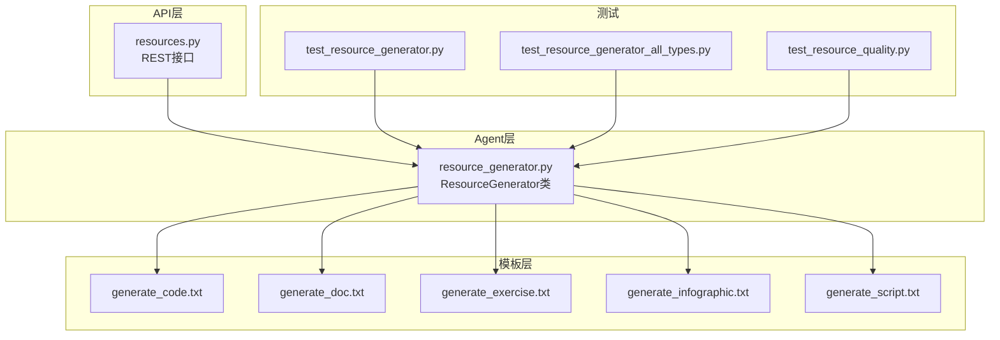
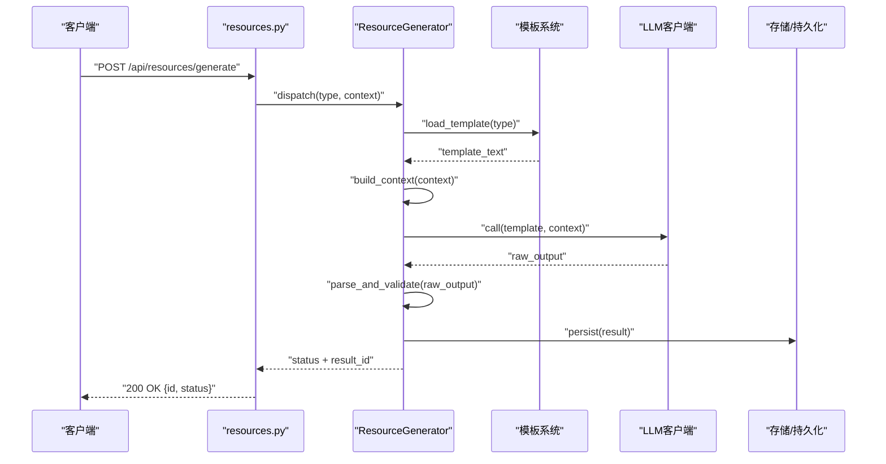
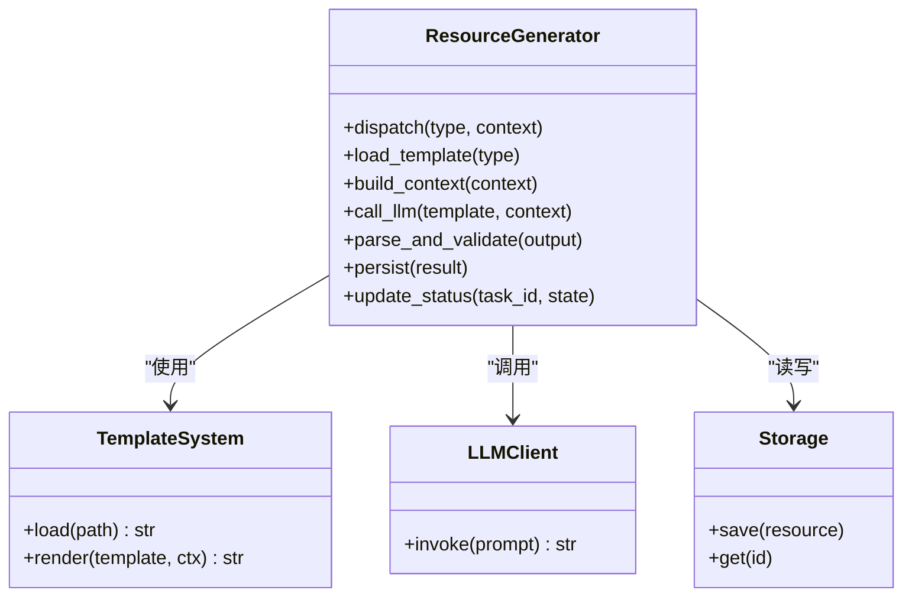
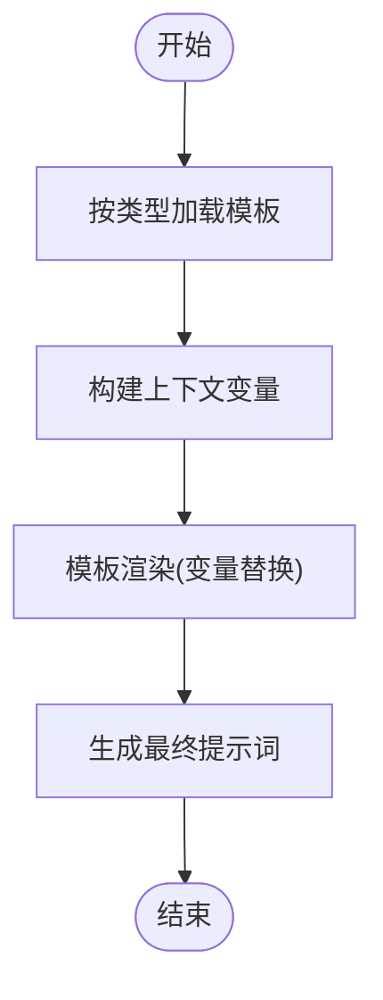
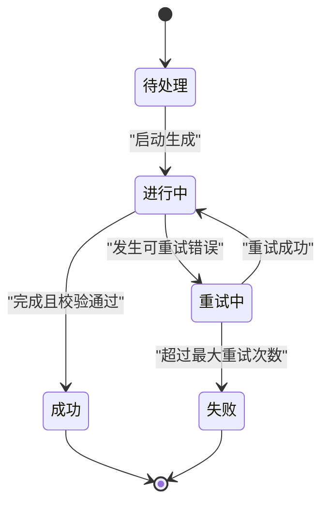
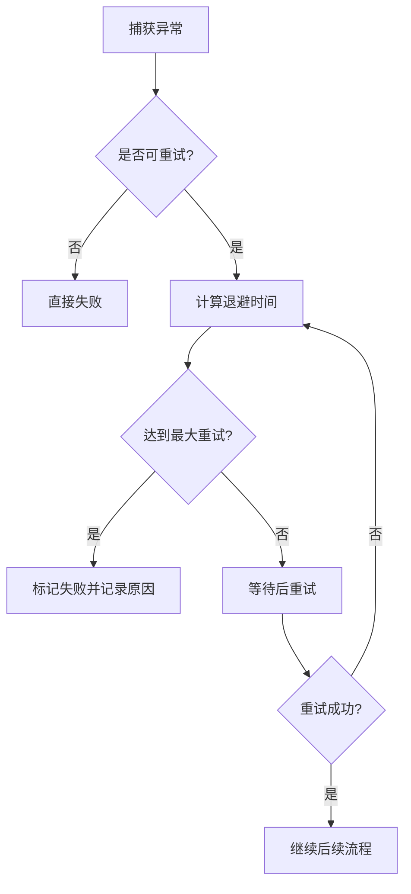
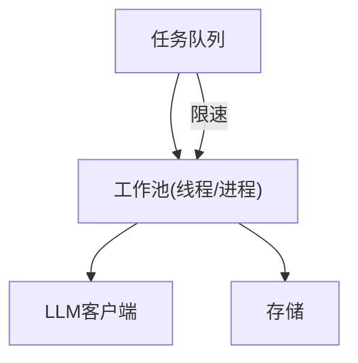
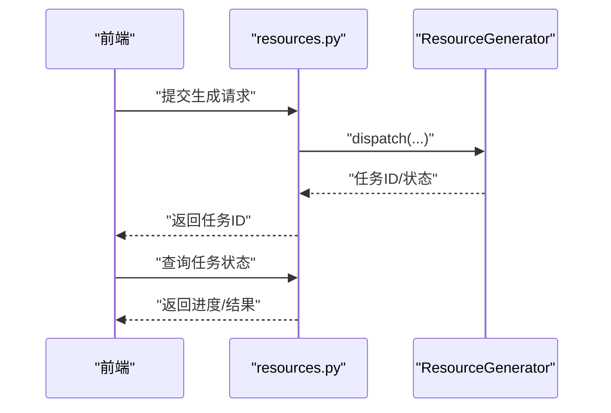
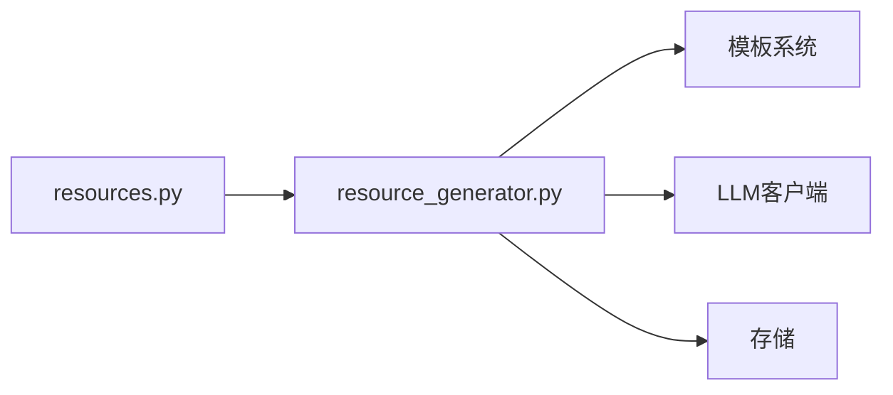

# 核心生成引擎

<cite>
**本文引用的文件**   
- [resource_generator.py](file://src/loopse/agent/resource_generator.py)
- [generate_code.txt](file://config/prompts/resource_generator/generate_code.txt)
- [generate_doc.txt](file://config/prompts/resource_generator/generate_doc.txt)
- [generate_exercise.txt](file://config/prompts/resource_generator/generate_exercise.txt)
- [generate_infographic.txt](file://config/prompts/resource_generator/generate_infographic.txt)
- [generate_script.txt](file://config/prompts/resource_generator/generate_script.txt)
- [resources.py](file://src/loopse/api/resources.py)
- [test_resource_generator.py](file://tests/unit/test_resource_generator.py)
- [test_resource_generator_all_types.py](file://tests/unit/test_resource_generator_all_types.py)
- [test_resource_quality.py](file://tests/unit/test_resource_quality.py)
</cite>

## 目录
1. [简介](#简介)
2. [项目结构](#项目结构)
3. [核心组件](#核心组件)
4. [架构总览](#架构总览)
5. [详细组件分析](#详细组件分析)
6. [依赖分析](#依赖分析)
7. [性能考虑](#性能考虑)
8. [故障排查指南](#故障排查指南)
9. [结论](#结论)
10. [附录](#附录)

## 简介
本文件聚焦资源生成核心引擎，围绕 ResourceGenerator 类的架构设计、生成流程控制与智能体协作机制展开。文档同时覆盖模板系统（提示词模板加载、变量替换与动态内容生成）、生成状态管理、错误处理与重试策略、并发与资源限制配置，以及扩展新资源类型的开发指南与最佳实践。目标是帮助开发者快速理解并高效扩展资源生成能力。

## 项目结构
资源生成相关代码主要分布在以下位置：
- 生成器实现：src/loopse/agent/resource_generator.py
- 对外 API：src/loopse/api/resources.py
- 提示词模板：config/prompts/resource_generator/*.txt
- 单元测试：tests/unit/test_resource_generator*.py

图表来源
- [resources.py](file://src/loopse/api/resources.py)
- [resource_generator.py](file://src/loopse/agent/resource_generator.py)
- [generate_code.txt](file://config/prompts/resource_generator/generate_code.txt)
- [generate_doc.txt](file://config/prompts/resource_generator/generate_doc.txt)
- [generate_exercise.txt](file://config/prompts/resource_generator/generate_exercise.txt)
- [generate_infographic.txt](file://config/prompts/resource_generator/generate_infographic.txt)
- [generate_script.txt](file://config/prompts/resource_generator/generate_script.txt)
- [test_resource_generator.py](file://tests/unit/test_resource_generator.py)
- [test_resource_generator_all_types.py](file://tests/unit/test_resource_generator_all_types.py)
- [test_resource_quality.py](file://tests/unit/test_resource_quality.py)

章节来源
- [resource_generator.py](file://src/loopse/agent/resource_generator.py)
- [resources.py](file://src/loopse/api/resources.py)
- [generate_code.txt](file://config/prompts/resource_generator/generate_code.txt)
- [generate_doc.txt](file://config/prompts/resource_generator/generate_doc.txt)
- [generate_exercise.txt](file://config/prompts/resource_generator/generate_exercise.txt)
- [generate_infographic.txt](file://config/prompts/resource_generator/generate_infographic.txt)
- [generate_script.txt](file://config/prompts/resource_generator/generate_script.txt)
- [test_resource_generator.py](file://tests/unit/test_resource_generator.py)
- [test_resource_generator_all_types.py](file://tests/unit/test_resource_generator_all_types.py)
- [test_resource_quality.py](file://tests/unit/test_resource_quality.py)

## 核心组件
- ResourceGenerator：资源生成的核心编排器，负责路由到具体类型处理器、加载模板、组装上下文、调用 LLM、解析输出、持久化结果与状态更新。
- 模板系统：基于 config/prompts/resource_generator/*.txt 的文本模板，支持变量占位符与运行时上下文注入，按资源类型选择对应模板。
- 外部集成点：LLM 客户端、知识库检索、存储后端（由上层服务注入或内部封装）。
- 状态与重试：维护生成任务的状态机（如待处理、进行中、成功、失败），并提供可配置的重试与退避策略。
- 并发与限流：通过线程池/进程池或异步队列控制并发度，结合令牌桶/信号量进行速率限制。

章节来源
- [resource_generator.py](file://src/loopse/agent/resource_generator.py)

## 架构总览
下图展示了从 API 请求到资源落库的端到端流程，包括模板加载、上下文构建、LLM 调用、结果校验与状态推进。

图表来源
- [resources.py](file://src/loopse/api/resources.py)
- [resource_generator.py](file://src/loopse/agent/resource_generator.py)
- [generate_code.txt](file://config/prompts/resource_generator/generate_code.txt)
- [generate_doc.txt](file://config/prompts/resource_generator/generate_doc.txt)
- [generate_exercise.txt](file://config/prompts/resource_generator/generate_exercise.txt)
- [generate_infographic.txt](file://config/prompts/resource_generator/generate_infographic.txt)
- [generate_script.txt](file://config/prompts/resource_generator/generate_script.txt)

## 详细组件分析

### ResourceGenerator 类设计
- 职责边界
  - 类型路由：根据资源类型选择对应模板与解析器。
  - 上下文装配：将用户输入、知识片段、风格约束等合并为模板上下文。
  - 生成编排：调用 LLM、解析返回、质量校验、持久化与状态更新。
  - 错误与重试：捕获异常、记录日志、触发重试与降级策略。
- 关键方法（概念性）
  - dispatch(type, context): 入口分发
  - load_template(type): 模板加载
  - build_context(context): 上下文构建
  - call_llm(template, context): 模型调用
  - parse_and_validate(output): 输出解析与校验
  - persist(result): 结果持久化
  - update_status(task_id, state): 状态推进
- 设计模式
  - 策略模式：不同资源类型对应不同模板与解析策略。
  - 工厂模式：按类型创建对应的处理器实例。
  - 状态机：任务状态流转清晰，便于追踪与恢复。

图表来源
- [resource_generator.py](file://src/loopse/agent/resource_generator.py)

章节来源
- [resource_generator.py](file://src/loopse/agent/resource_generator.py)

### 模板系统工作原理
- 模板组织
  - 按资源类型分文件存放于 config/prompts/resource_generator/*.txt。
  - 每个模板包含占位符，用于在渲染时替换为上下文变量。
- 加载与渲染
  - 根据资源类型定位模板路径，读取模板文本。
  - 将上下文变量注入模板，生成最终提示词。
- 动态内容生成
  - 上下文可包含知识点、示例、风格约束、长度限制等。
  - 支持条件分支与可选段落，提升生成灵活性。

图表来源
- [generate_code.txt](file://config/prompts/resource_generator/generate_code.txt)
- [generate_doc.txt](file://config/prompts/resource_generator/generate_doc.txt)
- [generate_exercise.txt](file://config/prompts/resource_generator/generate_exercise.txt)
- [generate_infographic.txt](file://config/prompts/resource_generator/generate_infographic.txt)
- [generate_script.txt](file://config/prompts/resource_generator/generate_script.txt)

章节来源
- [generate_code.txt](file://config/prompts/resource_generator/generate_code.txt)
- [generate_doc.txt](file://config/prompts/resource_generator/generate_doc.txt)
- [generate_exercise.txt](file://config/prompts/resource_generator/generate_exercise.txt)
- [generate_infographic.txt](file://config/prompts/resource_generator/generate_infographic.txt)
- [generate_script.txt](file://config/prompts/resource_generator/generate_script.txt)

### 生成流程控制与状态管理
- 状态定义
  - 待处理、进行中、成功、失败、重试中。
- 状态推进
  - 进入生成前置入“进行中”，成功后标记“成功”，失败则进入“失败”或“重试中”。
- 幂等与恢复
  - 通过任务 ID 保证幂等；失败后可根据状态恢复继续执行。

章节来源
- [resource_generator.py](file://src/loopse/agent/resource_generator.py)

### 错误处理与重试机制
- 错误分类
  - 网络超时、模型限流、格式解析失败、业务校验失败。
- 重试策略
  - 指数退避、最大重试次数、抖动随机化。
- 降级与回退
  - 当多次重试失败时，返回部分结果或默认模板内容，保障用户体验。

章节来源
- [resource_generator.py](file://src/loopse/agent/resource_generator.py)

### 并发处理与资源限制
- 并发模型
  - 使用线程池/进程池或异步队列并行处理多个生成任务。
- 资源限制
  - 令牌桶/信号量控制并发度与速率，避免压垮下游 LLM 服务。
- 背压与队列
  - 当负载过高时，任务排队并逐步消化，防止雪崩。

章节来源
- [resource_generator.py](file://src/loopse/agent/resource_generator.py)

### 对外 API 集成
- 接口职责
  - 接收前端请求，参数校验，调用 ResourceGenerator.dispatch，返回任务状态与结果。
- 典型流程
  - 校验输入 -> 创建任务 -> 异步生成 -> 轮询/回调获取结果。

图表来源
- [resources.py](file://src/loopse/api/resources.py)
- [resource_generator.py](file://src/loopse/agent/resource_generator.py)

章节来源
- [resources.py](file://src/loopse/api/resources.py)
- [resource_generator.py](file://src/loopse/agent/resource_generator.py)

### 单元测试与质量保障
- 单测覆盖
  - 基础功能：模板加载、上下文渲染、解析与持久化。
  - 全类型覆盖：验证所有资源类型均能正确走通流程。
  - 质量评估：对生成内容进行基本质量检查（如长度、关键字、格式）。
- 断言要点
  - 状态推进正确、重试逻辑生效、错误路径可复现。

章节来源
- [test_resource_generator.py](file://tests/unit/test_resource_generator.py)
- [test_resource_generator_all_types.py](file://tests/unit/test_resource_generator_all_types.py)
- [test_resource_quality.py](file://tests/unit/test_resource_quality.py)

## 依赖分析
- 内部依赖
  - ResourceGenerator 依赖模板系统、LLM 客户端、存储模块。
  - API 层依赖 ResourceGenerator 作为核心编排器。
- 外部依赖
  - LLM 服务（可能含鉴权、限流、计费）。
  - 存储后端（数据库/对象存储）。
- 耦合与内聚
  - 通过接口抽象降低耦合，提高可替换性与可测试性。
  - 模板与解析策略按类型解耦，增强扩展性。

图表来源
- [resources.py](file://src/loopse/api/resources.py)
- [resource_generator.py](file://src/loopse/agent/resource_generator.py)

章节来源
- [resources.py](file://src/loopse/api/resources.py)
- [resource_generator.py](file://src/loopse/agent/resource_generator.py)

## 性能考虑
- 缓存策略
  - 对相同上下文的模板渲染结果进行缓存，减少重复计算。
- 批处理
  - 批量生成相似资源，复用检索结果与中间数据。
- 连接池
  - LLM 客户端与存储连接复用，降低握手开销。
- 监控与告警
  - 记录耗时、错误率、重试次数，设置阈值告警。

[本节为通用性能建议，不直接分析具体文件]

## 故障排查指南
- 常见问题
  - 模板未找到：检查模板路径与命名是否与资源类型一致。
  - 上下文缺失：确认必填字段是否齐全。
  - 解析失败：核对输出格式与解析规则。
  - 重试风暴：检查退避时间与最大重试次数配置。
- 诊断步骤
  - 查看任务状态与日志，定位失败阶段。
  - 最小化上下文复现问题，逐步增加复杂度。
  - 切换至 Mock LLM 以隔离外部依赖问题。

章节来源
- [resource_generator.py](file://src/loopse/agent/resource_generator.py)

## 结论
ResourceGenerator 通过清晰的职责划分、灵活的模板系统与稳健的错误重试机制，实现了可扩展、高性能的资源生成能力。配合完善的单测与监控，可在复杂场景下保持稳定交付。建议遵循本文档的最佳实践，持续优化模板质量与解析健壮性，以提升整体生成效果与系统可靠性。

[本节为总结性内容，不直接分析具体文件]

## 附录

### 扩展新资源类型的开发指南
- 新增模板
  - 在 config/prompts/resource_generator 下新增对应 .txt 模板文件，定义占位符与结构说明。
- 注册类型
  - 在 ResourceGenerator 的类型路由中注册新类型，指向新模板与解析器。
- 实现解析器
  - 编写针对新类型的输出解析与校验逻辑，确保结构化与一致性。
- 编写单测
  - 覆盖正常路径、异常路径与边界条件，确保稳定性。
- 集成与联调
  - 通过 API 接口端到端验证，观察状态推进与日志输出。

章节来源
- [resource_generator.py](file://src/loopse/agent/resource_generator.py)
- [generate_code.txt](file://config/prompts/resource_generator/generate_code.txt)
- [generate_doc.txt](file://config/prompts/resource_generator/generate_doc.txt)
- [generate_exercise.txt](file://config/prompts/resource_generator/generate_exercise.txt)
- [generate_infographic.txt](file://config/prompts/resource_generator/generate_infographic.txt)
- [generate_script.txt](file://config/prompts/resource_generator/generate_script.txt)

### 自定义生成逻辑与集成外部工具
- 插件化策略
  - 将特定资源的生成逻辑封装为独立策略类，通过工厂按类型注入。
- 外部工具集成
  - 在解析前后插入预处理/后处理钩子，例如代码格式化、图片压缩、脚本打包。
- 安全与合规
  - 对输入输出进行白名单校验与敏感信息过滤，确保合规。

章节来源
- [resource_generator.py](file://src/loopse/agent/resource_generator.py)