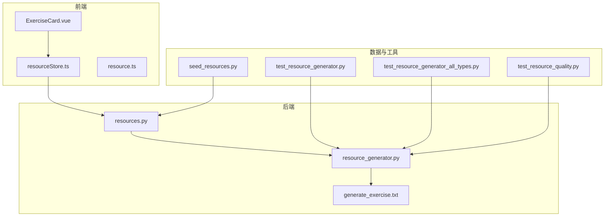
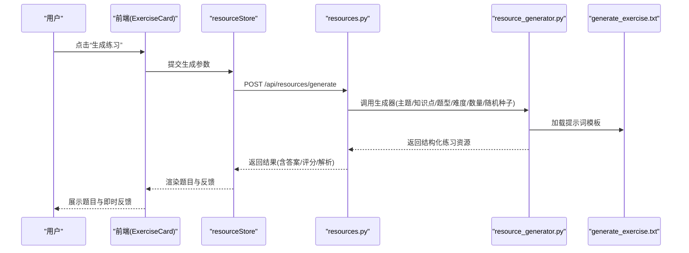
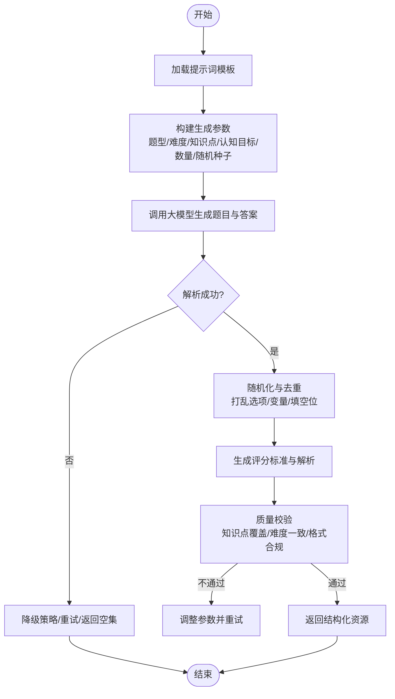
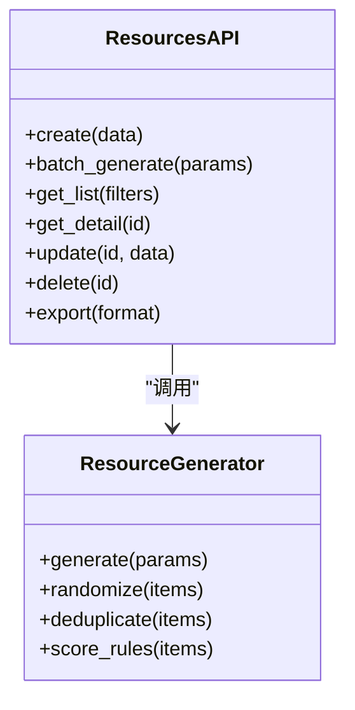
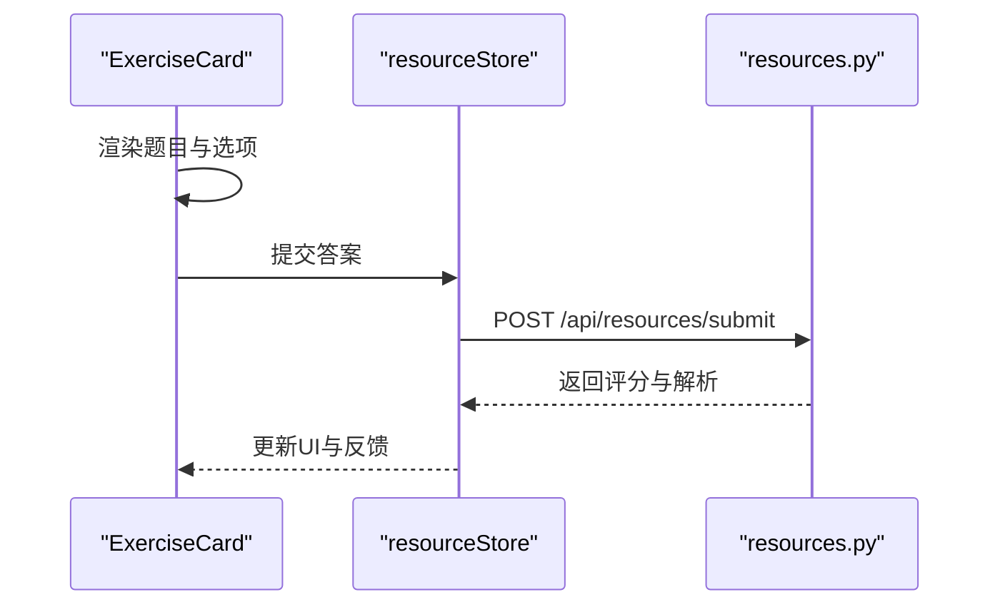
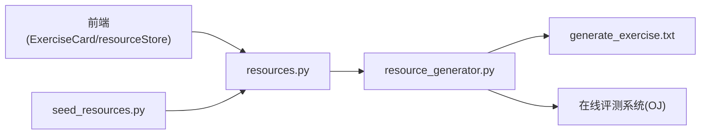

# 练习资源生成

<cite>
**本文引用的文件**   
- [src/loopse/agent/resource_generator.py](file://src/loopse/agent/resource_generator.py)
- [config/prompts/resource_generator/generate_exercise.txt](file://config/prompts/resource_generator/generate_exercise.txt)
- [src/loopse/api/resources.py](file://src/loopse/api/resources.py)
- [frontend/src/components/resources/ExerciseCard.vue](file://frontend/src/components/resources/ExerciseCard.vue)
- [frontend/src/stores/resourceStore.ts](file://frontend/src/stores/resourceStore.ts)
- [frontend/src/types/resource.ts](file://frontend/src/types/resource.ts)
- [scripts/seed_resources.py](file://scripts/seed_resources.py)
- [tests/unit/test_resource_generator.py](file://tests/unit/test_resource_generator.py)
- [tests/unit/test_resource_generator_all_types.py](file://tests/unit/test_resource_generator_all_types.py)
- [tests/unit/test_resource_quality.py](file://tests/unit/test_resource_quality.py)
</cite>

## 目录
1. [简介](#简介)
2. [项目结构](#项目结构)
3. [核心组件](#核心组件)
4. [架构总览](#架构总览)
5. [详细组件分析](#详细组件分析)
6. [依赖关系分析](#依赖关系分析)
7. [性能与可扩展性](#性能与可扩展性)
8. [故障排查指南](#故障排查指南)
9. [结论](#结论)
10. [附录](#附录)

## 简介
本文件聚焦“练习资源生成”子系统，覆盖练习题、测验与实验任务的自动生成机制。文档从系统架构、数据流、处理逻辑、集成点、错误处理与性能特性等维度展开，并给出题型支持（选择题、填空题、编程题等）、随机化算法与防作弊措施、模板定制、批量生成与导入导出、在线评测系统集成与实时反馈的完整说明。

## 项目结构
围绕练习资源生成的关键代码与配置分布如下：
- 后端生成器：位于 agents 层，负责基于提示词与知识图谱/向量库检索结果生成题目、答案与评分标准。
- API 接口：提供创建、查询、批量生成、导出等能力。
- 前端展示与交互：渲染练习卡片、进度、提交与反馈。
- 种子脚本：用于初始化示例数据与批量导入。
- 测试套件：覆盖多题型生成、质量评估与回归验证。

图表来源
- [src/loopse/api/resources.py](file://src/loopse/api/resources.py)
- [src/loopse/agent/resource_generator.py](file://src/loopse/agent/resource_generator.py)
- [config/prompts/resource_generator/generate_exercise.txt](file://config/prompts/resource_generator/generate_exercise.txt)
- [frontend/src/components/resources/ExerciseCard.vue](file://frontend/src/components/resources/ExerciseCard.vue)
- [frontend/src/stores/resourceStore.ts](file://frontend/src/stores/resourceStore.ts)
- [frontend/src/types/resource.ts](file://frontend/src/types/resource.ts)
- [scripts/seed_resources.py](file://scripts/seed_resources.py)
- [tests/unit/test_resource_generator.py](file://tests/unit/test_resource_generator.py)
- [tests/unit/test_resource_generator_all_types.py](file://tests/unit/test_resource_generator_all_types.py)
- [tests/unit/test_resource_quality.py](file://tests/unit/test_resource_quality.py)

章节来源
- [src/loopse/api/resources.py](file://src/loopse/api/resources.py)
- [src/loopse/agent/resource_generator.py](file://src/loopse/agent/resource_generator.py)
- [config/prompts/resource_generator/generate_exercise.txt](file://config/prompts/resource_generator/generate_exercise.txt)
- [frontend/src/components/resources/ExerciseCard.vue](file://frontend/src/components/resources/ExerciseCard.vue)
- [frontend/src/stores/resourceStore.ts](file://frontend/src/stores/resourceStore.ts)
- [frontend/src/types/resource.ts](file://frontend/src/types/resource.ts)
- [scripts/seed_resources.py](file://scripts/seed_resources.py)
- [tests/unit/test_resource_generator.py](file://tests/unit/test_resource_generator.py)
- [tests/unit/test_resource_generator_all_types.py](file://tests/unit/test_resource_generator_all_types.py)
- [tests/unit/test_resource_quality.py](file://tests/unit/test_resource_quality.py)

## 核心组件
- 资源生成器（Resource Generator）
  - 职责：根据主题、知识点、难度、认知目标与题型约束，调用大模型生成题目、答案、评分标准与解析；支持随机化与去重策略。
  - 输入：主题/知识点、难度等级、题型集合、认知目标、数量、随机种子、防作弊参数等。
  - 输出：结构化练习资源（题干、选项、填空位、参考答案、评分规则、解析、元数据）。
- 资源API（Resources API）
  - 职责：暴露创建、批量生成、查询、更新、删除、导出接口；协调生成器与存储；返回统一响应格式。
- 前端练习卡片（ExerciseCard）
  - 职责：渲染题目、选项、填空、代码编辑区；提交答案、显示即时反馈与解析；记录学习行为。
- 资源状态管理（resourceStore）
  - 职责：维护本地缓存、请求队列、重试与错误回退；与后端同步状态。
- 类型定义（resource.ts）
  - 职责：定义前后端共享的练习资源数据结构与校验规则。
- 种子脚本（seed_resources.py）
  - 职责：批量导入示例练习、测验与实验任务，便于演示与测试。
- 测试套件
  - 职责：覆盖多题型生成、质量指标与一致性检查。

章节来源
- [src/loopse/agent/resource_generator.py](file://src/loopse/agent/resource_generator.py)
- [src/loopse/api/resources.py](file://src/loopse/api/resources.py)
- [frontend/src/components/resources/ExerciseCard.vue](file://frontend/src/components/resources/ExerciseCard.vue)
- [frontend/src/stores/resourceStore.ts](file://frontend/src/stores/resourceStore.ts)
- [frontend/src/types/resource.ts](file://frontend/src/types/resource.ts)
- [scripts/seed_resources.py](file://scripts/seed_resources.py)
- [tests/unit/test_resource_generator.py](file://tests/unit/test_resource_generator.py)
- [tests/unit/test_resource_generator_all_types.py](file://tests/unit/test_resource_generator_all_types.py)
- [tests/unit/test_resource_quality.py](file://tests/unit/test_resource_quality.py)

## 架构总览
练习资源生成采用“前端触发 -> API编排 -> 生成器执行 -> 持久化/返回”的分层架构。生成器通过提示词模板驱动大模型，结合知识库检索结果进行内容增强，确保知识点覆盖与认知目标匹配。

图表来源
- [src/loopse/api/resources.py](file://src/loopse/api/resources.py)
- [src/loopse/agent/resource_generator.py](file://src/loopse/agent/resource_generator.py)
- [config/prompts/resource_generator/generate_exercise.txt](file://config/prompts/resource_generator/generate_exercise.txt)
- [frontend/src/components/resources/ExerciseCard.vue](file://frontend/src/components/resources/ExerciseCard.vue)
- [frontend/src/stores/resourceStore.ts](file://frontend/src/stores/resourceStore.ts)

## 详细组件分析

### 资源生成器（Resource Generator）
- 设计要点
  - 提示词工程：通过 generate_exercise.txt 控制题型、难度、认知目标、知识点覆盖与答案格式。
  - 随机化与去重：使用随机种子与哈希指纹避免重复题目；支持打乱选项顺序与填空位置。
  - 防作弊：动态打乱选项、随机化数值/变量名、限制同一会话内相似题出现频率。
  - 评分标准：为每道题生成评分规则（如关键词命中、等价表达式判定、代码运行用例）。
  - 认知目标匹配：依据布鲁姆分类或自定义标签（记忆、理解、应用、分析、评价、创造）标注题目。
- 复杂度与优化
  - 生成过程以 LLM 调用为主，时间复杂度受模型推理时延影响；可通过并发与缓存降低延迟。
  - 对题库进行索引与相似度检测，减少重复率。
- 错误处理
  - 对 LLM 超时、格式解析失败、内容安全过滤等情况进行重试与降级策略。

图表来源
- [src/loopse/agent/resource_generator.py](file://src/loopse/agent/resource_generator.py)
- [config/prompts/resource_generator/generate_exercise.txt](file://config/prompts/resource_generator/generate_exercise.txt)

章节来源
- [src/loopse/agent/resource_generator.py](file://src/loopse/agent/resource_generator.py)
- [config/prompts/resource_generator/generate_exercise.txt](file://config/prompts/resource_generator/generate_exercise.txt)

### 资源API（resources.py）
- 功能清单
  - 创建单个练习：POST /api/resources
  - 批量生成：POST /api/resources/batch-generate
  - 查询列表与详情：GET /api/resources, GET /api/resources/:id
  - 更新与删除：PUT /api/resources/:id, DELETE /api/resources/:id
  - 导出：GET /api/resources/export?format=...
- 集成点
  - 与生成器协作，接收前端参数并返回统一JSON。
  - 可对接在线评测系统（OJ）以获取代码题运行结果与样例用例。
- 错误码与语义
  - 400 参数错误、404 资源不存在、422 校验失败、500 内部错误。

图表来源
- [src/loopse/api/resources.py](file://src/loopse/api/resources.py)
- [src/loopse/agent/resource_generator.py](file://src/loopse/agent/resource_generator.py)

章节来源
- [src/loopse/api/resources.py](file://src/loopse/api/resources.py)

### 前端练习卡片（ExerciseCard.vue）
- 功能要点
  - 渲染多种题型：选择题（单选/多选）、填空题（单/多）、编程题（代码编辑器+运行按钮）。
  - 提交答案后显示即时反馈：正确/错误、解析、得分与知识点掌握度变化。
  - 防作弊：选项随机化、禁止复制粘贴、计时与切屏检测（可选）。
- 交互流程
  - 选择题目 -> 作答 -> 提交 -> 计算得分 -> 展示反馈 -> 记录学习行为。

图表来源
- [frontend/src/components/resources/ExerciseCard.vue](file://frontend/src/components/resources/ExerciseCard.vue)
- [frontend/src/stores/resourceStore.ts](file://frontend/src/stores/resourceStore.ts)
- [src/loopse/api/resources.py](file://src/loopse/api/resources.py)

章节来源
- [frontend/src/components/resources/ExerciseCard.vue](file://frontend/src/components/resources/ExerciseCard.vue)
- [frontend/src/stores/resourceStore.ts](file://frontend/src/stores/resourceStore.ts)

### 类型定义（resource.ts）
- 数据结构
  - 练习资源对象包含：id、类型、题干、选项、填空位、答案、评分规则、解析、难度、知识点、认知目标、元数据（随机种子、版本、来源）。
- 校验规则
  - 必填字段校验、枚举值校验、长度与格式限制。

章节来源
- [frontend/src/types/resource.ts](file://frontend/src/types/resource.ts)

### 种子脚本（seed_resources.py）
- 作用
  - 批量导入示例练习、测验与实验任务，便于演示与测试。
- 用法
  - 通过命令行参数指定主题、题型、数量与难度分布。

章节来源
- [scripts/seed_resources.py](file://scripts/seed_resources.py)

### 测试套件
- test_resource_generator.py
  - 验证基础生成流程与参数边界。
- test_resource_generator_all_types.py
  - 覆盖选择题、填空题、编程题等多题型生成。
- test_resource_quality.py
  - 评估生成质量：知识点覆盖、难度一致性、答案正确性与格式合规。

章节来源
- [tests/unit/test_resource_generator.py](file://tests/unit/test_resource_generator.py)
- [tests/unit/test_resource_generator_all_types.py](file://tests/unit/test_resource_generator_all_types.py)
- [tests/unit/test_resource_quality.py](file://tests/unit/test_resource_quality.py)

## 依赖关系分析
- 模块耦合
  - API 与生成器松耦合，通过参数契约交互；前端通过 store 与 API 通信。
- 外部依赖
  - 大模型服务（LLM）、知识库检索（可选）、在线评测系统（OJ，可选）。
- 潜在循环依赖
  - 当前分层清晰，未见循环依赖。

图表来源
- [src/loopse/api/resources.py](file://src/loopse/api/resources.py)
- [src/loopse/agent/resource_generator.py](file://src/loopse/agent/resource_generator.py)
- [config/prompts/resource_generator/generate_exercise.txt](file://config/prompts/resource_generator/generate_exercise.txt)
- [frontend/src/components/resources/ExerciseCard.vue](file://frontend/src/components/resources/ExerciseCard.vue)
- [frontend/src/stores/resourceStore.ts](file://frontend/src/stores/resourceStore.ts)
- [scripts/seed_resources.py](file://scripts/seed_resources.py)

章节来源
- [src/loopse/api/resources.py](file://src/loopse/api/resources.py)
- [src/loopse/agent/resource_generator.py](file://src/loopse/agent/resource_generator.py)
- [config/prompts/resource_generator/generate_exercise.txt](file://config/prompts/resource_generator/generate_exercise.txt)
- [frontend/src/components/resources/ExerciseCard.vue](file://frontend/src/components/resources/ExerciseCard.vue)
- [frontend/src/stores/resourceStore.ts](file://frontend/src/stores/resourceStore.ts)
- [scripts/seed_resources.py](file://scripts/seed_resources.py)

## 性能与可扩展性
- 并发与缓存
  - 批量生成建议并行调用生成器；对相同参数的结果进行缓存以减少重复计算。
- 随机化与去重
  - 使用哈希指纹与相似度阈值控制重复率；选项与变量名随机化提升安全性。
- 扩展点
  - 新增题型：在提示词模板与前端渲染中扩展；在后端增加对应校验与评分逻辑。
  - 接入更多评测系统：通过适配器模式封装不同OJ接口。

[本节为通用指导，无需特定文件引用]

## 故障排查指南
- 常见问题
  - 生成失败：检查提示词模板是否完整、参数是否合法、LLM服务是否可用。
  - 答案不正确：核对评分规则与评测用例；确认随机化未破坏等价性。
  - 前端无法渲染：检查 resource.ts 类型定义与后端返回结构是否一致。
- 定位步骤
  - 查看 API 日志与错误码；复现最小参数集；对比测试用例。
  - 使用种子脚本导入已知数据，隔离问题范围。

章节来源
- [src/loopse/api/resources.py](file://src/loopse/api/resources.py)
- [src/loopse/agent/resource_generator.py](file://src/loopse/agent/resource_generator.py)
- [frontend/src/types/resource.ts](file://frontend/src/types/resource.ts)
- [scripts/seed_resources.py](file://scripts/seed_resources.py)

## 结论
本子系统通过提示词工程与生成器实现高效、可控的练习资源自动生成，支持多题型、难度分级、知识点覆盖与认知目标匹配，并提供随机化与防作弊机制。前端与后端解耦良好，具备扩展至在线评测系统与实时反馈的能力。建议在生产环境引入缓存、并发与质量监控，以提升稳定性与用户体验。

[本节为总结性内容，无需特定文件引用]

## 附录
- 题型支持
  - 选择题（单选/多选）、填空题（单/多）、编程题（含运行与评测）。
- 随机化算法
  - 选项打乱、变量名替换、数值扰动、填空位置随机。
- 防作弊措施
  - 会话级去重、切屏检测、禁用复制粘贴、限时作答。
- 模板定制
  - 修改 generate_exercise.txt 以调整题型、难度、知识点与认知目标权重。
- 批量生成与导入导出
  - 使用 batch-generate 接口与 seed_resources.py 进行批量操作；支持 JSON/CSV 导出。
- 在线评测集成
  - 通过 API 适配 OJ 接口，提交代码并获取运行结果与样例用例。
- 实时反馈
  - 前端提交后立即展示得分、解析与知识点掌握度变化。

[本节为概念性说明，无需特定文件引用]