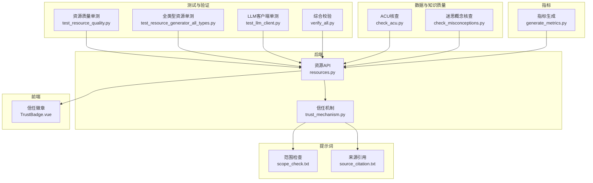
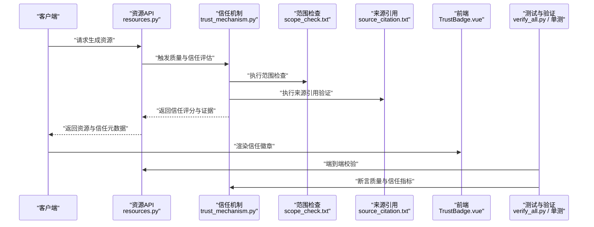
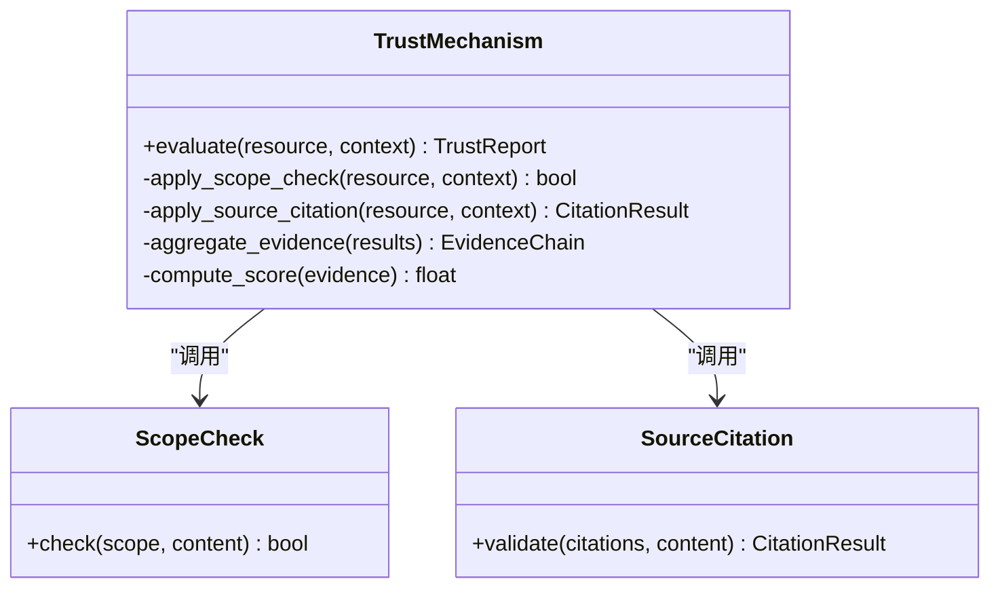
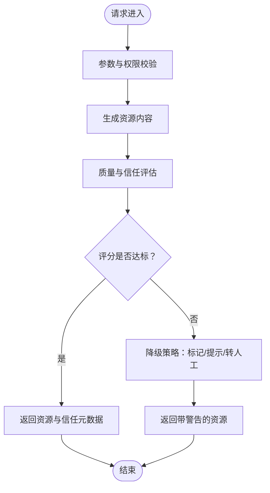
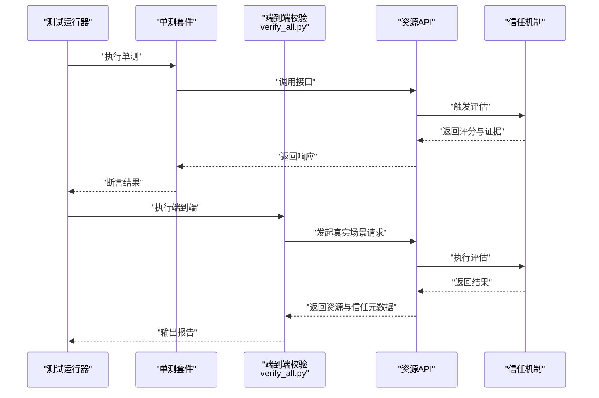
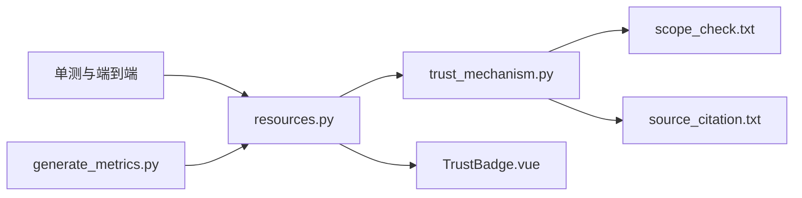

# 质量控制体系

<cite>
**本文引用的文件**   
- [src/loopse/core/trust_mechanism.py](file://src/loopse/core/trust_mechanism.py)
- [config/prompts/trust/scope_check.txt](file://config/prompts/trust/scope_check.txt)
- [config/prompts/trust/source_citation.txt](file://config/prompts/trust/source_citation.txt)
- [tests/unit/test_resource_quality.py](file://tests/unit/test_resource_quality.py)
- [tests/unit/test_resource_generator_all_types.py](file://tests/unit/test_resource_generator_all_types.py)
- [tests/unit/test_llm_client.py](file://tests/unit/test_llm_client.py)
- [scripts/check_acu.py](file://scripts/check_acu.py)
- [scripts/check_misconceptions.py](file://scripts/check_misconceptions.py)
- [scripts/verify_all.py](file://scripts/verify_all.py)
- [generate_metrics.py](file://generate_metrics.py)
- [src/loopse/api/resources.py](file://src/loopse/api/resources.py)
- [frontend/src/components/resources/TrustBadge.vue](file://frontend/src/components/resources/TrustBadge.vue)
</cite>

## 目录
1. [引言](#引言)
2. [项目结构](#项目结构)
3. [核心组件](#核心组件)
4. [架构总览](#架构总览)
5. [详细组件分析](#详细组件分析)
6. [依赖关系分析](#依赖关系分析)
7. [性能考量](#性能考量)
8. [故障排查指南](#故障排查指南)
9. [结论](#结论)
10. [附录](#附录)

## 引言
本文件面向Socrates-Cube项目的“资源质量控制体系”，围绕生成内容的质量评估指标、准确性验证与一致性检查、信任机制实现、来源引用验证与可信度评分、人工审核流程与反馈收集、内容安全过滤与版权合规、质量阈值配置、自动化测试与持续监控，以及用户反馈机制与迭代优化策略进行系统化说明。文档以仓库现有实现为依据，结合提示词模板、单元测试与脚本工具，给出可落地的工程化方案与可视化图示，帮助读者快速理解并扩展该体系。

## 项目结构
从仓库视角看，质量控制相关能力分布在以下层次：
- 后端核心：信任机制与API层（trust_mechanism.py、resources.py）
- 提示词模板：信任域范围检查与来源引用（scope_check.txt、source_citation.txt）
- 前端展示：信任徽章（TrustBadge.vue）
- 测试与验证：资源质量单测、全类型资源单测、LLM客户端单测、综合校验脚本（test_resource_quality.py、test_resource_generator_all_types.py、test_llm_client.py、verify_all.py）
- 数据与知识质量：ACU与迷思概念核查脚本（check_acu.py、check_misconceptions.py）
- 指标与度量：指标生成脚本（generate_metrics.py）

图表来源
- [src/loopse/api/resources.py](file://src/loopse/api/resources.py)
- [src/loopse/core/trust_mechanism.py](file://src/loopse/core/trust_mechanism.py)
- [config/prompts/trust/scope_check.txt](file://config/prompts/trust/scope_check.txt)
- [config/prompts/trust/source_citation.txt](file://config/prompts/trust/source_citation.txt)
- [frontend/src/components/resources/TrustBadge.vue](file://frontend/src/components/resources/TrustBadge.vue)
- [tests/unit/test_resource_quality.py](file://tests/unit/test_resource_quality.py)
- [tests/unit/test_resource_generator_all_types.py](file://tests/unit/test_resource_generator_all_types.py)
- [tests/unit/test_llm_client.py](file://tests/unit/test_llm_client.py)
- [scripts/verify_all.py](file://scripts/verify_all.py)
- [scripts/check_acu.py](file://scripts/check_acu.py)
- [scripts/check_misconceptions.py](file://scripts/check_misconceptions.py)
- [generate_metrics.py](file://generate_metrics.py)

章节来源
- [src/loopse/api/resources.py](file://src/loopse/api/resources.py)
- [src/loopse/core/trust_mechanism.py](file://src/loopse/core/trust_mechanism.py)
- [config/prompts/trust/scope_check.txt](file://config/prompts/trust/scope_check.txt)
- [config/prompts/trust/source_citation.txt](file://config/prompts/trust/source_citation.txt)
- [frontend/src/components/resources/TrustBadge.vue](file://frontend/src/components/resources/TrustBadge.vue)
- [tests/unit/test_resource_quality.py](file://tests/unit/test_resource_quality.py)
- [tests/unit/test_resource_generator_all_types.py](file://tests/unit/test_resource_generator_all_types.py)
- [tests/unit/test_llm_client.py](file://tests/unit/test_llm_client.py)
- [scripts/verify_all.py](file://scripts/verify_all.py)
- [scripts/check_acu.py](file://scripts/check_acu.py)
- [scripts/check_misconceptions.py](file://scripts/check_misconceptions.py)
- [generate_metrics.py](file://generate_metrics.py)

## 核心组件
- 信任机制（trust_mechanism.py）
  - 负责将“范围检查”和“来源引用”等信任维度整合为统一的信任评分与证据链，供上层API与前端展示使用。
  - 典型职责包括：调用范围检查与来源引用提示词模板、聚合多源证据、计算可信度分数、输出结构化信任报告。
- 资源API（resources.py）
  - 作为资源生成与质量控制的入口，串联资源生成、质量评估、信任评分与返回结果；同时暴露用于审计与监控的元数据字段。
- 提示词模板（scope_check.txt、source_citation.txt）
  - 提供标准化的信任约束与引用格式，确保生成内容在范围与引用上具备可验证性。
- 前端信任徽章（TrustBadge.vue）
  - 将信任评分与关键证据摘要以可视化方式呈现给用户，增强透明度与可解释性。
- 测试与验证
  - 资源质量单测（test_resource_quality.py）覆盖质量指标断言与边界条件。
  - 全类型资源单测（test_resource_generator_all_types.py）保障不同资源类型的稳定性与一致性。
  - LLM客户端单测（test_llm_client.py）保证外部模型调用的健壮性与错误处理。
  - 综合校验（verify_all.py）执行端到端的质量与信任链路验证。
- 数据与知识质量
  - ACU核查（check_acu.py）、迷思概念核查（check_misconceptions.py）对知识库与学习材料进行一致性、正确性校验。
- 指标与度量
  - 指标生成（generate_metrics.py）汇总质量与信任相关指标，支持持续监控与阈值告警。

章节来源
- [src/loopse/core/trust_mechanism.py](file://src/loopse/core/trust_mechanism.py)
- [src/loopse/api/resources.py](file://src/loopse/api/resources.py)
- [config/prompts/trust/scope_check.txt](file://config/prompts/trust/scope_check.txt)
- [config/prompts/trust/source_citation.txt](file://config/prompts/trust/source_citation.txt)
- [frontend/src/components/resources/TrustBadge.vue](file://frontend/src/components/resources/TrustBadge.vue)
- [tests/unit/test_resource_quality.py](file://tests/unit/test_resource_quality.py)
- [tests/unit/test_resource_generator_all_types.py](file://tests/unit/test_resource_generator_all_types.py)
- [tests/unit/test_llm_client.py](file://tests/unit/test_llm_client.py)
- [scripts/verify_all.py](file://scripts/verify_all.py)
- [scripts/check_acu.py](file://scripts/check_acu.py)
- [scripts/check_misconceptions.py](file://scripts/check_misconceptions.py)
- [generate_metrics.py](file://generate_metrics.py)

## 架构总览
下图展示了资源生成到质量与信任评估的整体流程，涵盖API层、信任机制、提示词模板、前端展示与测试验证闭环。

图表来源
- [src/loopse/api/resources.py](file://src/loopse/api/resources.py)
- [src/loopse/core/trust_mechanism.py](file://src/loopse/core/trust_mechanism.py)
- [config/prompts/trust/scope_check.txt](file://config/prompts/trust/scope_check.txt)
- [config/prompts/trust/source_citation.txt](file://config/prompts/trust/source_citation.txt)
- [frontend/src/components/resources/TrustBadge.vue](file://frontend/src/components/resources/TrustBadge.vue)
- [scripts/verify_all.py](file://scripts/verify_all.py)

## 详细组件分析

### 信任机制（trust_mechanism.py）
- 设计要点
  - 将“范围检查”和“来源引用”两类信任维度统一建模，形成可量化的信任评分与证据清单。
  - 通过提示词模板驱动的可验证约束，提升生成内容的可追溯性与一致性。
- 关键流程
  - 输入：待评估的资源内容与上下文信息。
  - 处理：调用范围检查与来源引用模板，解析结果并聚合证据。
  - 输出：信任评分、证据摘要、失败原因与修复建议。
- 复杂度与性能
  - 主要开销来自提示词模板的解析与外部模型调用；可通过缓存与批处理优化。
- 错误处理
  - 对模板缺失、解析失败、外部服务异常进行兜底与降级，保证API可用性。

图表来源
- [src/loopse/core/trust_mechanism.py](file://src/loopse/core/trust_mechanism.py)
- [config/prompts/trust/scope_check.txt](file://config/prompts/trust/scope_check.txt)
- [config/prompts/trust/source_citation.txt](file://config/prompts/trust/source_citation.txt)

章节来源
- [src/loopse/core/trust_mechanism.py](file://src/loopse/core/trust_mechanism.py)
- [config/prompts/trust/scope_check.txt](file://config/prompts/trust/scope_check.txt)
- [config/prompts/trust/source_citation.txt](file://config/prompts/trust/source_citation.txt)

### 资源API（resources.py）
- 职责
  - 接收资源生成请求，编排质量评估与信任评分，返回包含资源内容与信任元数据的响应。
  - 暴露审计字段（如评分、证据摘要、版本信息），便于前端展示与后续分析。
- 集成点
  - 与信任机制紧密耦合，同时与前端信任徽章对接，形成“生成—评估—展示”的闭环。
- 错误与降级
  - 当信任评估失败或评分低于阈值时，返回警告与降级策略（如标记不可用或提示人工审核）。

图表来源
- [src/loopse/api/resources.py](file://src/loopse/api/resources.py)
- [src/loopse/core/trust_mechanism.py](file://src/loopse/core/trust_mechanism.py)

章节来源
- [src/loopse/api/resources.py](file://src/loopse/api/resources.py)

### 前端信任徽章（TrustBadge.vue）
- 功能
  - 展示信任评分、关键证据摘要与风险提示，帮助用户判断资源可信度。
- 交互
  - 点击可展开详细证据链，支持一键反馈与问题上报。
- 数据来源
  - 从API返回的信任元数据中读取，确保前后端一致。

章节来源
- [frontend/src/components/resources/TrustBadge.vue](file://frontend/src/components/resources/TrustBadge.vue)

### 测试与验证（单测与端到端）
- 资源质量单测（test_resource_quality.py）
  - 覆盖质量指标断言（如完整性、一致性、准确性）与边界条件。
- 全类型资源单测（test_resource_generator_all_types.py）
  - 针对多种资源类型进行回归测试，确保生成逻辑稳定。
- LLM客户端单测（test_llm_client.py）
  - 验证外部模型调用的错误处理、重试与超时策略。
- 端到端校验（verify_all.py）
  - 串联API与信任机制，执行完整的质量与信任链路验证。

图表来源
- [tests/unit/test_resource_quality.py](file://tests/unit/test_resource_quality.py)
- [tests/unit/test_resource_generator_all_types.py](file://tests/unit/test_resource_generator_all_types.py)
- [tests/unit/test_llm_client.py](file://tests/unit/test_llm_client.py)
- [scripts/verify_all.py](file://scripts/verify_all.py)
- [src/loopse/api/resources.py](file://src/loopse/api/resources.py)
- [src/loopse/core/trust_mechanism.py](file://src/loopse/core/trust_mechanism.py)

章节来源
- [tests/unit/test_resource_quality.py](file://tests/unit/test_resource_quality.py)
- [tests/unit/test_resource_generator_all_types.py](file://tests/unit/test_resource_generator_all_types.py)
- [tests/unit/test_llm_client.py](file://tests/unit/test_llm_client.py)
- [scripts/verify_all.py](file://scripts/verify_all.py)

### 数据与知识质量（ACU与迷思概念）
- ACU核查（check_acu.py）
  - 对知识单元的一致性、准确性进行批量检查，发现冲突与缺失。
- 迷思概念核查（check_misconceptions.py）
  - 识别潜在的错误认知与误导信息，辅助内容修正与教学干预。

章节来源
- [scripts/check_acu.py](file://scripts/check_acu.py)
- [scripts/check_misconceptions.py](file://scripts/check_misconceptions.py)

### 指标与度量（generate_metrics.py）
- 作用
  - 汇总质量与信任相关指标，生成报表与趋势图，支撑持续监控与阈值告警。
- 指标示例
  - 资源准确率、一致性得分、引用覆盖率、信任评分分布、失败率与恢复时间。

章节来源
- [generate_metrics.py](file://generate_metrics.py)

## 依赖关系分析
- 模块耦合
  - resources.py依赖trust_mechanism.py完成质量与信任评估。
  - trust_mechanism.py依赖scope_check.txt与source_citation.txt提供标准化约束。
  - 前端TrustBadge.vue依赖API返回的信任元数据进行展示。
- 外部依赖
  - LLM客户端（由单测覆盖）用于提示词模板的执行与结果解析。
- 潜在风险
  - 模板变更可能导致评估逻辑不稳定，需配合单测与端到端校验进行回归。
  - 外部模型服务的可用性与延迟会影响整体吞吐与用户体验。

图表来源
- [src/loopse/api/resources.py](file://src/loopse/api/resources.py)
- [src/loopse/core/trust_mechanism.py](file://src/loopse/core/trust_mechanism.py)
- [config/prompts/trust/scope_check.txt](file://config/prompts/trust/scope_check.txt)
- [config/prompts/trust/source_citation.txt](file://config/prompts/trust/source_citation.txt)
- [frontend/src/components/resources/TrustBadge.vue](file://frontend/src/components/resources/TrustBadge.vue)
- [tests/unit/test_resource_quality.py](file://tests/unit/test_resource_quality.py)
- [tests/unit/test_resource_generator_all_types.py](file://tests/unit/test_resource_generator_all_types.py)
- [tests/unit/test_llm_client.py](file://tests/unit/test_llm_client.py)
- [scripts/verify_all.py](file://scripts/verify_all.py)
- [generate_metrics.py](file://generate_metrics.py)

章节来源
- [src/loopse/api/resources.py](file://src/loopse/api/resources.py)
- [src/loopse/core/trust_mechanism.py](file://src/loopse/core/trust_mechanism.py)
- [config/prompts/trust/scope_check.txt](file://config/prompts/trust/scope_check.txt)
- [config/prompts/trust/source_citation.txt](file://config/prompts/trust/source_citation.txt)
- [frontend/src/components/resources/TrustBadge.vue](file://frontend/src/components/resources/TrustBadge.vue)
- [tests/unit/test_resource_quality.py](file://tests/unit/test_resource_quality.py)
- [tests/unit/test_resource_generator_all_types.py](file://tests/unit/test_resource_generator_all_types.py)
- [tests/unit/test_llm_client.py](file://tests/unit/test_llm_client.py)
- [scripts/verify_all.py](file://scripts/verify_all.py)
- [generate_metrics.py](file://generate_metrics.py)

## 性能考量
- 评估流水线优化
  - 对提示词模板解析与外部模型调用进行缓存与批处理，降低重复计算与网络开销。
- 异步与并发
  - 在资源生成与评估阶段采用异步任务队列，提高吞吐与响应速度。
- 降级与熔断
  - 当外部服务异常或评分过低时，启用降级策略（如仅返回基础资源与警告），保障可用性。
- 监控与告警
  - 基于generate_metrics.py输出的指标建立阈值告警，及时发现性能退化与质量问题。

[本节为通用指导，不直接分析具体文件]

## 故障排查指南
- 常见问题定位
  - 信任评分偏低：检查范围检查与来源引用模板是否正确加载与解析。
  - 引用不完整：核对来源引用验证逻辑与证据链聚合过程。
  - 外部模型异常：查看LLM客户端单测覆盖的错误路径与重试策略。
- 调试步骤
  - 使用端到端校验（verify_all.py）复现问题，定位API与信任机制的交互点。
  - 检查单测断言失败的具体指标，缩小问题范围。
  - 查看指标报表（generate_metrics.py）的趋势变化，确认是否为系统性退化。
- 恢复措施
  - 回滚模板或配置变更，重新执行测试与校验。
  - 启用降级策略，优先保障基本功能可用。

章节来源
- [tests/unit/test_llm_client.py](file://tests/unit/test_llm_client.py)
- [scripts/verify_all.py](file://scripts/verify_all.py)
- [generate_metrics.py](file://generate_metrics.py)

## 结论
本质量控制体系以信任机制为核心，结合范围检查与来源引用模板，构建了可量化、可追溯、可展示的质量与可信度评估闭环。通过完善的单测与端到端校验、数据与知识质量核查、指标与度量输出，形成了从生成到展示、从测试到监控的完整链路。建议在后续迭代中持续优化提示词模板、引入更丰富的质量指标与自动化阈值告警，并完善用户反馈与人工审核流程，以提升整体质量与用户体验。

[本节为总结性内容，不直接分析具体文件]

## 附录
- 质量评估指标建议
  - 准确性：与权威来源对比的正确率。
  - 一致性：跨资源与跨时间的语义一致性。
  - 完整性：必要信息与结构的完备程度。
  - 引用覆盖率：有效来源引用占比。
  - 信任评分：综合各维度的加权得分。
- 人工审核流程建议
  - 低分资源自动转入人工审核队列。
  - 审核结果反馈至信任机制，更新评分与证据链。
- 用户反馈机制
  - 在前端信任徽章中嵌入反馈入口，收集问题与建议。
  - 将反馈数据纳入指标报表，驱动迭代优化。
- 持续改进循环
  - 定期复盘指标与反馈，调整模板与阈值。
  - 引入A/B测试验证改进效果。

[本节为概念性内容，不直接分析具体文件]