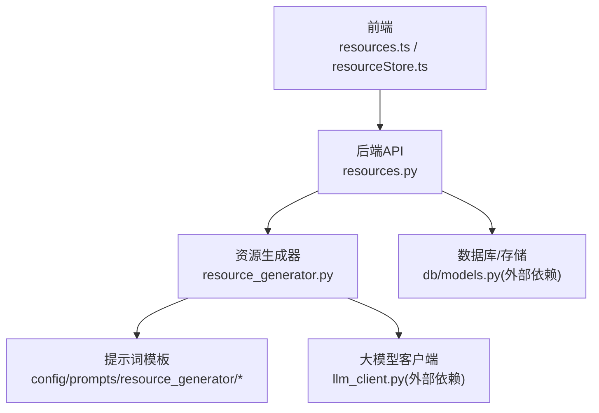
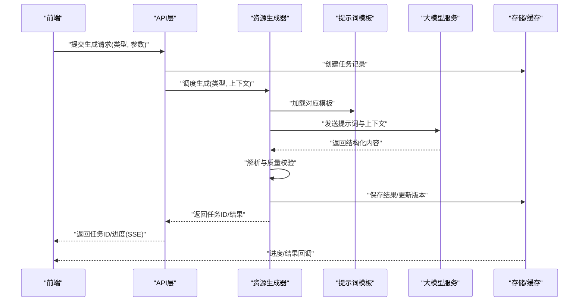
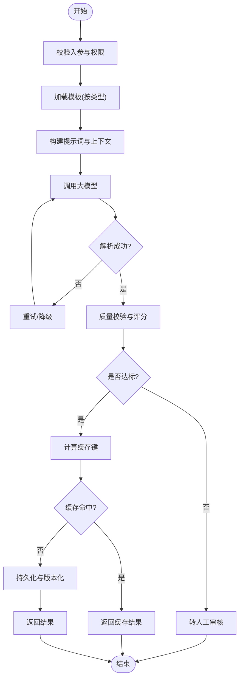
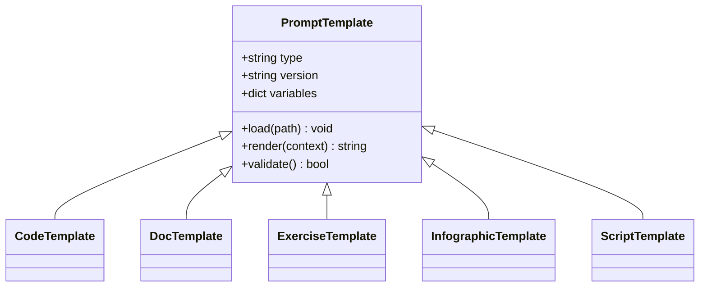
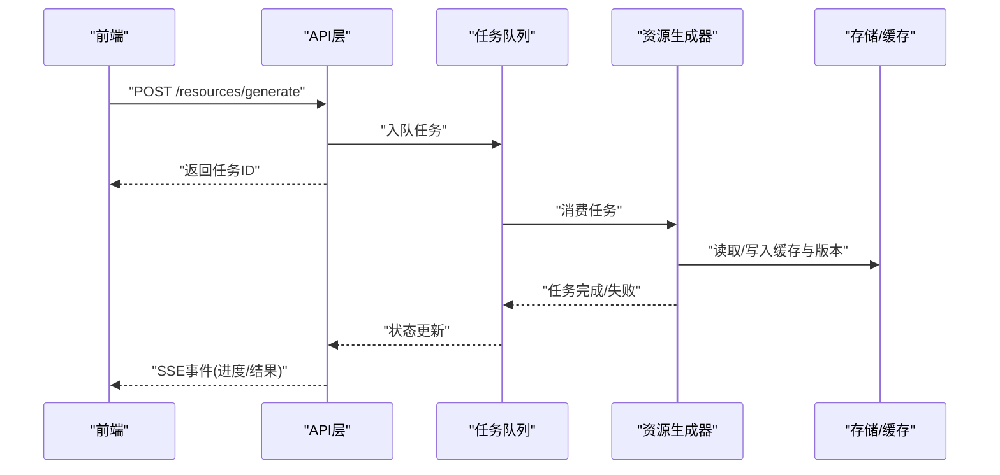
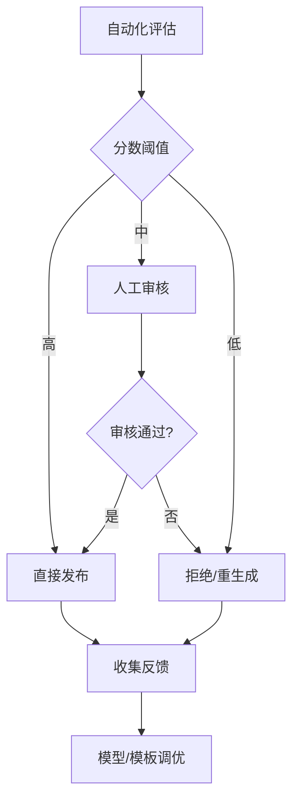
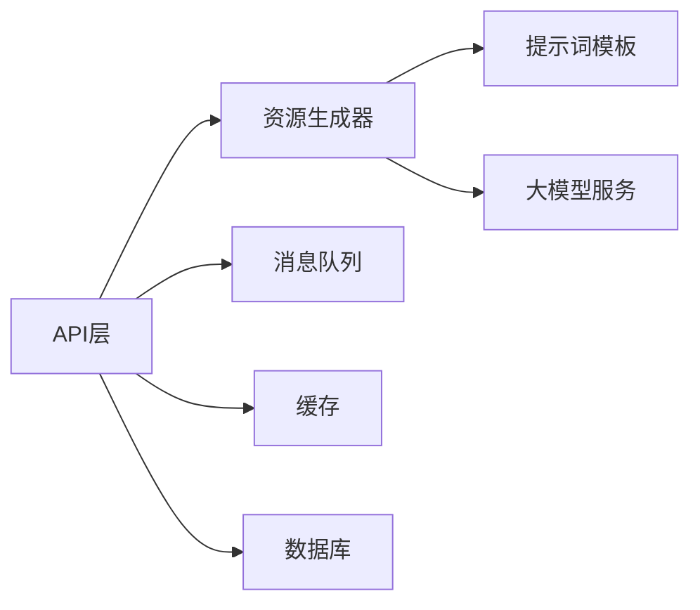

# 资源生成引擎

<cite>
**本文引用的文件**   
- [src/loopse/agent/resource_generator.py](file://src/loopse/agent/resource_generator.py)
- [config/prompts/resource_generator/generate_code.txt](file://config/prompts/resource_generator/generate_code.txt)
- [config/prompts/resource_generator/generate_doc.txt](file://config/prompts/resource_generator/generate_doc.txt)
- [config/prompts/resource_generator/generate_exercise.txt](file://config/prompts/resource_generator/generate_exercise.txt)
- [config/prompts/resource_generator/generate_infographic.txt](file://config/prompts/resource_generator/generate_infographic.txt)
- [config/prompts/resource_generator/generate_script.txt](file://config/prompts/resource_generator/generate_script.txt)
- [src/loopse/api/resources.py](file://src/loopse/api/resources.py)
- [frontend/src/api/resources.ts](file://frontend/src/api/resources.ts)
- [frontend/src/stores/resourceStore.ts](file://frontend/src/stores/resourceStore.ts)
- [tests/unit/test_resource_generator.py](file://tests/unit/test_resource_generator.py)
- [tests/unit/test_resource_generator_all_types.py](file://tests/unit/test_resource_generator_all_types.py)
- [tests/unit/test_resource_quality.py](file://tests/unit/test_resource_quality.py)
</cite>

## 目录
1. [简介](#简介)
2. [项目结构](#项目结构)
3. [核心组件](#核心组件)
4. [架构总览](#架构总览)
5. [详细组件分析](#详细组件分析)
6. [依赖关系分析](#依赖关系分析)
7. [性能与缓存](#性能与缓存)
8. [故障排查指南](#故障排查指南)
9. [结论](#结论)
10. [附录：扩展与集成指南](#附录扩展与集成指南)

## 简介
本文件面向“资源生成引擎”的完整文档，覆盖多类型教学资源（代码、文档、练习、信息图、脚本）的自动生成机制；模板系统与提示词工程；内容质量控制流程；版本管理、缓存策略与批量生成优化；质量评估指标、人工审核与反馈学习机制；新资源类型的扩展方法与自定义模板开发；以及外部工具与服务集成方案。目标是帮助开发者快速理解并高效使用或扩展该引擎。

## 项目结构
围绕资源生成引擎的关键位置如下：
- 后端生成器：位于 agents 层，负责编排不同资源类型的生成流程
- 提示词模板：位于 config/prompts/resource_generator 下，按资源类型拆分
- API 接口：提供资源生成的 HTTP 入口
- 前端交互：API 调用、进度展示与结果渲染
- 测试用例：覆盖功能、全类型与质量评估

图表来源
- [src/loopse/api/resources.py](file://src/loopse/api/resources.py)
- [src/loopse/agent/resource_generator.py](file://src/loopse/agent/resource_generator.py)
- [config/prompts/resource_generator/generate_code.txt](file://config/prompts/resource_generator/generate_code.txt)
- [config/prompts/resource_generator/generate_doc.txt](file://config/prompts/resource_generator/generate_doc.txt)
- [config/prompts/resource_generator/generate_exercise.txt](file://config/prompts/resource_generator/generate_exercise.txt)
- [config/prompts/resource_generator/generate_infographic.txt](file://config/prompts/resource_generator/generate_infographic.txt)
- [config/prompts/resource_generator/generate_script.txt](file://config/prompts/resource_generator/generate_script.txt)
- [frontend/src/api/resources.ts](file://frontend/src/api/resources.ts)
- [frontend/src/stores/resourceStore.ts](file://frontend/src/stores/resourceStore.ts)

章节来源
- [src/loopse/api/resources.py](file://src/loopse/api/resources.py)
- [src/loopse/agent/resource_generator.py](file://src/loopse/agent/resource_generator.py)
- [frontend/src/api/resources.ts](file://frontend/src/api/resources.ts)
- [frontend/src/stores/resourceStore.ts](file://frontend/src/stores/resourceStore.ts)

## 核心组件
- 资源生成器（Resource Generator）
  - 职责：接收生成请求，解析资源类型，加载对应提示词模板，组装上下文，调用LLM，解析返回，持久化与缓存，输出标准化结果
  - 关键点：类型路由、模板装配、结构化输出校验、错误恢复与重试
- 提示词模板系统
  - 职责：为每种资源类型维护独立模板，支持变量注入与约束声明，便于迭代与A/B测试
  - 关键点：模板路径约定、占位符规范、安全过滤、版本化
- API 层
  - 职责：暴露资源生成接口，参数校验、鉴权、限流、任务状态跟踪、SSE/轮询进度
- 前端资源模块
  - 职责：发起生成请求、展示进度、渲染不同类型卡片、触发人工审核与反馈

章节来源
- [src/loopse/agent/resource_generator.py](file://src/loopse/agent/resource_generator.py)
- [config/prompts/resource_generator/generate_code.txt](file://config/prompts/resource_generator/generate_code.txt)
- [config/prompts/resource_generator/generate_doc.txt](file://config/prompts/resource_generator/generate_doc.txt)
- [config/prompts/resource_generator/generate_exercise.txt](file://config/prompts/resource_generator/generate_exercise.txt)
- [config/prompts/resource_generator/generate_infographic.txt](file://config/prompts/resource_generator/generate_infographic.txt)
- [config/prompts/resource_generator/generate_script.txt](file://config/prompts/resource_generator/generate_script.txt)
- [src/loopse/api/resources.py](file://src/loopse/api/resources.py)
- [frontend/src/api/resources.ts](file://frontend/src/api/resources.ts)
- [frontend/src/stores/resourceStore.ts](file://frontend/src/stores/resourceStore.ts)

## 架构总览
资源生成端到端流程：
- 前端通过 REST/SSE 发起生成请求
- API 层进行参数校验与权限控制，落库创建任务记录
- 生成器根据资源类型选择模板，构造提示词，调用LLM
- 对LLM返回进行结构化解析与质量检查，失败则重试或降级
- 将结果写入存储，更新任务状态，向前端推送进度与结果

图表来源
- [src/loopse/api/resources.py](file://src/loopse/api/resources.py)
- [src/loopse/agent/resource_generator.py](file://src/loopse/agent/resource_generator.py)
- [config/prompts/resource_generator/generate_code.txt](file://config/prompts/resource_generator/generate_code.txt)
- [config/prompts/resource_generator/generate_doc.txt](file://config/prompts/resource_generator/generate_doc.txt)
- [config/prompts/resource_generator/generate_exercise.txt](file://config/prompts/resource_generator/generate_exercise.txt)
- [config/prompts/resource_generator/generate_infographic.txt](file://config/prompts/resource_generator/generate_infographic.txt)
- [config/prompts/resource_generator/generate_script.txt](file://config/prompts/resource_generator/generate_script.txt)
- [frontend/src/api/resources.ts](file://frontend/src/api/resources.ts)
- [frontend/src/stores/resourceStore.ts](file://frontend/src/stores/resourceStore.ts)

## 详细组件分析

### 资源生成器（Resource Generator）
- 设计要点
  - 类型路由：根据资源类型选择模板与后处理逻辑
  - 模板装配：将用户输入、知识片段、风格约束等注入模板
  - 结构化输出：要求LLM返回JSON或固定格式，便于解析
  - 容错与重试：网络异常、超时、格式错误时的重试与降级策略
  - 版本管理：每次生成产出带版本号，支持回滚与对比
  - 缓存键：基于输入指纹与模板版本计算，命中直接返回
- 关键流程
  - 入参校验 -> 模板加载 -> 提示词构建 -> LLM调用 -> 解析校验 -> 缓存/持久化 -> 返回

图表来源
- [src/loopse/agent/resource_generator.py](file://src/loopse/agent/resource_generator.py)
- [config/prompts/resource_generator/generate_code.txt](file://config/prompts/resource_generator/generate_code.txt)
- [config/prompts/resource_generator/generate_doc.txt](file://config/prompts/resource_generator/generate_doc.txt)
- [config/prompts/resource_generator/generate_exercise.txt](file://config/prompts/resource_generator/generate_exercise.txt)
- [config/prompts/resource_generator/generate_infographic.txt](file://config/prompts/resource_generator/generate_infographic.txt)
- [config/prompts/resource_generator/generate_script.txt](file://config/prompts/resource_generator/generate_script.txt)

章节来源
- [src/loopse/agent/resource_generator.py](file://src/loopse/agent/resource_generator.py)

### 提示词模板系统
- 模板组织
  - 按资源类型分文件存放，便于独立迭代与灰度发布
  - 命名规范：generate_<type>.txt
- 模板变量
  - 主题/知识点、难度、受众、示例、输出格式、约束条件
- 版本控制
  - 模板文件哈希作为版本标识，变更自动升级缓存键
- 安全与合规
  - 敏感词过滤、引用标注、版权约束

图表来源
- [config/prompts/resource_generator/generate_code.txt](file://config/prompts/resource_generator/generate_code.txt)
- [config/prompts/resource_generator/generate_doc.txt](file://config/prompts/resource_generator/generate_doc.txt)
- [config/prompts/resource_generator/generate_exercise.txt](file://config/prompts/resource_generator/generate_exercise.txt)
- [config/prompts/resource_generator/generate_infographic.txt](file://config/prompts/resource_generator/generate_infographic.txt)
- [config/prompts/resource_generator/generate_script.txt](file://config/prompts/resource_generator/generate_script.txt)

章节来源
- [config/prompts/resource_generator/generate_code.txt](file://config/prompts/resource_generator/generate_code.txt)
- [config/prompts/resource_generator/generate_doc.txt](file://config/prompts/resource_generator/generate_doc.txt)
- [config/prompts/resource_generator/generate_exercise.txt](file://config/prompts/resource_generator/generate_exercise.txt)
- [config/prompts/resource_generator/generate_infographic.txt](file://config/prompts/resource_generator/generate_infographic.txt)
- [config/prompts/resource_generator/generate_script.txt](file://config/prompts/resource_generator/generate_script.txt)

### API 层与前端集成
- API 职责
  - 参数校验、鉴权、限流
  - 任务生命周期管理（创建、执行、完成、失败）
  - SSE/轮询进度推送
  - 批量生成接口（队列化、并发控制）
- 前端职责
  - 调用API、显示进度条、渲染不同类型卡片
  - 触发人工审核与反馈收集

图表来源
- [src/loopse/api/resources.py](file://src/loopse/api/resources.py)
- [frontend/src/api/resources.ts](file://frontend/src/api/resources.ts)
- [frontend/src/stores/resourceStore.ts](file://frontend/src/stores/resourceStore.ts)

章节来源
- [src/loopse/api/resources.py](file://src/loopse/api/resources.py)
- [frontend/src/api/resources.ts](file://frontend/src/api/resources.ts)
- [frontend/src/stores/resourceStore.ts](file://frontend/src/stores/resourceStore.ts)

### 质量评估与人工审核
- 自动化质量指标
  - 相关性、准确性、完整性、可读性、安全性、可执行性（针对代码）
  - 规则校验：必填字段、长度限制、格式约束
- 人工审核流程
  - 低分或高风险内容进入审核队列
  - 审核通过后发布，否则打回修改或重新生成
- 反馈学习
  - 收集用户点赞/踩、纠错、停留时长等行为信号
  - 用于模板微调、权重调整与推荐排序

章节来源
- [tests/unit/test_resource_quality.py](file://tests/unit/test_resource_quality.py)

## 依赖关系分析
- 内部依赖
  - API 层依赖资源生成器
  - 资源生成器依赖提示词模板与LLM客户端
  - 前后端通过REST/SSE通信
- 外部依赖
  - 大模型服务（文本/图像/视频等）
  - 向量检索/知识库（可选增强）
  - 对象存储（图片/媒体资源）
  - 消息队列（批量任务）

图表来源
- [src/loopse/api/resources.py](file://src/loopse/api/resources.py)
- [src/loopse/agent/resource_generator.py](file://src/loopse/agent/resource_generator.py)

章节来源
- [src/loopse/api/resources.py](file://src/loopse/api/resources.py)
- [src/loopse/agent/resource_generator.py](file://src/loopse/agent/resource_generator.py)

## 性能与缓存
- 缓存策略
  - 键设计：输入指纹 + 模板版本 + 模型参数
  - 粒度：按资源条目缓存，避免重复生成
  - 失效：模板版本变更、模型参数变化时自动失效
- 批量生成优化
  - 任务队列化、并发上限控制、退避重试
  - 优先级与配额管理，防止热点资源耗尽
- 前端体验
  - SSE实时进度、断线重连、分页加载
  - 本地缓存最近结果，减少重复请求

章节来源
- [src/loopse/api/resources.py](file://src/loopse/api/resources.py)
- [frontend/src/api/resources.ts](file://frontend/src/api/resources.ts)
- [frontend/src/stores/resourceStore.ts](file://frontend/src/stores/resourceStore.ts)

## 故障排查指南
- 常见问题
  - 模板缺失或变量未注入：检查模板路径与变量映射
  - LLM返回格式错误：增加解析容错与重试，必要时走人工审核
  - 缓存未命中：核对缓存键一致性（模板版本、参数）
  - 批量任务堆积：检查队列消费者数量与速率限制
- 定位手段
  - 查看任务日志与错误堆栈
  - 回放提示词与输入上下文
  - 对比不同模板版本的差异

章节来源
- [tests/unit/test_resource_generator.py](file://tests/unit/test_resource_generator.py)
- [tests/unit/test_resource_generator_all_types.py](file://tests/unit/test_resource_generator_all_types.py)

## 结论
资源生成引擎以“模板驱动+结构化输出+质量门禁”为核心，结合缓存与队列实现高性能与可扩展的多类型资源生成。通过持续的质量评估与反馈闭环，系统能够稳定演进并适配新的资源类型与外部能力。

## 附录：扩展与集成指南

### 新增资源类型
- 步骤
  - 在提示词目录新增 generate_<new_type>.txt
  - 在生成器中添加类型路由与后处理逻辑
  - 在前端添加对应卡片组件与渲染逻辑
  - 补充单元测试与质量评估规则
- 参考
  - 现有类型模板与测试用例

章节来源
- [config/prompts/resource_generator/generate_code.txt](file://config/prompts/resource_generator/generate_code.txt)
- [config/prompts/resource_generator/generate_doc.txt](file://config/prompts/resource_generator/generate_doc.txt)
- [config/prompts/resource_generator/generate_exercise.txt](file://config/prompts/resource_generator/generate_exercise.txt)
- [config/prompts/resource_generator/generate_infographic.txt](file://config/prompts/resource_generator/generate_infographic.txt)
- [config/prompts/resource_generator/generate_script.txt](file://config/prompts/resource_generator/generate_script.txt)
- [tests/unit/test_resource_generator_all_types.py](file://tests/unit/test_resource_generator_all_types.py)

### 自定义模板开发方法
- 建议
  - 明确输出Schema，强制结构化返回
  - 引入约束与示例，降低幻觉
  - 使用版本化与灰度发布，逐步放量
- 验证
  - 回归测试覆盖边界场景
  - A/B对比不同模板效果

章节来源
- [config/prompts/resource_generator/generate_code.txt](file://config/prompts/resource_generator/generate_code.txt)
- [config/prompts/resource_generator/generate_doc.txt](file://config/prompts/resource_generator/generate_doc.txt)
- [config/prompts/resource_generator/generate_exercise.txt](file://config/prompts/resource_generator/generate_exercise.txt)
- [config/prompts/resource_generator/generate_infographic.txt](file://config/prompts/resource_generator/generate_infographic.txt)
- [config/prompts/resource_generator/generate_script.txt](file://config/prompts/resource_generator/generate_script.txt)

### 集成外部工具与服务
- 典型集成点
  - 代码执行沙箱（运行与评测）
  - 图像/视频生成服务（信息图/脚本可视化）
  - 知识库检索（增强上下文）
  - 对象存储（媒体资源托管）
- 接入方式
  - 在生成器中封装适配器，统一错误与重试
  - 配置开关与降级策略，保障主链路稳定

章节来源
- [src/loopse/agent/resource_generator.py](file://src/loopse/agent/resource_generator.py)
- [src/loopse/api/resources.py](file://src/loopse/api/resources.py)