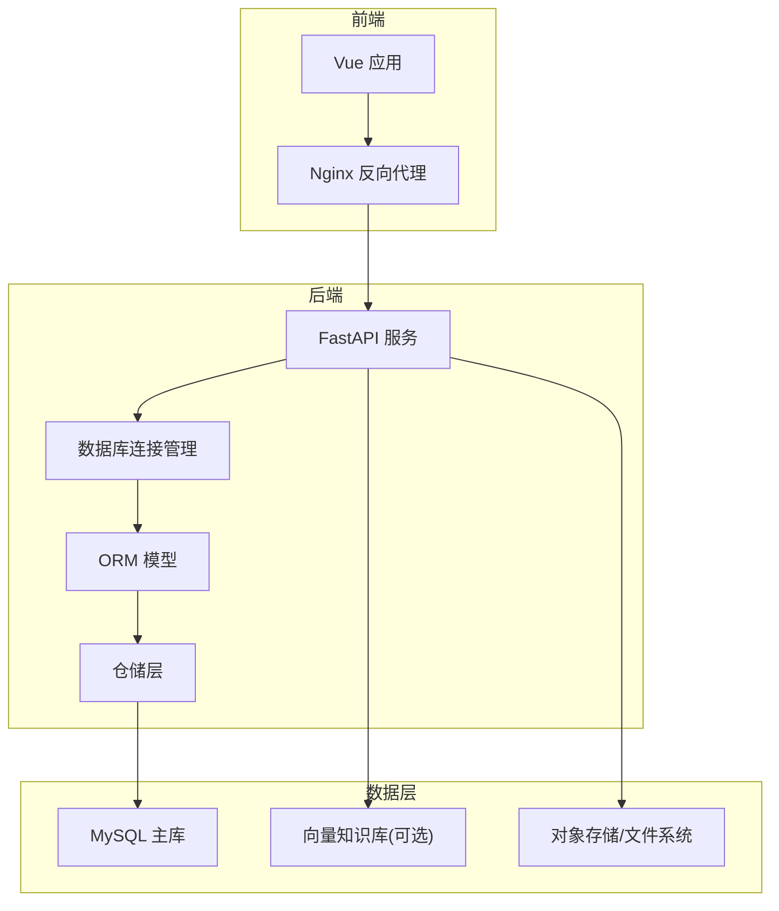
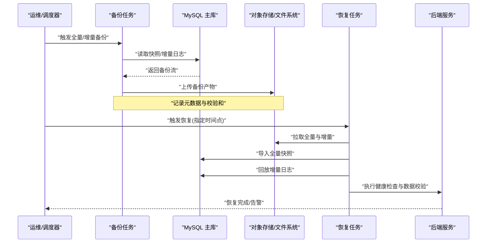
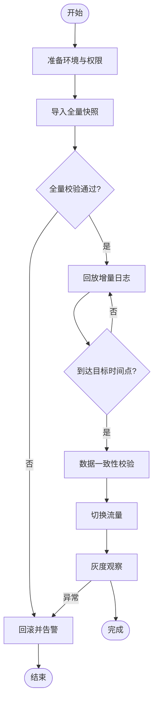

# 备份恢复与灾难恢复

<cite>
**本文引用的文件**   
- [src/loopse/db/connection.py](file://src/loopse/db/connection.py)
- [src/loopse/db/models.py](file://src/loopse/db/models.py)
- [src/loopse/db/repositories.py](file://src/loopse/db/repositories.py)
- [scripts/init_db.py](file://scripts/init_db.py)
- [scripts/init_mysql.py](file://scripts/init_mysql.py)
- [scripts/sync_cloud_db.py](file://scripts/sync_cloud_db.py)
- [start.sh](file://start.sh)
- [frontend/nginx.conf](file://frontend/nginx.conf)
- [pyproject.toml](file://pyproject.toml)
- [requirements.txt](file://requirements.txt)
</cite>

## 目录
1. [简介](#简介)
2. [项目结构](#项目结构)
3. [核心组件](#核心组件)
4. [架构总览](#架构总览)
5. [详细组件分析](#详细组件分析)
6. [依赖分析](#依赖分析)
7. [性能考虑](#性能考虑)
8. [故障排查指南](#故障排查指南)
9. [结论](#结论)
10. [附录](#附录)

## 简介
本操作手册面向Socrates-Cube系统的运维与研发人员，提供数据库备份策略、文件存储备份与增量备份配置、数据恢复流程、灾难恢复预案与业务连续性保障方案。文档同时给出自动化备份脚本建议、恢复演练流程以及RTO/RPO目标设定，并说明如何在云环境中实现高可用架构与跨区域容灾。

## 项目结构
本项目采用前后端分离架构：前端基于Vue构建并通过Nginx提供服务；后端Python服务通过API暴露能力，持久化层使用关系型数据库（MySQL）与向量知识库等组件。备份与恢复涉及的关键位置包括：
- 数据库连接与模型定义：位于后端db模块
- 初始化与同步脚本：位于scripts目录
- 启动脚本与反向代理配置：位于根目录与frontend目录
- 依赖与环境：pyproject.toml与requirements.txt

图表来源
- [frontend/nginx.conf](file://frontend/nginx.conf)
- [src/loopse/db/connection.py](file://src/loopse/db/connection.py)
- [src/loopse/db/models.py](file://src/loopse/db/models.py)
- [src/loopse/db/repositories.py](file://src/loopse/db/repositories.py)

章节来源
- [frontend/nginx.conf](file://frontend/nginx.conf)
- [src/loopse/db/connection.py](file://src/loopse/db/connection.py)
- [src/loopse/db/models.py](file://src/loopse/db/models.py)
- [src/loopse/db/repositories.py](file://src/loopse/db/repositories.py)

## 核心组件
- 数据库连接与事务：负责建立连接、会话生命周期与事务边界，是备份一致性的重要基础。
- ORM模型与仓储：定义表结构与访问逻辑，便于在恢复后快速校验数据完整性。
- 初始化与同步脚本：用于环境初始化、演示数据注入与云端数据库同步，可作为恢复流程的辅助工具。
- 启动脚本与反向代理：承载服务启动与流量入口，需纳入健康检查与自动重启策略。

章节来源
- [src/loopse/db/connection.py](file://src/loopse/db/connection.py)
- [src/loopse/db/models.py](file://src/loopse/db/models.py)
- [src/loopse/db/repositories.py](file://src/loopse/db/repositories.py)
- [scripts/init_db.py](file://scripts/init_db.py)
- [scripts/init_mysql.py](file://scripts/init_mysql.py)
- [scripts/sync_cloud_db.py](file://scripts/sync_cloud_db.py)
- [start.sh](file://start.sh)

## 架构总览
下图展示备份与恢复在系统中的关键交互点：备份侧从数据库导出快照与增量日志，将产物落盘至本地或对象存储；恢复侧按顺序导入全量与增量，完成数据重建与一致性校验。

图表来源
- [src/loopse/db/connection.py](file://src/loopse/db/connection.py)
- [scripts/init_db.py](file://scripts/init_db.py)
- [scripts/init_mysql.py](file://scripts/init_mysql.py)
- [scripts/sync_cloud_db.py](file://scripts/sync_cloud_db.py)

## 详细组件分析

### 数据库备份策略
- 全量备份
  - 频率：每日一次低峰期执行
  - 内容：完整数据库快照、二进制日志基线
  - 存储：本地磁盘+异地对象存储双副本
  - 校验：生成校验和并写入元数据
- 增量备份
  - 频率：每15分钟一次（可配置）
  - 内容：自上次备份以来的增量日志
  - 存储：同全量策略
  - 保留：按RPO要求保留最近N份增量
- 一致性保证
  - 使用事务与锁机制确保快照一致
  - 备份期间限制写放大操作
- 监控与告警
  - 备份成功/失败、大小、耗时、校验结果
  - 异常重试与人工介入通道

章节来源
- [src/loopse/db/connection.py](file://src/loopse/db/connection.py)
- [scripts/init_mysql.py](file://scripts/init_mysql.py)

### 文件存储备份与增量
- 静态资源与用户文件
  - 全量：每周一次
  - 增量：每日一次，仅变更文件
  - 去重与压缩：启用对象存储版本控制与压缩
- 日志与审计
  - 滚动归档：按天/大小切分
  - 保留周期：合规要求决定
- 索引与缓存
  - 向量索引：随数据重建或异步重建
  - 缓存：失效后按需重建

章节来源
- [frontend/nginx.conf](file://frontend/nginx.conf)
- [src/loopse/kb/vector_store.py](file://src/loopse/kb/vector_store.py)

### 增量备份配置要点
- 增量窗口：根据RPO设置
- 并发度：受限于I/O与网络带宽
- 断点续传：支持大文件与不稳定网络
- 幂等性：重复执行不产生副作用

章节来源
- [scripts/sync_cloud_db.py](file://scripts/sync_cloud_db.py)

### 数据恢复流程
- 准备阶段
  - 确认目标环境版本与依赖
  - 清理或隔离旧实例
- 全量恢复
  - 导入全量快照
  - 校验表结构与约束
- 增量回放
  - 按时间顺序回放增量日志
  - 达到目标时间点停止
- 验证与切换
  - 运行数据一致性校验
  - 切换流量到新实例
  - 灰度观察与回滚预案

图表来源
- [scripts/init_db.py](file://scripts/init_db.py)
- [scripts/init_mysql.py](file://scripts/init_mysql.py)
- [scripts/sync_cloud_db.py](file://scripts/sync_cloud_db.py)

### 灾难恢复预案
- 场景分类
  - 单节点故障：自动切换与健康检查
  - 机房级故障：跨可用区切换
  - 区域级故障：跨区域容灾
- 决策与执行
  - 自动检测与降级
  - 手动审批与一键切换
- 演练与复盘
  - 定期演练，记录RTO/RPO达成情况
  - 复盘改进预案与脚本

章节来源
- [start.sh](file://start.sh)

### 业务连续性保障方案
- 多活与读写分离
  - 读多写少场景下引入只读副本
  - 跨区部署降低单点风险
- 限流与熔断
  - 保护下游依赖与数据库
- 可观测性
  - 指标、日志、链路追踪
  - 告警阈值与通知渠道

章节来源
- [frontend/nginx.conf](file://frontend/nginx.conf)
- [start.sh](file://start.sh)

### 自动化备份脚本建议
- 全量备份脚本
  - 参数：目标路径、保留策略、校验开关
  - 输出：快照文件、元数据、校验和
- 增量备份脚本
  - 参数：增量窗口、并发度、断点续传
  - 输出：增量包、元数据、校验和
- 恢复脚本
  - 参数：目标时间点、源路径、校验开关
  - 步骤：全量导入→增量回放→校验→切换
- 编排与调度
  - 使用系统定时任务或作业平台
  - 失败重试与告警集成

章节来源
- [scripts/init_db.py](file://scripts/init_db.py)
- [scripts/init_mysql.py](file://scripts/init_mysql.py)
- [scripts/sync_cloud_db.py](file://scripts/sync_cloud_db.py)

### 恢复演练流程
- 演练计划
  - 频率：季度/半年度
  - 范围：全量+增量、端到端
- 演练步骤
  - 准备演练环境
  - 执行恢复脚本
  - 验证功能与数据
  - 记录RTO/RPO
- 复盘与优化
  - 识别瓶颈与风险
  - 更新预案与脚本

章节来源
- [scripts/init_db.py](file://scripts/init_db.py)
- [scripts/init_mysql.py](file://scripts/init_mysql.py)

### RTO/RPO目标设定
- RPO（恢复点目标）
  - 建议：≤15分钟（依据业务容忍度）
  - 影响：增量频率与保留策略
- RTO（恢复时间目标）
  - 建议：≤30分钟（含切换与验证）
  - 影响：预冷、并行度、自动化程度
- 目标达成度量
  - 演练报告与趋势分析
  - 持续改进闭环

章节来源
- [scripts/sync_cloud_db.py](file://scripts/sync_cloud_db.py)

### 云环境高可用与跨区域容灾
- 高可用架构
  - 多可用区部署
  - 负载均衡与健康检查
  - 无状态服务水平扩展
- 跨区域容灾
  - 主备/双活模式
  - 数据复制与冲突解决
  - DNS/全局负载均衡切换
- 安全与合规
  - 传输与静态加密
  - 访问最小权限
  - 审计与留痕

章节来源
- [frontend/nginx.conf](file://frontend/nginx.conf)
- [start.sh](file://start.sh)

## 依赖分析
- 运行时依赖
  - Python包与系统库：由依赖清单管理
- 外部服务
  - MySQL主库与只读副本
  - 对象存储（本地或云）
  - 向量知识库（可选）
- 配置与环境
  - 环境变量与配置文件集中管理
  - 密钥与证书安全管理

章节来源
- [pyproject.toml](file://pyproject.toml)
- [requirements.txt](file://requirements.txt)

## 性能考虑
- 备份窗口与吞吐
  - 调整并发与批大小
  - 利用SSD与高速网络
- 恢复速度
  - 预分配空间与禁用不必要索引
  - 批量导入与事务合并
- 资源隔离
  - 独立备份节点与队列
  - 限流与优先级

[本节为通用指导，无需列出具体文件来源]

## 故障排查指南
- 常见问题
  - 备份失败：检查权限、网络、磁盘空间与数据库锁
  - 恢复超时：评估I/O瓶颈与并发设置
  - 数据不一致：核对校验和与约束
- 诊断手段
  - 查看备份与恢复日志
  - 采集系统指标与慢查询
  - 复现问题并定位根因
- 应急措施
  - 回滚到上一稳定版本
  - 切换备用实例
  - 升级与补丁发布流程

章节来源
- [start.sh](file://start.sh)
- [scripts/init_db.py](file://scripts/init_db.py)
- [scripts/init_mysql.py](file://scripts/init_mysql.py)

## 结论
通过明确的全量与增量备份策略、标准化的恢复流程与定期演练，结合云原生高可用与跨区域容灾设计，Socrates-Cube可在满足RTO/RPO目标的前提下，保障业务连续性与数据安全。建议持续完善监控告警、自动化编排与演练体系，形成闭环改进。

[本节为总结性内容，无需列出具体文件来源]

## 附录
- 术语
  - RTO：恢复时间目标
  - RPO：恢复点目标
  - 全量备份：完整数据快照
  - 增量备份：自上次备份以来的变更
- 参考脚本路径
  - 初始化与同步：见scripts目录相关脚本
  - 启动与代理：见start.sh与frontend/nginx.conf

章节来源
- [scripts/init_db.py](file://scripts/init_db.py)
- [scripts/init_mysql.py](file://scripts/init_mysql.py)
- [scripts/sync_cloud_db.py](file://scripts/sync_cloud_db.py)
- [start.sh](file://start.sh)
- [frontend/nginx.conf](file://frontend/nginx.conf)