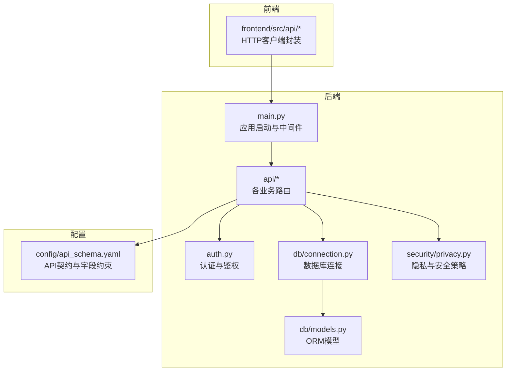
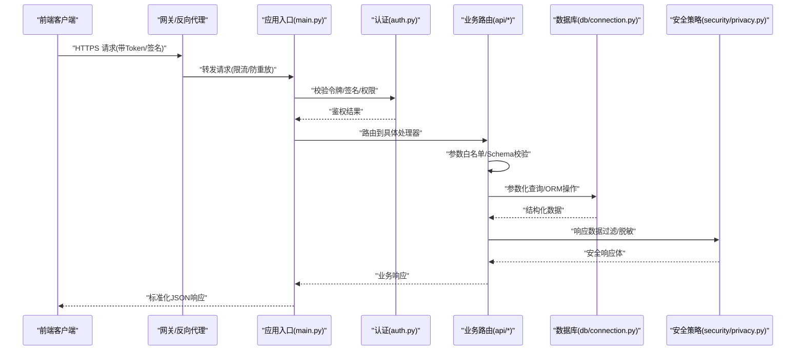
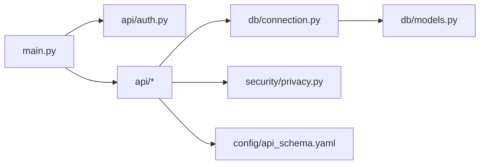

# API安全防护

<cite>
**本文引用的文件**   
- [src/loopse/main.py](file://src/loopse/main.py)
- [src/loopse/api/auth.py](file://src/loopse/api/auth.py)
- [src/loopse/api/chat.py](file://src/loopse/api/chat.py)
- [src/loopse/api/knowledge_base.py](file://src/loopse/api/knowledge_base.py)
- [src/loopse/db/connection.py](file://src/loopse/db/connection.py)
- [src/loopse/db/models.py](file://src/loopse/db/models.py)
- [src/loopse/security/privacy.py](file://src/loopse/security/privacy.py)
- [config/api_schema.yaml](file://config/api_schema.yaml)
</cite>

## 目录
1. [简介](#简介)
2. [项目结构](#项目结构)
3. [核心组件](#核心组件)
4. [架构总览](#架构总览)
5. [详细组件分析](#详细组件分析)
6. [依赖关系分析](#依赖关系分析)
7. [性能考虑](#性能考虑)
8. [故障排查指南](#故障排查指南)
9. [结论](#结论)
10. [附录](#附录)

## 简介
本文件面向API安全，围绕请求频率限制、输入验证与SQL注入防护、CORS配置、CSRF防护、XSS攻击防护、API版本管理、参数白名单校验、响应数据过滤、API签名验证、请求溯源追踪、异常行为检测、常见API攻击类型防护以及性能优化建议进行系统化说明。文档结合仓库中后端入口、认证模块、数据库连接与模型、隐私与安全策略以及API Schema等关键位置，给出可落地的实现要点与最佳实践。

## 项目结构
本项目采用前后端分离架构，前端位于 frontend 目录，后端服务位于 src/loopse 目录。API路由集中在 src/loopse/api 下，认证逻辑在 auth.py，数据库连接与ORM模型在 db 子包，安全与隐私策略在 security 子包，应用主入口在 main.py，API契约定义在 config/api_schema.yaml。

图表来源
- [src/loopse/main.py](file://src/loopse/main.py)
- [src/loopse/api/auth.py](file://src/loopse/api/auth.py)
- [src/loopse/db/connection.py](file://src/loopse/db/connection.py)
- [src/loopse/db/models.py](file://src/loopse/db/models.py)
- [src/loopse/security/privacy.py](file://src/loopse/security/privacy.py)
- [config/api_schema.yaml](file://config/api_schema.yaml)

章节来源
- [src/loopse/main.py](file://src/loopse/main.py)
- [src/loopse/api/auth.py](file://src/loopse/api/auth.py)
- [src/loopse/db/connection.py](file://src/loopse/db/connection.py)
- [src/loopse/db/models.py](file://src/loopse/db/models.py)
- [src/loopse/security/privacy.py](file://src/loopse/security/privacy.py)
- [config/api_schema.yaml](file://config/api_schema.yaml)

## 核心组件
- 应用入口与中间件：负责全局中间件注册（如CORS、限流、日志、鉴权）、统一错误处理、健康检查与版本前缀。
- 认证与授权：提供登录、令牌签发与校验、权限范围控制、会话或无状态JWT流程。
- 数据库访问：通过ORM模型与连接池执行查询，避免拼接SQL，使用参数化查询与事务。
- 安全与隐私：对敏感数据进行脱敏、最小化暴露、审计日志与合规策略。
- API契约：以YAML描述接口路径、方法、参数、返回结构与约束，驱动生成校验器与文档。

章节来源
- [src/loopse/main.py](file://src/loopse/main.py)
- [src/loopse/api/auth.py](file://src/loopse/api/auth.py)
- [src/loopse/db/connection.py](file://src/loopse/db/connection.py)
- [src/loopse/db/models.py](file://src/loopse/db/models.py)
- [src/loopse/security/privacy.py](file://src/loopse/security/privacy.py)
- [config/api_schema.yaml](file://config/api_schema.yaml)

## 架构总览
下图展示从前端到后端的典型API调用链路，包括认证、鉴权、输入校验、数据库访问、响应过滤与审计追踪的关键环节。

图表来源
- [src/loopse/main.py](file://src/loopse/main.py)
- [src/loopse/api/auth.py](file://src/loopse/api/auth.py)
- [src/loopse/db/connection.py](file://src/loopse/db/connection.py)
- [src/loopse/security/privacy.py](file://src/loopse/security/privacy.py)

## 详细组件分析

### 请求频率限制（Rate Limiting）
- 目标：防止暴力破解、资源耗尽与滥用。
- 推荐实现：
  - 基于IP+用户ID的滑动窗口计数，存储于Redis或内存表。
  - 按路由粒度设置不同阈值（如登录接口更严格）。
  - 返回标准限流响应头与错误码，便于前端退避重试。
- 集成点：
  - 在应用入口注册限流中间件，优先于鉴权与业务逻辑。
  - 对匿名与已认证用户分别统计。
- 监控与告警：
  - 记录被限流的请求数与来源，触发阈值告警。

章节来源
- [src/loopse/main.py](file://src/loopse/main.py)

### 输入验证与SQL注入防护
- 输入验证：
  - 使用API契约（YAML）定义字段类型、长度、枚举、必填项等约束。
  - 在路由层统一解析并校验请求体、查询参数与路径参数。
  - 拒绝非法类型与越界值，返回明确错误信息。
- SQL注入防护：
  - 禁止字符串拼接SQL；全部使用参数化查询或ORM。
  - 对排序字段、分页参数做白名单校验。
  - 对复杂查询构建器进行二次审查。
- 参考实现位置：
  - 数据库连接与ORM模型定义处确保参数化与类型安全。
  - 业务路由中对入参进行白名单与格式校验。

章节来源
- [src/loopse/db/connection.py](file://src/loopse/db/connection.py)
- [src/loopse/db/models.py](file://src/loopse/db/models.py)
- [config/api_schema.yaml](file://config/api_schema.yaml)

### CORS配置
- 原则：
  - 仅允许受信任的前端域名与方法集合。
  - 谨慎开启凭据模式，配合严格的源校验。
  - 生产环境禁用通配符。
- 建议：
  - 将允许的Origin列表纳入配置中心，支持动态刷新。
  - 对预检请求进行缓存以减少开销。

章节来源
- [src/loopse/main.py](file://src/loopse/main.py)

### CSRF防护
- 适用场景：
  - 使用Cookie会话时，需启用CSRF保护。
  - 若全量使用无状态JWT且SameSite=Strict/Lax，可降低风险但仍建议额外防护。
- 措施：
  - 为写操作引入双重提交或同源表单令牌。
  - 校验Referer/Origin与自定义Header组合。
  - 对敏感操作要求二次确认或短时效令牌。

章节来源
- [src/loopse/main.py](file://src/loopse/main.py)
- [src/loopse/api/auth.py](file://src/loopse/api/auth.py)

### XSS攻击防护
- 服务端：
  - 输出编码：对HTML/JS/CSS上下文进行转义。
  - 设置安全响应头：Content-Type、X-Content-Type-Options、X-Frame-Options、Referrer-Policy、Permissions-Policy等。
  - 对富文本内容采用白名单标签库进行清洗。
- 前端：
  - 避免使用innerHTML等危险API，使用框架提供的安全渲染方式。
  - 对URL跳转进行白名单校验。

章节来源
- [src/loopse/main.py](file://src/loopse/main.py)
- [src/loopse/security/privacy.py](file://src/loopse/security/privacy.py)

### API版本管理
- 策略：
  - URL前缀版本（/v1/...）或Accept-Version头部。
  - 保持向后兼容，废弃字段保留过渡期。
  - 通过契约文件驱动变更评审与自动化测试。
- 实施：
  - 在路由注册时按版本分组。
  - 对旧版本提供迁移指南与降级策略。

章节来源
- [src/loopse/main.py](file://src/loopse/main.py)
- [config/api_schema.yaml](file://config/api_schema.yaml)

### 参数白名单验证
- 做法：
  - 以YAML契约为中心，自动生成校验规则。
  - 对可选字段提供默认值与类型转换。
  - 对数组/对象嵌套结构进行深度校验。
- 好处：
  - 减少手工校验代码，提升一致性与可维护性。
  - 快速发现不合规请求，降低注入与越权风险。

章节来源
- [config/api_schema.yaml](file://config/api_schema.yaml)

### 响应数据过滤
- 目标：
  - 避免泄露敏感字段（密码、密钥、内部标识等）。
  - 根据角色裁剪返回字段，遵循最小暴露原则。
- 实现：
  - 在安全策略层集中过滤与脱敏。
  - 对日志中的敏感信息进行掩码处理。

章节来源
- [src/loopse/security/privacy.py](file://src/loopse/security/privacy.py)

### API签名验证
- 目的：
  - 保证请求完整性与来源可信，防篡改与重放。
- 建议方案：
  - 客户端计算签名：时间戳+随机串+请求体哈希+私钥签名。
  - 服务端校验时间戳有效期、随机串唯一性、签名正确性。
  - 对幂等接口使用去重表或Redis记录nonce。
- 集成点：
  - 在认证中间件中统一校验，失败直接拒绝。

章节来源
- [src/loopse/api/auth.py](file://src/loopse/api/auth.py)

### 请求溯源追踪
- 要素：
  - 为每个请求分配唯一TraceId，贯穿网关、应用、数据库与外部依赖。
  - 记录关键节点日志（进入、鉴权、校验、查询、返回），包含耗时与状态码。
  - 关联用户ID与设备指纹（在合规前提下）。
- 落地：
  - 在应用入口注入TraceId到上下文。
  - 在数据库连接层附加trace信息用于慢查询定位。

章节来源
- [src/loopse/main.py](file://src/loopse/main.py)
- [src/loopse/db/connection.py](file://src/loopse/db/connection.py)

### 异常行为检测
- 指标：
  - 高频失败、异常UA、异常地理位置、异常时间段、异常参数分布。
- 机制：
  - 实时统计与阈值告警，结合黑名单与验证码挑战。
  - 对可疑请求降权或延迟处理，收集证据供后续分析。
- 集成：
  - 在中间件层采集指标，写入时序数据库或消息队列。

章节来源
- [src/loopse/main.py](file://src/loopse/main.py)

### 常见API攻击类型防护
- 暴力破解：账号锁定、验证码、速率限制、异常登录告警。
- 注入攻击：参数化查询、输入白名单、输出编码。
- 越权访问：细粒度权限模型、资源级鉴权、数据行级隔离。
- 重放攻击：时间戳+Nonce+签名校验。
- 反序列化漏洞：限制可反序列化的类、使用安全格式（JSON）。
- 文件上传：类型/大小/内容扫描、独立存储与CDN、沙箱执行。
- 信息泄露：统一错误响应、屏蔽堆栈、最小化日志。

章节来源
- [src/loopse/api/auth.py](file://src/loopse/api/auth.py)
- [src/loopse/db/connection.py](file://src/loopse/db/connection.py)
- [src/loopse/security/privacy.py](file://src/loopse/security/privacy.py)

### 性能优化建议
- 连接池与超时：合理配置数据库连接池大小、读写超时与重试策略。
- 缓存：热点数据缓存、读多写少接口缓存、缓存穿透/雪崩防护。
- 异步与批处理：非关键路径异步化，批量写入与查询。
- 压缩与传输：启用Gzip/Brotli、HTTP/2、按需加载。
- 索引与查询优化：覆盖索引、避免N+1查询、分页游标。
- 限流与熔断：保护下游依赖，快速失败与回退。

章节来源
- [src/loopse/db/connection.py](file://src/loopse/db/connection.py)
- [src/loopse/main.py](file://src/loopse/main.py)

## 依赖关系分析

图表来源
- [src/loopse/main.py](file://src/loopse/main.py)
- [src/loopse/api/auth.py](file://src/loopse/api/auth.py)
- [src/loopse/db/connection.py](file://src/loopse/db/connection.py)
- [src/loopse/db/models.py](file://src/loopse/db/models.py)
- [src/loopse/security/privacy.py](file://src/loopse/security/privacy.py)
- [config/api_schema.yaml](file://config/api_schema.yaml)

章节来源
- [src/loopse/main.py](file://src/loopse/main.py)
- [src/loopse/api/auth.py](file://src/loopse/api/auth.py)
- [src/loopse/db/connection.py](file://src/loopse/db/connection.py)
- [src/loopse/db/models.py](file://src/loopse/db/models.py)
- [src/loopse/security/privacy.py](file://src/loopse/security/privacy.py)
- [config/api_schema.yaml](file://config/api_schema.yaml)

## 性能考虑
- 在入口层统一接入限流、缓存与健康检查，避免重复实现。
- 数据库侧关注连接池、慢查询与索引命中，必要时引入只读副本。
- 对大对象与长列表进行分页与增量拉取，减少单次负载。
- 对跨域预检与静态资源进行缓存，降低带宽与CPU消耗。
- 使用压测与APM工具持续评估瓶颈，滚动优化。

[本节为通用指导，无需列出具体文件来源]

## 故障排查指南
- 常见问题定位：
  - 鉴权失败：检查令牌有效期、签名算法、时钟同步与Nonce去重。
  - 输入校验报错：对照API契约逐项核对字段类型与必填项。
  - SQL异常：查看参数化查询与事务边界，确认索引与锁等待。
  - CORS拦截：核对Origin、方法与凭据配置是否匹配。
  - 限流触发：观察限流维度与阈值，调整配额或扩容。
- 日志与追踪：
  - 通过TraceId串联请求链路，定位慢点与异常分支。
  - 对敏感字段脱敏后再落盘，避免泄露。
- 恢复策略：
  - 快速回滚至稳定版本，临时放宽限流或关闭非核心功能。
  - 对异常来源进行封禁与告警通知。

章节来源
- [src/loopse/api/auth.py](file://src/loopse/api/auth.py)
- [src/loopse/db/connection.py](file://src/loopse/db/connection.py)
- [src/loopse/main.py](file://src/loopse/main.py)

## 结论
通过统一的中间件体系、契约驱动的输入校验、参数化查询与响应过滤、完善的签名与溯源机制，以及持续的异常行为检测与性能优化，可以显著提升API的安全性与稳定性。建议在迭代中持续完善契约与测试用例，形成“设计即安全”的工程闭环。

[本节为总结性内容，无需列出具体文件来源]

## 附录
- 建议的中间件清单：CORS、CSRF、限流、签名校验、输入校验、响应过滤、审计日志、追踪注入、统一错误处理。
- 建议的监控指标：QPS、P95/P99延迟、错误率、限流命中率、鉴权失败率、慢查询数量、缓存命中率。
- 建议的合规策略：最小数据暴露、日志脱敏、数据留存周期与访问审计。

[本节为补充信息，无需列出具体文件来源]