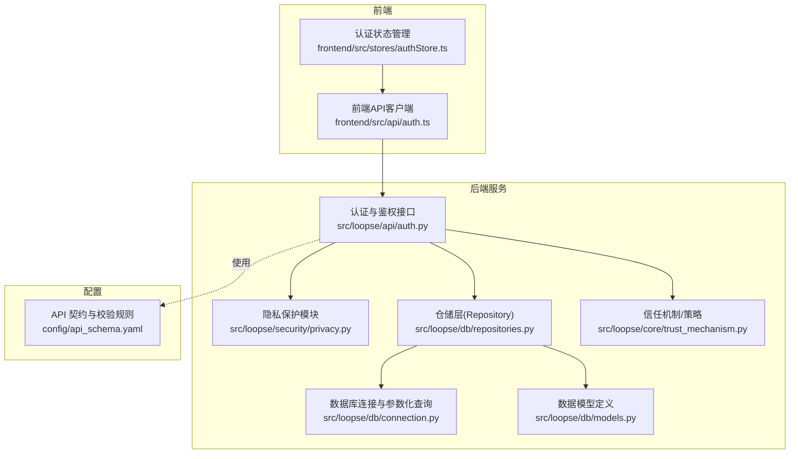
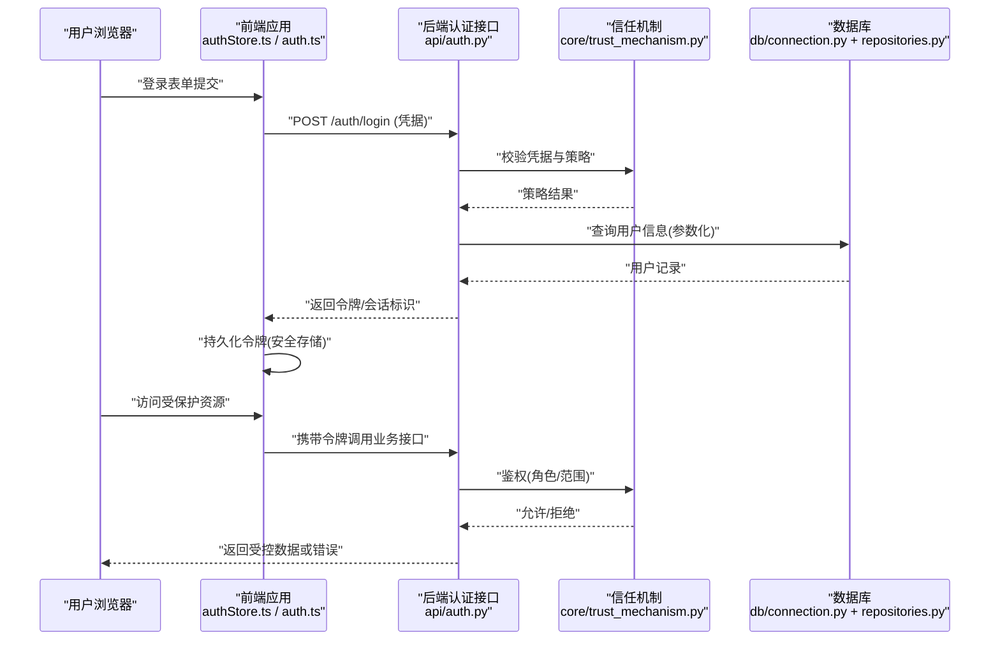
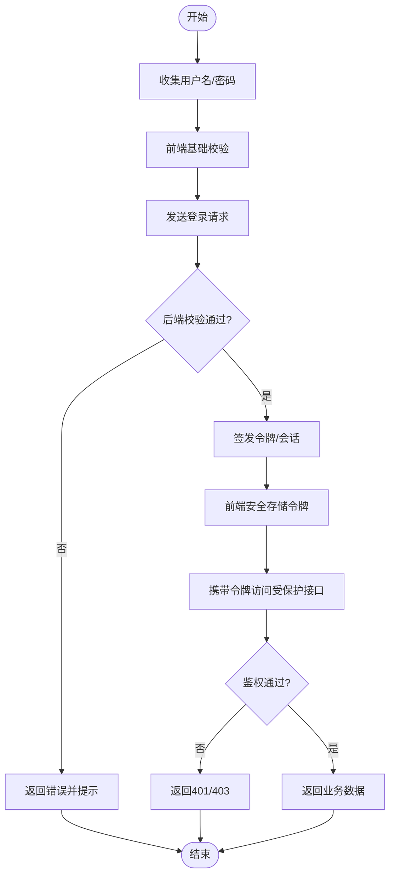
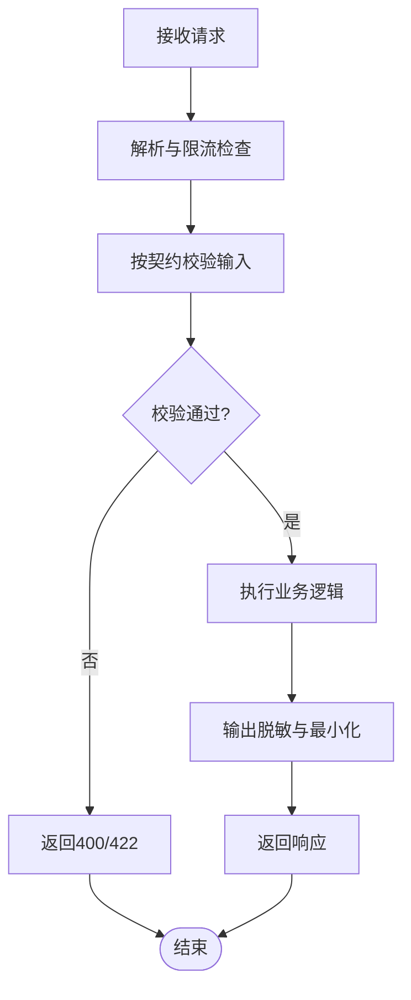
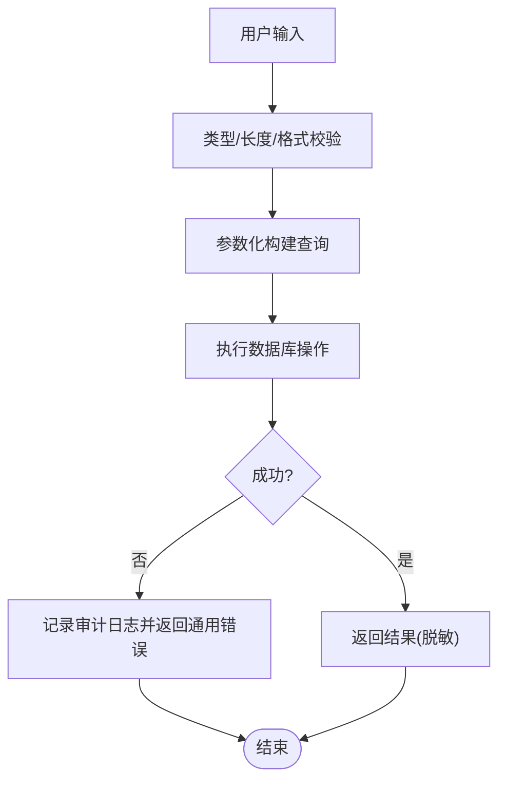
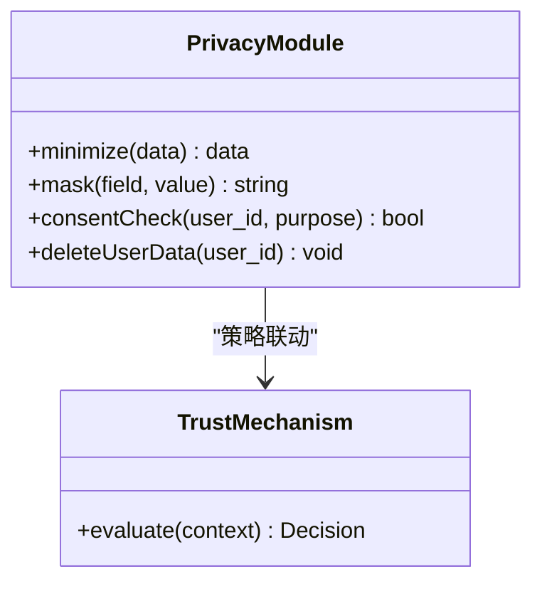
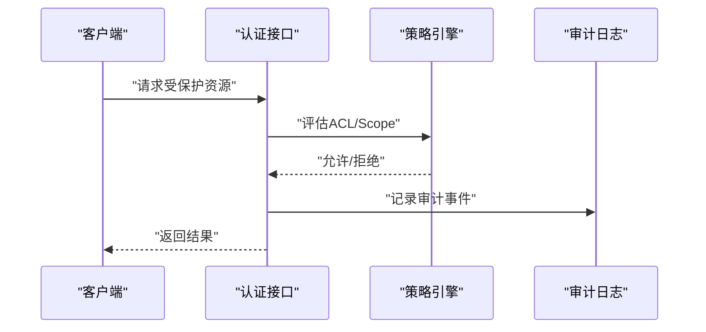
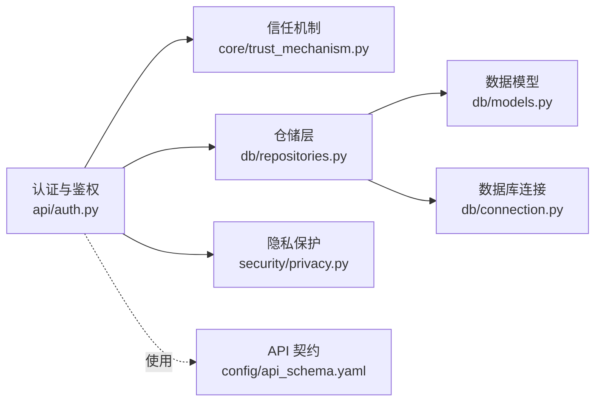

# 安全加固与防护

<cite>
**本文引用的文件**   
- [src/loopse/api/auth.py](file://src/loopse/api/auth.py)
- [src/loopse/security/privacy.py](file://src/loopse/security/privacy.py)
- [src/loopse/db/connection.py](file://src/loopse/db/connection.py)
- [src/loopse/db/models.py](file://src/loopse/db/models.py)
- [src/loopse/db/repositories.py](file://src/loopse/db/repositories.py)
- [src/loopse/core/trust_mechanism.py](file://src/loopse/core/trust_mechanism.py)
- [frontend/src/api/auth.ts](file://frontend/src/api/auth.ts)
- [frontend/src/stores/authStore.ts](file://frontend/src/stores/authStore.ts)
- [config/api_schema.yaml](file://config/api_schema.yaml)
</cite>

## 目录
1. [简介](#简介)
2. [项目结构](#项目结构)
3. [核心组件](#核心组件)
4. [架构总览](#架构总览)
5. [详细组件分析](#详细组件分析)
6. [依赖关系分析](#依赖关系分析)
7. [性能考虑](#性能考虑)
8. [故障排查指南](#故障排查指南)
9. [结论](#结论)
10. [附录](#附录)

## 简介
本指南聚焦于系统的安全加固与防护，围绕身份认证与授权、数据加密传输与存储、API 安全防护、输入验证与 SQL 注入防护、隐私保护实现、访问控制列表（ACL）与安全审计日志配置，以及安全漏洞扫描与渗透测试实践展开。文档以仓库中现有实现为基础，给出可操作的落地建议与最佳实践，帮助读者在保持功能可用的同时提升整体安全水位。

## 项目结构
本项目采用前后端分离架构：
- 前端位于 frontend 目录，负责用户交互、路由与会话管理。
- 后端位于 src/loopse，提供 API、领域逻辑、数据库访问、安全与隐私能力等。
- 配置集中在 config 目录，包含 API 契约与提示词模板等。

**图表来源** 
- [src/loopse/api/auth.py](file://src/loopse/api/auth.py)
- [src/loopse/security/privacy.py](file://src/loopse/security/privacy.py)
- [src/loopse/db/connection.py](file://src/loopse/db/connection.py)
- [src/loopse/db/models.py](file://src/loopse/db/models.py)
- [src/loopse/db/repositories.py](file://src/loopse/db/repositories.py)
- [src/loopse/core/trust_mechanism.py](file://src/loopse/core/trust_mechanism.py)
- [frontend/src/api/auth.ts](file://frontend/src/api/auth.ts)
- [frontend/src/stores/authStore.ts](file://frontend/src/stores/authStore.ts)
- [config/api_schema.yaml](file://config/api_schema.yaml)

**章节来源**
- [src/loopse/api/auth.py](file://src/loopse/api/auth.py)
- [src/loopse/security/privacy.py](file://src/loopse/security/privacy.py)
- [src/loopse/db/connection.py](file://src/loopse/db/connection.py)
- [src/loopse/db/models.py](file://src/loopse/db/models.py)
- [src/loopse/db/repositories.py](file://src/loopse/db/repositories.py)
- [src/loopse/core/trust_mechanism.py](file://src/loopse/core/trust_mechanism.py)
- [frontend/src/api/auth.ts](file://frontend/src/api/auth.ts)
- [frontend/src/stores/authStore.ts](file://frontend/src/stores/authStore.ts)
- [config/api_schema.yaml](file://config/api_schema.yaml)

## 核心组件
- 认证与授权
  - 后端认证入口与鉴权中间件，负责令牌签发、校验与权限判定。
  - 前端会话管理与请求拦截，确保携带有效凭证并处理过期刷新。
- 隐私保护
  - 敏感数据处理、最小化采集与脱敏输出。
- 数据库访问
  - 连接池与参数化查询，避免拼接 SQL。
  - 数据模型约束与字段级安全属性。
- 信任机制
  - 基于上下文与策略的访问控制决策点。
- API 契约
  - 统一的输入校验与错误响应规范。

**章节来源**
- [src/loopse/api/auth.py](file://src/loopse/api/auth.py)
- [frontend/src/api/auth.ts](file://frontend/src/api/auth.ts)
- [frontend/src/stores/authStore.ts](file://frontend/src/stores/authStore.ts)
- [src/loopse/security/privacy.py](file://src/loopse/security/privacy.py)
- [src/loopse/db/connection.py](file://src/loopse/db/connection.py)
- [src/loopse/db/models.py](file://src/loopse/db/models.py)
- [src/loopse/db/repositories.py](file://src/loopse/db/repositories.py)
- [src/loopse/core/trust_mechanism.py](file://src/loopse/core/trust_mechanism.py)
- [config/api_schema.yaml](file://config/api_schema.yaml)

## 架构总览
下图展示从前端到后端的认证与鉴权流程，以及关键安全控制点的位置。

**图表来源** 
- [frontend/src/stores/authStore.ts](file://frontend/src/stores/authStore.ts)
- [frontend/src/api/auth.ts](file://frontend/src/api/auth.ts)
- [src/loopse/api/auth.py](file://src/loopse/api/auth.py)
- [src/loopse/core/trust_mechanism.py](file://src/loopse/core/trust_mechanism.py)
- [src/loopse/db/connection.py](file://src/loopse/db/connection.py)
- [src/loopse/db/repositories.py](file://src/loopse/db/repositories.py)

## 详细组件分析

### 身份认证与授权
- 认证流程
  - 前端在登录成功后保存令牌，并在后续请求头中自动附加。
  - 后端对每个受保护接口进行令牌校验与权限判定。
- 授权策略
  - 基于角色的访问控制（RBAC）与基于范围的访问控制（Scope）结合。
  - 信任机制模块集中评估访问策略，便于统一治理。
- 会话与令牌
  - 建议使用短期令牌+刷新令牌模式；服务端维护黑名单与过期时间。
  - 前端应避免将敏感令牌暴露给第三方脚本。

**图表来源** 
- [frontend/src/api/auth.ts](file://frontend/src/api/auth.ts)
- [frontend/src/stores/authStore.ts](file://frontend/src/stores/authStore.ts)
- [src/loopse/api/auth.py](file://src/loopse/api/auth.py)
- [src/loopse/core/trust_mechanism.py](file://src/loopse/core/trust_mechanism.py)

**章节来源**
- [frontend/src/api/auth.ts](file://frontend/src/api/auth.ts)
- [frontend/src/stores/authStore.ts](file://frontend/src/stores/authStore.ts)
- [src/loopse/api/auth.py](file://src/loopse/api/auth.py)
- [src/loopse/core/trust_mechanism.py](file://src/loopse/core/trust_mechanism.py)

### 数据加密传输与存储
- 传输加密
  - 全站强制 HTTPS，启用 HSTS，禁用不安全协议与弱密码套件。
  - 前端避免明文打印敏感信息，关闭调试输出。
- 存储加密
  - 敏感字段（如口令、密钥）使用强哈希与加盐存储；静态数据按字段或表空间加密。
  - 密钥管理采用独立密钥管理服务，禁止硬编码。
- 密钥轮换
  - 支持定期轮换与灰度切换，保证历史数据可解密迁移。

[本节为通用安全建议，不直接分析具体文件]

### API 安全防护
- 输入校验
  - 基于 API 契约进行严格类型与格式校验，拒绝非法输入。
  - 限制请求体大小、字段数量与嵌套深度。
- 速率限制与防重放
  - 对登录、注册等敏感接口实施速率限制。
  - 引入非ce与时间戳防止重放攻击。
- 错误处理
  - 统一错误码与消息，避免泄露堆栈与内部细节。

**图表来源** 
- [config/api_schema.yaml](file://config/api_schema.yaml)
- [src/loopse/api/auth.py](file://src/loopse/api/auth.py)

**章节来源**
- [config/api_schema.yaml](file://config/api_schema.yaml)
- [src/loopse/api/auth.py](file://src/loopse/api/auth.py)

### 输入验证与 SQL 注入防护
- 输入验证
  - 白名单校验、长度与格式限制、枚举值限定。
  - 对富文本与文件上传进行内容类型与大小限制。
- SQL 注入防护
  - 全面使用参数化查询，禁止字符串拼接。
  - 数据库账户遵循最小权限原则，仅授予必要操作。
- 异常与日志
  - 捕获数据库异常并返回通用错误，避免回显底层错误。

**图表来源** 
- [src/loopse/db/connection.py](file://src/loopse/db/connection.py)
- [src/loopse/db/repositories.py](file://src/loopse/db/repositories.py)
- [src/loopse/db/models.py](file://src/loopse/db/models.py)

**章节来源**
- [src/loopse/db/connection.py](file://src/loopse/db/connection.py)
- [src/loopse/db/repositories.py](file://src/loopse/db/repositories.py)
- [src/loopse/db/models.py](file://src/loopse/db/models.py)

### 隐私保护实现
- 数据最小化
  - 仅采集与业务必需的数据，明确保留期限与用途。
- 脱敏与匿名化
  - 日志与导出默认脱敏，必要时进行差分隐私或聚合统计。
- 同意与可撤回
  - 提供用户同意开关与数据删除接口，满足合规要求。

**图表来源** 
- [src/loopse/security/privacy.py](file://src/loopse/security/privacy.py)
- [src/loopse/core/trust_mechanism.py](file://src/loopse/core/trust_mechanism.py)

**章节来源**
- [src/loopse/security/privacy.py](file://src/loopse/security/privacy.py)
- [src/loopse/core/trust_mechanism.py](file://src/loopse/core/trust_mechanism.py)

### 访问控制列表（ACL）与安全审计日志
- ACL 设计
  - 资源-主体-动作三元组，结合 RBAC 与 Scope 实现细粒度控制。
  - 策略集中管理，支持动态加载与热更新。
- 审计日志
  - 记录认证事件、授权决策、数据访问与变更操作。
  - 日志不可篡改、分级分类、留存周期符合合规要求。

**图表来源** 
- [src/loopse/api/auth.py](file://src/loopse/api/auth.py)
- [src/loopse/core/trust_mechanism.py](file://src/loopse/core/trust_mechanism.py)

**章节来源**
- [src/loopse/api/auth.py](file://src/loopse/api/auth.py)
- [src/loopse/core/trust_mechanism.py](file://src/loopse/core/trust_mechanism.py)

### 安全漏洞扫描与渗透测试
- 自动化扫描
  - 代码静态分析（SAST）、依赖漏洞扫描（SCA）、容器镜像扫描。
  - 集成至 CI/CD，阻断高危问题合并。
- 动态测试
  - DAST 针对运行态接口进行黑盒扫描，覆盖认证、鉴权与输入边界。
- 渗透测试
  - 模拟真实攻击路径，重点验证越权、注入、XSS、CSRF、重放等。
- 修复与回归
  - 建立漏洞台账与优先级，修复后进行回归验证与复测。

[本节为通用实践建议，不直接分析具体文件]

## 依赖关系分析
后端各模块之间的耦合与职责划分如下：

**图表来源** 
- [src/loopse/api/auth.py](file://src/loopse/api/auth.py)
- [src/loopse/core/trust_mechanism.py](file://src/loopse/core/trust_mechanism.py)
- [src/loopse/db/repositories.py](file://src/loopse/db/repositories.py)
- [src/loopse/db/models.py](file://src/loopse/db/models.py)
- [src/loopse/db/connection.py](file://src/loopse/db/connection.py)
- [src/loopse/security/privacy.py](file://src/loopse/security/privacy.py)
- [config/api_schema.yaml](file://config/api_schema.yaml)

**章节来源**
- [src/loopse/api/auth.py](file://src/loopse/api/auth.py)
- [src/loopse/core/trust_mechanism.py](file://src/loopse/core/trust_mechanism.py)
- [src/loopse/db/repositories.py](file://src/loopse/db/repositories.py)
- [src/loopse/db/models.py](file://src/loopse/db/models.py)
- [src/loopse/db/connection.py](file://src/loopse/db/connection.py)
- [src/loopse/security/privacy.py](file://src/loopse/security/privacy.py)
- [config/api_schema.yaml](file://config/api_schema.yaml)

## 性能考虑
- 认证开销
  - 令牌校验应缓存热点策略与用户角色，减少重复计算。
- 数据库访问
  - 合理使用索引与分页，避免全表扫描；批量操作尽量合并。
- 日志与审计
  - 异步写入与采样策略，避免阻塞主流程。
- 内存与并发
  - 连接池与线程池参数调优，监控慢请求与长事务。

[本节为通用优化建议，不直接分析具体文件]

## 故障排查指南
- 认证失败
  - 检查令牌有效期、签名与权限范围；核对前端是否携带正确头部。
- 鉴权拒绝
  - 查看策略引擎决策原因与审计日志，确认 ACL 配置是否正确。
- 数据库异常
  - 定位参数化查询位置，检查绑定变量与数据类型；核对最小权限账户。
- 隐私与脱敏
  - 验证脱敏规则是否覆盖所有敏感字段；检查日志是否误写明文。

**章节来源**
- [src/loopse/api/auth.py](file://src/loopse/api/auth.py)
- [src/loopse/core/trust_mechanism.py](file://src/loopse/core/trust_mechanism.py)
- [src/loopse/db/connection.py](file://src/loopse/db/connection.py)
- [src/loopse/db/repositories.py](file://src/loopse/db/repositories.py)
- [src/loopse/security/privacy.py](file://src/loopse/security/privacy.py)

## 结论
通过将认证与鉴权、输入校验、SQL 注入防护、隐私保护与审计日志纳入统一治理框架，并结合自动化扫描与渗透测试，可在不牺牲可用性的前提下显著提升系统安全性。建议持续完善策略中心与审计体系，形成“检测-处置-验证”的闭环。

[本节为总结性内容，不直接分析具体文件]

## 附录
- 术语
  - RBAC：基于角色的访问控制
  - Scope：基于范围的访问控制
  - SAST/SCA/DAST：静态/依赖/动态安全测试
- 参考
  - API 契约与校验规则定义见配置文件。
  - 认证与鉴权实现见后端认证模块与信任机制模块。

[本节为补充说明，不直接分析具体文件]