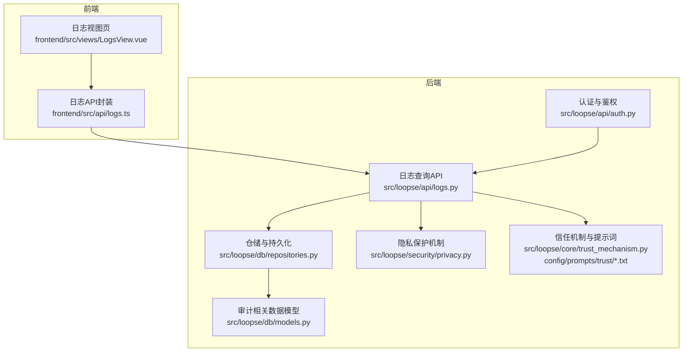
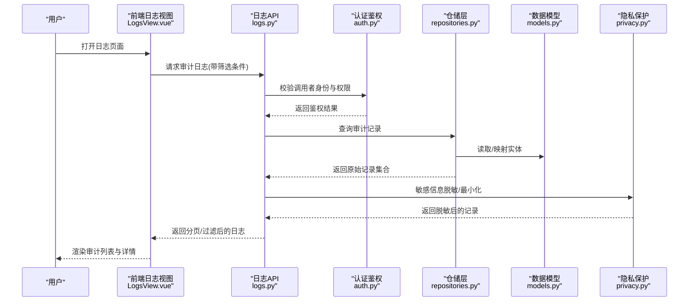
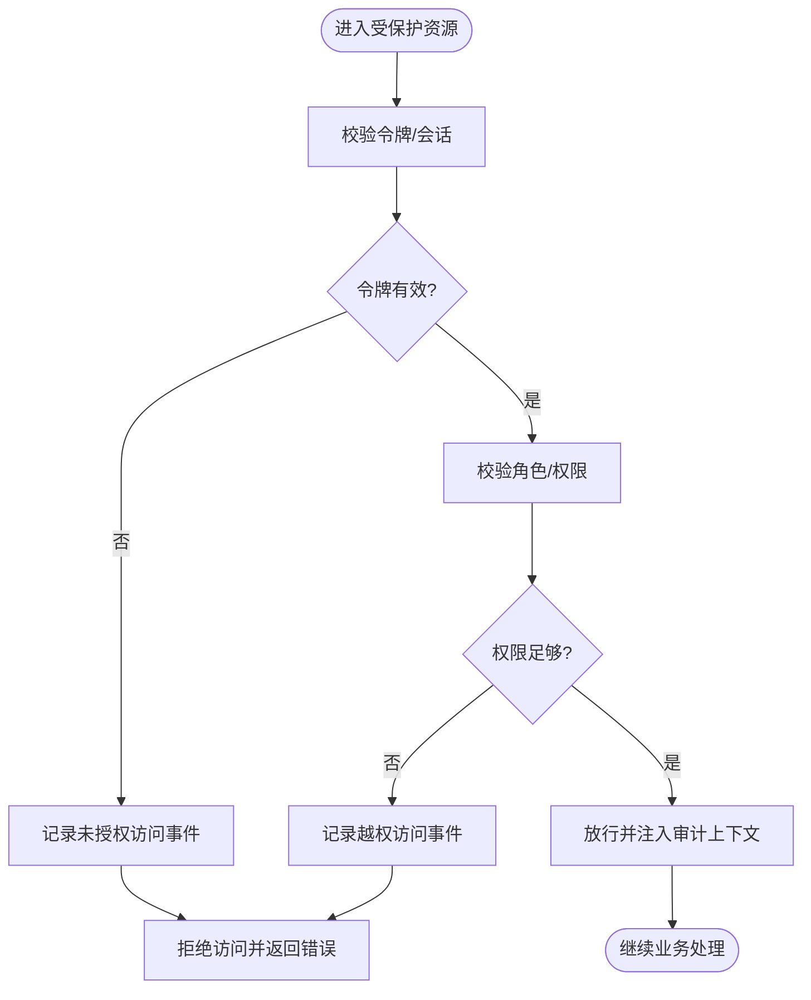
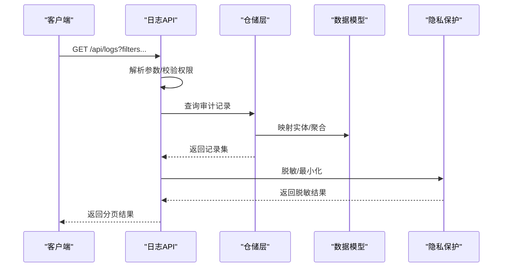
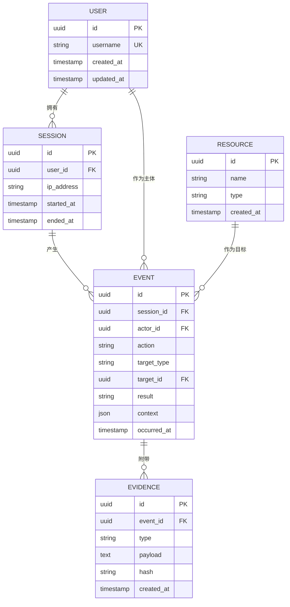
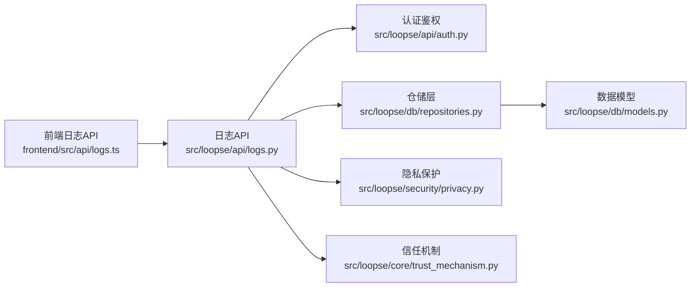

# 安全监控与审计

<cite>
**本文引用的文件**   
- [src/loopse/api/auth.py](file://src/loopse/api/auth.py)
- [src/loopse/security/privacy.py](file://src/loopse/security/privacy.py)
- [src/loopse/db/models.py](file://src/loopse/db/models.py)
- [src/loopse/db/repositories.py](file://src/loopse/db/repositories.py)
- [src/loopse/core/trust_mechanism.py](file://src/loopse/core/trust_mechanism.py)
- [src/loopse/api/logs.py](file://src/loopse/api/logs.py)
- [frontend/src/api/logs.ts](file://frontend/src/api/logs.ts)
- [frontend/src/views/LogsView.vue](file://frontend/src/views/LogsView.vue)
- [config/prompts/trust/scope_check.txt](file://config/prompts/trust/scope_check.txt)
- [config/prompts/trust/source_citation.txt](file://config/prompts/trust/source_citation.txt)
</cite>

## 目录
1. [简介](#简介)
2. [项目结构](#项目结构)
3. [核心组件](#核心组件)
4. [架构总览](#架构总览)
5. [详细组件分析](#详细组件分析)
6. [依赖关系分析](#依赖关系分析)
7. [性能考虑](#性能考虑)
8. [故障排查指南](#故障排查指南)
9. [结论](#结论)
10. [附录](#附录)

## 简介
本指南围绕“安全监控与审计”主题，结合仓库中现有实现，系统化说明以下能力：
- 安全事件日志收集、访问审计日志与操作轨迹追踪
- 异常行为检测与安全指标监控
- 实时安全仪表板、自动化威胁响应与合规性报告生成
- 安全基线检查、漏洞扫描集成与渗透测试自动化
- 安全事件分析、取证调查与应急响应流程

为便于落地，文档将代码级实现与概念化方案相结合，既给出可直接落地的接口与数据模型，也提供扩展建议与最佳实践。

## 项目结构
本项目在前后端均具备与“日志与审计”相关的基础设施：
- 后端 API 层暴露日志查询接口，供前端展示
- 数据库模型定义了审计相关的实体（如用户、会话、资源等）
- 安全模块包含隐私保护机制与信任评估提示词
- 前端提供日志查看页面与日志 API 封装

图表来源
- [src/loopse/api/logs.py](file://src/loopse/api/logs.py)
- [frontend/src/api/logs.ts](file://frontend/src/api/logs.ts)
- [frontend/src/views/LogsView.vue](file://frontend/src/views/LogsView.vue)
- [src/loopse/db/models.py](file://src/loopse/db/models.py)
- [src/loopse/db/repositories.py](file://src/loopse/db/repositories.py)
- [src/loopse/security/privacy.py](file://src/loopse/security/privacy.py)
- [src/loopse/core/trust_mechanism.py](file://src/loopse/core/trust_mechanism.py)
- [config/prompts/trust/scope_check.txt](file://config/prompts/trust/scope_check.txt)
- [config/prompts/trust/source_citation.txt](file://config/prompts/trust/source_citation.txt)

章节来源
- [src/loopse/api/logs.py](file://src/loopse/api/logs.py)
- [frontend/src/api/logs.ts](file://frontend/src/api/logs.ts)
- [frontend/src/views/LogsView.vue](file://frontend/src/views/LogsView.vue)
- [src/loopse/db/models.py](file://src/loopse/db/models.py)
- [src/loopse/db/repositories.py](file://src/loopse/db/repositories.py)
- [src/loopse/security/privacy.py](file://src/loopse/security/privacy.py)
- [src/loopse/core/trust_mechanism.py](file://src/loopse/core/trust_mechanism.py)
- [config/prompts/trust/scope_check.txt](file://config/prompts/trust/scope_check.txt)
- [config/prompts/trust/source_citation.txt](file://config/prompts/trust/source_citation.txt)

## 核心组件
- 认证与鉴权：负责身份验证、权限校验与访问控制，是审计的入口点
- 日志查询API：对外暴露统一的日志检索接口，支持按时间、主体、对象、动作等维度过滤
- 数据模型与仓储：定义审计相关实体与持久化逻辑，支撑访问审计与操作轨迹
- 隐私保护机制：对敏感字段进行脱敏或最小化披露，满足合规要求
- 信任机制与提示词：通过策略与提示词约束Agent行为，辅助异常检测与可追溯性

章节来源
- [src/loopse/api/auth.py](file://src/loopse/api/auth.py)
- [src/loopse/api/logs.py](file://src/loopse/api/logs.py)
- [src/loopse/db/models.py](file://src/loopse/db/models.py)
- [src/loopse/db/repositories.py](file://src/loopse/db/repositories.py)
- [src/loopse/security/privacy.py](file://src/loopse/security/privacy.py)
- [src/loopse/core/trust_mechanism.py](file://src/loopse/core/trust_mechanism.py)
- [config/prompts/trust/scope_check.txt](file://config/prompts/trust/scope_check.txt)
- [config/prompts/trust/source_citation.txt](file://config/prompts/trust/source_citation.txt)

## 架构总览
下图展示了从前端到后端的日志查询链路，以及审计数据的存储与隐私处理路径。

图表来源
- [frontend/src/views/LogsView.vue](file://frontend/src/views/LogsView.vue)
- [frontend/src/api/logs.ts](file://frontend/src/api/logs.ts)
- [src/loopse/api/logs.py](file://src/loopse/api/logs.py)
- [src/loopse/api/auth.py](file://src/loopse/api/auth.py)
- [src/loopse/db/repositories.py](file://src/loopse/db/repositories.py)
- [src/loopse/db/models.py](file://src/loopse/db/models.py)
- [src/loopse/security/privacy.py](file://src/loopse/security/privacy.py)

## 详细组件分析

### 认证与鉴权（审计入口）
- 职责：统一处理登录、令牌校验、角色/权限判断；为后续审计埋点提供可信主体上下文
- 关键点：
  - 鉴权失败应记录未授权访问事件
  - 成功登录后建立会话上下文，用于关联后续操作轨迹
  - 对越权访问尝试进行告警与限流

图表来源
- [src/loopse/api/auth.py](file://src/loopse/api/auth.py)

章节来源
- [src/loopse/api/auth.py](file://src/loopse/api/auth.py)

### 日志查询API（访问审计与操作轨迹）
- 职责：提供统一的审计日志查询接口，支持多维度过滤、分页与排序
- 输入参数建议：
  - 时间范围、主体ID、对象ID、动作类型、结果状态、来源IP、会话ID
- 输出字段建议：
  - 事件ID、时间戳、主体、对象、动作、结果、来源、上下文摘要、证据哈希
- 关键流程：
  - 鉴权通过后执行查询
  - 仓储层聚合多源记录
  - 隐私层对敏感字段脱敏
  - 返回结构化结果供前端展示

图表来源
- [src/loopse/api/logs.py](file://src/loopse/api/logs.py)
- [src/loopse/db/repositories.py](file://src/loopse/db/repositories.py)
- [src/loopse/db/models.py](file://src/loopse/db/models.py)
- [src/loopse/security/privacy.py](file://src/loopse/security/privacy.py)

章节来源
- [src/loopse/api/logs.py](file://src/loopse/api/logs.py)
- [src/loopse/db/repositories.py](file://src/loopse/db/repositories.py)
- [src/loopse/db/models.py](file://src/loopse/db/models.py)
- [src/loopse/security/privacy.py](file://src/loopse/security/privacy.py)

### 数据模型与仓储（审计实体与持久化）
- 实体建议：
  - 用户、会话、资源、事件（访问/操作）、证据（快照/哈希）
- 关系建议：
  - 用户与会话一对多
  - 会话与事件一对多
  - 事件与资源多对多（通过中间表）
  - 事件与证据一对多
- 索引建议：
  - 时间戳、主体ID、对象ID、动作类型、结果状态
- 仓储职责：
  - 提供按条件查询、分页、聚合统计
  - 保证事务性与一致性

图表来源
- [src/loopse/db/models.py](file://src/loopse/db/models.py)

章节来源
- [src/loopse/db/models.py](file://src/loopse/db/models.py)
- [src/loopse/db/repositories.py](file://src/loopse/db/repositories.py)

### 隐私保护机制（合规脱敏）
- 目标：确保审计日志中的敏感信息最小化披露，满足隐私与合规要求
- 策略建议：
  - 字段级脱敏（如手机号、邮箱、身份证号）
  - 内容级摘要（仅保留必要上下文）
  - 动态策略（按角色/场景决定可见字段）
- 集成点：
  - 在日志API返回前统一调用隐私处理
  - 在仓储层写入时即进行不可逆脱敏（可选）

章节来源
- [src/loopse/security/privacy.py](file://src/loopse/security/privacy.py)

### 信任机制与提示词（异常检测与可追溯）
- 目标：通过策略与提示词约束Agent行为，提升可解释性与可追溯性
- 关键提示词：
  - 范围检查：限定Agent可访问的数据与作用域
  - 来源引用：强制对关键结论进行来源标注，便于取证
- 异常检测思路：
  - 基于提示词违反的行为标记
  - 结合规则引擎与阈值告警
  - 与审计事件关联形成证据链

章节来源
- [src/loopse/core/trust_mechanism.py](file://src/loopse/core/trust_mechanism.py)
- [config/prompts/trust/scope_check.txt](file://config/prompts/trust/scope_check.txt)
- [config/prompts/trust/source_citation.txt](file://config/prompts/trust/source_citation.txt)

### 前端日志视图（实时安全仪表板基础）
- 职责：提供日志查询界面、筛选器、分页与详情展开
- 能力建议：
  - 实时刷新（轮询/SSE）
  - 可视化趋势图（事件量、失败率、高危动作）
  - 一键导出与下载证据包
- 交互流程：
  - 选择时间范围与筛选条件
  - 发起查询并渲染结果
  - 点击事件查看详情与证据

章节来源
- [frontend/src/views/LogsView.vue](file://frontend/src/views/LogsView.vue)
- [frontend/src/api/logs.ts](file://frontend/src/api/logs.ts)

## 依赖关系分析
- 前端依赖后端日志API
- 日志API依赖认证鉴权、仓储层与隐私保护
- 仓储层依赖数据模型
- 信任机制与提示词影响Agent行为，间接影响审计事件质量

图表来源
- [frontend/src/api/logs.ts](file://frontend/src/api/logs.ts)
- [src/loopse/api/logs.py](file://src/loopse/api/logs.py)
- [src/loopse/api/auth.py](file://src/loopse/api/auth.py)
- [src/loopse/db/repositories.py](file://src/loopse/db/repositories.py)
- [src/loopse/db/models.py](file://src/loopse/db/models.py)
- [src/loopse/security/privacy.py](file://src/loopse/security/privacy.py)
- [src/loopse/core/trust_mechanism.py](file://src/loopse/core/trust_mechanism.py)

## 性能考虑
- 索引优化：对高频过滤字段建立复合索引（时间、主体、对象、动作）
- 分页与游标：避免全表扫描，使用分页或基于时间游标的增量拉取
- 异步写入：审计事件采用异步队列写入，降低主链路延迟
- 冷热分层：近期数据热存储，历史数据归档至低成本存储
- 缓存策略：对热点统计指标进行短时缓存，减轻数据库压力

## 故障排查指南
- 常见问题
  - 鉴权失败导致无法查看日志：检查令牌有效期与权限配置
  - 查询超时：确认索引是否命中，必要时调整筛选条件
  - 敏感信息泄露：核对隐私脱敏策略是否生效
  - 事件缺失：检查异步写入队列与重试机制
- 定位步骤
  - 通过事件ID回溯完整上下文与会话
  - 对比证据哈希确保数据完整性
  - 复核提示词策略是否被绕过或误用

章节来源
- [src/loopse/api/auth.py](file://src/loopse/api/auth.py)
- [src/loopse/api/logs.py](file://src/loopse/api/logs.py)
- [src/loopse/security/privacy.py](file://src/loopse/security/privacy.py)
- [src/loopse/core/trust_mechanism.py](file://src/loopse/core/trust_mechanism.py)

## 结论
本项目已具备安全监控与审计的基础能力：认证鉴权、日志查询、数据模型与隐私保护。在此基础上，可通过引入规则引擎、实时流处理、可视化仪表板与自动化响应，进一步完善异常检测、威胁告警、取证调查与应急响应闭环。同时，结合合规性报告与基线检查，持续提升系统的安全水位与可审计性。

## 附录

### 安全事件分析与取证调查
- 事件关联：以会话ID与主体ID为纽带，串联访问与操作轨迹
- 证据固化：对关键事件生成不可变证据（快照+哈希），支持离线核验
- 溯源分析：结合来源IP、设备指纹与Agent行为日志，还原攻击路径

### 自动化威胁响应
- 规则触发：当检测到高危动作或异常模式时，自动触发响应流程
- 响应动作：临时封禁、降权、隔离会话、通知管理员
- 反馈闭环：记录响应效果，持续优化规则与阈值

### 合规性报告生成
- 指标采集：访问成功率、失败率、高危动作占比、平均响应时间
- 报告模板：按日/周/月生成，包含趋势图与异常清单
- 审计留痕：报告版本化与签名，满足内外部审计需求

### 安全基线检查、漏洞扫描与渗透测试自动化
- 基线检查：定期比对配置项与策略，发现偏离并告警
- 漏洞扫描：集成扫描工具，产出缺陷清单与修复建议
- 渗透测试：在沙箱环境执行自动化用例，回归验证修复效果