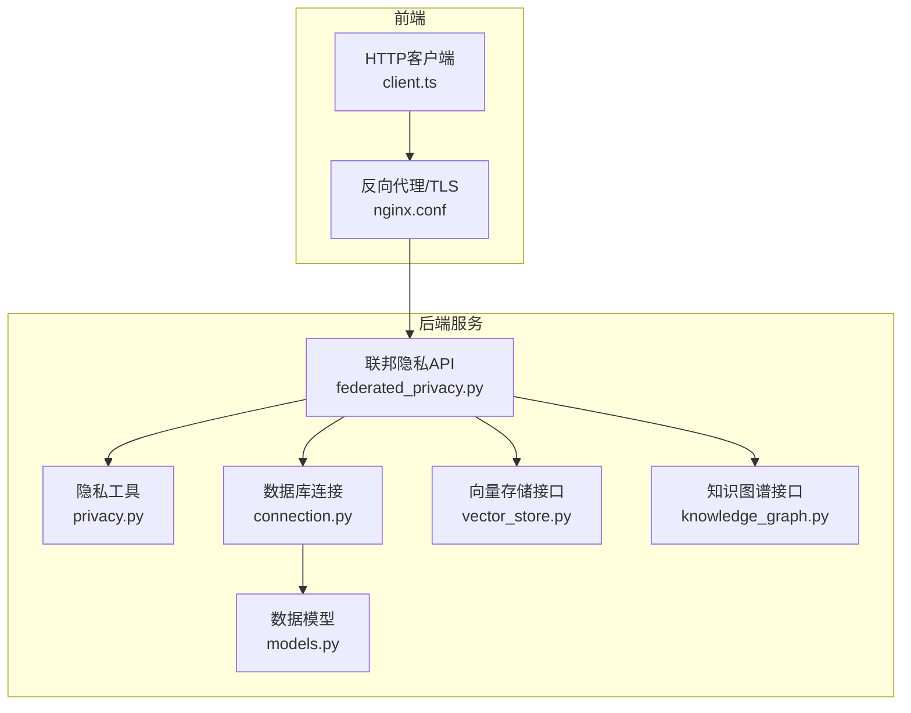
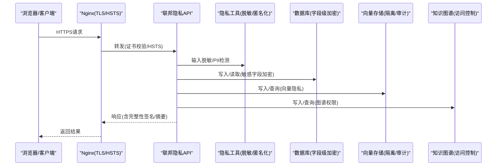
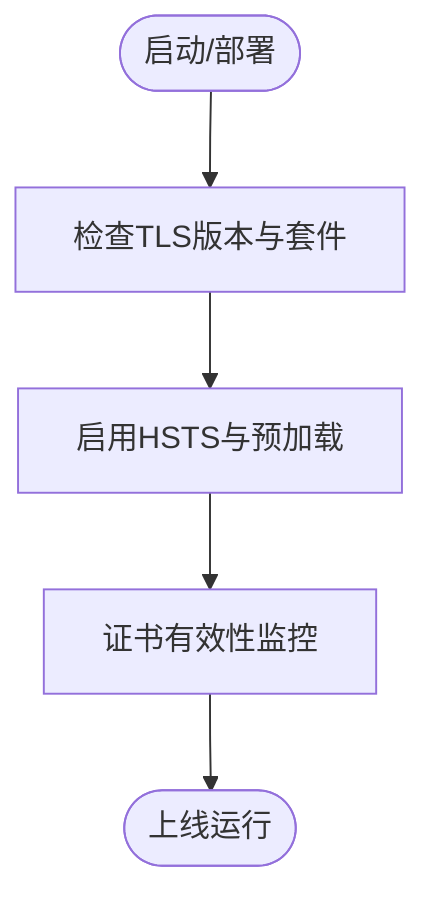
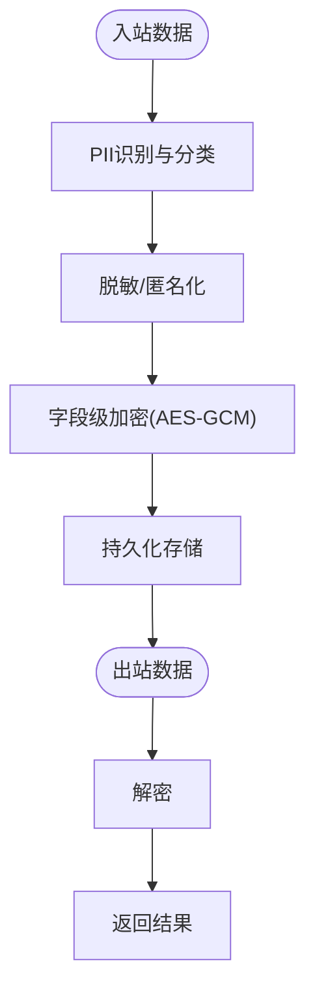
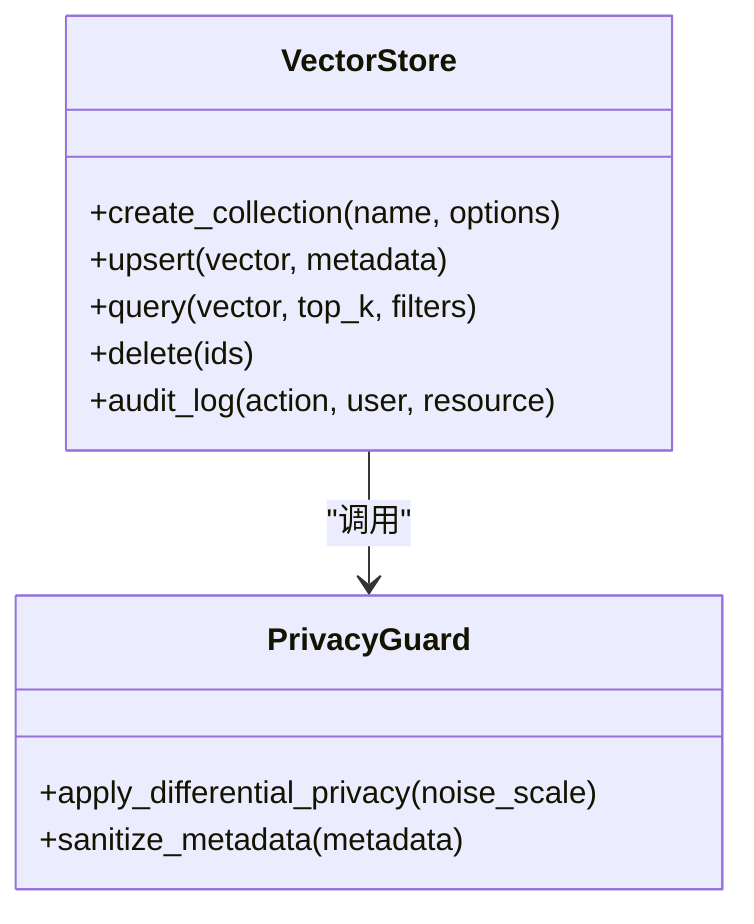
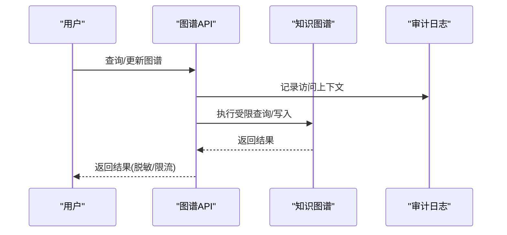
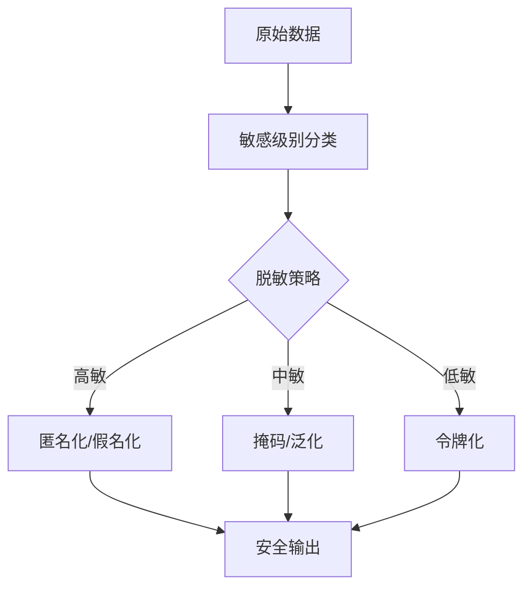
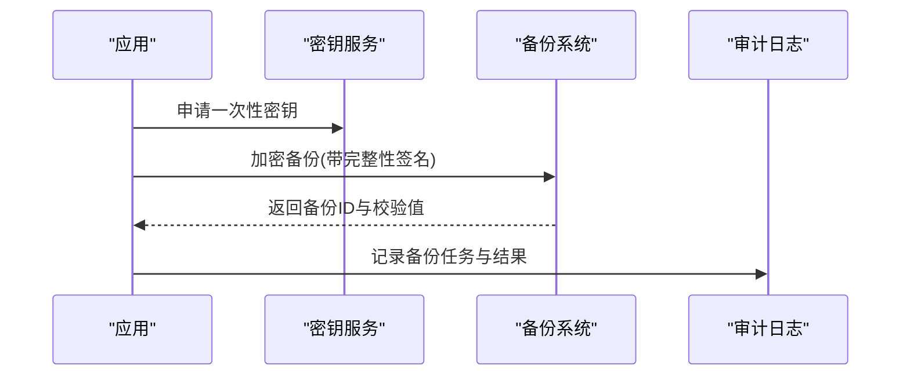
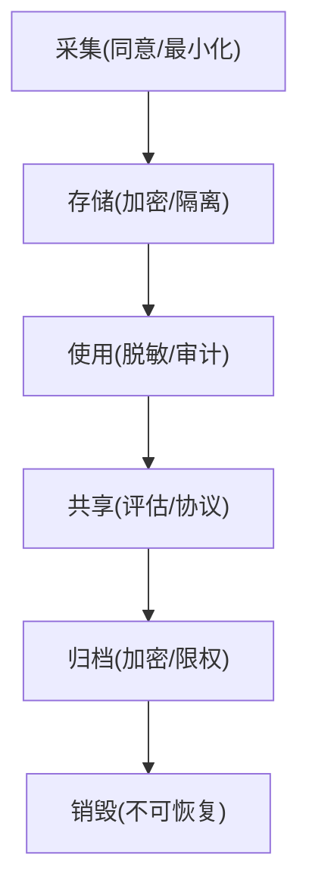
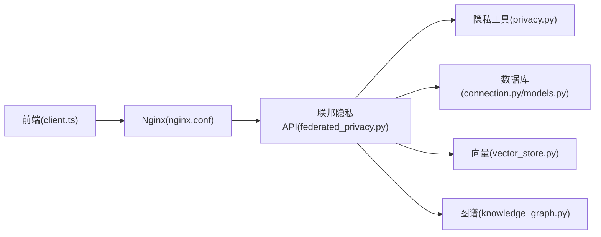

# 数据安全保护

<cite>
**本文引用的文件**   
- [src/loopse/security/privacy.py](file://src/loopse/security/privacy.py)
- [src/loopse/api/federated_privacy.py](file://src/loopse/api/federated_privacy.py)
- [src/loopse/db/connection.py](file://src/loopse/db/connection.py)
- [src/loopse/db/models.py](file://src/loopse/db/models.py)
- [src/loopse/kb/vector_store.py](file://src/loopse/kb/vector_store.py)
- [src/loopse/kb/knowledge_graph.py](file://src/loopse/kb/knowledge_graph.py)
- [frontend/src/api/client.ts](file://frontend/src/api/client.ts)
- [frontend/nginx.conf](file://frontend/nginx.conf)
- [scripts/init_db.py](file://scripts/init_db.py)
</cite>

## 目录
1. [简介](#简介)
2. [项目结构](#项目结构)
3. [核心组件](#核心组件)
4. [架构总览](#架构总览)
5. [详细组件分析](#详细组件分析)
6. [依赖关系分析](#依赖关系分析)
7. [性能考虑](#性能考虑)
8. [故障排查指南](#故障排查指南)
9. [结论](#结论)
10. [附录](#附录)

## 简介
本指南围绕数据全生命周期的安全保护，覆盖敏感数据加密算法选择、传输层TLS配置、存储与字段级加密策略、向量数据隐私保护、知识图谱数据安全、数据脱敏与匿名化、个人信息保护实现、备份加密、传输完整性校验与访问日志审计，以及GDPR合规与生命周期安全管理。文档结合仓库中现有实现进行落地建议与最佳实践说明，帮助团队在工程层面构建可验证、可审计、可演进的数据安全体系。

## 项目结构
与安全相关的关键位置包括：
- 后端安全与隐私模块：src/loopse/security/privacy.py、src/loopse/api/federated_privacy.py
- 数据库连接与模型：src/loopse/db/connection.py、src/loopse/db/models.py
- 知识库（向量与图谱）：src/loopse/kb/vector_store.py、src/loopse/kb/knowledge_graph.py
- 前端HTTP客户端与Nginx配置：frontend/src/api/client.ts、frontend/nginx.conf
- 数据库初始化脚本：scripts/init_db.py

**图示来源**
- [frontend/src/api/client.ts](file://frontend/src/api/client.ts)
- [frontend/nginx.conf](file://frontend/nginx.conf)
- [src/loopse/api/federated_privacy.py](file://src/loopse/api/federated_privacy.py)
- [src/loopse/security/privacy.py](file://src/loopse/security/privacy.py)
- [src/loopse/db/connection.py](file://src/loopse/db/connection.py)
- [src/loopse/db/models.py](file://src/loopse/db/models.py)
- [src/loopse/kb/vector_store.py](file://src/loopse/kb/vector_store.py)
- [src/loopse/kb/knowledge_graph.py](file://src/loopse/kb/knowledge_graph.py)

**章节来源**
- [src/loopse/security/privacy.py](file://src/loopse/security/privacy.py)
- [src/loopse/api/federated_privacy.py](file://src/loopse/api/federated_privacy.py)
- [src/loopse/db/connection.py](file://src/loopse/db/connection.py)
- [src/loopse/db/models.py](file://src/loopse/db/models.py)
- [src/loopse/kb/vector_store.py](file://src/loopse/kb/vector_store.py)
- [src/loopse/kb/knowledge_graph.py](file://src/loopse/kb/knowledge_graph.py)
- [frontend/src/api/client.ts](file://frontend/src/api/client.ts)
- [frontend/nginx.conf](file://frontend/nginx.conf)
- [scripts/init_db.py](file://scripts/init_db.py)

## 核心组件
- 隐私与脱敏工具：提供数据脱敏、匿名化、PII识别与处理等能力，供业务API调用。
- 联邦隐私API：面向跨域或协作场景的隐私计算入口，支持差分隐私、同态或安全聚合等策略的编排。
- 数据库连接与模型：负责连接参数、SSL/TLS开关、字符集与事务控制；模型定义用于标识敏感字段及加密策略。
- 向量存储与知识图谱：分别承载嵌入向量和图结构数据，需关注索引隔离、访问控制与导出审计。
- 前端HTTP客户端与Nginx：统一HTTPS出口、证书管理、HSTS与CSP策略，保障传输安全。

**章节来源**
- [src/loopse/security/privacy.py](file://src/loopse/security/privacy.py)
- [src/loopse/api/federated_privacy.py](file://src/loopse/api/federated_privacy.py)
- [src/loopse/db/connection.py](file://src/loopse/db/connection.py)
- [src/loopse/db/models.py](file://src/loopse/db/models.py)
- [src/loopse/kb/vector_store.py](file://src/loopse/kb/vector_store.py)
- [src/loopse/kb/knowledge_graph.py](file://src/loopse/kb/knowledge_graph.py)
- [frontend/src/api/client.ts](file://frontend/src/api/client.ts)
- [frontend/nginx.conf](file://frontend/nginx.conf)

## 架构总览
下图展示从前端到后端的请求路径，以及在关键节点的安全控制点（TLS、鉴权、脱敏、加密、审计）。

**图示来源**
- [frontend/nginx.conf](file://frontend/nginx.conf)
- [src/loopse/api/federated_privacy.py](file://src/loopse/api/federated_privacy.py)
- [src/loopse/security/privacy.py](file://src/loopse/security/privacy.py)
- [src/loopse/db/connection.py](file://src/loopse/db/connection.py)
- [src/loopse/kb/vector_store.py](file://src/loopse/kb/vector_store.py)
- [src/loopse/kb/knowledge_graph.py](file://src/loopse/kb/knowledge_graph.py)

## 详细组件分析

### 敏感数据加密算法选择与密钥管理
- 对称加密：推荐AES-GCM用于字段级加密，兼顾机密性与完整性校验。
- 非对称加密：使用RSA-OAEP或ECIES用于密钥信封与远程安全交换。
- 哈希与签名：SHA-256/SHA-3用于完整性校验；EdDSA/RSA-PSS用于数字签名。
- 密钥管理：采用KMS/HSM托管主密钥，应用层仅持有密文与短期会话密钥；定期轮换并记录审计。

实施要点
- 在数据入库前对敏感字段执行加密，出库后解密再返回给上层。
- 为不同环境（开发/测试/生产）分离密钥与凭证。
- 对导出与备份数据强制二次加密。

**章节来源**
- [src/loopse/db/models.py](file://src/loopse/db/models.py)
- [src/loopse/db/connection.py](file://src/loopse/db/connection.py)

### 数据传输TLS配置
- 强制HTTPS：全站启用TLS 1.2+，禁用弱套件，开启HSTS。
- 证书管理：使用受信任CA签发的证书，自动续期与监控过期。
- 前端客户端：统一通过HTTPS发起请求，禁止明文回退。
- 反向代理：Nginx集中终止TLS，统一安全头（HSTS、CSP、X-Frame-Options等）。

**图示来源**
- [frontend/nginx.conf](file://frontend/nginx.conf)
- [frontend/src/api/client.ts](file://frontend/src/api/client.ts)

**章节来源**
- [frontend/nginx.conf](file://frontend/nginx.conf)
- [frontend/src/api/client.ts](file://frontend/src/api/client.ts)

### 数据存储加密策略与字段级加密
- 表结构设计：为敏感字段增加“是否加密”标记与算法版本元数据，便于迁移与审计。
- 加密流程：入站→脱敏/去标识化→字段级加密→落库；出站→解密→脱敏→返回。
- 索引与查询：对需要精确匹配的字段采用确定性加密或可搜索加密方案，权衡性能与安全性。
- 备份与归档：对备份文件进行独立密钥加密，保留恢复演练记录。

**图示来源**
- [src/loopse/security/privacy.py](file://src/loopse/security/privacy.py)
- [src/loopse/db/models.py](file://src/loopse/db/models.py)
- [src/loopse/db/connection.py](file://src/loopse/db/connection.py)

**章节来源**
- [src/loopse/security/privacy.py](file://src/loopse/security/privacy.py)
- [src/loopse/db/models.py](file://src/loopse/db/models.py)
- [src/loopse/db/connection.py](file://src/loopse/db/connection.py)

### 向量数据隐私保护
- 向量隔离：按租户/项目隔离向量空间，限制跨域检索。
- 最小暴露：仅在内存中短暂持有明文向量，避免落盘；必要时使用内存加密或专用向量库的加密特性。
- 访问审计：记录向量读写操作、查询条件与结果数量，防止推断攻击。
- 差分隐私：在训练或聚合阶段引入噪声，降低个体信息泄露风险。

**图示来源**
- [src/loopse/kb/vector_store.py](file://src/loopse/kb/vector_store.py)
- [src/loopse/security/privacy.py](file://src/loopse/security/privacy.py)

**章节来源**
- [src/loopse/kb/vector_store.py](file://src/loopse/kb/vector_store.py)
- [src/loopse/security/privacy.py](file://src/loopse/security/privacy.py)

### 知识图谱数据安全
- 节点/边访问控制：基于角色与资源标签的细粒度授权。
- 导出管控：对图谱快照导出进行审批与水印，限制批量下载。
- 变更审计：记录增删改操作、操作者与时间戳，支持回溯。
- 图查询防护：限制深度与扇出，防止枚举与推理攻击。

**图示来源**
- [src/loopse/kb/knowledge_graph.py](file://src/loopse/kb/knowledge_graph.py)

**章节来源**
- [src/loopse/kb/knowledge_graph.py](file://src/loopse/kb/knowledge_graph.py)

### 数据脱敏技术与匿名化处理
- 静态脱敏：对报表、日志与测试数据输出前进行掩码、泛化、替换。
- 动态脱敏：根据调用者权限在查询时按需脱敏。
- 匿名化与假名化：移除直接标识符，保留分析价值；建立重标识风险评估机制。
- 合规性：遵循最小必要原则与目的限定，确保可撤销与删除。

**图示来源**
- [src/loopse/security/privacy.py](file://src/loopse/security/privacy.py)

**章节来源**
- [src/loopse/security/privacy.py](file://src/loopse/security/privacy.py)

### 个人信息保护实现
- 同意与撤回：在注册/首次收集时获取明确同意，并提供便捷撤回渠道。
- 数据主体权利：支持查询、更正、删除与携带导出。
- 最小化采集：仅收集达成目的所需的最小字段。
- 第三方共享：对外共享需评估风险并签署数据处理协议。

**章节来源**
- [src/loopse/api/federated_privacy.py](file://src/loopse/api/federated_privacy.py)
- [src/loopse/security/privacy.py](file://src/loopse/security/privacy.py)

### 数据备份加密、传输完整性验证与访问日志审计
- 备份加密：对备份包使用独立密钥加密，离线保存密钥材料。
- 完整性校验：对传输与落盘数据计算哈希/签名，恢复时校验一致性。
- 访问审计：记录API调用、数据访问、权限变更与异常事件，集中留存与告警。

**图示来源**
- [src/loopse/db/connection.py](file://src/loopse/db/connection.py)
- [src/loopse/api/federated_privacy.py](file://src/loopse/api/federated_privacy.py)

**章节来源**
- [src/loopse/db/connection.py](file://src/loopse/db/connection.py)
- [src/loopse/api/federated_privacy.py](file://src/loopse/api/federated_privacy.py)

### GDPR合规要求与数据生命周期安全管理
- 合法基础与透明性：明确数据处理目的、范围与保留期限。
- 跨境传输：采用标准合同条款或白名单机制，并进行影响评估。
- 生命周期：采集→存储→使用→共享→归档→销毁，各环节均设安全控制与审计。
- 事件响应：制定泄露应急预案，规定上报时限与补救措施。

**章节来源**
- [src/loopse/api/federated_privacy.py](file://src/loopse/api/federated_privacy.py)
- [src/loopse/security/privacy.py](file://src/loopse/security/privacy.py)

## 依赖关系分析
- 组件耦合：API层依赖隐私工具与数据库/向量/图谱接口；前端通过Nginx统一出口。
- 外部依赖：TLS证书与KMS/HSM、向量库与图数据库、审计日志系统。
- 潜在风险：密钥泄露、越权访问、向量/图谱推断攻击、备份未加密。

**图示来源**
- [frontend/src/api/client.ts](file://frontend/src/api/client.ts)
- [frontend/nginx.conf](file://frontend/nginx.conf)
- [src/loopse/api/federated_privacy.py](file://src/loopse/api/federated_privacy.py)
- [src/loopse/security/privacy.py](file://src/loopse/security/privacy.py)
- [src/loopse/db/connection.py](file://src/loopse/db/connection.py)
- [src/loopse/db/models.py](file://src/loopse/db/models.py)
- [src/loopse/kb/vector_store.py](file://src/loopse/kb/vector_store.py)
- [src/loopse/kb/knowledge_graph.py](file://src/loopse/kb/knowledge_graph.py)

**章节来源**
- [frontend/src/api/client.ts](file://frontend/src/api/client.ts)
- [frontend/nginx.conf](file://frontend/nginx.conf)
- [src/loopse/api/federated_privacy.py](file://src/loopse/api/federated_privacy.py)
- [src/loopse/security/privacy.py](file://src/loopse/security/privacy.py)
- [src/loopse/db/connection.py](file://src/loopse/db/connection.py)
- [src/loopse/db/models.py](file://src/loopse/db/models.py)
- [src/loopse/kb/vector_store.py](file://src/loopse/kb/vector_store.py)
- [src/loopse/kb/knowledge_graph.py](file://src/loopse/kb/knowledge_graph.py)

## 性能考虑
- 字段级加密开销：在高并发写入场景下，优先使用硬件加速与批处理；对热点字段采用缓存与只读副本。
- TLS握手成本：启用会话复用与OCSP Stapling，减少延迟。
- 向量/图谱查询：合理设置top_k与过滤条件，避免全表扫描；对高频查询建立物化视图或索引。
- 审计日志：异步写入与轮转，避免阻塞主链路。

[本节为通用指导，不直接分析具体文件]

## 故障排查指南
- TLS问题：检查证书链、SNI与协议版本；确认HSTS与CSP策略是否正确生效。
- 字段级加密失败：核对算法版本与密钥ID；检查密文长度与IV/盐是否匹配。
- 向量/图谱越权：复核访问控制列表与租户隔离；审查审计日志定位异常来源。
- 备份恢复失败：校验完整性签名与密钥可用性；确认备份介质与权限。

**章节来源**
- [frontend/nginx.conf](file://frontend/nginx.conf)
- [src/loopse/db/connection.py](file://src/loopse/db/connection.py)
- [src/loopse/kb/vector_store.py](file://src/loopse/kb/vector_store.py)
- [src/loopse/kb/knowledge_graph.py](file://src/loopse/kb/knowledge_graph.py)

## 结论
通过在传输、存储、使用与共享各阶段落实加密、脱敏、访问控制与审计，并结合GDPR合规与生命周期管理，可在保障用户体验的同时显著提升数据安全水位。建议持续完善密钥管理、自动化合规检查与演练，形成闭环治理。

[本节为总结性内容，不直接分析具体文件]

## 附录
- 术语
  - PII：个人可识别信息
  - HSTS：HTTP严格传输安全
  - CSP：内容安全策略
  - KMS：密钥管理服务
  - HSM：硬件安全模块
- 参考实现路径
  - 隐私工具与脱敏：[src/loopse/security/privacy.py](file://src/loopse/security/privacy.py)
  - 联邦隐私API：[src/loopse/api/federated_privacy.py](file://src/loopse/api/federated_privacy.py)
  - 数据库连接与模型：[src/loopse/db/connection.py](file://src/loopse/db/connection.py)、[src/loopse/db/models.py](file://src/loopse/db/models.py)
  - 向量与图谱：[src/loopse/kb/vector_store.py](file://src/loopse/kb/vector_store.py)、[src/loopse/kb/knowledge_graph.py](file://src/loopse/kb/knowledge_graph.py)
  - 前端与Nginx：[frontend/src/api/client.ts](file://frontend/src/api/client.ts)、[frontend/nginx.conf](file://frontend/nginx.conf)
  - 数据库初始化：[scripts/init_db.py](file://scripts/init_db.py)