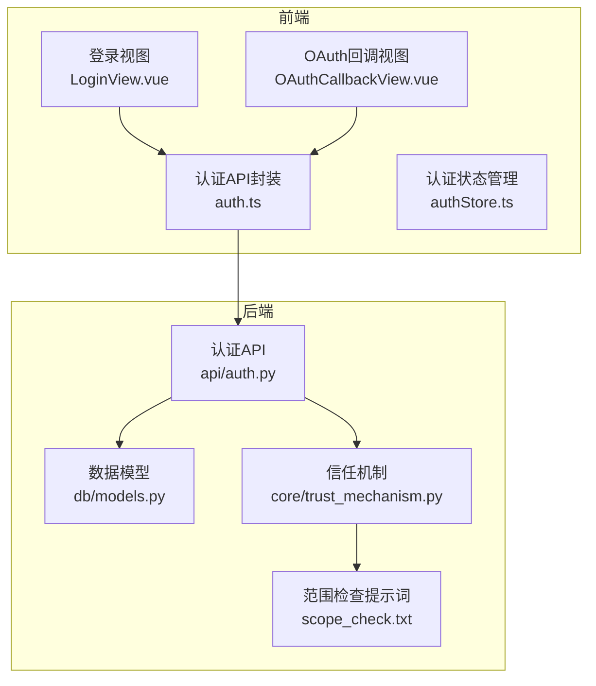
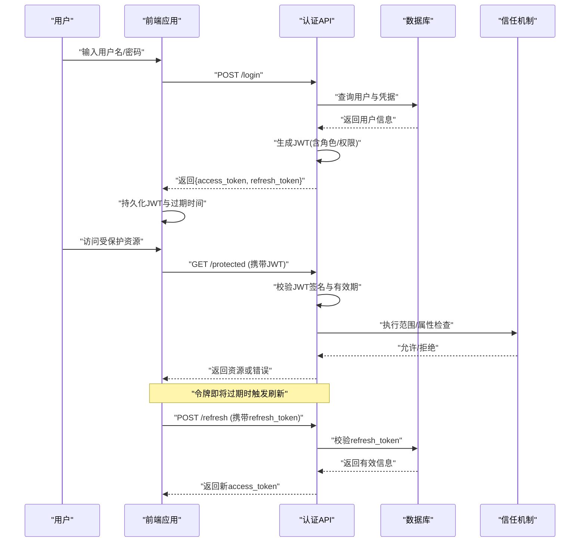
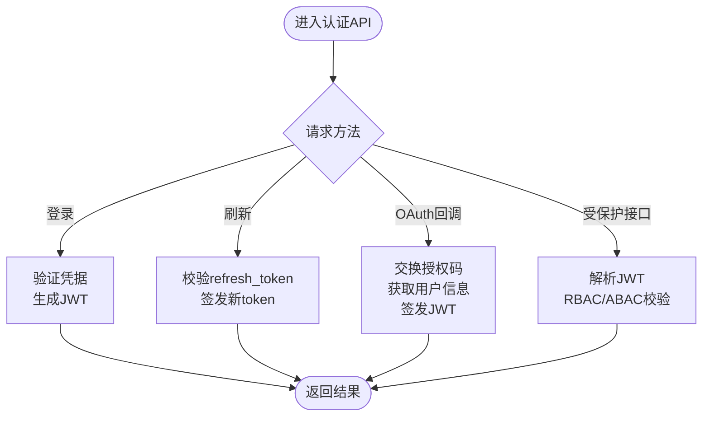
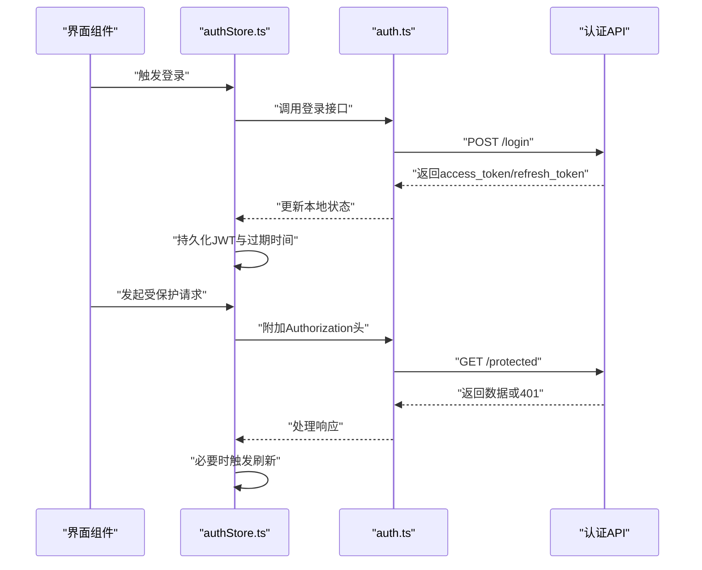
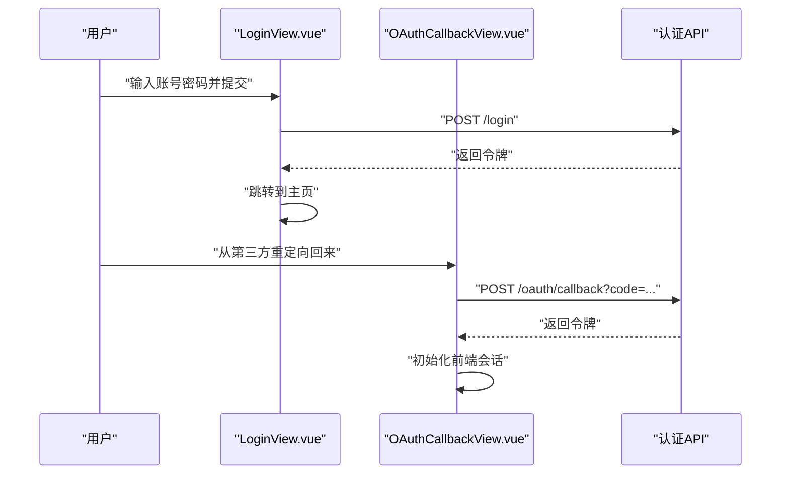
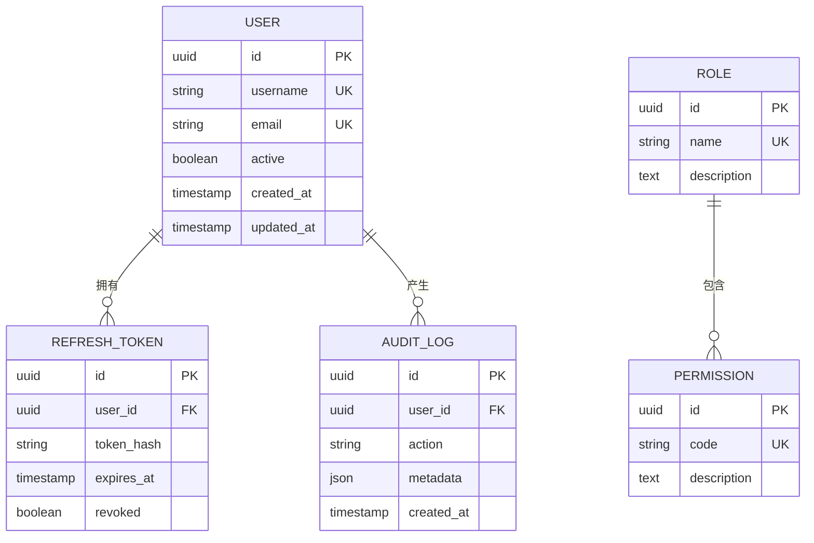
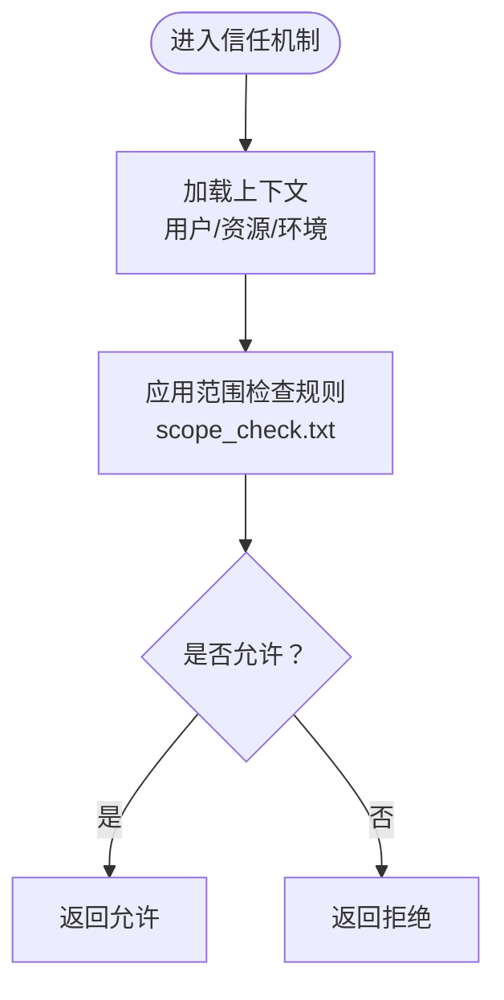
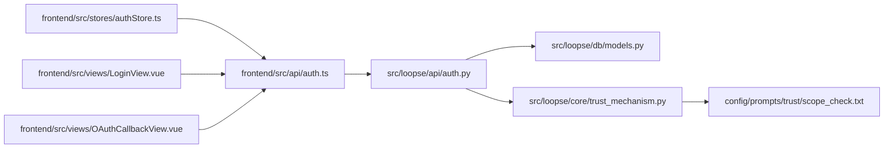

# 身份认证与授权

<cite>
**本文引用的文件**   
- [src/loopse/api/auth.py](file://src/loopse/api/auth.py)
- [frontend/src/api/auth.ts](file://frontend/src/api/auth.ts)
- [frontend/src/stores/authStore.ts](file://frontend/src/stores/authStore.ts)
- [frontend/src/views/LoginView.vue](file://frontend/src/views/LoginView.vue)
- [frontend/src/views/OAuthCallbackView.vue](file://frontend/src/views/OAuthCallbackView.vue)
- [src/loopse/db/models.py](file://src/loopse/db/models.py)
- [src/loopse/core/trust_mechanism.py](file://src/loopse/core/trust_mechanism.py)
- [config/prompts/trust/scope_check.txt](file://config/prompts/trust/scope_check.txt)
</cite>

## 目录
1. [简介](#简介)
2. [项目结构](#项目结构)
3. [核心组件](#核心组件)
4. [架构总览](#架构总览)
5. [详细组件分析](#详细组件分析)
6. [依赖关系分析](#依赖关系分析)
7. [性能考虑](#性能考虑)
8. [故障排查指南](#故障排查指南)
9. [结论](#结论)
10. [附录](#附录)

## 简介
本文件围绕项目的身份认证与授权体系，系统性说明以下主题：
- JWT令牌管理机制（签发、校验、刷新）
- 用户权限控制模型（RBAC与ABAC）
- 会话管理策略（前端状态、后端校验）
- OAuth2集成实现（登录回调流程）
- API密钥管理与安全存储方案
- 常见安全漏洞防护与最佳实践

该文档面向开发者与安全工程师，兼顾可读性与可落地性。

## 项目结构
认证与授权相关代码主要分布在前后端：
- 后端API层：提供认证接口、权限校验中间件、OAuth回调处理等
- 数据库模型：定义用户、角色、权限、令牌等实体
- 信任机制：用于范围检查与资源访问决策
- 前端：负责登录交互、OAuth回调、JWT存储与会话状态管理

图表来源
- [src/loopse/api/auth.py](file://src/loopse/api/auth.py)
- [frontend/src/api/auth.ts](file://frontend/src/api/auth.ts)
- [frontend/src/stores/authStore.ts](file://frontend/src/stores/authStore.ts)
- [frontend/src/views/LoginView.vue](file://frontend/src/views/LoginView.vue)
- [frontend/src/views/OAuthCallbackView.vue](file://frontend/src/views/OAuthCallbackView.vue)
- [src/loopse/db/models.py](file://src/loopse/db/models.py)
- [src/loopse/core/trust_mechanism.py](file://src/loopse/core/trust_mechanism.py)
- [config/prompts/trust/scope_check.txt](file://config/prompts/trust/scope_check.txt)

章节来源
- [src/loopse/api/auth.py](file://src/loopse/api/auth.py)
- [frontend/src/api/auth.ts](file://frontend/src/api/auth.ts)
- [frontend/src/stores/authStore.ts](file://frontend/src/stores/authStore.ts)
- [frontend/src/views/LoginView.vue](file://frontend/src/views/LoginView.vue)
- [frontend/src/views/OAuthCallbackView.vue](file://frontend/src/views/OAuthCallbackView.vue)
- [src/loopse/db/models.py](file://src/loopse/db/models.py)
- [src/loopse/core/trust_mechanism.py](file://src/loopse/core/trust_mechanism.py)
- [config/prompts/trust/scope_check.txt](file://config/prompts/trust/scope_check.txt)

## 核心组件
- 认证API（后端）
  - 负责用户登录、注册、令牌签发与刷新、OAuth回调处理、权限校验入口等
- 认证API（前端）
  - 封装登录、登出、刷新令牌、获取当前用户信息、OAuth跳转与回调处理等请求
- 认证状态管理（前端）
  - 维护登录态、JWT存取、过期时间、自动刷新逻辑
- 数据模型（后端）
  - 定义用户、角色、权限、令牌、审计日志等表结构
- 信任机制（后端）
  - 提供范围检查、属性评估、访问决策辅助能力
- 范围检查提示词（配置）
  - 为基于属性的访问控制提供上下文与规则描述

章节来源
- [src/loopse/api/auth.py](file://src/loopse/api/auth.py)
- [frontend/src/api/auth.ts](file://frontend/src/api/auth.ts)
- [frontend/src/stores/authStore.ts](file://frontend/src/stores/authStore.ts)
- [src/loopse/db/models.py](file://src/loopse/db/models.py)
- [src/loopse/core/trust_mechanism.py](file://src/loopse/core/trust_mechanism.py)
- [config/prompts/trust/scope_check.txt](file://config/prompts/trust/scope_check.txt)

## 架构总览
整体认证与授权流程如下：
- 用户通过前端登录或OAuth登录
- 后端验证凭据并签发JWT（含必要声明）
- 前端保存JWT并在后续请求中携带
- 后端在受保护接口处校验JWT并进行权限判断（RBAC/ABAC）
- 支持令牌刷新以维持长会话
- 信任机制与范围检查提示词辅助细粒度访问控制

图表来源
- [src/loopse/api/auth.py](file://src/loopse/api/auth.py)
- [frontend/src/api/auth.ts](file://frontend/src/api/auth.ts)
- [frontend/src/stores/authStore.ts](file://frontend/src/stores/authStore.ts)
- [src/loopse/db/models.py](file://src/loopse/db/models.py)
- [src/loopse/core/trust_mechanism.py](file://src/loopse/core/trust_mechanism.py)

## 详细组件分析

### 认证API（后端）
职责与要点：
- 登录与注册：验证凭据、创建用户、签发JWT
- 令牌刷新：校验refresh_token、签发新access_token
- OAuth回调：接收第三方授权码、换取用户信息、签发JWT
- 权限校验：解析JWT中的角色/权限声明，结合信任机制进行访问控制
- 安全策略：最小权限原则、敏感字段脱敏、速率限制建议

图表来源
- [src/loopse/api/auth.py](file://src/loopse/api/auth.py)

章节来源
- [src/loopse/api/auth.py](file://src/loopse/api/auth.py)

### 认证API（前端）
职责与要点：
- 封装登录、登出、刷新令牌、获取用户信息等HTTP调用
- 统一拦截器注入Authorization头
- 错误处理与重试策略（如网络异常、令牌失效）

图表来源
- [frontend/src/api/auth.ts](file://frontend/src/api/auth.ts)
- [frontend/src/stores/authStore.ts](file://frontend/src/stores/authStore.ts)
- [src/loopse/api/auth.py](file://src/loopse/api/auth.py)

章节来源
- [frontend/src/api/auth.ts](file://frontend/src/api/auth.ts)
- [frontend/src/stores/authStore.ts](file://frontend/src/stores/authStore.ts)

### 登录视图与OAuth回调（前端）
职责与要点：
- 登录视图：收集凭据、调用认证API、展示错误与成功反馈
- OAuth回调视图：接收授权码、调用后端换取令牌、完成登录态初始化

图表来源
- [frontend/src/views/LoginView.vue](file://frontend/src/views/LoginView.vue)
- [frontend/src/views/OAuthCallbackView.vue](file://frontend/src/views/OAuthCallbackView.vue)
- [src/loopse/api/auth.py](file://src/loopse/api/auth.py)

章节来源
- [frontend/src/views/LoginView.vue](file://frontend/src/views/LoginView.vue)
- [frontend/src/views/OAuthCallbackView.vue](file://frontend/src/views/OAuthCallbackView.vue)

### 数据模型（后端）
职责与要点：
- 用户表：存储用户基本信息、状态、时间戳
- 角色与权限表：支持RBAC的多角色与多权限组合
- 令牌表：记录refresh_token及其元数据（过期时间、绑定用户）
- 审计日志表：记录认证与授权事件，便于追踪与合规

图表来源
- [src/loopse/db/models.py](file://src/loopse/db/models.py)

章节来源
- [src/loopse/db/models.py](file://src/loopse/db/models.py)

### 信任机制与范围检查（后端）
职责与要点：
- 范围检查：根据资源、操作、上下文条件判定是否允许访问
- ABAC支持：结合用户属性、资源属性与环境属性进行动态决策
- 提示词驱动：使用范围检查提示词作为规则与上下文的载体

图表来源
- [src/loopse/core/trust_mechanism.py](file://src/loopse/core/trust_mechanism.py)
- [config/prompts/trust/scope_check.txt](file://config/prompts/trust/scope_check.txt)

章节来源
- [src/loopse/core/trust_mechanism.py](file://src/loopse/core/trust_mechanism.py)
- [config/prompts/trust/scope_check.txt](file://config/prompts/trust/scope_check.txt)

## 依赖关系分析
- 前端依赖
  - auth.ts依赖认证API；authStore.ts依赖auth.ts并提供全局状态
  - LoginView.vue与OAuthCallbackView.vue依赖auth.ts进行交互
- 后端依赖
  - api/auth.py依赖db/models.py进行用户与令牌持久化
  - api/auth.py依赖trust_mechanism.py进行范围与属性检查
  - trust_mechanism.py依赖scope_check.txt作为规则与上下文

图表来源
- [frontend/src/api/auth.ts](file://frontend/src/api/auth.ts)
- [frontend/src/stores/authStore.ts](file://frontend/src/stores/authStore.ts)
- [frontend/src/views/LoginView.vue](file://frontend/src/views/LoginView.vue)
- [frontend/src/views/OAuthCallbackView.vue](file://frontend/src/views/OAuthCallbackView.vue)
- [src/loopse/api/auth.py](file://src/loopse/api/auth.py)
- [src/loopse/db/models.py](file://src/loopse/db/models.py)
- [src/loopse/core/trust_mechanism.py](file://src/loopse/core/trust_mechanism.py)
- [config/prompts/trust/scope_check.txt](file://config/prompts/trust/scope_check.txt)

章节来源
- [frontend/src/api/auth.ts](file://frontend/src/api/auth.ts)
- [frontend/src/stores/authStore.ts](file://frontend/src/stores/authStore.ts)
- [frontend/src/views/LoginView.vue](file://frontend/src/views/LoginView.vue)
- [frontend/src/views/OAuthCallbackView.vue](file://frontend/src/views/OAuthCallbackView.vue)
- [src/loopse/api/auth.py](file://src/loopse/api/auth.py)
- [src/loopse/db/models.py](file://src/loopse/db/models.py)
- [src/loopse/core/trust_mechanism.py](file://src/loopse/core/trust_mechanism.py)
- [config/prompts/trust/scope_check.txt](file://config/prompts/trust/scope_check.txt)

## 性能考虑
- 令牌校验优化
  - 使用内存缓存校验黑名单（撤销的refresh_token）
  - 对JWT签名校验采用轻量算法与短生命周期access_token
- 并发与限流
  - 对登录与刷新接口实施速率限制，防止暴力破解与令牌风暴
- 数据库查询优化
  - 对用户与令牌查询建立索引，减少锁竞争
- 前端刷新策略
  - 在令牌过期前N秒主动刷新，避免批量401抖动

[本节为通用指导，不直接分析具体文件]

## 故障排查指南
常见问题与定位步骤：
- 401未授权
  - 检查前端是否正确携带Authorization头
  - 检查JWT是否过期或被撤销
  - 查看后端日志中的范围检查结果
- 403禁止访问
  - 确认用户角色与权限是否满足RBAC要求
  - 检查ABAC规则与上下文属性是否匹配
- OAuth登录失败
  - 核对授权码有效性与时钟同步
  - 检查回调URL与客户端ID配置
- 刷新令牌失败
  - 检查refresh_token是否已过期或被撤销
  - 确认数据库中存在对应记录且未被标记为撤销

章节来源
- [src/loopse/api/auth.py](file://src/loopse/api/auth.py)
- [src/loopse/core/trust_mechanism.py](file://src/loopse/core/trust_mechanism.py)
- [frontend/src/api/auth.ts](file://frontend/src/api/auth.ts)
- [frontend/src/stores/authStore.ts](file://frontend/src/stores/authStore.ts)

## 结论
本项目在后端提供了完整的认证与授权能力，包括JWT签发与校验、RBAC与ABAC混合控制、OAuth集成与令牌刷新机制；在前端实现了稳定的会话管理与自动刷新策略。通过信任机制与范围检查提示词，系统具备可扩展的细粒度访问控制能力。建议在生产环境中进一步落实速率限制、审计日志与密钥轮换等安全措施。

[本节为总结性内容，不直接分析具体文件]

## 附录

### RBAC与ABAC设计要点
- RBAC
  - 角色与权限分离，用户分配多角色，权限聚合到角色
  - 接口级与资源级双重校验
- ABAC
  - 基于用户/资源/环境属性进行动态决策
  - 使用范围检查提示词承载规则与上下文

章节来源
- [src/loopse/core/trust_mechanism.py](file://src/loopse/core/trust_mechanism.py)
- [config/prompts/trust/scope_check.txt](file://config/prompts/trust/scope_check.txt)

### API密钥管理与安全存储
- 服务端密钥
  - 使用环境变量或密钥管理服务（KMS）存储JWT签名密钥与第三方OAuth密钥
  - 定期轮换与版本化管理
- 客户端存储
  - 优先使用HttpOnly Cookie存储敏感令牌
  - 若必须使用localStorage，需配合严格的CSP与XSS防护

章节来源
- [src/loopse/api/auth.py](file://src/loopse/api/auth.py)
- [frontend/src/stores/authStore.ts](file://frontend/src/stores/authStore.ts)

### 常见安全漏洞防护与最佳实践
- 防暴力破解：登录与刷新接口限流、账户锁定策略
- 防令牌泄露：HTTPS强制、短生命周期access_token、refresh_token撤销机制
- 防CSRF：SameSite Cookie策略、自定义Header校验
- 防XSS：严格输出编码、CSP策略、最小权限原则
- 审计与合规：记录认证与授权事件，保留必要日志但不记录敏感数据

[本节为通用指导，不直接分析具体文件]