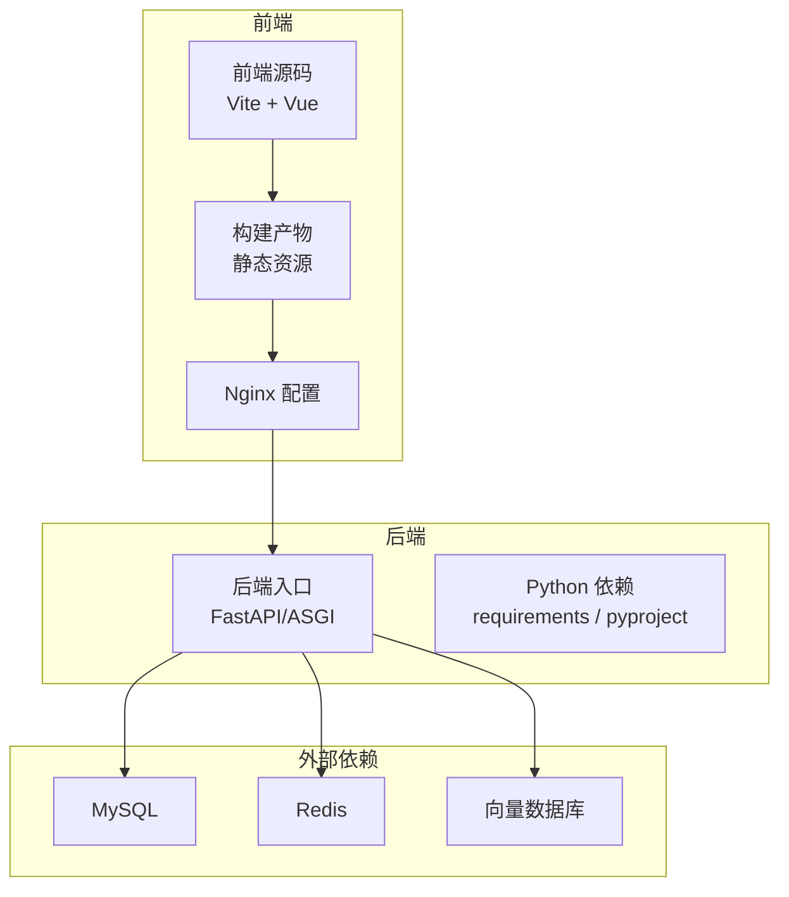
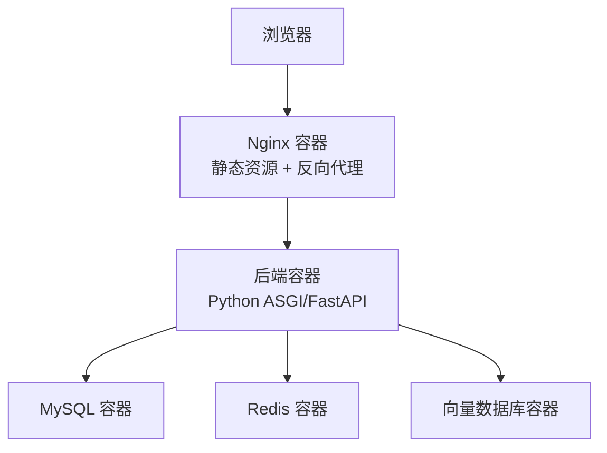
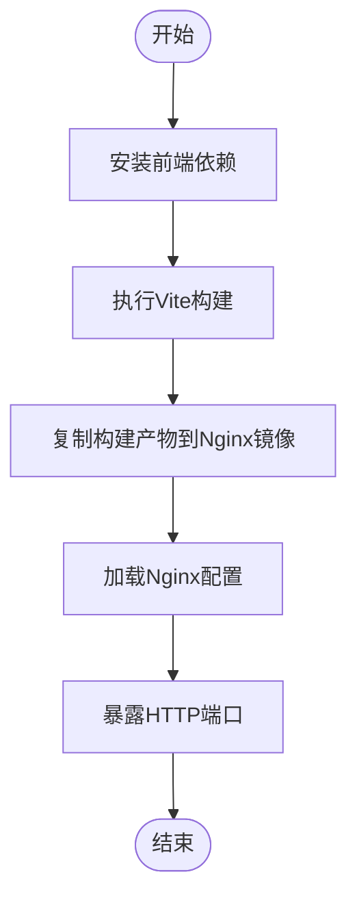
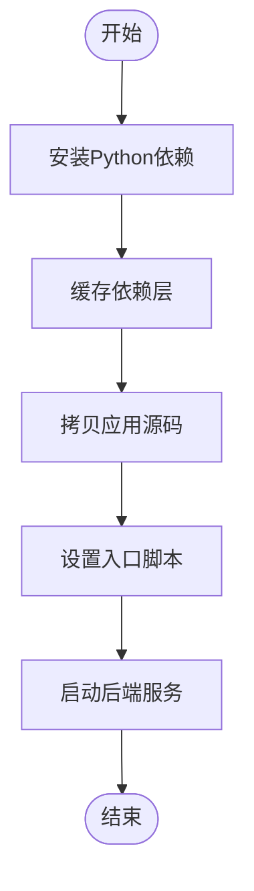
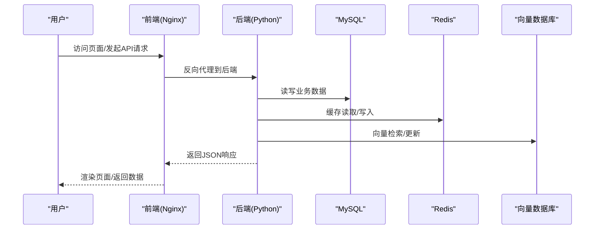
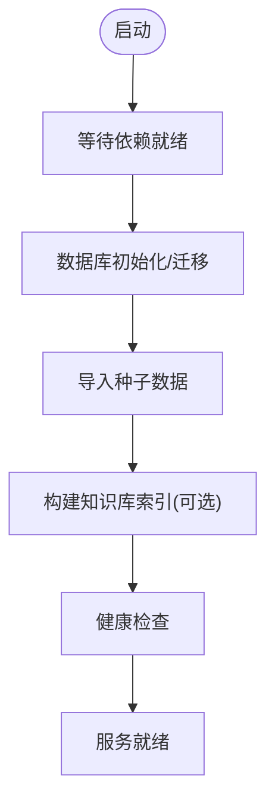
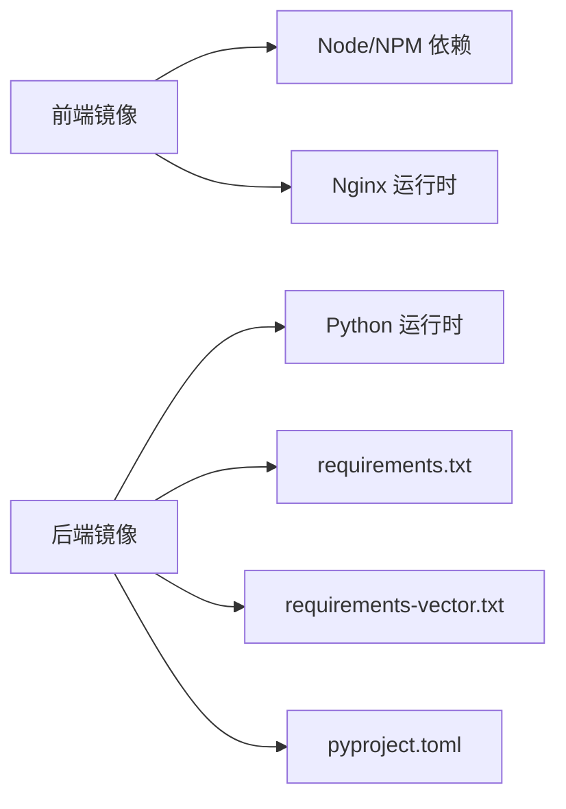

# Docker容器化

<cite>
**本文引用的文件**   
- [frontend/nginx.conf](file://frontend/nginx.conf)
- [frontend/package.json](file://frontend/package.json)
- [frontend/vite.config.ts](file://frontend/vite.config.ts)
- [src/loopse/main.py](file://src/loopse/main.py)
- [requirements.txt](file://requirements.txt)
- [requirements-vector.txt](file://requirements-vector.txt)
- [pyproject.toml](file://pyproject.toml)
- [start.sh](file://start.sh)
</cite>

## 目录
1. [简介](#简介)
2. [项目结构](#项目结构)
3. [核心组件](#核心组件)
4. [架构总览](#架构总览)
5. [详细组件分析](#详细组件分析)
6. [依赖分析](#依赖分析)
7. [性能考虑](#性能考虑)
8. [故障排查指南](#故障排查指南)
9. [结论](#结论)
10. [附录](#附录)

## 简介
本文件面向Socrates-Cube项目的Docker容器化与编排，覆盖前后端镜像构建策略、多阶段构建优化、镜像分层设计与依赖管理；给出Dockerfile编写规范、环境变量配置与端口映射设置；提供包含MySQL、Redis、向量数据库等依赖服务的docker-compose编排方案；说明数据卷挂载、网络通信与服务发现机制；并给出镜像推送、版本管理与安全扫描的最佳实践。文档同时结合仓库中现有前端静态资源构建产物与后端服务入口，确保建议与代码实际一致。

## 项目结构
从容器化视角，项目可划分为：
- 前端：基于Vite构建的静态站点，使用Nginx作为HTTP服务器对外提供服务。
- 后端：Python应用，入口位于后端主模块，依赖通过requirements与pyproject定义。
- 脚本与初始化：启动脚本与数据库/知识库初始化脚本用于环境准备。

**图表来源** 
- [frontend/nginx.conf](file://frontend/nginx.conf)
- [frontend/vite.config.ts](file://frontend/vite.config.ts)
- [src/loopse/main.py](file://src/loopse/main.py)
- [requirements.txt](file://requirements.txt)
- [requirements-vector.txt](file://requirements-vector.txt)
- [pyproject.toml](file://pyproject.toml)

**章节来源**
- [frontend/nginx.conf](file://frontend/nginx.conf)
- [frontend/vite.config.ts](file://frontend/vite.config.ts)
- [src/loopse/main.py](file://src/loopse/main.py)
- [requirements.txt](file://requirements.txt)
- [requirements-vector.txt](file://requirements-vector.txt)
- [pyproject.toml](file://pyproject.toml)

## 核心组件
- 前端镜像
  - 构建期：Node.js环境执行Vite构建，产出静态资源。
  - 运行期：Nginx提供静态资源服务，反向代理至后端API。
- 后端镜像
  - 构建期：Python环境安装依赖（含向量库），生成缓存层以加速重复构建。
  - 运行期：轻量运行时镜像，仅包含必要依赖与二进制。
- 编排与数据
  - docker-compose统一编排MySQL、Redis、向量数据库及前后端服务。
  - 数据持久化通过命名卷或绑定挂载实现。
  - 服务间通过Compose自定义网络进行通信，使用服务名作为主机名。

**章节来源**
- [frontend/package.json](file://frontend/package.json)
- [frontend/nginx.conf](file://frontend/nginx.conf)
- [src/loopse/main.py](file://src/loopse/main.py)
- [requirements.txt](file://requirements.txt)
- [requirements-vector.txt](file://requirements-vector.txt)
- [pyproject.toml](file://pyproject.toml)

## 架构总览
下图展示容器化后的系统交互关系：浏览器访问Nginx，Nginx将API请求转发到后端；后端连接MySQL、Redis与向量数据库完成业务逻辑。

**图表来源** 
- [frontend/nginx.conf](file://frontend/nginx.conf)
- [src/loopse/main.py](file://src/loopse/main.py)

## 详细组件分析

### 前端镜像构建策略（多阶段构建）
- 构建阶段
  - 使用Node镜像安装依赖并执行Vite构建，输出静态资源目录。
  - 利用npm/yarn缓存层提升增量构建速度。
- 运行阶段
  - 使用Nginx基础镜像，拷贝构建产物并加载nginx.conf。
  - 暴露HTTP端口，配置反向代理至后端服务域名。
- 关键要点
  - 分离构建与运行依赖，减小最终镜像体积。
  - 使用.dockerignore排除node_modules、dist等无关文件。
  - 环境变量控制构建参数（如API基础路径）。

**图表来源** 
- [frontend/vite.config.ts](file://frontend/vite.config.ts)
- [frontend/nginx.conf](file://frontend/nginx.conf)
- [frontend/package.json](file://frontend/package.json)

**章节来源**
- [frontend/vite.config.ts](file://frontend/vite.config.ts)
- [frontend/nginx.conf](file://frontend/nginx.conf)
- [frontend/package.json](file://frontend/package.json)

### 后端镜像构建策略（多阶段构建）
- 构建阶段
  - 使用Python镜像安装依赖，优先缓存requirements与pyproject锁定的包。
  - 针对向量库依赖，单独构建并缓存，避免每次全量重建。
- 运行阶段
  - 使用精简Python镜像，仅包含运行所需依赖与二进制。
  - 通过入口脚本启动后端进程，监听指定端口。
- 关键要点
  - 分层设计：先拷贝依赖清单再拷贝源码，最大化利用Docker缓存。
  - 非root用户运行，降低安全风险。
  - 环境变量注入数据库地址、密钥等敏感信息。

**图表来源** 
- [requirements.txt](file://requirements.txt)
- [requirements-vector.txt](file://requirements-vector.txt)
- [pyproject.toml](file://pyproject.toml)
- [src/loopse/main.py](file://src/loopse/main.py)

**章节来源**
- [requirements.txt](file://requirements.txt)
- [requirements-vector.txt](file://requirements-vector.txt)
- [pyproject.toml](file://pyproject.toml)
- [src/loopse/main.py](file://src/loopse/main.py)

### 环境变量配置与端口映射
- 前端
  - 构建期变量：控制API基础路径、构建目标等。
  - 运行期变量：Nginx可通过模板替换注入后端服务地址。
- 后端
  - 数据库连接：MySQL主机、端口、用户名、密码、库名。
  - 缓存连接：Redis主机、端口、密码。
  - 向量库连接：主机、端口、认证信息。
  - 日志级别、调试开关、健康检查端点等。
- 端口映射
  - 前端Nginx默认HTTP端口对外暴露。
  - 后端服务端口仅供内部网络访问，不直接暴露给宿主机。

**章节来源**
- [frontend/nginx.conf](file://frontend/nginx.conf)
- [src/loopse/main.py](file://src/loopse/main.py)

### docker-compose编排（MySQL、Redis、向量数据库）
- 服务划分
  - frontend：Nginx容器，提供静态资源与反向代理。
  - backend：Python后端容器，连接各依赖服务。
  - mysql：MySQL数据库容器，数据持久化到命名卷。
  - redis：Redis缓存容器，可选持久化。
  - vector_db：向量数据库容器，按产品选型配置。
- 网络与服务发现
  - 自定义网络隔离，服务间通过服务名解析。
  - 环境变量集中管理，支持不同环境覆盖。
- 数据卷
  - MySQL数据卷、Redis数据卷、向量库数据卷分别持久化。
- 健康检查
  - 为关键服务添加健康检查，保障编排稳定性。

**图表来源** 
- [frontend/nginx.conf](file://frontend/nginx.conf)
- [src/loopse/main.py](file://src/loopse/main.py)

**章节来源**
- [frontend/nginx.conf](file://frontend/nginx.conf)
- [src/loopse/main.py](file://src/loopse/main.py)

### 数据卷挂载、网络通信与服务发现
- 数据卷
  - 使用命名卷持久化MySQL、Redis、向量库数据。
  - 可选绑定挂载配置文件与日志目录，便于本地调试。
- 网络
  - 自定义bridge网络，服务间通过DNS解析服务名。
  - 限制外部暴露端口，仅前端Nginx对外。
- 服务发现
  - 通过compose网络的服务名访问，无需硬编码IP。
  - 环境变量注入服务地址，便于切换环境。

**章节来源**
- [frontend/nginx.conf](file://frontend/nginx.conf)
- [src/loopse/main.py](file://src/loopse/main.py)

### 启动脚本与初始化流程
- 启动脚本
  - 统一入口脚本负责拉起后端进程、等待依赖就绪、执行初始化任务。
- 初始化
  - 数据库迁移与种子数据导入。
  - 知识库构建与索引初始化（按需）。
- 健康检查
  - 在启动后执行简单探测，确保服务可用。

**图表来源** 
- [start.sh](file://start.sh)
- [src/loopse/main.py](file://src/loopse/main.py)

**章节来源**
- [start.sh](file://start.sh)
- [src/loopse/main.py](file://src/loopse/main.py)

## 依赖分析
- 前端依赖
  - Node.js工具链与Vite构建插件。
  - 生产镜像仅包含Nginx与静态资源。
- 后端依赖
  - Python运行时与业务依赖（requirements）。
  - 向量库依赖独立文件，便于分层缓存与选择性安装。
  - pyproject用于元数据与可选依赖声明。

**图表来源** 
- [frontend/package.json](file://frontend/package.json)
- [requirements.txt](file://requirements.txt)
- [requirements-vector.txt](file://requirements-vector.txt)
- [pyproject.toml](file://pyproject.toml)

**章节来源**
- [frontend/package.json](file://frontend/package.json)
- [requirements.txt](file://requirements.txt)
- [requirements-vector.txt](file://requirements-vector.txt)
- [pyproject.toml](file://pyproject.toml)

## 性能考虑
- 镜像体积
  - 多阶段构建显著减小运行镜像大小。
  - 清理构建缓存与临时文件，避免冗余层。
- 构建缓存
  - 分层顺序：依赖清单优先于源码，最大化复用缓存层。
  - 对向量库依赖单独分层，减少重构建时间。
- I/O与存储
  - 合理选择数据卷类型，避免宿主机磁盘瓶颈。
  - 对热点数据启用缓存（Redis）与索引（向量库）。
- 并发与资源
  - 根据负载调整后端工作进程数与线程池。
  - 为数据库与缓存预留足够内存与IOPS。

[本节为通用指导，不涉及具体文件分析]

## 故障排查指南
- 常见问题
  - 端口冲突：确认宿主机端口未被占用，必要时调整映射。
  - 网络不通：检查compose网络与服务名解析，确认防火墙规则。
  - 权限问题：确保数据卷挂载目录权限正确，避免写入失败。
  - 依赖缺失：核对requirements与pyproject是否同步，重新构建镜像。
- 日志与诊断
  - 查看容器日志定位错误堆栈。
  - 使用健康检查端点验证服务状态。
  - 进入容器执行命令进行交互式排查。

**章节来源**
- [frontend/nginx.conf](file://frontend/nginx.conf)
- [src/loopse/main.py](file://src/loopse/main.py)

## 结论
通过多阶段构建与分层设计，前后端镜像体积与构建效率得到显著优化；借助docker-compose统一编排，MySQL、Redis与向量数据库等依赖服务得以稳定运行；数据卷与网络配置保障了数据持久化与服务间通信。遵循环境变量与端口映射规范，配合镜像推送、版本管理与安全扫描最佳实践，可实现高效、安全的容器化交付。

[本节为总结性内容，不涉及具体文件分析]

## 附录

### Dockerfile编写规范
- 多阶段构建
  - 构建阶段：安装依赖、编译/构建产物。
  - 运行阶段：最小化基础镜像，仅包含运行所需文件。
- 分层设计
  - 先拷贝依赖清单，再拷贝源码，充分利用缓存。
  - 将大体积依赖（如向量库）单独分层。
- 安全与可维护性
  - 使用非root用户运行。
  - 固定基础镜像版本，避免漂移。
  - 使用.dockerignore排除不必要文件。

**章节来源**
- [requirements.txt](file://requirements.txt)
- [requirements-vector.txt](file://requirements-vector.txt)
- [pyproject.toml](file://pyproject.toml)
- [frontend/package.json](file://frontend/package.json)

### 环境变量配置清单（示例字段）
- 后端
  - 数据库：主机、端口、用户名、密码、库名。
  - 缓存：主机、端口、密码。
  - 向量库：主机、端口、认证信息。
  - 应用：日志级别、调试开关、健康检查路径。
- 前端
  - 构建期：API基础路径、构建目标。
  - 运行期：后端服务域名（由Nginx模板注入）。

**章节来源**
- [src/loopse/main.py](file://src/loopse/main.py)
- [frontend/nginx.conf](file://frontend/nginx.conf)

### 端口映射设置
- 前端Nginx：对外暴露HTTP端口（如80/443）。
- 后端服务：仅内部网络访问，不直接暴露。
- 数据库与缓存：仅内部网络访问，不直接暴露。

**章节来源**
- [frontend/nginx.conf](file://frontend/nginx.conf)
- [src/loopse/main.py](file://src/loopse/main.py)

### 镜像推送、版本管理与安全扫描最佳实践
- 镜像推送
  - 使用私有镜像仓库，按服务与版本打标签。
  - CI/CD流水线自动构建与推送。
- 版本管理
  - 采用语义化版本，结合Git标签与镜像tag关联。
  - 保留历史镜像以便回滚。
- 安全扫描
  - 在CI中加入镜像漏洞扫描，阻断高危风险。
  - 定期更新基础镜像与依赖，修复已知漏洞。
  - 最小权限原则，避免在镜像中嵌入敏感信息。

[本节为通用指导，不涉及具体文件分析]