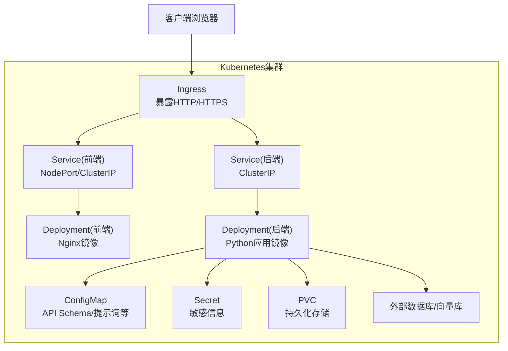
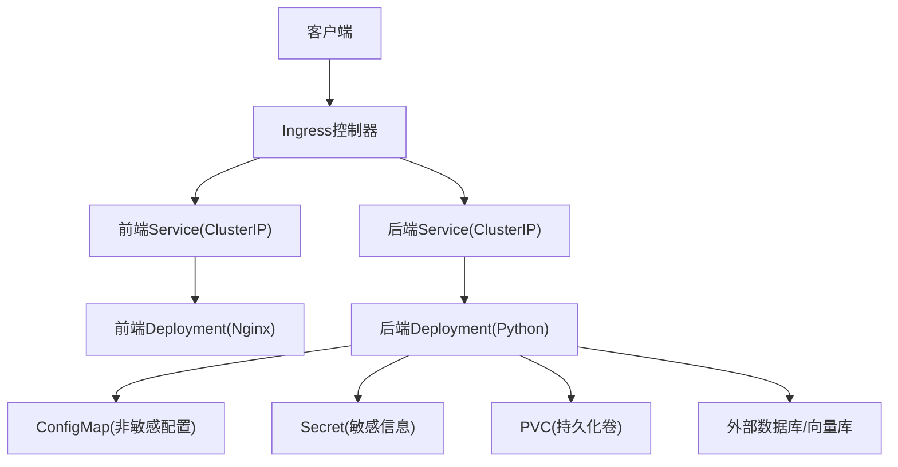
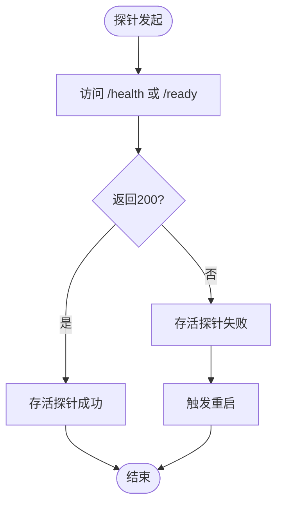
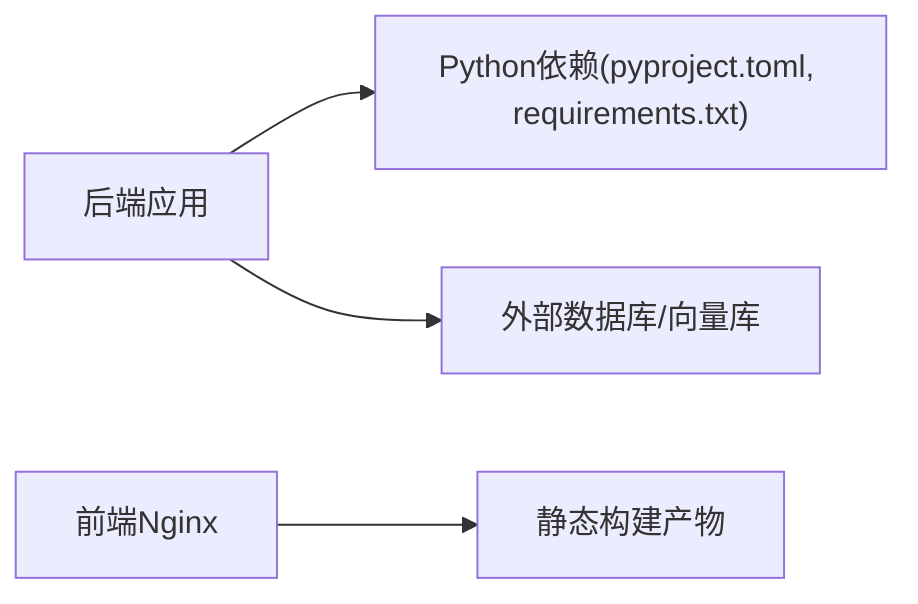

# Kubernetes部署

<cite>
**本文引用的文件**   
- [start.sh](file://start.sh)
- [pyproject.toml](file://pyproject.toml)
- [requirements.txt](file://requirements.txt)
- [src/loopse/main.py](file://src/loopse/main.py)
- [frontend/nginx.conf](file://frontend/nginx.conf)
- [config/api_schema.yaml](file://config/api_schema.yaml)
- [docs/deployment/操作手册_v1.md](file://docs/deployment/操作手册_v1.md)
- [docs/deployment/环境初始化说明.md](file://docs/deployment/环境初始化说明.md)
</cite>

## 目录
1. [简介](#简介)
2. [项目结构](#项目结构)
3. [核心组件](#核心组件)
4. [架构总览](#架构总览)
5. [详细组件分析](#详细组件分析)
6. [依赖关系分析](#依赖关系分析)
7. [性能与扩缩容](#性能与扩缩容)
8. [存储与备份恢复](#存储与备份恢复)
9. [监控与日志](#监控与日志)
10. [故障排查指南](#故障排查指南)
11. [生产调优建议](#生产调优建议)
12. [结论](#结论)

## 简介
本指南面向在Kubernetes集群中部署Socrates-Cube项目的工程团队，覆盖Deployment、Service、ConfigMap、Secret等核心资源的配置要点；阐述负载均衡策略、健康检查探针与滚动更新；提供Ingress控制器、TLS证书与域名绑定方案；包含HPA水平扩缩容、资源限制与QoS保证；说明持久化存储类、数据备份与灾难恢复策略；并给出监控日志收集、故障排查与生产环境调优建议。文档内容基于仓库现有脚本与配置文件进行归纳与扩展，确保可落地执行。

## 项目结构
从仓库可见，后端服务入口位于Python应用主程序，前端静态资源由Nginx托管，启动脚本用于本地或容器内快速拉起服务。部署时通常将前后端分别打包为镜像，并通过Kubernetes资源对象编排运行。

图表来源
- [src/loopse/main.py:1-200](file://src/loopse/main.py#L1-L200)
- [frontend/nginx.conf:1-200](file://frontend/nginx.conf#L1-L200)
- [start.sh:1-200](file://start.sh#L1-L200)

章节来源
- [src/loopse/main.py:1-200](file://src/loopse/main.py#L1-L200)
- [frontend/nginx.conf:1-200](file://frontend/nginx.conf#L1-L200)
- [start.sh:1-200](file://start.sh#L1-L200)

## 核心组件
- 后端服务：Python FastAPI/Flask（依据入口与路由组织），对外暴露REST API与健康检查接口。
- 前端服务：Nginx托管静态页面与SPA路由转发。
- 配置与密钥：通过ConfigMap注入非敏感配置，Secret管理敏感参数。
- 外部依赖：数据库、向量库、缓存等（根据业务需要挂载）。

章节来源
- [src/loopse/main.py:1-200](file://src/loopse/main.py#L1-L200)
- [config/api_schema.yaml:1-200](file://config/api_schema.yaml#L1-L200)
- [frontend/nginx.conf:1-200](file://frontend/nginx.conf#L1-L200)

## 架构总览
下图展示典型的生产级部署拓扑：Ingress统一入口，前端静态资源与后端API分离，配置与密钥通过Kubernetes原生对象注入，持久化数据通过PVC挂载，外部数据库独立部署。

图表来源
- [src/loopse/main.py:1-200](file://src/loopse/main.py#L1-L200)
- [frontend/nginx.conf:1-200](file://frontend/nginx.conf#L1-L200)
- [start.sh:1-200](file://start.sh#L1-L200)

## 详细组件分析

### 后端服务（Python应用）
- 进程模型：单进程或多进程（结合gunicorn/uwsgi或框架内置workers）。
- 端口监听：默认8000（参考常见FastAPI实践，具体以实际代码为准）。
- 健康检查：实现/health或/ready接口，返回状态码与必要指标。
- 配置加载：优先读取环境变量，其次读取ConfigMap挂载文件，最后使用默认值。
- 日志输出：标准输出到stdout/stderr，便于kubelet采集。

章节来源
- [src/loopse/main.py:1-200](file://src/loopse/main.py#L1-L200)
- [start.sh:1-200](file://start.sh#L1-L200)

#### 健康检查流程（概念图）

[此图为概念流程，不直接映射具体源码文件]

### 前端服务（Nginx）
- 静态资源：构建产物目录映射至Nginx工作目录。
- SPA路由：将所有未知路径重定向至index.html，由前端路由接管。
- 反向代理：可选将部分请求转发至后端API服务。
- 安全头：设置CSP、HSTS等安全响应头。

章节来源
- [frontend/nginx.conf:1-200](file://frontend/nginx.conf#L1-L200)

### 配置与密钥
- ConfigMap：存放api_schema.yaml、提示词模板等非敏感配置。
- Secret：存放数据库连接串、第三方API密钥等敏感信息。
- 挂载方式：环境变量或文件卷挂载，应用启动时读取。

章节来源
- [config/api_schema.yaml:1-200](file://config/api_schema.yaml#L1-L200)

### 启动脚本与环境初始化
- start.sh：封装应用启动命令、依赖安装、预热逻辑等。
- 环境初始化：数据库迁移、索引构建、种子数据导入等一次性任务。

章节来源
- [start.sh:1-200](file://start.sh#L1-L200)
- [docs/deployment/环境初始化说明.md:1-200](file://docs/deployment/环境初始化说明.md#L1-L200)

## 依赖关系分析
- 运行时依赖：Python包依赖由pyproject.toml与requirements.txt声明。
- 外部服务：数据库、向量库、缓存等通过环境变量或ConfigMap/Secret注入连接信息。
- 前端依赖：Nginx镜像与静态构建产物。

图表来源
- [pyproject.toml:1-200](file://pyproject.toml#L1-L200)
- [requirements.txt:1-200](file://requirements.txt#L1-L200)

章节来源
- [pyproject.toml:1-200](file://pyproject.toml#L1-L200)
- [requirements.txt:1-200](file://requirements.txt#L1-L200)

## 性能与扩缩容

### 资源限制与QoS
- 推荐为每个Deployment设置requests与limits，确保调度与OOM保护。
- QoS等级：Guaranteed > Burstable > BestEffort，按业务重要性选择。

章节来源
- [docs/deployment/操作手册_v1.md:1-200](file://docs/deployment/操作手册_v1.md#L1-L200)

### HPA水平扩缩容
- 指标：CPU、内存、自定义指标（如QPS、延迟）。
- 目标：维持目标利用率或自定义指标阈值。
- 行为：最小/最大副本数、冷却时间、稳定窗口。

章节来源
- [docs/deployment/操作手册_v1.md:1-200](file://docs/deployment/操作手册_v1.md#L1-L200)

### 滚动更新策略
- 策略类型：RollingUpdate。
- 关键参数：maxUnavailable、maxSurge、progressDeadlineSeconds。
- 回滚：kubectl rollout undo，配合快照与蓝绿/金丝雀发布。

章节来源
- [docs/deployment/操作手册_v1.md:1-200](file://docs/deployment/操作手册_v1.md#L1-L200)

### 负载均衡策略
- Service类型：ClusterIP（内部）、NodePort（调试）、LoadBalancer（云厂商）。
- 会话保持：按需开启sticky sessions（Ingress注解或TCP模式）。
- 权重路由：Ingress支持多后端权重分配。

章节来源
- [docs/deployment/操作手册_v1.md:1-200](file://docs/deployment/操作手册_v1.md#L1-L200)

## 存储与备份恢复

### 持久化存储类
- StorageClass：根据云厂商或本地存储（如Longhorn、Rook）定义。
- PVC/PV：按应用需求申请容量与IOPS，合理划分读写权限。
- 数据目录：将关键数据目录挂载至PVC，避免Pod重建丢失。

章节来源
- [docs/deployment/操作手册_v1.md:1-200](file://docs/deployment/操作手册_v1.md#L1-L200)

### 数据备份与灾难恢复
- 定期快照：利用存储快照或数据库原生工具定时备份。
- 异地容灾：跨可用区复制备份数据。
- 恢复演练：定期验证备份有效性，制定RTO/RPO目标。

章节来源
- [docs/deployment/操作手册_v1.md:1-200](file://docs/deployment/操作手册_v1.md#L1-L200)

## 监控与日志

### 监控
- 节点与集群：Prometheus + Grafana。
- 应用指标：导出HTTP指标、业务指标，接入Grafana面板。
- 告警：Alertmanager规则与通知渠道。

章节来源
- [docs/deployment/操作手册_v1.md:1-200](file://docs/deployment/操作手册_v1.md#L1-L200)

### 日志收集
- 采集器：Fluent Bit/Fluentd/Filebeat。
- 存储：Elasticsearch/OpenSearch或云日志服务。
- 查询：Kibana或云控制台。

章节来源
- [docs/deployment/操作手册_v1.md:1-200](file://docs/deployment/操作手册_v1.md#L1-L200)

## 故障排查指南

### 常见问题定位
- Pod无法启动：查看Events与日志，确认镜像拉取、资源配额、探针失败原因。
- 服务不可达：检查Service/Endpoints、Ingress规则、DNS解析。
- 配置未生效：确认ConfigMap/Secret版本与挂载路径。
- 性能问题：观察CPU/内存使用、GC、慢查询与外部依赖延迟。

章节来源
- [docs/deployment/操作手册_v1.md:1-200](file://docs/deployment/操作手册_v1.md#L1-L200)

### 健康检查与自愈
- Liveness探针：失败触发重启，恢复异常进程。
- Readiness探针：失败剔除流量，等待就绪后再接收请求。
- Startup探针：长启动场景下避免误杀。

章节来源
- [docs/deployment/操作手册_v1.md:1-200](file://docs/deployment/操作手册_v1.md#L1-L200)

## 生产调优建议
- 资源规划：按峰值负载估算requests/limits，预留缓冲。
- 副本数：至少2副本保障高可用，结合HPA弹性伸缩。
- 网络优化：关闭不必要的iptables跳转，启用eBPF/CNI优化。
- 存储IO：选择合适的StorageClass与IOPS，避免热点盘。
- 安全加固：最小权限原则、网络策略、镜像签名与漏洞扫描。

章节来源
- [docs/deployment/操作手册_v1.md:1-200](file://docs/deployment/操作手册_v1.md#L1-L200)

## 结论
通过合理的Kubernetes资源编排与生产级最佳实践，Socrates-Cube可在集群中获得高可用、可扩展与易运维的部署形态。建议结合CI/CD流水线实现自动化发布与回滚，持续完善监控告警与演练机制，确保业务稳定性与演进效率。