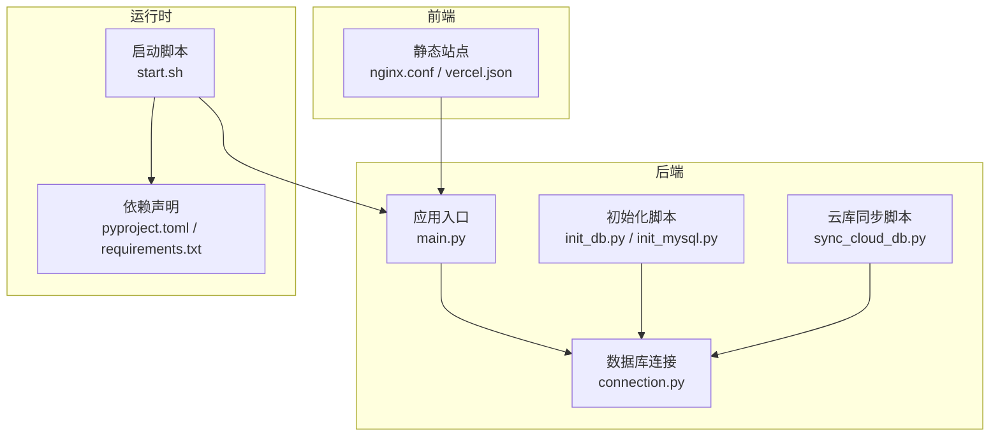
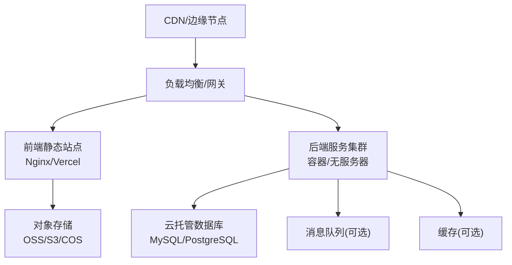
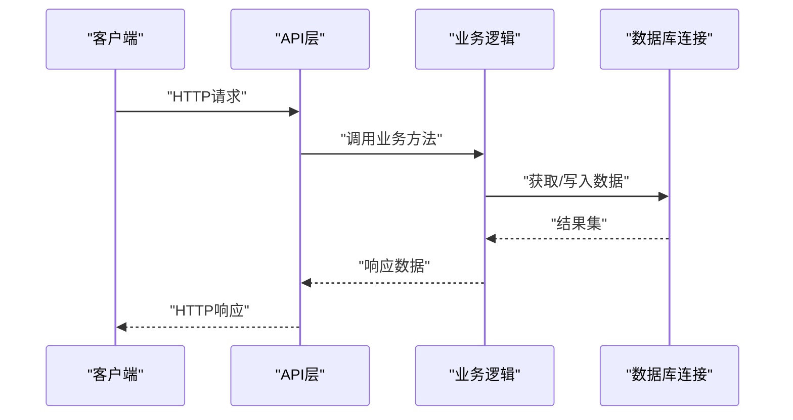
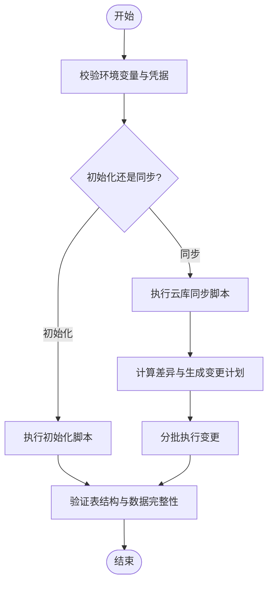
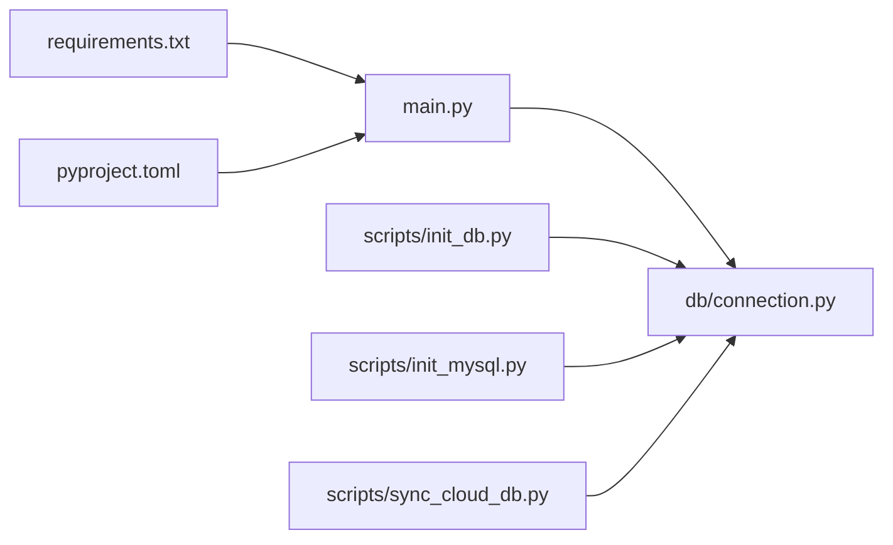

# 云平台部署

<cite>
**本文引用的文件**   
- [start.sh](file://start.sh)
- [pyproject.toml](file://pyproject.toml)
- [requirements.txt](file://requirements.txt)
- [src/loopse/main.py](file://src/loopse/main.py)
- [src/loopse/db/connection.py](file://src/loopse/db/connection.py)
- [scripts/init_db.py](file://scripts/init_db.py)
- [scripts/init_mysql.py](file://scripts/init_mysql.py)
- [scripts/sync_cloud_db.py](file://scripts/sync_cloud_db.py)
- [frontend/nginx.conf](file://frontend/nginx.conf)
- [frontend/vercel.json](file://frontend/vercel.json)
- [docs/deployment/环境初始化说明.md](file://docs/deployment/环境初始化说明.md)
- [docs/deployment/操作手册_v1.md](file://docs/deployment/操作手册_v1.md)
- [docs/deployment/官方硬指标核对清单.md](file://docs/deployment/官方硬指标核对清单.md)
</cite>

## 目录
1. [简介](#简介)
2. [项目结构](#项目结构)
3. [核心组件](#核心组件)
4. [架构总览](#架构总览)
5. [详细组件分析](#详细组件分析)
6. [依赖分析](#依赖分析)
7. [性能考虑](#性能考虑)
8. [故障排查指南](#故障排查指南)
9. [结论](#结论)
10. [附录](#附录)

## 简介
本指南面向在主流云平台（阿里云、腾讯云、AWS）上部署该项目的工程团队，覆盖容器化与Serverless适配、云原生服务集成、CI/CD流水线、自动化测试、灰度发布、监控告警、日志分析、性能调优、多云策略、数据同步与故障转移、以及各平台安全与合规要点。文档以仓库现有可执行脚本与配置为依据，结合通用云实践给出落地建议。

## 项目结构
后端采用Python应用，提供API与服务入口；前端为静态资源，可通过Nginx或Vercel托管；数据库初始化与数据同步通过脚本完成；部署启动由统一脚本驱动。

图表来源
- [src/loopse/main.py](file://src/loopse/main.py)
- [src/loopse/db/connection.py](file://src/loopse/db/connection.py)
- [scripts/init_db.py](file://scripts/init_db.py)
- [scripts/init_mysql.py](file://scripts/init_mysql.py)
- [scripts/sync_cloud_db.py](file://scripts/sync_cloud_db.py)
- [frontend/nginx.conf](file://frontend/nginx.conf)
- [frontend/vercel.json](file://frontend/vercel.json)
- [start.sh](file://start.sh)
- [pyproject.toml](file://pyproject.toml)
- [requirements.txt](file://requirements.txt)

章节来源
- [start.sh](file://start.sh)
- [pyproject.toml](file://pyproject.toml)
- [requirements.txt](file://requirements.txt)
- [src/loopse/main.py](file://src/loopse/main.py)
- [src/loopse/db/connection.py](file://src/loopse/db/connection.py)
- [scripts/init_db.py](file://scripts/init_db.py)
- [scripts/init_mysql.py](file://scripts/init_mysql.py)
- [scripts/sync_cloud_db.py](file://scripts/sync_cloud_db.py)
- [frontend/nginx.conf](file://frontend/nginx.conf)
- [frontend/vercel.json](file://frontend/vercel.json)

## 核心组件
- 应用入口与生命周期：后端主程序负责加载配置、初始化中间件、注册路由并启动服务进程。
- 数据库连接：集中管理连接池、重试与错误处理，支撑读写分离与多实例场景。
- 初始化与数据同步：提供本地/云端数据库初始化与增量同步能力，便于迁移与灾备。
- 前端静态站点：支持Nginx反向代理与Vercel托管两种模式。
- 启动脚本：封装依赖安装、环境变量校验、进程守护与优雅退出。

章节来源
- [src/loopse/main.py](file://src/loopse/main.py)
- [src/loopse/db/connection.py](file://src/loopse/db/connection.py)
- [scripts/init_db.py](file://scripts/init_db.py)
- [scripts/init_mysql.py](file://scripts/init_mysql.py)
- [scripts/sync_cloud_db.py](file://scripts/sync_cloud_db.py)
- [frontend/nginx.conf](file://frontend/nginx.conf)
- [frontend/vercel.json](file://frontend/vercel.json)
- [start.sh](file://start.sh)

## 架构总览
下图展示典型云上部署拓扑：前端通过CDN/网关接入，后端运行于容器或服务编排平台，数据库使用云托管RDS，对象存储用于静态资源与产物，消息队列与缓存按需引入。

[此图为概念性架构图，不直接映射具体源码文件]

## 详细组件分析

### 后端服务与数据库连接
- 服务启动流程：解析环境变量→初始化日志与中间件→注册路由→绑定端口→健康检查端点就绪。
- 连接管理：连接池参数、超时与重试策略、失败快速返回与熔断降级。
- 扩展点：插件式Agent与API模块可按需启用，避免冷启动开销。

图表来源
- [src/loopse/main.py](file://src/loopse/main.py)
- [src/loopse/db/connection.py](file://src/loopse/db/connection.py)

章节来源
- [src/loopse/main.py](file://src/loopse/main.py)
- [src/loopse/db/connection.py](file://src/loopse/db/connection.py)

### 数据库初始化与云同步
- 初始化：创建库表、填充种子数据、校验约束。
- 云同步：对比源与目标库差异，执行增量变更，支持幂等与回滚标记。
- 运维建议：在低峰期执行，开启事务与断点续传，记录审计日志。

图表来源
- [scripts/init_db.py](file://scripts/init_db.py)
- [scripts/init_mysql.py](file://scripts/init_mysql.py)
- [scripts/sync_cloud_db.py](file://scripts/sync_cloud_db.py)

章节来源
- [scripts/init_db.py](file://scripts/init_db.py)
- [scripts/init_mysql.py](file://scripts/init_mysql.py)
- [scripts/sync_cloud_db.py](file://scripts/sync_cloud_db.py)

### 前端静态站点与反向代理
- Nginx：提供静态资源缓存、压缩、HTTPS终止与跨域配置。
- Vercel：零配置部署，自动构建与预览分支，适合快速迭代。
- 最佳实践：开启HTTP/2、缓存策略分层、CDN预热与版本化路径。

章节来源
- [frontend/nginx.conf](file://frontend/nginx.conf)
- [frontend/vercel.json](file://frontend/vercel.json)

### 启动脚本与环境装配
- 职责：安装依赖、校验必需环境变量、拉起服务进程、信号处理与优雅停机。
- 可观测性：输出结构化日志、暴露健康检查端点、记录启动耗时。
- 容器化建议：只读根文件系统、非root用户运行、最小镜像。

章节来源
- [start.sh](file://start.sh)
- [pyproject.toml](file://pyproject.toml)
- [requirements.txt](file://requirements.txt)

## 依赖分析
- Python依赖：通过pyproject与requirements双声明，确保可复现构建。
- 外部服务：数据库、对象存储、消息队列与缓存均为可选依赖，按功能开关启用。
- 耦合关系：API层与Agent模块松耦合，通过接口契约通信，降低升级风险。

图表来源
- [requirements.txt](file://requirements.txt)
- [pyproject.toml](file://pyproject.toml)
- [src/loopse/main.py](file://src/loopse/main.py)
- [src/loopse/db/connection.py](file://src/loopse/db/connection.py)
- [scripts/init_db.py](file://scripts/init_db.py)
- [scripts/init_mysql.py](file://scripts/init_mysql.py)
- [scripts/sync_cloud_db.py](file://scripts/sync_cloud_db.py)

章节来源
- [requirements.txt](file://requirements.txt)
- [pyproject.toml](file://pyproject.toml)
- [src/loopse/main.py](file://src/loopse/main.py)
- [src/loopse/db/connection.py](file://src/loopse/db/connection.py)
- [scripts/init_db.py](file://scripts/init_db.py)
- [scripts/init_mysql.py](file://scripts/init_mysql.py)
- [scripts/sync_cloud_db.py](file://scripts/sync_cloud_db.py)

## 性能考虑
- 连接池与超时：根据QPS与延迟目标调整最大连接数、空闲回收与查询超时。
- 水平扩展：无状态服务横向扩容，会话外置至缓存或分布式存储。
- 缓存策略：热点数据多级缓存（本地+分布式），设置合理TTL与失效策略。
- 异步与批处理：将长任务放入队列，批量写入数据库，降低锁竞争。
- 前端优化：静态资源版本化、CDN缓存、图片懒加载与按需加载。

[本节为通用性能建议，不直接分析具体文件]

## 故障排查指南
- 启动失败：检查环境变量、依赖安装、端口占用与权限。
- 数据库异常：确认网络连通、账号权限、字符集与时区一致。
- 同步中断：查看同步脚本日志，定位差异阶段，必要时回滚到最近快照。
- 前端访问异常：核对域名解析、证书、CORS与缓存命中情况。
- 健康检查：通过健康端点判断服务可用性，结合探针进行自愈。

章节来源
- [start.sh](file://start.sh)
- [src/loopse/db/connection.py](file://src/loopse/db/connection.py)
- [scripts/sync_cloud_db.py](file://scripts/sync_cloud_db.py)
- [frontend/nginx.conf](file://frontend/nginx.conf)

## 结论
本项目具备清晰的模块化结构与可复用的部署脚本，适合在主流云平台进行容器化或Serverless部署。通过云原生服务集成、完善的监控与自动化流水线，可实现高可用、低成本与快速交付。建议在多云环境下统一抽象基础设施层，实现一致的部署与治理体验。

[本节为总结性内容，不直接分析具体文件]

## 附录

### 阿里云部署要点
- 计算：ACK（Kubernetes）或函数计算FC（Serverless）。
- 数据库：RDS MySQL/PostgreSQL，开启备份与高可用。
- 对象存储：OSS，配合CDN加速静态资源。
- 网关与负载均衡：ALB/SLB + API网关。
- 监控与日志：ARMS、SLS、Prometheus。
- 安全与合规：RAM、KMS、WAF、等保合规。

### 腾讯云部署要点
- 计算：TKE（Kubernetes）或SCF（Serverless）。
- 数据库：TDSQL/MySQL，开启容灾与只读实例。
- 对象存储：COS，搭配CDN。
- 网关与负载均衡：CLB + API网关。
- 监控与日志：CloudMonitor、CLS。
- 安全与合规：CAM、KMS、WAF、密评与等保。

### AWS部署要点
- 计算：EKS（Kubernetes）或Lambda（Serverless）。
- 数据库：RDS/Aurora，Multi-AZ与Read Replicas。
- 对象存储：S3 + CloudFront。
- 网关与负载均衡：ALB/API Gateway。
- 监控与日志：CloudWatch、X-Ray、OpenSearch。
- 安全与合规：IAM、KMS、WAF、SOC/ISO/等保对标。

[本节为通用平台实践，不直接分析具体文件]

### Serverless架构适配
- 触发器：HTTP API、事件总线、定时任务。
- 状态与持久化：外部数据库与对象存储承载状态。
- 冷启动优化：预初始化连接、轻量镜像、按需加载。
- 限流与熔断：网关层限流、幂等键与重试退避。

[本节为概念性指导，不直接分析具体文件]

### CI/CD流水线与自动化测试
- 代码质量：静态扫描、依赖漏洞检测、单元测试覆盖率。
- 构建与打包：多阶段Docker构建、镜像签名与扫描。
- 部署策略：蓝绿/金丝雀发布、滚动更新与回滚。
- 测试矩阵：单元、集成、端到端与性能基准。

[本节为通用CI/CD建议，不直接分析具体文件]

### 灰度发布方案
- 流量切分：基于权重或用户标识的灰度规则。
- 观察指标：错误率、延迟、饱和度与业务转化率。
- 自动回滚：阈值触发自动回滚与告警通知。

[本节为概念性指导，不直接分析具体文件]

### 云监控告警与日志分析
- 指标采集：系统、应用与业务指标。
- 告警策略：多通道通知、抑制与降噪。
- 日志聚合：结构化日志、索引与检索、保留策略。

[本节为通用监控建议，不直接分析具体文件]

### 多云部署策略、数据同步与故障转移
- 多云策略：统一抽象层、配置中心与密钥管理。
- 数据同步：CDC与增量同步、冲突解决与一致性校验。
- 故障转移：DNS/全局负载均衡切换、只读优先与降级策略。

[本节为概念性指导，不直接分析具体文件]

### 安全配置与合规要求
- 身份与访问控制：最小权限、角色分离与临时凭证。
- 数据安全：传输加密、静态加密、脱敏与审计。
- 合规框架：等保、密评、GDPR/CCPA等适用法规。

[本节为通用安全建议，不直接分析具体文件]

### 参考文档与清单
- 环境初始化说明：包含前置条件、变量清单与常见排错。
- 操作手册：日常运维、扩缩容与备份恢复流程。
- 硬指标核对清单：容量、并发、延迟与可用性目标对照。

章节来源
- [docs/deployment/环境初始化说明.md](file://docs/deployment/环境初始化说明.md)
- [docs/deployment/操作手册_v1.md](file://docs/deployment/操作手册_v1.md)
- [docs/deployment/官方硬指标核对清单.md](file://docs/deployment/官方硬指标核对清单.md)